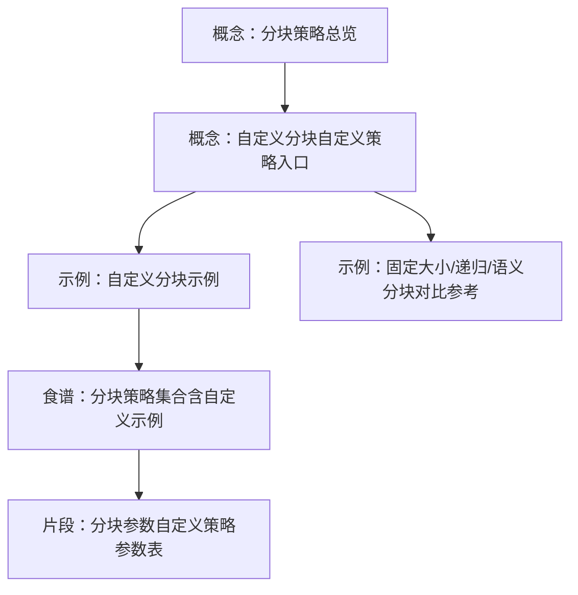
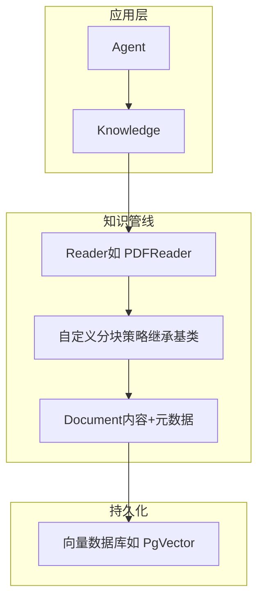
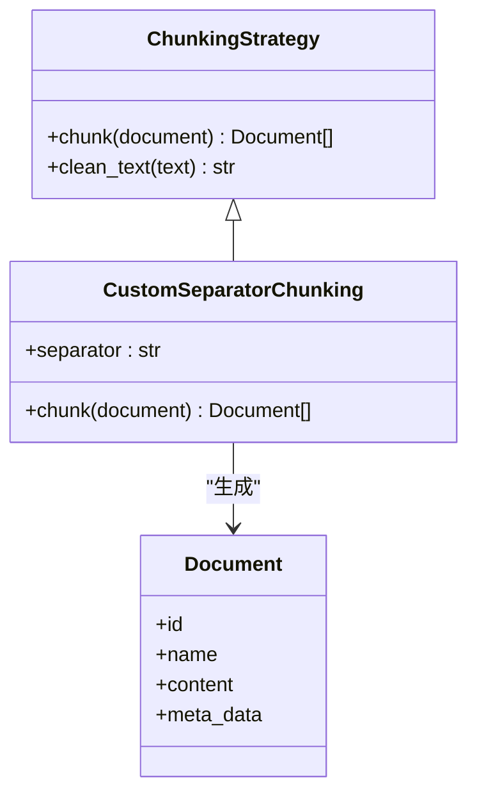
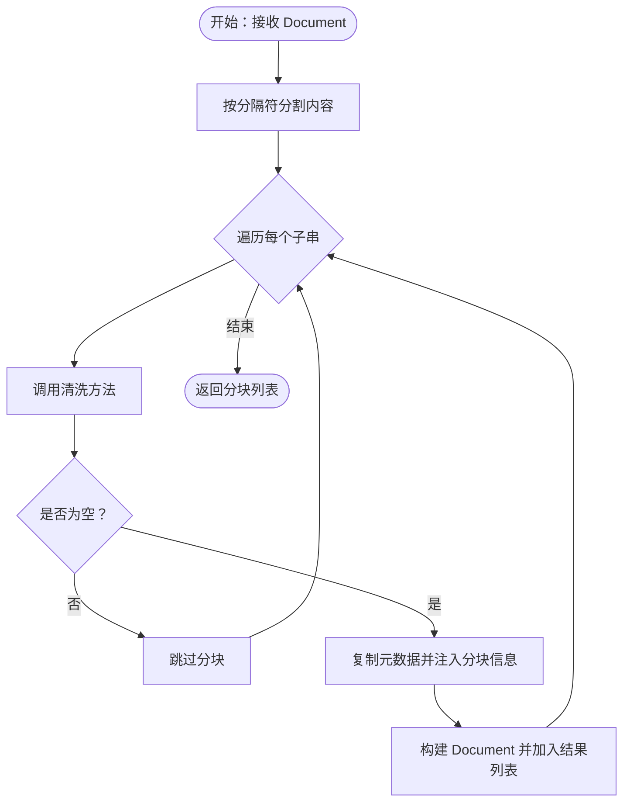
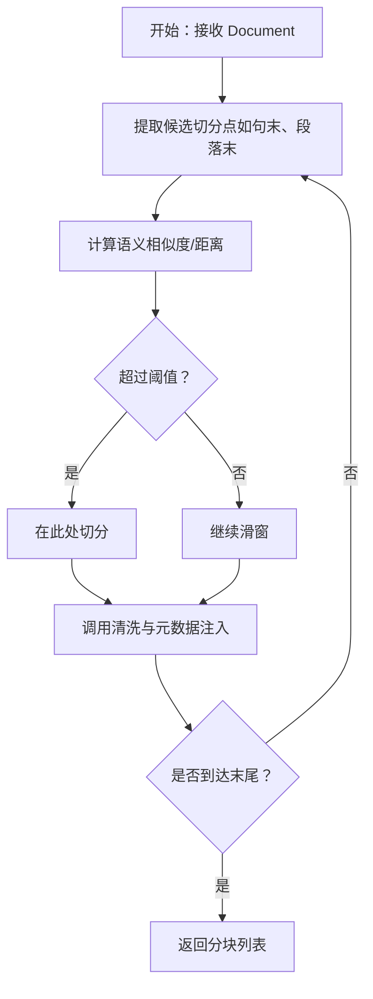
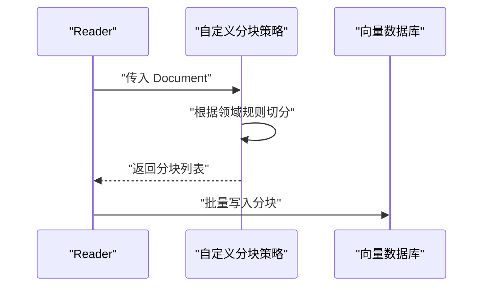
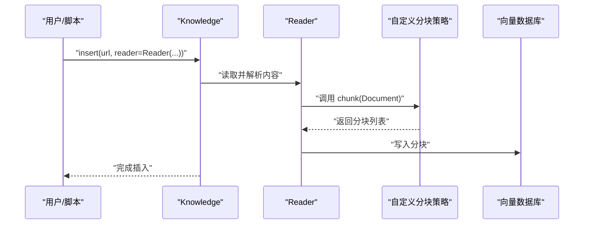
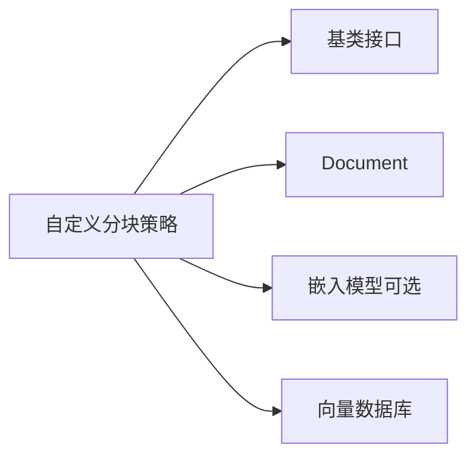

# 自定义分块

<cite>
**本文引用的文件**
- [自定义分块（概念）.mdx](file://knowledge/concepts/chunking/custom-chunking.mdx)
- [分块策略总览（概念）.mdx](file://knowledge/concepts/chunking/overview.mdx)
- [自定义分块示例（示例）.mdx](file://examples/knowledge/chunking/custom-strategy-example.mdx)
- [分块策略集合（食谱）.mdx](file://cookbook/knowledge/chunking.mdx)
- [固定大小分块（示例）.mdx](file://examples/knowledge/chunking/fixed-size-chunking.mdx)
- [递归分块（示例）.mdx](file://examples/knowledge/chunking/recursive-chunking.mdx)
- [语义分块（示例）.mdx](file://examples/knowledge/chunking/semantic-chunking.mdx)
- [分块参数（片段）.mdx](file://_snippets/chunking-custom.mdx)
</cite>

## 目录
1. [引言](#引言)
2. [项目结构](#项目结构)
3. [核心组件](#核心组件)
4. [架构总览](#架构总览)
5. [详细组件分析](#详细组件分析)
6. [依赖分析](#依赖分析)
7. [性能考虑](#性能考虑)
8. [故障排查指南](#故障排查指南)
9. [结论](#结论)
10. [附录](#附录)

## 引言
本指南面向需要在现有知识库系统中实现“自定义分块策略”的开发者。我们将从接口与基类出发，讲解如何继承并实现分块策略，给出从简单到复杂（基于规则、机器学习驱动）的完整实现路径，并覆盖测试、验证、集成、性能优化与错误处理的最佳实践。

## 项目结构
围绕“自定义分块”，仓库提供了多层级资料：
- 概念层：介绍分块策略类型与自定义入口
- 示例层：提供可运行的分块策略示例脚本
- 食谱层：汇总各类策略的使用方式与参数说明
- 片段层：参数表与关键步骤提示

图表来源
- [分块策略总览（概念）.mdx:28-62](file://knowledge/concepts/chunking/overview.mdx#L28-L62)
- [自定义分块（概念）.mdx:1-87](file://knowledge/concepts/chunking/custom-chunking.mdx#L1-L87)
- [自定义分块示例（示例）.mdx:1-123](file://examples/knowledge/chunking/custom-strategy-example.mdx#L1-L123)
- [分块策略集合（食谱）.mdx:1-217](file://cookbook/knowledge/chunking.mdx#L1-L217)
- [分块参数（片段）.mdx:1-4](file://_snippets/chunking-custom.mdx#L1-L4)

章节来源
- [分块策略总览（概念）.mdx:28-62](file://knowledge/concepts/chunking/overview.mdx#L28-L62)
- [自定义分块（概念）.mdx:1-87](file://knowledge/concepts/chunking/custom-chunking.mdx#L1-L87)
- [分块策略集合（食谱）.mdx:1-217](file://cookbook/knowledge/chunking.mdx#L1-L217)

## 核心组件
- 分块策略基类与接口
  - 自定义分块策略需继承基类并实现核心方法，以统一接入知识库的插入与检索流程。
  - 基类通常提供通用文本清洗能力，便于保持不同策略间的一致性。
- 文档对象
  - 策略接收与返回的文档对象承载内容与元数据，是策略与向量库、检索器之间的桥梁。
- 知识库与阅读器
  - 知识库在插入阶段调用阅读器，阅读器再委托分块策略进行切分；最终将分块写入向量数据库。

章节来源
- [自定义分块（概念）.mdx:6-6](file://knowledge/concepts/chunking/custom-chunking.mdx#L6-L6)
- [自定义分块示例（示例）.mdx:18-75](file://examples/knowledge/chunking/custom-strategy-example.mdx#L18-L75)

## 架构总览
下图展示了“自定义分块策略”在知识库系统中的位置与交互关系。

图表来源
- [自定义分块示例（示例）.mdx:78-105](file://examples/knowledge/chunking/custom-strategy-example.mdx#L78-L105)
- [分块策略集合（食谱）.mdx:184-199](file://cookbook/knowledge/chunking.mdx#L184-L199)

## 详细组件分析

### 组件A：自定义分块策略类
- 必须实现的方法
  - 策略入口：实现分块逻辑，接收单个文档对象，返回多个分块文档对象列表。
  - 文本清洗：复用基类提供的文本清洗方法，确保分块前后的文本一致性。
- 元数据与标识
  - 复制原始元数据并在其中注入分块维度信息（如分块序号、策略名称、分隔符等），便于后续溯源与评估。
- 参数设计
  - 将策略所需的参数（如分隔符、窗口大小、阈值等）作为构造函数参数，支持灵活配置。

图表来源
- [自定义分块（概念）.mdx:21-41](file://knowledge/concepts/chunking/custom-chunking.mdx#L21-L41)
- [自定义分块示例（示例）.mdx:18-75](file://examples/knowledge/chunking/custom-strategy-example.mdx#L18-L75)

章节来源
- [自定义分块（概念）.mdx:6-42](file://knowledge/concepts/chunking/custom-chunking.mdx#L6-L42)
- [自定义分块示例（示例）.mdx:18-75](file://examples/knowledge/chunking/custom-strategy-example.mdx#L18-L75)

### 组件B：从简单到复杂的实现路径

#### 路径一：基于规则的分块（示例：按分隔符切分）
- 思路
  - 使用固定或可配置的分隔符对文档内容进行分割。
  - 对每个子串执行文本清洗，过滤空内容，保留原元数据并注入分块维度信息。
- 关键点
  - 分隔符选择应贴合业务文档结构（如标题、表格、段落分隔）。
  - 保证分块后的内容仍具备可读性与上下文连贯性。

图表来源
- [自定义分块示例（示例）.mdx:45-75](file://examples/knowledge/chunking/custom-strategy-example.mdx#L45-L75)

章节来源
- [自定义分块示例（示例）.mdx:5-106](file://examples/knowledge/chunking/custom-strategy-example.mdx#L5-L106)

#### 路径二：机器学习驱动的分块（思路与扩展）
- 思路
  - 在策略内部引入嵌入模型或相似度计算，识别语义边界，动态决定切分点。
  - 可结合窗口滑动、聚类或滑动阈值等算法，提升语义完整性。
- 关键点
  - 控制分块大小与重叠，避免跨语义主题切分。
  - 通过元数据记录切分依据（如相似度阈值、窗口索引），便于回溯与调参。

图表来源
- [分块策略集合（食谱）.mdx:36-66](file://cookbook/knowledge/chunking.mdx#L36-L66)

章节来源
- [分块策略集合（食谱）.mdx:36-66](file://cookbook/knowledge/chunking.mdx#L36-L66)

#### 路径三：领域特定分块（示例：代码、Markdown、CSV）
- 代码分块：按函数/类边界切分，保留语法结构。
- Markdown 分块：按标题层级切分，保持小节独立性。
- CSV 行分块：每行作为一个块，可选保留表头。

图表来源
- [分块策略集合（食谱）.mdx:101-147](file://cookbook/knowledge/chunking.mdx#L101-L147)

章节来源
- [分块策略集合（食谱）.mdx:101-147](file://cookbook/knowledge/chunking.mdx#L101-L147)

### 组件C：与知识库系统的集成
- 插入流程
  - 在知识库插入时指定阅读器，并将自定义分块策略实例传给阅读器。
  - 阅读器负责解析源内容，随后由策略进行切分，最后写入向量库。
- 查询与检索
  - 检索阶段可利用分块元数据进行二次过滤或重排序（例如按分块序号、策略名等）。

图表来源
- [自定义分块示例（示例）.mdx:81-98](file://examples/knowledge/chunking/custom-strategy-example.mdx#L81-L98)
- [分块策略集合（食谱）.mdx:184-199](file://cookbook/knowledge/chunking.mdx#L184-L199)

章节来源
- [自定义分块示例（示例）.mdx:78-105](file://examples/knowledge/chunking/custom-strategy-example.mdx#L78-L105)
- [分块策略集合（食谱）.mdx:184-199](file://cookbook/knowledge/chunking.mdx#L184-L199)

## 依赖分析
- 组件耦合
  - 自定义分块策略仅依赖基类接口与文档对象，耦合度低，易于替换与扩展。
  - 与阅读器、向量库之间通过标准接口解耦，便于横向扩展。
- 外部依赖
  - 向量数据库（如 PgVector）用于存储与检索分块。
  - 可选嵌入模型用于语义分块策略（见语义分块示例）。

图表来源
- [分块策略集合（食谱）.mdx:36-66](file://cookbook/knowledge/chunking.mdx#L36-L66)
- [自定义分块示例（示例）.mdx:11-15](file://examples/knowledge/chunking/custom-strategy-example.mdx#L11-L15)

章节来源
- [分块策略集合（食谱）.mdx:36-66](file://cookbook/knowledge/chunking.mdx#L36-L66)
- [自定义分块示例（示例）.mdx:11-15](file://examples/knowledge/chunking/custom-strategy-example.mdx#L11-L15)

## 性能考虑
- 文本清洗与编码
  - 清洗逻辑应尽量轻量，避免重复正则或昂贵操作；必要时缓存中间结果。
- 切分粒度与重叠
  - 过小的块会增加向量库写入与查询开销；过大的块可能降低检索精度。建议通过实验确定最优块大小与重叠比例。
- 批量写入
  - 向量库写入采用批量提交，减少网络往返与事务开销。
- 语义分块的代价
  - 嵌入计算成本较高，建议在离线批处理或异步队列中执行，避免阻塞主线程。
- 内存与流式处理
  - 对超大文档，优先考虑流式读取与分块，避免一次性加载至内存。

## 故障排查指南
- 常见问题
  - 分块后内容为空：检查清洗逻辑与过滤条件，确保非空分块才写入。
  - 元数据丢失：确认复制原始元数据并正确注入分块维度字段。
  - 向量库写入失败：核对连接参数、表结构与字段长度限制。
- 调试建议
  - 输出分块数量与平均长度统计，定位异常块。
  - 记录分块策略参数与输入文档摘要，便于复现与回归。
  - 在阅读器与策略之间增加日志钩子，观察关键节点耗时。

章节来源
- [自定义分块示例（示例）.mdx:55-75](file://examples/knowledge/chunking/custom-strategy-example.mdx#L55-L75)

## 结论
通过继承基类并实现分块方法，你可以快速构建符合业务需求的自定义分块策略。从简单的规则分块到语义/机器学习驱动的分块，均可在不破坏现有知识库架构的前提下平滑集成。配合完善的测试、验证与性能优化实践，能够显著提升检索质量与系统稳定性。

## 附录

### A. 自定义分块策略参数表
- 关键参数
  - 分隔符：用于规则分块的字符串分隔标记。
  - 其他可选参数：最大词数、最小长度、重叠长度、策略名称等（视具体策略而定）。

章节来源
- [分块参数（片段）.mdx:1-4](file://_snippets/chunking-custom.mdx#L1-L4)

### B. 对比参考：固定大小/递归/语义分块
- 固定大小分块：按字符/令牌计数均匀切分，适合简单文档。
- 递归分块：按层级分隔符依次切分，适合结构化文档。
- 语义分块：基于相似度聚类，适合长文档与复杂语义场景。

章节来源
- [固定大小分块（示例）.mdx:1-48](file://examples/knowledge/chunking/fixed-size-chunking.mdx#L1-L48)
- [递归分块（示例）.mdx:1-49](file://examples/knowledge/chunking/recursive-chunking.mdx#L1-L49)
- [语义分块（示例）.mdx:1-61](file://examples/knowledge/chunking/semantic-chunking.mdx#L1-L61)