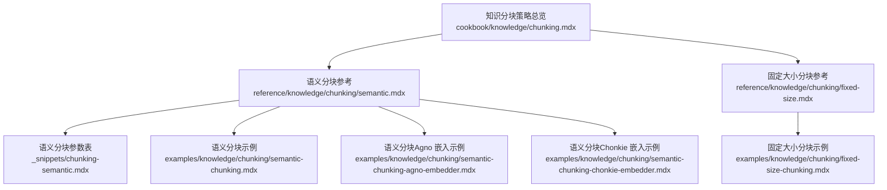
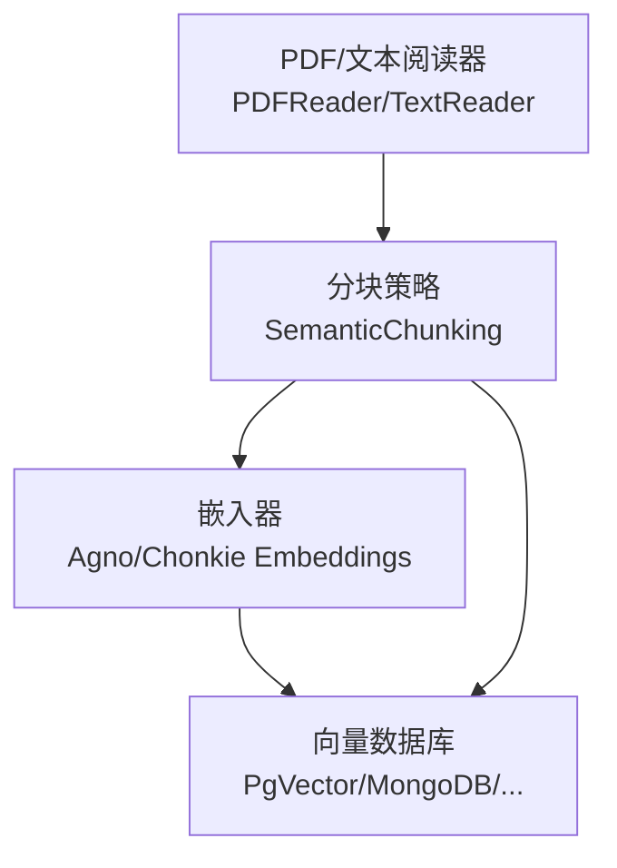
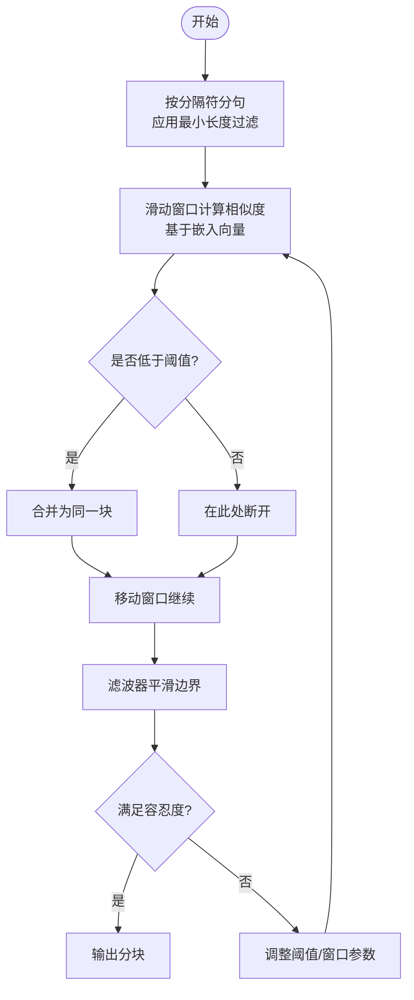
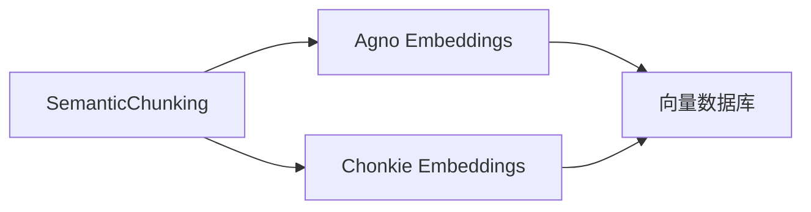

# 语义分块

<cite>
**本文引用的文件**
- [语义分块参考](file://reference/knowledge/chunking/semantic.mdx)
- [分块策略总览](file://cookbook/knowledge/chunking.mdx)
- [语义分块参数表](file://_snippets/chunking-semantic.mdx)
- [固定大小分块参考](file://reference/knowledge/chunking/fixed-size.mdx)
- [固定大小分块示例](file://examples/knowledge/chunking/fixed-size-chunking.mdx)
- [语义分块（Chonkie 嵌入）示例](file://examples/knowledge/chunking/semantic-chunking-chonkie-embedder.mdx)
- [语义分块（Agno 嵌入）示例](file://examples/knowledge/chunking/semantic-chunking-agno-embedder.mdx)
- [语义分块示例](file://examples/knowledge/chunking/semantic-chunking.mdx)
</cite>

## 目录
1. [简介](#简介)
2. [项目结构](#项目结构)
3. [核心组件](#核心组件)
4. [架构概览](#架构概览)
5. [详细组件分析](#详细组件分析)
6. [依赖关系分析](#依赖关系分析)
7. [性能考量](#性能考量)
8. [故障排查指南](#故障排查指南)
9. [结论](#结论)
10. [附录](#附录)

## 简介
本文件系统化阐述“语义分块”策略：它通过分析文本片段之间的语义相似性，自动识别自然的分块边界，从而在不破坏上下文完整性的前提下提升检索与生成效果。相比“固定大小分块”，语义分块更关注内容的语义连续性，能够在段落、主题或话题切换处自然断开，避免将同一语义单元强行切分到不同块中。

语义分块的核心在于利用嵌入向量计算句子间的相似度，并以可配置的相似度阈值作为分组边界判断依据。同时，通过窗口大小、最小句数、分隔符、滤波器等参数，可以进一步控制分块粒度与边界检测的稳健性。

## 项目结构
围绕“语义分块”的知识体系由三类文档构成：
- 参考与概念：介绍语义分块的原理、适用场景与与其他策略的差异
- 参数与示例：提供参数清单、典型用法与多嵌入模型示例
- 对比与实践：固定大小分块作为对照，展示语义分块在保持内容完整性方面的优势

**图表来源**
- [分块策略总览:1-217](file://cookbook/knowledge/chunking.mdx#L1-L217)
- [语义分块参考:1-12](file://reference/knowledge/chunking/semantic.mdx#L1-L12)
- [固定大小分块参考:1-11](file://reference/knowledge/chunking/fixed-size.mdx#L1-L11)
- [语义分块参数表:1-16](file://_snippets/chunking-semantic.mdx#L1-L16)
- [语义分块示例:1-61](file://examples/knowledge/chunking/semantic-chunking.mdx#L1-L61)
- [语义分块（Agno 嵌入）示例:1-66](file://examples/knowledge/chunking/semantic-chunking-agno-embedder.mdx#L1-L66)
- [语义分块（Chonkie 嵌入）示例:1-72](file://examples/knowledge/chunking/semantic-chunking-chonkie-embedder.mdx#L1-L72)
- [固定大小分块示例:1-48](file://examples/knowledge/chunking/fixed-size-chunking.mdx#L1-L48)

**章节来源**
- [分块策略总览:1-217](file://cookbook/knowledge/chunking.mdx#L1-L217)
- [语义分块参考:1-12](file://reference/knowledge/chunking/semantic.mdx#L1-L12)
- [固定大小分块参考:1-11](file://reference/knowledge/chunking/fixed-size.mdx#L1-L11)

## 核心组件
- 语义分块策略：基于嵌入相似度的自适应分块方法，强调在语义变化处断开，避免机械的字符/令牌计数切分
- 嵌入模型适配：支持 Agno 嵌入器与 Chonkie 嵌入器，便于在不同向量数据库与分块阶段灵活选择
- 边界检测与稳健性：通过窗口大小、滤波器参数与容忍度，提升边界识别的鲁棒性
- 与固定大小分块的对比：固定大小分块简单高效但易破坏语义连贯性；语义分块更贴合检索与问答需求

**章节来源**
- [语义分块参考:6-8](file://reference/knowledge/chunking/semantic.mdx#L6-L8)
- [分块策略总览:21-32](file://cookbook/knowledge/chunking.mdx#L21-L32)
- [固定大小分块参考:6-7](file://reference/knowledge/chunking/fixed-size.mdx#L6-L7)

## 架构概览
下图展示了“语义分块”在知识处理流水线中的位置与交互：阅读器负责读取文档并应用分块策略，分块策略调用嵌入器生成向量，再根据相似度与边界检测规则输出语义块，最终写入向量数据库供检索使用。

**图表来源**
- [分块策略总览:9-18](file://cookbook/knowledge/chunking.mdx#L9-L18)
- [语义分块示例:14-36](file://examples/knowledge/chunking/semantic-chunking.mdx#L14-L36)
- [语义分块（Agno 嵌入）示例:15-41](file://examples/knowledge/chunking/semantic-chunking-agno-embedder.mdx#L15-L41)
- [语义分块（Chonkie 嵌入）示例:16-47](file://examples/knowledge/chunking/semantic-chunking-chonkie-embedder.mdx#L16-L47)

## 详细组件分析

### 语义分块参数与工作机制
- similarity_threshold：相似度阈值，用于判断相邻句子是否属于同一语义组。数值越低，越容易将多个句子合并为一个块，块更大、数量更少；数值越高，越倾向于在语义变化处断开，块更细、数量更多
- similarity_window：参与相似度计算的前后句窗口大小，影响边界检测对局部上下文的敏感度
- min_sentences_per_chunk：每块最少包含的句子数，避免产生过小的碎片
- min_characters_per_sentence：句子最小长度阈值，过滤噪声或异常短句
- delimiters/include_delimiters：分句使用的分隔符及是否保留分隔符，影响边界附近文本的拼接方式
- skip_window：跳过窗口，允许非连续但语义相似的组被合并，提升长文档的主题一致性
- filter_window/filter_polyorder/filter_tolerance：Savitzky-Golay 滤波器参数，用于平滑相似度曲线并更稳健地定位边界

**图表来源**
- [语义分块参数表:3-16](file://_snippets/chunking-semantic.mdx#L3-L16)

**章节来源**
- [语义分块参数表:1-16](file://_snippets/chunking-semantic.mdx#L1-L16)

### 与固定大小分块的对比
- 固定大小分块：按字符/令牌数切分，简单稳定，但可能在句首句尾截断关键信息，导致检索时丢失上下文
- 语义分块：在语义变化处断开，更贴合检索与问答需求，能更好地保持语义完整性
- 实践建议：对于长文档、学术论文、技术规范等，优先采用语义分块；对极短文本或严格控制令牌预算的场景，可结合重叠策略使用固定大小分块作为补充

**章节来源**
- [固定大小分块参考:6-7](file://reference/knowledge/chunking/fixed-size.mdx#L6-L7)
- [固定大小分块示例:18-24](file://examples/knowledge/chunking/fixed-size-chunking.mdx#L18-L24)

### 使用不同嵌入模型进行语义分析
- Agno 嵌入器：通过 Agno 的嵌入器实例作为分块与向量库的统一配置，适合端到端一致的向量化流程
- Chonkie 嵌入器：仅用于分块阶段的嵌入计算，向量库仍可用 Agno 嵌入器，实现分块与存储阶段的解耦
- 示例路径：
  - [语义分块（Agno 嵌入）示例:15-41](file://examples/knowledge/chunking/semantic-chunking-agno-embedder.mdx#L15-L41)
  - [语义分块（Chonkie 嵌入）示例:16-47](file://examples/knowledge/chunking/semantic-chunking-chonkie-embedder.mdx#L16-L47)

**章节来源**
- [语义分块（Agno 嵌入）示例:15-41](file://examples/knowledge/chunking/semantic-chunking-agno-embedder.mdx#L15-L41)
- [语义分块（Chonkie 嵌入）示例:16-47](file://examples/knowledge/chunking/semantic-chunking-chonkie-embedder.mdx#L16-L47)

### 针对特定内容类型的优化建议
- 自然语言文本：提高 similarity_threshold 以减少跨主题切分；适当增大 similarity_window 提升稳定性
- 技术文档/代码注释：结合“代码分块”策略，先按结构分块，再在块内使用语义分块细化
- 结构化文档（报告、合同）：优先使用“文档分块”保留段落与节边界，再在段落内做语义分块
- 多语言混合：确保所选嵌入模型覆盖目标语言；必要时降低 similarity_threshold 并启用滤波器

**章节来源**
- [分块策略总览:21-32](file://cookbook/knowledge/chunking.mdx#L21-L32)

## 依赖关系分析
- 分块策略依赖嵌入器生成向量，进而计算相似度
- 向量数据库依赖嵌入器生成的向量维度与归一化策略
- 不同嵌入器（Agno/Chonkie）可独立配置，实现分块与存储阶段的解耦

**图表来源**
- [语义分块（Chonkie 嵌入）示例:16-21](file://examples/knowledge/chunking/semantic-chunking-chonkie-embedder.mdx#L16-L21)
- [语义分块（Agno 嵌入）示例:15-20](file://examples/knowledge/chunking/semantic-chunking-agno-embedder.mdx#L15-L20)

**章节来源**
- [语义分块（Chonkie 嵌入）示例:16-21](file://examples/knowledge/chunking/semantic-chunking-chonkie-embedder.mdx#L16-L21)
- [语义分块（Agno 嵌入）示例:15-20](file://examples/knowledge/chunking/semantic-chunking-agno-embedder.mdx#L15-L20)

## 性能考量
- 计算复杂度：相似度计算与滑动窗口遍历带来额外开销，建议在批量入库前预估令牌与时间成本
- 嵌入延迟：选择轻量级嵌入模型或缓存常用文本的嵌入结果，有助于降低整体延迟
- 存储与索引：向量维度与索引类型会影响查询性能，需与分块策略协同优化
- 参数调优：从默认阈值出发，结合业务召回效果迭代调整 similarity_threshold 与滤波器参数

## 故障排查指南
- 分块过多或过少
  - 过多：降低 similarity_threshold 或减小 similarity_window
  - 过少：提高 similarity_threshold 或增大 similarity_window
- 边界不稳定
  - 启用滤波器（filter_window、filter_polyorder、filter_tolerance），提升边界稳健性
- 语义断裂
  - 增大 similarity_window 或启用 skip_window，允许非连续但语义相近的段落合并
- 最小句数与分隔符
  - 调整 min_sentences_per_chunk 与 delimiters，确保边界附近文本拼接合理

**章节来源**
- [语义分块参数表:3-16](file://_snippets/chunking-semantic.mdx#L3-L16)

## 结论
语义分块通过嵌入相似度与稳健的边界检测，在保持内容语义完整性方面显著优于固定大小分块。结合合适的嵌入模型与参数调优，可在不同内容类型与业务场景中取得更佳的检索与问答效果。建议在实际部署中以默认参数起步，结合召回指标逐步微调 similarity_threshold、窗口与滤波器参数，并根据数据特征选择 Agno 或 Chonkie 嵌入器以满足端到端一致性或阶段解耦的需求。

## 附录
- 快速上手示例
  - [语义分块示例:14-36](file://examples/knowledge/chunking/semantic-chunking.mdx#L14-L36)
  - [固定大小分块示例:14-24](file://examples/knowledge/chunking/fixed-size-chunking.mdx#L14-L24)
- 参数速查
  - [语义分块参数表:1-16](file://_snippets/chunking-semantic.mdx#L1-L16)