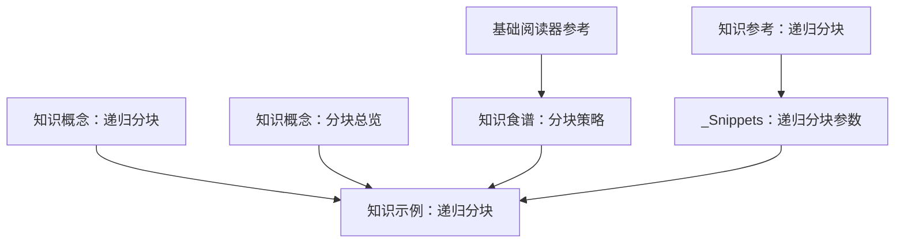
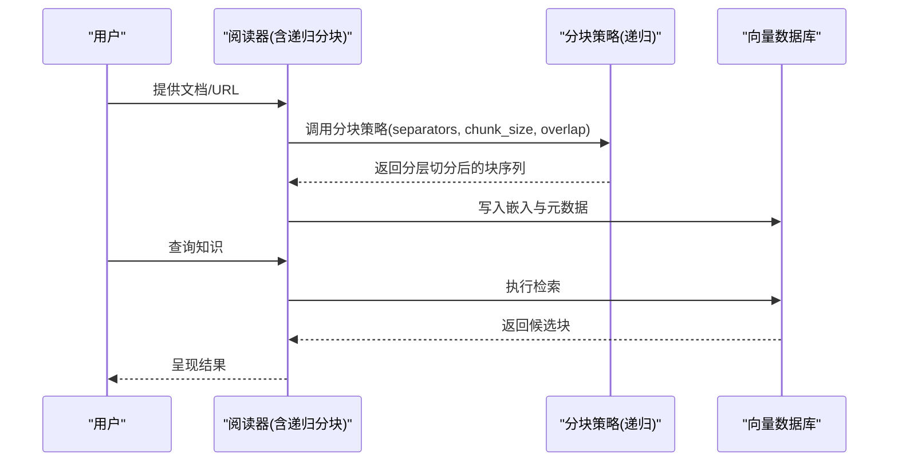
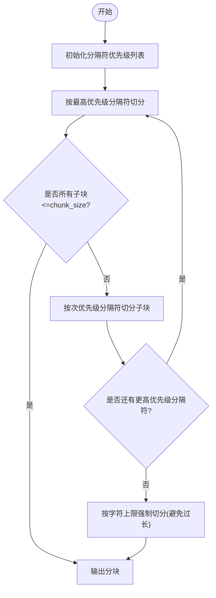
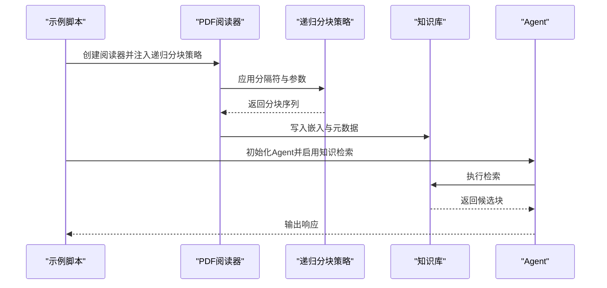
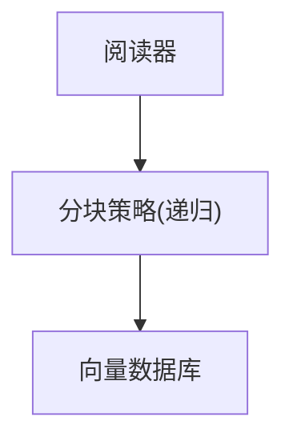

# 递归分块

<cite>
**本文引用的文件**
- [知识概念：递归分块](file://knowledge/concepts/chunking/recursive-chunking.mdx)
- [知识概念：分块总览](file://knowledge/concepts/chunking/overview.mdx)
- [知识参考：递归分块](file://reference/knowledge/chunking/recursive.mdx)
- [知识示例：递归分块](file://examples/knowledge/chunking/recursive-chunking.mdx)
- [知识食谱：分块策略](file://cookbook/knowledge/chunking.mdx)
- [基础阅读器参考](file://reference/knowledge/readers/base-reader-reference.mdx)
- [_Snippets：递归分块参数](file://_snippets/chunking-recursive.mdx)
</cite>

## 目录
1. [引言](#引言)
2. [项目结构](#项目结构)
3. [核心组件](#核心组件)
4. [架构概览](#架构概览)
5. [详细组件分析](#详细组件分析)
6. [依赖分析](#依赖分析)
7. [性能考虑](#性能考虑)
8. [故障排除指南](#故障排除指南)
9. [结论](#结论)
10. [附录](#附录)

## 引言
本技术文档围绕“递归分块”展开，系统阐述其通过多级分隔符进行层次化切分的机制：从大段落到句子，再到单词的递归过程；详解 separators 参数的配置与优先级；给出混合内容（文本、代码、表格）的策略建议；并提供性能优化与常见问题的解决方案。目标是帮助读者在不同内容类型与检索需求下，正确选择与调优递归分块策略。

## 项目结构
本仓库中与“递归分块”直接相关的内容主要分布在以下位置：
- 知识概念：递归分块与分块总览，提供方法论与最佳实践
- 知识参考：递归分块的简要定义与参数入口
- 知识示例：递归分块的运行示例与最小可执行配置
- 知识食谱：分块策略对比与递归分块的典型配置
- 基础阅读器参考：通用分隔符列表与默认值
- Snippets：递归分块参数表（chunk_size、overlap）

图表来源
- [知识概念：递归分块:1-63](file://knowledge/concepts/chunking/recursive-chunking.mdx#L1-L63)
- [知识概念：分块总览:1-143](file://knowledge/concepts/chunking/overview.mdx#L1-L143)
- [知识参考：递归分块:1-11](file://reference/knowledge/chunking/recursive.mdx#L1-L11)
- [知识示例：递归分块:1-49](file://examples/knowledge/chunking/recursive-chunking.mdx#L1-L49)
- [知识食谱：分块策略:84-99](file://cookbook/knowledge/chunking.mdx#L84-L99)
- [基础阅读器参考:1-200](file://reference/knowledge/readers/base-reader-reference.mdx#L1-L200)
- [_Snippets：递归分块参数:1-5](file://_snippets/chunking-recursive.mdx#L1-L5)

章节来源
- [知识概念：递归分块:1-63](file://knowledge/concepts/chunking/recursive-chunking.mdx#L1-L63)
- [知识概念：分块总览:1-143](file://knowledge/concepts/chunking/overview.mdx#L1-L143)
- [知识参考：递归分块:1-11](file://reference/knowledge/chunking/recursive.mdx#L1-L11)
- [知识示例：递归分块:1-49](file://examples/knowledge/chunking/recursive-chunking.mdx#L1-L49)
- [知识食谱：分块策略:84-99](file://cookbook/knowledge/chunking.mdx#L84-L99)
- [基础阅读器参考:1-200](file://reference/knowledge/readers/base-reader-reference.mdx#L1-L200)
- [_Snippets：递归分块参数:1-5](file://_snippets/chunking-recursive.mdx#L1-L5)

## 核心组件
- 递归分块策略
  - 作用：对输入内容按层级分隔符进行递归切分，先按高层级（如段落）切分，再在子块内按次层级（如句子）切分，直至最细粒度（如单词或字符）
  - 关键参数
    - chunk_size：单个块的最大大小（字符数）
    - overlap：相邻块之间的重叠字符数
    - separators：分隔符优先级列表，按从高到低顺序应用
- 分隔符优先级与行为
  - 优先级由 separators 列表顺序决定，越靠前的分隔符优先被使用
  - 典型优先级顺序：段落分隔符 > 换行符 > 句号+空格 > 空格
  - 若某一层级切分后仍有超长块，将继续在更细粒度层级切分
- 与阅读器的集成
  - 将递归分块策略作为阅读器的 chunking_strategy 传入，即可在导入文档时自动生效

章节来源
- [知识概念：递归分块:1-63](file://knowledge/concepts/chunking/recursive-chunking.mdx#L1-L63)
- [知识食谱：分块策略:84-99](file://cookbook/knowledge/chunking.mdx#L84-L99)
- [知识概念：分块总览:96-116](file://knowledge/concepts/chunking/overview.mdx#L96-L116)
- [_Snippets：递归分块参数:1-5](file://_snippets/chunking-recursive.mdx#L1-L5)

## 架构概览
递归分块在知识处理流水线中的位置如下：

图表来源
- [知识示例：递归分块:1-49](file://examples/knowledge/chunking/recursive-chunking.mdx#L1-L49)
- [知识概念：递归分块:1-63](file://knowledge/concepts/chunking/recursive-chunking.mdx#L1-L63)
- [知识食谱：分块策略:84-99](file://cookbook/knowledge/chunking.mdx#L84-L99)

## 详细组件分析

### 组件一：递归分块策略与分隔符层级
- 分层切分流程
  1) 使用最高优先级分隔符（如段落分隔符）进行初次切分，得到若干大块
  2) 对每个大块，使用次优先级分隔符（如换行符）进一步切分
  3) 对更小的子块，继续使用更低优先级分隔符（如句号+空格、空格）切分
  4) 当剩余块小于等于 chunk_size 且无法再按更细分隔符切分时，停止递归
- 分隔符优先级与典型配置
  - 优先级顺序通常为：段落分隔符 > 换行符 > 句号+空格 > 空格
  - 示例配置见“知识食谱：分块策略”的递归分块示例
- 与固定大小策略的差异
  - 固定大小策略按字符数强制切分，可能破坏语义边界
  - 递归分块保留自然边界，提升检索质量

图表来源
- [知识概念：递归分块:1-63](file://knowledge/concepts/chunking/recursive-chunking.mdx#L1-L63)
- [知识食谱：分块策略:84-99](file://cookbook/knowledge/chunking.mdx#L84-L99)
- [知识概念：分块总览:96-116](file://knowledge/concepts/chunking/overview.mdx#L96-L116)

章节来源
- [知识概念：递归分块:1-63](file://knowledge/concepts/chunking/recursive-chunking.mdx#L1-L63)
- [知识食谱：分块策略:84-99](file://cookbook/knowledge/chunking.mdx#L84-L99)
- [知识概念：分块总览:96-116](file://knowledge/concepts/chunking/overview.mdx#L96-L116)

### 组件二：参数配置与调优
- chunk_size
  - 控制单块最大字符数，影响检索精度与上下文覆盖
  - 较小块适合精确问答，较大块适合需要上下文的场景
- overlap
  - 控制相邻块之间的重叠字符数，缓解跨块语义断裂
- separators
  - 分隔符优先级列表，决定切分的层级顺序
  - 默认分隔符集合与优先级可参考基础阅读器参考中的默认值

章节来源
- [知识概念：递归分块:60-63](file://knowledge/concepts/chunking/recursive-chunking.mdx#L60-L63)
- [知识食谱：分块策略:84-99](file://cookbook/knowledge/chunking.mdx#L84-L99)
- [知识概念：分块总览:96-116](file://knowledge/concepts/chunking/overview.mdx#L96-L116)
- [_Snippets：递归分块参数:1-5](file://_snippets/chunking-recursive.mdx#L1-L5)
- [基础阅读器参考:1-200](file://reference/knowledge/readers/base-reader-reference.mdx#L1-L200)

### 组件三：混合内容类型的递归分块策略
- 文本+代码
  - 在 separators 中优先使用段落与换行分隔符，确保函数/类边界不被句号打断
  - 配合“代码分块”策略在代码区域单独处理，以保持语法完整性
- 文本+表格
  - 使用段落与换行分隔符切分，避免将表格行切开
  - 表格内容可考虑按行切分（CSV行分块）或整体保留，视检索需求而定
- 多媒体/非结构化
  - 以段落与换行为主，句号为辅，必要时允许强制按字符切分

章节来源
- [知识概念：分块总览:82-94](file://knowledge/concepts/chunking/overview.mdx#L82-L94)
- [知识食谱：分块策略:101-162](file://cookbook/knowledge/chunking.mdx#L101-L162)

### 组件四：与阅读器的集成与运行示例
- 集成方式
  - 将递归分块策略实例作为 chunking_strategy 传给阅读器
  - 在知识入库与查询阶段均生效
- 运行示例
  - 提供最小可运行脚本，展示如何使用递归分块策略导入文档并进行检索

图表来源
- [知识示例：递归分块:1-49](file://examples/knowledge/chunking/recursive-chunking.mdx#L1-L49)
- [知识概念：递归分块:1-63](file://knowledge/concepts/chunking/recursive-chunking.mdx#L1-L63)

章节来源
- [知识示例：递归分块:1-49](file://examples/knowledge/chunking/recursive-chunking.mdx#L1-L49)
- [知识概念：递归分块:1-63](file://knowledge/concepts/chunking/recursive-chunking.mdx#L1-L63)

## 依赖分析
- 组件耦合
  - 阅读器依赖分块策略接口，递归分块策略实现该接口
  - 向量数据库仅接收已分块的文档，不参与切分逻辑
- 外部依赖
  - 与具体阅读器（如PDFReader、MarkdownReader等）配合使用
  - 与向量数据库（如PgVector）交互存储嵌入

图表来源
- [知识示例：递归分块:1-49](file://examples/knowledge/chunking/recursive-chunking.mdx#L1-L49)
- [知识概念：递归分块:1-63](file://knowledge/concepts/chunking/recursive-chunking.mdx#L1-L63)

章节来源
- [知识示例：递归分块:1-49](file://examples/knowledge/chunking/recursive-chunking.mdx#L1-L49)
- [知识概念：递归分块:1-63](file://knowledge/concepts/chunking/recursive-chunking.mdx#L1-L63)

## 性能考虑
- 分隔符选择
  - 优先使用能保留语义边界的分隔符，减少强制字符切分次数
  - 对超长块，适当降低 chunk_size 或增加 overlap，平衡召回与上下文
- overlap 的权衡
  - 适度重叠可提升检索召回，但会增加向量库写入与检索成本
- 输入预处理
  - 清洗多余空白与异常换行，有助于减少无效切分
- 向量化与存储
  - 批量写入、索引优化与硬件资源（内存/CPU/GPU）配置直接影响吞吐与延迟

## 故障排除指南
- 常见问题与解决思路
  - 块过大导致检索不精准
    - 降低 chunk_size 或调整分隔符优先级，使句号与空格优先生效
  - 跨块语义断裂
    - 增加 overlap，确保相邻块有足够上下文
  - 代码/表格被错误切分
    - 在代码区域采用“代码分块”，在表格区域采用“CSV行分块”
  - 性能瓶颈
    - 减少重叠、批量写入、优化向量库索引与硬件配置
- 参数调试建议
  - 从默认分隔符列表入手，逐步调整优先级与阈值
  - 结合检索效果指标（准确率、召回率、MRR）评估参数

章节来源
- [知识概念：分块总览:118-126](file://knowledge/concepts/chunking/overview.mdx#L118-L126)
- [知识食谱：分块策略:84-99](file://cookbook/knowledge/chunking.mdx#L84-L99)

## 结论
递归分块通过多级分隔符的层次化切分，在保留语义边界的同时兼顾检索效率。合理配置 separators、chunk_size 与 overlap，并结合内容类型选择合适的策略组合，可在复杂文档与混合内容场景下获得稳定、高质量的检索效果。建议在实际部署中持续以检索指标驱动参数迭代优化。

## 附录
- 快速参考
  - 递归分块参数：chunk_size、overlap、separators
  - 推荐优先级：段落分隔符 > 换行符 > 句号+空格 > 空格
  - 混合内容策略：文本+代码用递归+代码分块；文本+表格用递归+CSV行分块

章节来源
- [_Snippets：递归分块参数:1-5](file://_snippets/chunking-recursive.mdx#L1-L5)
- [知识食谱：分块策略:84-99](file://cookbook/knowledge/chunking.mdx#L84-L99)
- [知识概念：分块总览:82-94](file://knowledge/concepts/chunking/overview.mdx#L82-L94)