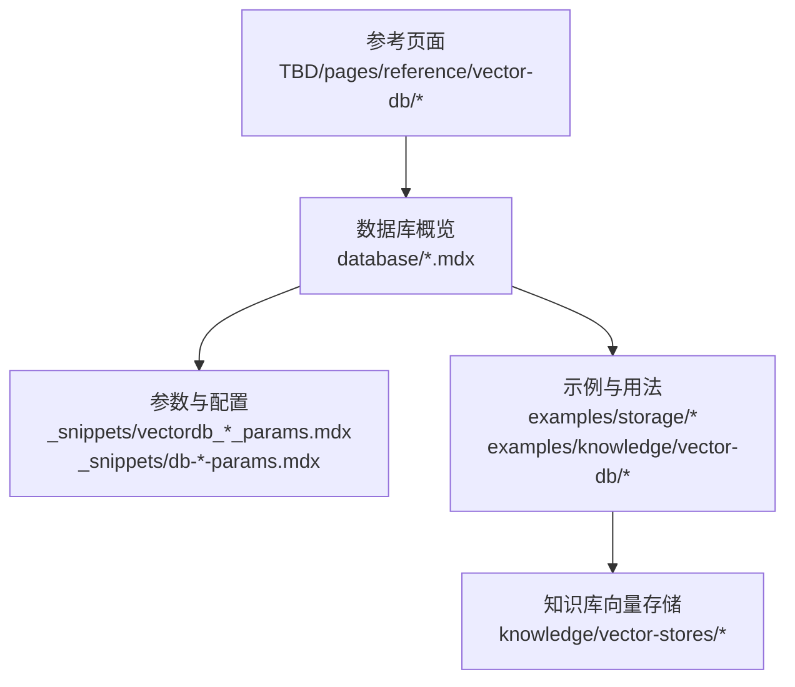
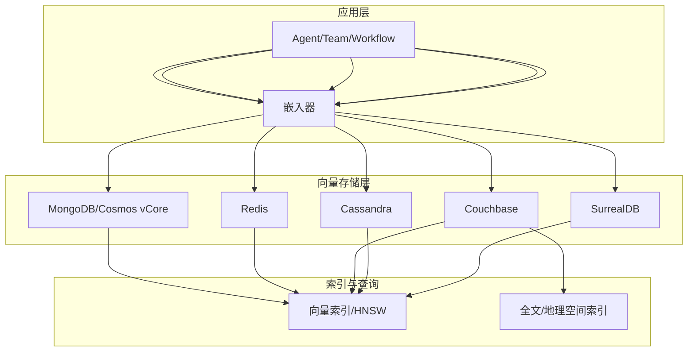
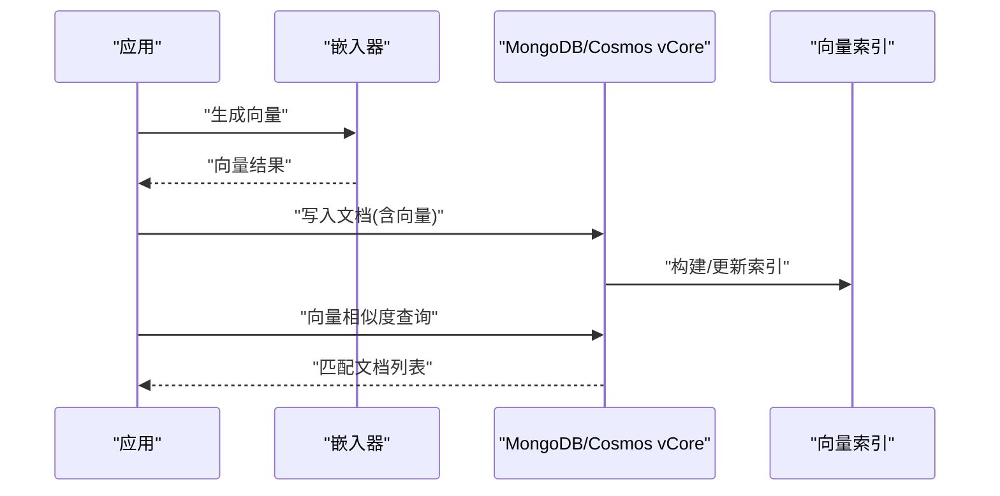
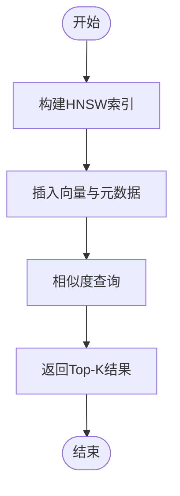
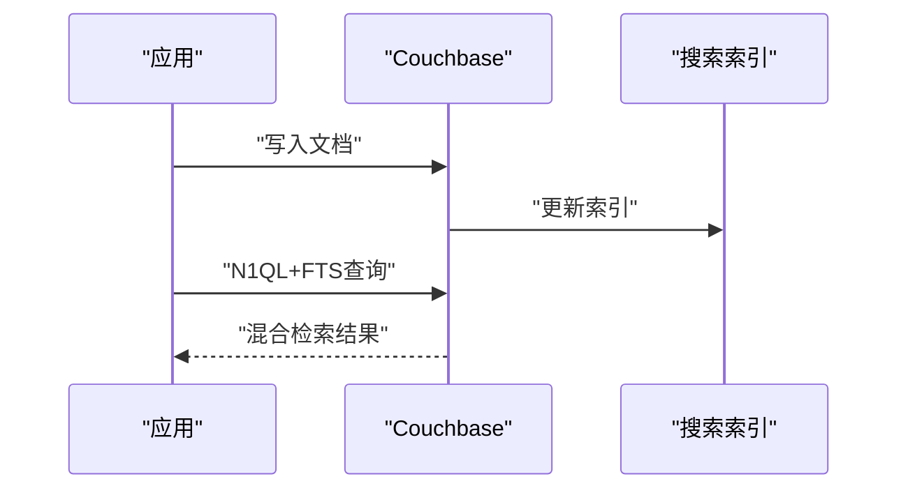
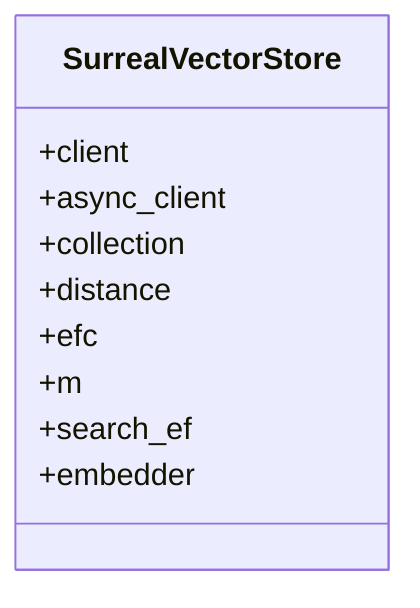
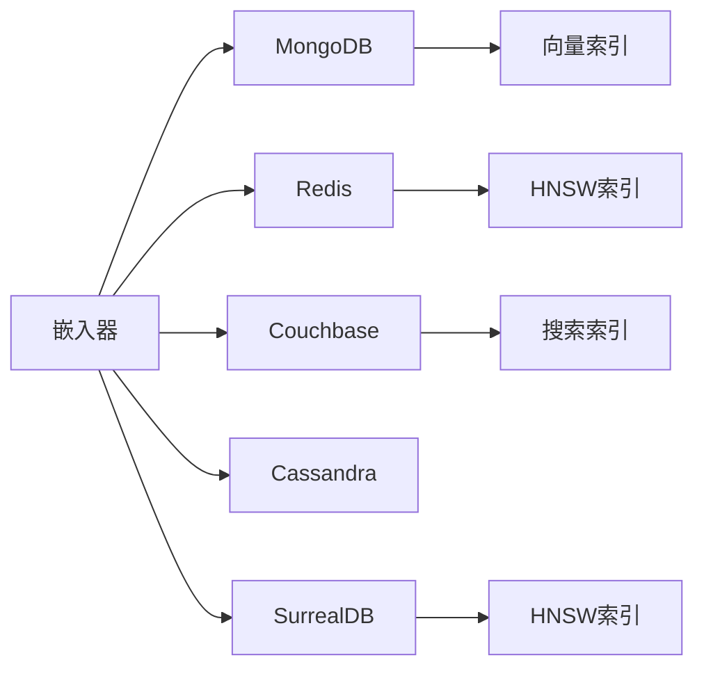

# NoSQL 类向量数据库

<cite>
**本文引用的文件**
- [TBD/pages/reference/vector-db/mongodb.mdx](file://TBD/pages/reference/vector-db/mongodb.mdx)
- [TBD/pages/reference/vector-db/surrealdb.mdx](file://TBD/pages/reference/vector-db/surrealdb.mdx)
- [TBD/pages/reference/vector-db/couchbase.mdx](file://TBD/pages/reference/vector-db/couchbase.mdx)
- [TBD/pages/reference/vector-db/cassandra.mdx](file://TBD/pages/reference/vector-db/cassandra.mdx)
- [database/mongodb.mdx](file://database/mongodb.mdx)
- [database/redis.mdx](file://database/redis.mdx)
- [reference/storage/redis.mdx](file://reference/storage/redis.mdx)
- [_snippets/vectordb_mongodb_params.mdx](file://_snippets/vectordb_mongodb_params.mdx)
- [_snippets/vectordb_surrealdb_params.mdx](file://_snippets/vectordb_surrealdb_params.mdx)
- [_snippets/vectordb_couchbase_params.mdx](file://_snippets/vectordb_couchbase_params.mdx)
- [_snippets/vectordb_cassandra_params.mdx](file://_snippets/vectordb_cassandra_params.mdx)
- [_snippets/vectordb_redis_params.mdx](file://_snippets/vectordb_redis_params.mdx)
- [_snippets/db-redis-params.mdx](file://_snippets/db-redis-params.mdx)
- [_snippets/db-mongodb-params.mdx](file://_snippets/db-mongodb-params.mdx)
- [examples/knowledge/vector-db/mongo-db/cosmos-mongodb-vcore.mdx](file://examples/knowledge/vector-db/mongo-db/cosmos-mongodb-vcore.mdx)
- [knowledge/vector-stores/mongodb/usage/cosmos-mongodb-vcore.mdx](file://knowledge/vector-stores/mongodb/usage/cosmos-mongodb-vcore.mdx)
- [examples/knowledge/vector-db/redis-db/redis-db.mdx](file://examples/knowledge/vector-db/redis-db/redis-db.mdx)
- [examples/knowledge/vector-db/redis-db/redis-db-with-cohere-reranker.mdx](file://examples/knowledge/vector-db/redis-db/redis-db-with-cohere-reranker.mdx)
- [examples/knowledge/vector-db/couchbase-db/couchbase-db.mdx](file://examples/knowledge/vector-db/couchbase-db/couchbase-db.mdx)
- [examples/knowledge/vector-db/cassandra-db/cassandra-db.mdx](file://examples/knowledge/vector-db/cassandra-db/cassandra-db.mdx)
- [examples/storage/mongo/mongodb-for-agent.mdx](file://examples/storage/mongo/mongodb-for-agent.mdx)
- [examples/storage/mongo/async-mongo/async-mongodb-for-agent.mdx](file://examples/storage/mongo/async-mongo/async-mongodb-for-agent.mdx)
- [examples/storage/redis/redis-for-agent.mdx](file://examples/storage/redis/redis-for-agent.mdx)
- [examples/storage/redis/redis-for-team.mdx](file://examples/storage/redis/redis-for-team.mdx)
- [examples/storage/redis/redis-for-workflow.mdx](file://examples/storage/redis/redis-for-workflow.mdx)
- [examples/storage/surrealdb/surrealdb-for-agent.mdx](file://examples/storage/surrealdb/surrealdb-for-agent.mdx)
- [examples/storage/surrealdb/surrealdb-for-team.mdx](file://examples/storage/surrealdb/surrealdb-for-team.mdx)
- [examples/storage/surrealdb/surrealdb-for-workflow.mdx](file://examples/storage/surrealdb/surrealdb-for-workflow.mdx)
- [database/providers/mongo/usage/mongodb-for-agent.mdx](file://database/providers/mongo/usage/mongodb-for-agent.mdx)
- [database/providers/mongo/usage/mongodb-for-team.mdx](file://database/providers/mongo/usage/mongodb-for-team.mdx)
- [database/providers/mongo/usage/mongodb-for-workflow.mdx](file://database/providers/mongo/usage/mongodb-for-workflow.mdx)
- [database/providers/redis/usage/redis-for-agent.mdx](file://database/providers/redis/usage/redis-for-agent.mdx)
- [database/providers/redis/usage/redis-for-team.mdx](file://database/providers/redis/usage/redis-for-team.mdx)
- [database/providers/redis/usage/redis-for-workflow.mdx](file://database/providers/redis/usage/redis-for-workflow.mdx)
- [database/providers/surrealdb/usage/surrealdb-for-agent.mdx](file://database/providers/surrealdb/usage/surrealdb-for-agent.mdx)
- [database/providers/surrealdb/usage/surrealdb-for-team.mdx](file://database/providers/surrealdb/usage/surrealdb-for-team.mdx)
- [database/providers/surrealdb/usage/surrealdb-for-workflow.mdx](file://database/providers/surrealdb/usage/surrealdb-for-workflow.mdx)
- [knowledge/vector-stores/redis/usage/redis-db.mdx](file://knowledge/vector-stores/redis/usage/redis-db.mdx)
- [knowledge/vector-stores/redis/usage/async-redis-db.mdx](file://knowledge/vector-stores/redis/usage/async-redis-db.mdx)
- [knowledge/vector-stores/couchbase/usage/couchbase-db.mdx](file://knowledge/vector-stores/couchbase/usage/couchbase-db.mdx)
- [knowledge/vector-stores/couchbase/usage/async-couchbase-db.mdx](file://knowledge/vector-stores/couchbase/usage/async-couchbase-db.mdx)
- [knowledge/vector-stores/cassandra/usage/cassandra-db.mdx](file://knowledge/vector-stores/cassandra/usage/cassandra-db.mdx)
- [knowledge/vector-stores/cassandra/usage/async-cassandra-db.mdx](file://knowledge/vector-stores/cassandra/usage/async-cassandra-db.mdx)
- [knowledge/vector-stores/mongodb/usage/cosmos-mongodb-vcore.mdx](file://knowledge/vector-stores/mongodb/usage/cosmos-mongodb-vcore.mdx)
</cite>

## 目录
1. [简介](#简介)
2. [项目结构](#项目结构)
3. [核心组件](#核心组件)
4. [架构总览](#架构总览)
5. [详细组件分析](#详细组件分析)
6. [依赖关系分析](#依赖关系分析)
7. [性能考量](#性能考量)
8. [故障排查指南](#故障排查指南)
9. [结论](#结论)
10. [附录](#附录)

## 简介
本技术文档聚焦六种 NoSQL 类向量数据库：MongoDB、Azure Cosmos DB MongoDB vCore、Redis、Couchbase、Cassandra 与 SurrealDB。内容涵盖各数据库的向量存储实现方式、文档模型、查询语言与扩展能力；提供配置要点、连接参数与性能调优建议；并解释向量操作与传统 NoSQL 能力（如全文检索、地理空间、事务）的协同使用，以及索引策略、数据一致性与分布式架构的实践建议。

## 项目结构
围绕向量数据库的文档与示例主要分布在以下路径：
- 参考页面：TBD/pages/reference/vector-db 下的各数据库参考页
- 数据库概览：database/<db>.mdx 提供基础用法与运行说明
- 参数与配置：_snippets 下的 vectordb_*_params.mdx 与 db-*_params.mdx
- 示例与用法：examples/storage 与 examples/knowledge/vector-db 下的数据库示例
- 知识库向量存储：knowledge/vector-stores 下的各数据库向量存储用法

**章节来源**
- [database/mongodb.mdx:1-48](file://database/mongodb.mdx#L1-L48)
- [database/redis.mdx:1-40](file://database/redis.mdx#L1-L40)
- [reference/storage/redis.mdx:1-9](file://reference/storage/redis.mdx#L1-L9)

## 核心组件
本节概述六种数据库在向量检索中的角色与关键参数，帮助快速定位配置入口与调优方向。

- MongoDB
  - 支持向量搜索索引与混合检索（向量+关键词），支持 Azure Cosmos DB MongoDB vCore 兼容模式
  - 关键参数：集合名、数据库名、嵌入器、距离度量、索引等待时间、写入重试、连接池大小、Cosmos 兼容模式等
  - 示例：本地运行、Agent/团队/工作流集成、Azure Cosmos vCore 使用

- Redis
  - 基于 HNSW 的向量索引，支持多种距离度量；适合高吞吐低延迟场景
  - 关键参数：客户端/异步客户端、集合名、距离度量、HNSW 构建与搜索参数（efConstruction、M、searchEf）、嵌入器
  - 示例：Agent/团队/工作流集成、带重排器的检索

- Couchbase
  - 基于 N1QL/FTS 的全文与向量混合检索，支持全局级索引与批量处理
  - 关键参数：桶名、作用域、集合、连接串、集群选项、搜索索引、是否全局索引、等待索引就绪、批处理限制
  - 示例：同步与异步用法

- Cassandra
  - 列式存储，适合高写入吞吐与可扩展性；向量检索通常通过自定义 UDF 或外部索引配合
  - 关键参数：表名、Keyspace、嵌入器、会话对象
  - 示例：基本用法

- SurrealDB
  - 支持向量与多模态查询，内置 HNSW 参数可调；支持阻塞/异步连接
  - 关键参数：客户端/异步客户端、集合名、距离度量、HNSW efConstruction/M/searchEf、嵌入器
  - 示例：Agent/团队/工作流集成

- Azure Cosmos DB MongoDB vCore
  - 在 MongoDB 兼容层上启用更强大的搜索能力（向量+全文+地理空间）
  - 示例：Cosmos vCore 向量检索用法

**章节来源**
- [_snippets/vectordb_mongodb_params.mdx:1-22](file://_snippets/vectordb_mongodb_params.mdx#L1-L22)
- [_snippets/vectordb_surrealdb_params.mdx:1-10](file://_snippets/vectordb_surrealdb_params.mdx#L1-L10)
- [_snippets/vectordb_couchbase_params.mdx:1-13](file://_snippets/vectordb_couchbase_params.mdx#L1-L13)
- [_snippets/vectordb_cassandra_params.mdx:1-7](file://_snippets/vectordb_cassandra_params.mdx#L1-L7)
- [_snippets/vectordb_redis_params.mdx](file://_snippets/vectordb_redis_params.mdx)
- [_snippets/db-redis-params.mdx](file://_snippets/db-redis-params.mdx)
- [_snippets/db-mongodb-params.mdx](file://_snippets/db-mongodb-params.mdx)
- [examples/knowledge/vector-db/mongo-db/cosmos-mongodb-vcore.mdx](file://examples/knowledge/vector-db/mongo-db/cosmos-mongodb-vcore.mdx)
- [knowledge/vector-stores/mongodb/usage/cosmos-mongodb-vcore.mdx](file://knowledge/vector-stores/mongodb/usage/cosmos-mongodb-vcore.mdx)

## 架构总览
下图展示各数据库在向量检索中的典型交互：应用侧通过嵌入器生成向量，写入数据库后建立向量索引；检索时执行相似度搜索或混合检索，并返回匹配文档。

## 详细组件分析

### MongoDB 与 Azure Cosmos DB MongoDB vCore
- 文档模型
  - 使用集合存储文档，向量字段通常为数组或嵌入向量类型；可与元数据共存
- 查询语言与扩展能力
  - 支持聚合管道中的向量相似度计算与过滤；可与文本、地理空间、范围查询组合
  - Cosmos vCore 提供增强的搜索能力（向量+全文+地理空间）
- 配置要点
  - 集合名、数据库名、嵌入器、距离度量、索引等待时间、写入重试、连接池大小
  - Cosmos 兼容模式开关与混合检索权重设置
- 性能调优
  - 合理设置索引等待与插入后的等待时间，避免过早查询导致未就绪
  - 控制连接池大小与写入重试策略以平衡吞吐与一致性
- 示例与参考
  - 本地运行与 Agent/团队/工作流集成
  - Azure Cosmos vCore 向量检索示例

**图表来源**
- [database/mongodb.mdx:13-48](file://database/mongodb.mdx#L13-L48)
- [_snippets/vectordb_mongodb_params.mdx:1-22](file://_snippets/vectordb_mongodb_params.mdx#L1-L22)

**章节来源**
- [database/mongodb.mdx:1-48](file://database/mongodb.mdx#L1-L48)
- [TBD/pages/reference/vector-db/mongodb.mdx:1-7](file://TBD/pages/reference/vector-db/mongodb.mdx#L1-L7)
- [examples/knowledge/vector-db/mongo-db/cosmos-mongodb-vcore.mdx](file://examples/knowledge/vector-db/mongo-db/cosmos-mongodb-vcore.mdx)
- [knowledge/vector-stores/mongodb/usage/cosmos-mongodb-vcore.mdx](file://knowledge/vector-stores/mongodb/usage/cosmos-mongodb-vcore.mdx)

### Redis
- 文档模型
  - 键值结构，向量作为有序集合或特殊键值存储；适合高并发检索
- 查询语言与扩展能力
  - 基于 HNSW 的近似最近邻检索；支持多种距离度量
- 配置要点
  - 客户端/异步客户端选择、集合名、距离度量、HNSW efConstruction、M、searchEf
- 性能调优
  - 调整 efConstruction 与 M 平衡构建时间与精度；searchEf 影响查询精度与延迟
- 示例与参考
  - Agent/团队/工作流集成；带重排器的检索示例

**图表来源**
- [_snippets/vectordb_redis_params.mdx](file://_snippets/vectordb_redis_params.mdx)
- [database/redis.mdx:1-40](file://database/redis.mdx#L1-L40)

**章节来源**
- [database/redis.mdx:1-40](file://database/redis.mdx#L1-L40)
- [reference/storage/redis.mdx:1-9](file://reference/storage/redis.mdx#L1-L9)
- [examples/storage/redis/redis-for-agent.mdx](file://examples/storage/redis/redis-for-agent.mdx)
- [examples/storage/redis/redis-for-team.mdx](file://examples/storage/redis/redis-for-team.mdx)
- [examples/storage/redis/redis-for-workflow.mdx](file://examples/storage/redis/redis-for-workflow.mdx)
- [examples/knowledge/vector-db/redis-db/redis-db.mdx](file://examples/knowledge/vector-db/redis-db/redis-db.mdx)
- [examples/knowledge/vector-db/redis-db/redis-db-with-cohere-reranker.mdx](file://examples/knowledge/vector-db/redis-db/redis-db-with-cohere-reranker.mdx)

### Couchbase
- 文档模型
  - 桶/作用域/集合三层命名空间；文档内可包含向量字段与元数据
- 查询语言与扩展能力
  - 结合 N1QL 与 FTS 实现向量+全文+地理空间混合检索；支持全局级索引
- 配置要点
  - 桶名、作用域、集合、连接串、集群选项、搜索索引、是否全局索引、等待索引就绪、批处理限制
- 性能调优
  - 批处理限制控制单次批量写入规模；合理设置索引等待时间
- 示例与参考
  - 同步与异步用法示例

**图表来源**
- [_snippets/vectordb_couchbase_params.mdx:1-13](file://_snippets/vectordb_couchbase_params.mdx#L1-L13)

**章节来源**
- [_snippets/vectordb_couchbase_params.mdx:1-13](file://_snippets/vectordb_couchbase_params.mdx#L1-L13)
- [examples/knowledge/vector-db/couchbase-db/couchbase-db.mdx](file://examples/knowledge/vector-db/couchbase-db/couchbase-db.mdx)
- [knowledge/vector-stores/couchbase/usage/couchbase-db.mdx](file://knowledge/vector-stores/couchbase/usage/couchbase-db.mdx)
- [knowledge/vector-stores/couchbase/usage/async-couchbase-db.mdx](file://knowledge/vector-stores/couchbase/usage/async-couchbase-db.mdx)

### Cassandra
- 文档模型
  - 表结构存储向量与元数据；适合高写入吞吐与水平扩展
- 查询语言与扩展能力
  - 通过会话对象执行写入与查询；向量检索常配合外部索引或 UDF
- 配置要点
  - 表名、Keyspace、嵌入器、会话对象
- 性能调优
  - 合理设计分区键与聚簇键，提升写入与查询效率
- 示例与参考
  - 基本用法示例

**章节来源**
- [_snippets/vectordb_cassandra_params.mdx:1-7](file://_snippets/vectordb_cassandra_params.mdx#L1-L7)
- [examples/knowledge/vector-db/cassandra-db/cassandra-db.mdx](file://examples/knowledge/vector-db/cassandra-db/cassandra-db.mdx)
- [knowledge/vector-stores/cassandra/usage/cassandra-db.mdx](file://knowledge/vector-stores/cassandra/usage/cassandra-db.mdx)
- [knowledge/vector-stores/cassandra/usage/async-cassandra-db.mdx](file://knowledge/vector-stores/cassandra/usage/async-cassandra-db.mdx)

### SurrealDB
- 文档模型
  - 多模态存储，支持向量与结构化数据；内置 HNSW 参数
- 查询语言与扩展能力
  - 支持阻塞与异步连接；可进行向量与多模态查询
- 配置要点
  - 客户端/异步客户端、集合名、距离度量、HNSW efConstruction、M、searchEf、嵌入器
- 性能调优
  - 调整 efConstruction 与 M 平衡精度与速度；searchEf 控制查询精度
- 示例与参考
  - Agent/团队/工作流集成示例

**图表来源**
- [_snippets/vectordb_surrealdb_params.mdx:1-10](file://_snippets/vectordb_surrealdb_params.mdx#L1-L10)

**章节来源**
- [TBD/pages/reference/vector-db/surrealdb.mdx:1-6](file://TBD/pages/reference/vector-db/surrealdb.mdx#L1-L6)
- [examples/storage/surrealdb/surrealdb-for-agent.mdx](file://examples/storage/surrealdb/surrealdb-for-agent.mdx)
- [examples/storage/surrealdb/surrealdb-for-team.mdx](file://examples/storage/surrealdb/surrealdb-for-team.mdx)
- [examples/storage/surrealdb/surrealdb-for-workflow.mdx](file://examples/storage/surrealdb/surrealdb-for-workflow.mdx)

### Azure Cosmos DB MongoDB vCore
- 文档模型
  - 在 MongoDB 兼容层上使用更强的搜索能力
- 查询语言与扩展能力
  - 支持向量、全文、地理空间等多维检索
- 配置要点
  - Cosmos 兼容模式、混合检索权重等
- 示例与参考
  - 向量检索示例

**章节来源**
- [examples/knowledge/vector-db/mongo-db/cosmos-mongodb-vcore.mdx](file://examples/knowledge/vector-db/mongo-db/cosmos-mongodb-vcore.mdx)
- [knowledge/vector-stores/mongodb/usage/cosmos-mongodb-vcore.mdx](file://knowledge/vector-stores/mongodb/usage/cosmos-mongodb-vcore.mdx)

## 依赖关系分析
- 组件耦合
  - 各数据库向量存储均依赖嵌入器生成向量；写入后需建立/更新索引
  - Redis/Couchbase/SurrealDB 对 HNSW 参数敏感；MongoDB/Cosmos vCore 对索引等待与混合检索权重敏感
- 外部依赖
  - 连接客户端/会话对象、集群选项、嵌入服务
- 潜在循环依赖
  - 文档中未见直接循环依赖；注意在应用层避免跨组件相互依赖

**图表来源**
- [_snippets/vectordb_mongodb_params.mdx:1-22](file://_snippets/vectordb_mongodb_params.mdx#L1-L22)
- [_snippets/vectordb_redis_params.mdx](file://_snippets/vectordb_redis_params.mdx)
- [_snippets/vectordb_couchbase_params.mdx:1-13](file://_snippets/vectordb_couchbase_params.mdx#L1-L13)
- [_snippets/vectordb_surrealdb_params.mdx:1-10](file://_snippets/vectordb_surrealdb_params.mdx#L1-L10)

**章节来源**
- [_snippets/vectordb_mongodb_params.mdx:1-22](file://_snippets/vectordb_mongodb_params.mdx#L1-L22)
- [_snippets/vectordb_redis_params.mdx](file://_snippets/vectordb_redis_params.mdx)
- [_snippets/vectordb_couchbase_params.mdx:1-13](file://_snippets/vectordb_couchbase_params.mdx#L1-L13)
- [_snippets/vectordb_surrealdb_params.mdx:1-10](file://_snippets/vectordb_surrealdb_params.mdx#L1-L10)

## 性能考量
- 索引与查询
  - MongoDB/Cosmos vCore：合理设置索引等待时间与混合检索权重，避免过早查询导致未就绪
  - Redis：调整 efConstruction、M、searchEf 平衡精度与延迟；控制批量写入规模
  - Couchbase：利用全局索引与批处理限制优化吞吐
  - Cassandra：设计合适的分区键/聚簇键提升写入与查询性能
  - SurrealDB：调整 HNSW 参数以适配业务负载
- 连接与并发
  - 控制连接池大小与超时；在高并发场景优先使用异步客户端
- 数据一致性
  - 写入后等待索引就绪再查询；必要时开启写入重试
- 分布式架构
  - 选择具备良好分片与副本能力的部署形态；确保索引分布均匀

## 故障排查指南
- 连接失败
  - 检查连接字符串、认证凭据与网络可达性；确认端口开放
- 索引未就绪
  - 延长等待时间或显式触发索引重建；查看数据库日志
- 查询无结果
  - 检查嵌入器输出维度与索引维度一致；核对距离度量与查询参数
- 性能异常
  - 调整 HNSW 参数、批处理限制与连接池大小；监控慢查询与资源占用

## 结论
六种 NoSQL 向量数据库各有侧重：MongoDB/Cosmos vCore 适合与传统文档模型融合的混合检索；Redis 适合高吞吐低延迟场景；Couchbase 提供强大的全文与地理空间能力；Cassandra 适合高写入吞吐；SurrealDB 提供多模态与 HNSW 能力。通过合理的参数配置与索引策略，可在不同业务场景下获得稳定且高性能的向量检索体验。

## 附录
- 快速参数对照
  - MongoDB/Cosmos vCore：集合名、数据库名、嵌入器、距离度量、索引等待、写入重试、连接池、Cosmos 兼容模式、混合检索权重
  - Redis：客户端/异步客户端、集合名、距离度量、HNSW efConstruction/M/searchEf、嵌入器
  - Couchbase：桶/作用域/集合、连接串、集群选项、搜索索引、全局索引、等待就绪、批处理限制
  - Cassandra：表名、Keyspace、嵌入器、会话对象
  - SurrealDB：客户端/异步客户端、集合名、距离度量、HNSW efConstruction/M/searchEf、嵌入器

**章节来源**
- [_snippets/vectordb_mongodb_params.mdx:1-22](file://_snippets/vectordb_mongodb_params.mdx#L1-L22)
- [_snippets/vectordb_redis_params.mdx](file://_snippets/vectordb_redis_params.mdx)
- [_snippets/vectordb_couchbase_params.mdx:1-13](file://_snippets/vectordb_couchbase_params.mdx#L1-L13)
- [_snippets/vectordb_cassandra_params.mdx:1-7](file://_snippets/vectordb_cassandra_params.mdx#L1-L7)
- [_snippets/vectordb_surrealdb_params.mdx:1-10](file://_snippets/vectordb_surrealdb_params.mdx#L1-L10)
- [_snippets/db-redis-params.mdx](file://_snippets/db-redis-params.mdx)
- [_snippets/db-mongodb-params.mdx](file://_snippets/db-mongodb-params.mdx)