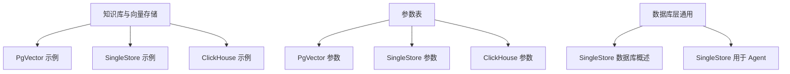
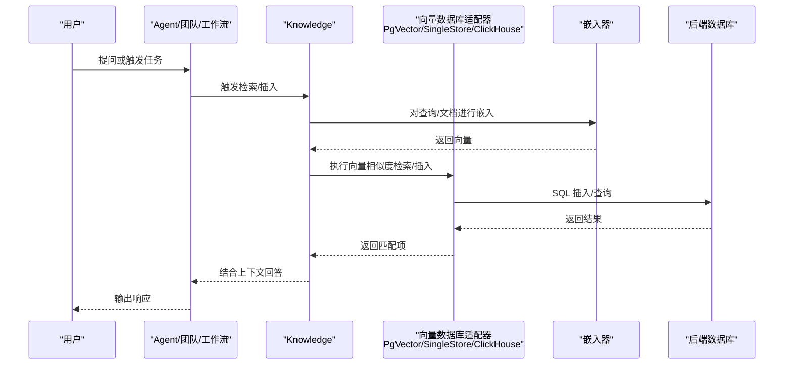
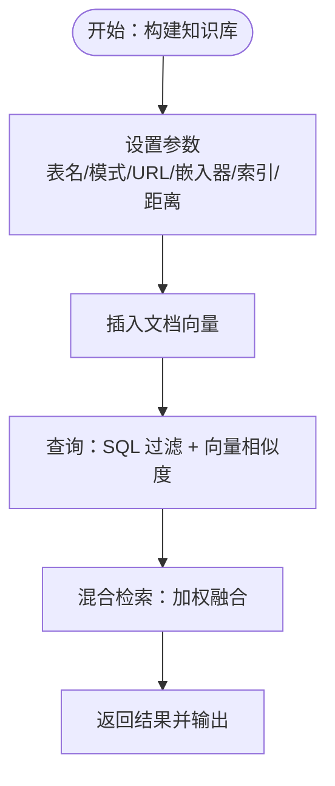
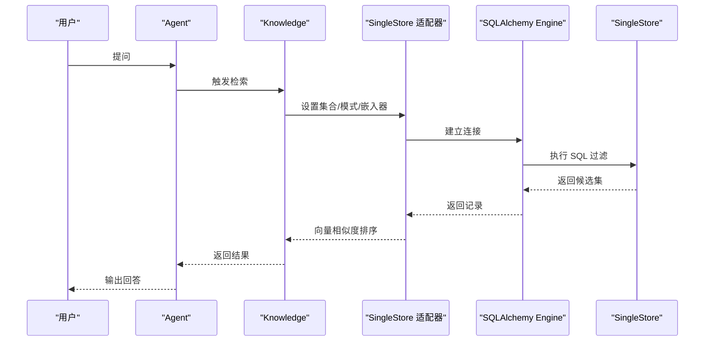
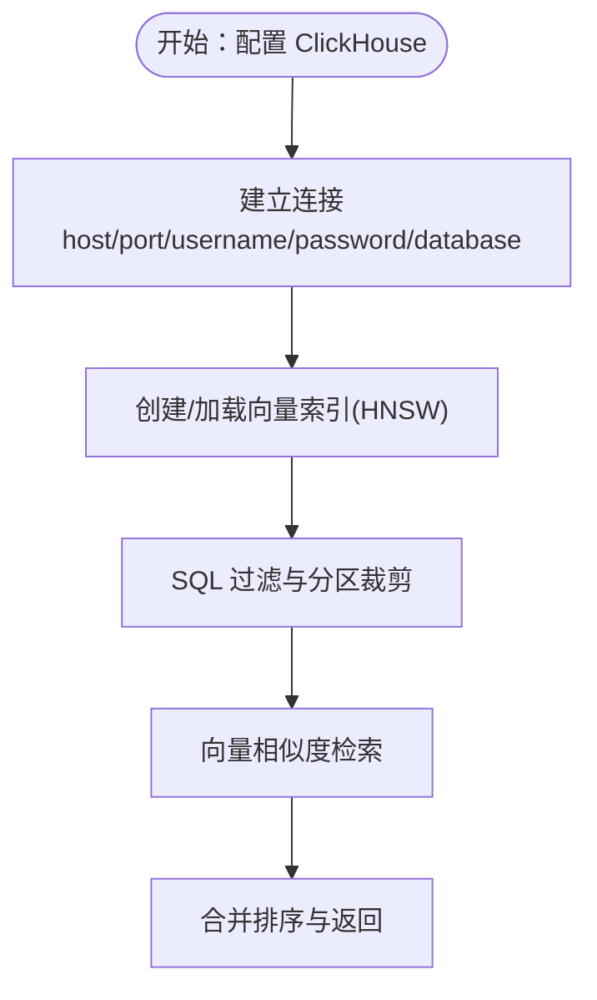
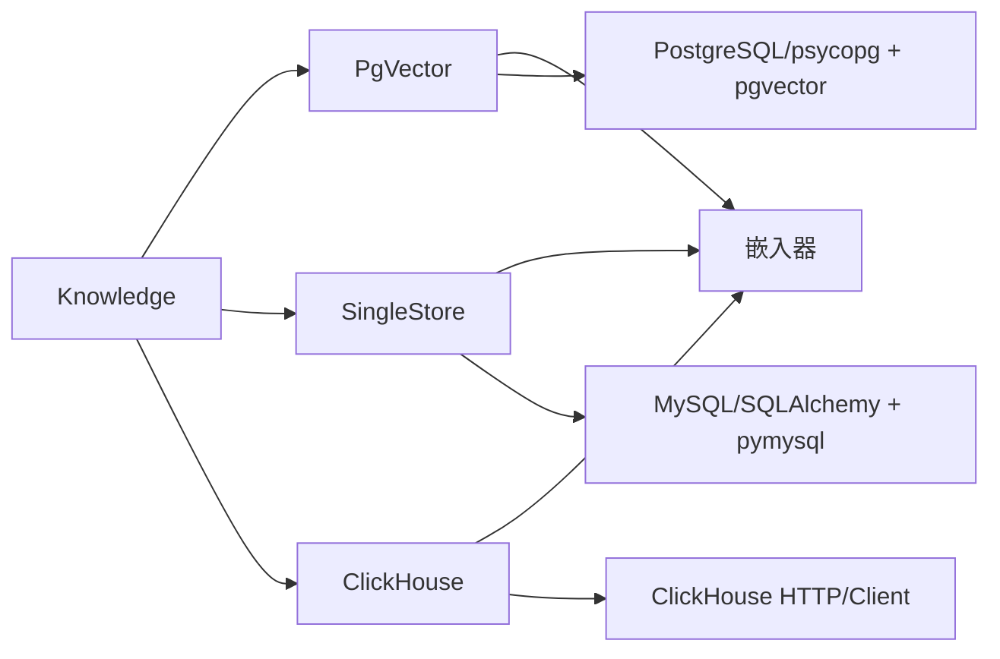

# SQL 类向量数据库

<cite>
**本文引用的文件**
- [PgVector 参数表](file://_snippets/vectordb_pgvector_params.mdx)
- [SingleStore 参数表](file://_snippets/vectordb_singlestore_params.mdx)
- [ClickHouse 参数表](file://_snippets/vectordb_clickhouse_params.mdx)
- [PgVector 示例：知识库与代理](file://examples/knowledge/vector-db/pgvector/pgvector-db.mdx)
- [SingleStore 示例：知识库与代理](file://examples/knowledge/vector-db/singlestore-db/singlestore-db.mdx)
- [ClickHouse 示例：知识库与代理](file://examples/knowledge/vector-db/clickhouse-db/clickhouse.mdx)
- [PgVector 使用示例（知识库）](file://knowledge/vector-stores/pgvector/usage/pgvector-db.mdx)
- [SingleStore 数据库概述](file://database/singlestore.mdx)
- [SingleStore 用于 Agent 的用法](file://database/providers/singlestore/usage/singlestore-for-agent.mdx)
</cite>

## 目录
1. [简介](#简介)
2. [项目结构](#项目结构)
3. [核心组件](#核心组件)
4. [架构总览](#架构总览)
5. [详细组件分析](#详细组件分析)
6. [依赖关系分析](#依赖关系分析)
7. [性能考量](#性能考量)
8. [故障排查指南](#故障排查指南)
9. [结论](#结论)
10. [附录](#附录)

## 简介
本技术文档聚焦三类“基于 SQL 的向量数据库”：PgVector、SingleStore、ClickHouse。我们将从向量存储能力、SQL 查询语法、性能特点、适用场景、配置参数、连接示例、最佳实践、向量索引创建与管理、查询优化策略、与传统 SQL 的融合使用，以及成本与扩展性角度进行系统化说明，并给出可直接参考的实现路径与示例。

## 项目结构
围绕 SQL 类向量数据库的相关内容主要分布在以下区域：
- 配置参数与参数表：_snippets 下的各数据库参数表
- 示例与用法：examples/knowledge/vector-db 下的各数据库示例
- 知识库与向量存储使用：knowledge/vector-stores 下的对应数据库使用示例
- 数据库层通用支持：database 与 database/providers 下的通用数据库用法

**图表来源**
- [PgVector 示例：知识库与代理](file://examples/knowledge/vector-db/pgvector/pgvector-db.mdx)
- [SingleStore 示例：知识库与代理](file://examples/knowledge/vector-db/singlestore-db/singlestore-db.mdx)
- [ClickHouse 示例：知识库与代理](file://examples/knowledge/vector-db/clickhouse-db/clickhouse.mdx)
- [PgVector 参数表](file://_snippets/vectordb_pgvector_params.mdx)
- [SingleStore 参数表](file://_snippets/vectordb_singlestore_params.mdx)
- [ClickHouse 参数表](file://_snippets/vectordb_clickhouse_params.mdx)
- [SingleStore 数据库概述](file://database/singlestore.mdx)
- [SingleStore 用于 Agent 的用法](file://database/providers/singlestore/usage/singlestore-for-agent.mdx)

**章节来源**
- [PgVector 示例：知识库与代理](file://examples/knowledge/vector-db/pgvector/pgvector-db.mdx)
- [SingleStore 示例：知识库与代理](file://examples/knowledge/vector-db/singlestore-db/singlestore-db.mdx)
- [ClickHouse 示例：知识库与代理](file://examples/knowledge/vector-db/clickhouse-db/clickhouse.mdx)
- [PgVector 参数表](file://_snippets/vectordb_pgvector_params.mdx)
- [SingleStore 参数表](file://_snippets/vectordb_singlestore_params.mdx)
- [ClickHouse 参数表](file://_snippets/vectordb_clickhouse_params.mdx)
- [SingleStore 数据库概述](file://database/singlestore.mdx)
- [SingleStore 用于 Agent 的用法](file://database/providers/singlestore/usage/singlestore-for-agent.mdx)

## 核心组件
- 向量数据库适配器
  - PgVector：通过表名、模式(schema)、数据库 URL 或 Engine、嵌入器、搜索类型、向量索引、距离度量等参数进行配置。
  - SingleStore：通过集合(collection)、schema、db_url 或 db_engine、嵌入器、距离度量等参数进行配置。
  - ClickHouse：通过表名、主机(host)、用户名(username)、密码(password)、端口(port)、数据库名(database_name)、DSN、压缩算法、客户端、嵌入器、距离度量、HNSW 索引等参数进行配置。
- 知识库与代理集成
  - 通过 Knowledge 将向量数据库与 Agent/团队/工作流集成，支持同步与异步插入、检索与对话。
- 异步批处理
  - 多数示例展示了启用嵌入器批处理以提升吞吐与降低延迟的用法。

**章节来源**
- [PgVector 参数表](file://_snippets/vectordb_pgvector_params.mdx)
- [SingleStore 参数表](file://_snippets/vectordb_singlestore_params.mdx)
- [ClickHouse 参数表](file://_snippets/vectordb_clickhouse_params.mdx)
- [PgVector 示例：知识库与代理](file://examples/knowledge/vector-db/pgvector/pgvector-db.mdx)
- [SingleStore 示例：知识库与代理](file://examples/knowledge/vector-db/singlestore-db/singlestore-db.mdx)
- [ClickHouse 示例：知识库与代理](file://examples/knowledge/vector-db/clickhouse-db/clickhouse.mdx)

## 架构总览
下图展示从“知识库/向量数据库”到“Agent/团队/工作流”的调用链路，以及异步与批处理的执行路径。

**图表来源**
- [PgVector 示例：知识库与代理](file://examples/knowledge/vector-db/pgvector/pgvector-db.mdx)
- [SingleStore 示例：知识库与代理](file://examples/knowledge/vector-db/singlestore-db/singlestore-db.mdx)
- [ClickHouse 示例：知识库与代理](file://examples/knowledge/vector-db/clickhouse-db/clickhouse.mdx)

## 详细组件分析

### PgVector 组件分析
- 向量存储能力
  - 支持通过表名与 schema 定义向量表；支持多种距离度量与索引类型（如 IVFFLAT/HNSW），并可在混合检索中设置权重。
  - 支持前缀匹配、内容语言、模式版本与自动升级等高级特性。
- SQL 查询语法
  - 通过适配器封装底层 SQL 操作，对外暴露统一的检索/插入接口；具体 SQL 实现由适配器内部完成。
- 性能特点
  - 通过异步与批处理嵌入器显著提升大规模数据写入与检索效率。
- 适用场景
  - 传统 PostgreSQL 生态中的 RAG、检索增强问答、文档检索等。
- 连接与配置
  - 通过 db_url 或 db_engine 连接；推荐使用异步与批处理嵌入器以提升吞吐。
- 最佳实践
  - 在混合检索中合理分配向量相似度与文本检索权重；根据数据规模选择合适的索引类型与距离度量。
- 查询优化策略
  - 利用向量索引与 SQL 过滤条件组合；在检索前对查询进行分词与过滤，减少候选集。
- 与传统 SQL 的结合
  - 可在检索时结合 SQL WHERE 条件进行元数据过滤，再进行向量相似度排序。

**图表来源**
- [PgVector 参数表](file://_snippets/vectordb_pgvector_params.mdx)
- [PgVector 示例：知识库与代理](file://examples/knowledge/vector-db/pgvector/pgvector-db.mdx)
- [PgVector 使用示例（知识库）](file://knowledge/vector-stores/pgvector/usage/pgvector-db.mdx)

**章节来源**
- [PgVector 参数表](file://_snippets/vectordb_pgvector_params.mdx)
- [PgVector 示例：知识库与代理](file://examples/knowledge/vector-db/pgvector/pgvector-db.mdx)
- [PgVector 使用示例（知识库）](file://knowledge/vector-stores/pgvector/usage/pgvector-db.mdx)

### SingleStore 组件分析
- 向量存储能力
  - 通过集合(collection)与 schema 管理向量与元数据；支持自定义嵌入器与距离度量。
- SQL 查询语法
  - 通过 SQLAlchemy Engine 进行连接与操作；适配器封装向量检索与插入。
- 性能特点
  - 分布式列存架构适合高并发与实时分析场景；异步与批处理嵌入器进一步提升吞吐。
- 适用场景
  - 需要与关系型数据强耦合的实时检索、OLTP+OLAP 共存场景。
- 连接与配置
  - 支持 db_url 与 db_engine；可通过环境变量注入认证信息；可选 SSL 参数。
- 最佳实践
  - 在 schema 中规划集合与元数据字段；结合 SQL 过滤与向量检索实现高效召回。
- 查询优化策略
  - 使用 SQL 过滤缩小候选集，再进行向量相似度计算；合理设置距离度量与索引参数。
- 与传统 SQL 的结合
  - 可在检索前利用 SQL WHERE 条件进行分区/标签过滤，再进行向量匹配。

**图表来源**
- [SingleStore 示例：知识库与代理](file://examples/knowledge/vector-db/singlestore-db/singlestore-db.mdx)
- [SingleStore 参数表](file://_snippets/vectordb_singlestore_params.mdx)
- [SingleStore 数据库概述](file://database/singlestore.mdx)
- [SingleStore 用于 Agent 的用法](file://database/providers/singlestore/usage/singlestore-for-agent.mdx)

**章节来源**
- [SingleStore 示例：知识库与代理](file://examples/knowledge/vector-db/singlestore-db/singlestore-db.mdx)
- [SingleStore 参数表](file://_snippets/vectordb_singlestore_params.mdx)
- [SingleStore 数据库概述](file://database/singlestore.mdx)
- [SingleStore 用于 Agent 的用法](file://database/providers/singlestore/usage/singlestore-for-agent.mdx)

### ClickHouse 组件分析
- 向量存储能力
  - 通过表名与数据库名组织向量与元数据；支持 HNSW 等向量索引配置与多种距离度量。
- SQL 查询语法
  - 通过客户端或 DSN 连接；适配器封装向量检索与插入。
- 性能特点
  - 列式存储与向量化执行引擎适合高吞吐、低延迟的相似度检索与实时分析。
- 适用场景
  - 海量日志/指标的语义检索、实时推荐、大规模相似度计算。
- 连接与配置
  - 支持 host/port/username/password/database_name/DSN/compress/client 等参数；可选预配置客户端。
- 最佳实践
  - 合理设置压缩算法与索引参数；在检索前进行元数据过滤，减少向量扫描范围。
- 查询优化策略
  - 先用 SQL 过滤与分区裁剪，再进行向量相似度计算；避免全表向量扫描。
- 与传统 SQL 的结合
  - 可在检索阶段结合 SQL 条件过滤与时间窗口，再进行向量匹配。

**图表来源**
- [ClickHouse 示例：知识库与代理](file://examples/knowledge/vector-db/clickhouse-db/clickhouse.mdx)
- [ClickHouse 参数表](file://_snippets/vectordb_clickhouse_params.mdx)

**章节来源**
- [ClickHouse 示例：知识库与代理](file://examples/knowledge/vector-db/clickhouse-db/clickhouse.mdx)
- [ClickHouse 参数表](file://_snippets/vectordb_clickhouse_params.mdx)

## 依赖关系分析
- 组件耦合
  - Knowledge 作为统一入口，依赖向量数据库适配器；适配器依赖嵌入器与底层数据库驱动。
- 外部依赖
  - PgVector：PostgreSQL/psycopg、pgvector 扩展
  - SingleStore：MySQL 协议/SQLAlchemy、pymysql
  - ClickHouse：HTTP 接口/客户端、压缩算法
- 可能的循环依赖
  - 代码层面未见循环导入；适配器与 Knowledge 之间为单向依赖。

**图表来源**
- [PgVector 示例：知识库与代理](file://examples/knowledge/vector-db/pgvector/pgvector-db.mdx)
- [SingleStore 示例：知识库与代理](file://examples/knowledge/vector-db/singlestore-db/singlestore-db.mdx)
- [ClickHouse 示例：知识库与代理](file://examples/knowledge/vector-db/clickhouse-db/clickhouse.mdx)

**章节来源**
- [PgVector 示例：知识库与代理](file://examples/knowledge/vector-db/pgvector/pgvector-db.mdx)
- [SingleStore 示例：知识库与代理](file://examples/knowledge/vector-db/singlestore-db/singlestore-db.mdx)
- [ClickHouse 示例：知识库与代理](file://examples/knowledge/vector-db/clickhouse-db/clickhouse.mdx)

## 性能考量
- 向量索引选择
  - HNSW 适合高维稠密向量的近似最近邻检索；IVFFLAT 适合大规模数据的多段聚类检索。
- 距离度量
  - 根据嵌入器输出分布选择余弦/内积/欧氏距离；注意归一化与缩放策略。
- 异步与批处理
  - 异步插入与批量嵌入显著提升吞吐；需关注内存与队列长度控制。
- SQL 过滤前置
  - 先用 SQL WHERE 条件缩小候选集，再进行向量相似度计算，可大幅降低计算量。
- 索引维护
  - 定期重建/重载索引；监控向量维度与数据分布变化，动态调整索引参数。

## 故障排查指南
- 连接失败
  - 检查数据库 URL/DSN、主机/端口、用户名/密码、SSL 参数是否正确。
- 权限不足
  - 确认用户具备创建/写入表与扩展的权限；必要时启用扩展与模式。
- 索引不可用
  - 确认已安装并启用相应扩展；检查索引类型与距离度量是否匹配。
- 嵌入器异常
  - 检查 API Key、网络连通性与批处理参数；确认嵌入维度与索引期望一致。
- 性能不达预期
  - 评估 SQL 过滤是否充分；检查索引参数与数据分布；考虑分片与分区策略。

**章节来源**
- [PgVector 示例：知识库与代理](file://examples/knowledge/vector-db/pgvector/pgvector-db.mdx)
- [SingleStore 示例：知识库与代理](file://examples/knowledge/vector-db/singlestore-db/singlestore-db.mdx)
- [ClickHouse 示例：知识库与代理](file://examples/knowledge/vector-db/clickhouse-db/clickhouse.mdx)

## 结论
- PgVector 适合在 PostgreSQL 生态中进行 RAG 与检索增强问答，具备成熟的索引与 SQL 融合能力。
- SingleStore 适合需要与关系型数据强耦合、高并发与实时分析的场景，具备分布式与列式优势。
- ClickHouse 适合海量数据的高吞吐相似度检索与实时分析，具备优秀的列式执行与向量索引能力。
- 三者均支持异步与批处理嵌入器，建议在生产环境中结合 SQL 过滤与索引参数进行优化。

## 附录
- 快速上手路径
  - PgVector：参考知识库使用示例与示例脚本，准备 PostgreSQL + pgvector 扩展，运行示例脚本。
  - SingleStore：准备 SingleStore 集群或云实例，配置连接参数，运行示例脚本。
  - ClickHouse：准备 ClickHouse 服务，配置 host/port/认证，运行示例脚本。
- 参数对照表
  - PgVector：表名、模式、数据库 URL/Engine、嵌入器、搜索类型、向量索引、距离、前缀匹配、混合检索权重、内容语言、模式版本、自动升级等。
  - SingleStore：集合、模式、数据库 URL/Engine、嵌入器、距离度量。
  - ClickHouse：表名、主机、用户名、密码、端口、数据库名、DSN、压缩、客户端、嵌入器、距离度量、HNSW 索引。

**章节来源**
- [PgVector 参数表](file://_snippets/vectordb_pgvector_params.mdx)
- [SingleStore 参数表](file://_snippets/vectordb_singlestore_params.mdx)
- [ClickHouse 参数表](file://_snippets/vectordb_clickhouse_params.mdx)
- [PgVector 使用示例（知识库）](file://knowledge/vector-stores/pgvector/usage/pgvector-db.mdx)
- [PgVector 示例：知识库与代理](file://examples/knowledge/vector-db/pgvector/pgvector-db.mdx)
- [SingleStore 示例：知识库与代理](file://examples/knowledge/vector-db/singlestore-db/singlestore-db.mdx)
- [ClickHouse 示例：知识库与代理](file://examples/knowledge/vector-db/clickhouse-db/clickhouse.mdx)