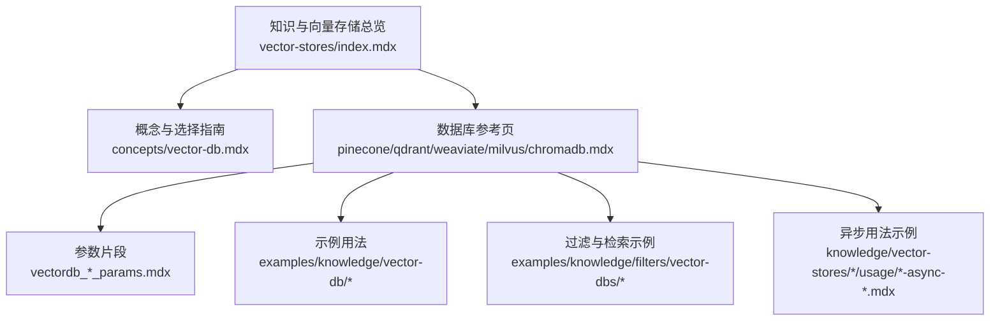
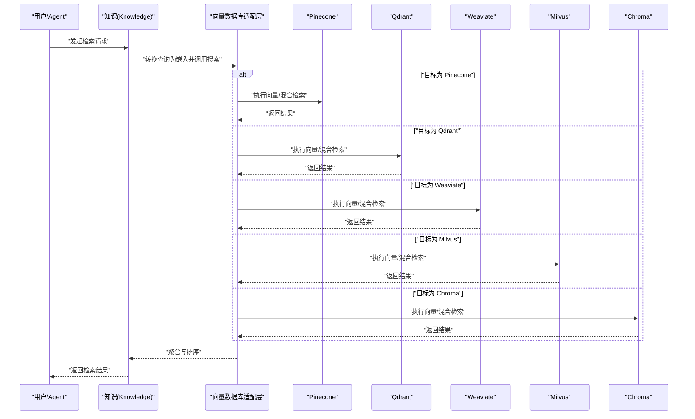
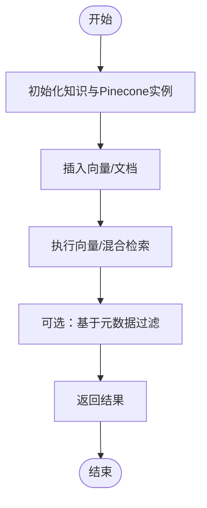
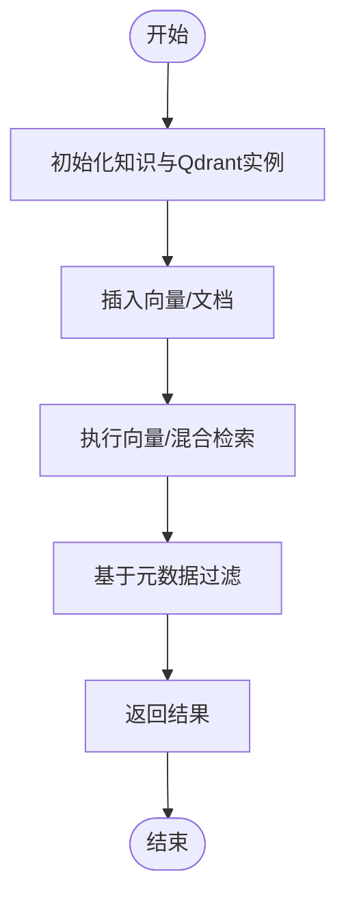
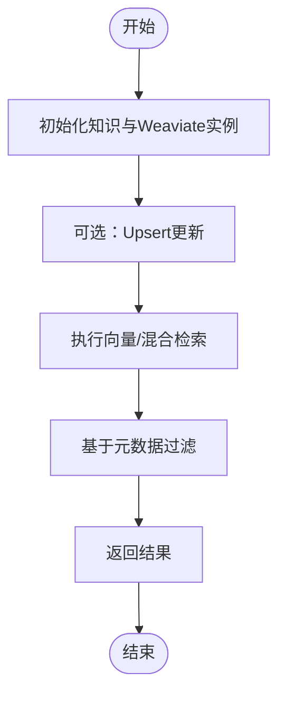
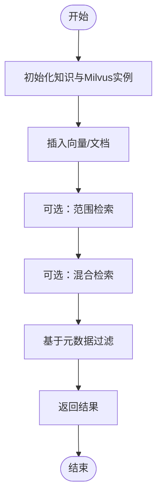
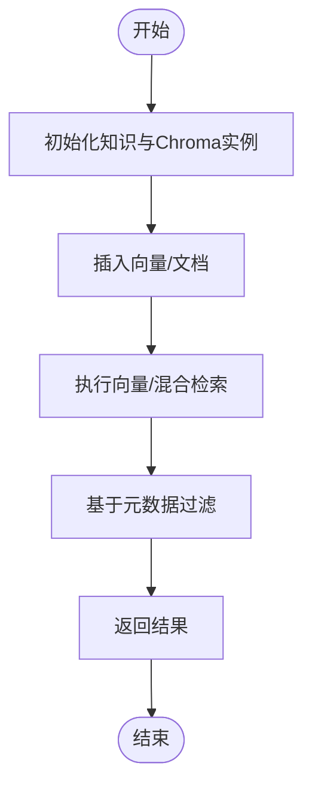
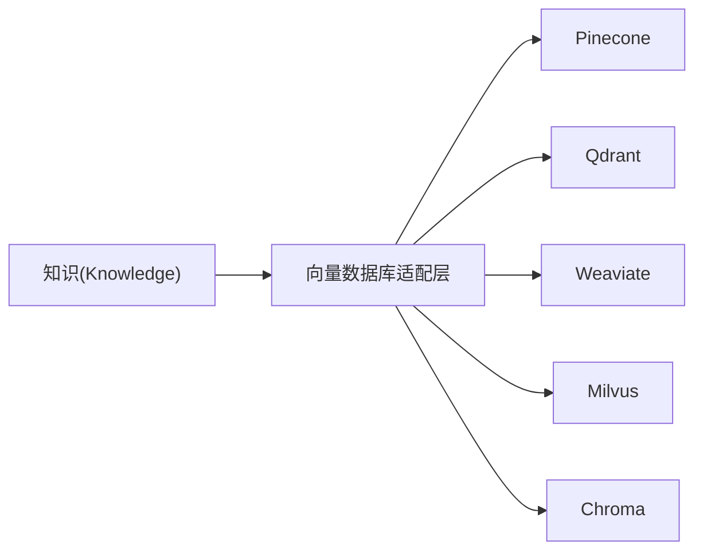

# 专用向量数据库

<cite>
**本文引用的文件**
- [cookbook/knowledge/vector-databases.mdx](file://cookbook/knowledge/vector-databases.mdx)
- [knowledge/vector-stores/index.mdx](file://knowledge/vector-stores/index.mdx)
- [knowledge/concepts/vector-db.mdx](file://knowledge/concepts/vector-db.mdx)
- [TBD/pages/reference/vector-db/pinecone.mdx](file://TBD/pages/reference/vector-db/pinecone.mdx)
- [TBD/pages/reference/vector-db/qdrant.mdx](file://TBD/pages/reference/vector-db/qdrant.mdx)
- [TBD/pages/reference/vector-db/weaviate.mdx](file://TBD/pages/reference/vector-db/weaviate.mdx)
- [TBD/pages/reference/vector-db/milvus.mdx](file://TBD/pages/reference/vector-db/milvus.mdx)
- [TBD/pages/reference/vector-db/chromadb.mdx](file://TBD/pages/reference/vector-db/chromadb.mdx)
- [_snippets/vectordb_pineconedb_params.mdx](file://_snippets/vectordb_pineconedb_params.mdx)
- [_snippets/vectordb_qdrant_params.mdx](file://_snippets/vectordb_qdrant_params.mdx)
- [_snippets/vectordb_weaviate_params.mdx](file://_snippets/vectordb_weaviate_params.mdx)
- [_snippets/vectordb_milvus_params.mdx](file://_snippets/vectordb_milvus_params.mdx)
- [_snippets/vectordb_chromadb_params.mdx](file://_snippets/vectordb_chromadb_params.mdx)
- [examples/knowledge/vector-db/pinecone-db/pinecone-db.mdx](file://examples/knowledge/vector-db/pinecone-db/pinecone-db.mdx)
- [examples/knowledge/vector-db/qdrant-db/qdrant-db.mdx](file://examples/knowledge/vector-db/qdrant-db/qdrant-db.mdx)
- [examples/knowledge/vector-db/weaviate-db/weaviate-db.mdx](file://examples/knowledge/vector-db/weaviate-db/weaviate-db.mdx)
- [examples/knowledge/vector-db/milvus-db/milvus-db.mdx](file://examples/knowledge/vector-db/milvus-db/milvus-db.mdx)
- [examples/knowledge/vector-db/chroma-db/chroma-db.mdx](file://examples/knowledge/vector-db/chroma-db/chroma-db.mdx)
- [examples/knowledge/filters/vector-dbs/filtering-pinecone.mdx](file://examples/knowledge/filters/vector-dbs/filtering-pinecone.mdx)
- [examples/knowledge/filters/vector-dbs/filtering-qdrant-db.mdx](file://examples/knowledge/filters/vector-dbs/filtering-qdrant-db.mdx)
- [examples/knowledge/filters/vector-dbs/filtering-weaviate.mdx](file://examples/knowledge/filters/vector-dbs/filtering-weaviate.mdx)
- [examples/knowledge/filters/vector-dbs/filtering-milvus.mdx](file://examples/knowledge/filters/vector-dbs/filtering-milvus.mdx)
- [examples/knowledge/filters/vector-dbs/filtering-chroma-db.mdx](file://examples/knowledge/filters/vector-dbs/filtering-chroma-db.mdx)
- [knowledge/concepts/filters/filtering-pinecone.mdx](file://knowledge/concepts/filters/filtering-pinecone.mdx)
- [knowledge/concepts/filters/filtering-qdrant-db.mdx](file://knowledge/concepts/filters/filtering-qdrant-db.mdx)
- [knowledge/concepts/filters/filtering-weaviate.mdx](file://knowledge/concepts/filters/filtering-weaviate.mdx)
- [knowledge/concepts/filters/filtering-milvus-db.mdx](file://knowledge/concepts/filters/filtering-milvus-db.mdx)
- [knowledge/concepts/filters/filtering-chroma-db.mdx](file://knowledge/concepts/filters/filtering-chroma-db.mdx)
- [knowledge/vector-stores/pinecone/usage/pinecone-db.mdx](file://knowledge/vector-stores/pinecone/usage/pinecone-db.mdx)
- [knowledge/vector-stores/qdrant/usage/qdrant-db.mdx](file://knowledge/vector-stores/qdrant/usage/qdrant-db.mdx)
- [knowledge/vector-stores/weaviate/usage/weaviate-db.mdx](file://knowledge/vector-stores/weaviate/usage/weaviate-db.mdx)
- [knowledge/vector-stores/milvus/usage/milvus-db.mdx](file://knowledge/vector-stores/milvus/usage/milvus-db.mdx)
- [knowledge/vector-stores/chroma/usage/chroma-db.mdx](file://knowledge/vector-stores/chroma/usage/chroma-db.mdx)
- [knowledge/vector-stores/pinecone/usage/async-pinecone-db.mdx](file://knowledge/vector-stores/pinecone/usage/async-pinecone-db.mdx)
- [knowledge/vector-stores/qdrant/usage/async-qdrant-db.mdx](file://knowledge/vector-stores/qdrant/usage/async-qdrant-db.mdx)
- [knowledge/vector-stores/weaviate/usage/async-weaviate-db.mdx](file://knowledge/vector-stores/weaviate/usage/async-weaviate-db.mdx)
- [knowledge/vector-stores/milvus/usage/async-milvus-db.mdx](file://knowledge/vector-stores/milvus/usage/async-milvus-db.mdx)
- [knowledge/vector-stores/chroma/usage/async-chroma-db.mdx](file://knowledge/vector-stores/chroma/usage/async-chroma-db.mdx)
</cite>

## 目录
1. [简介](#简介)
2. [项目结构](#项目结构)
3. [核心组件](#核心组件)
4. [架构总览](#架构总览)
5. [详细组件分析](#详细组件分析)
6. [依赖关系分析](#依赖关系分析)
7. [性能考量](#性能考量)
8. [故障排查指南](#故障排查指南)
9. [结论](#结论)
10. [附录](#附录)

## 简介
本技术文档聚焦五类专业向量数据库：Pinecone、Qdrant、Weaviate、Milvus 与 Chroma。它们在架构设计、性能表现、托管服务形态与开源版本方面各有侧重，并通过统一的知识与向量数据库接口实现无缝切换。本文将从系统架构、数据流、查询优化、索引策略、配置要点、API 使用与集成方法等方面进行深入解析，并给出企业级选型建议与最佳实践。

## 项目结构
围绕向量数据库能力，知识与向量存储相关内容主要分布在以下位置：
- 概念与总览：知识概念页与向量存储索引页
- 数据库参考页：各数据库的页面与参数片段
- 示例与用法：各数据库的使用示例与过滤示例
- 异步支持：各数据库的异步用法示例

**图表来源**
- [knowledge/vector-stores/index.mdx:1-175](file://knowledge/vector-stores/index.mdx#L1-L175)
- [knowledge/concepts/vector-db.mdx:1-117](file://knowledge/concepts/vector-db.mdx#L1-L117)
- [TBD/pages/reference/vector-db/pinecone.mdx:1-7](file://TBD/pages/reference/vector-db/pinecone.mdx#L1-L7)
- [TBD/pages/reference/vector-db/qdrant.mdx:1-7](file://TBD/pages/reference/vector-db/qdrant.mdx#L1-L7)
- [TBD/pages/reference/vector-db/weaviate.mdx:1-8](file://TBD/pages/reference/vector-db/weaviate.mdx#L1-L8)
- [TBD/pages/reference/vector-db/milvus.mdx:1-7](file://TBD/pages/reference/vector-db/milvus.mdx#L1-L7)
- [TBD/pages/reference/vector-db/chromadb.mdx:1-7](file://TBD/pages/reference/vector-db/chromadb.mdx#L1-L7)

**章节来源**
- [knowledge/vector-stores/index.mdx:1-175](file://knowledge/vector-stores/index.mdx#L1-L175)
- [knowledge/concepts/vector-db.mdx:1-117](file://knowledge/concepts/vector-db.mdx#L1-L117)

## 核心组件
- 统一知识接口：通过知识对象承载向量数据库实例，实现“换库不换代码”的切换能力
- 向量数据库适配层：针对不同数据库（Pinecone/Qdrant/Weaviate/Milvus/Chroma）提供一致的插入、搜索与过滤能力
- 异步支持：提供异步插入与搜索方法，提升高并发场景下的吞吐与响应性
- 过滤与混合检索：支持基于元数据过滤与关键词/语义混合检索，提升召回质量

**章节来源**
- [cookbook/knowledge/vector-databases.mdx:1-227](file://cookbook/knowledge/vector-databases.mdx#L1-L227)
- [knowledge/concepts/vector-db.mdx:108-117](file://knowledge/concepts/vector-db.mdx#L108-L117)

## 架构总览
下图展示了知识检索的端到端流程，以及与五类向量数据库的交互关系：

**图表来源**
- [cookbook/knowledge/vector-databases.mdx:8-15](file://cookbook/knowledge/vector-databases.mdx#L8-L15)
- [examples/knowledge/vector-db/pinecone-db/pinecone-db.mdx](file://examples/knowledge/vector-db/pinecone-db/pinecone-db.mdx)
- [examples/knowledge/vector-db/qdrant-db/qdrant-db.mdx](file://examples/knowledge/vector-db/qdrant-db/qdrant-db.mdx)
- [examples/knowledge/vector-db/weaviate-db/weaviate-db.mdx](file://examples/knowledge/vector-db/weaviate-db/weaviate-db.mdx)
- [examples/knowledge/vector-db/milvus-db/milvus-db.mdx](file://examples/knowledge/vector-db/milvus-db/milvus-db.mdx)
- [examples/knowledge/vector-db/chroma-db/chroma-db.mdx](file://examples/knowledge/vector-db/chroma-db/chroma-db.mdx)

## 详细组件分析

### Pinecone
- 架构与定位
  - 全托管向量数据库，强调无运维与弹性扩展，适合快速上线与高可用需求
  - 支持多种规格（如按需/Serverless），便于在成本与性能间权衡
- 性能与特性
  - 高可用、低延迟；支持混合检索与过滤
  - 提供异步用法示例，便于在高并发场景下保持响应
- 配置与参数
  - 关键参数包括集合名、维度、度量类型、规格等
  - 可通过参数片段查看典型配置项
- API 与集成
  - 示例展示如何初始化知识与向量数据库实例，执行插入与检索
  - 过滤示例演示基于元数据的检索策略
- 适用场景
  - 快速原型、SaaS 产品、需要托管服务降低运维负担的企业

**图表来源**
- [examples/knowledge/vector-db/pinecone-db/pinecone-db.mdx](file://examples/knowledge/vector-db/pinecone-db/pinecone-db.mdx)
- [examples/knowledge/filters/vector-dbs/filtering-pinecone.mdx](file://examples/knowledge/filters/vector-dbs/filtering-pinecone.mdx)
- [_snippets/vectordb_pineconedb_params.mdx](file://_snippets/vectordb_pineconedb_params.mdx)

**章节来源**
- [TBD/pages/reference/vector-db/pinecone.mdx:1-7](file://TBD/pages/reference/vector-db/pinecone.mdx#L1-L7)
- [_snippets/vectordb_pineconedb_params.mdx](file://_snippets/vectordb_pineconedb_params.mdx)
- [examples/knowledge/vector-db/pinecone-db/pinecone-db.mdx](file://examples/knowledge/vector-db/pinecone-db/pinecone-db.mdx)
- [examples/knowledge/filters/vector-dbs/filtering-pinecone.mdx](file://examples/knowledge/filters/vector-dbs/filtering-pinecone.mdx)
- [knowledge/vector-stores/pinecone/usage/pinecone-db.mdx](file://knowledge/vector-stores/pinecone/usage/pinecone-db.mdx)
- [knowledge/vector-stores/pinecone/usage/async-pinecone-db.mdx](file://knowledge/vector-stores/pinecone/usage/async-pinecone-db.mdx)

### Qdrant
- 架构与定位
  - 高性能向量引擎，强调丰富的过滤能力与灵活的查询模型
  - 适合对召回质量与过滤复杂度有较高要求的应用
- 性能与特性
  - 支持混合检索与多维过滤；提供异步用法以提升吞吐
- 配置与参数
  - 关键参数包括集合名、服务地址等
  - 参数片段提供典型配置项
- API 与集成
  - 示例展示向量数据库初始化、插入与检索
  - 过滤示例演示基于元数据的精确筛选
- 适用场景
  - 内容检索、电商/金融等对过滤与召回精度要求高的业务

**图表来源**
- [examples/knowledge/vector-db/qdrant-db/qdrant-db.mdx](file://examples/knowledge/vector-db/qdrant-db/qdrant-db.mdx)
- [examples/knowledge/filters/vector-dbs/filtering-qdrant-db.mdx](file://examples/knowledge/filters/vector-dbs/filtering-qdrant-db.mdx)
- [_snippets/vectordb_qdrant_params.mdx](file://_snippets/vectordb_qdrant_params.mdx)

**章节来源**
- [TBD/pages/reference/vector-db/qdrant.mdx:1-7](file://TBD/pages/reference/vector-db/qdrant.mdx#L1-L7)
- [_snippets/vectordb_qdrant_params.mdx](file://_snippets/vectordb_qdrant_params.mdx)
- [examples/knowledge/vector-db/qdrant-db/qdrant-db.mdx](file://examples/knowledge/vector-db/qdrant-db/qdrant-db.mdx)
- [examples/knowledge/filters/vector-dbs/filtering-qdrant-db.mdx](file://examples/knowledge/filters/vector-dbs/filtering-qdrant-db.mdx)
- [knowledge/vector-stores/qdrant/usage/qdrant-db.mdx](file://knowledge/vector-stores/qdrant/usage/qdrant-db.mdx)
- [knowledge/vector-stores/qdrant/usage/async-qdrant-db.mdx](file://knowledge/vector-stores/qdrant/usage/async-qdrant-db.mdx)

### Weaviate
- 架构与定位
  - 云原生向量数据库，强调模块化与混合检索能力
  - 适合需要与图谱/Schema 等能力结合的复杂检索场景
- 性能与特性
  - 支持向量与关键词混合检索；提供异步用法
- 配置与参数
  - 关键参数包括集合名、本地/远程模式、检索类型等
  - 参数片段提供典型配置项
- API 与集成
  - 示例展示向量数据库初始化、插入与检索
  - 过滤示例演示基于元数据的检索策略
- 适用场景
  - 复杂知识图谱、多模态检索、企业知识平台

**图表来源**
- [examples/knowledge/vector-db/weaviate-db/weaviate-db.mdx](file://examples/knowledge/vector-db/weaviate-db/weaviate-db.mdx)
- [examples/knowledge/filters/vector-dbs/filtering-weaviate.mdx](file://examples/knowledge/filters/vector-dbs/filtering-weaviate.mdx)
- [_snippets/vectordb_weaviate_params.mdx](file://_snippets/vectordb_weaviate_params.mdx)

**章节来源**
- [TBD/pages/reference/vector-db/weaviate.mdx:1-8](file://TBD/pages/reference/vector-db/weaviate.mdx#L1-L8)
- [_snippets/vectordb_weaviate_params.mdx](file://_snippets/vectordb_weaviate_params.mdx)
- [examples/knowledge/vector-db/weaviate-db/weaviate-db.mdx](file://examples/knowledge/vector-db/weaviate-db/weaviate-db.mdx)
- [examples/knowledge/filters/vector-dbs/filtering-weaviate.mdx](file://examples/knowledge/filters/vector-dbs/filtering-weaviate.mdx)
- [knowledge/vector-stores/weaviate/usage/weaviate-db.mdx](file://knowledge/vector-stores/weaviate/usage/weaviate-db.mdx)
- [knowledge/vector-stores/weaviate/usage/async-weaviate-db.mdx](file://knowledge/vector-stores/weaviate/usage/async-weaviate-db.mdx)

### Milvus
- 架构与定位
  - 开源分布式向量数据库，强调可扩展性与大规模检索
  - 适合对规模与成本敏感的场景
- 性能与特性
  - 支持范围检索、混合检索与过滤；提供异步用法
- 配置与参数
  - 关键参数包括集合名、服务地址或本地路径等
  - 参数片段提供典型配置项
- API 与集成
  - 示例展示向量数据库初始化、插入与检索
  - 过滤示例演示基于元数据的检索策略
- 适用场景
  - 大规模向量检索、推荐系统、视频/图像检索

**图表来源**
- [examples/knowledge/vector-db/milvus-db/milvus-db.mdx](file://examples/knowledge/vector-db/milvus-db/milvus-db.mdx)
- [examples/knowledge/filters/vector-dbs/filtering-milvus.mdx](file://examples/knowledge/filters/vector-dbs/filtering-milvus.mdx)
- [_snippets/vectordb_milvus_params.mdx](file://_snippets/vectordb_milvus_params.mdx)

**章节来源**
- [TBD/pages/reference/vector-db/milvus.mdx:1-7](file://TBD/pages/reference/vector-db/milvus.mdx#L1-L7)
- [_snippets/vectordb_milvus_params.mdx](file://_snippets/vectordb_milvus_params.mdx)
- [examples/knowledge/vector-db/milvus-db/milvus-db.mdx](file://examples/knowledge/vector-db/milvus-db/milvus-db.mdx)
- [examples/knowledge/filters/vector-dbs/filtering-milvus.mdx](file://examples/knowledge/filters/vector-dbs/filtering-milvus.mdx)
- [knowledge/vector-stores/milvus/usage/milvus-db.mdx](file://knowledge/vector-stores/milvus/usage/milvus-db.mdx)
- [knowledge/vector-stores/milvus/usage/async-milvus-db.mdx](file://knowledge/vector-stores/milvus/usage/async-milvus-db.mdx)

### Chroma
- 架构与定位
  - 本地/嵌入式向量数据库，强调易用与零依赖
  - 适合开发测试、边缘部署与资源受限环境
- 性能与特性
  - 支持向量检索与混合检索；提供异步用法
- 配置与参数
  - 关键参数包括集合名、持久化路径等
  - 参数片段提供典型配置项
- API 与集成
  - 示例展示向量数据库初始化、插入与检索
  - 过滤示例演示基于元数据的检索策略
- 适用场景
  - 本地开发、原型验证、边缘侧检索

**图表来源**
- [examples/knowledge/vector-db/chroma-db/chroma-db.mdx](file://examples/knowledge/vector-db/chroma-db/chroma-db.mdx)
- [examples/knowledge/filters/vector-dbs/filtering-chroma-db.mdx](file://examples/knowledge/filters/vector-dbs/filtering-chroma-db.mdx)
- [_snippets/vectordb_chromadb_params.mdx](file://_snippets/vectordb_chromadb_params.mdx)

**章节来源**
- [TBD/pages/reference/vector-db/chromadb.mdx:1-7](file://TBD/pages/reference/vector-db/chromadb.mdx#L1-L7)
- [_snippets/vectordb_chromadb_params.mdx](file://_snippets/vectordb_chromadb_params.mdx)
- [examples/knowledge/vector-db/chroma-db/chroma-db.mdx](file://examples/knowledge/vector-db/chroma-db/chroma-db.mdx)
- [examples/knowledge/filters/vector-dbs/filtering-chroma-db.mdx](file://examples/knowledge/filters/vector-dbs/filtering-chroma-db.mdx)
- [knowledge/vector-stores/chroma/usage/chroma-db.mdx](file://knowledge/vector-stores/chroma/usage/chroma-db.mdx)
- [knowledge/vector-stores/chroma/usage/async-chroma-db.mdx](file://knowledge/vector-stores/chroma/usage/async-chroma-db.mdx)

## 依赖关系分析
- 组件耦合
  - 知识接口与向量数据库适配层松耦合，通过统一方法屏蔽底层差异
  - 各数据库的参数片段与示例相互独立，便于按需替换
- 外部依赖
  - 各数据库的 SDK/客户端与网络访问（如远程服务）
  - 异步运行时依赖（适用于支持异步的数据库）

**图表来源**
- [cookbook/knowledge/vector-databases.mdx:8-15](file://cookbook/knowledge/vector-databases.mdx#L8-L15)
- [knowledge/concepts/vector-db.mdx:108-117](file://knowledge/concepts/vector-db.mdx#L108-L117)

**章节来源**
- [cookbook/knowledge/vector-databases.mdx:17-36](file://cookbook/knowledge/vector-databases.mdx#L17-L36)

## 性能考量
- 混合检索策略
  - 结合向量相似与关键词匹配，提升召回质量与稳定性
- 过滤与索引
  - 利用元数据过滤减少候选集，提高检索效率
  - 合理设置索引参数（如维度、度量类型、过滤字段）以平衡查询与写入性能
- 异步与并发
  - 在高并发场景使用异步插入与搜索，避免阻塞
- 数据规模与成本
  - 对于超大规模场景优先考虑 Milvus/Pinecone 等具备良好扩展性的方案
  - 对于本地/边缘场景优先考虑 Chroma/LanceDB 等轻量方案

**章节来源**
- [knowledge/concepts/vector-db.mdx:23-31](file://knowledge/concepts/vector-db.mdx#L23-L31)
- [knowledge/concepts/vector-db.mdx:108-117](file://knowledge/concepts/vector-db.mdx#L108-L117)

## 故障排查指南
- 常见问题
  - 连接失败：检查数据库地址、认证信息与网络连通性
  - 查询无结果：确认集合/索引是否存在、维度与度量是否匹配
  - 过滤无效：核对过滤字段是否建立索引、字段类型是否正确
- 排查步骤
  - 逐项核对参数片段中的关键配置项
  - 使用示例脚本最小化复现问题
  - 查看对应数据库的异步用法示例，确认并发与超时设置
- 参考示例
  - 各数据库的初始化、插入与检索示例可作为对照模板
  - 过滤示例可用于验证过滤逻辑与索引效果

**章节来源**
- [_snippets/vectordb_pineconedb_params.mdx](file://_snippets/vectordb_pineconedb_params.mdx)
- [_snippets/vectordb_qdrant_params.mdx](file://_snippets/vectordb_qdrant_params.mdx)
- [_snippets/vectordb_weaviate_params.mdx](file://_snippets/vectordb_weaviate_params.mdx)
- [_snippets/vectordb_milvus_params.mdx](file://_snippets/vectordb_milvus_params.mdx)
- [_snippets/vectordb_chromadb_params.mdx](file://_snippets/vectordb_chromadb_params.mdx)
- [examples/knowledge/vector-db/pinecone-db/pinecone-db.mdx](file://examples/knowledge/vector-db/pinecone-db/pinecone-db.mdx)
- [examples/knowledge/vector-db/qdrant-db/qdrant-db.mdx](file://examples/knowledge/vector-db/qdrant-db/qdrant-db.mdx)
- [examples/knowledge/vector-db/weaviate-db/weaviate-db.mdx](file://examples/knowledge/vector-db/weaviate-db/weaviate-db.mdx)
- [examples/knowledge/vector-db/milvus-db/milvus-db.mdx](file://examples/knowledge/vector-db/milvus-db/milvus-db.mdx)
- [examples/knowledge/vector-db/chroma-db/chroma-db.mdx](file://examples/knowledge/vector-db/chroma-db/chroma-db.mdx)

## 结论
- 选型建议
  - 快速上线与托管服务：优先 Pinecone
  - 高性能与丰富过滤：优先 Qdrant
  - 混合检索与模块化：优先 Weaviate
  - 大规模与可扩展：优先 Milvus
  - 本地开发与零依赖：优先 Chroma
- 最佳实践
  - 明确检索类型（向量/混合/关键词）与过滤策略
  - 合理配置索引参数与并发模型
  - 使用异步接口提升生产环境吞吐
  - 将参数与示例标准化，便于团队复用与迁移

## 附录
- 统一接口与示例入口
  - 参考知识与向量数据库总览，了解支持的数据库与示例组织方式
- 数据库分类索引
  - SQL 基础设施、专用向量数据库、NoSQL/本地/云等分类，便于按场景查找

**章节来源**
- [cookbook/knowledge/vector-databases.mdx:17-36](file://cookbook/knowledge/vector-databases.mdx#L17-L36)
- [knowledge/vector-stores/index.mdx:8-175](file://knowledge/vector-stores/index.mdx#L8-L175)