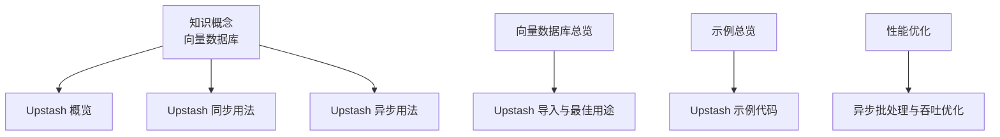
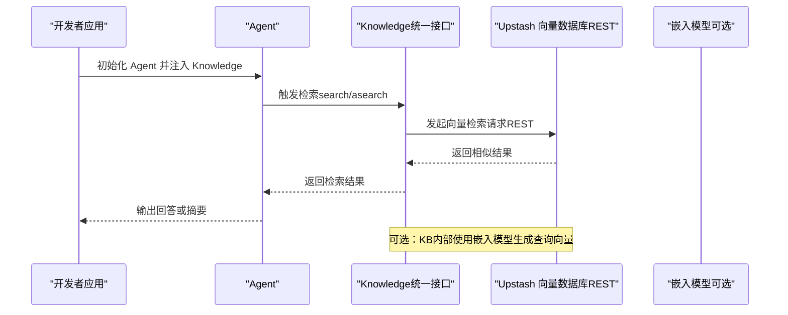
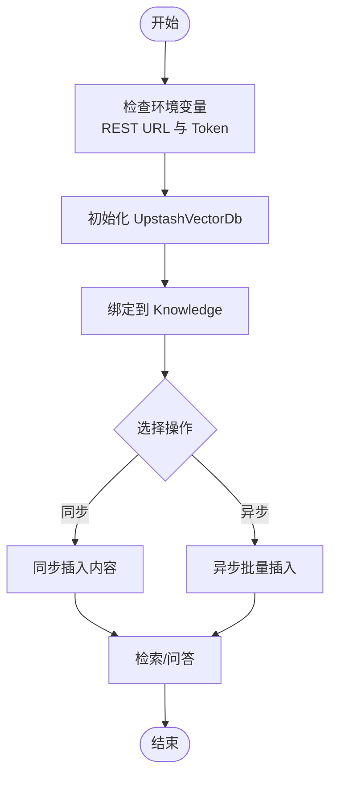
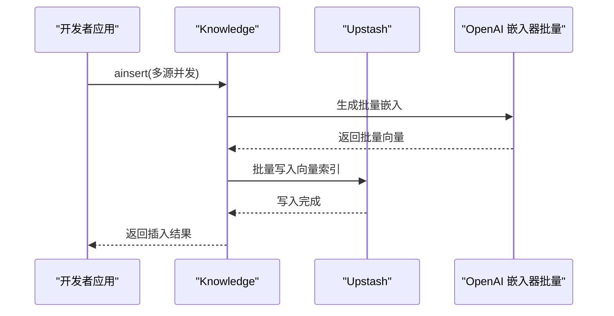
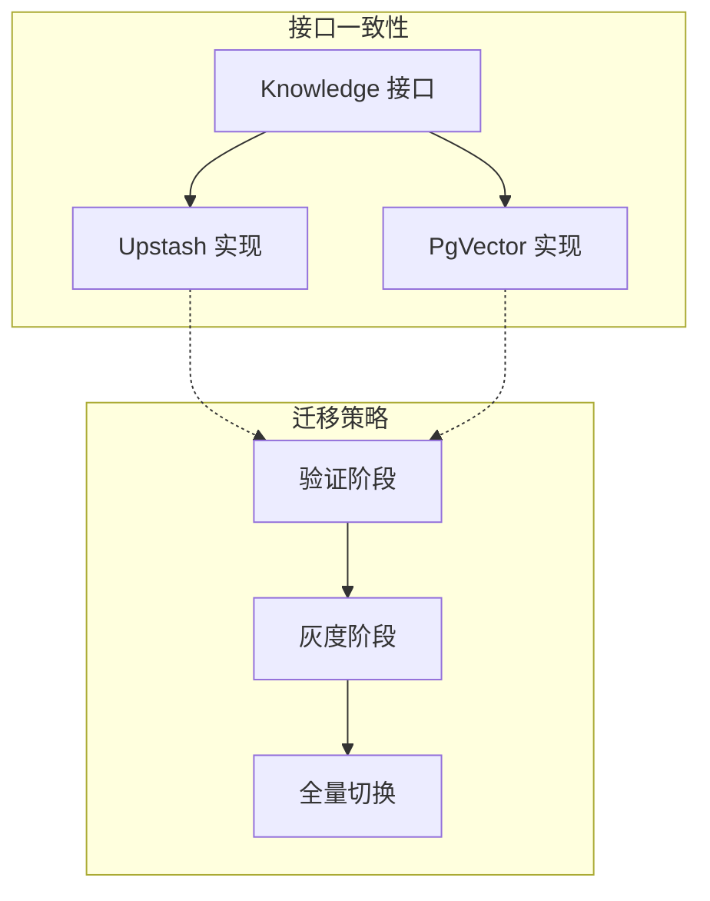
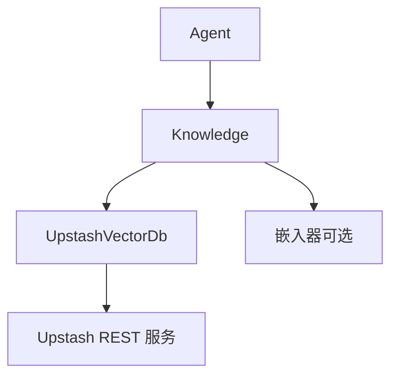

# 云原生向量数据库

<cite>
**本文引用的文件**
- [Upstash 概览](file://knowledge/vector-stores/upstash/overview.mdx)
- [Upstash 同步用法](file://knowledge/vector-stores/upstash/usage/upstash-db.mdx)
- [Upstash 异步用法](file://knowledge/vector-stores/upstash/usage/async-upstash-db.mdx)
- [Upstash 示例代码](file://examples/knowledge/vector-db/upstash-db/upstash-db.mdx)
- [向量数据库总览](file://cookbook/knowledge/vector-databases.mdx)
- [向量数据库概念](file://knowledge/concepts/vector-db.mdx)
- [性能优化建议](file://knowledge/concepts/performance-tips.mdx)
- [向量数据库示例总览](file://examples/knowledge/vector-db/overview.mdx)
</cite>

## 目录
1. [简介](#简介)
2. [项目结构](#项目结构)
3. [核心组件](#核心组件)
4. [架构总览](#架构总览)
5. [详细组件分析](#详细组件分析)
6. [依赖关系分析](#依赖关系分析)
7. [性能考量](#性能考量)
8. [故障排查指南](#故障排查指南)
9. [结论](#结论)
10. [附录](#附录)

## 简介
本文件面向云原生向量数据库场景，系统化介绍 Upstash 作为无服务器（Serverless）向量数据库的服务特性、使用方式与最佳实践。基于仓库中已有的示例与文档，我们将重点覆盖以下主题：
- Upstash 的托管服务模式与自动扩缩容能力
- 基于 REST 的连接方式与 SDK 使用流程
- 同步与异步集成示例、关键参数与环境变量
- 无服务器架构在向量搜索中的优势与限制
- 与传统托管数据库（如 PgVector）的对比与迁移路径

由于 Upstash 在本仓库中以“托管服务”“无服务器”“边缘”等关键词呈现，且示例展示了通过 REST URL 与 Token 连接的方式，因此本文围绕这些事实进行归纳总结。

## 项目结构
与 Upstash 相关的知识与示例主要分布在如下位置：
- 知识库概念与卡片入口：向量数据库概念页、数据库卡片列表
- Upstash 文档与示例：Upstash 概览、同步/异步用法、示例脚本
- 向量数据库总览：支持的数据库清单与导入方式
- 性能优化：通用性能建议与异步批处理

**图表来源**
- [向量数据库概念:1-117](file://knowledge/concepts/vector-db.mdx#L1-L117)
- [Upstash 概览:1-7](file://knowledge/vector-stores/upstash/overview.mdx#L1-L7)
- [Upstash 同步用法:1-71](file://knowledge/vector-stores/upstash/usage/upstash-db.mdx#L1-L71)
- [Upstash 异步用法:1-75](file://knowledge/vector-stores/upstash/usage/async-upstash-db.mdx#L1-L75)
- [向量数据库总览:1-227](file://cookbook/knowledge/vector-databases.mdx#L1-L227)
- [向量数据库示例总览:1-26](file://examples/knowledge/vector-db/overview.mdx#L1-L26)
- [Upstash 示例代码:1-122](file://examples/knowledge/vector-db/upstash-db/upstash-db.mdx#L1-L122)
- [性能优化建议:1-226](file://knowledge/concepts/performance-tips.mdx#L1-L226)

**章节来源**
- [向量数据库概念:1-117](file://knowledge/concepts/vector-db.mdx#L1-L117)
- [向量数据库总览:1-227](file://cookbook/knowledge/vector-databases.mdx#L1-L227)
- [向量数据库示例总览:1-26](file://examples/knowledge/vector-db/overview.mdx#L1-L26)

## 核心组件
- Upstash 向量数据库适配器：通过 REST URL 与 Token 连接，支持同步与异步操作；示例中展示了嵌入维度可配置、批量嵌入等能力。
- 知识库（Knowledge）：统一的检索接口，可注入任意向量数据库实现（包括 Upstash），并支持元数据过滤、删除等操作。
- Agent：通过启用知识库检索，实现基于向量相似度的问答与摘要。

关键要点
- 连接参数：REST URL、Token（以及可选的 dimension、embedder）
- 操作方法：insert/ainsert、delete_by_name/delete_by_metadata、search/asearch（概念性说明）
- 示例覆盖：同步插入与检索、异步批量插入与检索

**章节来源**
- [Upstash 同步用法:1-71](file://knowledge/vector-stores/upstash/usage/upstash-db.mdx#L1-L71)
- [Upstash 异步用法:1-75](file://knowledge/vector-stores/upstash/usage/async-upstash-db.mdx#L1-L75)
- [Upstash 示例代码:1-122](file://examples/knowledge/vector-db/upstash-db/upstash-db.mdx#L1-L122)
- [向量数据库概念:108-117](file://knowledge/concepts/vector-db.mdx#L108-L117)

## 架构总览
下图展示从 Agent 到知识库再到 Upstash 的调用链路，体现无服务器向量数据库的典型接入方式。

**图表来源**
- [Upstash 同步用法:19-40](file://knowledge/vector-stores/upstash/usage/upstash-db.mdx#L19-L40)
- [Upstash 异步用法:20-48](file://knowledge/vector-stores/upstash/usage/async-upstash-db.mdx#L20-L48)
- [Upstash 示例代码:32-98](file://examples/knowledge/vector-db/upstash-db/upstash-db.mdx#L32-L98)
- [向量数据库概念:1-21](file://knowledge/concepts/vector-db.mdx#L1-L21)

## 详细组件分析

### 组件一：Upstash 连接与初始化
- 参数与环境变量
  - 必填：REST URL、Token
  - 可选：dimension、embedder（示例中展示了 OpenAI 嵌入器与批量嵌入）
- 初始化流程
  - 创建 UpstashVectorDb 实例
  - 将其注入 Knowledge
  - 插入内容（同步/异步）
  - 执行检索并输出结果

**图表来源**
- [Upstash 同步用法:19-40](file://knowledge/vector-stores/upstash/usage/upstash-db.mdx#L19-L40)
- [Upstash 异步用法:20-48](file://knowledge/vector-stores/upstash/usage/async-upstash-db.mdx#L20-L48)
- [Upstash 示例代码:32-98](file://examples/knowledge/vector-db/upstash-db/upstash-db.mdx#L32-L98)

**章节来源**
- [Upstash 同步用法:1-71](file://knowledge/vector-stores/upstash/usage/upstash-db.mdx#L1-L71)
- [Upstash 异步用法:1-75](file://knowledge/vector-stores/upstash/usage/async-upstash-db.mdx#L1-L75)
- [Upstash 示例代码:1-122](file://examples/knowledge/vector-db/upstash-db/upstash-db.mdx#L1-L122)

### 组件二：异步批处理与吞吐优化
- 异步方法：ainsert、aprint_response 等
- 批量嵌入：示例中通过 OpenAI 嵌入器开启批量模式，提升吞吐
- 并发加载：示例演示了多源并发插入的思路

**图表来源**
- [Upstash 示例代码:45-53](file://examples/knowledge/vector-db/upstash-db/upstash-db.mdx#L45-L53)
- [Upstash 异步用法:35-48](file://knowledge/vector-stores/upstash/usage/async-upstash-db.mdx#L35-L48)
- [性能优化建议:91-106](file://knowledge/concepts/performance-tips.mdx#L91-L106)

**章节来源**
- [Upstash 示例代码:1-122](file://examples/knowledge/vector-db/upstash-db/upstash-db.mdx#L1-L122)
- [性能优化建议:91-106](file://knowledge/concepts/performance-tips.mdx#L91-L106)

### 组件三：与传统托管数据库的对比与迁移
- 数据库定位
  - Upstash：托管、无服务器、边缘
  - PgVector：生产、SQL 兼容、混合检索
- 迁移路径建议
  - 保持同一接口：通过替换 vector_db 实现即可切换
  - 注意点：嵌入维度、索引规格、检索参数差异
  - 逐步迁移：先在开发环境验证，再灰度到生产

**图表来源**
- [向量数据库总览:19-36](file://cookbook/knowledge/vector-databases.mdx#L19-L36)
- [向量数据库概念:91-106](file://knowledge/concepts/vector-db.mdx#L91-L106)

**章节来源**
- [向量数据库总览:1-227](file://cookbook/knowledge/vector-databases.mdx#L1-L227)
- [向量数据库概念:91-106](file://knowledge/concepts/vector-db.mdx#L91-L106)

## 依赖关系分析
- Upstash 适配器依赖
  - REST 客户端：用于与 Upstash 服务通信
  - 嵌入器：可选，示例中使用 OpenAI 嵌入器
- Knowledge 统一接口
  - 提供 insert/ainsert、search/asearch、删除与过滤等能力
- Agent 侧
  - 通过 Knowledge 启用检索式问答

**图表来源**
- [Upstash 示例代码:22-26](file://examples/knowledge/vector-db/upstash-db/upstash-db.mdx#L22-L26)
- [Upstash 同步用法:19-29](file://knowledge/vector-stores/upstash/usage/upstash-db.mdx#L19-L29)
- [Upstash 异步用法:20-30](file://knowledge/vector-stores/upstash/usage/async-upstash-db.mdx#L20-L30)

**章节来源**
- [Upstash 示例代码:1-122](file://examples/knowledge/vector-db/upstash-db/upstash-db.mdx#L1-L122)
- [Upstash 同步用法:1-71](file://knowledge/vector-stores/upstash/usage/upstash-db.mdx#L1-L71)
- [Upstash 异步用法:1-75](file://knowledge/vector-stores/upstash/usage/async-upstash-db.mdx#L1-L75)

## 性能考量
- 选择合适的数据库
  - 开发/测试：LanceDB/ChromaDB
  - 生产：PgVector（若已有 PostgreSQL）
  - 托管服务：Pinecone（自动扩缩容）
- 异步与批量
  - 使用 ainsert/asearch 提升并发
  - 批量嵌入降低网络往返
- 元数据过滤与分片
  - 通过 filters 缩小搜索范围
  - 合理的分块策略提升质量与速度

**章节来源**
- [性能优化建议:1-226](file://knowledge/concepts/performance-tips.mdx#L1-L226)
- [向量数据库概念:108-117](file://knowledge/concepts/vector-db.mdx#L108-L117)

## 故障排查指南
- 常见问题
  - 结果不相关：调整分块策略、增加 max_results、添加元数据过滤
  - 内容加载慢：启用 skip_if_exists、固定大小分块、分批处理
  - 内存占用高：减小批大小、缩小分块、清理过期内容
- 调试手段
  - 计时搜索、查看失败内容状态
  - 校验 filters 键值有效性

**章节来源**
- [性能优化建议:108-209](file://knowledge/concepts/performance-tips.mdx#L108-L209)

## 结论
- Upstash 以托管、无服务器、边缘为特点，适合快速落地与弹性扩展的向量检索场景。
- 通过统一的 Knowledge 接口，可在不同向量数据库间平滑切换。
- 结合异步与批量嵌入、合理的分块与过滤策略，可获得更优的吞吐与质量。
- 对比传统托管数据库（如 PgVector），Upstash 更强调“即开即用”的运维简化与弹性能力。

## 附录
- 快速上手步骤（基于示例）
  - 安装依赖、设置环境变量（REST URL、Token、OpenAI Key）、运行示例脚本
- 运行示例
  - 同步：插入内容后执行问答
  - 异步：批量插入后执行问答

**章节来源**
- [Upstash 同步用法:52-70](file://knowledge/vector-stores/upstash/usage/upstash-db.mdx#L52-L70)
- [Upstash 异步用法:56-74](file://knowledge/vector-stores/upstash/usage/async-upstash-db.mdx#L56-L74)
- [Upstash 示例代码:106-121](file://examples/knowledge/vector-db/upstash-db/upstash-db.mdx#L106-L121)