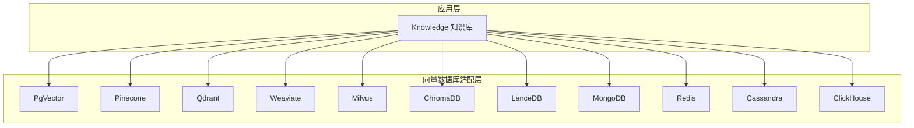
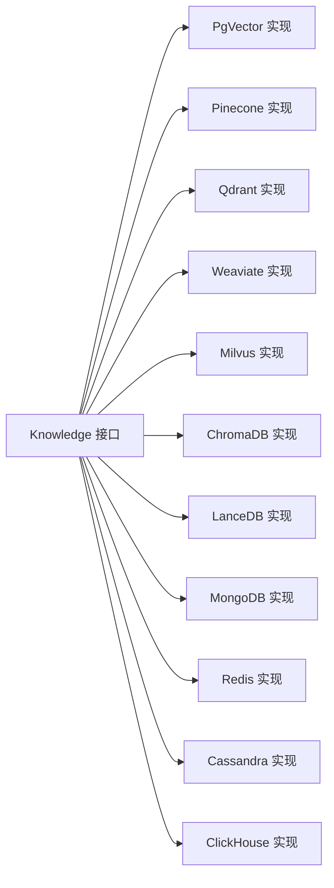

# 向量存储系统

<cite>
**本文引用的文件**
- [cookbook/knowledge/vector-databases.mdx](file://cookbook/knowledge/vector-databases.mdx)
- [_snippets/vectordb_pgvector_params.mdx](file://_snippets/vectordb_pgvector_params.mdx)
- [_snippets/vectordb_lancedb_params.mdx](file://_snippets/vectordb_lancedb_params.mdx)
- [_snippets/vectordb_chromadb_params.mdx](file://_snippets/vectordb_chromadb_params.mdx)
- [_snippets/vectordb_pineconedb_params.mdx](file://_snippets/vectordb_pineconedb_params.mdx)
- [_snippets/vectordb_weaviate_params.mdx](file://_snippets/vectordb_weaviate_params.mdx)
- [_snippets/vectordb_qdrant_params.mdx](file://_snippets/vectordb_qdrant_params.mdx)
- [_snippets/vectordb_mongodb_params.mdx](file://_snippets/vectordb_mongodb_params.mdx)
- [_snippets/vectordb_redis_params.mdx](file://_snippets/vectordb_redis_params.mdx)
- [_snippets/vectordb_cassandra_params.mdx](file://_snippets/vectordb_cassandra_params.mdx)
- [_snippets/vectordb_milvus_params.mdx](file://_snippets/vectordb_milvus_params.mdx)
- [_snippets/vectordb_clickhouse_params.mdx](file://_snippets/vectordb_clickhouse_params.mdx)
</cite>

## 目录
1. [简介](#简介)
2. [项目结构](#项目结构)
3. [核心组件](#核心组件)
4. [架构总览](#架构总览)
5. [详细组件分析](#详细组件分析)
6. [依赖关系分析](#依赖关系分析)
7. [性能考量](#性能考量)
8. [故障排查指南](#故障排查指南)
9. [结论](#结论)
10. [附录](#附录)

## 简介
本技术文档面向向量存储系统，聚焦 Agno 支持的 20+ 种向量数据库，覆盖本地嵌入式与云托管两类形态，并对索引策略、查询优化、迁移路径与选型建议进行系统化说明。文档以统一接口为前提，强调通过“一行代码切换数据库”的能力，帮助读者在不同业务阶段（开发、测试、生产）快速选择合适的向量存储。

## 项目结构
围绕向量数据库的主题，知识库 Cookbook 提供了统一的“支持列表”与“按库示例”，并配套各数据库的参数说明片段。这些内容构成了本技术文档的核心素材来源。

```mermaid
graph TB
A["知识库 Cookbook<br/>vector-databases.mdx"] --> B["PgVector 参数说明<br/>vectordb_pgvector_params.mdx"]
A --> C["LanceDB 参数说明<br/>vectordb_lancedb_params.mdx"]
A --> D["ChromaDB 参数说明<br/>vectordb_chromadb_params.mdx"]
A --> E["Pinecone 参数说明<br/>vectordb_pineconedb_params.mdx"]
A --> F["Weaviate 参数说明<br/>vectordb_weaviate_params.mdx"]
A --> G["Qdrant 参数说明<br/>vectordb_qdrant_params.mdx"]
A --> H["MongoDB 参数说明<br/>vectordb_mongodb_params.mdx"]
A --> I["Redis 参数说明<br/>vectordb_redis_params.mdx"]
A --> J["Cassandra 参数说明<br/>vectordb_cassandra_params.mdx"]
A --> K["Milvus 参数说明<br/>vectordb_milvus_params.mdx"]
A --> L["ClickHouse 参数说明<br/>vectordb_clickhouse_params.mdx"]
```

图表来源
- [cookbook/knowledge/vector-databases.mdx:1-227](file://cookbook/knowledge/vector-databases.mdx#L1-L227)
- [_snippets/vectordb_pgvector_params.mdx:1-16](file://_snippets/vectordb_pgvector_params.mdx#L1-L16)
- [_snippets/vectordb_lancedb_params.mdx:1-14](file://_snippets/vectordb_lancedb_params.mdx#L1-L14)
- [_snippets/vectordb_chromadb_params.mdx:1-8](file://_snippets/vectordb_chromadb_params.mdx#L1-L8)
- [_snippets/vectordb_pineconedb_params.mdx:1-18](file://_snippets/vectordb_pineconedb_params.mdx#L1-L18)
- [_snippets/vectordb_weaviate_params.mdx:1-13](file://_snippets/vectordb_weaviate_params.mdx#L1-L13)
- [_snippets/vectordb_qdrant_params.mdx:1-17](file://_snippets/vectordb_qdrant_params.mdx#L1-L17)
- [_snippets/vectordb_mongodb_params.mdx:1-22](file://_snippets/vectordb_mongodb_params.mdx#L1-L22)
- [_snippets/vectordb_redis_params.mdx:1-11](file://_snippets/vectordb_redis_params.mdx#L1-L11)
- [_snippets/vectordb_cassandra_params.mdx:1-7](file://_snippets/vectordb_cassandra_params.mdx#L1-L7)
- [_snippets/vectordb_milvus_params.mdx:1-7](file://_snippets/vectordb_milvus_params.mdx#L1-L7)
- [_snippets/vectordb_clickhouse_params.mdx:1-15](file://_snippets/vectordb_clickhouse_params.mdx#L1-L15)

章节来源
- [cookbook/knowledge/vector-databases.mdx:1-227](file://cookbook/knowledge/vector-databases.mdx#L1-L227)

## 核心组件
- 统一接口：知识库模块通过统一的向量数据库接口，屏蔽底层差异，实现“一行切换”。
- 数据库矩阵：涵盖本地嵌入式（LanceDB、ChromaDB、SQLite）、云托管（Pinecone、Weaviate、Qdrant）与混合生态（PgVector、MongoDB、Redis、Cassandra、ClickHouse、Milvus、SingleStore、Upstash、Couchbase、SurrealDB）等。
- 配置参数：每个数据库均提供参数表，覆盖连接、索引、距离度量、混合检索权重、认证与超时等关键项。
- 示例与运行：提供按库示例脚本与运行命令，便于快速验证。

章节来源
- [cookbook/knowledge/vector-databases.mdx:17-36](file://cookbook/knowledge/vector-databases.mdx#L17-L36)
- [cookbook/knowledge/vector-databases.mdx:211-227](file://cookbook/knowledge/vector-databases.mdx#L211-L227)

## 架构总览
下图展示知识库与多向量数据库的交互关系，强调“统一接口 + 多后端适配”的架构模式。

图表来源
- [cookbook/knowledge/vector-databases.mdx:17-36](file://cookbook/knowledge/vector-databases.mdx#L17-L36)

## 详细组件分析

### PgVector（PostgreSQL 扩展）
- 角色定位：面向 PostgreSQL 用户与生产环境，提供向量相似性搜索能力。
- 关键参数要点
  - 连接与表：表名、Schema、数据库 URL 或 Engine。
  - 搜索类型：向量、关键词或混合检索；混合检索包含向量分数权重等。
  - 距离度量：默认余弦距离。
  - 索引类型：可选 IVFFLAT 或 HNSW。
  - 语言与模式升级：支持内容语言与自动模式升级。
- 使用场景：需要与现有 Postgres 生态深度集成、对事务一致性有要求的生产系统。

章节来源
- [cookbook/knowledge/vector-databases.mdx:39-73](file://cookbook/knowledge/vector-databases.mdx#L39-L73)
- [_snippets/vectordb_pgvector_params.mdx:1-16](file://_snippets/vectordb_pgvector_params.mdx#L1-L16)

### Pinecone（托管向量数据库）
- 角色定位：全托管、Serverless 或 Pod 规模化部署，适合快速上线与弹性伸缩。
- 关键参数要点
  - 基础：索引名称、维度、指标（余弦/点积/汉明）。
  - 规格：Serverless 或 Pod 规范（云厂商、区域）。
  - 认证：API Key、Host、额外请求头。
  - 搜索：命名空间、超时、线程池、混合检索开关与权重。
- 使用场景：无需运维、快速迭代、高可用与弹性优先的场景。

章节来源
- [cookbook/knowledge/vector-databases.mdx:75-91](file://cookbook/knowledge/vector-databases.mdx#L75-L91)
- [_snippets/vectordb_pineconedb_params.mdx:1-18](file://_snippets/vectordb_pineconedb_params.mdx#L1-L18)

### Qdrant（高性能向量与过滤）
- 角色定位：高性能、强过滤能力，支持 gRPC/HTTP 双栈。
- 关键参数要点
  - 基础：集合名、URL/端口、gRPC 端口、是否优先 gRPC。
  - 安全：API Key、HTTPS、Host、前缀、超时。
  - 搜索：距离度量、嵌入器、路径（本地模式）。
- 使用场景：需要复杂过滤与高吞吐检索的场景。

章节来源
- [cookbook/knowledge/vector-databases.mdx:93-107](file://cookbook/knowledge/vector-databases.mdx#L93-L107)
- [_snippets/vectordb_qdrant_params.mdx:1-17](file://_snippets/vectordb_qdrant_params.mdx#L1-L17)

### Weaviate（混合检索与 GraphQL）
- 角色定位：向量 + 关键词混合检索，支持 GraphQL 查询。
- 关键参数要点
  - 连接：WCD URL/API Key 或本地实例。
  - 集合与索引：集合名、向量索引类型（HNSW/FLAT/DYNAMIC）、距离度量。
  - 搜索：向量/关键词/混合；混合权重；重排序器。
- 使用场景：需要自然语言查询与结构化过滤结合的场景。

章节来源
- [cookbook/knowledge/vector-databases.mdx:109-125](file://cookbook/knowledge/vector-databases.mdx#L109-L125)
- [_snippets/vectordb_weaviate_params.mdx:1-13](file://_snippets/vectordb_weaviate_params.mdx#L1-L13)

### Milvus（分布式与高扩展）
- 角色定位：面向大规模、分布式部署，支持多种部署形态。
- 关键参数要点
  - 集合与 URI：集合名、服务地址或本地文件路径。
  - 搜索：距离度量、可选认证 Token。
- 使用场景：海量向量、高并发写入与查询的场景。

章节来源
- [cookbook/knowledge/vector-databases.mdx:127-141](file://cookbook/knowledge/vector-databases.mdx#L127-L141)
- [_snippets/vectordb_milvus_params.mdx:1-7](file://_snippets/vectordb_milvus_params.mdx#L1-L7)

### ChromaDB（本地开发与原型）
- 角色定位：嵌入式、零外部依赖，适合本地开发与原型验证。
- 关键参数要点
  - 集合名、路径、持久化客户端。
  - 距离度量、嵌入器。
- 使用场景：本地开发、快速迭代、无外部依赖。

章节来源
- [cookbook/knowledge/vector-databases.mdx:143-158](file://cookbook/knowledge/vector-databases.mdx#L143-L158)
- [_snippets/vectordb_chromadb_params.mdx:1-8](file://_snippets/vectordb_chromadb_params.mdx#L1-L8)

### LanceDB（嵌入式与 Serverless）
- 角色定位：原生 Python、Serverless，适合边缘与轻量化部署。
- 关键参数要点
  - 连接：URI、Lance 表对象或表名。
  - 搜索：搜索类型、距离度量、探针数、重排序器、Tantivy 开关。
- 使用场景：边缘计算、无服务器、Python 原生生态。

章节来源
- [cookbook/knowledge/vector-databases.mdx:160-174](file://cookbook/knowledge/vector-databases.mdx#L160-L174)
- [_snippets/vectordb_lancedb_params.mdx:1-14](file://_snippets/vectordb_lancedb_params.mdx#L1-L14)

### MongoDB（Atlas 向量搜索）
- 角色定位：文档数据库用户平滑接入向量搜索。
- 关键参数要点
  - 集合名、数据库 URL、搜索索引名。
  - 混合检索：向量与关键词权重、融合常数。
  - 连接池、重试写入、Cosmos 兼容模式等。
- 使用场景：已有 MongoDB 生态、文档与向量混合检索。

章节来源
- [cookbook/knowledge/vector-databases.mdx:176-191](file://cookbook/knowledge/vector-databases.mdx#L176-L191)
- [_snippets/vectordb_mongodb_params.mdx:1-22](file://_snippets/vectordb_mongodb_params.mdx#L1-L22)

### Redis（低延迟与缓存）
- 角色定位：内存型向量检索，适合低延迟与缓存场景。
- 关键参数要点
  - 索引名、Redis URL/客户端、距离度量。
  - 搜索类型：向量/关键词/混合；混合权重。
  - 嵌入器默认值与额外连接参数。
- 使用场景：缓存加速、实时检索、低延迟要求。

章节来源
- [cookbook/knowledge/vector-databases.mdx:193-209](file://cookbook/knowledge/vector-databases.mdx#L193-L209)
- [_snippets/vectordb_redis_params.mdx:1-11](file://_snippets/vectordb_redis_params.mdx#L1-L11)

### Cassandra（分布式与可扩展）
- 角色定位：分布式数据库用户接入向量检索。
- 关键参数要点
  - 表名、Keyspace、嵌入器、Cassandra Session。
- 使用场景：分布式架构、高可用与可扩展性优先。

章节来源
- [cookbook/knowledge/vector-databases.mdx:20-35](file://cookbook/knowledge/vector-databases.mdx#L20-L35)
- [_snippets/vectordb_cassandra_params.mdx:1-7](file://_snippets/vectordb_cassandra_params.mdx#L1-L7)

### ClickHouse（分析与 OLAP）
- 角色定位：分析型数据库，支持向量相似与 HNSW 索引。
- 关键参数要点
  - 表名、主机、用户名/密码、端口、数据库名、DSN。
  - 压缩算法、客户端、嵌入器、距离度量、HNSW 索引配置。
- 使用场景：向量检索与分析报表并行的场景。

章节来源
- [cookbook/knowledge/vector-databases.mdx:20-35](file://cookbook/knowledge/vector-databases.mdx#L20-L35)
- [_snippets/vectordb_clickhouse_params.mdx:1-15](file://_snippets/vectordb_clickhouse_params.mdx#L1-L15)

### 其他数据库（概览）
- SingleStore：实时分析场景。
- Upstash：边缘 Serverless。
- Couchbase：移动端与边缘同步。
- SurrealDB：多模型数据库。
- SQLite：轻量级本地存储（作为向量存储的一种选择）。

章节来源
- [cookbook/knowledge/vector-databases.mdx:17-36](file://cookbook/knowledge/vector-databases.mdx#L17-L36)

## 依赖关系分析
- 组件耦合：知识库模块仅依赖统一接口，具体数据库实现通过参数注入，降低耦合。
- 外部依赖：各数据库依赖其官方 SDK/驱动（如 Pinecone、Weaviate、Qdrant、Milvus、MongoDB、Redis、ClickHouse 等）。
- 可能的循环依赖：基于参数表与示例文档，未见直接循环导入；注意在自定义嵌入器与重排序器时避免环状引用。

图表来源
- [cookbook/knowledge/vector-databases.mdx:17-36](file://cookbook/knowledge/vector-databases.mdx#L17-L36)

## 性能考量
- 索引策略
  - HNSW：适用于高维向量与通用召回，查询性能较优。
  - IVFFLAT：适合大规模数据与可调分桶数的场景。
  - 自定义索引：部分数据库允许自定义索引配置（如 ClickHouse 的 HNSW）。
- 距离度量
  - 余弦距离：文本向量常用。
  - 欧氏/点积：根据嵌入器与任务特性选择。
- 混合检索
  - 向量与关键词加权融合，平衡准确性与效率。
  - 常见权重：0.5~0.7 之间按业务调优。
- 连接与并发
  - 连接池大小、超时设置、线程池数量影响吞吐与延迟。
- 存储与压缩
  - 云托管数据库通常内置压缩与缓存策略；本地嵌入式需关注磁盘与内存占用。

## 故障排查指南
- 连接失败
  - 校验连接字符串、API Key、Host/Port、超时设置。
  - 对于云托管数据库，确认网络可达与安全组放通。
- 索引未就绪
  - MongoDB Atlas 等需等待索引构建完成；适当增加等待时间。
- 混合检索效果差
  - 调整向量与关键词权重、融合常数；检查嵌入器一致性。
- 写入/查询抖动
  - 检查连接池大小、线程池配置、批量写入批次。
- 本地嵌入式性能不足
  - 调整探针数（LanceDB）、索引类型（PgVector/HNSW/IVFFLAT）。

## 结论
Agno 的向量存储体系以“统一接口 + 多后端适配”为核心，覆盖从本地开发到生产部署的完整生命周期。通过参数化配置与示例脚本，用户可在不同数据库间快速切换。选型建议如下：
- 开发/原型：ChromaDB、LanceDB
- 生产/Postgres 生态：PgVector
- 云托管/弹性：Pinecone、Qdrant、Weaviate
- 分布式/高扩展：Milvus、Cassandra
- 低延迟/缓存：Redis
- 文档与向量混合：MongoDB
- 分析与 OLAP：ClickHouse

## 附录

### 各数据库配置参数速览（摘要）
- PgVector
  - 关键字段：表名、Schema、数据库 URL、搜索类型、距离度量、索引类型、混合权重等。
  - 参考路径：[_snippets/vectordb_pgvector_params.mdx:1-16](file://_snippets/vectordb_pgvector_params.mdx#L1-L16)
- LanceDB
  - 关键字段：URI、表名/表对象、API Key、搜索类型、距离度量、探针数、重排序器、Tantivy 开关等。
  - 参考路径：[_snippets/vectordb_lancedb_params.mdx:1-14](file://_snippets/vectordb_lancedb_params.mdx#L1-L14)
- ChromaDB
  - 关键字段：集合名、路径、持久化客户端、距离度量、嵌入器等。
  - 参考路径：[_snippets/vectordb_chromadb_params.mdx:1-8](file://_snippets/vectordb_chromadb_params.mdx#L1-L8)
- Pinecone
  - 关键字段：索引名、维度、规格（Serverless/Pod）、指标、API Key、命名空间、超时、混合检索开关与权重等。
  - 参考路径：[_snippets/vectordb_pineconedb_params.mdx:1-18](file://_snippets/vectordb_pineconedb_params.mdx#L1-L18)
- Weaviate
  - 关键字段：WCD URL/API Key、本地实例开关、集合名、向量索引类型、距离度量、搜索类型、重排序器、混合权重等。
  - 参考路径：[_snippets/vectordb_weaviate_params.mdx:1-13](file://_snippets/vectordb_weaviate_params.mdx#L1-L13)
- Qdrant
  - 关键字段：集合名、URL/端口、gRPC 端口、优先 gRPC、HTTPS、API Key、超时、路径等。
  - 参考路径：[_snippets/vectordb_qdrant_params.mdx:1-17](file://_snippets/vectordb_qdrant_params.mdx#L1-L17)
- MongoDB
  - 关键字段：集合名、数据库 URL、搜索索引名、混合检索权重、连接池、重试写入、Cosmos 兼容模式等。
  - 参考路径：[_snippets/vectordb_mongodb_params.mdx:1-22](file://_snippets/vectordb_mongodb_params.mdx#L1-L22)
- Redis
  - 关键字段：索引名、Redis URL/客户端、距离度量、搜索类型、混合权重、嵌入器等。
  - 参考路径：[_snippets/vectordb_redis_params.mdx:1-11](file://_snippets/vectordb_redis_params.mdx#L1-L11)
- Cassandra
  - 关键字段：表名、Keyspace、嵌入器、Cassandra Session。
  - 参考路径：[_snippets/vectordb_cassandra_params.mdx:1-7](file://_snippets/vectordb_cassandra_params.mdx#L1-L7)
- Milvus
  - 关键字段：集合名、URI、距离度量、Token。
  - 参考路径：[_snippets/vectordb_milvus_params.mdx:1-7](file://_snippets/vectordb_milvus_params.mdx#L1-L7)
- ClickHouse
  - 关键字段：表名、主机、用户名/密码、端口、数据库名、DSN、压缩算法、客户端、嵌入器、距离度量、HNSW 索引。
  - 参考路径：[_snippets/vectordb_clickhouse_params.mdx:1-15](file://_snippets/vectordb_clickhouse_params.mdx#L1-L15)

### 选型对比与最佳实践
- 选型矩阵（示例）
  - 开发/原型：ChromaDB（零依赖）、LanceDB（Serverless）
  - 生产/Postgres：PgVector（生态一致）
  - 云托管：Pinecone（弹性）、Qdrant（过滤）、Weaviate（混合检索）
  - 分布式：Milvus、Cassandra
  - 低延迟：Redis
  - 文档+向量：MongoDB
  - 分析+检索：ClickHouse
- 最佳实践
  - 明确距离度量与索引类型，保持训练与推理一致。
  - 混合检索先以默认权重起步，再用 A/B 调参。
  - 云托管数据库注意网络与配额限制，本地嵌入式关注磁盘与内存。
  - 使用统一接口时，确保嵌入器版本与维度一致。