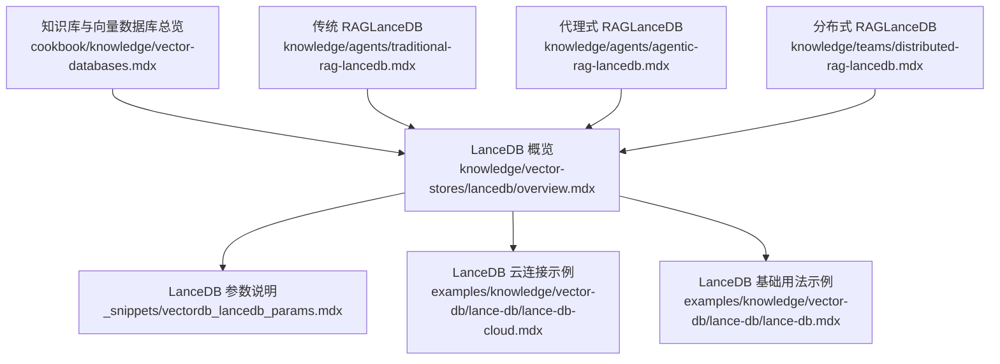
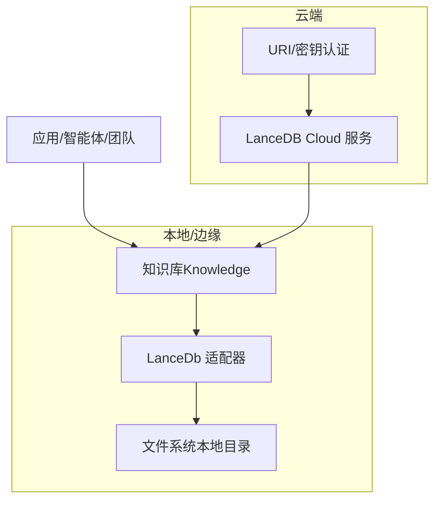
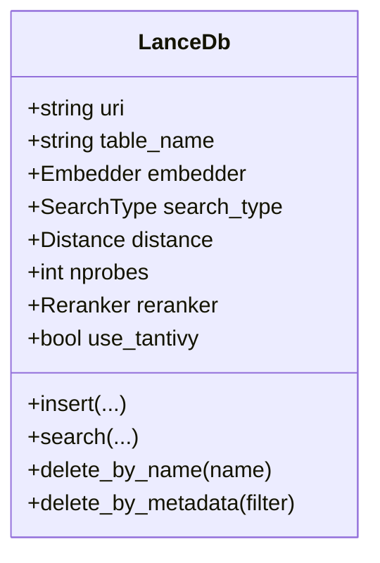
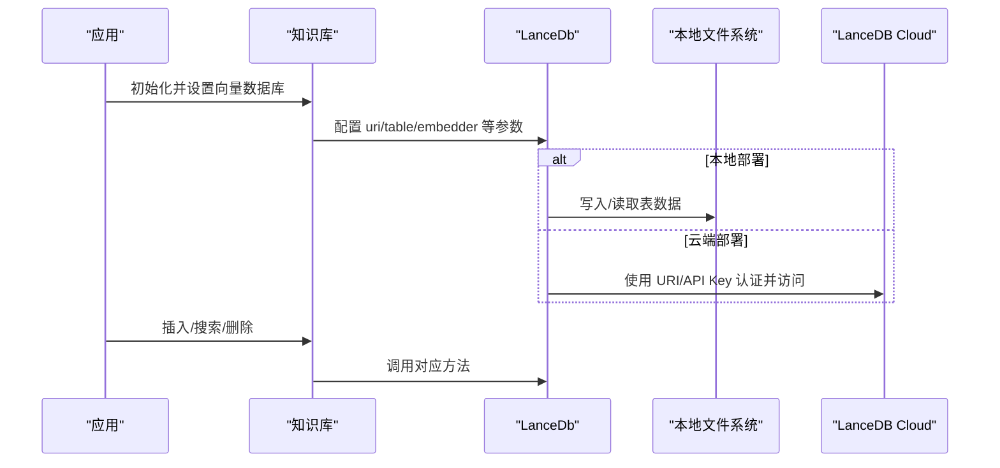
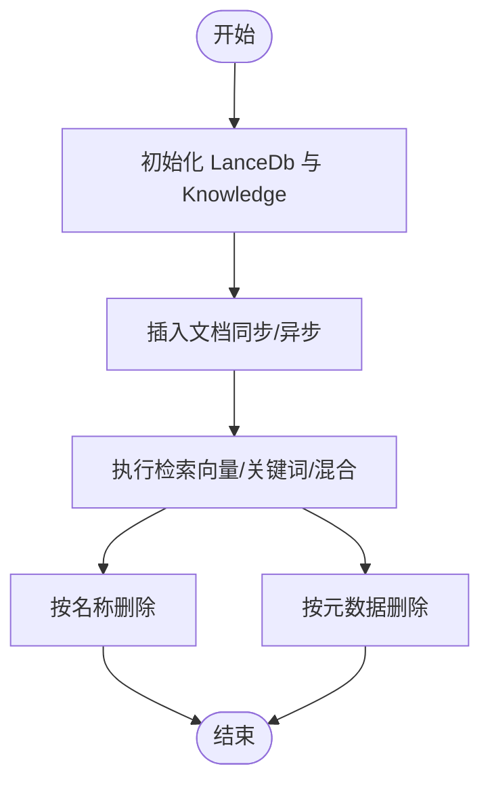
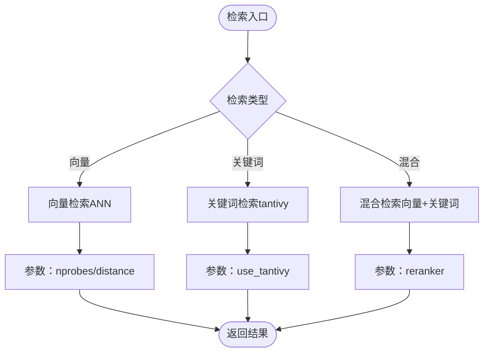
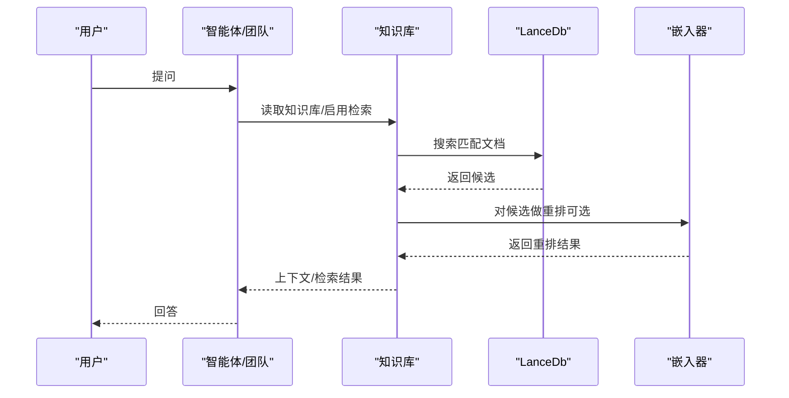
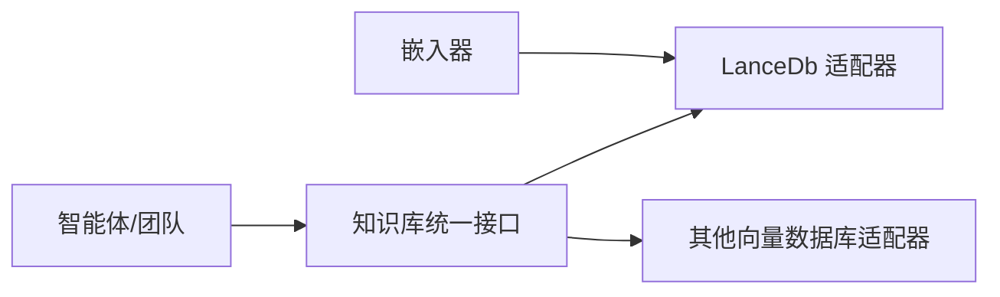

# 本地向量数据库

<cite>
**本文引用的文件**
- [知识库向量数据库总览](file://cookbook/knowledge/vector-databases.mdx)
- [LanceDB 向量数据库概览](file://knowledge/vector-stores/lancedb/overview.mdx)
- [LanceDB 参数说明](file://_snippets/vectordb_lancedb_params.mdx)
- [LanceDB 云连接示例](file://examples/knowledge/vector-db/lance-db/lance-db-cloud.mdx)
- [LanceDB 基础用法示例](file://examples/knowledge/vector-db/lance-db/lance-db.mdx)
- [智能体传统 RAG（LanceDB）](file://knowledge/agents/traditional-rag-lancedb.mdx)
- [智能体代理式 RAG（LanceDB）](file://knowledge/agents/agentic-rag-lancedb.mdx)
- [团队分布式 RAG（LanceDB）](file://knowledge/teams/distributed-rag-lancedb.mdx)
</cite>

## 目录
1. [引言](#引言)
2. [项目结构](#项目结构)
3. [核心组件](#核心组件)
4. [架构总览](#架构总览)
5. [详细组件分析](#详细组件分析)
6. [依赖关系分析](#依赖关系分析)
7. [性能考量](#性能考量)
8. [故障排查指南](#故障排查指南)
9. [结论](#结论)
10. [附录](#附录)

## 引言
本技术文档聚焦于本地向量数据库的完整方案，以 LanceDB 为核心，系统阐述其在本地/边缘/离线场景下的部署方式、数据导入导出流程、查询性能与优化策略，并提供与远程向量数据库的对比与迁移建议。文档基于仓库中已有的示例与参考材料进行归纳总结，帮助读者快速理解并落地 LanceDB 在知识库与智能体检索增强生成（RAG）中的应用。

## 项目结构
围绕 LanceDB 的知识库与示例主要分布在以下路径：
- 知识库与向量数据库总览：用于统一了解不同向量数据库的选型与切换方式
- LanceDB 向量数据库概览：提供安装、基础用法与异步支持说明
- LanceDB 参数说明：列出 LanceDb 关键参数及其默认值与用途
- 示例：LanceDB 云连接、本地基础用法、传统 RAG、代理式 RAG、分布式 RAG

图表来源
- [知识库向量数据库总览:1-227](file://cookbook/knowledge/vector-databases.mdx#L1-L227)
- [LanceDB 向量数据库概览:1-103](file://knowledge/vector-stores/lancedb/overview.mdx#L1-L103)
- [LanceDB 参数说明:1-14](file://_snippets/vectordb_lancedb_params.mdx#L1-L14)
- [LanceDB 云连接示例:1-107](file://examples/knowledge/vector-db/lance-db/lance-db-cloud.mdx#L1-L107)
- [LanceDB 基础用法示例:1-109](file://examples/knowledge/vector-db/lance-db/lance-db.mdx#L1-L109)
- [智能体传统 RAG（LanceDB）:1-74](file://knowledge/agents/traditional-rag-lancedb.mdx#L1-L74)
- [智能体代理式 RAG（LanceDB）:1-72](file://knowledge/agents/agentic-rag-lancedb.mdx#L1-L72)
- [团队分布式 RAG（LanceDB）:1-234](file://knowledge/teams/distributed-rag-lancedb.mdx#L1-L234)

章节来源
- [知识库向量数据库总览:1-227](file://cookbook/knowledge/vector-databases.mdx#L1-L227)
- [LanceDB 向量数据库概览:1-103](file://knowledge/vector-stores/lancedb/overview.mdx#L1-L103)

## 核心组件
- LanceDb 向量数据库适配器：通过统一的知识库接口对接 LanceDB，支持同步与异步操作、关键词/向量/混合检索模式、嵌入器选择等
- 知识库（Knowledge）：封装向量检索、插入、删除、分页批量写入等能力，面向智能体与团队工作流
- 智能体与团队：通过启用知识库检索或添加知识到上下文的方式，实现传统 RAG 与代理式 RAG

章节来源
- [LanceDB 向量数据库概览:1-103](file://knowledge/vector-stores/lancedb/overview.mdx#L1-L103)
- [LanceDB 参数说明:1-14](file://_snippets/vectordb_lancedb_params.mdx#L1-L14)
- [智能体传统 RAG（LanceDB）:1-74](file://knowledge/agents/traditional-rag-lancedb.mdx#L1-L74)
- [智能体代理式 RAG（LanceDB）:1-72](file://knowledge/agents/agentic-rag-lancedb.mdx#L1-L72)
- [团队分布式 RAG（LanceDB）:1-234](file://knowledge/teams/distributed-rag-lancedb.mdx#L1-L234)

## 架构总览
下图展示了从“知识库”到“向量数据库”的调用链路，以及在本地与云端两种部署形态下的差异：

图表来源
- [LanceDB 向量数据库概览:1-103](file://knowledge/vector-stores/lancedb/overview.mdx#L1-L103)
- [LanceDB 云连接示例:1-107](file://examples/knowledge/vector-db/lance-db/lance-db-cloud.mdx#L1-L107)

## 详细组件分析

### 组件一：LanceDb 参数与配置
- 关键参数包括：uri、table_name、embedder、search_type、distance、nprobes、reranker、use_tantivy 等
- 支持向量检索、关键词检索、混合检索；可结合 reranker 进行重排；可启用 tantivy 文本检索
- 默认距离度量与 ANN 探针数可通过参数调整，以平衡召回与延迟

图表来源
- [LanceDB 参数说明:1-14](file://_snippets/vectordb_lancedb_params.mdx#L1-L14)

章节来源
- [LanceDB 参数说明:1-14](file://_snippets/vectordb_lancedb_params.mdx#L1-L14)

### 组件二：本地与云端部署形态
- 本地形态：通过本地文件系统存储 LanceDB 表数据，适合离线与隐私敏感场景
- 云端形态：通过 URI 与 API Key 连接 LanceDB Cloud，适合需要托管与多端共享的场景

图表来源
- [LanceDB 云连接示例:43-87](file://examples/knowledge/vector-db/lance-db/lance-db-cloud.mdx#L43-L87)
- [LanceDB 向量数据库概览:1-103](file://knowledge/vector-stores/lancedb/overview.mdx#L1-L103)

章节来源
- [LanceDB 云连接示例:1-107](file://examples/knowledge/vector-db/lance-db/lance-db-cloud.mdx#L1-L107)
- [LanceDB 向量数据库概览:1-103](file://knowledge/vector-stores/lancedb/overview.mdx#L1-L103)

### 组件三：数据导入与导出流程
- 导入：支持同步与异步批量插入；可直接从 URL/本地路径加载；可按名称或元数据过滤删除
- 删除：支持按名称删除、按元数据过滤删除
- 批量与异步：示例展示异步批量插入与响应，提升吞吐

图表来源
- [LanceDB 基础用法示例:64-94](file://examples/knowledge/vector-db/lance-db/lance-db.mdx#L64-L94)

章节来源
- [LanceDB 基础用法示例:1-109](file://examples/knowledge/vector-db/lance-db/lance-db.mdx#L1-L109)

### 组件四：检索类型与性能要点
- 检索类型：向量检索、关键词检索、混合检索
- 性能参数：nprobes 控制 ANN 探针数量；distance 度量可选余弦等；use_tantivy 可开启文本检索
- 异步支持：异步插入与响应可提升高并发场景下的吞吐

图表来源
- [LanceDB 参数说明:1-14](file://_snippets/vectordb_lancedb_params.mdx#L1-L14)
- [LanceDB 向量数据库概览:58-99](file://knowledge/vector-stores/lancedb/overview.mdx#L58-L99)

章节来源
- [LanceDB 参数说明:1-14](file://_snippets/vectordb_lancedb_params.mdx#L1-L14)
- [LanceDB 向量数据库概览:58-99](file://knowledge/vector-stores/lancedb/overview.mdx#L58-L99)

### 组件五：RAG 场景实践
- 传统 RAG：将知识库内容加入上下文，由模型直接回答
- 代理式 RAG：智能体在对话过程中动态检索相关片段，再进行回答
- 分布式 RAG：多个专业智能体协作完成检索、扩展、合成与校验

图表来源
- [智能体传统 RAG（LanceDB）:15-47](file://knowledge/agents/traditional-rag-lancedb.mdx#L15-L47)
- [智能体代理式 RAG（LanceDB）:15-45](file://knowledge/agents/agentic-rag-lancedb.mdx#L15-L45)
- [团队分布式 RAG（LanceDB）:35-137](file://knowledge/teams/distributed-rag-lancedb.mdx#L35-L137)

章节来源
- [智能体传统 RAG（LanceDB）:1-74](file://knowledge/agents/traditional-rag-lancedb.mdx#L1-L74)
- [智能体代理式 RAG（LanceDB）:1-72](file://knowledge/agents/agentic-rag-lancedb.mdx#L1-L72)
- [团队分布式 RAG（LanceDB）:1-234](file://knowledge/teams/distributed-rag-lancedb.mdx#L1-L234)

## 依赖关系分析
- 统一接口：知识库通过统一接口对接多种向量数据库，切换只需变更一行代码
- LanceDB 适配器：封装 LanceDB 的连接、检索、插入、删除等操作
- 智能体与团队：通过知识库检索或上下文注入实现 RAG

图表来源
- [知识库向量数据库总览:1-227](file://cookbook/knowledge/vector-databases.mdx#L1-L227)
- [LanceDB 向量数据库概览:1-103](file://knowledge/vector-stores/lancedb/overview.mdx#L1-L103)

章节来源
- [知识库向量数据库总览:1-227](file://cookbook/knowledge/vector-databases.mdx#L1-L227)
- [LanceDB 向量数据库概览:1-103](file://knowledge/vector-stores/lancedb/overview.mdx#L1-L103)

## 性能考量
- 异步与批量：示例展示了异步批量插入与响应，适合高并发与大批量数据处理
- 检索类型选择：根据业务对召回与延迟的要求选择向量/关键词/混合检索
- 参数调优：合理设置 nprobes、distance、reranker、use_tantivy 等参数以获得更佳性能
- 存储位置：本地部署可避免网络开销，适合离线与隐私敏感场景；云端部署便于共享与扩展

章节来源
- [LanceDB 向量数据库概览:58-99](file://knowledge/vector-stores/lancedb/overview.mdx#L58-L99)
- [LanceDB 参数说明:1-14](file://_snippets/vectordb_lancedb_params.mdx#L1-L14)

## 故障排查指南
- 环境变量缺失：云端部署需正确设置 URI 与 API Key
- 权限问题：确认 API Key 与 URI 是否有效
- 数据未命中：检查检索类型与参数配置，必要时调整 nprobes 或切换检索模式
- 删除异常：确认按名称/按元数据删除的条件是否正确

章节来源
- [LanceDB 云连接示例:43-87](file://examples/knowledge/vector-db/lance-db/lance-db-cloud.mdx#L43-L87)
- [LanceDB 基础用法示例:64-94](file://examples/knowledge/vector-db/lance-db/lance-db.mdx#L64-L94)

## 结论
LanceDB 作为本地向量数据库，具备易部署、低延迟、隐私可控等优势，适用于本地/边缘/离线与隐私敏感场景。通过统一的知识库接口与丰富的检索模式，可在传统 RAG、代理式 RAG 与分布式 RAG 中灵活落地。结合异步与批量能力，可在高并发场景下获得更好的吞吐表现。对于需要托管与共享的场景，LanceDB Cloud 提供了便捷的云端连接方式。

## 附录

### 安装与运行（本地）
- 安装依赖：参见各示例中的依赖声明与安装步骤
- 运行示例：按照示例文档中的命令行步骤执行

章节来源
- [LanceDB 基础用法示例:97-108](file://examples/knowledge/vector-db/lance-db/lance-db.mdx#L97-L108)
- [智能体传统 RAG（LanceDB）:50-72](file://knowledge/agents/traditional-rag-lancedb.mdx#L50-L72)
- [智能体代理式 RAG（LanceDB）:48-72](file://knowledge/agents/agentic-rag-lancedb.mdx#L48-L72)
- [团队分布式 RAG（LanceDB）:210-234](file://knowledge/teams/distributed-rag-lancedb.mdx#L210-L234)

### 与远程向量数据库的对比与迁移
- 对比维度：部署形态（本地 vs 云端）、数据隐私、可扩展性、运维复杂度、成本
- 迁移策略：统一使用知识库接口，仅替换向量数据库适配器与连接参数，即可完成数据库迁移

章节来源
- [知识库向量数据库总览:1-227](file://cookbook/knowledge/vector-databases.mdx#L1-L227)
- [LanceDB 云连接示例:1-107](file://examples/knowledge/vector-db/lance-db/lance-db-cloud.mdx#L1-L107)