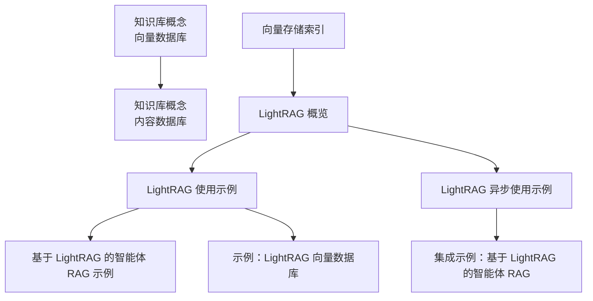
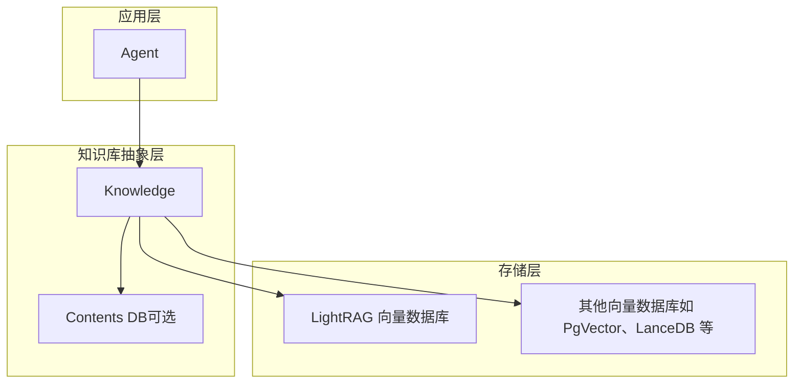
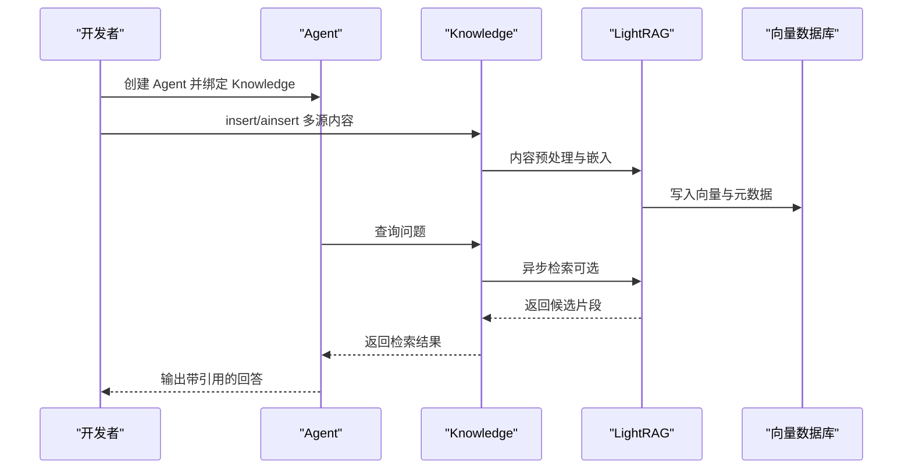
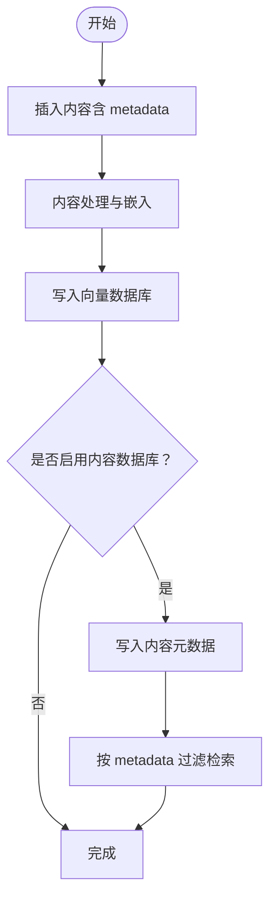
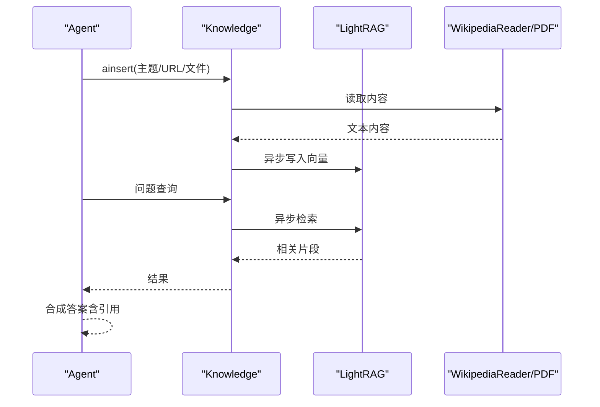
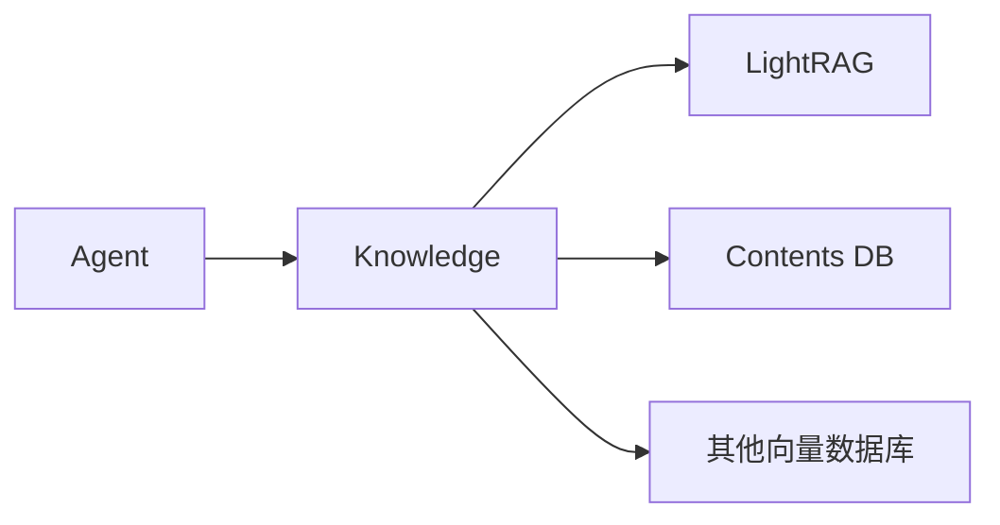

# 特殊用途向量数据库

<cite>
**本文引用的文件**   
- [知识库概念：向量数据库](file://knowledge/concepts/vector-db.mdx)
- [知识库概念：内容数据库](file://knowledge/concepts/contents-db.mdx)
- [知识库：向量存储索引](file://knowledge/vector-stores/index.mdx)
- [LightRAG 概览](file://knowledge/vector-stores/lightrag/overview.mdx)
- [LightRAG 使用示例](file://knowledge/vector-stores/lightrag/usage/lightrag-db.mdx)
- [LightRAG 异步使用示例](file://knowledge/vector-stores/lightrag/usage/async-lightrag-db.mdx)
- [基于 LightRAG 的智能体 RAG 示例](file://knowledge/concepts/search-and-retrieval/agentic-rag-with-lightrag.mdx)
- [集成示例：基于 LightRAG 的智能体 RAG](file://examples/integrations/rag/agentic-rag-with-lightrag.mdx)
- [示例：LightRAG 向量数据库](file://examples/knowledge/vector-db/lightrag/lightrag.mdx)
</cite>

## 目录
1. [简介](#简介)
2. [项目结构](#项目结构)
3. [核心组件](#核心组件)
4. [架构总览](#架构总览)
5. [详细组件分析](#详细组件分析)
6. [依赖关系分析](#依赖关系分析)
7. [性能考量](#性能考量)
8. [故障排查指南](#故障排查指南)
9. [结论](#结论)
10. [附录](#附录)

## 简介
本技术文档聚焦于“特殊用途向量数据库”——以 LightRAG 为代表的图基 RAG（检索增强生成）系统。LightRAG 不仅提供向量相似度检索，还具备图结构存储、关系推理与复杂查询能力，适用于知识图谱、实体关系抽取与复杂推理等高级场景。本文将结合仓库中的 LightRAG 集成示例与知识库概念文档，系统阐述其架构、配置、数据建模、查询优化策略，并与传统向量数据库进行对比。

## 项目结构
围绕 LightRAG 的文档与示例主要分布在以下位置：
- 知识库概念：向量数据库、内容数据库、检索与过滤
- 向量存储索引：各数据库分类与 LightRAG 所属类别
- LightRAG 专题：概览、使用示例（同步/异步）、集成示例
- 示例：LightRAG 向量数据库的完整用法

**图表来源**
- [知识库概念：向量数据库:1-117](file://knowledge/concepts/vector-db.mdx#L1-L117)
- [知识库概念：内容数据库:1-206](file://knowledge/concepts/contents-db.mdx#L1-L206)
- [知识库：向量存储索引:150-174](file://knowledge/vector-stores/index.mdx#L150-L174)
- [LightRAG 概览:1-7](file://knowledge/vector-stores/lightrag/overview.mdx#L1-L7)
- [LightRAG 使用示例:1-80](file://knowledge/vector-stores/lightrag/usage/lightrag-db.mdx#L1-L80)
- [LightRAG 异步使用示例:1-90](file://knowledge/vector-stores/lightrag/usage/async-lightrag-db.mdx#L1-L90)
- [基于 LightRAG 的智能体 RAG 示例:1-94](file://knowledge/concepts/search-and-retrieval/agentic-rag-with-lightrag.mdx#L1-L94)
- [集成示例：基于 LightRAG 的智能体 RAG:1-94](file://examples/integrations/rag/agentic-rag-with-lightrag.mdx#L1-L94)
- [示例：LightRAG 向量数据库:1-103](file://examples/knowledge/vector-db/lightrag/lightrag.mdx#L1-L103)

**章节来源**
- [知识库概念：向量数据库:1-117](file://knowledge/concepts/vector-db.mdx#L1-L117)
- [知识库概念：内容数据库:1-206](file://knowledge/concepts/contents-db.mdx#L1-L206)
- [知识库：向量存储索引:150-174](file://knowledge/vector-stores/index.mdx#L150-L174)

## 核心组件
- 向量数据库层（LightRAG）
  - 通过 agno.vectordb.lightrag.LightRag 封装外部 LightRAG 服务，提供同步/异步插入与检索接口。
  - 支持从本地文件、URL、主题（WikipediaReader）等多种来源构建知识库。
- 知识库层（Knowledge）
  - 统一的内容管理与检索入口，支持 metadata 过滤、异步操作（ainsert/asearch）。
- 内容数据库层（Contents DB）
  - 可选组件，用于跟踪内容元数据、状态与生命周期管理，支持删除与批量操作。
- 智能体层（Agent）
  - 通过开启 search_knowledge 自动检索知识库，结合检索结果进行回答合成。

**章节来源**
- [LightRAG 使用示例:1-80](file://knowledge/vector-stores/lightrag/usage/lightrag-db.mdx#L1-L80)
- [LightRAG 异步使用示例:1-90](file://knowledge/vector-stores/lightrag/usage/async-lightrag-db.mdx#L1-L90)
- [示例：LightRAG 向量数据库:1-103](file://examples/knowledge/vector-db/lightrag/lightrag.mdx#L1-L103)
- [知识库概念：内容数据库:1-206](file://knowledge/concepts/contents-db.mdx#L1-L206)

## 架构总览
下图展示了 LightRAG 在 Agno 知识库体系中的角色与交互：

**图表来源**
- [LightRAG 使用示例:16-24](file://knowledge/vector-stores/lightrag/usage/lightrag-db.mdx#L16-L24)
- [知识库概念：内容数据库:14-18](file://knowledge/concepts/contents-db.mdx#L14-L18)
- [知识库概念：向量数据库:34-89](file://knowledge/concepts/vector-db.mdx#L34-L89)

## 详细组件分析

### LightRAG 向量数据库适配器
- 能力概述
  - 提供与外部 LightRAG 服务的对接，封装插入与检索流程。
  - 支持同步与异步两种调用方式，满足不同运行时需求。
- 关键接口
  - 初始化：传入 api_key（以及可选的 server_url）。
  - 插入：支持本地文件、URL、主题（WikipediaReader）等多源输入。
  - 检索：提供异步检索方法，便于在异步智能体中使用。
- 典型用法
  - 在 Knowledge 中注入 LightRAG 实例，随后通过 Knowledge.insert/ainsert 与检索接口完成端到端流程。

**图表来源**
- [LightRAG 使用示例:26-47](file://knowledge/vector-stores/lightrag/usage/lightrag-db.mdx#L26-L47)
- [LightRAG 异步使用示例:32-64](file://knowledge/vector-stores/lightrag/usage/async-lightrag-db.mdx#L32-L64)
- [示例：LightRAG 向量数据库:54-82](file://examples/knowledge/vector-db/lightrag/lightrag.mdx#L54-L82)

**章节来源**
- [LightRAG 使用示例:1-80](file://knowledge/vector-stores/lightrag/usage/lightrag-db.mdx#L1-L80)
- [LightRAG 异步使用示例:1-90](file://knowledge/vector-stores/lightrag/usage/async-lightrag-db.mdx#L1-L90)
- [示例：LightRAG 向量数据库:1-103](file://examples/knowledge/vector-db/lightrag/lightrag.mdx#L1-L103)

### 知识库与内容数据库
- 知识库（Knowledge）
  - 统一封装向量数据库与内容管理，支持 metadata 过滤、异步插入与检索。
- 内容数据库（Contents DB）
  - 可选组件，提供内容清单、按 ID 获取/删除、过滤键枚举与批量清理等能力。
  - 与向量数据库保持一致性，删除内容时自动清理关联向量。

**图表来源**
- [知识库概念：内容数据库:80-140](file://knowledge/concepts/contents-db.mdx#L80-L140)
- [知识库概念：向量数据库:11-21](file://knowledge/concepts/vector-db.mdx#L11-L21)

**章节来源**
- [知识库概念：内容数据库:1-206](file://knowledge/concepts/contents-db.mdx#L1-L206)
- [知识库概念：向量数据库:1-117](file://knowledge/concepts/vector-db.mdx#L1-L117)

### 智能体 RAG 工作流（基于 LightRAG）
- 流程要点
  - 通过 WikipediaReader 等 Reader 从网络抓取知识，或从本地 PDF 等文件导入。
  - 将内容写入 LightRAG 向量数据库后，Agent 基于检索结果进行回答合成。
  - 支持异步插入与检索，提升吞吐与响应速度。
- 应用价值
  - 适合需要跨源整合、复杂语义匹配与可溯源引用的场景。

**图表来源**
- [基于 LightRAG 的智能体 RAG 示例:29-68](file://knowledge/concepts/search-and-retrieval/agentic-rag-with-lightrag.mdx#L29-L68)
- [集成示例：基于 LightRAG 的智能体 RAG:44-76](file://examples/integrations/rag/agentic-rag-with-lightrag.mdx#L44-L76)

**章节来源**
- [基于 LightRAG 的智能体 RAG 示例:1-94](file://knowledge/concepts/search-and-retrieval/agentic-rag-with-lightrag.mdx#L1-L94)
- [集成示例：基于 LightRAG 的智能体 RAG:1-94](file://examples/integrations/rag/agentic-rag-with-lightrag.mdx#L1-L94)

## 依赖关系分析
- 组件耦合
  - Knowledge 对 LightRAG 的依赖为组合关系；若启用 Contents DB，则与 Knowledge 形成更强的协作关系。
- 外部依赖
  - LightRAG 服务端（可通过 server_url 指定），以及 OpenAI 等模型服务（示例中用于嵌入或对话）。
- 可能的循环依赖
  - 当前文档示例未见直接循环依赖；注意在自定义检索器或工具链中避免反向依赖。

**图表来源**
- [LightRAG 使用示例:16-24](file://knowledge/vector-stores/lightrag/usage/lightrag-db.mdx#L16-L24)
- [知识库概念：内容数据库:14-18](file://knowledge/concepts/contents-db.mdx#L14-L18)

**章节来源**
- [LightRAG 使用示例:1-80](file://knowledge/vector-stores/lightrag/usage/lightrag-db.mdx#L1-L80)
- [知识库概念：内容数据库:1-206](file://knowledge/concepts/contents-db.mdx#L1-L206)

## 性能考量
- 异步化
  - 使用 ainsert/asearch 可减少阻塞，提高并发吞吐。
- 检索策略
  - 结合 metadata 过滤与异步检索，降低无关返回，缩短合成时间。
- 存储与索引
  - LightRAG 作为外部服务，需关注网络延迟与服务可用性；在高并发场景建议配合缓存与重试策略。

**章节来源**
- [知识库概念：向量数据库:108-117](file://knowledge/concepts/vector-db.mdx#L108-L117)
- [LightRAG 异步使用示例:1-90](file://knowledge/vector-stores/lightrag/usage/async-lightrag-db.mdx#L1-L90)

## 故障排查指南
- 环境变量与密钥
  - 确保正确设置 LIGHTRAG_API_KEY；如使用本地服务，确认 server_url 指向正确地址。
- 内容入库与可见性
  - 若未看到检索结果，检查内容是否成功入库（可结合 Contents DB 查看状态）。
- 异步执行
  - 异步示例中需确保事件循环正确运行，避免任务未调度导致的“无响应”。

**章节来源**
- [LightRAG 使用示例:68-72](file://knowledge/vector-stores/lightrag/usage/lightrag-db.mdx#L68-L72)
- [LightRAG 异步使用示例:78-82](file://knowledge/vector-stores/lightrag/usage/async-lightrag-db.mdx#L78-L82)
- [示例：LightRAG 向量数据库:89-101](file://examples/knowledge/vector-db/lightrag/lightrag.mdx#L89-L101)

## 结论
LightRAG 作为“特殊用途向量数据库”，在保持向量检索能力的同时，提供了图结构与关系推理的潜力，适用于知识图谱、实体关系抽取与复杂推理场景。通过 Agno 的 Knowledge 抽象与 Contents DB 协同，开发者可以快速搭建具备可溯源引用与可管理性的智能体 RAG 系统。相比传统向量数据库，LightRAG 更强调“图基”能力与外部服务集成，适合对检索质量与可解释性有更高要求的应用。

## 附录
- 快速上手步骤
  - 安装依赖：参考 LightRAG 使用示例中的安装命令。
  - 设置环境变量：导出 LIGHTRAG_API_KEY（以及必要时的 OPENAI_API_KEY）。
  - 运行示例：按照示例文档中的脚本与命令启动演示。
- 相关文档索引
  - 向量数据库与检索：[知识库概念：向量数据库:1-117](file://knowledge/concepts/vector-db.mdx#L1-L117)
  - 内容管理与过滤：[知识库概念：内容数据库:1-206](file://knowledge/concepts/contents-db.mdx#L1-L206)
  - LightRAG 分类与索引：[知识库：向量存储索引:150-174](file://knowledge/vector-stores/index.mdx#L150-L174)