# 嵌入器系统

<cite>
**本文引用的文件**
- [知识概念：嵌入器总览](file://knowledge/concepts/embedder/overview.mdx)
- [知识概念：OpenAI 嵌入器](file://knowledge/concepts/embedder/openai/overview.mdx)
- [知识概念：SentenceTransformers 嵌入器](file://knowledge/concepts/embedder/sentencetransformers/overview.mdx)
- [知识概念：HuggingFace 嵌入器](file://knowledge/concepts/embedder/huggingface/overview.mdx)
- [知识概念：Cohere 嵌入器](file://knowledge/concepts/embedder/cohere/overview.mdx)
- [知识概念：Gemini 嵌入器](file://knowledge/concepts/embedder/gemini/overview.mdx)
- [知识概念：Mistral 嵌入器](file://knowledge/concepts/embedder/mistral/overview.mdx)
- [知识概念：Ollama 嵌入器](file://knowledge/concepts/embedder/ollama/overview.mdx)
- [知识概念：Voyage AI 嵌入器](file://knowledge/concepts/embedder/voyageai/overview.mdx)
- [知识概念：Fireworks 嵌入器](file://knowledge/concepts/embedder/fireworks/overview.mdx)
- [知识概念：AWS Bedrock 嵌入器](file://knowledge/concepts/embedder/aws-bedrock/overview.mdx)
- [知识概念：Azure OpenAI 嵌入器](file://knowledge/concepts/embedder/azure-openai/overview.mdx)
- [知识概念：Together 嵌入器](file://knowledge/concepts/embedder/together/overview.mdx)
- [知识概念：Jina 嵌入器](file://knowledge/concepts/embedder/jina/overview.mdx)
- [知识概念：Nebius 嵌入器](file://knowledge/concepts/embedder/nebius/overview.mdx)
- [知识概念：向量数据库](file://knowledge/concepts/vector-db.mdx)
- [知识概念：分块策略](file://knowledge/concepts/chunking/overview.mdx)
- [知识概念：检索与重排序](file://knowledge/concepts/search-and-retrieval/overview.mdx)
- [知识概念：性能优化建议](file://knowledge/concepts/performance-tips.mdx)
- [知识示例：嵌入器（菜谱）](file://cookbook/knowledge/embedders.mdx)
- [知识示例：RAG 自定义嵌入](file://examples/agents/knowledge/rag-custom-embeddings.mdx)
- [知识示例：AWS Bedrock 嵌入器 v4](file://examples/knowledge/embedders/aws-bedrock-embedder-v4.mdx)
- [知识示例：AWS Bedrock 嵌入器](file://examples/knowledge/embedders/aws-bedrock-embedder.mdx)
- [知识示例：Azure 嵌入器](file://examples/knowledge/embedders/azure-embedder.mdx)
- [知识示例：Cohere 嵌入器](file://examples/knowledge/embedders/cohere-embedder.mdx)
- [知识示例：语义分块（Agno 嵌入器）](file://examples/knowledge/chunking/semantic-chunking-agno-embedder.mdx)
- [知识示例：语义分块（Chonkie 嵌入器）](file://examples/knowledge/chunking/semantic-chunking-chonkie-embedder.mdx)
</cite>

## 目录
1. [简介](#简介)
2. [项目结构](#项目结构)
3. [核心组件](#核心组件)
4. [架构总览](#架构总览)
5. [详细组件分析](#详细组件分析)
6. [依赖关系分析](#依赖关系分析)
7. [性能考量](#性能考量)
8. [故障排查指南](#故障排查指南)
9. [结论](#结论)
10. [附录](#附录)

## 简介
本技术文档面向嵌入器系统，系统性介绍多种嵌入器提供商（OpenAI、Sentence Transformers、Hugging Face、Cohere、Gemini、Mistral、Ollama、Voyage AI、Fireworks、AWS Bedrock、Azure OpenAI、Together、Jina、Nebius），并结合仓库中的知识概念与示例文档，给出配置方法、参数调优、批量处理技巧、本地与云端对比、嵌入维度与相似度计算、检索效果优化以及自定义嵌入器集成路径。目标是帮助读者在不同场景下选择合适的嵌入器，并实现稳定高效的 RAG 流水线。

## 项目结构
围绕嵌入器的知识与示例分布在以下位置：
- 知识概念：涵盖嵌入器总览、各提供商嵌入器、向量数据库、分块策略、检索与重排序、性能优化等
- 示例：嵌入器使用示例、RAG 自定义嵌入、特定提供商的嵌入器示例
- 参考：嵌入器参数参考（如 Nebius）

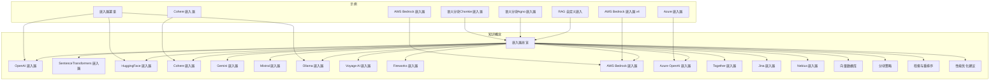

**图示来源**
- [知识概念：嵌入器总览:1-140](file://knowledge/concepts/embedder/overview.mdx#L1-L140)
- [知识概念：OpenAI 嵌入器:1-52](file://knowledge/concepts/embedder/openai/overview.mdx#L1-L52)
- [知识概念：SentenceTransformers 嵌入器:1-45](file://knowledge/concepts/embedder/sentencetransformers/overview.mdx#L1-L45)
- [知识概念：HuggingFace 嵌入器:1-45](file://knowledge/concepts/embedder/huggingface/overview.mdx#L1-L45)
- [知识概念：Cohere 嵌入器:1-50](file://knowledge/concepts/embedder/cohere/overview.mdx#L1-L50)
- [知识概念：Gemini 嵌入器:1-50](file://knowledge/concepts/embedder/gemini/overview.mdx#L1-L50)
- [知识概念：Mistral 嵌入器:1-51](file://knowledge/concepts/embedder/mistral/overview.mdx#L1-L51)
- [知识概念：Ollama 嵌入器:1-49](file://knowledge/concepts/embedder/ollama/overview.mdx#L1-L49)
- [知识概念：Voyage AI 嵌入器:1-51](file://knowledge/concepts/embedder/voyageai/overview.mdx#L1-L51)
- [知识概念：Fireworks 嵌入器:1-46](file://knowledge/concepts/embedder/fireworks/overview.mdx#L1-L46)
- [知识概念：AWS Bedrock 嵌入器:1-86](file://knowledge/concepts/embedder/aws-bedrock/overview.mdx#L1-L86)
- [知识概念：Azure OpenAI 嵌入器:1-79](file://knowledge/concepts/embedder/azure-openai/overview.mdx#L1-L79)
- [知识概念：Together 嵌入器:1-46](file://knowledge/concepts/embedder/together/overview.mdx#L1-L46)
- [知识概念：Jina 嵌入器:1-92](file://knowledge/concepts/embedder/jina/overview.mdx#L1-L92)
- [知识概念：Nebius 嵌入器:1-39](file://knowledge/concepts/embedder/nebius/overview.mdx#L1-L39)
- [知识示例：嵌入器（菜谱）:1-203](file://cookbook/knowledge/embedders.mdx#L1-L203)
- [知识示例：RAG 自定义嵌入](file://examples/agents/knowledge/rag-custom-embeddings.mdx)
- [知识示例：AWS Bedrock 嵌入器 v4](file://examples/knowledge/embedders/aws-bedrock-embedder-v4.mdx)
- [知识示例：AWS Bedrock 嵌入器](file://examples/knowledge/embedders/aws-bedrock-embedder.mdx)
- [知识示例：Azure 嵌入器](file://examples/knowledge/embedders/azure-embedder.mdx)
- [知识示例：Cohere 嵌入器](file://examples/knowledge/embedders/cohere-embedder.mdx)
- [知识示例：语义分块（Agno 嵌入器）](file://examples/knowledge/chunking/semantic-chunking-agno-embedder.mdx)
- [知识示例：语义分块（Chonkie 嵌入器）](file://examples/knowledge/chunking/semantic-chunking-chonkie-embedder.mdx)

**章节来源**
- [知识概念：嵌入器总览:1-140](file://knowledge/concepts/embedder/overview.mdx#L1-L140)
- [知识示例：嵌入器（菜谱）:1-203](file://cookbook/knowledge/embedders.mdx#L1-L203)

## 核心组件
- 嵌入器总览：说明嵌入器的作用、工作流程、默认配置、批量处理、最佳实践与提供商矩阵
- 各提供商嵌入器：统一接口封装，支持模型选择、维度设置、批量开关与大小、客户端参数等
- 向量数据库：存储向量并进行相似度检索
- 分块策略：文本预处理，提升嵌入质量与检索效果
- 检索与重排序：查询嵌入后与向量库匹配，必要时进行重排序
- 性能优化：维度匹配、批量处理、缓存与并发

**章节来源**
- [知识概念：嵌入器总览:24-124](file://knowledge/concepts/embedder/overview.mdx#L24-L124)
- [知识概念：向量数据库](file://knowledge/concepts/vector-db.mdx)
- [知识概念：分块策略](file://knowledge/concepts/chunking/overview.mdx)
- [知识概念：检索与重排序](file://knowledge/concepts/search-and-retrieval/overview.mdx)
- [知识概念：性能优化建议](file://knowledge/concepts/performance-tips.mdx)

## 架构总览
嵌入器在知识系统中的典型流程如下：插入内容时对文本分块并生成向量，写入向量数据库；查询时对问题进行嵌入并与向量库按相似度检索，必要时进行重排序。

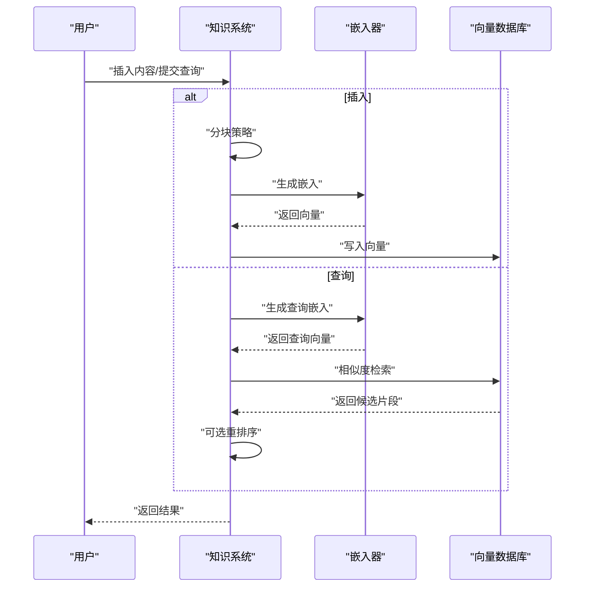

**图示来源**
- [知识概念：嵌入器总览:24-29](file://knowledge/concepts/embedder/overview.mdx#L24-L29)
- [知识概念：向量数据库](file://knowledge/concepts/vector-db.mdx)
- [知识概念：检索与重排序](file://knowledge/concepts/search-and-retrieval/overview.mdx)

## 详细组件分析

### OpenAI 嵌入器
- 特点：默认嵌入器，质量高，适合生产环境
- 配置要点：模型、维度、编码格式、用户标识、API 密钥、组织、基础 URL、请求与客户端参数、是否启用批量及批量大小
- 批量处理：支持批量以降低请求次数与限流风险
- 适用场景：通用语义搜索、英文为主的内容

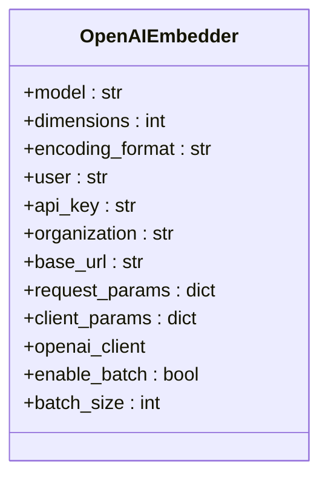

**图示来源**
- [知识概念：OpenAI 嵌入器:35-48](file://knowledge/concepts/embedder/openai/overview.mdx#L35-L48)

**章节来源**
- [知识概念：OpenAI 嵌入器:1-52](file://knowledge/concepts/embedder/openai/overview.mdx#L1-L52)
- [知识示例：嵌入器（菜谱）:44-76](file://cookbook/knowledge/embedders.mdx#L44-L76)

### SentenceTransformers 嵌入器
- 特点：基于本地 SentenceTransformers 库，可自定义模型与维度，支持归一化
- 配置要点：模型 id、维度、客户端实例、提示词、是否归一化
- 适用场景：需要本地部署与可控模型的场景

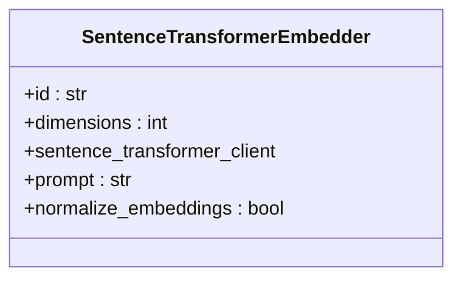

**图示来源**
- [知识概念：SentenceTransformers 嵌入器:35-42](file://knowledge/concepts/embedder/sentencetransformers/overview.mdx#L35-L42)

**章节来源**
- [知识概念：SentenceTransformers 嵌入器:1-45](file://knowledge/concepts/embedder/sentencetransformers/overview.mdx#L1-L45)

### HuggingFace 嵌入器
- 特点：通过 HuggingFace API 使用任意 sentence-transformer 模型
- 配置要点：维度、模型名、API 密钥、客户端参数、客户端实例
- 适用场景：开源模型与多语言需求

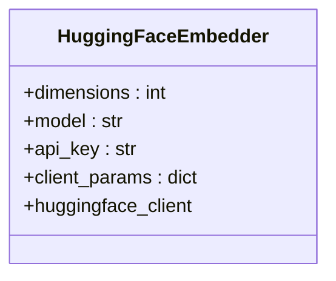

**图示来源**
- [知识概念：HuggingFace 嵌入器:35-42](file://knowledge/concepts/embedder/huggingface/overview.mdx#L35-L42)

**章节来源**
- [知识概念：HuggingFace 嵌入器:1-45](file://knowledge/concepts/embedder/huggingface/overview.mdx#L1-L45)

### Cohere 嵌入器
- 特点：强检索性能，支持多语言
- 配置要点：模型、输入类型、嵌入类型、API 密钥、请求与客户端参数、批量开关与大小
- 适用场景：跨语言检索、高质量召回

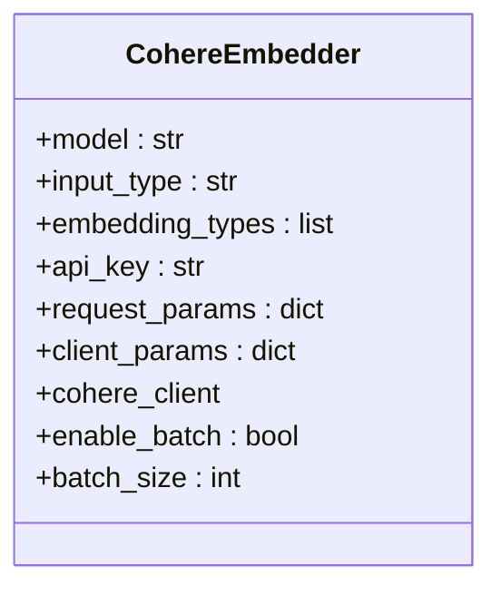

**图示来源**
- [知识概念：Cohere 嵌入器:36-47](file://knowledge/concepts/embedder/cohere/overview.mdx#L36-L47)

**章节来源**
- [知识概念：Cohere 嵌入器:1-50](file://knowledge/concepts/embedder/cohere/overview.mdx#L1-L50)
- [知识示例：Cohere 嵌入器](file://examples/knowledge/embedders/cohere-embedder.mdx)

### Gemini 嵌入器
- 特点：多语言，Google 生态
- 配置要点：维度、模型、任务类型、标题、API 密钥、请求与客户端参数、批量开关与大小
- 适用场景：多语言内容、与 Google 服务集成

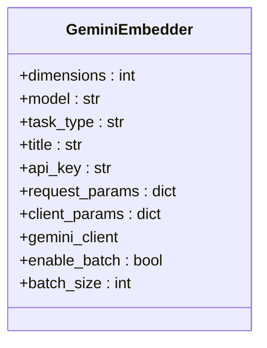

**图示来源**
- [知识概念：Gemini 嵌入器:35-47](file://knowledge/concepts/embedder/gemini/overview.mdx#L35-L47)

**章节来源**
- [知识概念：Gemini 嵌入器:1-50](file://knowledge/concepts/embedder/gemini/overview.mdx#L1-L50)

### Mistral 嵌入器
- 特点：欧洲提供商，支持批量
- 配置要点：模型、维度、请求参数、API 密钥、端点、最大重试、超时、客户端参数、批量开关与大小
- 适用场景：欧洲合规与低延迟需求

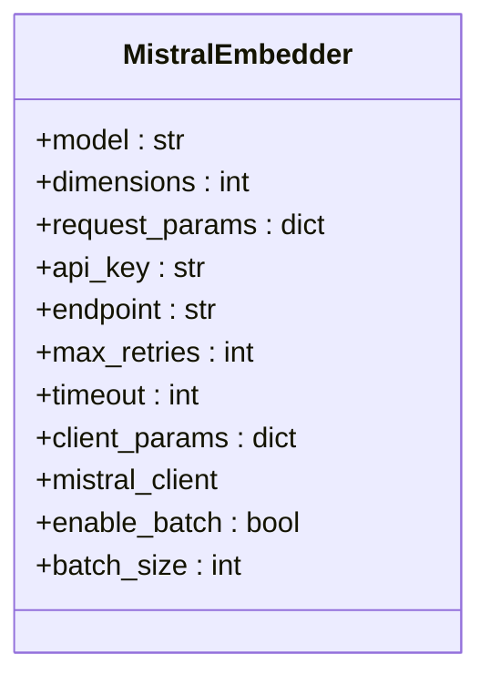

**图示来源**
- [知识概念：Mistral 嵌入器:35-48](file://knowledge/concepts/embedder/mistral/overview.mdx#L35-L48)

**章节来源**
- [知识概念：Mistral 嵌入器:1-51](file://knowledge/concepts/embedder/mistral/overview.mdx#L1-L51)

### Ollama 嵌入器
- 特点：本地运行，隐私与离线优先
- 配置要点：模型、维度、主机地址、超时、选项、客户端参数、客户端实例
- 适用场景：本地部署、隐私敏感、无网络依赖

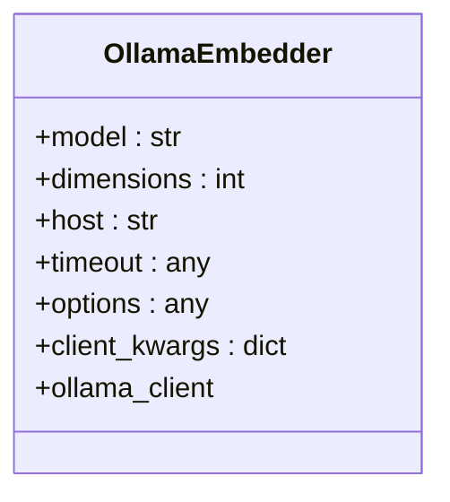

**图示来源**
- [知识概念：Ollama 嵌入器:37-46](file://knowledge/concepts/embedder/ollama/overview.mdx#L37-L46)

**章节来源**
- [知识概念：Ollama 嵌入器:1-49](file://knowledge/concepts/embedder/ollama/overview.mdx#L1-L49)

### Voyage AI 嵌入器
- 特点：专为检索优化
- 配置要点：模型、维度、请求参数、API 密钥、基础 URL、最大重试、超时、客户端参数、批量开关与大小
- 适用场景：高精度检索、代码检索（特定模型）

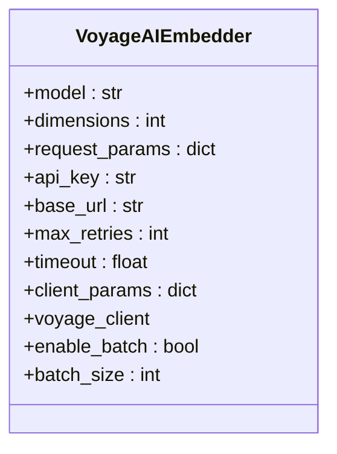

**图示来源**
- [知识概念：Voyage AI 嵌入器:35-48](file://knowledge/concepts/embedder/voyageai/overview.mdx#L35-L48)

**章节来源**
- [知识概念：Voyage AI 嵌入器:1-51](file://knowledge/concepts/embedder/voyageai/overview.mdx#L1-L51)

### Fireworks 嵌入器
- 特点：兼容 OpenAI 规范，快速推理
- 配置要点：模型、维度、API 密钥、基础 URL、批量开关与大小
- 适用场景：开源模型、低成本快速推理

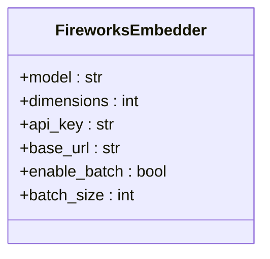

**图示来源**
- [知识概念：Fireworks 嵌入器:35-42](file://knowledge/concepts/embedder/fireworks/overview.mdx#L35-L42)

**章节来源**
- [知识概念：Fireworks 嵌入器:1-46](file://knowledge/concepts/embedder/fireworks/overview.mdx#L1-L46)

### AWS Bedrock 嵌入器
- 特点：通过 AWS Bedrock 调用 Cohere 多语言模型，需在模型目录中启用相应模型
- 配置要点：模型 ID、维度、输入类型、截断策略、嵌入类型、AWS 区域与凭据、会话、请求与客户端参数
- 适用场景：企业级合规、与 AWS 生态集成

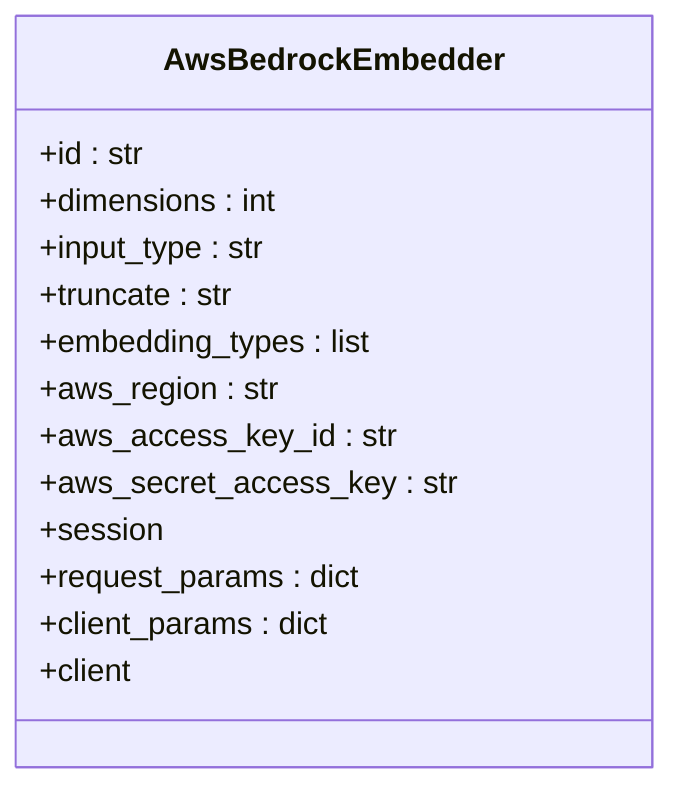

**图示来源**
- [知识概念：AWS Bedrock 嵌入器:70-84](file://knowledge/concepts/embedder/aws-bedrock/overview.mdx#L70-L84)

**章节来源**
- [知识概念：AWS Bedrock 嵌入器:1-86](file://knowledge/concepts/embedder/aws-bedrock/overview.mdx#L1-L86)
- [知识示例：AWS Bedrock 嵌入器 v4](file://examples/knowledge/embedders/aws-bedrock-embedder-v4.mdx)
- [知识示例：AWS Bedrock 嵌入器](file://examples/knowledge/embedders/aws-bedrock-embedder.mdx)

### Azure OpenAI 嵌入器
- 特点：通过 Azure OpenAI 提供服务，支持批量
- 配置要点：模型、维度、编码格式、用户、API 密钥、版本、端点、部署、基础 URL、AD 令牌或提供者、组织、请求与客户端参数、批量开关与大小
- 适用场景：企业 Azure 环境、合规与隔离

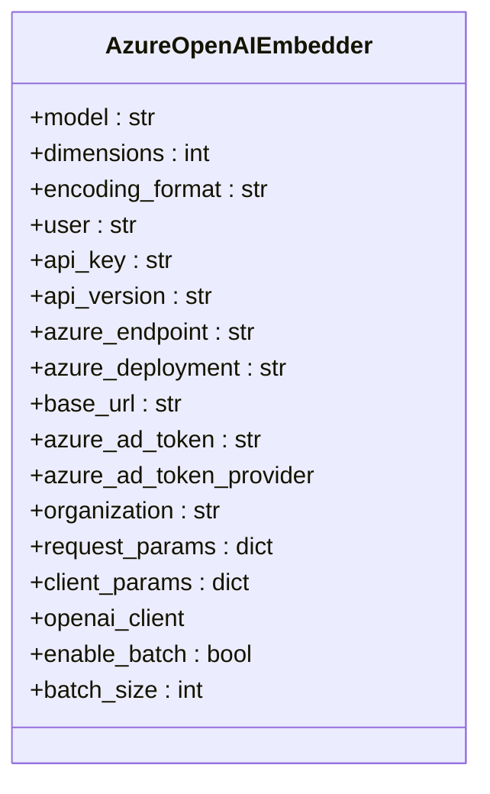

**图示来源**
- [知识概念：Azure OpenAI 嵌入器:58-77](file://knowledge/concepts/embedder/azure-openai/overview.mdx#L58-L77)

**章节来源**
- [知识概念：Azure OpenAI 嵌入器:1-79](file://knowledge/concepts/embedder/azure-openai/overview.mdx#L1-L79)
- [知识示例：Azure 嵌入器](file://examples/knowledge/embedders/azure-embedder.mdx)

### Together 嵌入器
- 特点：兼容 OpenAI 规范，支持开源模型
- 配置要点：模型、维度、API 密钥、基础 URL、批量开关与大小
- 适用场景：开源生态、低成本推理

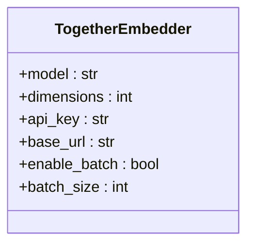

**图示来源**
- [知识概念：Together 嵌入器:35-42](file://knowledge/concepts/embedder/together/overview.mdx#L35-L42)

**章节来源**
- [知识概念：Together 嵌入器:1-46](file://knowledge/concepts/embedder/together/overview.mdx#L1-L46)

### Jina 嵌入器
- 特点：异步支持、批量处理、延迟分块、灵活输出格式、用量追踪与稳健错误处理
- 配置要点：模型 ID、维度、嵌入类型、延迟分块、用户、API 密钥、基础 URL、头、请求参数、超时、批量开关与大小
- 适用场景：高性能并发应用、多格式输出需求

```mermaid
classDiagram
class JinaEmbedder {
+id : str
+dimensions : int
+embedding_type : str
+late_chunking : bool
+user : str
+api_key : str
+base_url : str
+headers : dict
+request_params : dict
+timeout : float
+enable_batch : bool
+batch_size : int
}
``
**图示来源**
- [知识概念：Jina 嵌入器](file : //knowledge/concepts/embedder/jina/overview.mdx#L65-L79)
**章节来源**
- [知识概念：Jina 嵌入器](file : //knowledge/concepts/embedder/jina/overview.mdx#L1-L92)
### Nebius 嵌入器
- 特点：兼容 OpenAI 规范，欧洲提供商
- 配置要点：与 OpenAI 兼容的参数集合详见参考
- 适用场景：欧洲合规与低延迟需求
```mermaid
classDiagram
  class NebiusEmbedder {
    +... // 与 OpenAI 兼容的参数
  }
```

**图示来源**
- [知识概念：Nebius 嵌入器](file://knowledge/concepts/embedder/nebius/overview.mdx#L35-L35)

**章节来源**
- [知识概念：Nebius 嵌入器](file://knowledge/concepts/embedder/nebius/overview.mdx#L1-L39)

### 统一批量处理与参数调优
- 批量处理：OpenAI、Azure OpenAI、Gemini、Cohere、Voyage AI、Mistral、Fireworks、Together、Jina、Nebius 支持批量，可通过 enable_batch 与 batch_size 控制
- 参数调优：维度匹配向量库期望、模型选择与输入类型、编码格式、超时与重试、客户端参数
- 最佳实践：更换模型需重新嵌入；测试检索质量；确保维度一致

**章节来源**
- [知识概念：嵌入器总览](file://knowledge/concepts/embedder/overview.mdx#L61-L88)
- [知识概念：嵌入器总览](file://knowledge/concepts/embedder/overview.mdx#L90-L124)

### 本地嵌入器与云嵌入器对比
- 本地（Ollama、Sentence Transformers、HuggingFace API）：隐私、离线、可控模型；可能在召回质量上略逊于云端大模型
- 云（OpenAI、Gemini、Cohere、Voyage AI、Mistral、Fireworks、AWS Bedrock、Azure OpenAI、Together、Jina、Nebius）：质量高、维护少、生态完善；涉及成本与网络依赖
- 选择建议：隐私与离线优先选本地；通用与高质量选云；多语言与检索优化选 Cohere/Voyage；企业与合规选 AWS Bedrock/Azure OpenAI；开源与低成本选 Fireworks/Together

**章节来源**
- [知识概念：嵌入器总览](file://knowledge/concepts/embedder/overview.mdx#L109-L124)

### 嵌入维度、相似度计算与检索优化
- 维度：确保嵌入器输出维度与向量库期望一致
- 相似度：通常使用余弦相似度或内积；向量库负责检索与打分
- 优化：调整分块策略、模型与输入类型、批量大小、重排序、过滤与提示工程

**章节来源**
- [知识概念：嵌入器总览](file://knowledge/concepts/embedder/overview.mdx#L76-L88)
- [知识概念：向量数据库](file://knowledge/concepts/vector-db.mdx)
- [知识概念：分块策略](file://knowledge/concepts/chunking/overview.mdx)
- [知识概念：检索与重排序](file://knowledge/concepts/search-and-retrieval/overview.mdx)
- [知识概念：性能优化建议](file://knowledge/concepts/performance-tips.mdx)

### 自定义嵌入器集成指南
- 接口一致性：遵循统一的嵌入器接口（如 get_embedding/get_embeddings_batch 等），保证与知识系统对接
- 配置项：模型、维度、API 密钥、基础 URL、批量开关与大小、客户端参数
- 示例路径：参考“嵌入器（菜谱）”示例，了解如何在知识系统中注入自定义嵌入器
- RAG 集成：在知识系统初始化时传入自定义嵌入器实例，插入与查询自动使用

**章节来源**
- [知识示例：嵌入器（菜谱）](file://cookbook/knowledge/embedders.mdx#L1-L203)
- [知识示例：RAG 自定义嵌入](file://examples/agents/knowledge/rag-custom-embeddings.mdx)

## 依赖关系分析
- 嵌入器与向量数据库：嵌入器生成向量，向量数据库负责持久化与检索
- 嵌入器与分块策略：分块影响嵌入质量与检索效果
- 嵌入器与检索与重排序：查询嵌入后进行相似度匹配与重排序
- 嵌入器与性能：批量、维度、超时与重试影响吞吐与稳定性

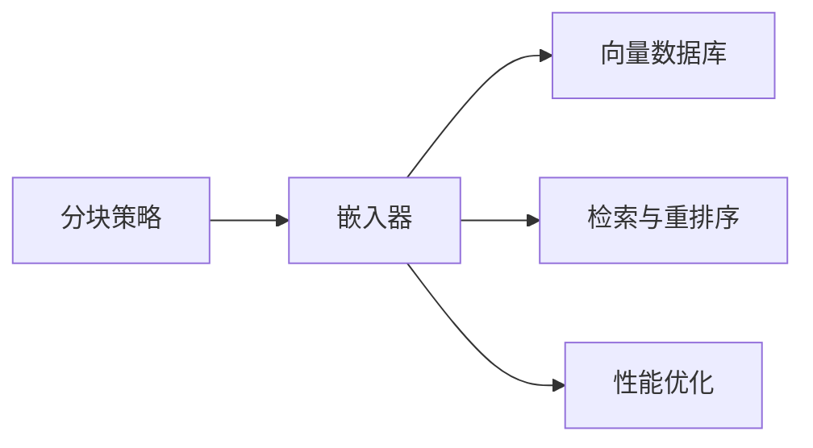

**图示来源**
- [知识概念：嵌入器总览:24-29](file://knowledge/concepts/embedder/overview.mdx#L24-L29)
- [知识概念：向量数据库](file://knowledge/concepts/vector-db.mdx)
- [知识概念：分块策略](file://knowledge/concepts/chunking/overview.mdx)
- [知识概念：检索与重排序](file://knowledge/concepts/search-and-retrieval/overview.mdx)
- [知识概念：性能优化建议](file://knowledge/concepts/performance-tips.mdx)

## 性能考量
- 批量处理：开启批量并合理设置 batch_size，减少 API 调用次数与限流风险
- 维度匹配：确保嵌入维度与向量库一致，避免转换开销与兼容问题
- 超时与重试：根据网络与服务稳定性设置超时与最大重试
- 异步与并发：对支持异步的嵌入器（如 Jina）采用异步批量以提升吞吐
- 模型选择：小模型更快更便宜，大模型通常检索效果更好；按场景折中

**章节来源**
- [知识概念：嵌入器总览:61-88](file://knowledge/concepts/embedder/overview.mdx#L61-L88)
- [知识概念：Jina 嵌入器:80-87](file://knowledge/concepts/embedder/jina/overview.mdx#L80-L87)

## 故障排查指南
- 更换模型后检索异常：需重新嵌入全部内容，确保向量库与嵌入器模型一致
- 维度不匹配：检查嵌入器输出维度与向量库期望维度
- API 限流与超时：开启批量、增加 batch_size、提高超时与重试次数
- 本地模型不可用（Ollama）：确认本地模型已拉取并运行
- 企业认证（AWS/Azure/OpenAI）：核对密钥、区域、端点与部署名称

**章节来源**
- [知识概念：嵌入器总览:76-88](file://knowledge/concepts/embedder/overview.mdx#L76-L88)
- [知识概念：Ollama 嵌入器:8-8](file://knowledge/concepts/embedder/ollama/overview.mdx#L8-L8)
- [知识概念：AWS Bedrock 嵌入器:10-20](file://knowledge/concepts/embedder/aws-bedrock/overview.mdx#L10-L20)
- [知识概念：Azure OpenAI 嵌入器:10-16](file://knowledge/concepts/embedder/azure-openai/overview.mdx#L10-L16)

## 结论
嵌入器系统通过统一接口适配多家提供商，兼顾云端高质量与本地隐私可控。选择合适嵌入器的关键在于：场景需求（隐私/质量/成本/多语言）、模型与维度匹配、批量与性能调优、以及与向量库、分块与检索的整体协同。按本文提供的配置方法、参数调优与批量技巧，可在不同环境中构建稳定高效的 RAG 系统。

## 附录
- 常用示例路径
  - [嵌入器（菜谱）:1-203](file://cookbook/knowledge/embedders.mdx#L1-L203)
  - [RAG 自定义嵌入](file://examples/agents/knowledge/rag-custom-embeddings.mdx)
  - [语义分块（Agno 嵌入器）](file://examples/knowledge/chunking/semantic-chunking-agno-embedder.mdx)
  - [语义分块（Chonkie 嵌入器）](file://examples/knowledge/chunking/semantic-chunking-chonkie-embedder.mdx)
  - [AWS Bedrock 嵌入器 v4](file://examples/knowledge/embedders/aws-bedrock-embedder-v4.mdx)
  - [AWS Bedrock 嵌入器](file://examples/knowledge/embedders/aws-bedrock-embedder.mdx)
  - [Azure 嵌入器](file://examples/knowledge/embedders/azure-embedder.mdx)
  - [Cohere 嵌入器](file://examples/knowledge/embedders/cohere-embedder.mdx)