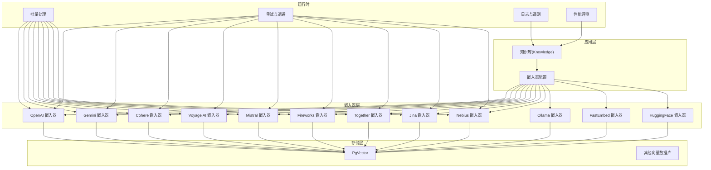
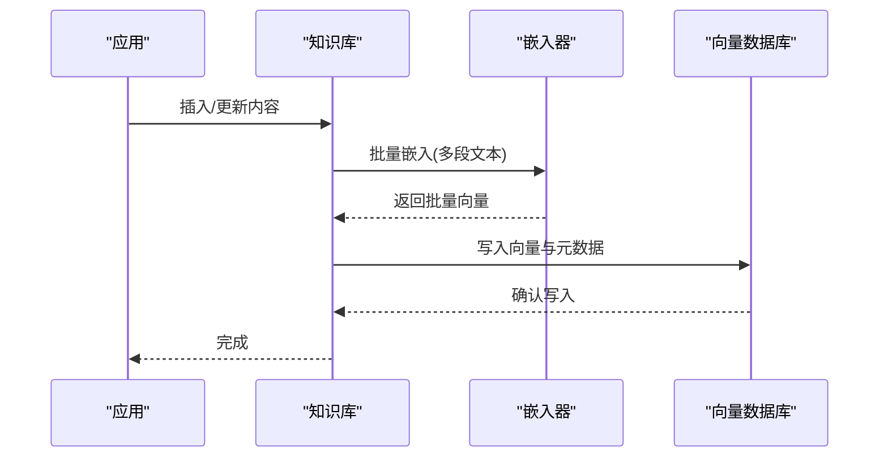
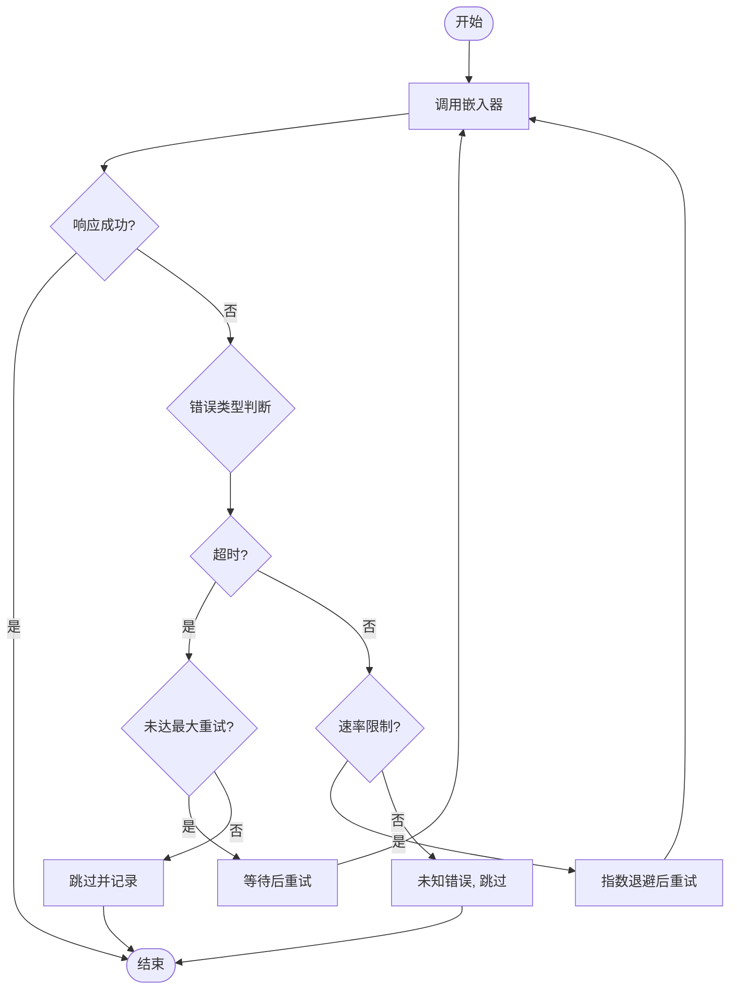
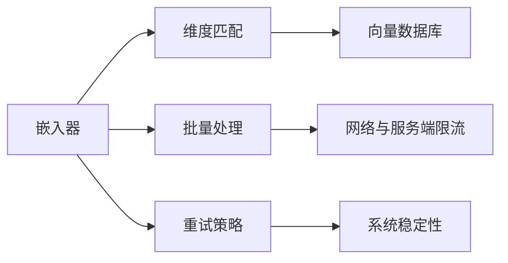

# 嵌入器配置与优化

<cite>
**本文引用的文件**
- [知识概念-嵌入器-概览.mdx](file://knowledge/concepts/embedder/overview.mdx)
- [_嵌入器-OpenAI-参考.mdx](file://_snippets/embedder-openai-reference.mdx)
- [_嵌入器-Ollama-参考.mdx](file://_snippets/embedder-ollama-reference.mdx)
- [_嵌入器-FastEmbed-参考.mdx](file://_snippets/embedder-fastembed-reference.mdx)
- [_嵌入器-HuggingFace-参考.mdx](file://_snippets/embedder-huggingface-reference.mdx)
- [_嵌入器-VoyageAI-参考.mdx](file://_snippets/embedder-voyageai-reference.mdx)
- [知识概念-嵌入器-Together-概览.mdx](file://knowledge/concepts/embedder/together/overview.mdx)
- [知识概念-嵌入器-Jina-概览.mdx](file://knowledge/concepts/embedder/jina/overview.mdx)
- [知识概念-嵌入器-Nebius-参考.mdx](file://reference/knowledge/embedder/nebius.mdx)
- [示例-嵌入器-vLLM-本地.mdx](file://examples/knowledge/embedders/vllm-embedder-local.mdx)
- [示例-嵌入器-HuggingFace.mdx](file://examples/knowledge/embedders/huggingface-embedder.mdx)
- [示例-嵌入器-SentenceTransformer.mdx](file://examples/knowledge/embedders/sentence-transformer-embedder.mdx)
- [示例-嵌入器-Together.mdx](file://examples/knowledge/embedders/together-embedder.mdx)
- [工作流-HITL-错误处理.mdx](file://workflows/hitl/error-handling.mdx)
- [示例-工具异常-重试调用.mdx](file://examples/tools/exceptions/retry-tool-call.mdx)
- [示例-工具异常-从后置钩子重试调用.mdx](file://examples/tools/exceptions/retry-tool-call-from-post-hook.mdx)
- [自定义日志.mdx](file://custom-logging.mdx)
- [遥测.mdx](file://telemetry.mdx)
- [性能.mdx](file://performance.mdx)
</cite>

## 目录
1. [简介](#简介)
2. [项目结构](#项目结构)
3. [核心组件](#核心组件)
4. [架构总览](#架构总览)
5. [详细组件分析](#详细组件分析)
6. [依赖关系分析](#依赖关系分析)
7. [性能考量](#性能考量)
8. [故障排除指南](#故障排除指南)
9. [结论](#结论)
10. [附录](#附录)

## 简介
本指南面向需要在知识库与检索增强生成（RAG）系统中配置与优化嵌入器的工程师与数据科学家。内容覆盖通用配置参数（模型 ID、维度、批量处理、超时等）、关键选型因素（质量、成本、延迟、语言支持）、性能测试与基准方法、向量维度匹配与批量大小优化、错误重试策略、跨嵌入器切换与重新嵌入注意事项，以及监控与故障排除建议。

## 项目结构
围绕嵌入器的文档与示例主要分布在以下位置：
- 知识概念：嵌入器概览、各提供商嵌入器的参数与特性说明
- Snippets：各嵌入器参数表格与默认值
- 示例：嵌入器使用与批量处理示例
- 错误处理与重试：工具与工作流层面的重试实践
- 日志与遥测：可观测性与调试能力
- 性能：框架级性能评测与度量

```mermaid
graph TB
A["知识概念-嵌入器-概览.mdx"] --> B["嵌入器参数-OpenAI"]
A --> C["嵌入器参数-Ollama"]
A --> D["嵌入器参数-FastEmbed"]
A --> E["嵌入器参数-HuggingFace"]
A --> F["嵌入器参数-VoyageAI"]
A --> G["嵌入器-Together-概览.mdx"]
A --> H["嵌入器-Jina-概览.mdx"]
A --> I["嵌入器-Nebius-参考.mdx"]
J["示例-嵌入器-vLLM-本地.mdx"] --> K["批量处理示例"]
L["示例-嵌入器-HuggingFace.mdx"] --> K
M["示例-嵌入器-SentenceTransformer.mdx"] --> K
N["示例-嵌入器-Together.mdx"] --> K
O["工作流-HITL-错误处理.mdx"] --> P["重试与跳过策略"]
Q["示例-工具异常-重试调用.mdx"] --> P
R["示例-工具异常-从后置钩子重试调用.mdx"] --> P
S["自定义日志.mdx"] --> T["日志与可观测性"]
U["遥测.mdx"] --> T
V["性能.mdx"] --> W["性能评测与度量"]
```

**图表来源**
- [知识概念-嵌入器-概览.mdx:1-140](file://knowledge/concepts/embedder/overview.mdx#L1-L140)
- [_嵌入器-OpenAI-参考.mdx:1-14](file://_snippets/embedder-openai-reference.mdx#L1-L14)
- [_嵌入器-Ollama-参考.mdx:1-11](file://_snippets/embedder-ollama-reference.mdx#L1-L11)
- [_嵌入器-FastEmbed-参考.mdx:1-6](file://_snippets/embedder-fastembed-reference.mdx#L1-L6)
- [_嵌入器-HuggingFace-参考.mdx:1-8](file://_snippets/embedder-huggingface-reference.mdx#L1-L8)
- [_嵌入器-VoyageAI-参考.mdx:1-13](file://_snippets/embedder-voyageai-reference.mdx#L1-L13)
- [知识概念-嵌入器-Together-概览.mdx:33-45](file://knowledge/concepts/embedder/together/overview.mdx#L33-L45)
- [知识概念-嵌入器-Jina-概览.mdx:73-91](file://knowledge/concepts/embedder/jina/overview.mdx#L73-L91)
- [知识概念-嵌入器-Nebius-参考.mdx:1-22](file://reference/knowledge/embedder/nebius.mdx#L1-L22)
- [示例-嵌入器-vLLM-本地.mdx:76-109](file://examples/knowledge/embedders/vllm-embedder-local.mdx#L76-L109)
- [示例-嵌入器-HuggingFace.mdx:42-63](file://examples/knowledge/embedders/huggingface-embedder.mdx#L42-L63)
- [示例-嵌入器-SentenceTransformer.mdx:42-63](file://examples/knowledge/embedders/sentence-transformer-embedder.mdx#L42-L63)
- [示例-嵌入器-Together.mdx:49-63](file://examples/knowledge/embedders/together-embedder.mdx#L49-L63)
- [工作流-HITL-错误处理.mdx:139-183](file://workflows/hitl/error-handling.mdx#L139-L183)
- [示例-工具异常-重试调用.mdx:41-82](file://examples/tools/exceptions/retry-tool-call.mdx#L41-L82)
- [示例-工具异常-从后置钩子重试调用.mdx:80-102](file://examples/tools/exceptions/retry-tool-call-from-post-hook.mdx#L80-L102)
- [自定义日志.mdx:1-193](file://custom-logging.mdx#L1-L193)
- [遥测.mdx:1-96](file://telemetry.mdx#L1-L96)
- [性能.mdx:38-67](file://performance.mdx#L38-L67)

**章节来源**
- [知识概念-嵌入器-概览.mdx:1-140](file://knowledge/concepts/embedder/overview.mdx#L1-L140)

## 核心组件
- 嵌入器参数与默认值
  - 模型 ID：用于指定具体嵌入模型
  - 维度：输出向量维度，需与向量数据库期望一致
  - 批量处理：enable_batch 与 batch_size 控制批量请求
  - 超时与重试：timeout、max_retries 等控制网络与速率限制
  - 认证与基础 URL：api_key、base_url、organization 等
  - 输出格式：encoding_format（如 float/base64）
  - 客户端参数：client_params、request_params 等扩展字段
- 支持的嵌入器类型与特性
  - OpenAI、Gemini、Cohere、Voyage AI、Mistral、Fireworks、Together、Jina、Nebius 等托管嵌入器
  - Ollama、FastEmbed、HuggingFace 等本地/开源嵌入器
- 最佳实践
  - 切换嵌入器需重新嵌入所有内容
  - 测试检索质量并调整分块策略
  - 匹配向量数据库期望的维度

**章节来源**
- [知识概念-嵌入器-概览.mdx:32-88](file://knowledge/concepts/embedder/overview.mdx#L32-L88)
- [_嵌入器-OpenAI-参考.mdx:1-14](file://_snippets/embedder-openai-reference.mdx#L1-L14)
- [_嵌入器-Ollama-参考.mdx:1-11](file://_snippets/embedder-ollama-reference.mdx#L1-L11)
- [_嵌入器-FastEmbed-参考.mdx:1-6](file://_snippets/embedder-fastembed-reference.mdx#L1-L6)
- [_嵌入器-HuggingFace-参考.mdx:1-8](file://_snippets/embedder-huggingface-reference.mdx#L1-L8)
- [_嵌入器-VoyageAI-参考.mdx:1-13](file://_snippets/embedder-voyageai-reference.mdx#L1-L13)
- [知识概念-嵌入器-Together-概览.mdx:33-45](file://knowledge/concepts/embedder/together/overview.mdx#L33-L45)
- [知识概念-嵌入器-Jina-概览.mdx:73-91](file://knowledge/concepts/embedder/jina/overview.mdx#L73-L91)
- [知识概念-嵌入器-Nebius-参考.mdx:1-22](file://reference/knowledge/embedder/nebius.mdx#L1-L22)

## 架构总览
嵌入器在知识库流程中的作用是将文本转换为向量，并写入向量数据库以支持语义检索。批量处理可显著降低请求次数与网络开销；错误处理与重试策略保障稳定性；日志与遥测提供可观测性。

**图表来源**
- [知识概念-嵌入器-概览.mdx:90-140](file://knowledge/concepts/embedder/overview.mdx#L90-L140)
- [知识概念-嵌入器-Together-概览.mdx:33-45](file://knowledge/concepts/embedder/together/overview.mdx#L33-L45)
- [知识概念-嵌入器-Jina-概览.mdx:73-91](file://knowledge/concepts/embedder/jina/overview.mdx#L73-L91)
- [知识概念-嵌入器-Nebius-参考.mdx:1-22](file://reference/knowledge/embedder/nebius.mdx#L1-L22)
- [示例-嵌入器-vLLM-本地.mdx:76-109](file://examples/knowledge/embedders/vllm-embedder-local.mdx#L76-L109)

## 详细组件分析

### 通用配置参数与最佳实践
- 模型 ID 与维度
  - 不同嵌入器的默认模型 ID 与输出维度不同，需确保与向量数据库期望一致
- 批量处理
  - enable_batch 与 batch_size 可减少 API 调用次数，提升吞吐
  - 支持批量的嵌入器包括 OpenAI、Azure OpenAI、Gemini、Cohere、Voyage AI、Mistral、Fireworks、Together、Jina、Nebius
- 超时与重试
  - timeout 控制请求超时；max_retries 控制最大重试次数
- 认证与基础 URL
  - api_key、base_url、organization 等用于接入托管服务
- 输出格式
  - encoding_format（如 float/base64）影响数据传输与解析开销
- 客户端参数
  - client_params、request_params 提供扩展配置入口

**章节来源**
- [知识概念-嵌入器-概览.mdx:61-88](file://knowledge/concepts/embedder/overview.mdx#L61-L88)
- [_嵌入器-OpenAI-参考.mdx:1-14](file://_snippets/embedder-openai-reference.mdx#L1-L14)
- [_嵌入器-Ollama-参考.mdx:1-11](file://_snippets/embedder-ollama-reference.mdx#L1-L11)
- [_嵌入器-FastEmbed-参考.mdx:1-6](file://_snippets/embedder-fastembed-reference.mdx#L1-L6)
- [_嵌入器-HuggingFace-参考.mdx:1-8](file://_snippets/embedder-huggingface-reference.mdx#L1-L8)
- [_嵌入器-VoyageAI-参考.mdx:1-13](file://_snippets/embedder-voyageai-reference.mdx#L1-L13)
- [知识概念-嵌入器-Together-概览.mdx:33-45](file://knowledge/concepts/embedder/together/overview.mdx#L33-L45)
- [知识概念-嵌入器-Jina-概览.mdx:73-91](file://knowledge/concepts/embedder/jina/overview.mdx#L73-L91)
- [知识概念-嵌入器-Nebius-参考.mdx:1-22](file://reference/knowledge/embedder/nebius.mdx#L1-L22)

### 各嵌入器参数要点
- OpenAI
  - 默认模型 ID 与维度；支持 float/base64 输出格式
- Ollama
  - 支持 host、timeout、options 等本地部署参数
- FastEmbed
  - 默认模型 ID 与维度，适合本地快速嵌入
- HuggingFace
  - 支持通过 Inference API 使用模型，需 API Key
- Voyage AI
  - 支持 max_retries 与 timeout；默认 base_url
- Together/Jina/Nebius
  - 支持 enable_batch 与 batch_size；Jina 还支持 headers/request_params/timeout

**章节来源**
- [_嵌入器-OpenAI-参考.mdx:1-14](file://_snippets/embedder-openai-reference.mdx#L1-L14)
- [_嵌入器-Ollama-参考.mdx:1-11](file://_snippets/embedder-ollama-reference.mdx#L1-L11)
- [_嵌入器-FastEmbed-参考.mdx:1-6](file://_snippets/embedder-fastembed-reference.mdx#L1-L6)
- [_嵌入器-HuggingFace-参考.mdx:1-8](file://_snippets/embedder-huggingface-reference.mdx#L1-L8)
- [_嵌入器-VoyageAI-参考.mdx:1-13](file://_snippets/embedder-voyageai-reference.mdx#L1-L13)
- [知识概念-嵌入器-Together-概览.mdx:33-45](file://knowledge/concepts/embedder/together/overview.mdx#L33-L45)
- [知识概念-嵌入器-Jina-概览.mdx:73-91](file://knowledge/concepts/embedder/jina/overview.mdx#L73-L91)
- [知识概念-嵌入器-Nebius-参考.mdx:1-22](file://reference/knowledge/embedder/nebius.mdx#L1-L22)

### 批量处理与性能优化
- 批量处理可显著降低请求次数与网络开销
- 示例展示了 vLLM 本地嵌入器的批量变体与同步/异步运行方式
- Together、Jina、Nebius 等嵌入器明确支持 enable_batch 与 batch_size

**图表来源**
- [示例-嵌入器-vLLM-本地.mdx:76-109](file://examples/knowledge/embedders/vllm-embedder-local.mdx#L76-L109)
- [知识概念-嵌入器-Together-概览.mdx:33-45](file://knowledge/concepts/embedder/together/overview.mdx#L33-L45)
- [知识概念-嵌入器-Jina-概览.mdx:73-91](file://knowledge/concepts/embedder/jina/overview.mdx#L73-L91)
- [知识概念-嵌入器-Nebius-参考.mdx:1-22](file://reference/knowledge/embedder/nebius.mdx#L1-L22)

**章节来源**
- [知识概念-嵌入器-概览.mdx:61-88](file://knowledge/concepts/embedder/overview.mdx#L61-L88)
- [示例-嵌入器-vLLM-本地.mdx:76-109](file://examples/knowledge/embedders/vllm-embedder-local.mdx#L76-L109)
- [示例-嵌入器-HuggingFace.mdx:42-63](file://examples/knowledge/embedders/huggingface-embedder.mdx#L42-L63)
- [示例-嵌入器-SentenceTransformer.mdx:42-63](file://examples/knowledge/embedders/sentence-transformer-embedder.mdx#L42-L63)
- [示例-嵌入器-Together.mdx:49-63](file://examples/knowledge/embedders/together-embedder.mdx#L49-L63)

### 向量维度匹配与重新嵌入
- 维度必须与向量数据库期望一致，否则无法检索
- 切换嵌入器或模型需重新嵌入全部内容，否则向量不兼容

**章节来源**
- [知识概念-嵌入器-概览.mdx:76-88](file://knowledge/concepts/embedder/overview.mdx#L76-L88)

### 错误重试策略
- 工作流层面：针对网络超时、速率限制、资源不可用等场景，可设置重试次数与退避策略
- 工具调用层面：在后置钩子中拦截错误并触发重试，维持工作流连续性
- 会话状态中维护重试计数，便于控制最大重试次数

**图表来源**
- [工作流-HITL-错误处理.mdx:139-183](file://workflows/hitl/error-handling.mdx#L139-L183)
- [示例-工具异常-重试调用.mdx:41-82](file://examples/tools/exceptions/retry-tool-call.mdx#L41-L82)
- [示例-工具异常-从后置钩子重试调用.mdx:80-102](file://examples/tools/exceptions/retry-tool-call-from-post-hook.mdx#L80-L102)

**章节来源**
- [工作流-HITL-错误处理.mdx:139-183](file://workflows/hitl/error-handling.mdx#L139-L183)
- [示例-工具异常-重试调用.mdx:41-82](file://examples/tools/exceptions/retry-tool-call.mdx#L41-L82)
- [示例-工具异常-从后置钩子重试调用.mdx:80-102](file://examples/tools/exceptions/retry-tool-call-from-post-hook.mdx#L80-L102)

### 监控与可观测性
- 自定义日志：可配置不同组件的日志器，支持文件输出、格式化与命名日志器
- 遥测：平台收集匿名使用数据，可通过环境变量或实例级配置关闭
- 性能评测：提供框架级性能评测脚本与视频演示，便于对比与定位瓶颈

**章节来源**
- [自定义日志.mdx:1-193](file://custom-logging.mdx#L1-L193)
- [遥测.mdx:1-96](file://telemetry.mdx#L1-L96)
- [性能.mdx:38-67](file://performance.mdx#L38-L67)

## 依赖关系分析
- 嵌入器与向量数据库的耦合点在于维度一致性与写入协议
- 批量处理对网络与服务端速率限制的影响
- 错误处理策略对整体系统稳定性的贡献

**图表来源**
- [知识概念-嵌入器-概览.mdx:61-88](file://knowledge/concepts/embedder/overview.mdx#L61-L88)
- [知识概念-嵌入器-Together-概览.mdx:33-45](file://knowledge/concepts/embedder/together/overview.mdx#L33-L45)
- [知识概念-嵌入器-Jina-概览.mdx:73-91](file://knowledge/concepts/embedder/jina/overview.mdx#L73-L91)
- [知识概念-嵌入器-Nebius-参考.mdx:1-22](file://reference/knowledge/embedder/nebius.mdx#L1-L22)

**章节来源**
- [知识概念-嵌入器-概览.mdx:61-88](file://knowledge/concepts/embedder/overview.mdx#L61-L88)

## 性能考量
- 选择嵌入器时需平衡质量、成本、延迟与语言支持
- 小模型通常更快更便宜，大模型检索效果更好
- 优先匹配向量数据库期望的维度，避免二次转换
- 使用批量处理降低请求次数，结合合理的 batch_size 提升吞吐
- 在高并发场景下，注意服务端速率限制与退避策略

**章节来源**
- [知识概念-嵌入器-概览.mdx:109-124](file://knowledge/concepts/embedder/overview.mdx#L109-L124)

## 故障排除指南
- 网络超时：增加重试次数与退避时间
- 速率限制：降低批量大小或增加延时
- 输入无效：直接跳过，重试无意义
- 资源不可用：根据关键性决定重试或跳过
- 日志与遥测：启用详细日志与遥测，定位问题根因

**章节来源**
- [工作流-HITL-错误处理.mdx:139-183](file://workflows/hitl/error-handling.mdx#L139-L183)
- [自定义日志.mdx:1-193](file://custom-logging.mdx#L1-L193)
- [遥测.mdx:1-96](file://telemetry.mdx#L1-L96)

## 结论
嵌入器的配置与优化涉及参数选择、批量处理、错误重试与可观测性等多个方面。通过匹配维度、合理设置批量大小、实施稳健的重试策略，并结合日志与遥测进行持续观测，可在保证检索质量的同时，获得更好的成本与延迟表现。

## 附录
- 嵌入器参数速查
  - OpenAI：模型 ID、维度、输出格式、认证与基础 URL、客户端参数
  - Ollama：模型 ID、维度、host、timeout、options
  - FastEmbed：模型 ID、维度
  - HuggingFace：模型 ID、API Key、客户端参数
  - Voyage AI：模型 ID、维度、API Key、基础 URL、超时与重试
  - Together/Jina/Nebius：批量开关与批量大小、超时、请求参数等

**章节来源**
- [_嵌入器-OpenAI-参考.mdx:1-14](file://_snippets/embedder-openai-reference.mdx#L1-L14)
- [_嵌入器-Ollama-参考.mdx:1-11](file://_snippets/embedder-ollama-reference.mdx#L1-L11)
- [_嵌入器-FastEmbed-参考.mdx:1-6](file://_snippets/embedder-fastembed-reference.mdx#L1-L6)
- [_嵌入器-HuggingFace-参考.mdx:1-8](file://_snippets/embedder-huggingface-reference.mdx#L1-L8)
- [_嵌入器-VoyageAI-参考.mdx:1-13](file://_snippets/embedder-voyageai-reference.mdx#L1-L13)
- [知识概念-嵌入器-Together-概览.mdx:33-45](file://knowledge/concepts/embedder/together/overview.mdx#L33-L45)
- [知识概念-嵌入器-Jina-概览.mdx:73-91](file://knowledge/concepts/embedder/jina/overview.mdx#L73-L91)
- [知识概念-嵌入器-Nebius-参考.mdx:1-22](file://reference/knowledge/embedder/nebius.mdx#L1-L22)