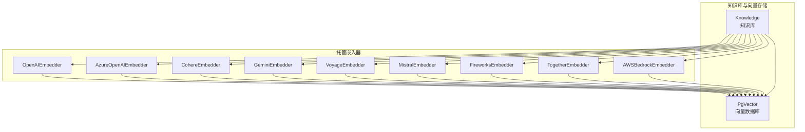
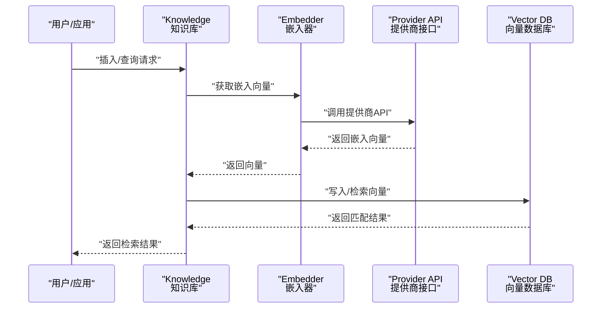
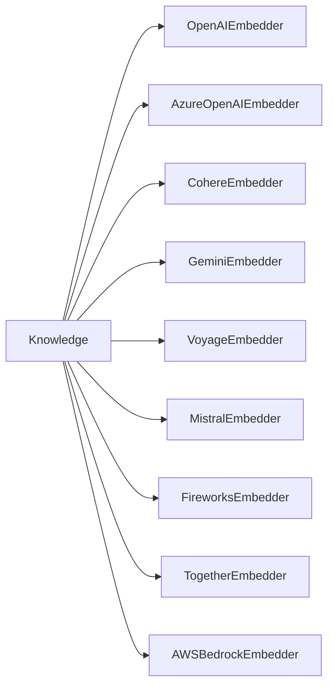

# 托管嵌入器

<cite>
**本文引用的文件**
- [cookbook/knowledge/embedders.mdx](file://cookbook/knowledge/embedders.mdx)
- [_snippets/embedder-openai-reference.mdx](file://_snippets/embedder-openai-reference.mdx)
- [_snippets/embedder-gemini-reference.mdx](file://_snippets/embedder-gemini-reference.mdx)
- [_snippets/embedder-cohere-reference.mdx](file://_snippets/embedder-cohere-reference.mdx)
- [_snippets/embedder-voyageai-reference.mdx](file://_snippets/embedder-voyageai-reference.mdx)
- [_snippets/embedder-mistral-reference.mdx](file://_snippets/embedder-mistral-reference.mdx)
- [_snippets/embedder-azure-openai-reference.mdx](file://_snippets/embedder-azure-openai-reference.mdx)
- [_snippets/embedder-fireworks-reference.mdx](file://_snippets/embedder-fireworks-reference.mdx)
- [_snippets/embedder-together-reference.mdx](file://_snippets/embedder-together-reference.mdx)
- [examples/knowledge/embedders/openai-embedder.mdx](file://examples/knowledge/embedders/openai-embedder.mdx)
- [examples/knowledge/embedders/gemini-embedder.mdx](file://examples/knowledge/embedders/gemini-embedder.mdx)
- [examples/knowledge/embedders/cohere-embedder.mdx](file://examples/knowledge/embedders/cohere-embedder.mdx)
- [examples/knowledge/embedders/azure-embedder.mdx](file://examples/knowledge/embedders/azure-embedder.mdx)
- [examples/knowledge/embedders/aws-bedrock-embedder.mdx](file://examples/knowledge/embedders/aws-bedrock-embedder.mdx)
</cite>

## 目录
1. [简介](#简介)
2. [项目结构](#项目结构)
3. [核心组件](#核心组件)
4. [架构总览](#架构总览)
5. [详细组件分析](#详细组件分析)
6. [依赖关系分析](#依赖关系分析)
7. [性能考量](#性能考量)
8. [故障排查指南](#故障排查指南)
9. [结论](#结论)
10. [附录](#附录)

## 简介
本技术文档聚焦于“托管嵌入器”，系统性梳理并对比多家云端嵌入器服务（OpenAI、Google Gemini、Cohere、Voyage AI、Mistral、AWS Bedrock、Azure OpenAI、Fireworks、Together、Jina、Nebius、LangDB 等）在本仓库中的配置方式、API 密钥设置、模型选择与参数调优要点，并结合示例与最佳实践，帮助读者在生产环境中高效、稳定地完成文本向量化与相似度检索。

## 项目结构
围绕托管嵌入器，本仓库提供了统一的知识库嵌入器接口与多提供商实现，典型使用路径如下：
- 在知识库中通过向量数据库组件注入嵌入器实例，实现从文本到向量的转换与持久化。
- 提供多个示例脚本，演示如何初始化不同提供商的嵌入器、进行单条或批量嵌入、并将结果写入向量数据库。

图表来源
- [cookbook/knowledge/embedders.mdx:22-37](file://cookbook/knowledge/embedders.mdx#L22-L37)
- [examples/knowledge/embedders/openai-embedder.mdx:13-37](file://examples/knowledge/embedders/openai-embedder.mdx#L13-L37)
- [examples/knowledge/embedders/gemini-embedder.mdx:15-37](file://examples/knowledge/embedders/gemini-embedder.mdx#L15-L37)
- [examples/knowledge/embedders/cohere-embedder.mdx:15-42](file://examples/knowledge/embedders/cohere-embedder.mdx#L15-L42)
- [examples/knowledge/embedders/azure-embedder.mdx:15-37](file://examples/knowledge/embedders/azure-embedder.mdx#L15-L37)
- [examples/knowledge/embedders/aws-bedrock-embedder.mdx:19-38](file://examples/knowledge/embedders/aws-bedrock-embedder.mdx#L19-L38)

章节来源
- [cookbook/knowledge/embedders.mdx:1-203](file://cookbook/knowledge/embedders.mdx#L1-L203)

## 核心组件
- 统一接口：知识库通过向量数据库组件注入嵌入器，嵌入器负责将文本转为固定维度的向量，供后续相似度检索使用。
- 多提供商支持：仓库明确支持多家托管嵌入器，覆盖主流云厂商与第三方模型服务，便于按需切换与迁移。
- 示例驱动：每个提供商均配套示例脚本，展示初始化、单条/批量嵌入、以及与知识库的集成流程。

章节来源
- [cookbook/knowledge/embedders.mdx:22-37](file://cookbook/knowledge/embedders.mdx#L22-L37)
- [cookbook/knowledge/embedders.mdx:40-201](file://cookbook/knowledge/embedders.mdx#L40-L201)

## 架构总览
下图展示了从文本输入到向量入库的关键流程，以及与不同托管嵌入器的交互关系：

图表来源
- [cookbook/knowledge/embedders.mdx:13-19](file://cookbook/knowledge/embedders.mdx#L13-L19)
- [examples/knowledge/embedders/openai-embedder.mdx:43-51](file://examples/knowledge/embedders/openai-embedder.mdx#L43-L51)
- [examples/knowledge/embedders/gemini-embedder.mdx:43-51](file://examples/knowledge/embedders/gemini-embedder.mdx#L43-L51)
- [examples/knowledge/embedders/cohere-embedder.mdx:48-56](file://examples/knowledge/embedders/cohere-embedder.mdx#L48-L56)
- [examples/knowledge/embedders/azure-embedder.mdx:43-51](file://examples/knowledge/embedders/azure-embedder.mdx#L43-L51)
- [examples/knowledge/embedders/aws-bedrock-embedder.mdx:44-52](file://examples/knowledge/embedders/aws-bedrock-embedder.mdx#L44-L52)

## 详细组件分析

### OpenAI 嵌入器
- 配置要点
  - 模型选择：默认模型与维度可按需调整；支持 float/base64 输出格式。
  - 认证方式：优先使用环境变量承载 API 密钥；亦可传入预配置客户端以复用连接。
  - 请求参数：可通过附加参数控制请求行为，如超时、重试等。
- 参数参考
  - 关键参数：id、dimensions、encoding_format、api_key、organization、base_url、request_params、client_params、openai_client。
- 使用示例
  - 单条嵌入与批量嵌入示例均可在示例脚本中找到。
- 适用场景
  - 生产级稳定性与广泛生态适配，适合多数企业检索任务。

章节来源
- [_snippets/embedder-openai-reference.mdx:1-14](file://_snippets/embedder-openai-reference.mdx#L1-L14)
- [examples/knowledge/embedders/openai-embedder.mdx:23-37](file://examples/knowledge/embedders/openai-embedder.mdx#L23-L37)
- [examples/knowledge/embedders/openai-embedder.mdx:43-51](file://examples/knowledge/embedders/openai-embedder.mdx#L43-L51)

### Google Gemini 嵌入器
- 配置要点
  - 模型与任务类型：支持指定任务类型与可选标题；输出维度可配置。
  - 认证方式：通过环境变量承载 API 密钥；亦可传入预配置客户端。
- 参数参考
  - 关键参数：id、task_type、title、dimensions、api_key、request_params、client_params、gemini_client。
- 使用示例
  - 示例脚本展示标准与批量嵌入两种模式。

章节来源
- [_snippets/embedder-gemini-reference.mdx:1-12](file://_snippets/embedder-gemini-reference.mdx#L1-L12)
- [examples/knowledge/embedders/gemini-embedder.mdx:23-37](file://examples/knowledge/embedders/gemini-embedder.mdx#L23-L37)
- [examples/knowledge/embedders/gemini-embedder.mdx:43-51](file://examples/knowledge/embedders/gemini-embedder.mdx#L43-L51)

### Cohere 嵌入器
- 配置要点
  - 输入类型：支持多种输入类型（如搜索查询、分类、聚类），可按业务场景选择。
  - 批处理：示例脚本提供批量嵌入的启用方式与参数组合。
- 参数参考
  - 关键参数：id、input_type、embedding_types、api_key、request_params、client_params、cohere_client。
- 使用示例
  - 示例脚本展示标准与批量嵌入两种模式。

章节来源
- [_snippets/embedder-cohere-reference.mdx:1-11](file://_snippets/embedder-cohere-reference.mdx#L1-L11)
- [examples/knowledge/embedders/cohere-embedder.mdx:23-42](file://examples/knowledge/embedders/cohere-embedder.mdx#L23-L42)
- [examples/knowledge/embedders/cohere-embedder.mdx:48-56](file://examples/knowledge/embedders/cohere-embedder.mdx#L48-L56)

### Azure OpenAI 嵌入器
- 配置要点
  - 身份验证：支持 API Key 与 Azure AD Token/Provider 两种认证方式。
  - 端点与部署：需正确配置端点、版本、部署名称等参数。
- 参数参考
  - 关键参数：id、dimensions、encoding_format、api_key、api_version、azure_endpoint、azure_deployment、azure_ad_token、azure_ad_token_provider、organization、request_params、client_params、openai_client。
- 使用示例
  - 示例脚本展示标准与批量嵌入两种模式。

章节来源
- [_snippets/embedder-azure-openai-reference.mdx:1-20](file://_snippets/embedder-azure-openai-reference.mdx#L1-L20)
- [examples/knowledge/embedders/azure-embedder.mdx:23-37](file://examples/knowledge/embedders/azure-embedder.mdx#L23-L37)
- [examples/knowledge/embedders/azure-embedder.mdx:43-51](file://examples/knowledge/embedders/azure-embedder.mdx#L43-L51)

### AWS Bedrock 嵌入器
- 配置要点
  - 凭据与区域：需配置 AWS 凭据与目标区域；示例脚本强调了必要的环境变量与依赖安装。
  - 输入类型：示例中使用了搜索文档类型的输入类型。
- 使用示例
  - 示例脚本展示嵌入计算与知识库插入流程。

章节来源
- [examples/knowledge/embedders/aws-bedrock-embedder.mdx:12-16](file://examples/knowledge/embedders/aws-bedrock-embedder.mdx#L12-L16)
- [examples/knowledge/embedders/aws-bedrock-embedder.mdx:27-38](file://examples/knowledge/embedders/aws-bedrock-embedder.mdx#L27-L38)
- [examples/knowledge/embedders/aws-bedrock-embedder.mdx:44-52](file://examples/knowledge/embedders/aws-bedrock-embedder.mdx#L44-L52)

### Voyage AI 嵌入器
- 配置要点
  - 自定义基础 URL：示例脚本提供了自定义基础 URL 的方式。
  - 超时与重试：可配置最大重试次数与请求超时。
- 参数参考
  - 关键参数：id、dimensions、request_params、api_key、base_url、max_retries、timeout、client_params、voyage_client。

章节来源
- [_snippets/embedder-voyageai-reference.mdx:1-13](file://_snippets/embedder-voyageai-reference.mdx#L1-L13)

### Mistral 嵌入器
- 配置要点
  - 自定义端点：可配置自定义 API 端点。
  - 超时与重试：可配置最大重试次数与请求超时。
- 参数参考
  - 关键参数：id、dimensions、request_params、api_key、endpoint、max_retries、timeout、client_params、mistral_client。

章节来源
- [_snippets/embedder-mistral-reference.mdx:1-13](file://_snippets/embedder-mistral-reference.mdx#L1-L13)

### Fireworks 嵌入器
- 配置要点
  - 基础 URL：示例脚本提供了自定义基础 URL 的方式。
- 参数参考
  - 关键参数：id、dimensions、api_key、base_url。

章节来源
- [_snippets/embedder-fireworks-reference.mdx:1-8](file://_snippets/embedder-fireworks-reference.mdx#L1-L8)

### Together 嵌入器
- 配置要点
  - 基础 URL：示例脚本提供了自定义基础 URL 的方式。
- 参数参考
  - 关键参数：id、dimensions、api_key、base_url。

章节来源
- [_snippets/embedder-together-reference.mdx:1-8](file://_snippets/embedder-together-reference.mdx#L1-L8)

### Jina、Nebius、LangDB 嵌入器
- 支持状态
  - 仓库清单中列出了 Jina、Nebius、LangDB 等提供商，但未提供对应的参数参考与示例脚本。
  - 建议依据其他已实现提供商的参数风格与示例结构进行对接与测试。
- 迁移建议
  - 参考 OpenAI/Gemini/Cohere 等已实现提供商的参数命名与认证方式，快速完成适配。

章节来源
- [cookbook/knowledge/embedders.mdx:22-37](file://cookbook/knowledge/embedders.mdx#L22-L37)

## 依赖关系分析
- 组件耦合
  - 知识库与向量数据库之间通过嵌入器解耦，嵌入器内部再对接具体提供商 API。
  - 各嵌入器共享一致的初始化参数风格（如 api_key、request_params、client_params），降低迁移成本。
- 外部依赖
  - OpenAI/Azure OpenAI：需要对应 API 密钥与网络访问权限。
  - Google Gemini：需要 API 密钥与相应项目权限。
  - Cohere：需要 API 密钥与授权策略。
  - AWS Bedrock：需要 AWS 凭据与 IAM 权限。
  - 第三方平台（Fireworks、Together 等）：遵循其各自的认证与配额策略。

图表来源
- [cookbook/knowledge/embedders.mdx:22-37](file://cookbook/knowledge/embedders.mdx#L22-L37)

章节来源
- [cookbook/knowledge/embedders.mdx:22-37](file://cookbook/knowledge/embedders.mdx#L22-L37)

## 性能考量
- 批量处理
  - 多数提供商示例展示了批量嵌入能力，建议在大规模数据入库时启用批量模式，以提升吞吐并降低请求开销。
- 超时与重试
  - 对于高延迟或不稳定网络，建议配置合理的超时与指数退避重试策略，避免单点失败影响整体进度。
- 维度与模型选择
  - 不同模型的维度与语义质量存在差异，应结合下游检索效果与存储成本进行权衡。
- 并发与限流
  - 在高并发场景下，注意提供商的速率限制与配额，必要时引入队列与限流策略。

## 故障排查指南
- 认证失败
  - 确认 API 密钥是否正确设置；检查环境变量名与实际值是否匹配；对于 Azure OpenAI，确认端点、版本与部署名称配置无误。
- 网络与超时
  - 若出现超时或连接异常，检查网络连通性与代理设置；适当提高超时阈值并开启重试。
- 模型不兼容
  - 确认所选模型在目标提供商处可用；若模型不可用，尝试更换为受支持的模型。
- 批处理异常
  - 批大小过大可能导致内存压力或超时，建议逐步减小批大小并观察稳定性。

章节来源
- [_snippets/embedder-azure-openai-reference.mdx:9-12](file://_snippets/embedder-azure-openai-reference.mdx#L9-L12)
- [_snippets/embedder-voyageai-reference.mdx:10-11](file://_snippets/embedder-voyageai-reference.mdx#L10-L11)
- [_snippets/embedder-mistral-reference.mdx:10-11](file://_snippets/embedder-mistral-reference.mdx#L10-L11)

## 结论
本仓库对托管嵌入器提供了统一的抽象与丰富的示例，覆盖多家主流提供商。通过标准化的参数风格与清晰的使用流程，开发者可以快速在不同提供商之间切换，并结合批量处理、超时与重试等最佳实践，在生产环境中获得稳定、高效的嵌入能力。

## 附录
- 快速开始
  - 参考示例脚本，先在本地配置好环境变量与依赖，再运行对应提供商的示例，验证嵌入与入库流程。
- 进一步阅读
  - 参考知识库与向量数据库相关文档，了解如何将嵌入器与检索流程完整串联。