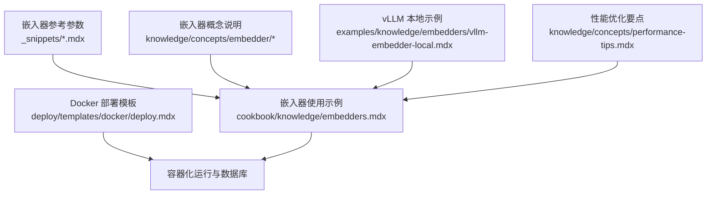
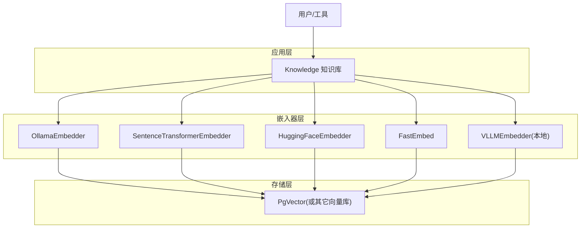
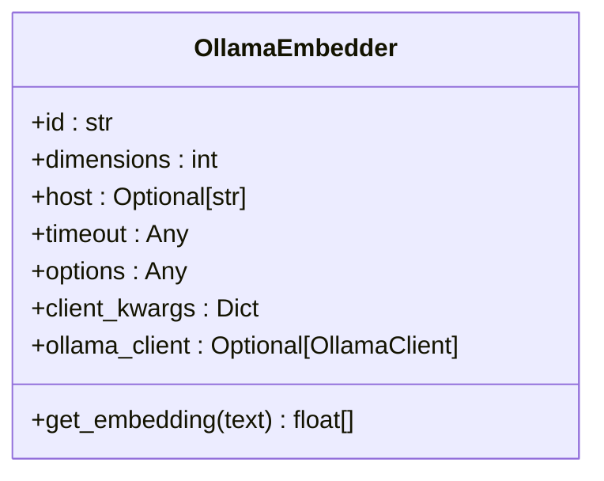
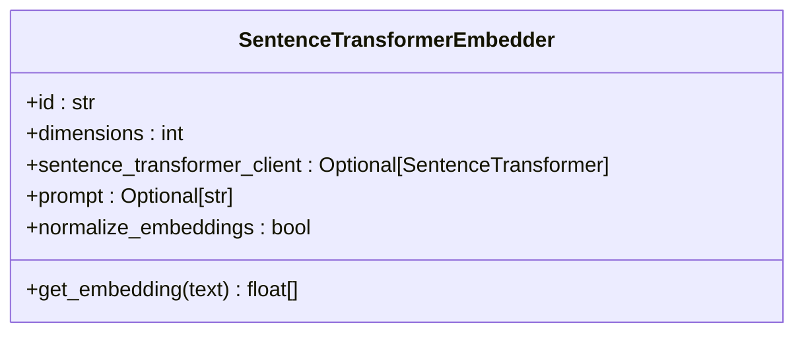
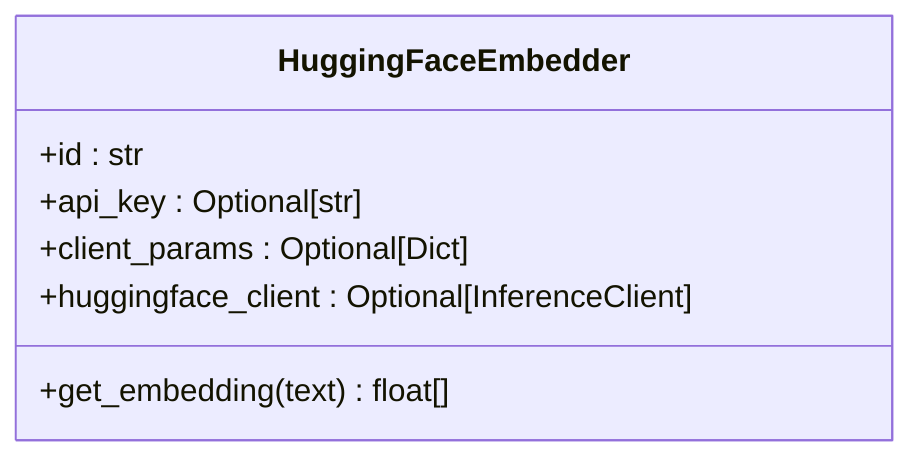
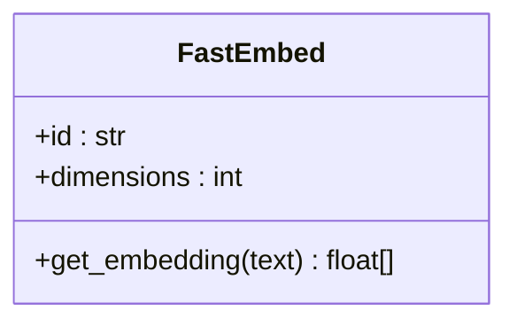
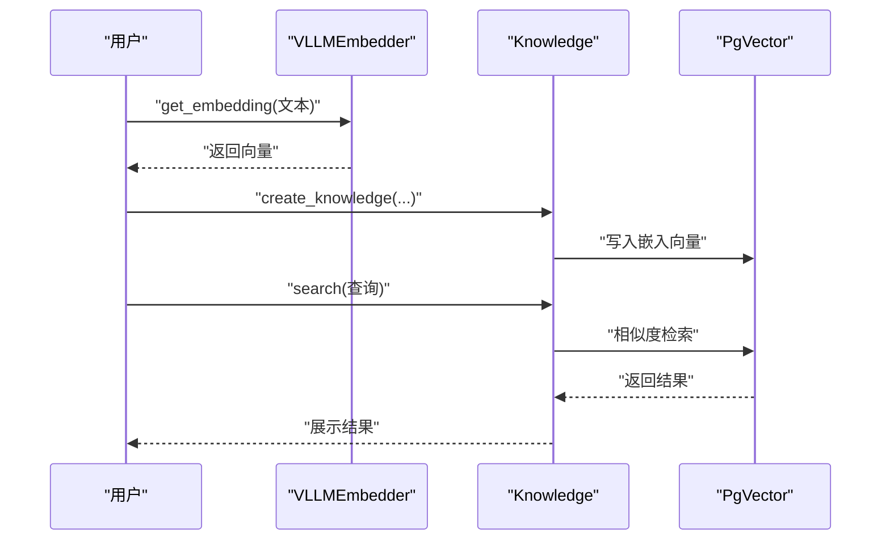
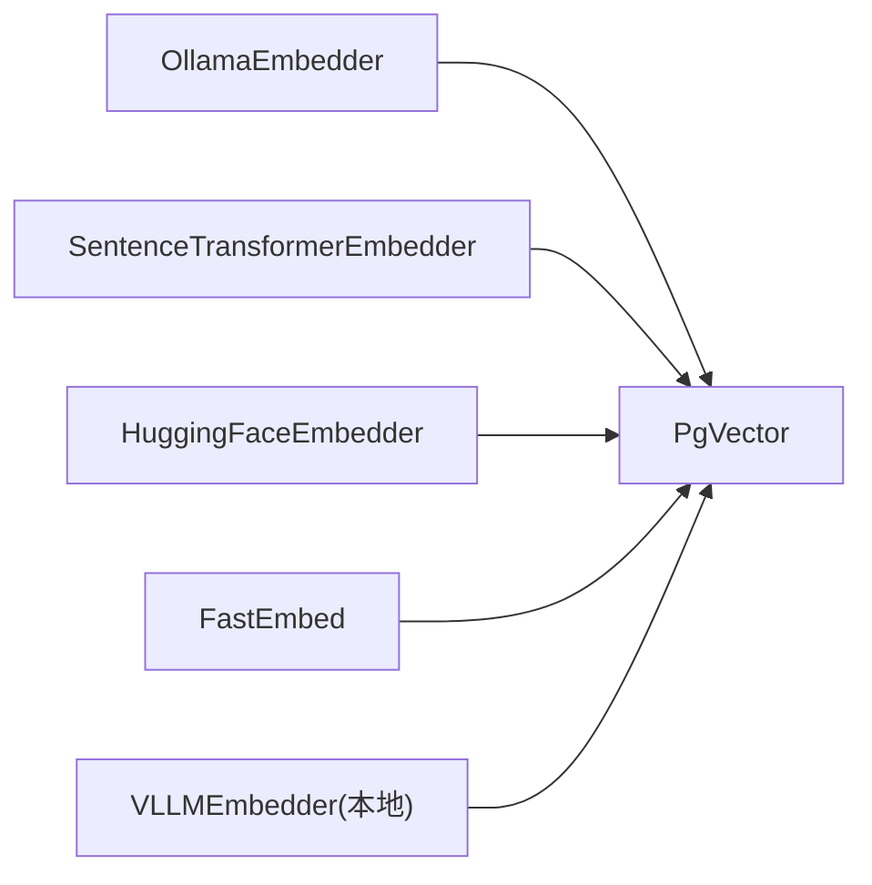
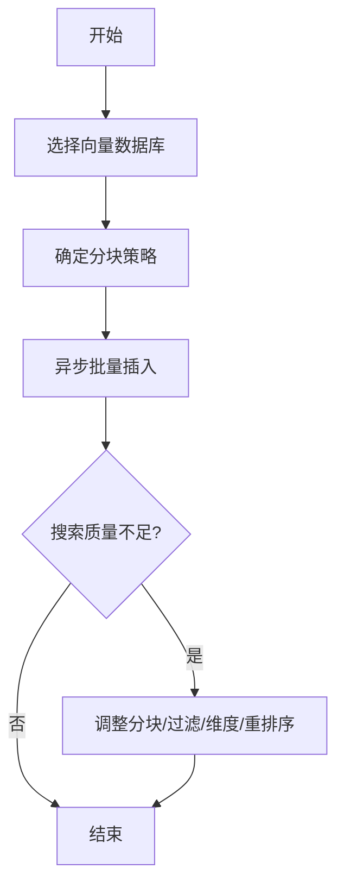

# 本地嵌入器

<cite>
**本文引用的文件**
- [embedders.mdx](file://cookbook/knowledge/embedders.mdx)
- [ollama 概览.mdx](file://knowledge/concepts/embedder/ollama/overview.mdx)
- [Ollama 嵌入器参数.snip](file://_snippets/embedder-ollama-reference.mdx)
- [FastEmbed 嵌入器参数.snip](file://_snippets/embedder-fastembed-reference.mdx)
- [Sentence Transformer 嵌入器参数.snip](file://_snippets/embedder-sentence-transformer-reference.mdx)
- [Hugging Face 嵌入器参数.snip](file://_snippets/embedder-huggingface-reference.mdx)
- [Docker 部署模板.mdx](file://deploy/templates/docker/deploy.mdx)
- [vLLM 本地嵌入器示例.mdx](file://examples/knowledge/embedders/vllm-embedder-local.mdx)
- [vLLM 嵌入器概览.mdx](file://knowledge/concepts/embedder/vllm/overview.mdx)
- [性能优化要点.mdx](file://knowledge/concepts/performance-tips.mdx)
</cite>

## 目录
1. [简介](#简介)
2. [项目结构](#项目结构)
3. [核心组件](#核心组件)
4. [架构总览](#架构总览)
5. [组件详解](#组件详解)
6. [依赖关系分析](#依赖关系分析)
7. [性能考量](#性能考量)
8. [故障排查指南](#故障排查指南)
9. [结论](#结论)
10. [附录](#附录)

## 简介
本技术文档聚焦于本地部署的嵌入器方案，覆盖 Ollama、Sentence Transformers、Hugging Face 以及 FastEmbed 的安装配置、模型下载与运行要求；并基于仓库中的参数与示例，对这些本地嵌入器在性能、内存占用与推理速度方面进行横向对比；最后提供隐私保护与离线使用建议、Docker 部署实践、GPU 加速与模型优化的实用技巧，并总结常见问题与性能调优方法。

## 项目结构
围绕“本地嵌入器”的知识与示例主要分布在以下位置：
- 嵌入器参考与参数：_snippets 下的各嵌入器参数表
- 嵌入器使用示例与说明：cookbook/knowledge/embedders.mdx
- 各嵌入器概念与用法：knowledge/concepts/embedder 下的对应子目录
- vLLM 本地嵌入器示例：examples/knowledge/embedders/vllm-embedder-local.mdx
- 性能优化与监控：knowledge/concepts/performance-tips.mdx
- 容器化部署：deploy/templates/docker/deploy.mdx

**图表来源**
- [embedders.mdx:1-203](file://cookbook/knowledge/embedders.mdx#L1-L203)
- [ollama 概览.mdx:1-35](file://knowledge/concepts/embedder/ollama/overview.mdx#L1-L35)
- [vLLM 本地嵌入器示例.mdx:1-110](file://examples/knowledge/embedders/vllm-embedder-local.mdx#L1-L110)
- [性能优化要点.mdx:1-226](file://knowledge/concepts/performance-tips.mdx#L1-L226)
- [Docker 部署模板.mdx:1-112](file://deploy/templates/docker/deploy.mdx#L1-L112)

**章节来源**
- [embedders.mdx:1-203](file://cookbook/knowledge/embedders.mdx#L1-L203)
- [ollama 概览.mdx:1-35](file://knowledge/concepts/embedder/ollama/overview.mdx#L1-L35)
- [vLLM 本地嵌入器示例.mdx:1-110](file://examples/knowledge/embedders/vllm-embedder-local.mdx#L1-L110)
- [性能优化要点.mdx:1-226](file://knowledge/concepts/performance-tips.mdx#L1-L226)
- [Docker 部署模板.mdx:1-112](file://deploy/templates/docker/deploy.mdx#L1-L112)

## 核心组件
- Ollama 嵌入器：通过本地 Ollama 服务生成嵌入向量，支持指定模型与维度、主机地址、超时等参数。
- Sentence Transformers 嵌入器：基于本地 Hugging Face sentence-transformers 库，可加载多种开源模型，支持维度、客户端实例与提示词等参数。
- Hugging Face 嵌入器：通过 Hugging Face 推理客户端生成嵌入，需提供 API Key 或预置客户端。
- FastEmbed 嵌入器：高效嵌入实现，默认模型为 BAAI/bge-small-en-v1.5，支持指定模型与维度。
- vLLM 嵌入器（本地模式）：直接加载本地模型进行推理，支持批量与参数控制，适合高性能场景。

上述组件均在知识库中以一致接口使用，便于替换与迁移。

**章节来源**
- [Ollama 嵌入器参数.snip:1-11](file://_snippets/embedder-ollama-reference.mdx#L1-L11)
- [Sentence Transformer 嵌入器参数.snip:1-9](file://_snippets/embedder-sentence-transformer-reference.mdx#L1-L9)
- [Hugging Face 嵌入器参数.snip:1-8](file://_snippets/embedder-huggingface-reference.mdx#L1-L8)
- [FastEmbed 嵌入器参数.snip:1-6](file://_snippets/embedder-fastembed-reference.mdx#L1-L6)
- [vLLM 嵌入器概览.mdx:1-54](file://knowledge/concepts/embedder/vllm/overview.mdx#L1-L54)

## 架构总览
下图展示了本地嵌入器在知识库中的典型工作流：文本经由嵌入器转换为向量，写入向量数据库，查询时执行相似度检索。

**图表来源**
- [embedders.mdx:1-203](file://cookbook/knowledge/embedders.mdx#L1-L203)
- [vLLM 本地嵌入器示例.mdx:1-110](file://examples/knowledge/embedders/vllm-embedder-local.mdx#L1-L110)

## 组件详解

### Ollama 嵌入器
- 用途：使用本地 Ollama 服务生成嵌入向量，适合离线与隐私敏感场景。
- 关键参数：模型 ID、输出维度、Ollama 主机地址、请求超时、额外选项、客户端参数、已配置的 Ollama 客户端。
- 使用要点：需先安装 Ollama 并拉取目标模型；可在知识库中直接配置使用。

**图表来源**
- [Ollama 嵌入器参数.snip:1-11](file://_snippets/embedder-ollama-reference.mdx#L1-L11)

**章节来源**
- [ollama 概览.mdx:1-35](file://knowledge/concepts/embedder/ollama/overview.mdx#L1-L35)
- [Ollama 嵌入器参数.snip:1-11](file://_snippets/embedder-ollama-reference.mdx#L1-L11)

### Sentence Transformers 嵌入器
- 用途：本地加载 sentence-transformers 模型，支持自定义维度、提示词与归一化等。
- 关键参数：模型名称、输出维度、预置 SentenceTransformer 客户端、提示词、是否归一化。

**图表来源**
- [Sentence Transformer 嵌入器参数.snip:1-9](file://_snippets/embedder-sentence-transformer-reference.mdx#L1-L9)

**章节来源**
- [Sentence Transformer 嵌入器参数.snip:1-9](file://_snippets/embedder-sentence-transformer-reference.mdx#L1-L9)

### Hugging Face 嵌入器
- 用途：通过 Hugging Face 推理客户端生成嵌入，适合本地或云端模型。
- 关键参数：模型 ID、API Key（可从环境变量读取）、客户端初始化参数、预置客户端。

**图表来源**
- [Hugging Face 嵌入器参数.snip:1-8](file://_snippets/embedder-huggingface-reference.mdx#L1-L8)

**章节来源**
- [Hugging Face 嵌入器参数.snip:1-8](file://_snippets/embedder-huggingface-reference.mdx#L1-L8)

### FastEmbed 嵌入器
- 用途：高效嵌入实现，默认模型 BAAI/bge-small-en-v1.5，适合资源受限的本地部署。
- 关键参数：模型 ID、输出维度。

**图表来源**
- [FastEmbed 嵌入器参数.snip:1-6](file://_snippets/embedder-fastembed-reference.mdx#L1-L6)

**章节来源**
- [FastEmbed 嵌入器参数.snip:1-6](file://_snippets/embedder-fastembed-reference.mdx#L1-L6)

### vLLM 嵌入器（本地）
- 用途：本地直接加载模型进行高性能嵌入推理，支持批量与参数控制。
- 关键参数：模型 ID、维度、强制惰性加载、vLLM 运行参数（如禁用滑动窗口、最大模型长度等）。
- 示例流程：创建嵌入器 → 获取单条嵌入 → 在知识库中插入内容并执行检索。

**图表来源**
- [vLLM 本地嵌入器示例.mdx:1-110](file://examples/knowledge/embedders/vllm-embedder-local.mdx#L1-L110)
- [vLLM 嵌入器概览.mdx:1-54](file://knowledge/concepts/embedder/vllm/overview.mdx#L1-L54)

**章节来源**
- [vLLM 本地嵌入器示例.mdx:1-110](file://examples/knowledge/embedders/vllm-embedder-local.mdx#L1-L110)
- [vLLM 嵌入器概览.mdx:1-54](file://knowledge/concepts/embedder/vllm/overview.mdx#L1-L54)

## 依赖关系分析
- 统一接口：所有嵌入器均通过知识库一致地注入到向量数据库中，便于切换与迁移。
- 外部依赖：
  - Ollama：需要本地安装与模型拉取。
  - Sentence Transformers/Hugging Face：需要本地模型或网络访问权限。
  - FastEmbed：轻量级本地实现。
  - vLLM：本地模型加载与推理，支持批量与参数优化。
- 存储依赖：示例中多采用 PgVector，亦可替换为其他向量数据库。

**图表来源**
- [embedders.mdx:1-203](file://cookbook/knowledge/embedders.mdx#L1-L203)
- [vLLM 本地嵌入器示例.mdx:1-110](file://examples/knowledge/embedders/vllm-embedder-local.mdx#L1-L110)

**章节来源**
- [embedders.mdx:1-203](file://cookbook/knowledge/embedders.mdx#L1-L203)
- [vLLM 本地嵌入器示例.mdx:1-110](file://examples/knowledge/embedders/vllm-embedder-local.mdx#L1-L110)

## 性能考量
- 数据库选择：生产推荐 PgVector；开发测试可用零配置的 LanceDB/ChromaDB。
- 批处理与并发：使用异步批量插入与并发操作提升吞吐。
- 分块策略：根据内容类型选择固定大小、递归或语义分块；语义分块质量更高但更慢。
- 搜索优化：优先使用元数据过滤缩小范围；必要时启用混合检索与重排序。
- 维度权衡：在可接受的质量范围内降低维度以提升速度。
- vLLM 参数：禁用滑动窗口、设置最大模型长度、启用批量与惰性加载等。

**图表来源**
- [性能优化要点.mdx:1-226](file://knowledge/concepts/performance-tips.mdx#L1-L226)

**章节来源**
- [性能优化要点.mdx:1-226](file://knowledge/concepts/performance-tips.mdx#L1-L226)

## 故障排查指南
- 本地连接问题：浏览器兼容性不佳时，可使用 Chrome/Edge 或通过隧道服务（如 ngrok/Cloudflare Tunnel）暴露本地端口。
- Docker 环境：按模板启动本地 AgentOS 与数据库，确认端口映射与环境变量配置。
- 模型不可用：Ollama 需确保模型已拉取；Hugging Face 需检查 API Key 与网络连通性；vLLM 需确认本地模型路径与参数。
- 搜索异常：检查分块策略、维度设置、过滤条件与索引状态；使用内置调试方法查看失败内容与状态。

**章节来源**
- [Docker 部署模板.mdx:1-112](file://deploy/templates/docker/deploy.mdx#L1-L112)
- [ollama 概览.mdx:1-35](file://knowledge/concepts/embedder/ollama/overview.mdx#L1-L35)
- [性能优化要点.mdx:1-226](file://knowledge/concepts/performance-tips.mdx#L1-L226)

## 结论
本地嵌入器在隐私保护与离线可用性方面具有显著优势。Ollama、Sentence Transformers、Hugging Face 与 FastEmbed 提供了多样化的本地部署选项；vLLM 则在本地推理性能上具备潜力。结合合适的分块策略、批量与参数优化，可在保证检索质量的同时提升整体吞吐与响应速度。Docker 模板可快速搭建本地开发与测试环境，便于后续迁移至生产。

## 附录

### 安装与运行要求（基于仓库内容）
- Ollama：需安装 Ollama 并拉取目标模型后方可使用。
- Sentence Transformers：本地安装 sentence-transformers 并加载所需模型。
- Hugging Face：准备 API Key（可从环境变量读取），或提供预置客户端。
- FastEmbed：默认模型为 BAAI/bge-small-en-v1.5，适合轻量部署。
- vLLM：本地加载模型，支持批量与参数控制。

**章节来源**
- [ollama 概览.mdx:1-35](file://knowledge/concepts/embedder/ollama/overview.mdx#L1-L35)
- [Sentence Transformer 嵌入器参数.snip:1-9](file://_snippets/embedder-sentence-transformer-reference.mdx#L1-L9)
- [Hugging Face 嵌入器参数.snip:1-8](file://_snippets/embedder-huggingface-reference.mdx#L1-L8)
- [FastEmbed 嵌入器参数.snip:1-6](file://_snippets/embedder-fastembed-reference.mdx#L1-L6)
- [vLLM 嵌入器概览.mdx:1-54](file://knowledge/concepts/embedder/vllm/overview.mdx#L1-L54)

### 隐私保护与离线使用
- 本地部署：所有模型与数据均在本地运行，避免上传至第三方。
- API Key 管理：Hugging Face 可通过环境变量管理密钥；Ollama 无需外部密钥。
- 模型选择：优先选择开源模型，减少对外部服务依赖。

**章节来源**
- [Hugging Face 嵌入器参数.snip:1-8](file://_snippets/embedder-huggingface-reference.mdx#L1-L8)
- [ollama 概览.mdx:1-35](file://knowledge/concepts/embedder/ollama/overview.mdx#L1-L35)

### Docker 部署与 GPU 加速
- Docker：模板提供本地一键启动与云部署指引，包含 AgentOS 与数据库容器编排。
- GPU 加速：vLLM 支持本地高性能推理；具体 GPU 配置请参考 vLLM 文档与运行环境。

**章节来源**
- [Docker 部署模板.mdx:1-112](file://deploy/templates/docker/deploy.mdx#L1-L112)
- [vLLM 嵌入器概览.mdx:1-54](file://knowledge/concepts/embedder/vllm/overview.mdx#L1-L54)

### 实用技巧与最佳实践
- 优先使用异步批量插入与并发操作。
- 根据内容类型选择合适分块策略；语义分块适用于复杂文档。
- 使用元数据过滤缩小搜索范围；必要时启用混合检索与重排序。
- 在可接受范围内降低维度以提升速度。
- 对 vLLM 使用批量与惰性加载、禁用滑动窗口、设置最大模型长度等参数优化。

**章节来源**
- [性能优化要点.mdx:1-226](file://knowledge/concepts/performance-tips.mdx#L1-L226)
- [vLLM 本地嵌入器示例.mdx:1-110](file://examples/knowledge/embedders/vllm-embedder-local.mdx#L1-L110)