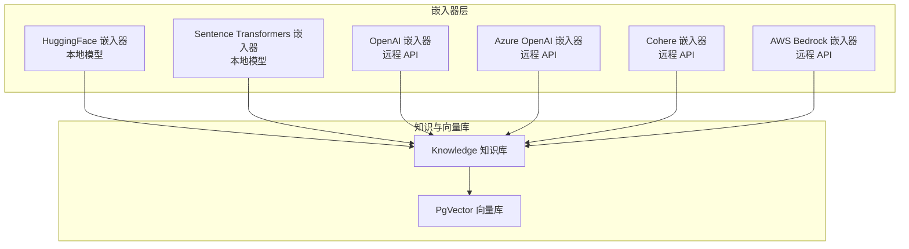
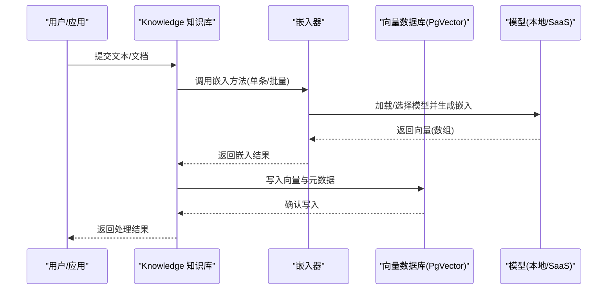
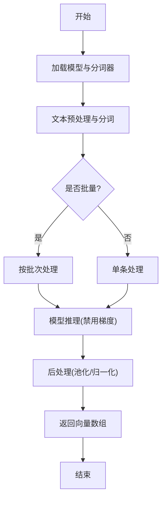
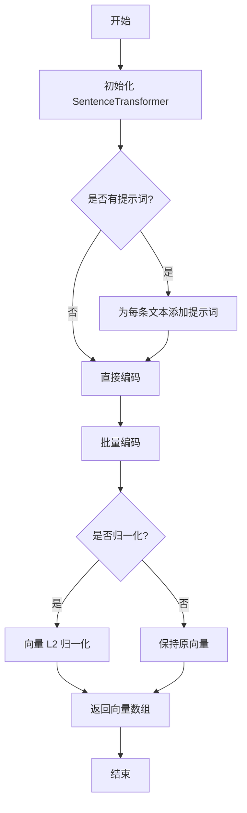
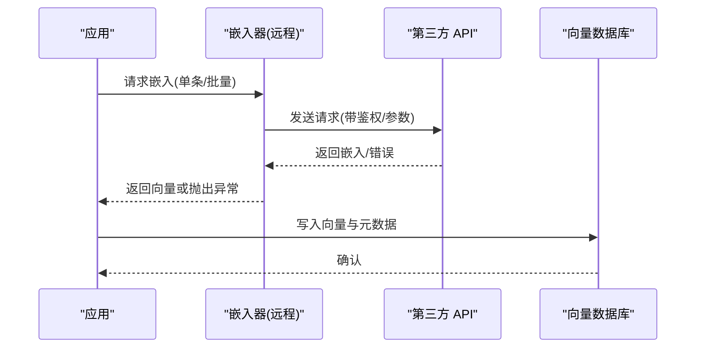
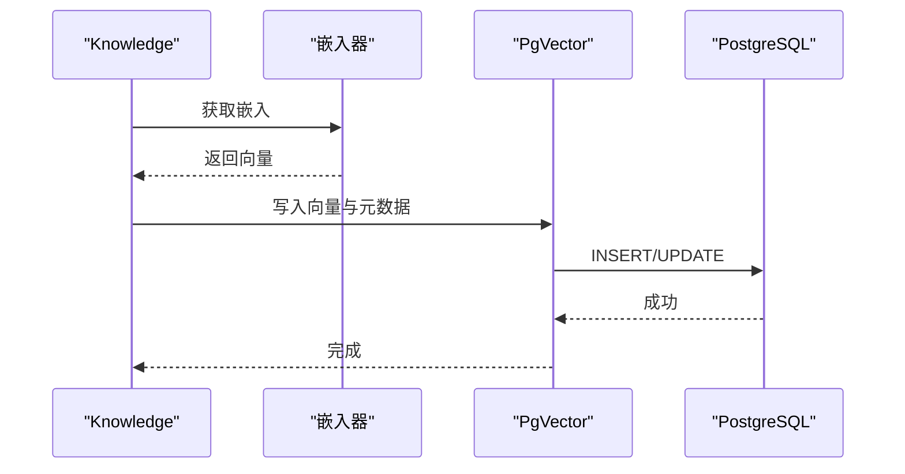
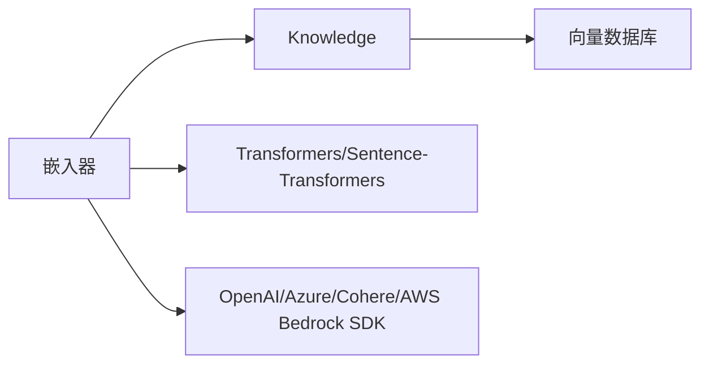

# 自定义嵌入器

<cite>
**本文引用的文件**
- [cookbook/knowledge/embedders.mdx](file://cookbook/knowledge/embedders.mdx)
- [_snippets/embedder-openai-reference.mdx](file://_snippets/embedder-openai-reference.mdx)
- [_snippets/embedder-huggingface-reference.mdx](file://_snippets/embedder-huggingface-reference.mdx)
- [_snippets/embedder-sentence-transformer-reference.mdx](file://_snippets/embedder-sentence-transformer-reference.mdx)
- [examples/knowledge/embedders/cohere-embedder.mdx](file://examples/knowledge/embedders/cohere-embedder.mdx)
- [examples/knowledge/embedders/aws-bedrock-embedder.mdx](file://examples/knowledge/embedders/aws-bedrock-embedder.mdx)
- [examples/knowledge/embedders/azure-embedder.mdx](file://examples/knowledge/embedders/azure-embedder.mdx)
- [knowledge/concepts/embedder/overview.mdx](file://knowledge/concepts/embedder/overview.mdx)
</cite>

## 目录
1. [简介](#简介)
2. [项目结构](#项目结构)
3. [核心组件](#核心组件)
4. [架构总览](#架构总览)
5. [详细组件分析](#详细组件分析)
6. [依赖关系分析](#依赖关系分析)
7. [性能考虑](#性能考虑)
8. [故障排查指南](#故障排查指南)
9. [结论](#结论)
10. [附录](#附录)

## 简介
本指南面向需要为知识系统开发“自定义嵌入器”的工程师，目标是帮助你快速理解嵌入器接口规范、必需方法与返回格式，并给出基于 Hugging Face Transformers 与 Sentence Transformers 的本地实现思路；同时覆盖模型加载、批处理优化、内存管理、输入类型与输出格式转换、测试与性能监控，以及与现有向量数据库（如 PgVector）的集成方式。

## 项目结构
围绕嵌入器能力，仓库提供了多厂商嵌入器的参考实现与使用示例，涵盖：
- 统一的嵌入器接口与参数约定（OpenAI、Azure OpenAI、Cohere、HuggingFace、Sentence Transformers、AWS Bedrock 等）
- 典型的批量处理与异步调用模式
- 与向量数据库（PgVector）的组合使用

图中展示了嵌入器作为“知识库”的依赖，知识库再对接向量数据库的典型流程。

章节来源
- [cookbook/knowledge/embedders.mdx:1-203](file://cookbook/knowledge/embedders.mdx#L1-L203)
- [knowledge/concepts/embedder/overview.mdx:109-140](file://knowledge/concepts/embedder/overview.mdx#L109-L140)

## 核心组件
- 嵌入器接口规范
  - 必需方法：获取单条文本嵌入、批量嵌入（可选）、异步批量嵌入（可选）
  - 返回格式：通常为数值数组（浮点数），长度等于模型维度
  - 关键参数：模型标识、输出维度、编码格式、请求参数、客户端配置等
- 输入与输出
  - 输入：字符串或字符串列表
  - 输出：向量数组；部分实现支持返回用量信息（tokens 等）
- 批处理与并发
  - 支持批量嵌入与指数退避重试策略
  - 异步接口用于提升吞吐
- 集成点
  - 与 Knowledge 知识库组合，再接入向量数据库（如 PgVector）

章节来源
- [cookbook/knowledge/embedders.mdx:8-203](file://cookbook/knowledge/embedders.mdx#L8-L203)
- [_snippets/embedder-openai-reference.mdx:1-14](file://_snippets/embedder-openai-reference.mdx#L1-L14)
- [_snippets/embedder-huggingface-reference.mdx:1-8](file://_snippets/embedder-huggingface-reference.mdx#L1-L8)
- [_snippets/embedder-sentence-transformer-reference.mdx:1-9](file://_snippets/embedder-sentence-transformer-reference.mdx#L1-L9)

## 架构总览
下图展示从“文本输入”到“向量存储”的端到端流程，以及嵌入器在其中的位置与职责。

图中体现了嵌入器的核心职责：将文本转换为向量，并与知识库、向量数据库协同工作。

章节来源
- [cookbook/knowledge/embedders.mdx:13-20](file://cookbook/knowledge/embedders.mdx#L13-L20)
- [examples/knowledge/embedders/aws-bedrock-embedder.mdx:23-38](file://examples/knowledge/embedders/aws-bedrock-embedder.mdx#L23-L38)
- [examples/knowledge/embedders/azure-embedder.mdx:23-37](file://examples/knowledge/embedders/azure-embedder.mdx#L23-L37)
- [examples/knowledge/embedders/cohere-embedder.mdx:23-42](file://examples/knowledge/embedders/cohere-embedder.mdx#L23-L42)

## 详细组件分析

### 接口规范与参数约定
- OpenAI 嵌入器参数要点
  - 模型标识、输出维度、编码格式、用户标识、API 密钥、组织、基础 URL、请求参数、客户端初始化参数、预置客户端
- HuggingFace 嵌入器参数要点
  - 模型标识、API 密钥、客户端初始化参数、预置 Inference 客户端
- Sentence Transformers 嵌入器参数要点
  - 模型名称、维度、预置 SentenceTransformer 实例、提示词前缀、是否归一化

章节来源
- [_snippets/embedder-openai-reference.mdx:1-14](file://_snippets/embedder-openai-reference.mdx#L1-L14)
- [_snippets/embedder-huggingface-reference.mdx:1-8](file://_snippets/embedder-huggingface-reference.mdx#L1-L8)
- [_snippets/embedder-sentence-transformer-reference.mdx:1-9](file://_snippets/embedder-sentence-transformer-reference.mdx#L1-L9)

### 基于 Hugging Face Transformers 的本地实现思路
- 模型加载
  - 使用 Transformers 库加载本地或 Hub 上的嵌入模型
  - 注意模型的输入格式与分词器要求
- 文本预处理
  - 统一分词、截断/填充策略
- 嵌入生成
  - 将分词后的张量送入模型，提取最后一层或特殊池化策略得到句向量
- 批处理优化
  - 使用固定批次大小，避免 OOM；必要时启用梯度关闭与半精度推理
- 内存管理
  - 大模型建议显式释放缓存、限制并发、使用惰性加载
- 输出格式
  - 规范化为浮点数组，长度与维度一致

### 基于 Sentence Transformers 的本地实现思路
- 模型加载
  - 使用 sentence-transformers 提供的模型名或本地路径
- 参数控制
  - 维度、是否归一化、提示词前缀
- 批处理与并发
  - 利用内置批处理接口；异步接口用于高吞吐场景
- 输出格式
  - 返回浮点向量数组；可选返回用量信息

章节来源
- [_snippets/embedder-sentence-transformer-reference.mdx:1-9](file://_snippets/embedder-sentence-transformer-reference.mdx#L1-L9)

### 远程 API 嵌入器（以 OpenAI/Azure/Cohere/AWS Bedrock 为例）
- 统一调用流程
  - 初始化嵌入器（传入模型、密钥、URL、维度等）
  - 单条/批量/异步获取嵌入
  - 将嵌入写入向量数据库
- 批处理与重试
  - Cohere 示例展示了启用批量、设置批次大小与指数退避
- 错误处理
  - 对网络异常、速率限制、超时进行捕获与重试

章节来源
- [examples/knowledge/embedders/cohere-embedder.mdx:20-56](file://examples/knowledge/embedders/cohere-embedder.mdx#L20-L56)
- [examples/knowledge/embedders/aws-bedrock-embedder.mdx:24-52](file://examples/knowledge/embedders/aws-bedrock-embedder.mdx#L24-L52)
- [examples/knowledge/embedders/azure-embedder.mdx:20-51](file://examples/knowledge/embedders/azure-embedder.mdx#L20-L51)

### 与向量数据库的集成（PgVector）
- 在知识库中注入嵌入器实例，指定表名与数据库连接串
- 插入文档时自动触发嵌入生成与向量写入
- 可通过批量嵌入提升入库效率

章节来源
- [cookbook/knowledge/embedders.mdx:13-20](file://cookbook/knowledge/embedders.mdx#L13-L20)
- [examples/knowledge/embedders/aws-bedrock-embedder.mdx:32-38](file://examples/knowledge/embedders/aws-bedrock-embedder.mdx#L32-L38)
- [examples/knowledge/embedders/azure-embedder.mdx:30-37](file://examples/knowledge/embedders/azure-embedder.mdx#L30-L37)

## 依赖关系分析
- 嵌入器与知识库：嵌入器作为知识库的依赖，负责将文本转为向量
- 嵌入器与向量库：知识库将嵌入写入向量数据库
- 第三方 SDK：远程嵌入器依赖对应平台的 SDK 或 HTTP 客户端
- 本地模型：Sentence Transformers/HuggingFace Transformers 依赖本地模型权重

## 性能考虑
- 批处理
  - 合理设置批次大小，避免单次请求过大导致超时或 OOM
  - 对远程 API 嵌入器，可启用指数退避与重试
- 并发与异步
  - 使用异步批量接口提升吞吐
- 内存管理
  - 本地模型推理时禁用梯度、合理设置 dtype、及时释放缓存
- 维度与索引
  - 确保嵌入维度与向量库期望一致，避免二次转换带来的开销

## 故障排查指南
- 常见问题
  - API 鉴权失败：检查密钥与组织参数
  - 超时/限流：启用重试与退避、降低批次大小
  - OOM：减小批次、关闭梯度、使用半精度、限制并发
  - 维度不匹配：确认嵌入器输出维度与向量库一致
- 测试与验证
  - 单测：对单条/批量嵌入进行断言，确保输出形状与范围
  - 回放测试：对相同输入重复生成嵌入，验证稳定性
- 性能监控
  - 记录请求耗时、QPS、错误率与向量维度
  - 结合向量库查询耗时评估整体检索性能

## 结论
通过统一的嵌入器接口与成熟的实现模式，你可以快速将第三方嵌入服务或本地模型集成到知识系统中。结合合理的批处理、异步与内存管理策略，可在保证质量的同时获得更优的吞吐与稳定性；最后别忘了与向量数据库的维度与索引策略保持一致，确保端到端的高效运行。

## 附录
- 快速对照表（参数与用途）
  - 模型标识：选择具体模型
  - 输出维度：控制向量长度
  - 编码格式：远程 API 常见为 float/base64
  - 请求参数：超时、重试、代理等
  - 客户端初始化参数：连接池、并发、证书等
  - 预置客户端：复用已配置的客户端实例
- 参考示例路径
  - OpenAI 嵌入器：[cookbook/knowledge/embedders.mdx:44-62](file://cookbook/knowledge/embedders.mdx#L44-L62)
  - Cohere 嵌入器（含批量）：[examples/knowledge/embedders/cohere-embedder.mdx:20-56](file://examples/knowledge/embedders/cohere-embedder.mdx#L20-L56)
  - AWS Bedrock 嵌入器：[examples/knowledge/embedders/aws-bedrock-embedder.mdx:24-52](file://examples/knowledge/embedders/aws-bedrock-embedder.mdx#L24-L52)
  - Azure OpenAI 嵌入器：[examples/knowledge/embedders/azure-embedder.mdx:20-51](file://examples/knowledge/embedders/azure-embedder.mdx#L20-L51)
  - Sentence Transformers 嵌入器参数：[_snippets/embedder-sentence-transformer-reference.mdx:1-9](file://_snippets/embedder-sentence-transformer-reference.mdx#L1-L9)
  - HuggingFace 嵌入器参数：[_snippets/embedder-huggingface-reference.mdx:1-8](file://_snippets/embedder-huggingface-reference.mdx#L1-L8)
  - OpenAI 嵌入器参数：[_snippets/embedder-openai-reference.mdx:1-14](file://_snippets/embedder-openai-reference.mdx#L1-L14)