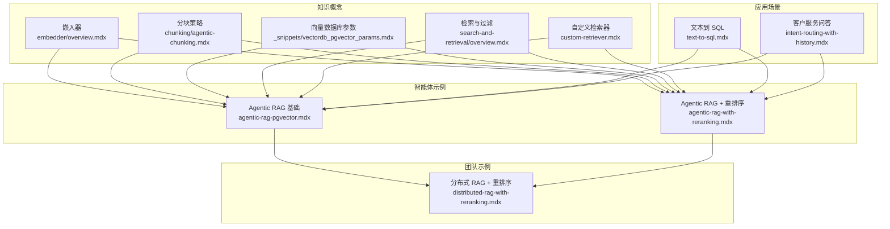
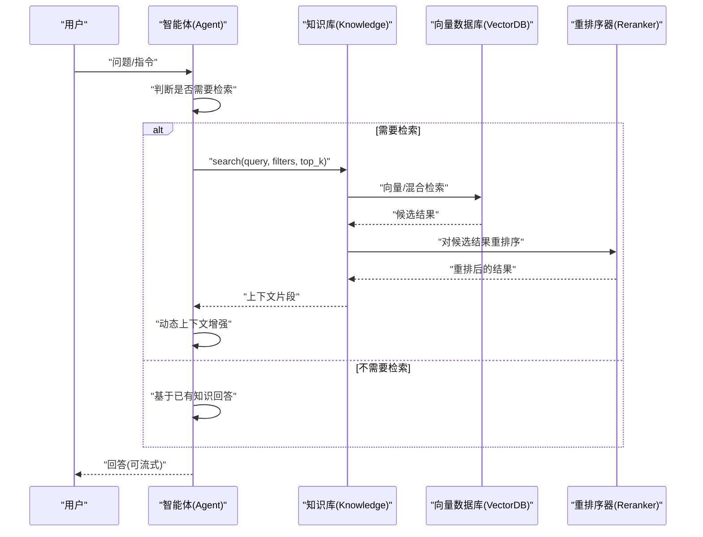
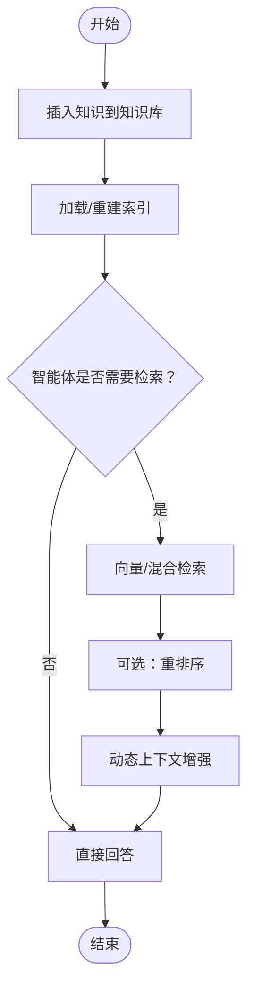
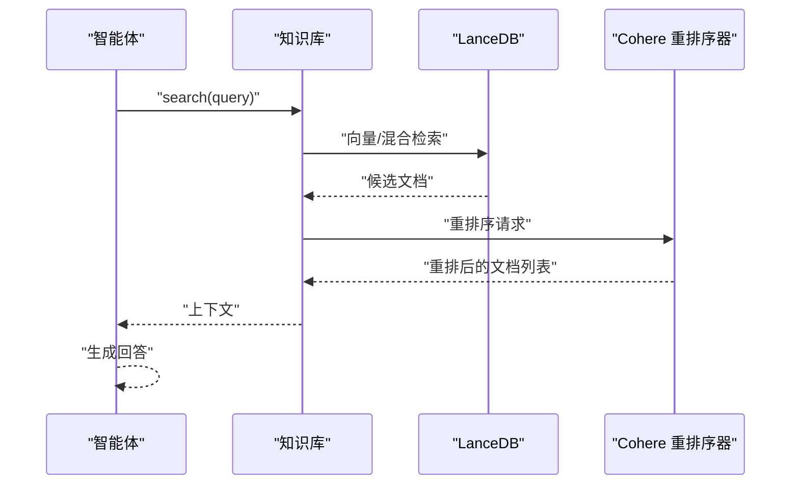
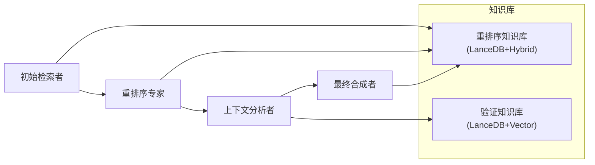
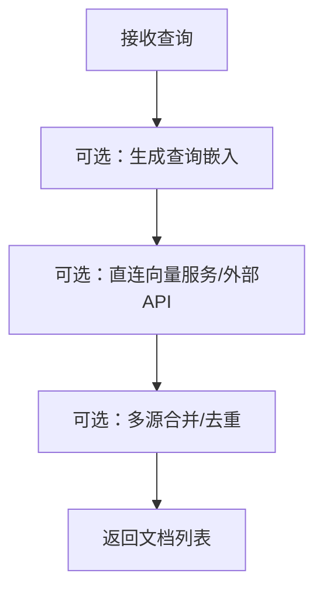
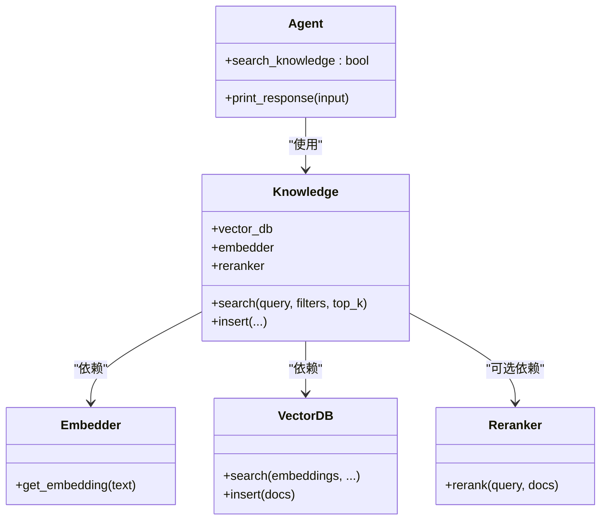

# Agentic RAG 实现

<cite>
**本文引用的文件**
- [agentic-rag-with-reranking.mdx](file://knowledge/agents/agentic-rag-with-reranking.mdx)
- [agentic-rag-pgvector.mdx](file://knowledge/agents/agentic-rag-pgvector.mdx)
- [distributed-rag-with-reranking.mdx](file://knowledge/teams/distributed-rag-with-reranking.mdx)
- [search-and-retrieval/overview.mdx](file://knowledge/concepts/search-and-retrieval/overview.mdx)
- [custom-retriever.mdx](file://knowledge/concepts/search-and-retrieval/custom-retriever.mdx)
- [embedder/overview.mdx](file://knowledge/concepts/embedder/overview.mdx)
- [vectordb_pgvector_params.mdx](file://_snippets/vectordb_pgvector_params.mdx)
- [reranker-cohere-params.mdx](file://_snippets/reranker-cohere-params.mdx)
- [vectordb_pgvector2_params.mdx](file://TBD/snippets/vectordb_pgvector2_params.mdx)
- [agentic-chunking.mdx](file://knowledge/concepts/chunking/agentic-chunking.mdx)
- [text-to-sql.mdx](file://cookbook/streamlit/text-to-sql.mdx)
- [text-to-sql 应用说明](file://production/applications/text-to-sql.mdx)
- [few-shot-learning.mdx](file://context/agent/few-shot-learning.mdx)
- [intent-routing-with-history.mdx](file://examples/workflows/advanced-concepts/history/intent-routing-with-history.mdx)
- [environment-variables.mdx](file://faq/environment-variables.mdx)
</cite>

## 目录
1. [引言](#引言)
2. [项目结构](#项目结构)
3. [核心组件](#核心组件)
4. [架构总览](#架构总览)
5. [详细组件分析](#详细组件分析)
6. [依赖关系分析](#依赖关系分析)
7. [性能考虑](#性能考虑)
8. [故障排除指南](#故障排除指南)
9. [结论](#结论)
10. [附录](#附录)

## 引言
本技术文档围绕 Agentic RAG（智能体驱动的检索增强生成）展开，系统阐述其核心理念与工作机制：按需搜索知识库、动态上下文增强与智能检索策略；并提供从嵌入器配置、向量数据库集成到检索参数调优的完整实践路径。文档还覆盖重排序机制的原理与配置、多智能体分布式协同检索、以及文本到 SQL、客户服务问答等典型应用场景，并给出故障排除与性能监控建议。

## 项目结构
本仓库以“知识”“智能体”“团队”“示例”“参考”等维度组织内容，与 Agentic RAG 的关键模块高度对应：
- 知识概念：嵌入器、分块策略、向量数据库、检索与过滤、自定义检索器
- 智能体示例：基于 LanceDB/PgVector 的 Agentic RAG 基础实现与带重排序的进阶示例
- 团队示例：多智能体分布式协同检索与重排序
- 应用场景：文本到 SQL、客户服务问答等实战案例
- 参考与参数：嵌入器与向量数据库的参数表，便于快速配置

图表来源
- [agentic-rag-pgvector.mdx:1-83](file://knowledge/agents/agentic-rag-pgvector.mdx#L1-L83)
- [agentic-rag-with-reranking.mdx:1-80](file://knowledge/agents/agentic-rag-with-reranking.mdx#L1-L80)
- [distributed-rag-with-reranking.mdx:1-241](file://knowledge/teams/distributed-rag-with-reranking.mdx#L1-L241)
- [search-and-retrieval/overview.mdx:99-152](file://knowledge/concepts/search-and-retrieval/overview.mdx#L99-L152)
- [custom-retriever.mdx:1-167](file://knowledge/concepts/search-and-retrieval/custom-retriever.mdx#L1-L167)
- [embedder/overview.mdx:109-140](file://knowledge/concepts/embedder/overview.mdx#L109-L140)
- [_snippets/vectordb_pgvector_params.mdx:1-16](file://_snippets/vectordb_pgvector_params.mdx#L1-L16)
- [agentic-chunking.mdx:1-62](file://knowledge/concepts/chunking/agentic-chunking.mdx#L1-L62)
- [text-to-sql.mdx:1-131](file://cookbook/streamlit/text-to-sql.mdx#L1-L131)
- [intent-routing-with-history.mdx:148-200](file://examples/workflows/advanced-concepts/history/intent-routing-with-history.mdx#L148-L200)

章节来源
- [agentic-rag-pgvector.mdx:1-83](file://knowledge/agents/agentic-rag-pgvector.mdx#L1-L83)
- [agentic-rag-with-reranking.mdx:1-80](file://knowledge/agents/agentic-rag-with-reranking.mdx#L1-L80)
- [distributed-rag-with-reranking.mdx:1-241](file://knowledge/teams/distributed-rag-with-reranking.mdx#L1-L241)
- [search-and-retrieval/overview.mdx:99-152](file://knowledge/concepts/search-and-retrieval/overview.mdx#L99-L152)
- [custom-retriever.mdx:1-167](file://knowledge/concepts/search-and-retrieval/custom-retriever.mdx#L1-L167)
- [embedder/overview.mdx:109-140](file://knowledge/concepts/embedder/overview.mdx#L109-L140)
- [_snippets/vectordb_pgvector_params.mdx:1-16](file://_snippets/vectordb_pgvector_params.mdx#L1-L16)
- [agentic-chunking.mdx:1-62](file://knowledge/concepts/chunking/agentic-chunking.mdx#L1-L62)
- [text-to-sql.mdx:1-131](file://cookbook/streamlit/text-to-sql.mdx#L1-L131)
- [intent-routing-with-history.mdx:148-200](file://examples/workflows/advanced-concepts/history/intent-routing-with-history.mdx#L148-L200)

## 核心组件
- 智能体（Agent）：负责决策何时搜索、如何改写查询、是否进行二次检索以及最终合成回答。
- 知识库（Knowledge）：封装嵌入器、向量数据库与可选重排序器，提供统一的检索接口。
- 向量数据库（VectorDB）：支持多种后端（如 LanceDB、PgVector），提供向量/混合检索能力。
- 重排序器（Reranker）：对候选结果进行再排序，提升相关性与质量（如 Cohere）。
- 分块策略（Chunking）：将长文档切分为适合嵌入与检索的片段（含“智能分块”）。
- 自定义检索器（Custom Retriever）：允许绕过默认知识抽象，直接对接外部服务或实现复杂逻辑。

章节来源
- [search-and-retrieval/overview.mdx:99-152](file://knowledge/concepts/search-and-retrieval/overview.mdx#L99-L152)
- [agentic-rag-with-reranking.mdx:16-53](file://knowledge/agents/agentic-rag-with-reranking.mdx#L16-L53)
- [agentic-rag-pgvector.mdx:16-47](file://knowledge/agents/agentic-rag-pgvector.mdx#L16-L47)
- [distributed-rag-with-reranking.mdx:38-143](file://knowledge/teams/distributed-rag-with-reranking.mdx#L38-L143)
- [agentic-chunking.mdx:1-62](file://knowledge/concepts/chunking/agentic-chunking.mdx#L1-L62)
- [custom-retriever.mdx:1-167](file://knowledge/concepts/search-and-retrieval/custom-retriever.mdx#L1-L167)

## 架构总览
下图展示了 Agentic RAG 的端到端流程：智能体根据对话状态与任务需求决定是否检索；检索由知识库完成，可能结合向量/混合检索与重排序；最终将上下文注入模型生成回答。

图表来源
- [agentic-rag-with-reranking.mdx:16-53](file://knowledge/agents/agentic-rag-with-reranking.mdx#L16-L53)
- [agentic-rag-pgvector.mdx:16-47](file://knowledge/agents/agentic-rag-pgvector.mdx#L16-L47)
- [distributed-rag-with-reranking.mdx:38-143](file://knowledge/teams/distributed-rag-with-reranking.mdx#L38-L143)
- [search-and-retrieval/overview.mdx:99-152](file://knowledge/concepts/search-and-retrieval/overview.mdx#L99-L152)

## 详细组件分析

### 组件一：基础 Agentic RAG（PgVector）
- 目标：在智能体中启用按需检索，使用 PgVector 存储与检索嵌入，支持混合检索。
- 关键点：
  - 通过提供 knowledge 参数自动启用 Agentic RAG。
  - 使用 OpenAI 嵌入器与 PgVector 向量数据库。
  - 可开启 search_knowledge 工具以显式控制检索行为。
- 典型流程：插入知识 → 加载知识库 → 智能体按需检索 → 返回答案。

图表来源
- [agentic-rag-pgvector.mdx:16-53](file://knowledge/agents/agentic-rag-pgvector.mdx#L16-L53)

章节来源
- [agentic-rag-pgvector.mdx:1-83](file://knowledge/agents/agentic-rag-pgvector.mdx#L1-L83)

### 组件二：Agentic RAG + 重排序（LanceDB + Cohere）
- 目标：在检索后引入重排序器，显著提升结果的相关性与质量。
- 关键点：
  - 知识库配置中指定 reranker=CohereReranker。
  - 支持 hybrid 搜索，兼顾关键词与语义匹配。
  - 通过环境变量提供 API 密钥。
- 典型流程：插入知识 → 检索候选 → Cohere 重排序 → 生成高质量回答。

图表来源
- [agentic-rag-with-reranking.mdx:16-53](file://knowledge/agents/agentic-rag-with-reranking.mdx#L16-L53)
- [reranker-cohere-params.mdx:1-7](file://_snippets/reranker-cohere-params.mdx#L1-L7)

章节来源
- [agentic-rag-with-reranking.mdx:1-80](file://knowledge/agents/agentic-rag-with-reranking.mdx#L1-L80)
- [_snippets/reranker-cohere-params.mdx:1-7](file://_snippets/reranker-cohere-params.mdx#L1-L7)

### 组件三：分布式协同检索与重排序（多智能体团队）
- 目标：通过多个专业化智能体协作，实现“广域检索—重排序—上下文分析—最终合成”的流水线化处理。
- 组成：
  - 初始检索者：宽召回，追求召回率
  - 重排序专家：聚焦精度与排序质量
  - 上下文分析者：交叉验证与质量评估
  - 最终合成者：整合最优信息生成回答
- 流程：异步/同步两种模式演示，支持多知识库交叉验证。

图表来源
- [distributed-rag-with-reranking.mdx:38-143](file://knowledge/teams/distributed-rag-with-reranking.mdx#L38-L143)

章节来源
- [distributed-rag-with-reranking.mdx:1-241](file://knowledge/teams/distributed-rag-with-reranking.mdx#L1-L241)

### 组件四：自定义检索器（可绕过知识抽象，直连外部服务）
- 适用场景：需要直接访问数据库/外部 API、实现查询扩展/多源合并、自定义排序或条件逻辑。
- 能力：
  - 接收 query、agent、num_documents 等参数
  - 返回文档字典列表
  - 可结合嵌入器直接查询向量服务
- 价值：在不牺牲灵活性的前提下，最大化检索性能与业务适配度。

图表来源
- [custom-retriever.mdx:14-167](file://knowledge/concepts/search-and-retrieval/custom-retriever.mdx#L14-L167)

章节来源
- [custom-retriever.mdx:1-167](file://knowledge/concepts/search-and-retrieval/custom-retriever.mdx#L1-L167)

### 组件五：分块策略（智能分块）
- 目标：利用模型自动识别语义边界，提升检索与理解效果。
- 实践：在知识插入时指定 AgenticChunking，结合 PDF 等长文档进行高质量分块。

章节来源
- [agentic-chunking.mdx:1-62](file://knowledge/concepts/chunking/agentic-chunking.mdx#L1-L62)

## 依赖关系分析
- 智能体依赖知识库；知识库依赖嵌入器与向量数据库；可选依赖重排序器。
- 多智能体团队通过共享知识库与工具链实现协作。
- 自定义检索器可替代知识库默认检索，但通常仍依赖嵌入器与向量服务。

图表来源
- [agentic-rag-with-reranking.mdx:16-53](file://knowledge/agents/agentic-rag-with-reranking.mdx#L16-L53)
- [agentic-rag-pgvector.mdx:16-47](file://knowledge/agents/agentic-rag-pgvector.mdx#L16-L47)
- [distributed-rag-with-reranking.mdx:38-143](file://knowledge/teams/distributed-rag-with-reranking.mdx#L38-L143)

章节来源
- [agentic-rag-with-reranking.mdx:1-80](file://knowledge/agents/agentic-rag-with-reranking.mdx#L1-L80)
- [agentic-rag-pgvector.mdx:1-83](file://knowledge/agents/agentic-rag-pgvector.mdx#L1-L83)
- [distributed-rag-with-reranking.mdx:1-241](file://knowledge/teams/distributed-rag-with-reranking.mdx#L1-L241)

## 性能考虑
- 检索参数调优
  - 向量/混合检索权重：在混合检索中平衡向量相似度与文本匹配权重，确保召回与相关性均衡。
  - top_k 与过滤：合理设置返回数量与元数据过滤，减少无关上下文带来的噪声。
  - 分块大小与重叠：在保证语义完整性的同时避免过度冗余。
- 重排序成本
  - 重排序器会增加延迟，建议仅在必要时启用，或对候选集做预筛选。
  - 选择合适的 rerank 模型与 top_n，权衡质量与性能。
- 向量数据库选择
  - 根据数据规模与查询模式选择合适索引（如 HNSW、IVF）与距离度量。
  - 在高并发场景下关注连接池与批量写入策略。
- 嵌入器选择
  - 质量与成本/延迟的权衡：大模型通常检索效果更好但成本更高；本地模型隐私性更好但质量略低。
- 缓存与预热
  - 对热点查询与常用知识库进行缓存与索引预热，降低首查询延迟。

章节来源
- [_snippets/vectordb_pgvector_params.mdx:1-16](file://_snippets/vectordb_pgvector_params.mdx#L1-L16)
- [embedder/overview.mdx:109-140](file://knowledge/concepts/embedder/overview.mdx#L109-L140)
- [agentic-rag-with-reranking.mdx:16-53](file://knowledge/agents/agentic-rag-with-reranking.mdx#L16-L53)

## 故障排除指南
- 环境变量未设置
  - 确保正确导出模型与重排序器所需的 API Key；不同平台的临时/永久设置方式不同。
- 连接向量数据库失败
  - 检查数据库连接字符串、网络可达性与权限；确认已安装相应驱动与扩展（如 pgvector）。
- 检索结果质量不佳
  - 调整分块策略、检索 top_k、过滤条件与重排序器参数；必要时启用自定义检索器实现查询扩展或多源融合。
- 重排序器报错或超时
  - 检查 API Key 有效性与配额；适当降低 top_n 或关闭重排序以定位问题。
- 多智能体团队执行异常
  - 确认各成员的知识库初始化与内容加载已完成；检查异步/同步模式下的并发与资源占用。

章节来源
- [environment-variables.mdx:1-120](file://faq/environment-variables.mdx#L1-L120)
- [agentic-rag-pgvector.mdx:55-83](file://knowledge/agents/agentic-rag-pgvector.mdx#L55-L83)
- [agentic-rag-with-reranking.mdx:55-80](file://knowledge/agents/agentic-rag-with-reranking.mdx#L55-L80)
- [distributed-rag-with-reranking.mdx:216-241](file://knowledge/teams/distributed-rag-with-reranking.mdx#L216-L241)

## 结论
Agentic RAG 将“按需检索”“动态上下文增强”“智能检索策略”有机融合，既保持了传统 RAG 的稳健性，又通过智能体的自主决策提升了灵活性与准确性。结合嵌入器、向量数据库与重排序器的合理配置，可在不同场景下取得优异的检索与生成效果。对于复杂需求，可进一步采用多智能体团队实现专业化分工与协同优化。

## 附录

### 配置清单与参数速查
- 向量数据库（PgVector）关键参数
  - 表名、模式、连接串/引擎、嵌入器、检索类型、索引类型、距离度量、前缀匹配、向量分数权重、语言、模式版本、自动升级等。
- 重排序器（Cohere）关键参数
  - 模型名称、API Key、客户端实例、top_n 返回数量。
- 嵌入器选择建议
  - 通用：OpenAI/Gemini；隐私/离线：Ollama/FastEmbed；多语言：Gemini/Jina；成本敏感：本地/费用可控；最佳质量：Voyage AI/Cohere。

章节来源
- [_snippets/vectordb_pgvector_params.mdx:1-16](file://_snippets/vectordb_pgvector_params.mdx#L1-L16)
- [_snippets/reranker-cohere-params.mdx:1-7](file://_snippets/reranker-cohere-params.mdx#L1-L7)
- [embedder/overview.mdx:109-140](file://knowledge/concepts/embedder/overview.mdx#L109-L140)

### 实际应用场景
- 文本到 SQL
  - 利用 Agentic RAG 检索表元数据、规则与样例，结合动态 few-shot 提升 SQL 生成质量；Streamlit 提供交互界面。
- 客户服务问答
  - 基于会话历史与意图路由，实现跨技术支持团队的上下文连续与智能分流。

章节来源
- [text-to-sql.mdx:1-131](file://cookbook/streamlit/text-to-sql.mdx#L1-L131)
- [text-to-sql 应用说明:1-260](file://production/applications/text-to-sql.mdx#L1-L260)
- [few-shot-learning.mdx:1-33](file://context/agent/few-shot-learning.mdx#L1-L33)
- [intent-routing-with-history.mdx:148-200](file://examples/workflows/advanced-concepts/history/intent-routing-with-history.mdx#L148-L200)