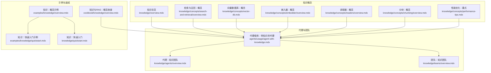
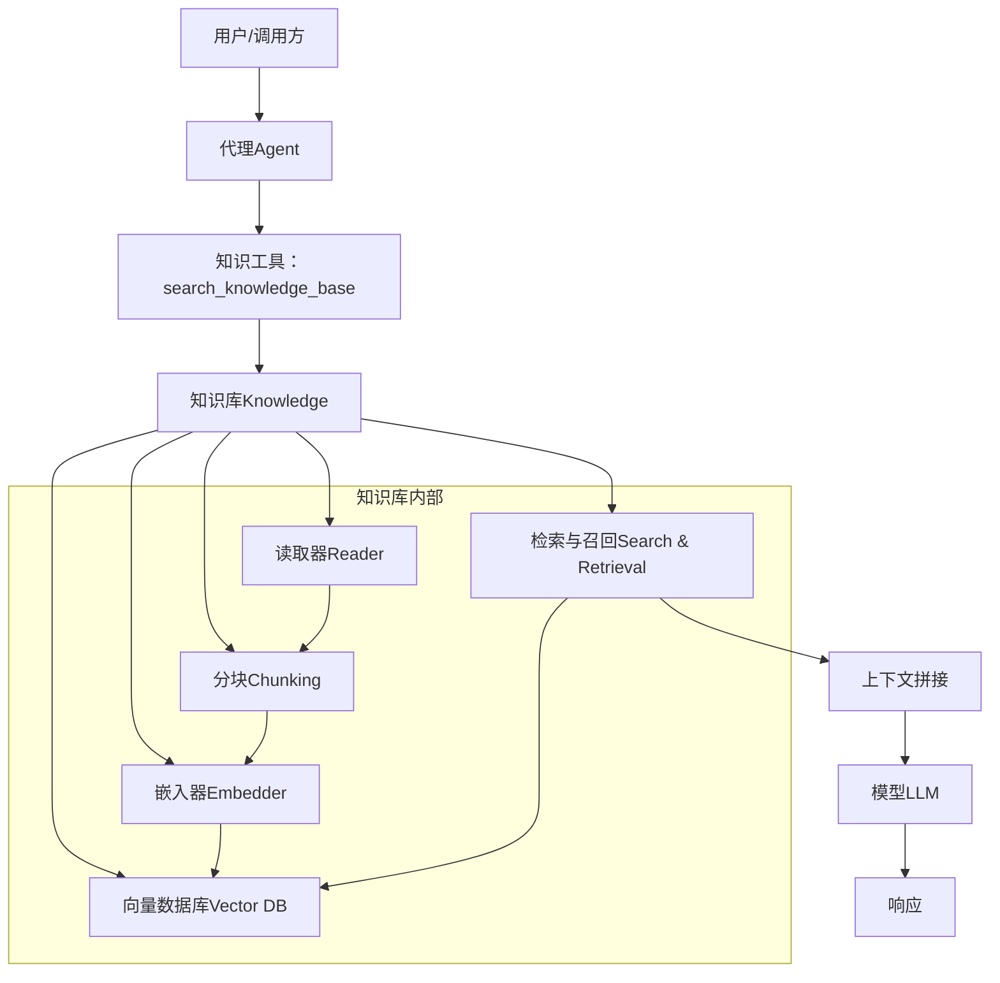
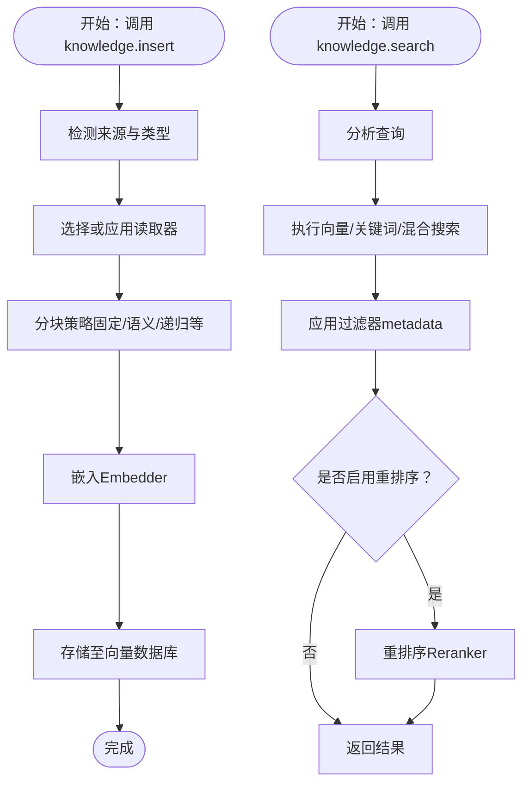
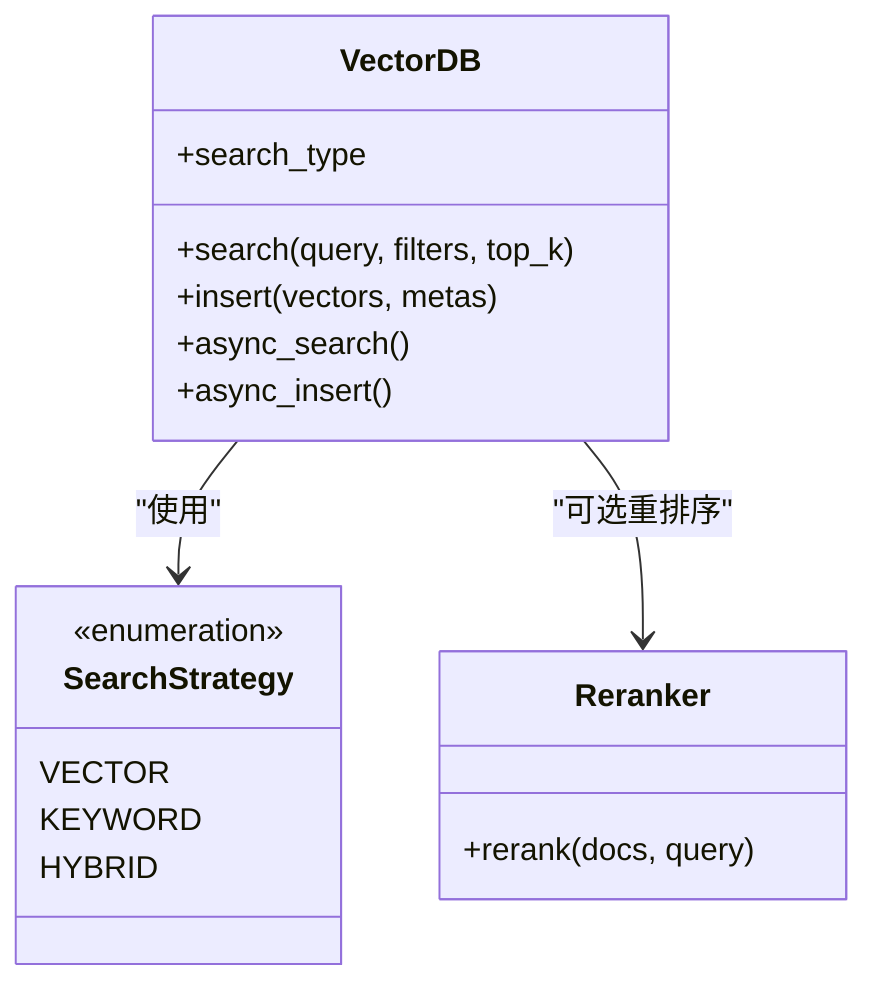
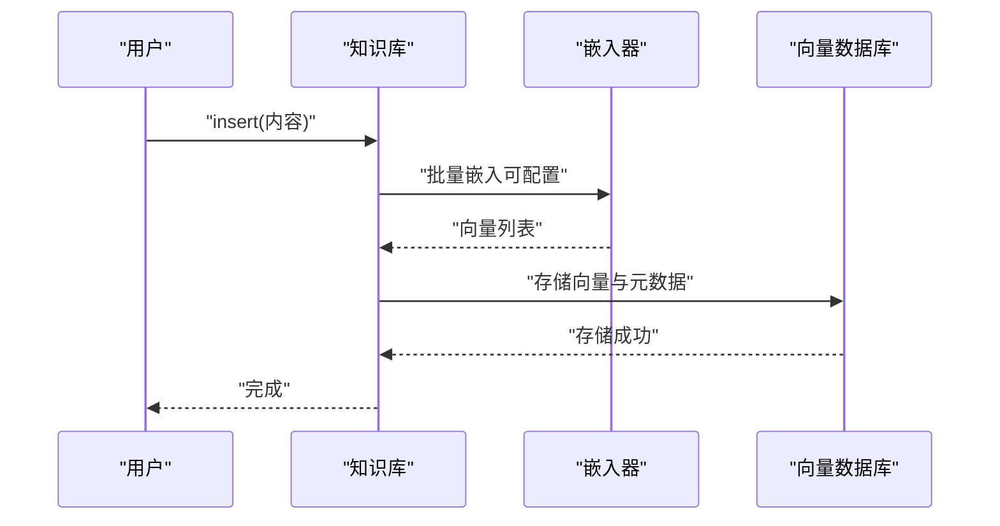
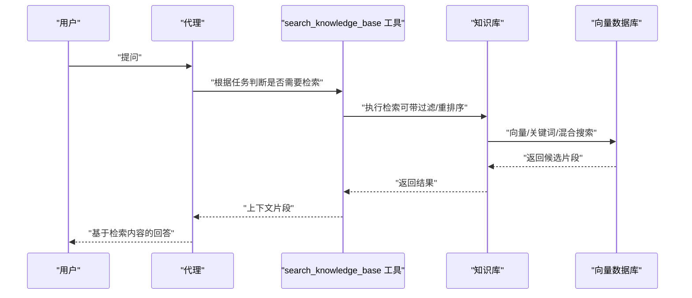
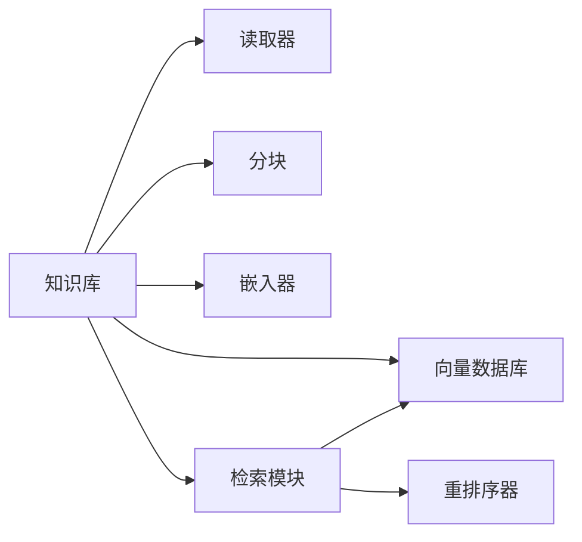

# 代理知识使用

<cite>
**本文引用的文件**
- [知识总览](file://knowledge/overview.mdx)
- [代理使用：带知识的代理](file://agents/usage/agent-with-knowledge.mdx)
- [知识与RAG：概览](file://cookbook/knowledge/overview.mdx)
- [知识：概览](file://knowledge/concepts/overview.mdx)
- [检索与召回：概览](file://knowledge/concepts/search-and-retrieval/overview.mdx)
- [向量数据库：概念](file://knowledge/concepts/vector-db.mdx)
- [性能优化：要点](file://knowledge/concepts/performance-tips.mdx)
- [快速入门：知识](file://knowledge/quickstart.mdx)
- [示例：知识：概览](file://examples/knowledge/overview.mdx)
- [示例：知识：快速入门](file://examples/knowledge/quickstart.mdx)
- [嵌入器：概览](file://knowledge/concepts/embedder/overview.mdx)
- [读取器：概览](file://knowledge/concepts/readers/overview.mdx)
- [分块：概览](file://knowledge/concepts/chunking/overview.mdx)
- [代理：知识（团队）](file://knowledge/agents/overview.mdx)
- [团队：知识（团队）](file://knowledge/teams/overview.mdx)
</cite>

## 目录
1. [简介](#简介)
2. [项目结构](#项目结构)
3. [核心组件](#核心组件)
4. [架构总览](#架构总览)
5. [详细组件分析](#详细组件分析)
6. [依赖关系分析](#依赖关系分析)
7. [性能考虑](#性能考虑)
8. [故障排除指南](#故障排除指南)
9. [结论](#结论)
10. [附录](#附录)

## 简介
本指南面向希望在代理中集成和使用知识系统的开发者与使用者，系统讲解如何通过 Agentic RAG（代理驱动的检索增强生成）与传统 RAG 实现知识检索与上下文注入；涵盖搜索工具配置、自动上下文注入开关、自定义检索器开发；并提供向量数据库与嵌入器配置、内容管理、检索策略对比、性能优化与缓存策略、以及常见问题排查。

## 项目结构
该仓库围绕“知识”与“代理”两条主线组织内容，知识侧包含概念、向量数据库、嵌入器、读取器、分块策略、检索与召回、性能优化等；代理侧包含如何在 Agent/Team 中启用知识检索、上下文注入、自定义检索器等。

图表来源
- [知识总览:1-110](file://knowledge/overview.mdx#L1-L110)
- [检索与召回：概览:1-255](file://knowledge/concepts/search-and-retrieval/overview.mdx#L1-L255)
- [向量数据库：概念:1-117](file://knowledge/concepts/vector-db.mdx#L1-L117)
- [嵌入器：概览:1-140](file://knowledge/concepts/embedder/overview.mdx#L1-L140)
- [读取器：概览:1-180](file://knowledge/concepts/readers/overview.mdx#L1-L180)
- [分块：概览:1-143](file://knowledge/concepts/chunking/overview.mdx#L1-L143)
- [代理使用：带知识的代理:1-92](file://agents/usage/agent-with-knowledge.mdx#L1-L92)
- [代理：知识（团队）:1-305](file://knowledge/agents/overview.mdx#L1-L305)
- [团队：知识（团队）:1-61](file://knowledge/teams/overview.mdx#L1-L61)
- [示例：知识：概览:1-21](file://examples/knowledge/overview.mdx#L1-L21)
- [示例：知识：快速入门:1-50](file://examples/knowledge/quickstart.mdx#L1-L50)
- [知识：快速入门:1-129](file://knowledge/quickstart.mdx#L1-L129)
- [知识与RAG：概览（食谱）:1-129](file://cookbook/knowledge/overview.mdx#L1-L129)

章节来源
- [知识总览:1-110](file://knowledge/overview.mdx#L1-L110)
- [代理使用：带知识的代理:1-92](file://agents/usage/agent-with-knowledge.mdx#L1-L92)
- [知识与RAG：概览（食谱）:1-129](file://cookbook/knowledge/overview.mdx#L1-L129)
- [示例：知识：概览:1-21](file://examples/knowledge/overview.mdx#L1-L21)

## 核心组件
- 知识库（Knowledge）
  - 负责内容读取、分块、嵌入、存储与检索。
  - 支持同步/异步插入与查询，支持过滤、元数据校验、批量操作等。
- 向量数据库（Vector DB）
  - 存储向量嵌入，支持向量/关键词/混合搜索，部分支持重排序（rerank）。
- 嵌入器（Embedder）
  - 将文本转换为向量，支持批量请求、维度控制、多提供商选择。
- 读取器（Reader）
  - 解析多种格式（PDF、CSV、Markdown、JSON、PPTX、网站、YouTube、ArXiv、Wikipedia 等），抽取文本与元数据。
- 分块策略（Chunking）
  - 固定大小、语义分块、递归分块、按文档/Markdown/CSV/代码/自定义等策略。
- 检索与召回（Search & Retrieval）
  - 向量搜索、关键词搜索、混合搜索；支持结果过滤、自定义检索器、重排序、性能优化。
- 代理与团队（Agent/Team）
  - Agentic RAG（由代理决定何时检索）与传统 RAG（始终注入上下文）；可配置自动上下文注入、自定义检索器函数。

章节来源
- [知识总览:29-47](file://knowledge/overview.mdx#L29-L47)
- [检索与召回：概览:44-130](file://knowledge/concepts/search-and-retrieval/overview.mdx#L44-L130)
- [向量数据库：概念:7-21](file://knowledge/concepts/vector-db.mdx#L7-L21)
- [嵌入器：概览:8-30](file://knowledge/concepts/embedder/overview.mdx#L8-L30)
- [读取器：概览:7-31](file://knowledge/concepts/readers/overview.mdx#L7-L31)
- [分块：概览:7-28](file://knowledge/concepts/chunking/overview.mdx#L7-L28)
- [代理：知识（团队）:27-84](file://knowledge/agents/overview.mdx#L27-L84)

## 架构总览
下图展示了从“内容入库”到“代理检索与响应”的端到端流程，以及知识库内部的三大组件协同工作方式。

图表来源
- [知识总览:29-47](file://knowledge/overview.mdx#L29-L47)
- [检索与召回：概览:27-42](file://knowledge/concepts/search-and-retrieval/overview.mdx#L27-L42)
- [代理：知识（团队）:27-84](file://knowledge/agents/overview.mdx#L27-L84)

## 详细组件分析

### 组件一：知识库（Knowledge）与内容管理
- 内容来源
  - 支持从 URL、本地路径、原始文本等多种来源加载内容。
  - 自动识别文件类型并选择合适的读取器；也可显式指定读取器与分块策略。
- 插入与更新
  - 提供同步与异步插入接口；支持跳过已存在内容、批量插入、包含/排除模式。
  - 支持元数据写入与校验，便于后续检索过滤。
- 查询与检索
  - 支持向量/关键词/混合搜索；可设置最大返回条数、过滤条件、重排序器。
  - 支持自定义检索器函数以完全接管检索逻辑。
- 上下文注入
  - 传统 RAG：始终将检索结果注入上下文。
  - Agentic RAG：由代理根据需要动态检索，更灵活高效。

图表来源
- [知识总览:19-25](file://knowledge/overview.mdx#L19-L25)
- [检索与召回：概览:10-25](file://knowledge/concepts/search-and-retrieval/overview.mdx#L10-L25)
- [读取器：概览:51-64](file://knowledge/concepts/readers/overview.mdx#L51-L64)
- [分块：概览:62-80](file://knowledge/concepts/chunking/overview.mdx#L62-L80)
- [嵌入器：概览:43-59](file://knowledge/concepts/embedder/overview.mdx#L43-L59)

章节来源
- [知识总览:19-25](file://knowledge/overview.mdx#L19-L25)
- [知识与RAG：概览（食谱）:46-92](file://cookbook/knowledge/overview.mdx#L46-L92)
- [示例：知识：快速入门:1-50](file://examples/knowledge/quickstart.mdx#L1-L50)
- [知识：快速入门:11-42](file://knowledge/quickstart.mdx#L11-L42)

### 组件二：向量数据库与检索策略
- 搜索类型
  - 向量搜索：基于语义相似度匹配，适合概念性问题。
  - 关键词搜索：基于精确词/短语匹配，适合特定术语、产品名、错误码。
  - 混合搜索：结合向量与关键词，通常为生产首选；可选重排序器进一步提升排序质量。
- 过滤与范围限定
  - 支持按元数据过滤；可对复杂条件进行校验，避免无效键导致的性能问题。
- 异步能力
  - 部分向量数据库支持异步插入与查询，适合高并发与大规模数据场景。

图表来源
- [检索与召回：概览:44-94](file://knowledge/concepts/search-and-retrieval/overview.mdx#L44-L94)
- [向量数据库：概念:23-31](file://knowledge/concepts/vector-db.mdx#L23-L31)

章节来源
- [检索与召回：概览:44-94](file://knowledge/concepts/search-and-retrieval/overview.mdx#L44-L94)
- [向量数据库：概念:23-31](file://knowledge/concepts/vector-db.mdx#L23-L31)

### 组件三：嵌入器与内容结构化
- 嵌入器
  - 默认使用通用嵌入器，支持批量请求、维度调整；切换模型需重新嵌入。
  - 多提供商选择（OpenAI、Gemini、Cohere、Voyage AI、Mistral、Ollama、FastEmbed、HuggingFace、AWS Bedrock、Azure OpenAI、Fireworks、Together、Jina、Nebius）。
- 内容结构
  - 建议良好的标题层级、自然术语、摘要与描述性文件名，有助于检索质量。

图表来源
- [嵌入器：概览:32-74](file://knowledge/concepts/embedder/overview.mdx#L32-L74)
- [知识总览:35-37](file://knowledge/overview.mdx#L35-L37)

章节来源
- [嵌入器：概览:32-74](file://knowledge/concepts/embedder/overview.mdx#L32-L74)
- [检索与召回：概览:175-224](file://knowledge/concepts/search-and-retrieval/overview.mdx#L175-L224)

### 组件四：代理与团队中的知识使用
- Agentic RAG 与传统 RAG
  - Agentic RAG：代理自主决定何时检索、是否需要重排查询、是否多次检索并合并结果。
  - 传统 RAG：始终将检索结果注入上下文。
- 自动上下文注入
  - 可通过参数开启“自动将知识加入上下文”，适用于无需代理决策的场景。
- 自定义检索器
  - 传入自定义检索器函数，完全掌控检索行为（支持异步）。
- 团队级共享
  - 多个代理可共享同一知识库；可通过隔离向量搜索范围（如按租户/团队）避免互相干扰。

图表来源
- [代理：知识（团队）:85-111](file://knowledge/agents/overview.mdx#L85-L111)
- [检索与召回：概览:95-130](file://knowledge/concepts/search-and-retrieval/overview.mdx#L95-L130)
- [团队：知识（团队）:10-10](file://knowledge/teams/overview.mdx#L10-L10)

章节来源
- [代理：知识（团队）:85-111](file://knowledge/agents/overview.mdx#L85-L111)
- [代理使用：带知识的代理:75-80](file://agents/usage/agent-with-knowledge.mdx#L75-L80)
- [团队：知识（团队）:10-10](file://knowledge/teams/overview.mdx#L10-L10)

## 依赖关系分析
- 组件耦合
  - 知识库对读取器、分块、嵌入器、向量数据库存在直接依赖；检索模块依赖向量数据库与可选重排序器。
- 外部依赖
  - 向量数据库与嵌入器提供商（如 OpenAI、Gemini、PgVector、LanceDB 等）。
- 接口契约
  - 检索器函数签名统一，便于替换与扩展；异步插入/查询接口保证在高并发下的稳定性。

图表来源
- [知识总览:29-47](file://knowledge/overview.mdx#L29-L47)
- [检索与召回：概览:156-173](file://knowledge/concepts/search-and-retrieval/overview.mdx#L156-L173)

章节来源
- [知识总览:29-47](file://knowledge/overview.mdx#L29-L47)
- [检索与召回：概览:156-173](file://knowledge/concepts/search-and-retrieval/overview.mdx#L156-L173)

## 性能考虑
- 数据库选择与规模
  - 开发/测试：LanceDB/ChromaDB；生产：PgVector；托管服务：Pinecone/Weaviate/Qdrant/Milvus；按规模与需求选择。
- 加载与处理
  - 使用“跳过已存在”与“包含/排除模式”减少重复处理；批量/异步插入提高吞吐。
- 检索优化
  - 先过滤再搜索；混合搜索 + 重排序；合理设置返回条数；调试时打印前若干片段验证质量。
- 内容结构
  - 清晰的标题、术语、摘要与描述性文件名；分块大小适配内容类型与查询粒度。
- 监控与诊断
  - 记录检索耗时、失败内容状态，定位瓶颈与异常。

章节来源
- [性能优化：要点:9-226](file://knowledge/concepts/performance-tips.mdx#L9-L226)
- [向量数据库：概念:91-110](file://knowledge/concepts/vector-db.mdx#L91-L110)
- [分块：概览:118-126](file://knowledge/concepts/chunking/overview.mdx#L118-L126)

## 故障排除指南
- 结果不相关
  - 调整分块策略（语义分块更佳）、增大返回条数、增加元数据过滤；检查嵌入维度与向量数据库期望一致。
- 内容加载慢
  - 使用“跳过已存在”、固定大小分块、批量/异步处理；按目录/扩展名筛选。
- 内存占用高
  - 分批处理、减小分块大小、使用包含/排除模式、清理过期内容。
- 搜索耗时长
  - 使用混合搜索与重排序；先过滤再搜索；监控失败内容并修复。
- 自定义检索器未生效
  - 确认函数签名与异步支持；确保在代理中正确传入；检查日志与异常。

章节来源
- [性能优化：要点:108-209](file://knowledge/concepts/performance-tips.mdx#L108-L209)
- [检索与召回：概览:156-173](file://knowledge/concepts/search-and-retrieval/overview.mdx#L156-L173)

## 结论
通过将知识库与代理/团队深度集成，Agno 提供了灵活高效的“代理驱动检索增强生成”能力。结合多种向量数据库、嵌入器与读取器/分块策略，可在不同场景下实现高质量、低延迟的知识检索与上下文注入。建议优先采用混合搜索与重排序，配合合理的分块与元数据设计，并通过异步与批量处理提升吞吐与稳定性。

## 附录

### 快速开始：在代理中启用知识
- 创建知识库并选择向量数据库与嵌入器
- 插入内容（URL/本地路径/文本）
- 创建代理并启用知识检索（默认 Agentic RAG）
- 运行并观察代理如何按需检索与回答

章节来源
- [知识：快速入门:11-42](file://knowledge/quickstart.mdx#L11-L42)
- [示例：知识：快速入门:1-36](file://examples/knowledge/quickstart.mdx#L1-L36)
- [代理使用：带知识的代理:11-42](file://agents/usage/agent-with-knowledge.mdx#L11-L42)

### 传统 RAG 与 Agentic RAG 对比
- 传统 RAG：始终检索并注入上下文，适合简单场景。
- Agentic RAG：由代理自主决策，支持查询重写、多次检索与结果合并，适合复杂任务。

章节来源
- [检索与召回：概览:95-130](file://knowledge/concepts/search-and-retrieval/overview.mdx#L95-L130)
- [代理：知识（团队）:82-84](file://knowledge/agents/overview.mdx#L82-L84)

### 自定义检索器开发要点
- 函数签名与异步支持
- 在检索前可进行查询扩展/改写
- 返回标准化的结果字典列表
- 在代理中通过参数注入并启用知识检索

章节来源
- [检索与召回：概览:156-173](file://knowledge/concepts/search-and-retrieval/overview.mdx#L156-L173)
- [代理：知识（团队）:85-111](file://knowledge/agents/overview.mdx#L85-L111)