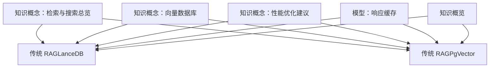
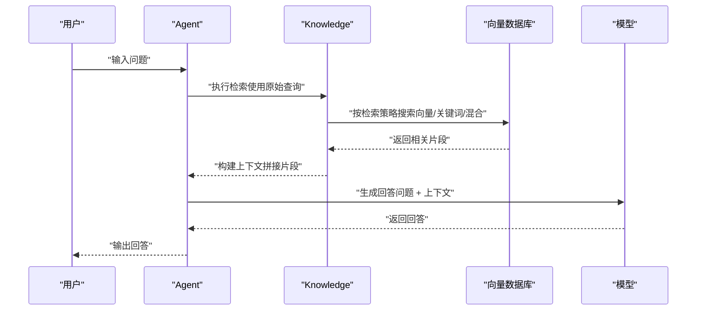
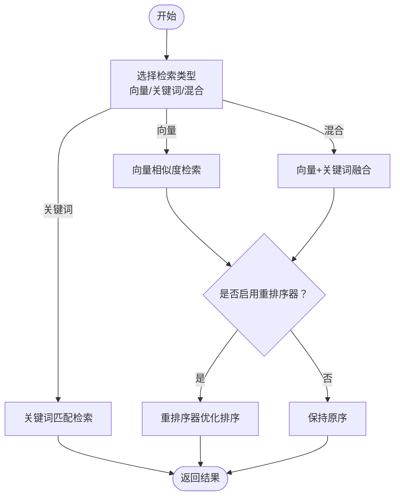
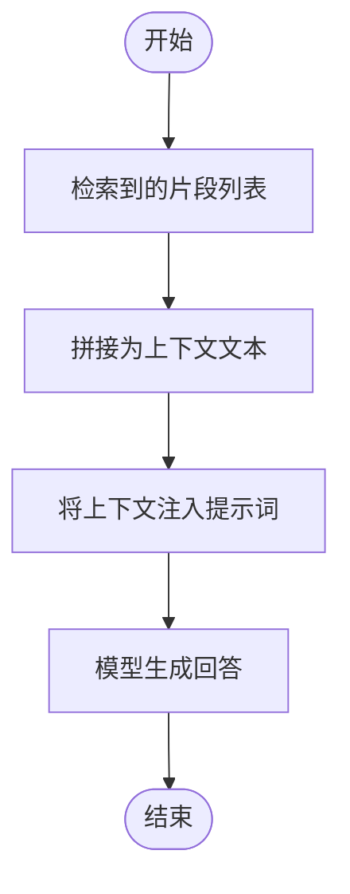
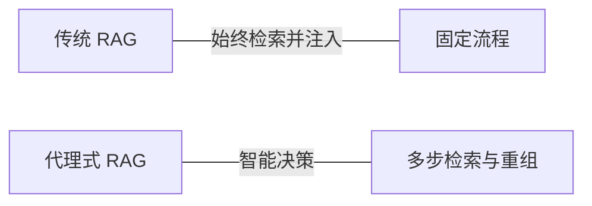
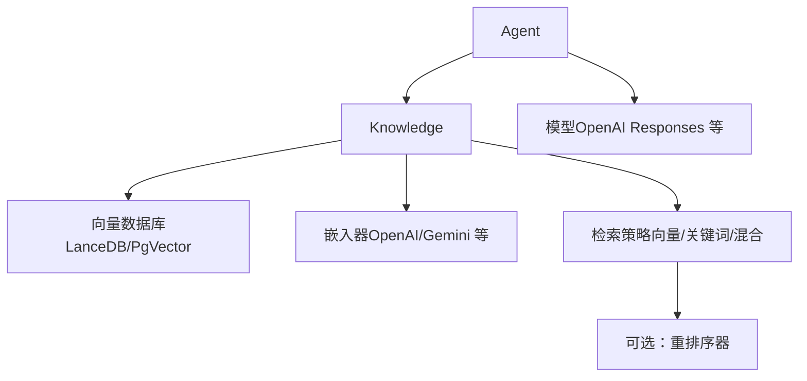

# 传统 RAG 方法

<cite>
**本文引用的文件**
- [传统 RAG（LanceDB）](file://knowledge/agents/traditional-rag-lancedb.mdx)
- [传统 RAG（PgVector）](file://knowledge/agents/traditional-rag-pgvector.mdx)
- [知识概念：检索与搜索总览](file://knowledge/concepts/search-and-retrieval/overview.mdx)
- [知识概念：向量数据库](file://knowledge/concepts/vector-db.mdx)
- [知识概念：性能优化建议](file://knowledge/concepts/performance-tips.mdx)
- [模型：响应缓存](file://models/cache-response.mdx)
- [知识概览](file://knowledge/overview.mdx)
</cite>

## 目录
1. [简介](#简介)
2. [项目结构](#项目结构)
3. [核心组件](#核心组件)
4. [架构总览](#架构总览)
5. [详细组件分析](#详细组件分析)
6. [依赖关系分析](#依赖关系分析)
7. [性能考量](#性能考量)
8. [故障排查指南](#故障排查指南)
9. [结论](#结论)
10. [附录](#附录)

## 简介
本指南面向希望采用“传统 RAG”（也称“静态注入式 RAG”）的用户，系统讲解其工作原理、配置要点、检索策略与性能优化，并对比“代理式 RAG”。传统 RAG 的核心特征是：始终以用户的原始查询进行检索，并将检索到的相关片段直接注入到提示词中生成最终回答；而代理式 RAG 则由智能体自主决定是否检索、何时检索以及如何重组查询。

本指南覆盖以下主题：
- 传统 RAG 的三阶段流程：预检索、上下文构建、响应生成
- 向量数据库选型与嵌入器配置（LanceDB、PgVector 等）
- 检索策略（向量/关键词/混合）与重排序器使用
- 缓存策略与性能调优
- 部署与最佳实践

## 项目结构
与传统 RAG 相关的知识与示例主要分布在以下位置：
- 示例与用法：knowledge/agents/traditional-rag-*.mdx
- 检索与搜索策略：knowledge/concepts/search-and-retrieval/overview.mdx
- 向量数据库与选型：knowledge/concepts/vector-db.mdx
- 性能优化与缓存：knowledge/concepts/performance-tips.mdx、models/cache-response.mdx
- 知识体系概览：knowledge/overview.mdx

图表来源
- [知识概念：检索与搜索总览:1-255](file://knowledge/concepts/search-and-retrieval/overview.mdx#L1-L255)
- [传统 RAG（LanceDB）:1-74](file://knowledge/agents/traditional-rag-lancedb.mdx#L1-L74)
- [传统 RAG（PgVector）:1-74](file://knowledge/agents/traditional-rag-pgvector.mdx#L1-L74)
- [知识概念：向量数据库:91-117](file://knowledge/concepts/vector-db.mdx#L91-L117)
- [知识概念：性能优化建议:1-57](file://knowledge/concepts/performance-tips.mdx#L1-L57)
- [模型：响应缓存:20-53](file://models/cache-response.mdx#L20-L53)
- [知识概览:37-64](file://knowledge/overview.mdx#L37-L64)

章节来源
- [知识概念：检索与搜索总览:1-255](file://knowledge/concepts/search-and-retrieval/overview.mdx#L1-L255)
- [传统 RAG（LanceDB）:1-74](file://knowledge/agents/traditional-rag-lancedb.mdx#L1-L74)
- [传统 RAG（PgVector）:1-74](file://knowledge/agents/traditional-rag-pgvector.mdx#L1-L74)
- [知识概念：向量数据库:91-117](file://knowledge/concepts/vector-db.mdx#L91-L117)
- [知识概念：性能优化建议:1-57](file://knowledge/concepts/performance-tips.mdx#L1-L57)
- [模型：响应缓存:20-53](file://models/cache-response.mdx#L20-L53)
- [知识概览:37-64](file://knowledge/overview.mdx#L37-L64)

## 核心组件
- 知识库（Knowledge）：统一管理内容读取、分块、嵌入与存储，支持检索与过滤。
- 向量数据库适配器（如 LanceDB、PgVector）：负责向量索引的持久化与检索。
- 嵌入器（Embedder）：将文本转换为向量，支撑向量检索。
- 模型（Model）：用于根据用户问题与上下文生成最终回答。
- 检索策略（SearchType）：向量/关键词/混合，可结合重排序器提升结果顺序质量。
- 过滤器（filters）：基于元数据缩小检索范围，提高相关性与效率。

章节来源
- [知识概念：检索与搜索总览:15-25](file://knowledge/concepts/search-and-retrieval/overview.mdx#L15-L25)
- [知识概念：向量数据库:91-117](file://knowledge/concepts/vector-db.mdx#L91-L117)

## 架构总览
传统 RAG 的端到端流程如下：

图表来源
- [知识概念：检索与搜索总览:10-42](file://knowledge/concepts/search-and-retrieval/overview.mdx#L10-L42)
- [知识概览:37-40](file://knowledge/overview.mdx#L37-L40)

## 详细组件分析

### 组件一：检索策略与重排序
- 向量搜索：基于语义相似度，适合概念性问题。
- 关键词搜索：基于精确词匹配，适合术语、编号、技术标识符。
- 混合搜索：向量与关键词结合，通常为生产首选；可选重排序器进一步优化排序。

图表来源
- [知识概念：检索与搜索总览:46-93](file://knowledge/concepts/search-and-retrieval/overview.mdx#L46-L93)

章节来源
- [知识概念：检索与搜索总览:46-93](file://knowledge/concepts/search-and-retrieval/overview.mdx#L46-L93)

### 组件二：上下文构建与响应生成
- 上下文构建：将检索到的片段按固定格式拼接，作为额外上下文注入提示词。
- 响应生成：模型在问题与上下文共同作用下生成最终回答。

图表来源
- [知识概念：检索与搜索总览:101-109](file://knowledge/concepts/search-and-retrieval/overview.mdx#L101-L109)

章节来源
- [知识概念：检索与搜索总览:101-109](file://knowledge/concepts/search-and-retrieval/overview.mdx#L101-L109)

### 组件三：传统 RAG 与代理式 RAG 的差异
- 传统 RAG：始终以原始查询检索并注入上下文。
- 代理式 RAG：由智能体自主决定何时检索、是否需要重组查询、是否多次检索并合并结果。

图表来源
- [知识概念：检索与搜索总览:95-123](file://knowledge/concepts/search-and-retrieval/overview.mdx#L95-L123)

章节来源
- [知识概念：检索与搜索总览:95-123](file://knowledge/concepts/search-and-retrieval/overview.mdx#L95-L123)

### 组件四：向量数据库与嵌入器配置
- 向量数据库选型建议：
  - 开发/测试：LanceDB、ChromaDB（零运维）
  - 生产：PgVector（已有 PostgreSQL 场景）
  - 托管服务：Pinecone、Weaviate Cloud
  - 大规模高吞吐：Qdrant、Milvus
- 嵌入器选择：
  - 通用：OpenAI、Gemini
  - 领域专用：Cohere、Mistral
  - 本地运行：Sentence Transformers（HuggingFace）

章节来源
- [知识概念：向量数据库:91-117](file://knowledge/concepts/vector-db.mdx#L91-L117)
- [知识概念：检索与搜索总览:188-198](file://knowledge/concepts/search-and-retrieval/overview.mdx#L188-L198)

### 组件五：检索质量优化技巧
- 分块策略：根据内容类型选择语义/固定大小/Markdown/CSV 行等策略；合理设置重叠长度。
- 嵌入模型：依据内容领域与语言选择合适模型。
- 元数据：提供明确、一致且可过滤的元信息。
- 内容结构：清晰标题、自然术语、摘要与命名规范。
- 测试验证：用真实问题集评估检索效果。

章节来源
- [知识概念：检索与搜索总览:175-238](file://knowledge/concepts/search-and-retrieval/overview.mdx#L175-L238)

### 组件六：缓存策略与性能调优
- 向量数据库异步支持：在高并发场景使用异步插入与搜索（如 ainsert、asearch）。
- 跳过已处理文件：批量入库时启用跳过已存在文件，减少重复处理。
- 元数据过滤：在搜索前缩小范围，降低无效匹配。
- 响应缓存：在开发与测试阶段减少 API 调用与等待时间；不建议在生产动态内容场景使用。

章节来源
- [知识概念：向量数据库:108-117](file://knowledge/concepts/vector-db.mdx#L108-L117)
- [知识概念：性能优化建议:32-57](file://knowledge/concepts/performance-tips.mdx#L32-L57)
- [模型：响应缓存:20-53](file://models/cache-response.mdx#L20-L53)

### 组件七：传统 RAG 的配置与示例路径
- 使用 LanceDB 的传统 RAG 示例路径：
  - [传统 RAG（LanceDB）:9-48](file://knowledge/agents/traditional-rag-lancedb.mdx#L9-L48)
- 使用 PgVector 的传统 RAG 示例路径：
  - [传统 RAG（PgVector）:9-44](file://knowledge/agents/traditional-rag-pgvector.mdx#L9-L44)

章节来源
- [传统 RAG（LanceDB）:9-48](file://knowledge/agents/traditional-rag-lancedb.mdx#L9-L48)
- [传统 RAG（PgVector）:9-44](file://knowledge/agents/traditional-rag-pgvector.mdx#L9-L44)

## 依赖关系分析
传统 RAG 的关键依赖关系如下：

图表来源
- [传统 RAG（LanceDB）:15-44](file://knowledge/agents/traditional-rag-lancedb.mdx#L15-L44)
- [传统 RAG（PgVector）:10-43](file://knowledge/agents/traditional-rag-pgvector.mdx#L10-L43)
- [知识概念：检索与搜索总览:46-93](file://knowledge/concepts/search-and-retrieval/overview.mdx#L46-L93)

章节来源
- [传统 RAG（LanceDB）:15-44](file://knowledge/agents/traditional-rag-lancedb.mdx#L15-L44)
- [传统 RAG（PgVector）:10-43](file://knowledge/agents/traditional-rag-pgvector.mdx#L10-L43)
- [知识概念：检索与搜索总览:46-93](file://knowledge/concepts/search-and-retrieval/overview.mdx#L46-L93)

## 性能考量
- 数据库选择：开发/测试优先 LanceDB/ChromaDB；生产优先 PgVector；托管/高吞吐优先 Pinecone/Qdrant/Milvus。
- 异步操作：在高并发或长链路场景使用异步插入与搜索。
- 批量入库：启用跳过已存在文件与文件过滤，显著减少重复处理。
- 搜索前过滤：通过元数据缩小搜索范围，提升命中率与速度。
- 响应缓存：仅限开发/测试/离线场景，避免在生产对动态内容使用。

章节来源
- [知识概念：向量数据库:91-117](file://knowledge/concepts/vector-db.mdx#L91-L117)
- [知识概念：性能优化建议:11-57](file://knowledge/concepts/performance-tips.mdx#L11-L57)
- [模型：响应缓存:20-53](file://models/cache-response.mdx#L20-L53)

## 故障排查指南
- 检索结果不相关
  - 检查检索策略是否合适（向量/关键词/混合），必要时启用重排序器。
  - 优化分块策略与嵌入模型，确保内容结构清晰、术语自然出现。
  - 为文档添加明确且可过滤的元数据。
- 检索速度慢
  - 使用异步插入/搜索；批量入库时启用跳过已存在文件与文件过滤。
  - 在搜索前应用元数据过滤，缩小搜索空间。
- 响应不稳定或成本过高
  - 在开发/测试阶段启用响应缓存；生产环境避免缓存动态内容。
- 数据库连接问题
  - 确认连接字符串与扩展（如 PgVector）正确配置；检查网络与权限。

章节来源
- [知识概念：检索与搜索总览:175-238](file://knowledge/concepts/search-and-retrieval/overview.mdx#L175-L238)
- [知识概念：性能优化建议:32-57](file://knowledge/concepts/performance-tips.mdx#L32-L57)
- [模型：响应缓存:20-53](file://models/cache-response.mdx#L20-L53)

## 结论
传统 RAG 以“固定注入”的方式简化了检索与生成流程，适合需要稳定、可预测响应的场景。通过合理的向量数据库与嵌入器选择、检索策略与重排序器配置、以及缓存与性能优化手段，可以在保证质量的同时获得良好的吞吐与延迟表现。对于需要智能决策、多轮检索与查询重组的复杂任务，可考虑代理式 RAG；但在大多数常规问答与知识问答场景中，传统 RAG 仍具有显著优势。

## 附录
- 传统 RAG 示例路径
  - [传统 RAG（LanceDB）:9-48](file://knowledge/agents/traditional-rag-lancedb.mdx#L9-L48)
  - [传统 RAG（PgVector）:9-44](file://knowledge/agents/traditional-rag-pgvector.mdx#L9-L44)
- 相关概念与参考
  - [知识概念：检索与搜索总览:1-255](file://knowledge/concepts/search-and-retrieval/overview.mdx#L1-L255)
  - [知识概念：向量数据库:91-117](file://knowledge/concepts/vector-db.mdx#L91-L117)
  - [知识概念：性能优化建议:1-57](file://knowledge/concepts/performance-tips.mdx#L1-L57)
  - [模型：响应缓存:20-53](file://models/cache-response.mdx#L20-L53)
  - [知识概览:37-64](file://knowledge/overview.mdx#L37-L64)