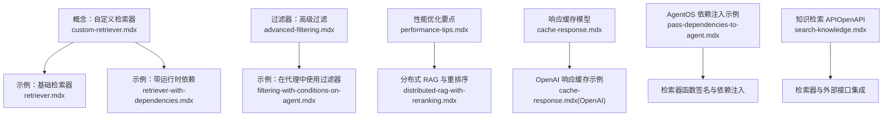
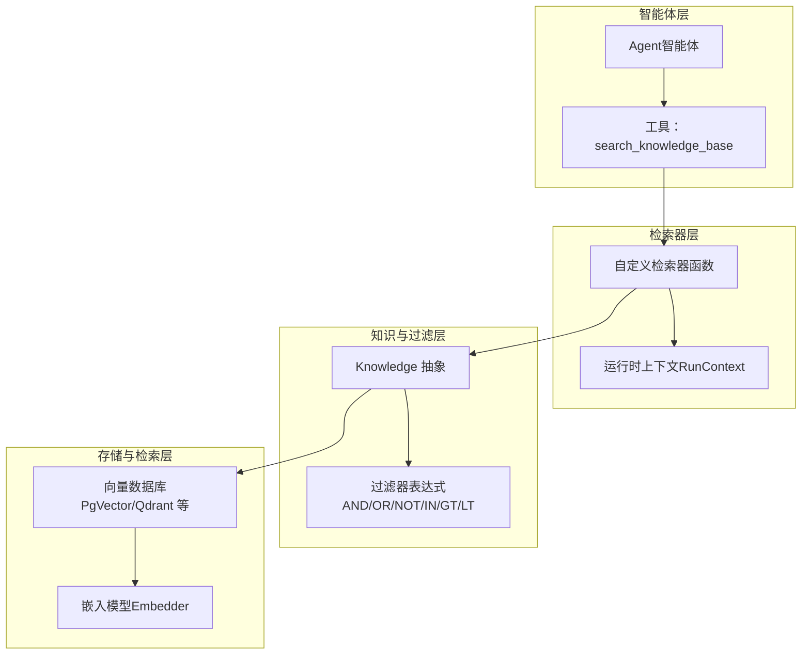
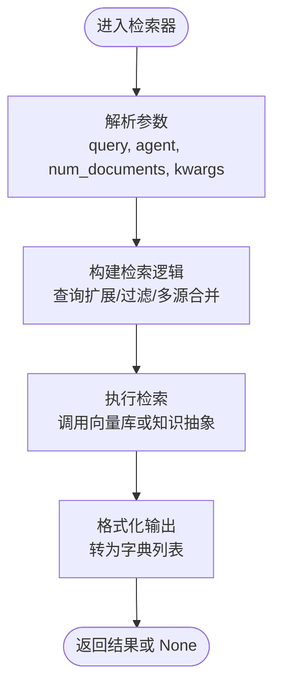
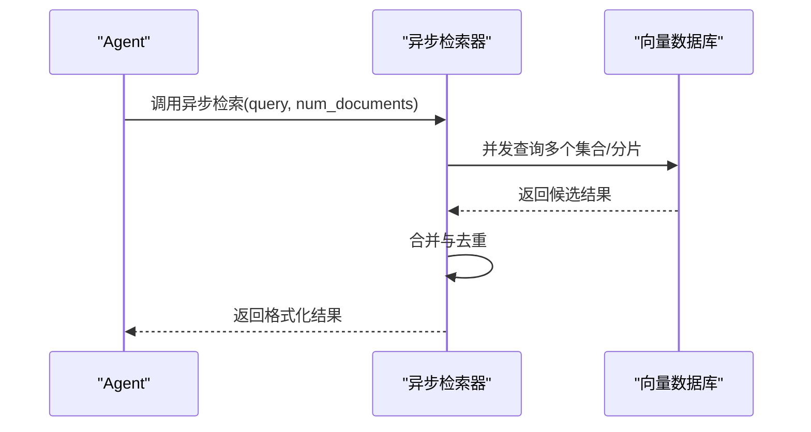
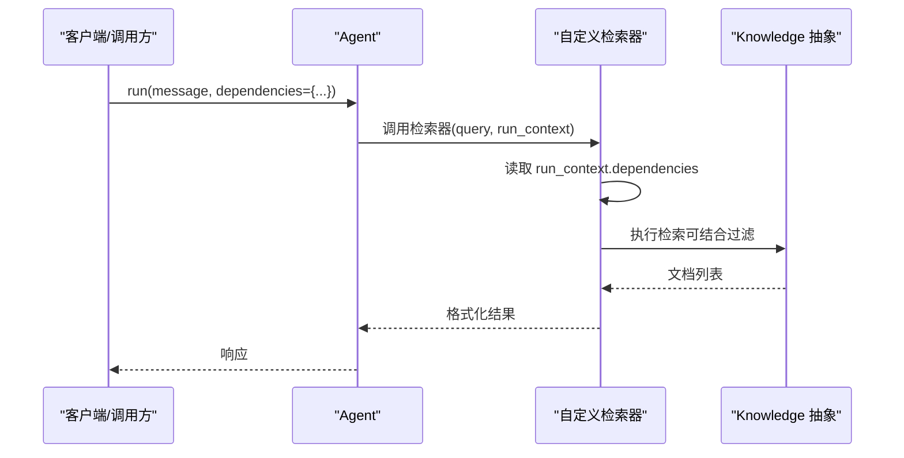
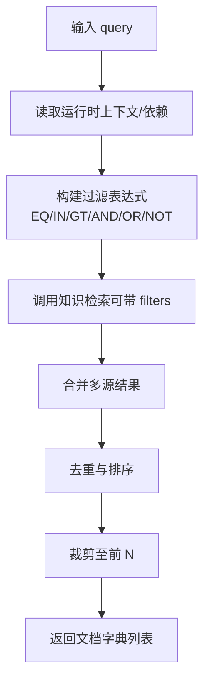
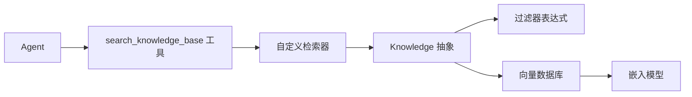

# 自定义检索器开发

<cite>
**本文引用的文件**
- [自定义检索器（概述）](file://knowledge/concepts/search-and-retrieval/custom-retriever.mdx)
- [自定义检索器示例：基础版](file://examples/knowledge/custom-retriever/retriever.mdx)
- [自定义检索器示例：带运行时依赖](file://examples/knowledge/custom-retriever/retriever-with-dependencies.mdx)
- [知识过滤器：高级过滤](file://knowledge/concepts/filters/advanced-filtering.mdx)
- [知识过滤器：在代理中使用过滤器](file://examples/knowledge/filters/filtering-with-conditions-on-agent.mdx)
- [知识性能优化要点](file://knowledge/concepts/performance-tips.mdx)
- [响应缓存（模型响应缓存）](file://models/cache-response.mdx)
- [响应缓存（OpenAI 响应缓存示例）](file://models/providers/native/openai/completion/usage/cache-response.mdx)
- [分布式 RAG：带重排序](file://knowledge/teams/distributed-rag-with-reranking.mdx)
- [AgentOS 定制：向代理传递依赖](file://examples/agent-os/customize/pass-dependencies-to-agent.mdx)
- [知识检索 API（OpenAPI）](file://reference-api/schema/knowledge/search-knowledge.mdx)
</cite>

## 目录
1. [简介](#简介)
2. [项目结构](#项目结构)
3. [核心组件](#核心组件)
4. [架构总览](#架构总览)
5. [详细组件分析](#详细组件分析)
6. [依赖关系分析](#依赖关系分析)
7. [性能考量](#性能考量)
8. [故障排查指南](#故障排查指南)
9. [结论](#结论)
10. [附录](#附录)

## 简介
本技术指南面向需要为智能体系统开发“自定义检索器”的工程师与架构师。文档将系统讲解如何定义检索器函数签名、处理参数与返回值、管理检索器生命周期、实现异步检索器与依赖注入，并通过完整示例从“简单检索器”逐步过渡到“复杂业务逻辑检索器”。同时，我们将说明检索器与“知识过滤器”的集成方式（条件过滤与动态查询构建）、性能优化策略（缓存、混合检索、重排序等）、错误处理机制、测试与调试方法，并提供与内置检索方案的对比分析。

## 项目结构
围绕“自定义检索器”的知识与示例主要分布在以下位置：
- 概念与用法：knowledge/concepts/search-and-retrieval/custom-retriever.mdx
- 示例：examples/knowledge/custom-retriever/*
- 过滤器与条件过滤：knowledge/concepts/filters/* 与 examples/knowledge/filters/*
- 性能优化：knowledge/concepts/performance-tips.mdx
- 缓存与响应缓存：models/cache-response.mdx 与 models/providers/native/openai/completion/usage/cache-response.mdx
- 分布式 RAG 与重排序：knowledge/teams/distributed-rag-with-reranking.mdx
- 依赖注入与运行时上下文：examples/agent-os/customize/pass-dependencies-to-agent.mdx
- 检索 API（OpenAPI）：reference-api/schema/knowledge/search-knowledge.mdx

**图表来源**
- [自定义检索器（概述）:1-167](file://knowledge/concepts/search-and-retrieval/custom-retriever.mdx#L1-L167)
- [自定义检索器示例：基础版:1-104](file://examples/knowledge/custom-retriever/retriever.mdx#L1-L104)
- [自定义检索器示例：带运行时依赖:1-141](file://examples/knowledge/custom-retriever/retriever-with-dependencies.mdx#L1-L141)
- [知识过滤器：高级过滤:37-358](file://knowledge/concepts/filters/advanced-filtering.mdx#L37-L358)
- [知识过滤器：在代理中使用过滤器:92-133](file://examples/knowledge/filters/filtering-with-conditions-on-agent.mdx#L92-L133)
- [知识性能优化要点:1-226](file://knowledge/concepts/performance-tips.mdx#L1-L226)
- [分布式 RAG：带重排序:59-89](file://knowledge/teams/distributed-rag-with-reranking.mdx#L59-L89)
- [响应缓存（模型响应缓存）:20-53](file://models/cache-response.mdx#L20-L53)
- [响应缓存（OpenAI 响应缓存示例）:1-52](file://models/providers/native/openai/completion/usage/cache-response.mdx#L1-L52)
- [AgentOS 定制：向代理传递依赖:41-64](file://examples/agent-os/customize/pass-dependencies-to-agent.mdx#L41-L64)
- [知识检索 API（OpenAPI）:1-3](file://reference-api/schema/knowledge/search-knowledge.mdx#L1-L3)

**章节来源**
- [自定义检索器（概述）:1-167](file://knowledge/concepts/search-and-retrieval/custom-retriever.mdx#L1-L167)
- [自定义检索器示例：基础版:1-104](file://examples/knowledge/custom-retriever/retriever.mdx#L1-L104)
- [自定义检索器示例：带运行时依赖:1-141](file://examples/knowledge/custom-retriever/retriever-with-dependencies.mdx#L1-L141)
- [知识过滤器：高级过滤:37-358](file://knowledge/concepts/filters/advanced-filtering.mdx#L37-L358)
- [知识过滤器：在代理中使用过滤器:92-133](file://examples/knowledge/filters/filtering-with-conditions-on-agent.mdx#L92-L133)
- [知识性能优化要点:1-226](file://knowledge/concepts/performance-tips.mdx#L1-L226)
- [分布式 RAG：带重排序:59-89](file://knowledge/teams/distributed-rag-with-reranking.mdx#L59-L89)
- [响应缓存（模型响应缓存）:20-53](file://models/cache-response.mdx#L20-L53)
- [响应缓存（OpenAI 响应缓存示例）:1-52](file://models/providers/native/openai/completion/usage/cache-response.mdx#L1-L52)
- [AgentOS 定制：向代理传递依赖:41-64](file://examples/agent-os/customize/pass-dependencies-to-agent.mdx#L41-L64)
- [知识检索 API（OpenAPI）:1-3](file://reference-api/schema/knowledge/search-knowledge.mdx#L1-L3)

## 核心组件
- 自定义检索器函数：由智能体调用，替代默认的知识检索流程，返回文档字典列表或 None。
- 运行时依赖注入：通过 RunContext 将用户角色、偏好等上下文信息注入检索器，实现个性化检索。
- 知识过滤器：基于元数据的条件过滤与组合逻辑，支持 IN/GT/LT/AND/OR/NOT 等操作符。
- 向量数据库与检索：可直接对接 Qdrant/PgVector 等，或通过 Knowledge 抽象层进行检索。
- 性能优化：嵌入维度、混合检索、重排序、缓存与批量异步加载。
- 错误处理：异常捕获与降级返回（空结果），便于上层继续推理或提示用户。

**章节来源**
- [自定义检索器（概述）:36-60](file://knowledge/concepts/search-and-retrieval/custom-retriever.mdx#L36-L60)
- [自定义检索器示例：带运行时依赖:49-98](file://examples/knowledge/custom-retriever/retriever-with-dependencies.mdx#L49-L98)
- [知识过滤器：高级过滤:66-105](file://knowledge/concepts/filters/advanced-filtering.mdx#L66-L105)
- [知识性能优化要点:154-192](file://knowledge/concepts/performance-tips.mdx#L154-L192)

## 架构总览
下图展示了“自定义检索器”在智能体系统中的位置与交互关系：

**图表来源**
- [自定义检索器（概述）:27-35](file://knowledge/concepts/search-and-retrieval/custom-retriever.mdx#L27-L35)
- [自定义检索器示例：基础版:36-79](file://examples/knowledge/custom-retriever/retriever.mdx#L36-L79)
- [自定义检索器示例：带运行时依赖:49-98](file://examples/knowledge/custom-retriever/retriever-with-dependencies.mdx#L49-L98)
- [知识过滤器：高级过滤:66-105](file://knowledge/concepts/filters/advanced-filtering.mdx#L66-L105)
- [知识性能优化要点:154-192](file://knowledge/concepts/performance-tips.mdx#L154-L192)

## 详细组件分析

### 组件一：自定义检索器函数签名与参数处理
- 函数签名建议包含：query、agent（可选）、num_documents（默认值）、**kwargs；返回值为可选的文档字典列表（或 None）。
- 参数处理要点：
  - query：来自智能体的自然语言查询。
  - agent：可选，用于访问智能体状态或上下文。
  - num_documents：控制返回候选数量，便于后续重排序与裁剪。
  - **kwargs：保留扩展字段，如 filters、metadata 等。
- 返回值格式：每个文档为字典，包含内容与元数据（例如 id、content、metadata 等），以便智能体后续处理。

**图表来源**
- [自定义检索器（概述）:36-60](file://knowledge/concepts/search-and-retrieval/custom-retriever.mdx#L36-L60)
- [自定义检索器示例：基础版:36-79](file://examples/knowledge/custom-retriever/retriever.mdx#L36-L79)

**章节来源**
- [自定义检索器（概述）:36-60](file://knowledge/concepts/search-and-retrieval/custom-retriever.mdx#L36-L60)
- [自定义检索器示例：基础版:36-79](file://examples/knowledge/custom-retriever/retriever.mdx#L36-L79)

### 组件二：异步检索器与批量操作
- 异步检索器：适用于高并发、低延迟场景，结合 asyncio.gather 实现并行加载与检索。
- 批量操作：对多个知识源进行并发插入/更新，显著提升初始化效率。
- 注意事项：异步检索器需保证异常隔离与超时控制，避免阻塞主事件循环。

**图表来源**
- [知识性能优化要点:91-106](file://knowledge/concepts/performance-tips.mdx#L91-L106)

**章节来源**
- [知识性能优化要点:91-106](file://knowledge/concepts/performance-tips.mdx#L91-L106)

### 组件三：依赖注入与运行时上下文
- 通过 RunContext 将依赖（如用户角色、偏好、会话上下文）注入检索器，实现个性化检索。
- 在 Agent.run(...) 中传入 dependencies，检索器可读取并据此调整查询策略或过滤条件。
- 适用场景：按角色限制可见范围、按偏好定制关键词扩展、按会话上下文增强查询语义。

**图表来源**
- [自定义检索器示例：带运行时依赖:49-98](file://examples/knowledge/custom-retriever/retriever-with-dependencies.mdx#L49-L98)
- [AgentOS 定制：向代理传递依赖:41-64](file://examples/agent-os/customize/pass-dependencies-to-agent.mdx#L41-L64)

**章节来源**
- [自定义检索器示例：带运行时依赖:49-98](file://examples/knowledge/custom-retriever/retriever-with-dependencies.mdx#L49-L98)
- [AgentOS 定制：向代理传递依赖:41-64](file://examples/agent-os/customize/pass-dependencies-to-agent.mdx#L41-L64)

### 组件四：检索器与知识过滤器的集成
- 条件过滤：使用 EQ/IN/GT/LT/AND/OR/NOT 构建复杂过滤表达式，先缩小范围再检索，提升性能与准确性。
- 动态查询构建：根据 query 与依赖信息动态拼接过滤条件，支持多源检索后的合并与去重。
- 典型流程：解析 query → 生成过滤表达式 → 调用知识检索 → 合并/去重/裁剪 → 返回结果。

**图表来源**
- [知识过滤器：高级过滤:66-105](file://knowledge/concepts/filters/advanced-filtering.mdx#L66-L105)
- [知识过滤器：在代理中使用过滤器:92-133](file://examples/knowledge/filters/filtering-with-conditions-on-agent.mdx#L92-L133)
- [自定义检索器（概述）:123-142](file://knowledge/concepts/search-and-retrieval/custom-retriever.mdx#L123-L142)

**章节来源**
- [知识过滤器：高级过滤:66-105](file://knowledge/concepts/filters/advanced-filtering.mdx#L66-L105)
- [知识过滤器：在代理中使用过滤器:92-133](file://examples/knowledge/filters/filtering-with-conditions-on-agent.mdx#L92-L133)
- [自定义检索器（概述）:123-142](file://knowledge/concepts/search-and-retrieval/custom-retriever.mdx#L123-L142)

### 组件五：复杂业务逻辑检索器（示例路径）
- 直接数据库/外部 API 查询：绕过 Knowledge 抽象，直接对接 Qdrant/PgVector 或第三方服务，适合高性能与定制化需求。
- 查询扩展：对常见术语进行同义词/相关词扩展，提升召回。
- 多源检索：聚合政策库、FAQ 库等多源结果，统一去重与排序。
- 可参考示例路径：
  - [自定义检索器（概述）- 直接数据库查询示例:62-101](file://knowledge/concepts/search-and-retrieval/custom-retriever.mdx#L62-L101)
  - [自定义检索器（概述）- 查询扩展示例:103-121](file://knowledge/concepts/search-and-retrieval/custom-retriever.mdx#L103-L121)
  - [自定义检索器（概述）- 多源检索示例:123-142](file://knowledge/concepts/search-and-retrieval/custom-retriever.mdx#L123-L142)

**章节来源**
- [自定义检索器（概述）:62-142](file://knowledge/concepts/search-and-retrieval/custom-retriever.mdx#L62-L142)

## 依赖关系分析
- 检索器与知识抽象：检索器可直接调用向量库，也可通过 Knowledge 抽象层进行检索与过滤。
- 检索器与过滤器：过滤器表达式作为检索前置条件，减少无效检索开销。
- 检索器与嵌入模型：生成查询向量以驱动相似度检索。
- 检索器与 Agent 工具链：通过 search_knowledge_base 工具触发检索器，形成端到端问答闭环。

**图表来源**
- [自定义检索器（概述）:27-35](file://knowledge/concepts/search-and-retrieval/custom-retriever.mdx#L27-L35)
- [知识过滤器：高级过滤:66-105](file://knowledge/concepts/filters/advanced-filtering.mdx#L66-L105)
- [知识性能优化要点:154-192](file://knowledge/concepts/performance-tips.mdx#L154-L192)

**章节来源**
- [自定义检索器（概述）:27-35](file://knowledge/concepts/search-and-retrieval/custom-retriever.mdx#L27-L35)
- [知识过滤器：高级过滤:66-105](file://knowledge/concepts/filters/advanced-filtering.mdx#L66-L105)
- [知识性能优化要点:154-192](file://knowledge/concepts/performance-tips.mdx#L154-L192)

## 性能考量
- 数据库选择与索引：根据规模与需求选择 LanceDB/PgVector/Pinecone 等；生产环境建议 PgVector 并开启混合检索。
- 内容加载优化：跳过已处理文件、按模式筛选、批量异步加载。
- 检索质量与速度平衡：固定大小分块更快，语义分块质量更高；必要时采用混合检索与重排序。
- 嵌入维度权衡：较小维度可加速检索但略降精度。
- 缓存策略：对模型响应与检索结果进行缓存，降低重复请求成本。
- 监控与诊断：记录检索耗时、失败内容与状态，辅助定位问题。

**章节来源**
- [知识性能优化要点:11-226](file://knowledge/concepts/performance-tips.mdx#L11-L226)
- [响应缓存（模型响应缓存）:20-53](file://models/cache-response.mdx#L20-L53)
- [响应缓存（OpenAI 响应缓存示例）:1-52](file://models/providers/native/openai/completion/usage/cache-response.mdx#L1-L52)

## 故障排查指南
- 检索器返回空结果：
  - 检查 query 是否为空或过于宽泛；
  - 确认 num_documents 设置是否合理；
  - 验证过滤器表达式是否正确构造与生效。
- 过滤器不生效：
  - 核验元数据键是否存在；
  - 打印过滤表达式结构确认；
  - 使用 validate_filters 校验键名。
- 检索性能差：
  - 切换更合适的分块策略；
  - 开启混合检索与重排序；
  - 使用缓存与批量异步加载。
- 异步检索器异常：
  - 确保异常被捕获并降级；
  - 控制并发度与超时时间；
  - 对关键路径增加监控指标。

**章节来源**
- [知识过滤器：高级过滤:322-358](file://knowledge/concepts/filters/advanced-filtering.mdx#L322-L358)
- [知识性能优化要点:108-153](file://knowledge/concepts/performance-tips.mdx#L108-L153)

## 结论
自定义检索器为智能体提供了对“信息获取过程”的完全掌控权。通过合理的函数签名设计、运行时依赖注入、与知识过滤器的协同、以及性能优化与错误处理策略，可以构建既高效又可维护的检索系统。对于大多数场景，内置 Knowledge 检索已足够；当需要极致性能、定制化逻辑或跨域融合时，自定义检索器是首选方案。

## 附录

### A. 自定义检索器开发步骤清单
- 明确检索目标与约束（性能、召回、个性化）。
- 设计函数签名与参数处理（query、agent、num_documents、kwargs）。
- 选择检索路径（直接向量库/通过 Knowledge 抽象）。
- 集成过滤器与依赖注入（按角色/偏好/上下文定制）。
- 实现异步与批量能力，确保高并发稳定。
- 加入缓存与监控，持续优化性能与质量。
- 编写测试用例与调试脚本，覆盖边界与异常路径。

### B. 与内置检索方案的对比
- 内置 Knowledge 检索：易用、默认优化好，适合通用场景。
- 自定义检索器：灵活度高、可扩展性强，适合复杂业务与性能敏感场景。
- 分布式 RAG 与重排序：在大规模与高质量要求场景中，可结合初始广召回与精排阶段，进一步提升效果与稳定性。

**章节来源**
- [自定义检索器（概述）:145-156](file://knowledge/concepts/search-and-retrieval/custom-retriever.mdx#L145-L156)
- [分布式 RAG：带重排序:59-89](file://knowledge/teams/distributed-rag-with-reranking.mdx#L59-L89)