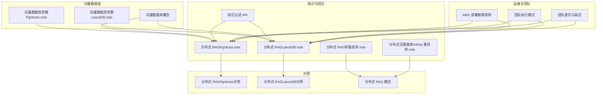
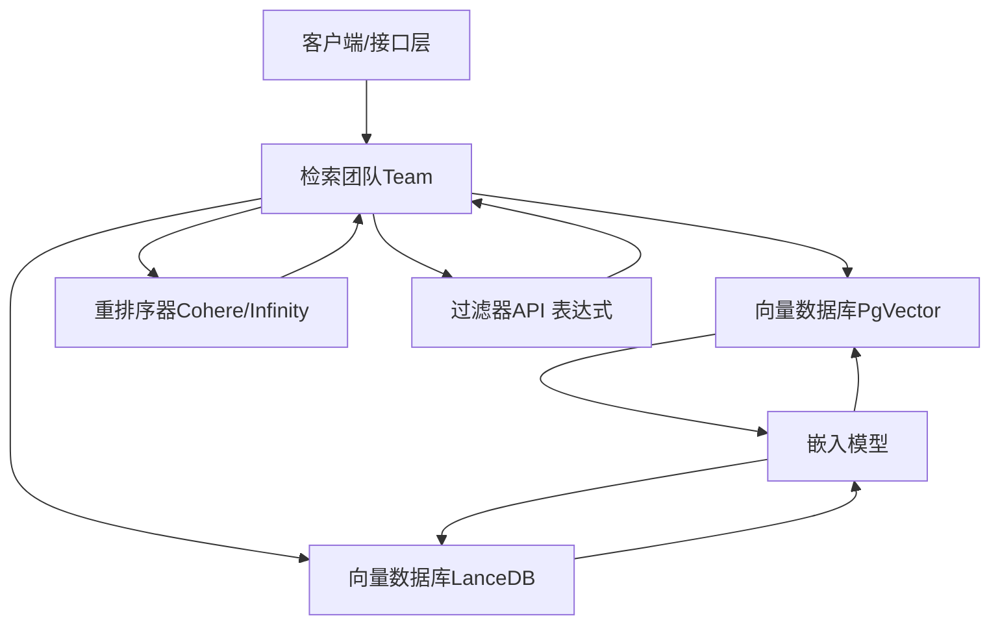
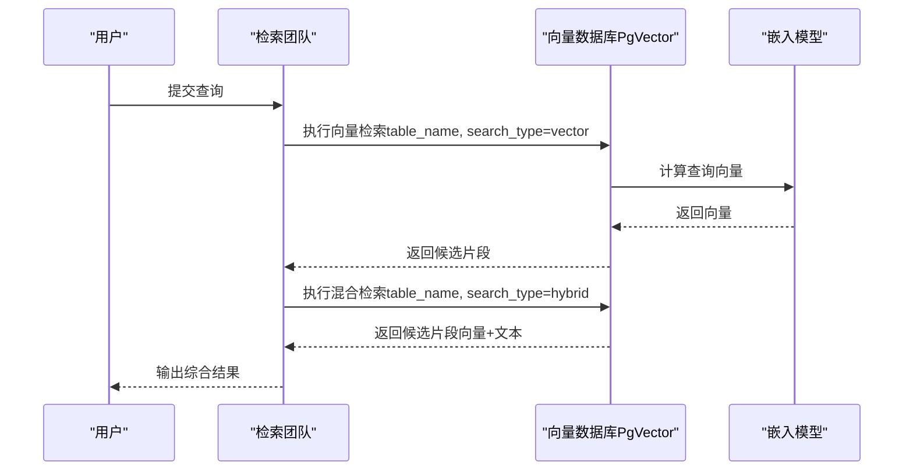
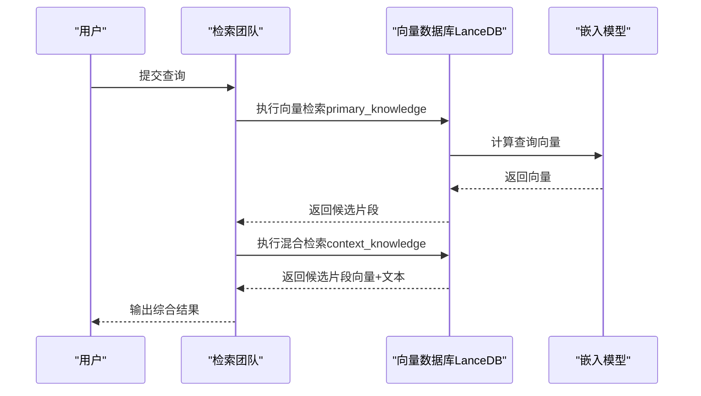
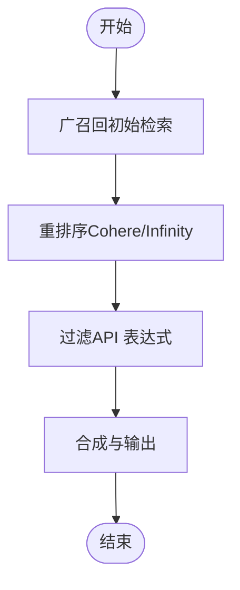
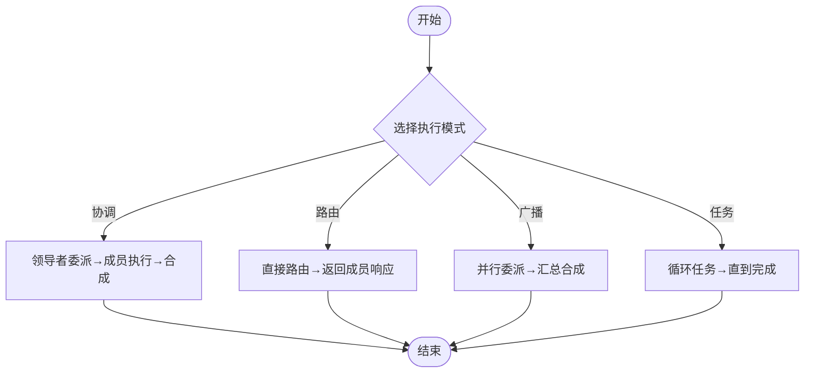
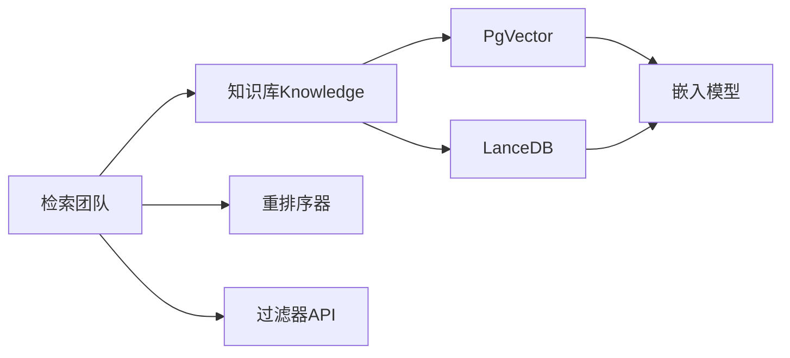
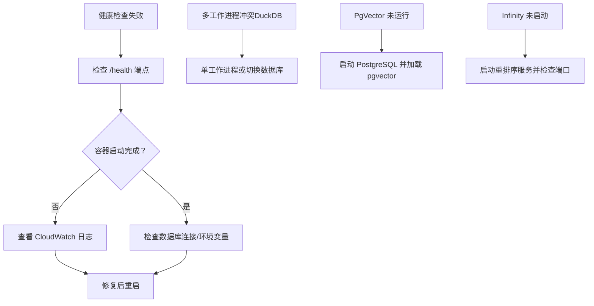

# 分布式检索增强生成

<cite>
**本文引用的文件**   
- [分布式 RAG（PgVector）.mdx](file://knowledge/teams/distributed-rag-pgvector.mdx)
- [分布式 RAG（LanceDB）.mdx](file://knowledge/teams/distributed-rag-lancedb.mdx)
- [分布式 RAG（带重排序）.mdx](file://knowledge/teams/distributed-rag-with-reranking.mdx)
- [分布式无限搜索（Infinity 重排序）.mdx](file://knowledge/teams/distributed-infinity-search.mdx)
- [向量数据库参数（PgVector）.mdx](file://_snippets/vectordb_pgvector_params.mdx)
- [向量数据库参数（LanceDB）.mdx](file://_snippets/vectordb_lancedb_params.mdx)
- [分布式 RAG（PgVector）示例](file://examples/teams/distributed-rag/distributed-rag-pgvector.mdx)
- [分布式 RAG（LanceDB）示例](file://examples/teams/distributed-rag/distributed-rag-lancedb.mdx)
- [分布式 RAG 概览](file://examples/teams/distributed-rag/overview.mdx)
- [向量数据库概念](file://knowledge/concepts/vector-db.mdx)
- [知识过滤 API](file://agent-os/knowledge/filter-knowledge.mdx)
- [AWS 部署故障排除](file://deploy/templates/aws/manage/troubleshooting.mdx)
- [团队执行模式](file://_snippets/team-execution-style.mdx)
- [团队委托与延迟](file://teams/delegation.mdx)
</cite>

## 目录
1. [简介](#简介)
2. [项目结构](#项目结构)
3. [核心组件](#核心组件)
4. [架构总览](#架构总览)
5. [组件详解](#组件详解)
6. [依赖关系分析](#依赖关系分析)
7. [性能考量](#性能考量)
8. [故障排除指南](#故障排除指南)
9. [结论](#结论)
10. [附录](#附录)

## 简介
本指南面向团队环境下的分布式检索增强生成（RAG）落地实践，系统讲解如何基于多向量数据库（PostgreSQL + pgvector、LanceDB）构建可扩展、可重排序、具备高可用与可观测性的分布式检索架构。文档覆盖：
- 多向量数据库配置与管理（含参数说明）
- 分布式检索的完整配置示例（数据库集群、负载均衡、故障转移思路）
- 重排序在分布式环境的应用与优化策略
- 性能监控、扩展性与高可用性建议
- 实战部署最佳实践与常见问题排查

## 项目结构
围绕分布式检索增强生成，仓库中与之直接相关的核心内容分布在以下路径：
- 知识与团队：知识概念、团队协作与分布式 RAG 示例
- 向量数据库：PgVector 与 LanceDB 的参数与用法
- 过滤与检索：API 级别的过滤表达式与检索策略
- 部署与运维：AWS 部署故障排除与团队执行模式

**图表来源**
- [分布式 RAG（PgVector）.mdx:1-254](file://knowledge/teams/distributed-rag-pgvector.mdx#L1-L254)
- [分布式 RAG（LanceDB）.mdx:1-234](file://knowledge/teams/distributed-rag-lancedb.mdx#L1-L234)
- [分布式 RAG（带重排序）.mdx:1-151](file://knowledge/teams/distributed-rag-with-reranking.mdx#L1-L151)
- [分布式无限搜索（Infinity 重排序）.mdx:125-154](file://knowledge/teams/distributed-infinity-search.mdx#L125-L154)
- [向量数据库参数（PgVector）.mdx:1-16](file://_snippets/vectordb_pgvector_params.mdx#L1-L16)
- [向量数据库参数（LanceDB）.mdx:1-14](file://_snippets/vectordb_lancedb_params.mdx#L1-L14)
- [向量数据库概念:91-117](file://knowledge/concepts/vector-db.mdx#L91-L117)
- [分布式 RAG（PgVector）示例:1-222](file://examples/teams/distributed-rag/distributed-rag-pgvector.mdx#L1-L222)
- [分布式 RAG（LanceDB）示例:1-206](file://examples/teams/distributed-rag/distributed-rag-lancedb.mdx#L1-L206)
- [分布式 RAG 概览:1-11](file://examples/teams/distributed-rag/overview.mdx#L1-L11)
- [AWS 部署故障排除:1-50](file://deploy/templates/aws/manage/troubleshooting.mdx#L1-L50)
- [团队执行模式:1-6](file://_snippets/team-execution-style.mdx#L1-L6)
- [团队委托与延迟:280-299](file://teams/delegation.mdx#L280-L299)

**章节来源**
- [分布式 RAG（PgVector）.mdx:1-254](file://knowledge/teams/distributed-rag-pgvector.mdx#L1-L254)
- [分布式 RAG（LanceDB）.mdx:1-234](file://knowledge/teams/distributed-rag-lancedb.mdx#L1-L234)
- [向量数据库参数（PgVector）.mdx:1-16](file://_snippets/vectordb_pgvector_params.mdx#L1-L16)
- [向量数据库参数（LanceDB）.mdx:1-14](file://_snippets/vectordb_lancedb_params.mdx#L1-L14)
- [向量数据库概念:91-117](file://knowledge/concepts/vector-db.mdx#L91-L117)
- [分布式 RAG 概览:1-11](file://examples/teams/distributed-rag/overview.mdx#L1-L11)

## 核心组件
- 多向量数据库层
  - PostgreSQL + pgvector：支持向量相似度与混合检索，适合生产级部署与企业数据库栈
  - LanceDB：嵌入式向量数据库，支持本地开发与轻量级生产，具备混合检索与重排序能力
- 检索团队（Team）与成员（Agent）
  - 将检索任务拆分为“向量检索/混合检索”“数据验证/上下文扩展”“答案合成/质量校验”等角色化职责
  - 支持多种执行模式：协调（coordinate）、路由（route）、广播（broadcast）、任务循环（tasks）
- 重排序与过滤
  - 使用 Cohere 或 Infinity 等重排序器提升结果质量
  - 基于 API 的过滤表达式对知识库进行精确筛选

**章节来源**
- [分布式 RAG（PgVector）.mdx:15-137](file://knowledge/teams/distributed-rag-pgvector.mdx#L15-L137)
- [分布式 RAG（LanceDB）.mdx:15-137](file://knowledge/teams/distributed-rag-lancedb.mdx#L15-L137)
- [分布式 RAG（带重排序）.mdx:16-143](file://knowledge/teams/distributed-rag-with-reranking.mdx#L16-L143)
- [分布式无限搜索（Infinity 重排序）.mdx:110-146](file://knowledge/teams/distributed-infinity-search.mdx#L110-L146)
- [团队执行模式:1-6](file://_snippets/team-execution-style.mdx#L1-L6)

## 架构总览
下图展示分布式检索增强生成的整体架构：前端或接口层触发查询；检索团队按角色分工执行检索与合成；向量数据库提供底层存储与检索；重排序器与过滤器在检索链路中提升质量与精度。

**图表来源**
- [分布式 RAG（PgVector）.mdx:36-57](file://knowledge/teams/distributed-rag-pgvector.mdx#L36-L57)
- [分布式 RAG（LanceDB）.mdx:35-53](file://knowledge/teams/distributed-rag-lancedb.mdx#L35-L53)
- [分布式 RAG（带重排序）.mdx:75-89](file://knowledge/teams/distributed-rag-with-reranking.mdx#L75-L89)
- [分布式无限搜索（Infinity 重排序）.mdx:110-129](file://knowledge/teams/distributed-infinity-search.mdx#L110-L129)
- [知识过滤 API:17-40](file://agent-os/knowledge/filter-knowledge.mdx#L17-L40)

## 组件详解

### PgVector 集成与配置
- 数据库连接与表设计
  - 使用数据库 URL 连接 PostgreSQL，并指定表名与模式
  - 支持向量检索与混合检索两种搜索类型
- 参数要点
  - 表名、模式、数据库 URL/引擎、嵌入模型、搜索类型、距离度量、前缀匹配、混合检索权重、语言、模式版本、自动升级开关
- 示例流程
  - 初始化两个知识库：一个用于向量检索，另一个用于混合检索
  - 团队成员分别调用不同知识库执行检索，再由合成者统一输出

**图表来源**
- [分布式 RAG（PgVector）.mdx:36-57](file://knowledge/teams/distributed-rag-pgvector.mdx#L36-L57)
- [向量数据库参数（PgVector）.mdx:1-16](file://_snippets/vectordb_pgvector_params.mdx#L1-L16)

**章节来源**
- [分布式 RAG（PgVector）.mdx:1-254](file://knowledge/teams/distributed-rag-pgvector.mdx#L1-L254)
- [向量数据库参数（PgVector）.mdx:1-16](file://_snippets/vectordb_pgvector_params.mdx#L1-L16)

### LanceDB 集成与配置
- 存储与表设计
  - 支持本地 URI 或连接对象，表名与嵌入模型可独立配置
  - 支持向量与混合检索，可选使用 tantivy 文本检索
- 参数要点
  - URI/连接对象、表名/表对象、嵌入模型、搜索类型、距离度量、nprobes、重排序器、是否启用 tantivy
- 示例流程
  - 主要知识库用于核心检索，上下文知识库用于扩展检索
  - 团队成员先主检索，再扩展检索，最后合成与校验

**图表来源**
- [分布式 RAG（LanceDB）.mdx:35-53](file://knowledge/teams/distributed-rag-lancedb.mdx#L35-L53)
- [向量数据库参数（LanceDB）.mdx:1-14](file://_snippets/vectordb_lancedb_params.mdx#L1-L14)

**章节来源**
- [分布式 RAG（LanceDB）.mdx:1-234](file://knowledge/teams/distributed-rag-lancedb.mdx#L1-L234)
- [向量数据库参数（LanceDB）.mdx:1-14](file://_snippets/vectordb_lancedb_params.mdx#L1-L14)

### 重排序在分布式环境的应用
- 分布式重排序策略
  - 初始广召回（高召回率），随后使用重排序器（如 Cohere 或 Infinity）进行精排
  - 可在多个知识库之间共享重排序结果，确保一致性
- 优化建议
  - 在团队内部设置“重排序专家”角色，专门负责结果精排
  - 对重排序器进行缓存与批处理，降低延迟与成本
  - 结合过滤器在重排序前缩小候选集，提高效率

**图表来源**
- [分布式 RAG（带重排序）.mdx:59-89](file://knowledge/teams/distributed-rag-with-reranking.mdx#L59-L89)
- [分布式无限搜索（Infinity 重排序）.mdx:110-129](file://knowledge/teams/distributed-infinity-search.mdx#L110-L129)
- [知识过滤 API:17-40](file://agent-os/knowledge/filter-knowledge.mdx#L17-L40)

**章节来源**
- [分布式 RAG（带重排序）.mdx:1-151](file://knowledge/teams/distributed-rag-with-reranking.mdx#L1-L151)
- [分布式无限搜索（Infinity 重排序）.mdx:107-190](file://knowledge/teams/distributed-infinity-search.mdx#L107-L190)
- [知识过滤 API:1-308](file://agent-os/knowledge/filter-knowledge.mdx#L1-L308)

### 团队执行模式与延迟控制
- 执行模式
  - 协调（coordinate）：领导者分解任务、委派成员、汇总结果
  - 路由（route）：直接路由到单个成员
  - 广播（broadcast）：同时委派给所有成员，再汇总
  - 任务（tasks）：循环执行任务列表直至完成
- 延迟与错误处理
  - 广播模式下并行执行会缩短整体延迟，但合成阶段仍可能成为瓶颈
  - 错误处理：协调模式可容忍部分成员失败；路由模式失败直接返回；广播模式可记录缺失数据并继续

**图表来源**
- [_snippets/team-execution-style.mdx:1-6](file://_snippets/team-execution-style.mdx#L1-L6)
- [teams/delegation.mdx:280-299](file://teams/delegation.mdx#L280-L299)

**章节来源**
- [_snippets/team-execution-style.mdx:1-6](file://_snippets/team-execution-style.mdx#L1-L6)
- [teams/delegation.mdx:280-299](file://teams/delegation.mdx#L280-L299)

## 依赖关系分析
- 组件耦合
  - 检索团队高度依赖知识库（Knowledge）与向量数据库（PgVector/LanceDB）
  - 重排序器与过滤器作为横切关注点插入检索链路，降低与核心检索逻辑耦合
- 外部依赖
  - 嵌入模型（如 OpenAI Embeddings）与数据库驱动（psycopg、SQLAlchemy）
  - 可选重排序服务（Cohere、Infinity）与本地嵌入式数据库（LanceDB）

**图表来源**
- [分布式 RAG（PgVector）.mdx:36-57](file://knowledge/teams/distributed-rag-pgvector.mdx#L36-L57)
- [分布式 RAG（LanceDB）.mdx:35-53](file://knowledge/teams/distributed-rag-lancedb.mdx#L35-L53)
- [分布式 RAG（带重排序）.mdx:75-89](file://knowledge/teams/distributed-rag-with-reranking.mdx#L75-L89)
- [分布式无限搜索（Infinity 重排序）.mdx:110-129](file://knowledge/teams/distributed-infinity-search.mdx#L110-L129)
- [向量数据库概念:91-117](file://knowledge/concepts/vector-db.mdx#L91-L117)

**章节来源**
- [分布式 RAG（PgVector）.mdx:1-254](file://knowledge/teams/distributed-rag-pgvector.mdx#L1-L254)
- [分布式 RAG（LanceDB）.mdx:1-234](file://knowledge/teams/distributed-rag-lancedb.mdx#L1-L234)
- [向量数据库概念:91-117](file://knowledge/concepts/vector-db.mdx#L91-L117)

## 性能考量
- 异步与并发
  - 使用异步插入与检索（如 ainsert、asearch）以提升吞吐
  - 广播模式并行执行可缩短端到端延迟，但需注意合成阶段的串行瓶颈
- 索引与检索参数
  - PgVector：合理设置向量索引（如 HNSW/IVFFLAT）与距离度量
  - LanceDB：调整 nprobes 与是否启用 tantivy，平衡召回与速度
- 重排序与过滤
  - 在重排序前通过过滤器缩小候选集，减少重排序开销
  - 对重排序结果进行缓存与批处理，降低重复计算
- 数据库与网络
  - 生产环境优先使用托管数据库与就近部署，减少网络抖动
  - 对嵌入模型调用进行限流与重试，避免成为性能瓶颈

**章节来源**
- [向量数据库概念:108-117](file://knowledge/concepts/vector-db.mdx#L108-L117)
- [分布式 RAG（PgVector）.mdx:140-184](file://knowledge/teams/distributed-rag-pgvector.mdx#L140-L184)
- [分布式 RAG（LanceDB）.mdx:140-179](file://knowledge/teams/distributed-rag-lancedb.mdx#L140-L179)
- [向量数据库参数（PgVector）.mdx:1-16](file://_snippets/vectordb_pgvector_params.mdx#L1-L16)
- [向量数据库参数（LanceDB）.mdx:1-14](file://_snippets/vectordb_lancedb_params.mdx#L1-L14)

## 故障排除指南
- 数据库连接与健康检查
  - ECS 健康检查失败：确认容器内 /health 端点可用，检查数据库连接参数与日志
  - SQLite/DuckDB 多工作进程冲突：避免多 Uvicorn 工作进程访问同一 DuckDB 文件
- 向量数据库启动
  - PgVector：确保 PostgreSQL 容器已运行并加载 pgvector 扩展
  - LanceDB：确认本地目录权限与表初始化成功
- 重排序服务
  - Infinity 重排序：确保服务已启动并监听指定端口
- 团队执行异常
  - 成员失败：协调模式可容忍部分失败；路由模式直接回退；广播模式记录缺失并继续

**图表来源**
- [AWS 部署故障排除:11-50](file://deploy/templates/aws/manage/troubleshooting.mdx#L11-L50)
- [分布式 RAG（PgVector）.mdx:147-161](file://knowledge/teams/distributed-rag-pgvector.mdx#L147-L161)
- [分布式无限搜索（Infinity 重排序）.mdx:168-177](file://knowledge/teams/distributed-infinity-search.mdx#L168-L177)

**章节来源**
- [AWS 部署故障排除:1-50](file://deploy/templates/aws/manage/troubleshooting.mdx#L1-L50)
- [分布式 RAG（PgVector）.mdx:140-184](file://knowledge/teams/distributed-rag-pgvector.mdx#L140-L184)
- [分布式无限搜索（Infinity 重排序）.mdx:136-177](file://knowledge/teams/distributed-infinity-search.mdx#L136-L177)

## 结论
通过将检索任务角色化、结合多向量数据库与重排序策略，并采用合适的团队执行模式与运维保障，可在团队环境中构建高性能、可扩展且高可用的分布式检索增强生成系统。生产落地建议优先选择与现有数据库栈一致的方案（如 PostgreSQL + pgvector），并在必要时引入本地嵌入式数据库（如 LanceDB）以满足开发与轻量生产需求。

## 附录

### 完整配置示例（步骤化）
- PostgreSQL + pgvector
  - 启动数据库容器并加载扩展
  - 初始化两个知识库：向量检索与混合检索
  - 配置嵌入模型与表名/模式
  - 团队成员分别执行检索，最终合成输出
- LanceDB
  - 准备本地 URI 与表名
  - 初始化主检索与上下文检索知识库
  - 配置嵌入模型与混合检索参数
  - 执行异步/同步检索并输出结果

**章节来源**
- [分布式 RAG（PgVector）.mdx:220-254](file://knowledge/teams/distributed-rag-pgvector.mdx#L220-L254)
- [分布式 RAG（LanceDB）.mdx:209-234](file://knowledge/teams/distributed-rag-lancedb.mdx#L209-L234)

### 最佳实践清单
- 数据库
  - 生产优先使用托管数据库与就近部署
  - 合理设置向量索引与距离度量
- 检索
  - 先广召回，再重排序，最后过滤
  - 异步插入与检索，提升吞吐
- 团队
  - 明确角色分工，采用广播/协调模式平衡延迟与可靠性
- 运维
  - 健康检查与日志监控，及时发现连接与资源问题

**章节来源**
- [向量数据库概念:91-117](file://knowledge/concepts/vector-db.mdx#L91-L117)
- [团队委托与延迟:280-299](file://teams/delegation.mdx#L280-L299)
- [AWS 部署故障排除:1-50](file://deploy/templates/aws/manage/troubleshooting.mdx#L1-L50)