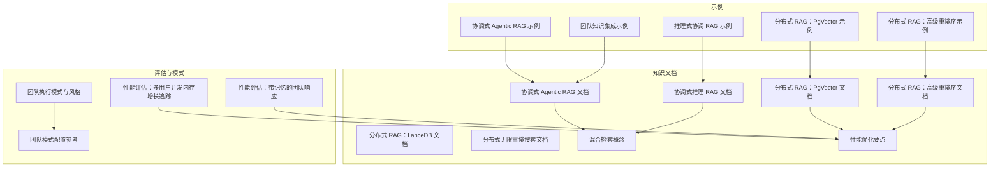
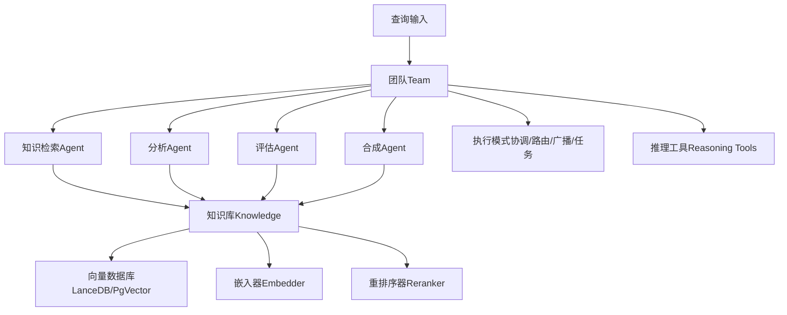
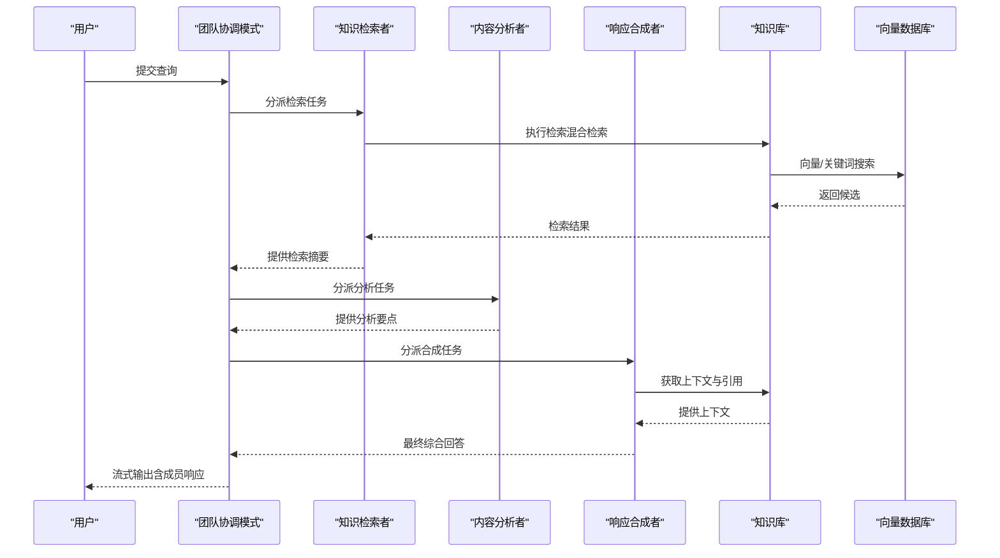
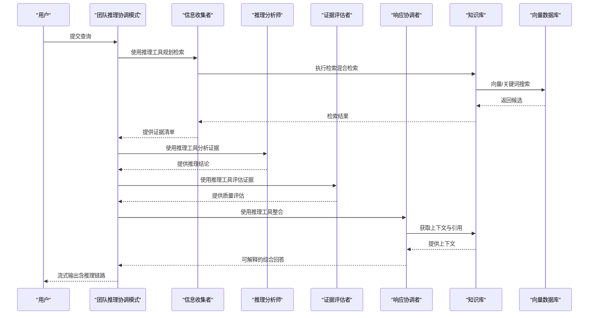
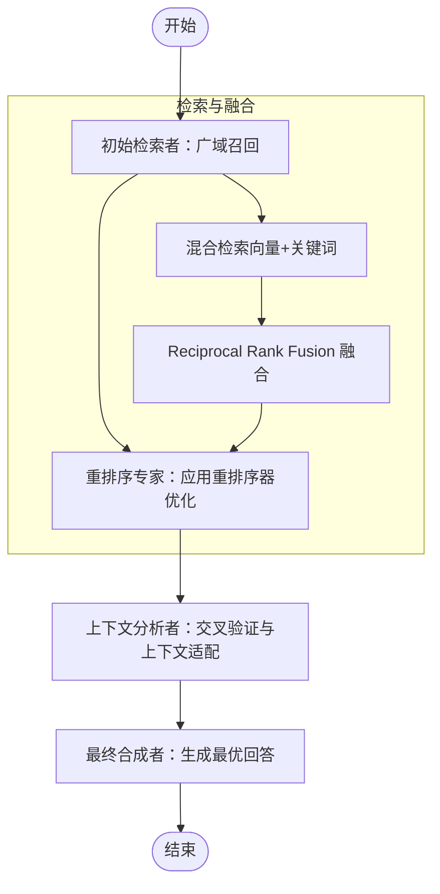
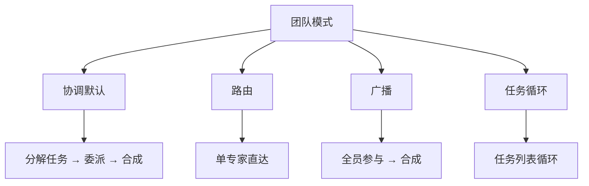
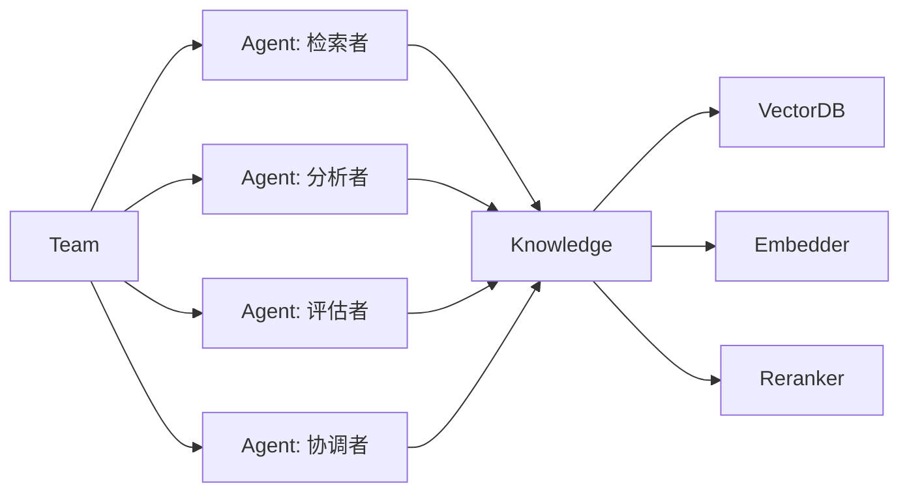

# 协调式检索增强生成

<cite>
**本文引用的文件**
- [协调式检索增强生成（Agentic RAG）示例](file://examples/teams/search-coordination/coordinated-agentic-rag.mdx)
- [推理式协调检索增强生成示例](file://examples/teams/search-coordination/coordinated-reasoning-rag.mdx)
- [团队知识集成与检索（示例）](file://examples/teams/knowledge/team-with-knowledge.mdx)
- [分布式 RAG：PgVector 示例](file://examples/teams/distributed-rag/distributed-rag-pgvector.mdx)
- [分布式 RAG：高级重排序示例](file://examples/teams/distributed-rag/distributed-rag-with-reranking.mdx)
- [协调式 Agentic RAG 文档](file://knowledge/teams/coordinated-agentic-rag.mdx)
- [协调式推理 RAG 文档](file://knowledge/teams/coordinated-reasoning-rag.mdx)
- [分布式 RAG：LanceDB 文档](file://knowledge/teams/distributed-rag-lancedb.mdx)
- [分布式 RAG：PgVector 文档](file://knowledge/teams/distributed-rag-pgvector.mdx)
- [分布式 RAG：高级重排序文档](file://knowledge/teams/distributed-rag-with-reranking.mdx)
- [分布式无限重排搜索文档](file://knowledge/teams/distributed-infinity-search.mdx)
- [混合检索概念](file://knowledge/concepts/search-and-retrieval/hybrid-search.mdx)
- [性能优化要点](file://knowledge/concepts/performance-tips.mdx)
- [团队执行模式与风格](file://_snippets/team-execution-style.mdx)
- [团队模式配置参考](file://_snippets/team-snippet.mdx)
- [性能评估：多用户并发内存增长追踪](file://examples/evals/performance/team-response-with-memory-multi-user.mdx)
- [性能评估：带记忆的团队响应](file://examples/evals/performance/team-response-with-memory-and-reasoning.mdx)
- [推理工具使用示例（AgentOS）](file://examples/agent-os/advanced-demo/reasoning-demo.mdx)
</cite>

## 目录
1. [引言](#引言)
2. [项目结构](#项目结构)
3. [核心组件](#核心组件)
4. [架构总览](#架构总览)
5. [详细组件分析](#详细组件分析)
6. [依赖关系分析](#依赖关系分析)
7. [性能考量](#性能考量)
8. [故障排查指南](#故障排查指南)
9. [结论](#结论)
10. [附录](#附录)

## 引言
本指南面向团队协作场景，系统讲解“协调式检索增强生成”的实现与使用，涵盖两类典型范式：
- 协调式 Agentic RAG：通过团队成员分工协作完成检索、分析与合成，强调“分而治之”的检索与“汇总最优”的输出。
- 推理式 RAG：在检索与合成过程中引入结构化推理工具，使团队成员的贡献具备可解释的推理链路，提升输出可信度与透明度。

文档将从架构、数据流、处理逻辑、集成点、错误处理与性能优化等维度展开，并提供可直接落地的配置与运行步骤，帮助你在团队环境中快速搭建稳定高效的协调式检索增强生成系统。

## 项目结构
围绕协调式检索增强生成，仓库中与之相关的核心路径如下：
- examples/teams/search-coordination：包含协调式 Agentic RAG 与推理式 RAG 的可运行示例
- knowledge/teams：提供团队检索增强生成的文档与最佳实践
- knowledge/concepts：包含混合检索、性能优化等基础概念
- examples/teams/distributed-rag：展示分布式向量数据库与高级重排序的团队协作方案
- examples/evals/performance：提供性能评估与内存增长追踪示例
- _snippets/team-execution-style.mdx 与 _snippets/team-snippet.mdx：提供团队执行模式与风格的参考

**图表来源**
- [协调式检索增强生成（Agentic RAG）示例](file://examples/teams/search-coordination/coordinated-agentic-rag.mdx)
- [推理式协调检索增强生成示例](file://examples/teams/search-coordination/coordinated-reasoning-rag.mdx)
- [分布式 RAG：PgVector 示例](file://examples/teams/distributed-rag/distributed-rag-pgvector.mdx)
- [分布式 RAG：高级重排序示例](file://examples/teams/distributed-rag/distributed-rag-with-reranking.mdx)
- [协调式 Agentic RAG 文档](file://knowledge/teams/coordinated-agentic-rag.mdx)
- [协调式推理 RAG 文档](file://knowledge/teams/coordinated-reasoning-rag.mdx)
- [分布式 RAG：PgVector 文档](file://knowledge/teams/distributed-rag-pgvector.mdx)
- [分布式 RAG：高级重排序文档](file://knowledge/teams/distributed-rag-with-reranking.mdx)
- [混合检索概念](file://knowledge/concepts/search-and-retrieval/hybrid-search.mdx)
- [性能优化要点](file://knowledge/concepts/performance-tips.mdx)
- [性能评估：多用户并发内存增长追踪](file://examples/evals/performance/team-response-with-memory-multi-user.mdx)
- [性能评估：带记忆的团队响应](file://examples/evals/performance/team-response-with-memory-and-reasoning.mdx)
- [团队执行模式与风格](file://_snippets/team-execution-style.mdx)
- [团队模式配置参考](file://_snippets/team-snippet.mdx)

**章节来源**
- [协调式检索增强生成（Agentic RAG）示例](file://examples/teams/search-coordination/coordinated-agentic-rag.mdx)
- [推理式协调检索增强生成示例](file://examples/teams/search-coordination/coordinated-reasoning-rag.mdx)
- [分布式 RAG：PgVector 示例](file://examples/teams/distributed-rag/distributed-rag-pgvector.mdx)
- [分布式 RAG：高级重排序示例](file://examples/teams/distributed-rag/distributed-rag-with-reranking.mdx)
- [协调式 Agentic RAG 文档](file://knowledge/teams/coordinated-agentic-rag.mdx)
- [协调式推理 RAG 文档](file://knowledge/teams/coordinated-reasoning-rag.mdx)
- [分布式 RAG：PgVector 文档](file://knowledge/teams/distributed-rag-pgvector.mdx)
- [分布式 RAG：高级重排序文档](file://knowledge/teams/distributed-rag-with-reranking.mdx)
- [混合检索概念](file://knowledge/concepts/search-and-retrieval/hybrid-search.mdx)
- [性能优化要点](file://knowledge/concepts/performance-tips.mdx)
- [性能评估：多用户并发内存增长追踪](file://examples/evals/performance/team-response-with-memory-multi-user.mdx)
- [性能评估：带记忆的团队响应](file://examples/evals/performance/team-response-with-memory-and-reasoning.mdx)
- [团队执行模式与风格](file://_snippets/team-execution-style.mdx)
- [团队模式配置参考](file://_snippets/team-snippet.mdx)

## 核心组件
- 知识库（Knowledge）：统一管理嵌入器、重排序器与向量数据库，支持混合检索与结果重排序
- 团队（Team）：编排多个智能体（Agent），按角色分工协作，支持多种执行模式（协调/路由/广播/任务循环）
- 智能体（Agent）：承担检索、分析、评估或合成等职责，可启用推理工具以结构化思维过程
- 向量数据库（VectorDB）：如 LanceDB、PgVector 等，支撑高效相似性检索与混合检索
- 结果融合与重排序：通过混合检索（向量+关键词）与重排序器（如 Cohere Reranker）提升召回质量

**章节来源**
- [协调式 Agentic RAG 文档](file://knowledge/teams/coordinated-agentic-rag.mdx)
- [协调式推理 RAG 文档](file://knowledge/teams/coordinated-reasoning-rag.mdx)
- [分布式 RAG：PgVector 文档](file://knowledge/teams/distributed-rag-pgvector.mdx)
- [分布式 RAG：高级重排序文档](file://knowledge/teams/distributed-rag-with-reranking.mdx)
- [混合检索概念](file://knowledge/concepts/search-and-retrieval/hybrid-search.mdx)

## 架构总览
下图展示了协调式检索增强生成在团队中的整体工作流：知识库统一管理、团队按角色分工、检索与推理工具协同、最终合成输出。

**图表来源**
- [协调式 Agentic RAG 文档](file://knowledge/teams/coordinated-agentic-rag.mdx)
- [协调式推理 RAG 文档](file://knowledge/teams/coordinated-reasoning-rag.mdx)
- [分布式 RAG：PgVector 文档](file://knowledge/teams/distributed-rag-pgvector.mdx)
- [分布式 RAG：高级重排序文档](file://knowledge/teams/distributed-rag-with-reranking.mdx)
- [混合检索概念](file://knowledge/concepts/search-and-retrieval/hybrid-search.mdx)
- [团队执行模式与风格](file://_snippets/team-execution-style.mdx)

## 详细组件分析

### 组件一：协调式 Agentic RAG
- 角色分工
  - 知识检索者：负责从知识库中全面检索相关信息
  - 内容分析者：对检索到的内容进行提炼与组织
  - 响应合成者：整合团队贡献，形成结构化、有引用的最终回答
- 关键配置
  - 共享知识库：统一嵌入器、重排序器与向量数据库
  - 混合检索：向量相似与关键词匹配结合，提升召回质量
  - 输出格式：Markdown，便于结构化呈现
- 运行方式：同步/异步均可，支持流式输出与逐步展示成员响应

**图表来源**
- [协调式 Agentic RAG 文档](file://knowledge/teams/coordinated-agentic-rag.mdx)
- [协调式检索增强生成（Agentic RAG）示例](file://examples/teams/search-coordination/coordinated-agentic-rag.mdx)

**章节来源**
- [协调式 Agentic RAG 文档](file://knowledge/teams/coordinated-agentic-rag.mdx)
- [协调式检索增强生成（Agentic RAG）示例](file://examples/teams/search-coordination/coordinated-agentic-rag.mdx)

### 组件二：推理式协调 RAG
- 角色分工
  - 信息收集者：使用推理工具规划检索策略，收集全面证据
  - 推理分析师：应用结构化推理，识别逻辑关系与推断链条
  - 证据评估者：评估证据质量与缺口，确保结论稳健
  - 响应协调者：整合推理链路与证据，形成透明、可解释的回答
- 关键配置
  - 启用推理工具：每个成员均注入推理工具，保证贡献结构化
  - 展示推理过程：支持显示完整推理链路，提升可信度
  - 混合检索与重排序：保障高质量检索结果
- 运行方式：同步/异步均可，支持流式输出与推理过程可视化

**图表来源**
- [协调式推理 RAG 文档](file://knowledge/teams/coordinated-reasoning-rag.mdx)
- [推理式协调检索增强生成示例](file://examples/teams/search-coordination/coordinated-reasoning-rag.mdx)

**章节来源**
- [协调式推理 RAG 文档](file://knowledge/teams/coordinated-reasoning-rag.mdx)
- [推理式协调检索增强生成示例](file://examples/teams/search-coordination/coordinated-reasoning-rag.mdx)

### 组件三：分布式检索与高级重排序
- 场景目标：在大规模知识库上实现高召回、高精度的检索与合成
- 方案组成
  - 初始检索者：广域召回，追求召回率
  - 重排序专家：利用重排序器优化相关性
  - 上下文分析者：交叉验证与上下文适配
  - 最终合成者：基于重排序后的高质量结果生成最优回答
- 关键技术
  - 混合检索：向量与关键词并行搜索，Reciprocal Rank Fusion 融合
  - 高级重排序：使用 Cohere Reranker 等模型提升排序质量
  - 分布式向量存储：PgVector/LanceDB 支撑大规模向量检索

**图表来源**
- [分布式 RAG：高级重排序文档](file://knowledge/teams/distributed-rag-with-reranking.mdx)
- [分布式 RAG：PgVector 文档](file://knowledge/teams/distributed-rag-pgvector.mdx)
- [分布式 RAG：LanceDB 文档](file://knowledge/teams/distributed-rag-lancedb.mdx)
- [混合检索概念](file://knowledge/concepts/search-and-retrieval/hybrid-search.mdx)

**章节来源**
- [分布式 RAG：高级重排序文档](file://knowledge/teams/distributed-rag-with-reranking.mdx)
- [分布式 RAG：PgVector 文档](file://knowledge/teams/distributed-rag-pgvector.mdx)
- [分布式 RAG：LanceDB 文档](file://knowledge/teams/distributed-rag-lancedb.mdx)
- [混合检索概念](file://knowledge/concepts/search-and-retrieval/hybrid-search.mdx)

### 组件四：团队执行模式与风格
- 执行模式
  - 协调（coordinate，默认）：领导型分解任务，委派给成员，再进行合成
  - 路由（route）：直接路由至单一专家，返回其响应
  - 广播（broadcast）：向所有成员委派相同任务，再进行合成
  - 任务（tasks）：按任务列表循环执行直至目标达成
- 配置要点
  - 通过 TeamMode 枚举控制模式
  - 根据业务场景选择合适模式，平衡效率与质量

**图表来源**
- [团队执行模式与风格](file://_snippets/team-execution-style.mdx)
- [团队模式配置参考](file://_snippets/team-snippet.mdx)

**章节来源**
- [团队执行模式与风格](file://_snippets/team-execution-style.mdx)
- [团队模式配置参考](file://_snippets/team-snippet.mdx)

## 依赖关系分析
- 组件耦合
  - Team 对 Agent 的依赖：通过角色与指令明确职责边界
  - Agent 对 Knowledge 的依赖：统一检索入口，避免重复构建
  - Knowledge 对 VectorDB/Embedder/Reranker 的依赖：模块化设计，便于替换与扩展
- 外部依赖
  - 向量数据库：LanceDB、PgVector 等
  - 嵌入器与重排序器：OpenAI、Cohere 等
  - 推理工具：ReasoningTools 提升可解释性
- 循环依赖风险
  - 通过清晰的接口与职责划分，避免循环依赖；若需跨模块交互，采用事件或回调机制

**图表来源**
- [协调式 Agentic RAG 文档](file://knowledge/teams/coordinated-agentic-rag.mdx)
- [协调式推理 RAG 文档](file://knowledge/teams/coordinated-reasoning-rag.mdx)
- [分布式 RAG：PgVector 文档](file://knowledge/teams/distributed-rag-pgvector.mdx)
- [分布式 RAG：高级重排序文档](file://knowledge/teams/distributed-rag-with-reranking.mdx)

**章节来源**
- [协调式 Agentic RAG 文档](file://knowledge/teams/coordinated-agentic-rag.mdx)
- [协调式推理 RAG 文档](file://knowledge/teams/coordinated-reasoning-rag.mdx)
- [分布式 RAG：PgVector 文档](file://knowledge/teams/distributed-rag-pgvector.mdx)
- [分布式 RAG：高级重排序文档](file://knowledge/teams/distributed-rag-with-reranking.mdx)

## 性能考量
- 检索性能
  - 优先使用混合检索（向量+关键词），Reciprocal Rank Fusion 融合提升召回与排序质量
  - 在大规模场景选择合适的向量数据库（LanceDB/PgVector/Pinecone）
- 数据加载与批处理
  - 使用异步批量插入，减少重复处理与过滤无效文件
  - 合理设置分块策略（固定大小/语义/递归），平衡速度与质量
- 内存与资源
  - 通过性能评估脚本监控内存增长与分配热点，定位瓶颈
  - 多用户并发场景下，关注内存峰值与GC行为，必要时降低批大小或调整分块
- 结果质量
  - 引入重排序器（如 Cohere Reranker）优化排序
  - 使用元数据过滤缩小搜索范围，提高相关性

**章节来源**
- [性能优化要点](file://knowledge/concepts/performance-tips.mdx)
- [混合检索概念](file://knowledge/concepts/search-and-retrieval/hybrid-search.mdx)
- [性能评估：多用户并发内存增长追踪](file://examples/evals/performance/team-response-with-memory-multi-user.mdx)
- [性能评估：带记忆的团队响应](file://examples/evals/performance/team-response-with-memory-and-reasoning.mdx)

## 故障排查指南
- 检索结果不相关
  - 检查分块策略是否适合内容类型
  - 增大最大返回条数，确认相关结果是否排名靠后
  - 使用元数据过滤缩小范围
- 内容加载缓慢
  - 开启跳过已存在文件选项，避免重复处理
  - 使用固定大小分块或分批处理
- 内存占用过高
  - 减小批大小、降低分块尺寸、清理旧内容
  - 使用性能评估脚本定位内存热点
- 向量数据库不可用
  - 确认容器/服务已启动（如 PgVector）
  - 检查连接参数与网络权限

**章节来源**
- [性能优化要点](file://knowledge/concepts/performance-tips.mdx)
- [分布式 RAG：PgVector 文档](file://knowledge/teams/distributed-rag-pgvector.mdx)
- [分布式 RAG：高级重排序文档](file://knowledge/teams/distributed-rag-with-reranking.mdx)

## 结论
协调式检索增强生成通过“角色分工 + 模型协作 + 结构化推理”的组合，在团队环境中实现了高质量、可解释、可扩展的检索与合成能力。配合混合检索、重排序与分布式向量存储，可在不同规模与复杂度场景下取得稳定效果。建议根据业务需求选择合适的执行模式与检索策略，并持续通过性能评估与监控优化系统表现。

## 附录

### A. 协调式检索的完整配置示例（步骤）
- 安装依赖与环境变量
  - 安装所需库与设置 API 密钥
- 初始化知识库
  - 选择向量数据库（LanceDB/PgVector）
  - 配置嵌入器与重排序器
  - 设置混合检索
- 创建团队与成员
  - 定义检索、分析、评估、合成等角色
  - 为成员注入推理工具（推理式）
- 插入知识与运行
  - 将文档插入知识库
  - 启动团队并输出流式结果

**章节来源**
- [协调式 Agentic RAG 文档](file://knowledge/teams/coordinated-agentic-rag.mdx)
- [协调式推理 RAG 文档](file://knowledge/teams/coordinated-reasoning-rag.mdx)
- [分布式 RAG：PgVector 文档](file://knowledge/teams/distributed-rag-pgvector.mdx)
- [分布式 RAG：高级重排序文档](file://knowledge/teams/distributed-rag-with-reranking.mdx)
- [混合检索概念](file://knowledge/concepts/search-and-retrieval/hybrid-search.mdx)

### B. 推理式 RAG 在团队协作中的优势
- 可解释性：每个成员的贡献都带有推理链路，便于审计与改进
- 一致性：统一的推理工具确保分析与评估标准一致
- 透明度：最终输出包含证据来源与评估依据，提升可信度

**章节来源**
- [协调式推理 RAG 文档](file://knowledge/teams/coordinated-reasoning-rag.mdx)
- [推理式协调检索增强生成示例](file://examples/teams/search-coordination/coordinated-reasoning-rag.mdx)

### C. 复杂协调场景实现方案
- 分布式检索与重排序：适用于大规模知识库与高精度要求场景
- 多模式路由：根据问题类型自动选择路由/广播/协调模式
- 并发与缓存：在多用户并发场景下引入缓存与限流，避免资源争用

**章节来源**
- [分布式 RAG：高级重排序文档](file://knowledge/teams/distributed-rag-with-reranking.mdx)
- [分布式 RAG：PgVector 文档](file://knowledge/teams/distributed-rag-pgvector.mdx)
- [分布式无限重排搜索文档](file://knowledge/teams/distributed-infinity-search.mdx)
- [团队执行模式与风格](file://_snippets/team-execution-style.mdx)

### D. 性能调优建议
- 选择合适向量数据库与分块策略
- 使用混合检索与重排序器
- 异步批处理与元数据过滤
- 通过性能评估脚本持续监控与优化

**章节来源**
- [性能优化要点](file://knowledge/concepts/performance-tips.mdx)
- [性能评估：多用户并发内存增长追踪](file://examples/evals/performance/team-response-with-memory-multi-user.mdx)
- [性能评估：带记忆的团队响应](file://examples/evals/performance/team-response-with-memory-and-reasoning.mdx)