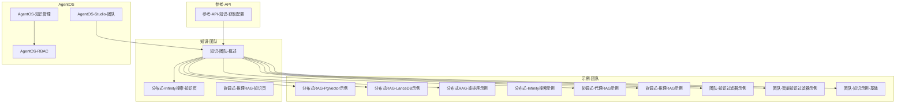
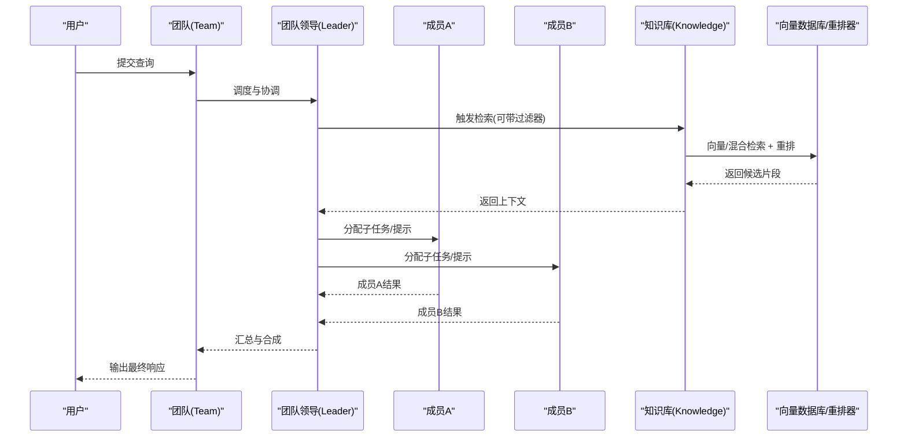
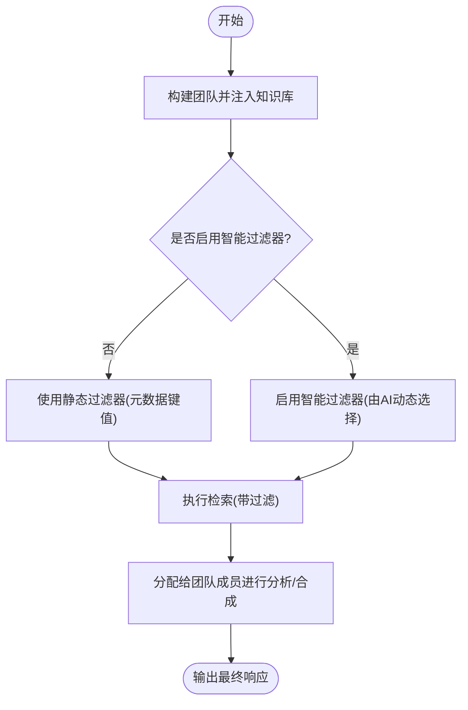
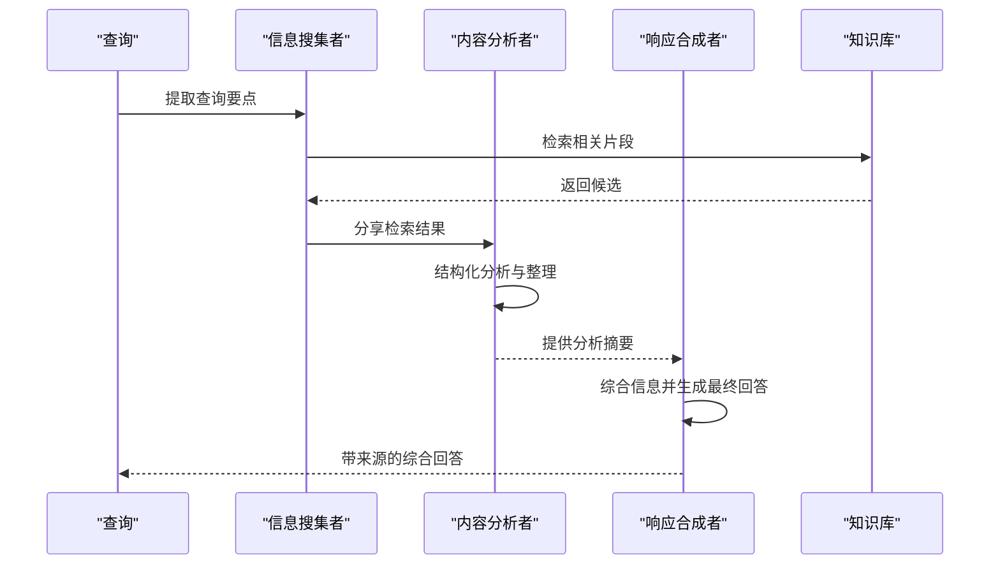
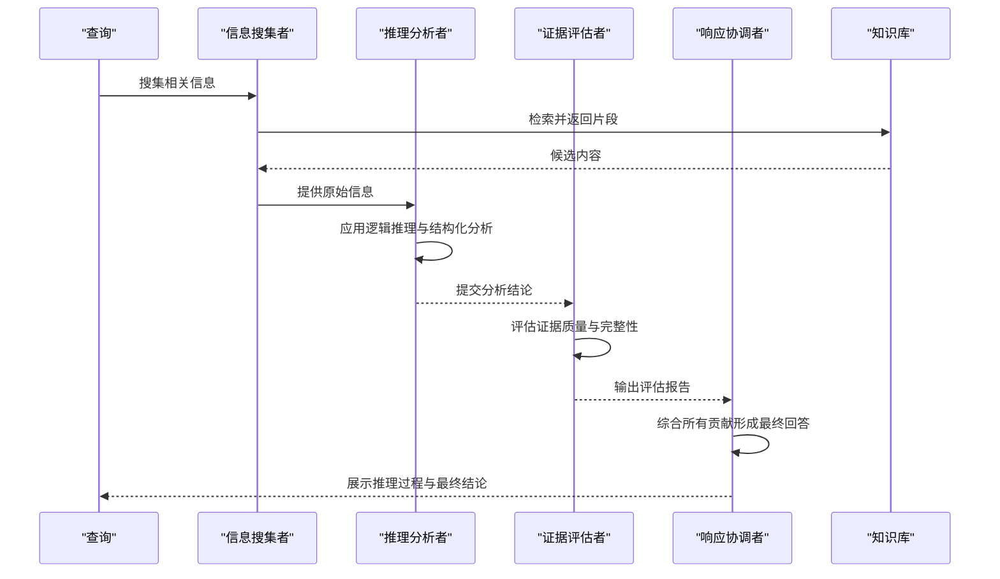
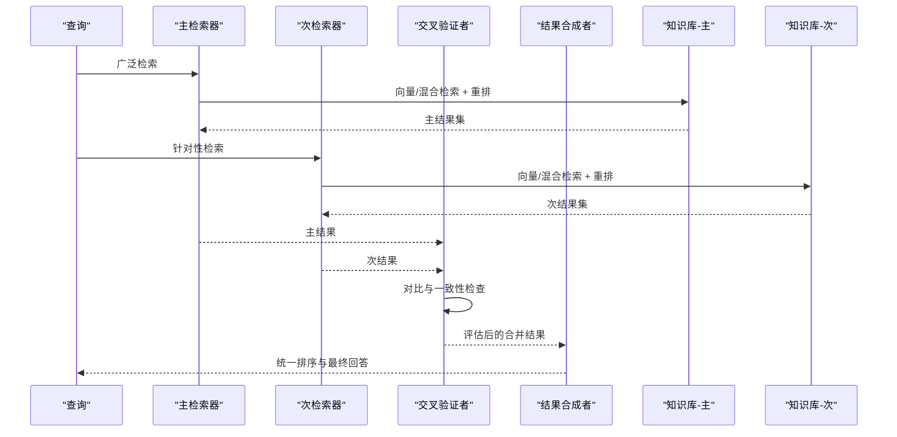
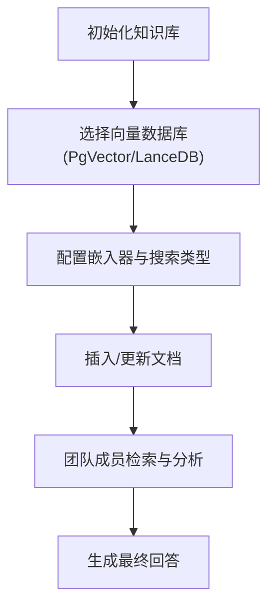
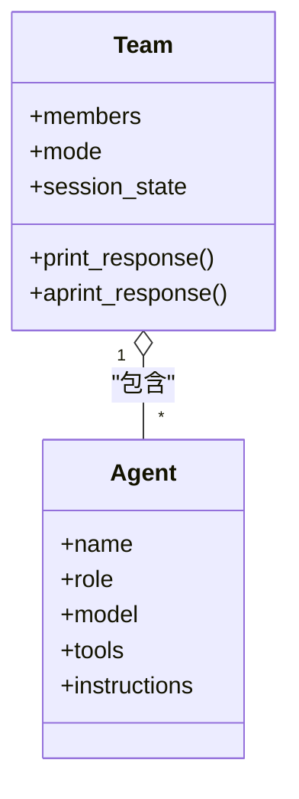
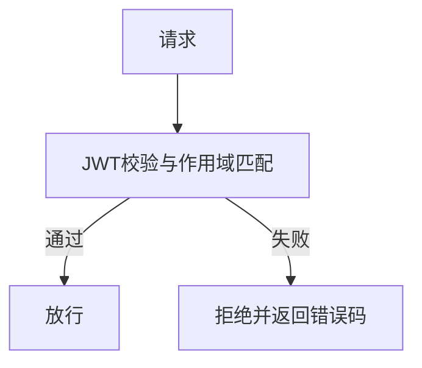
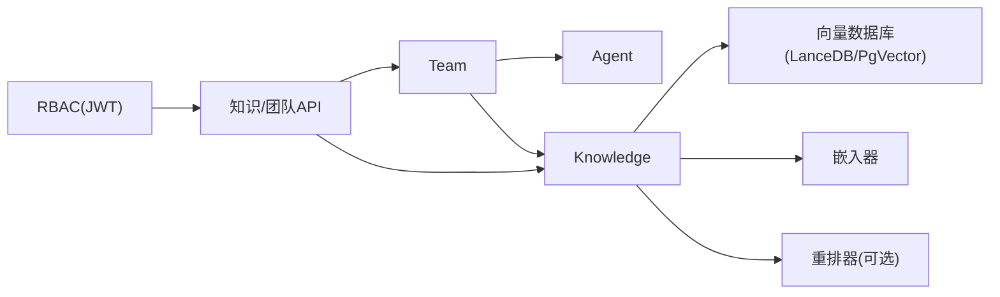

# 团队知识使用

<cite>
**本文引用的文件**
- [知识-团队-概述](file://knowledge/teams/overview.mdx)
- [分布式RAG-概述](file://examples/teams/distributed-rag/overview.mdx)
- [分布式RAG-PgVector示例](file://examples/teams/distributed-rag/distributed-rag-pgvector.mdx)
- [分布式RAG-LanceDB示例](file://examples/teams/distributed-rag/distributed-rag-lancedb.mdx)
- [分布式RAG-重排序示例](file://examples/teams/distributed-rag/distributed-rag-with-reranking.mdx)
- [分布式-Infinity搜索示例](file://examples/teams/search-coordination/distributed-infinity-search.mdx)
- [分布式-Infinity搜索-知识页](file://knowledge/teams/distributed-infinity-search.mdx)
- [协调式-推理RAG示例](file://examples/teams/search-coordination/coordinated-reasoning-rag.mdx)
- [协调式-推理RAG-知识页](file://knowledge/teams/coordinated-reasoning-rag.mdx)
- [协调式-代理RAG示例](file://examples/teams/search-coordination/coordinated-agentic-rag.mdx)
- [团队-知识示例-基础](file://examples/teams/knowledge/team-with-knowledge.mdx)
- [团队-知识过滤器示例](file://examples/teams/knowledge/team-with-knowledge-filters.mdx)
- [团队-智能知识过滤器示例](file://examples/teams/knowledge/team-with-agentic-knowledge-filters.mdx)
- [团队-学习-已学知识示例](file://examples/teams/learning/team-learned-knowledge.mdx)
- [团队-状态-概述](file://state/team/overview.mdx)
- [团队-状态-示例-状态共享](file://examples/teams/state/state-sharing.mdx)
- [AgentOS-知识管理](file://agent-os/features/knowledge-management.mdx)
- [AgentOS-RBAC](file://agent-os/security/rbac.mdx)
- [AgentOS-Studio-团队](file://agent-os/studio/teams.mdx)
- [参考-API-知识-获取配置](file://reference-api/schema/knowledge/get-config.mdx)
</cite>

## 目录
1. [简介](#简介)
2. [项目结构](#项目结构)
3. [核心组件](#核心组件)
4. [架构总览](#架构总览)
5. [详细组件分析](#详细组件分析)
6. [依赖关系分析](#依赖关系分析)
7. [性能考虑](#性能考虑)
8. [故障排查指南](#故障排查指南)
9. [结论](#结论)
10. [附录](#附录)

## 简介
本指南面向团队协作使用知识系统，覆盖以下关键主题：
- 团队级知识共享与访问控制（RBAC）
- 协调检索与分布式检索模式
- 知识过滤器配置与动态选择
- 协调式代理RAG与推理式RAG在团队中的实现
- 分布式检索的配置、性能优化与故障处理
- 最佳实践与常见使用场景

## 项目结构
围绕“团队知识使用”的文档与示例主要分布在如下区域：
- 知识-团队：团队知识体系、过滤器、分布式检索与协调RAG
- 示例-团队：PgVector/LanceDB分布式RAG、Infinity重排分布式搜索、协调式推理与代理RAG
- AgentOS：知识管理界面、RBAC权限模型、Studio可视化编排
- 参考-API：知识相关接口定义

**图表来源**
- [知识-团队-概述](file://knowledge/teams/overview.mdx)
- [分布式RAG-PgVector示例](file://examples/teams/distributed-rag/distributed-rag-pgvector.mdx)
- [分布式RAG-LanceDB示例](file://examples/teams/distributed-rag/distributed-rag-lancedb.mdx)
- [分布式RAG-重排序示例](file://examples/teams/distributed-rag/distributed-rag-with-reranking.mdx)
- [分布式-Infinity搜索-知识页](file://knowledge/teams/distributed-infinity-search.mdx)
- [协调式-推理RAG-知识页](file://knowledge/teams/coordinated-reasoning-rag.mdx)
- [AgentOS-知识管理](file://agent-os/features/knowledge-management.mdx)
- [AgentOS-RBAC](file://agent-os/security/rbac.mdx)
- [AgentOS-Studio-团队](file://agent-os/studio/teams.mdx)
- [参考-API-知识-获取配置](file://reference-api/schema/knowledge/get-config.mdx)

**章节来源**
- [知识-团队-概述](file://knowledge/teams/overview.mdx)
- [分布式RAG-概述](file://examples/teams/distributed-rag/overview.mdx)

## 核心组件
- 团队（Team）：多智能体协作容器，支持多种协调模式（协调、路由、广播、任务）
- 知识库（Knowledge）：统一的知识存储与检索入口，支持向量数据库、分块器、嵌入器、重排器
- 过滤器（Filters）：静态过滤器与“智能”过滤器，按元数据或查询上下文动态选择文档
- 检索器（Retriever）：向量检索、混合检索、重排器（如Infinity、Cohere）
- 权限与访问控制（RBAC）：基于JWT的作用域授权，控制对知识、团队、工作流等资源的操作
- 状态同步（Session State）：跨成员共享状态，保障协作一致性

**章节来源**
- [团队-状态-概述](file://state/team/overview.mdx)
- [AgentOS-RBAC](file://agent-os/security/rbac.mdx)
- [AgentOS-知识管理](file://agent-os/features/knowledge-management.mdx)

## 架构总览
下图展示团队知识系统的端到端流程：从用户输入到知识检索、再到团队成员协作与最终响应生成。

**图表来源**
- [分布式RAG-PgVector示例](file://examples/teams/distributed-rag/distributed-rag-pgvector.mdx)
- [分布式RAG-LanceDB示例](file://examples/teams/distributed-rag/distributed-rag-lancedb.mdx)
- [分布式RAG-重排序示例](file://examples/teams/distributed-rag/distributed-rag-with-reranking.mdx)
- [分布式-Infinity搜索示例](file://examples/teams/search-coordination/distributed-infinity-search.mdx)
- [协调式-推理RAG示例](file://examples/teams/search-coordination/coordinated-reasoning-rag.mdx)
- [协调式-代理RAG示例](file://examples/teams/search-coordination/coordinated-agentic-rag.mdx)

## 详细组件分析

### 团队知识共享与过滤器
- 静态过滤器：通过团队构造参数设置固定元数据过滤条件，限定检索范围
- 智能过滤器：开启后允许AI根据查询上下文动态决定检索范围，提升相关性
- 示例涵盖：基础团队+知识库、静态过滤器、智能过滤器三种用法

**图表来源**
- [团队-知识示例-基础](file://examples/teams/knowledge/team-with-knowledge.mdx)
- [团队-知识过滤器示例](file://examples/teams/knowledge/team-with-knowledge-filters.mdx)
- [团队-智能知识过滤器示例](file://examples/teams/knowledge/team-with-agentic-knowledge-filters.mdx)

**章节来源**
- [团队-知识示例-基础](file://examples/teams/knowledge/team-with-knowledge.mdx)
- [团队-知识过滤器示例](file://examples/teams/knowledge/team-with-knowledge-filters.mdx)
- [团队-智能知识过滤器示例](file://examples/teams/knowledge/team-with-agentic-knowledge-filters.mdx)

### 协调式代理RAG（Coordinated Agentic RAG）
- 组成角色：信息搜集者、内容分析者、响应合成者
- 流程：先检索，再分析，最后合成并注明来源
- 适用于需要清晰分工与可追溯性的场景

**图表来源**
- [协调式-代理RAG示例](file://examples/teams/search-coordination/coordinated-agentic-rag.mdx)

**章节来源**
- [协调式-代理RAG示例](file://examples/teams/search-coordination/coordinated-agentic-rag.mdx)

### 推理式RAG（Coordinated Reasoning RAG）
- 组成角色：信息搜集者、推理分析者、证据评估者、响应协调者
- 特点：强调透明推理过程，逐步验证证据质量，最终合成有依据的回答

**图表来源**
- [协调式-推理RAG示例](file://examples/teams/search-coordination/coordinated-reasoning-rag.mdx)

**章节来源**
- [协调式-推理RAG示例](file://examples/teams/search-coordination/coordinated-reasoning-rag.mdx)

### 分布式检索（Distributed Retrieval）
- 多检索器并行：主检索器负责广泛覆盖，次检索器聚焦特定领域
- 交叉验证：不同来源的结果相互校验，提升可靠性
- 结果合成：统一排序与整合，确保最终回答具备权威性与完整性

**图表来源**
- [分布式-Infinity搜索示例](file://examples/teams/search-coordination/distributed-infinity-search.mdx)
- [分布式-Infinity搜索-知识页](file://knowledge/teams/distributed-infinity-search.mdx)

**章节来源**
- [分布式-Infinity搜索示例](file://examples/teams/search-coordination/distributed-infinity-search.mdx)
- [分布式-Infinity搜索-知识页](file://knowledge/teams/distributed-infinity-search.mdx)

### 分布式RAG（PgVector/LanceDB）
- PgVector：企业级PostgreSQL + pgvector，适合高并发与强一致场景
- LanceDB：嵌入式列式向量库，适合本地或边缘部署
- 支持向量检索、混合检索与重排器增强

**图表来源**
- [分布式RAG-PgVector示例](file://examples/teams/distributed-rag/distributed-rag-pgvector.mdx)
- [分布式RAG-LanceDB示例](file://examples/teams/distributed-rag/distributed-rag-lancedb.mdx)
- [分布式RAG-重排序示例](file://examples/teams/distributed-rag/distributed-rag-with-reranking.mdx)

**章节来源**
- [分布式RAG-PgVector示例](file://examples/teams/distributed-rag/distributed-rag-pgvector.mdx)
- [分布式RAG-LanceDB示例](file://examples/teams/distributed-rag/distributed-rag-lancedb.mdx)
- [分布式RAG-重排序示例](file://examples/teams/distributed-rag/distributed-rag-with-reranking.mdx)

### 团队模式与状态同步
- 模式：协调（默认）、路由、广播、任务
- 状态：会话状态在团队成员间共享，便于跨成员协作与上下文延续

**图表来源**
- [AgentOS-Studio-团队](file://agent-os/studio/teams.mdx)
- [团队-状态-概述](file://state/team/overview.mdx)

**章节来源**
- [AgentOS-Studio-团队](file://agent-os/studio/teams.mdx)
- [团队-状态-概述](file://state/team/overview.mdx)

### 权限与访问控制（RBAC）
- 作用域格式：资源:动作、资源:<id>:动作、资源:*:动作、agent_os:admin
- 知识作用域：读取、写入、删除知识内容；搜索知识；查看配置
- 默认映射：各端点对应所需作用域；可通过中间件自定义映射
- 错误响应：401未认证、403权限不足

**图表来源**
- [AgentOS-RBAC](file://agent-os/security/rbac.mdx)

**章节来源**
- [AgentOS-RBAC](file://agent-os/security/rbac.mdx)

## 依赖关系分析
- 知识库依赖向量数据库与嵌入器；可选重排器（Infinity、Cohere）
- 团队成员可直接使用知识库，也可由领导统一检索后分发
- RBAC通过JWT中间件对接端点，确保知识与团队操作的最小权限

**图表来源**
- [分布式RAG-PgVector示例](file://examples/teams/distributed-rag/distributed-rag-pgvector.mdx)
- [分布式RAG-LanceDB示例](file://examples/teams/distributed-rag/distributed-rag-lancedb.mdx)
- [AgentOS-RBAC](file://agent-os/security/rbac.mdx)

**章节来源**
- [分布式RAG-PgVector示例](file://examples/teams/distributed-rag/distributed-rag-pgvector.mdx)
- [分布式RAG-LanceDB示例](file://examples/teams/distributed-rag/distributed-rag-lancedb.mdx)
- [AgentOS-RBAC](file://agent-os/security/rbac.mdx)

## 性能考虑
- 向量数据库选择：PgVector适合企业级高可用与扩展；LanceDB适合轻量与边缘部署
- 混合检索：结合向量与关键词检索，提高召回率与准确性
- 重排器：使用高性能重排（如Infinity）提升排序质量与吞吐
- 过滤器：合理使用静态/智能过滤器减少无关检索，降低延迟
- 并行与缓存：利用团队广播/路由模式与响应缓存减少重复计算
- 状态同步：避免过大session_state，保持同步开销可控

[本节为通用指导，无需具体文件引用]

## 故障排查指南
- 知识库不可用
  - 检查向量数据库连接与表是否存在
  - 确认嵌入器与重排器服务运行正常
- 权限问题
  - 确认JWT令牌包含必要作用域
  - 核对端点默认映射与自定义映射
- 分布式检索异常
  - 检查多个知识库实例的配置与数据一致性
  - 确保重排器服务可达且模型加载成功
- 团队状态不同步
  - 检查session_state大小与序列化
  - 确认工具中正确读取与更新共享状态

**章节来源**
- [AgentOS-RBAC](file://agent-os/security/rbac.mdx)
- [分布式-Infinity搜索-知识页](file://knowledge/teams/distributed-infinity-search.mdx)

## 结论
通过团队知识系统，团队可以实现：
- 可控的知识共享与访问（RBAC）
- 高效的协调检索与分布式检索
- 精准的知识过滤与动态选择
- 可解释的推理与代理式RAG
- 稳定的状态同步与协作流程

建议在生产环境中结合PgVector/LanceDB、重排器与过滤器，配合RBAC与会话状态管理，持续优化性能与安全性。

[本节为总结，无需具体文件引用]

## 附录

### 常见使用场景与示例路径
- 团队+知识库：基础团队集成知识库进行问答
  - [团队-知识示例-基础](file://examples/teams/knowledge/team-with-knowledge.mdx)
- 静态过滤器：按元数据限制检索范围
  - [团队-知识过滤器示例](file://examples/teams/knowledge/team-with-knowledge-filters.mdx)
- 智能过滤器：AI动态选择文档
  - [团队-智能知识过滤器示例](file://examples/teams/knowledge/team-with-agentic-knowledge-filters.mdx)
- 协调式代理RAG：信息搜集-分析-合成
  - [协调式-代理RAG示例](file://examples/teams/search-coordination/coordinated-agentic-rag.mdx)
- 协调式推理RAG：推理-评估-协调
  - [协调式-推理RAG示例](file://examples/teams/search-coordination/coordinated-reasoning-rag.mdx)
- 分布式RAG（PgVector/LanceDB）：向量/混合检索与重排
  - [分布式RAG-PgVector示例](file://examples/teams/distributed-rag/distributed-rag-pgvector.mdx)
  - [分布式RAG-LanceDB示例](file://examples/teams/distributed-rag/distributed-rag-lancedb.mdx)
  - [分布式RAG-重排序示例](file://examples/teams/distributed-rag/distributed-rag-with-reranking.mdx)
- 分布式搜索（Infinity重排）：多检索器并行与交叉验证
  - [分布式-Infinity搜索示例](file://examples/teams/search-coordination/distributed-infinity-search.mdx)
  - [分布式-Infinity搜索-知识页](file://knowledge/teams/distributed-infinity-search.mdx)
- 学习与已学知识：团队在会话中持续学习与复用
  - [团队-学习-已学知识示例](file://examples/teams/learning/team-learned-knowledge.mdx)
- 状态同步：跨成员共享状态
  - [团队-状态-概述](file://state/team/overview.mdx)
  - [团队-状态-示例-状态共享](file://examples/teams/state/state-sharing.mdx)
- 知识管理（AgentOS）：上传、组织与管理知识
  - [AgentOS-知识管理](file://agent-os/features/knowledge-management.mdx)
- RBAC权限：细粒度授权与端点映射
  - [AgentOS-RBAC](file://agent-os/security/rbac.mdx)
- API参考：知识配置接口
  - [参考-API-知识-获取配置](file://reference-api/schema/knowledge/get-config.mdx)