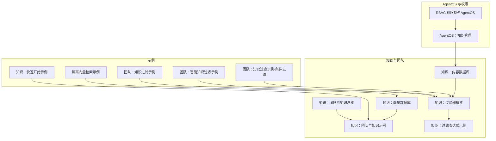
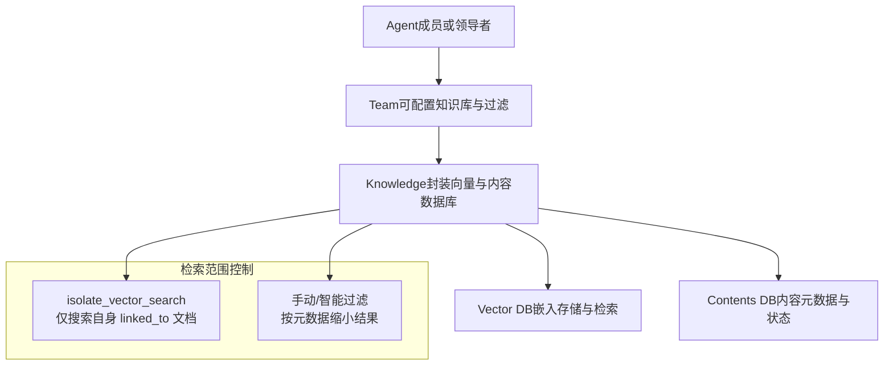
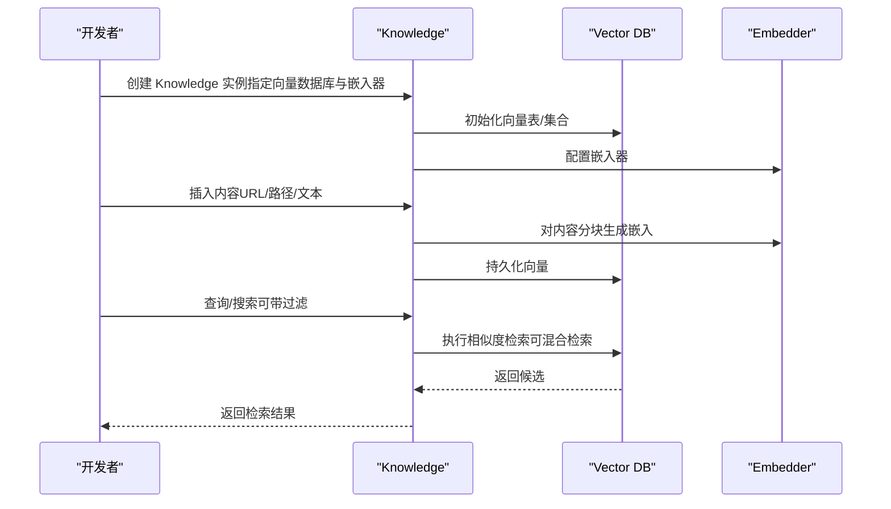
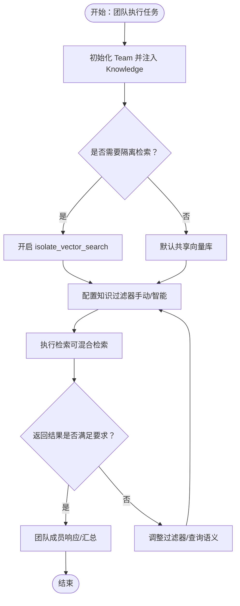
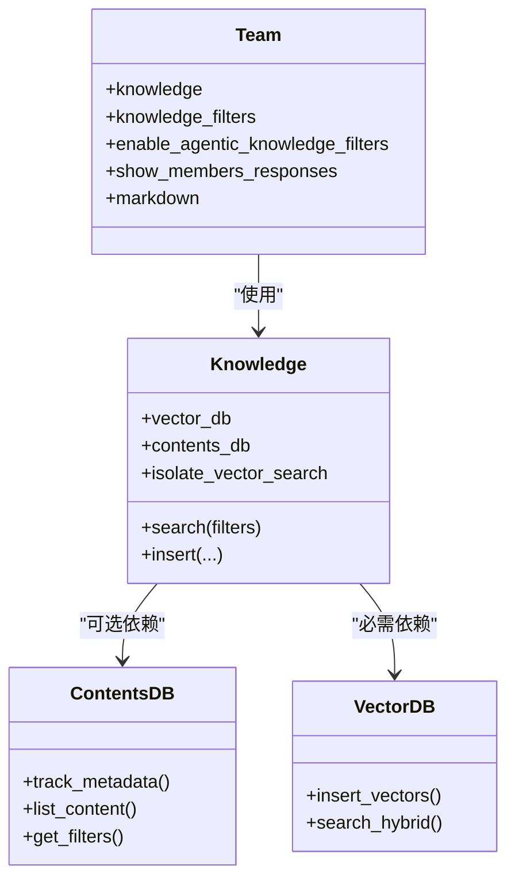
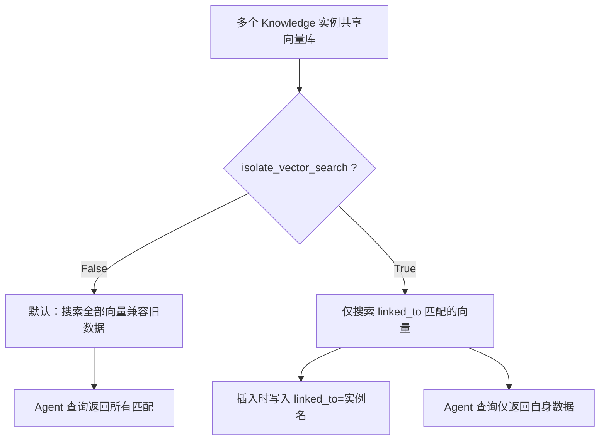
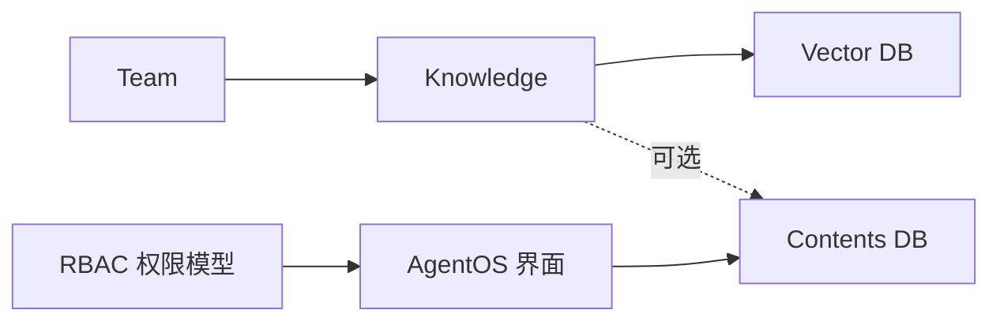

# 团队知识基础

<cite>
**本文引用的文件**
- [知识：团队与知识总览](file://knowledge/teams/overview.mdx)
- [知识：团队与知识（示例）](file://knowledge/teams/team-with-knowledge.mdx)
- [知识：过滤器概览](file://knowledge/concepts/filters/overview.mdx)
- [知识：过滤表达式示例](file://knowledge/concepts/filters/filter-expressions.mdx)
- [知识：内容数据库](file://knowledge/concepts/contents-db.mdx)
- [知识：向量数据库](file://knowledge/concepts/vector-db.mdx)
- [隔离向量检索示例](file://examples/knowledge/quickstart/isolate-vector-search.mdx)
- [知识：快速开始（示例）](file://examples/knowledge/quickstart.mdx)
- [团队：知识过滤（示例）](file://examples/teams/knowledge/team-with-knowledge-filters.mdx)
- [团队：智能知识过滤（示例）](file://examples/teams/knowledge/team-with-agentic-knowledge-filters.mdx)
- [团队：知识过滤（示例-条件过滤）](file://examples/knowledge/filters/filtering-with-conditions-on-team.mdx)
- [AgentOS：知识管理](file://agent-os/features/knowledge-management.mdx)
- [PgVector 参数参考（片段）](file://TBD/snippets/vectordb_pgvector2_params.mdx)
- [上下文：团队概览（含代理知识过滤）](file://context/team/overview.mdx)
- [RBAC 权限模型（AgentOS）](file://agent-os/security/rbac.mdx)
</cite>

## 目录
1. 引言
2. 项目结构
3. 核心组件
4. 架构总览
5. 组件详解
6. 依赖关系分析
7. 性能考量
8. 故障排查指南
9. 结论
10. 附录

## 引言
本指南面向团队知识基础的使用者，帮助你理解并正确配置与使用知识库、向量数据库、内容数据库以及团队知识检索的隔离与过滤能力。文档覆盖从知识库初始化、向量数据库配置到团队知识集成的完整流程，并解释访问权限与检索范围控制的最佳实践。

## 项目结构
围绕“团队知识”的关键文档分布在以下区域：
- 知识与团队：团队如何接入知识库、隔离检索、过滤策略
- 向量数据库与内容数据库：存储与元数据追踪
- 示例：快速开始、隔离检索、团队过滤、智能过滤
- AgentOS：知识管理界面与权限控制

**图表来源**
- [知识：团队与知识总览:1-61](file://knowledge/teams/overview.mdx#L1-L61)
- [知识：团队与知识（示例）:1-92](file://knowledge/teams/team-with-knowledge.mdx#L1-L92)
- [知识：过滤器概览:1-161](file://knowledge/concepts/filters/overview.mdx#L1-L161)
- [知识：过滤表达式示例:192-250](file://knowledge/concepts/filters/filter-expressions.mdx#L192-L250)
- [知识：内容数据库:1-206](file://knowledge/concepts/contents-db.mdx#L1-L206)
- [知识：向量数据库:1-117](file://knowledge/concepts/vector-db.mdx#L1-L117)
- [知识：快速开始（示例）:1-50](file://examples/knowledge/quickstart.mdx#L1-L50)
- [隔离向量检索示例:1-134](file://examples/knowledge/quickstart/isolate-vector-search.mdx#L1-L134)
- [团队：知识过滤（示例）:87-130](file://examples/teams/knowledge/team-with-knowledge-filters.mdx#L87-L130)
- [团队：智能知识过滤（示例）:85-129](file://examples/teams/knowledge/team-with-agentic-knowledge-filters.mdx#L85-L129)
- [团队：知识过滤（示例-条件过滤）:97-160](file://examples/knowledge/filters/filtering-with-conditions-on-team.mdx#L97-L160)
- [AgentOS：知识管理:1-78](file://agent-os/features/knowledge-management.mdx#L1-L78)
- [RBAC 权限模型（AgentOS）:52-99](file://agent-os/security/rbac.mdx#L52-L99)

**章节来源**
- [知识：团队与知识总览:1-61](file://knowledge/teams/overview.mdx#L1-L61)
- [AgentOS：知识管理:1-78](file://agent-os/features/knowledge-management.mdx#L1-L78)

## 核心组件
- 知识库（Knowledge）：封装向量数据库与可选的内容数据库，负责内容插入、查询、过滤与异步操作。
- 向量数据库（Vector DB）：存储嵌入向量，支持混合检索与多种后端（如 LanceDB、Chroma、PgVector、Qdrant 等）。
- 内容数据库（Contents DB）：追踪已添加内容的元数据、状态与处理进度，支撑过滤与权限控制。
- 团队（Team）：可配置知识库、过滤器与智能过滤开关，实现协作式检索与响应。
- AgentOS 界面与 RBAC：提供知识上传、浏览、编辑与删除等 UI 能力，并通过权限模型控制访问范围。

**章节来源**
- [知识：内容数据库:1-206](file://knowledge/concepts/contents-db.mdx#L1-L206)
- [知识：向量数据库:1-117](file://knowledge/concepts/vector-db.mdx#L1-L117)
- [上下文：团队概览（含代理知识过滤）:394-412](file://context/team/overview.mdx#L394-L412)

## 架构总览
下图展示了团队在执行过程中如何与知识库交互，包括检索范围控制与过滤策略：

**图表来源**
- [知识：团队与知识（示例）:32-62](file://knowledge/teams/team-with-knowledge.mdx#L32-L62)
- [隔离向量检索示例:67-73](file://examples/knowledge/quickstart/isolate-vector-search.mdx#L67-L73)
- [知识：过滤器概览:33-76](file://knowledge/concepts/filters/overview.mdx#L33-L76)

## 组件详解

### 知识库初始化与向量数据库配置
- 初始化知识库时，需指定向量数据库实例与嵌入器；可选配置内容数据库以启用内容追踪与过滤。
- 示例展示了基于 LanceDB 的知识库初始化与内容插入，以及与团队的集成方式。

**图表来源**
- [知识：团队与知识（示例）:32-44](file://knowledge/teams/team-with-knowledge.mdx#L32-L44)
- [知识：快速开始（示例）:13-26](file://examples/knowledge/quickstart.mdx#L13-L26)
- [知识：向量数据库:1-117](file://knowledge/concepts/vector-db.mdx#L1-L117)

**章节来源**
- [知识：团队与知识（示例）:32-62](file://knowledge/teams/team-with-knowledge.mdx#L32-L62)
- [知识：快速开始（示例）:1-50](file://examples/knowledge/quickstart.mdx#L1-L50)

### 团队知识集成与检索范围控制
- 团队可直接注入知识库实例，成员在执行任务时可调用知识库进行检索。
- 使用隔离检索（isolate_vector_search）可在多实例共享同一向量数据库时限定各自可见范围。
- 可通过知识过滤器（手动/智能）限制检索范围，实现按用户、部门、文档类型等元数据筛选。

**图表来源**
- [知识：团队与知识总览:9-11](file://knowledge/teams/overview.mdx#L9-L11)
- [隔离向量检索示例:67-73](file://examples/knowledge/quickstart/isolate-vector-search.mdx#L67-L73)
- [知识：过滤器概览:33-76](file://knowledge/concepts/filters/overview.mdx#L33-L76)

**章节来源**
- [知识：团队与知识总览:9-11](file://knowledge/teams/overview.mdx#L9-L11)
- [隔离向量检索示例:6-27](file://examples/knowledge/quickstart/isolate-vector-search.mdx#L6-L27)

### 访问权限与检索范围控制
- 内容数据库用于记录内容元数据与处理状态，结合过滤器实现按用户、部门、文档类型等维度的精确检索。
- 智能过滤（enable_agentic_knowledge_filters）允许系统根据用户问题自动提取过滤键值，减少人工配置成本。
- AgentOS 提供知识管理界面，配合 RBAC 权限模型，实现对资源的细粒度访问控制（如 teams:read、teams:run 等）。

**图表来源**
- [团队：知识过滤（示例）:97-108](file://examples/teams/knowledge/team-with-knowledge-filters.mdx#L97-L108)
- [团队：智能知识过滤（示例）:99-107](file://examples/teams/knowledge/team-with-agentic-knowledge-filters.mdx#L99-L107)
- [知识：内容数据库:1-206](file://knowledge/concepts/contents-db.mdx#L1-L206)
- [上下文：团队概览（含代理知识过滤）:394-412](file://context/team/overview.mdx#L394-L412)

**章节来源**
- [知识：内容数据库:1-206](file://knowledge/concepts/contents-db.mdx#L1-L206)
- [上下文：团队概览（含代理知识过滤）:394-412](file://context/team/overview.mdx#L394-L412)
- [RBAC 权限模型（AgentOS）:52-99](file://agent-os/security/rbac.mdx#L52-L99)

### 向量数据库共享与隔离检索设置
- 多个知识库实例可共享同一向量数据库，但默认会搜索全部向量。
- 开启 isolate_vector_search 后，仅搜索带有匹配 linked_to 元数据的向量；插入时会写入当前知识库实例名作为标识。
- 若已有生产数据且希望启用隔离，需重新索引以补全 linked_to 元数据，否则旧数据不会被新实例检索到。

**图表来源**
- [隔离向量检索示例:6-27](file://examples/knowledge/quickstart/isolate-vector-search.mdx#L6-L27)

**章节来源**
- [隔离向量检索示例:6-27](file://examples/knowledge/quickstart/isolate-vector-search.mdx#L6-L27)

### 团队知识使用的完整代码示例（路径指引）
以下示例均来自仓库中的示例文档，提供可直接运行的路径与步骤：
- 基础团队与知识库集成：[知识：团队与知识（示例）:9-92](file://knowledge/teams/team-with-knowledge.mdx#L9-L92)
- 快速开始（向量数据库与嵌入器配置）：[知识：快速开始（示例）:1-50](file://examples/knowledge/quickstart.mdx#L1-L50)
- 团队知识过滤（键值过滤）：[团队：知识过滤（示例）:87-130](file://examples/teams/knowledge/team-with-knowledge-filters.mdx#L87-L130)
- 团队智能知识过滤（AI 自动提取过滤键值）：[团队：智能知识过滤（示例）:85-129](file://examples/teams/knowledge/team-with-agentic-knowledge-filters.mdx#L85-L129)
- 团队条件过滤（IN/NOT/AND 组合）：[团队：知识过滤（示例-条件过滤）:97-160](file://examples/knowledge/filters/filtering-with-conditions-on-team.mdx#L97-L160)
- PgVector 参数参考（表结构与参数说明）：[PgVector 参数参考（片段）:1-10](file://TBD/snippets/vectordb_pgvector2_params.mdx#L1-L10)

**章节来源**
- [知识：团队与知识（示例）:9-92](file://knowledge/teams/team-with-knowledge.mdx#L9-L92)
- [知识：快速开始（示例）:1-50](file://examples/knowledge/quickstart.mdx#L1-L50)
- [团队：知识过滤（示例）:87-130](file://examples/teams/knowledge/team-with-knowledge-filters.mdx#L87-L130)
- [团队：智能知识过滤（示例）:85-129](file://examples/teams/knowledge/team-with-agentic-knowledge-filters.mdx#L85-L129)
- [团队：知识过滤（示例-条件过滤）:97-160](file://examples/knowledge/filters/filtering-with-conditions-on-team.mdx#L97-L160)
- [PgVector 参数参考（片段）:1-10](file://TBD/snippets/vectordb_pgvector2_params.mdx#L1-L10)

## 依赖关系分析
- 知识库依赖向量数据库进行嵌入存储与检索；可选依赖内容数据库用于元数据追踪与过滤。
- 团队通过注入知识库实现检索与响应；可通过过滤器与隔离检索控制范围。
- AgentOS 界面依赖内容数据库以提供内容浏览、上传与编辑功能；RBAC 控制资源访问。

**图表来源**
- [知识：内容数据库:1-206](file://knowledge/concepts/contents-db.mdx#L1-L206)
- [AgentOS：知识管理:1-78](file://agent-os/features/knowledge-management.mdx#L1-L78)
- [RBAC 权限模型（AgentOS）:52-99](file://agent-os/security/rbac.mdx#L52-L99)

**章节来源**
- [AgentOS：知识管理:1-78](file://agent-os/features/knowledge-management.mdx#L1-L78)
- [RBAC 权限模型（AgentOS）:52-99](file://agent-os/security/rbac.mdx#L52-L99)

## 性能考量
- 混合检索：结合向量相似与关键词匹配，提升召回质量与相关性。
- 异步操作：在高并发场景使用异步插入与搜索接口，避免阻塞。
- 索引与距离度量：合理选择向量索引与距离度量，平衡检索精度与性能。
- 过滤与隔离：通过过滤与隔离检索减少无效候选，降低检索开销。

**章节来源**
- [知识：向量数据库:23-31](file://knowledge/concepts/vector-db.mdx#L23-L31)
- [知识：向量数据库:108-117](file://knowledge/concepts/vector-db.mdx#L108-L117)

## 故障排查指南
- 内容不可见或为空：确认内容数据库已启用并正确追踪元数据；检查过滤键值是否与内容元数据一致。
- 隔离检索未生效：若已有历史数据，需重新索引以写入 linked_to 元数据；确保知识库实例名一致。
- 检索结果过多或过少：调整过滤器组合或查询语义；必要时关闭隔离检索验证全局数据。
- AgentOS 界面无法查看内容：确认连接状态与权限范围，检查 RBAC 配置。

**章节来源**
- [隔离向量检索示例:22-27](file://examples/knowledge/quickstart/isolate-vector-search.mdx#L22-L27)
- [知识：内容数据库:1-206](file://knowledge/concepts/contents-db.mdx#L1-L206)
- [RBAC 权限模型（AgentOS）:52-99](file://agent-os/security/rbac.mdx#L52-L99)

## 结论
通过将知识库、向量数据库与内容数据库有机结合，并配合团队的过滤与隔离检索机制，团队可以在共享基础设施上实现安全、可控、高效的协作式知识检索。结合 AgentOS 的 UI 与 RBAC 权限体系，可进一步提升知识管理的可视化与治理水平。

## 附录
- 实际使用场景建议
  - 新人入职培训：按部门与角色过滤，提供个性化学习路径。
  - 项目复盘：按项目与阶段过滤，快速定位历史文档。
  - 外部咨询：通过访问级别过滤，仅返回授权内容。
- 最佳实践
  - 在内容入库时设计稳定的元数据字段（如 user_id、department、document_type、access_level）。
  - 生产环境优先使用内容数据库与隔离检索，确保检索范围可控。
  - 对外暴露的查询接口建议开启智能过滤，降低人工配置成本。
  - 定期清理过期内容与冗余向量，保持检索效率。