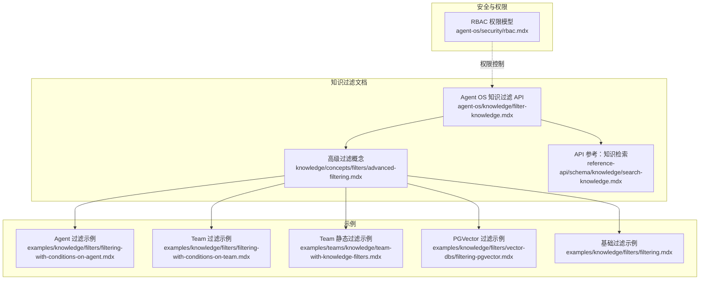
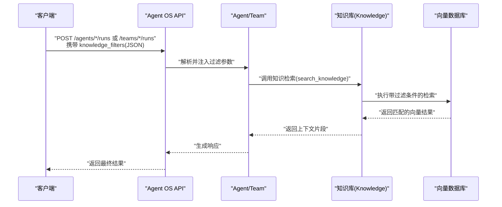
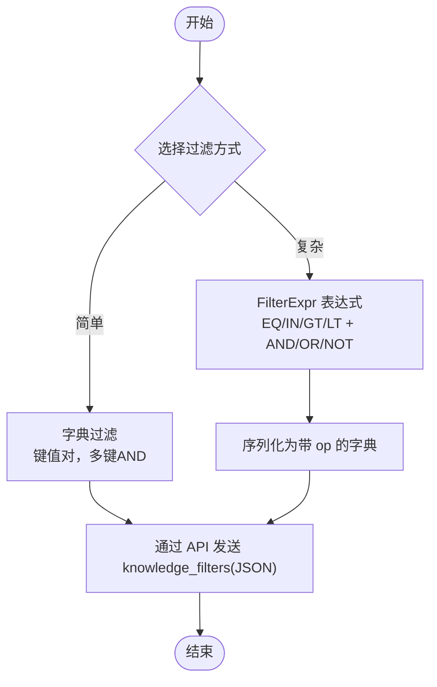
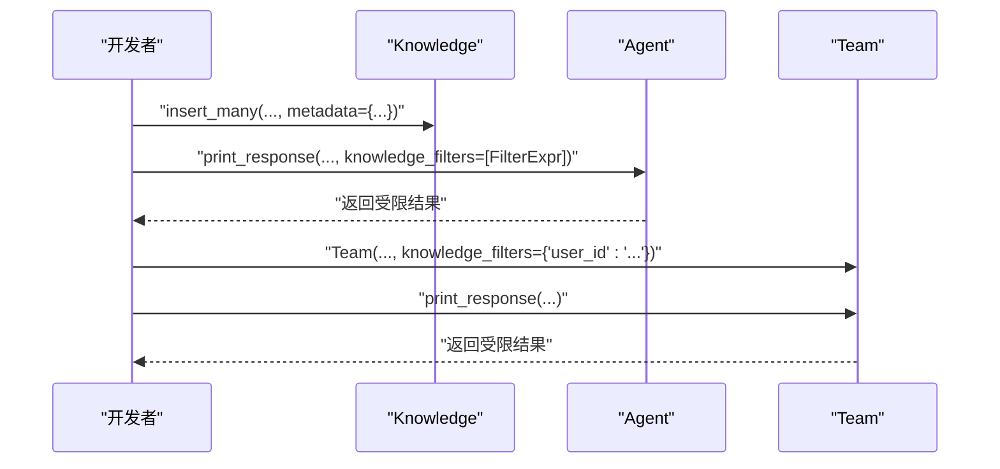
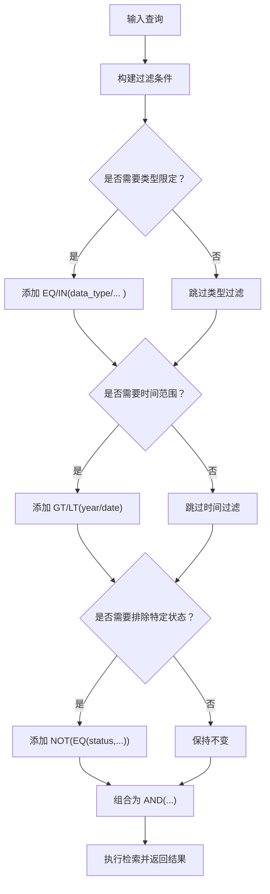
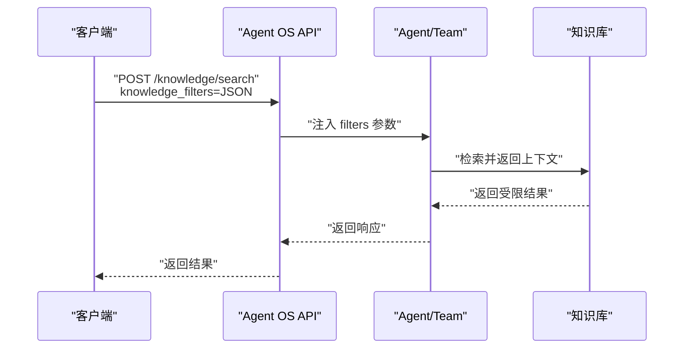
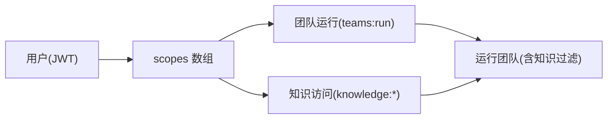
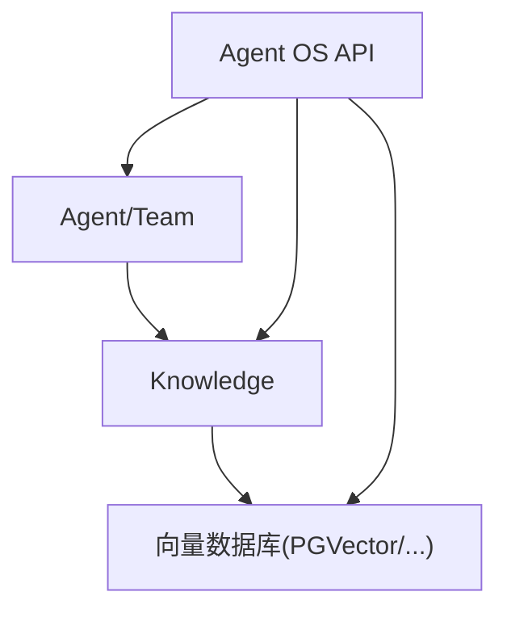

# 团队知识过滤

<cite>
**本文引用的文件**
- [agent-os/knowledge/filter-knowledge.mdx](file://agent-os/knowledge/filter-knowledge.mdx)
- [knowledge/concepts/filters/advanced-filtering.mdx](file://knowledge/concepts/filters/advanced-filtering.mdx)
- [examples/knowledge/filters/filtering-with-conditions-on-agent.mdx](file://examples/knowledge/filters/filtering-with-conditions-on-agent.mdx)
- [examples/knowledge/filters/filtering-with-conditions-on-team.mdx](file://examples/knowledge/filters/filtering-with-conditions-on-team.mdx)
- [examples/teams/knowledge/team-with-knowledge-filters.mdx](file://examples/teams/knowledge/team-with-knowledge-filters.mdx)
- [knowledge/teams/team-with-knowledge-filters.mdx](file://knowledge/teams/team-with-knowledge-filters.mdx)
- [examples/knowledge/filters/vector-dbs/filtering-pgvector.mdx](file://examples/knowledge/filters/vector-dbs/filtering-pgvector.mdx)
- [examples/knowledge/filters/filtering.mdx](file://examples/knowledge/filters/filtering.mdx)
- [agent-os/security/rbac.mdx](file://agent-os/security/rbac.mdx)
- [reference-api/schema/knowledge/search-knowledge.mdx](file://reference-api/schema/knowledge/search-knowledge.mdx)
</cite>

## 目录
1. [简介](#简介)
2. [项目结构](#项目结构)
3. [核心组件](#核心组件)
4. [架构总览](#架构总览)
5. [详细组件分析](#详细组件分析)
6. [依赖关系分析](#依赖关系分析)
7. [性能考量](#性能考量)
8. [故障排查指南](#故障排查指南)
9. [结论](#结论)
10. [附录](#附录)

## 简介
本指南面向团队与平台管理员，系统讲解如何在团队级别配置与使用“知识过滤器”。内容覆盖：
- 过滤器配置语法与表达式（字典过滤、FilterExpr 表达式）
- 条件表达式与动态过滤机制
- 基于元数据的过滤、内容类型筛选、时间范围限制等实践
- 在团队协作中如何通过过滤器实现知识权限控制
- 复杂过滤场景的解决方案与性能优化建议

## 项目结构
围绕“团队知识过滤”的文档与示例主要分布在以下位置：
- Agent OS 知识过滤 API 指南：定义过滤器的两种方式、序列化格式与错误处理
- 高级过滤概念：FilterExpr 的比较与逻辑运算符、与 Agent/Team 的结合
- 示例：Agent/Team 层面的静态/动态过滤、向量数据库支持差异
- 安全与权限：RBAC 范畴与知识访问控制
- API 参考：知识检索端点的过滤参数

**图表来源**
- [agent-os/knowledge/filter-knowledge.mdx](file://agent-os/knowledge/filter-knowledge.mdx)
- [knowledge/concepts/filters/advanced-filtering.mdx](file://knowledge/concepts/filters/advanced-filtering.mdx)
- [examples/knowledge/filters/filtering-with-conditions-on-agent.mdx](file://examples/knowledge/filters/filtering-with-conditions-on-agent.mdx)
- [examples/knowledge/filters/filtering-with-conditions-on-team.mdx](file://examples/knowledge/filters/filtering-with-conditions-on-team.mdx)
- [examples/teams/knowledge/team-with-knowledge-filters.mdx](file://examples/teams/knowledge/team-with-knowledge-filters.mdx)
- [examples/knowledge/filters/vector-dbs/filtering-pgvector.mdx](file://examples/knowledge/filters/vector-dbs/filtering-pgvector.mdx)
- [examples/knowledge/filters/filtering.mdx](file://examples/knowledge/filters/filtering.mdx)
- [agent-os/security/rbac.mdx](file://agent-os/security/rbac.mdx)
- [reference-api/schema/knowledge/search-knowledge.mdx](file://reference-api/schema/knowledge/search-knowledge.mdx)

**章节来源**
- [agent-os/knowledge/filter-knowledge.mdx](file://agent-os/knowledge/filter-knowledge.mdx)
- [knowledge/concepts/filters/advanced-filtering.mdx](file://knowledge/concepts/filters/advanced-filtering.mdx)
- [examples/knowledge/filters/filtering-with-conditions-on-agent.mdx](file://examples/knowledge/filters/filtering-with-conditions-on-agent.mdx)
- [examples/knowledge/filters/filtering-with-conditions-on-team.mdx](file://examples/knowledge/filters/filtering-with-conditions-on-team.mdx)
- [examples/teams/knowledge/team-with-knowledge-filters.mdx](file://examples/teams/knowledge/team-with-knowledge-filters.mdx)
- [examples/knowledge/filters/vector-dbs/filtering-pgvector.mdx](file://examples/knowledge/filters/vector-dbs/filtering-pgvector.mdx)
- [examples/knowledge/filters/filtering.mdx](file://examples/knowledge/filters/filtering.mdx)
- [agent-os/security/rbac.mdx](file://agent-os/security/rbac.mdx)
- [reference-api/schema/knowledge/search-knowledge.mdx](file://reference-api/schema/knowledge/search-knowledge.mdx)

## 核心组件
- 字典过滤（简单）：适合“字段=值”的直配查询，多字段组合默认为 AND 逻辑
- FilterExpr 表达式（高级）：支持 EQ/IN/GT/LT 等比较与 AND/OR/NOT 逻辑组合
- Agent/Team 运行时过滤：在运行请求中传入 knowledge_filters；Team 支持在构造函数中设置全局过滤
- 向量数据库支持：FilterExpr 当前仅 PGVector 支持；其他数据库需使用字典过滤
- API 过滤：通过 Agent OS API 的知识检索端点传递过滤参数

**章节来源**
- [agent-os/knowledge/filter-knowledge.mdx](file://agent-os/knowledge/filter-knowledge.mdx)
- [knowledge/concepts/filters/advanced-filtering.mdx](file://knowledge/concepts/filters/advanced-filtering.mdx)

## 架构总览
下图展示从客户端到 Agent OS API，再到知识检索与过滤的整体流程。

**图表来源**
- [agent-os/knowledge/filter-knowledge.mdx](file://agent-os/knowledge/filter-knowledge.mdx)
- [reference-api/schema/knowledge/search-knowledge.mdx](file://reference-api/schema/knowledge/search-knowledge.mdx)

## 详细组件分析

### 组件一：过滤器语法与表达式
- 字典过滤
  - 结构：键值对对象，多个键值默认 AND 组合
  - 适用：状态、分类、布尔、数值等简单筛选
- FilterExpr 表达式
  - 比较操作：EQ、IN、GT、LT
  - 逻辑操作：AND、OR、NOT
  - 序列化：以包含 op 键的对象表示，API 侧自动反序列化
- 使用场景
  - 基础筛选：使用字典过滤
  - 复杂组合：使用 FilterExpr 表达式

**图表来源**
- [agent-os/knowledge/filter-knowledge.mdx](file://agent-os/knowledge/filter-knowledge.mdx)
- [knowledge/concepts/filters/advanced-filtering.mdx](file://knowledge/concepts/filters/advanced-filtering.mdx)

**章节来源**
- [agent-os/knowledge/filter-knowledge.mdx](file://agent-os/knowledge/filter-knowledge.mdx)
- [knowledge/concepts/filters/advanced-filtering.mdx](file://knowledge/concepts/filters/advanced-filtering.mdx)

### 组件二：基于元数据的过滤
- 元数据设计：在插入文档时写入 metadata 字段（如 user_id、document_type、year 等）
- Agent 层过滤：在运行时通过 knowledge_filters 传入过滤条件
- Team 层过滤：可在 Team 构造函数中设置全局 knowledge_filters，或在单次运行时覆盖

**图表来源**
- [examples/knowledge/filters/filtering-with-conditions-on-agent.mdx](file://examples/knowledge/filters/filtering-with-conditions-on-agent.mdx)
- [examples/knowledge/filters/filtering-with-conditions-on-team.mdx](file://examples/knowledge/filters/filtering-with-conditions-on-team.mdx)
- [examples/teams/knowledge/team-with-knowledge-filters.mdx](file://examples/teams/knowledge/team-with-knowledge-filters.mdx)
- [knowledge/teams/team-with-knowledge-filters.mdx](file://knowledge/teams/team-with-knowledge-filters.mdx)

**章节来源**
- [examples/knowledge/filters/filtering-with-conditions-on-agent.mdx](file://examples/knowledge/filters/filtering-with-conditions-on-agent.mdx)
- [examples/knowledge/filters/filtering-with-conditions-on-team.mdx](file://examples/knowledge/filters/filtering-with-conditions-on-team.mdx)
- [examples/teams/knowledge/team-with-knowledge-filters.mdx](file://examples/teams/knowledge/team-with-knowledge-filters.mdx)
- [knowledge/teams/team-with-knowledge-filters.mdx](file://knowledge/teams/team-with-knowledge-filters.mdx)

### 组件三：内容类型筛选与时间范围限制
- 内容类型筛选：通过 data_type/document_type 等字段限定文档类型
- 时间范围限制：通过 year/date 等字段进行范围过滤（GT/LT）
- 复合条件：AND/OR/NOT 组合，实现“类型 + 时间 + 排除草稿”等策略

**图表来源**
- [knowledge/concepts/filters/advanced-filtering.mdx](file://knowledge/concepts/filters/advanced-filtering.mdx)
- [examples/knowledge/filters/filtering.mdx](file://examples/knowledge/filters/filtering.mdx)

**章节来源**
- [knowledge/concepts/filters/advanced-filtering.mdx](file://knowledge/concepts/filters/advanced-filtering.mdx)
- [examples/knowledge/filters/filtering.mdx](file://examples/knowledge/filters/filtering.mdx)

### 组件四：动态过滤机制与 API 使用
- 动态过滤：Agent/Team 在运行时根据上下文决定 knowledge_filters 的值（字典格式）
- API 使用：通过 /knowledge/search 或运行端点传入 knowledge_filters（JSON），支持数组形式传入多个过滤器
- 错误处理：无效结构会忽略并记录警告，搜索仍继续但无过滤效果

**图表来源**
- [agent-os/knowledge/filter-knowledge.mdx](file://agent-os/knowledge/filter-knowledge.mdx)
- [reference-api/schema/knowledge/search-knowledge.mdx](file://reference-api/schema/knowledge/search-knowledge.mdx)

**章节来源**
- [agent-os/knowledge/filter-knowledge.mdx](file://agent-os/knowledge/filter-knowledge.mdx)
- [reference-api/schema/knowledge/search-knowledge.mdx](file://reference-api/schema/knowledge/search-knowledge.mdx)

### 组件五：团队协作中的知识权限控制
- RBAC 权限模型：通过 JWT 的 scopes 控制对资源与动作的访问（agents/teams/workflows/knowledge 等）
- 知识访问：knowledge:read/write/delete 控制知识内容的查看、增删改
- 团队运行：teams:run 控制团队运行能力；可按团队粒度授权
- 实践建议：结合 FilterExpr 与 RBAC，既做“可见性”控制，也做“内容”过滤

**图表来源**
- [agent-os/security/rbac.mdx](file://agent-os/security/rbac.mdx)

**章节来源**
- [agent-os/security/rbac.mdx](file://agent-os/security/rbac.mdx)

## 依赖关系分析
- Agent/Team 依赖 Knowledge 提供检索接口
- Knowledge 依赖向量数据库存储与检索
- FilterExpr 仅在 PGVector 生效；其他数据库需使用字典过滤
- API 层负责解析 knowledge_filters 并传递给 Agent/Team

**图表来源**
- [agent-os/knowledge/filter-knowledge.mdx](file://agent-os/knowledge/filter-knowledge.mdx)
- [knowledge/concepts/filters/advanced-filtering.mdx](file://knowledge/concepts/filters/advanced-filtering.mdx)

**章节来源**
- [agent-os/knowledge/filter-knowledge.mdx](file://agent-os/knowledge/filter-knowledge.mdx)
- [knowledge/concepts/filters/advanced-filtering.mdx](file://knowledge/concepts/filters/advanced-filtering.mdx)

## 性能考量
- 向量数据库支持：FilterExpr 仅 PGVector 支持，其他数据库请使用字典过滤
- 复杂表达式：AND/OR/NOT 组合可能增加检索成本，建议先窄后宽或分步调试
- 元数据设计：确保常用过滤字段具备索引或合理分布，避免全表扫描
- 结果数量控制：通过 num_documents 限制返回条数，减少下游处理压力
- 缓存与复用：对稳定过滤条件的结果进行缓存，降低重复检索开销

## 故障排查指南
- 过滤未生效
  - 检查 metadata 键是否存在且拼写正确
  - 打印过滤结构，确认 to_dict 序列化有效
  - 分解复杂表达式，逐个验证子条件
- 数据库不支持 FilterExpr
  - 使用字典过滤替代（{"key": "value"}）
  - 或切换至 PGVector
- API 请求失败
  - 确认 knowledge_filters JSON 有效
  - 查看服务端日志，关注“过滤结构无效”警告
- 权限不足
  - 检查 JWT scopes 是否包含 knowledge:read/teams:run 等
  - 确认用户身份与资源授权范围

**章节来源**
- [knowledge/concepts/filters/advanced-filtering.mdx](file://knowledge/concepts/filters/advanced-filtering.mdx)
- [agent-os/knowledge/filter-knowledge.mdx](file://agent-os/knowledge/filter-knowledge.mdx)
- [agent-os/security/rbac.mdx](file://agent-os/security/rbac.mdx)

## 结论
通过字典过滤与 FilterExpr 表达式，团队可以在 Agent/Team 层面对知识库进行精细化筛选；结合 RBAC 权限模型，既能实现“可见性”控制，也能实现“内容”层面的动态过滤。在实际部署中，优先采用 PGVector 以获得更强大的 FilterExpr 支持，并遵循性能优化与故障排查的最佳实践，确保团队协作中的知识检索高效、可控、安全。

## 附录
- 快速参考
  - 字典过滤：{"key": "value", "status": "published"}
  - FilterExpr：AND(EQ("type","sales"), IN("region", [...]))
  - API 端点：/knowledge/search 或 /agents/*/runs
  - RBAC 范畴：knowledge:read/write/delete、teams:run 等