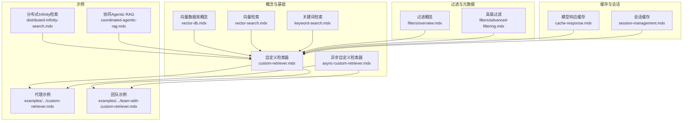
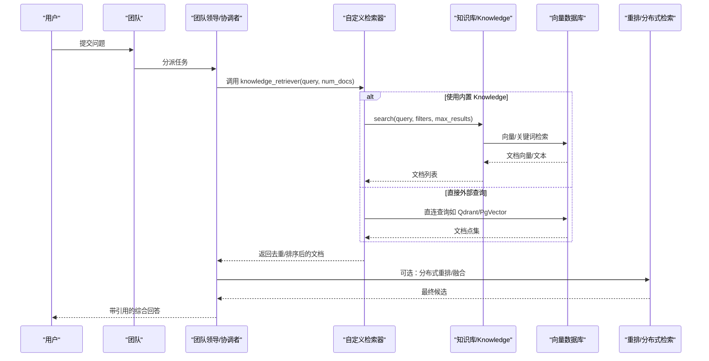
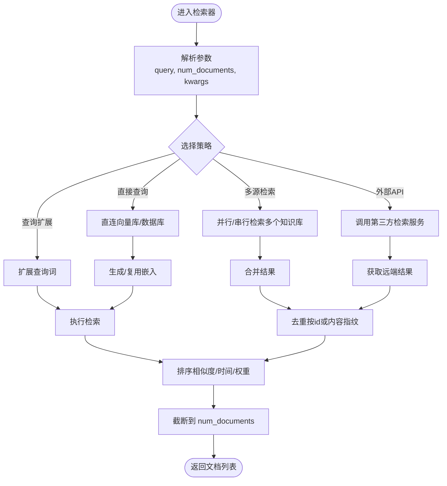
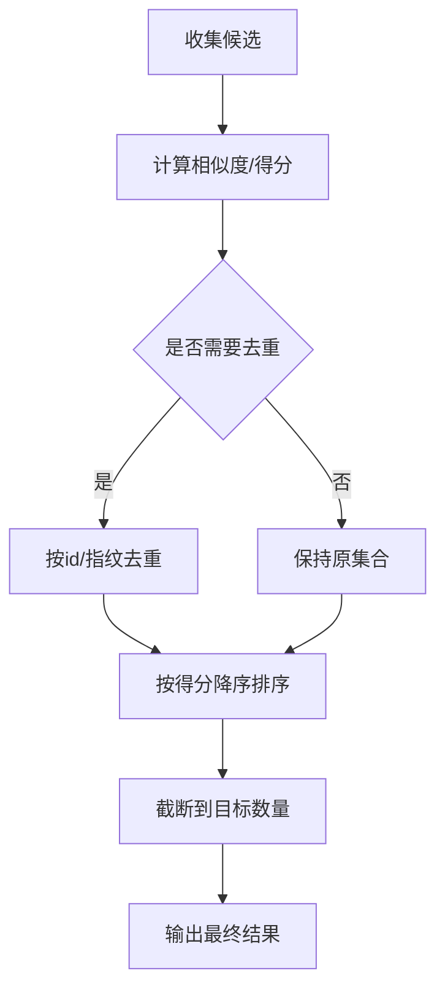
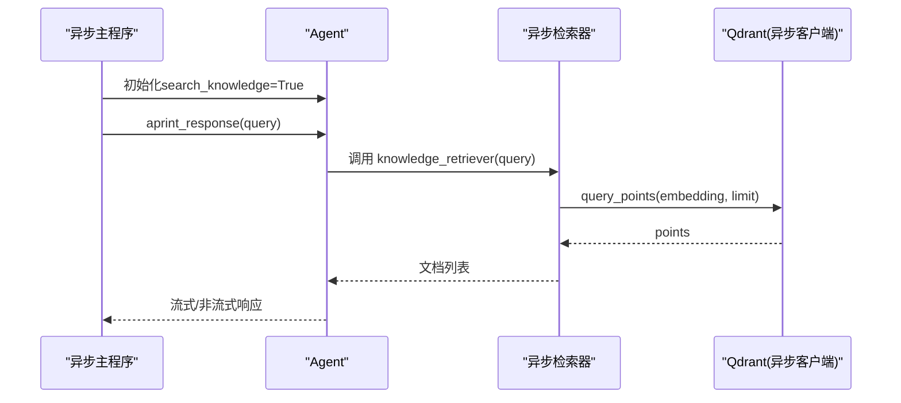
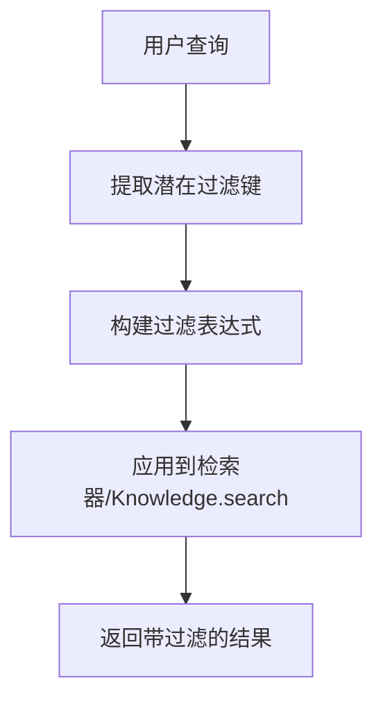
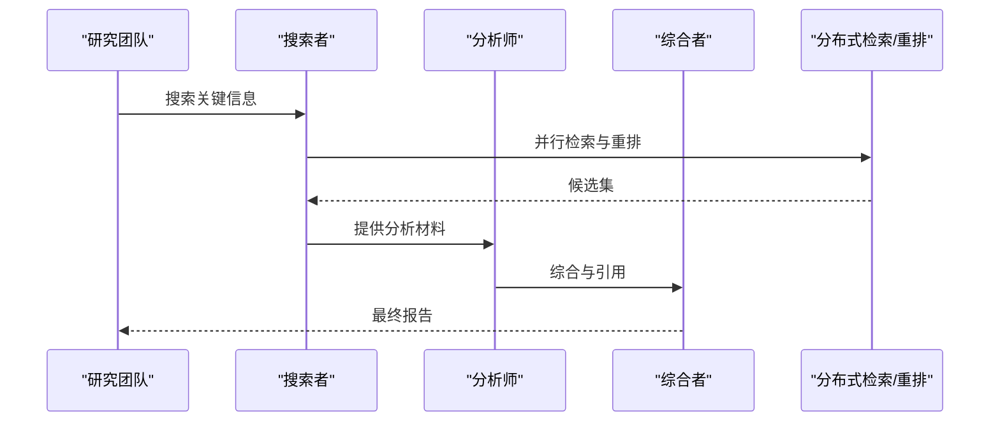
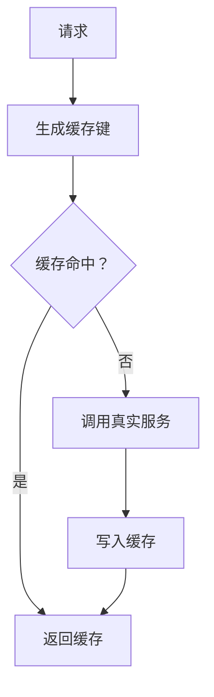
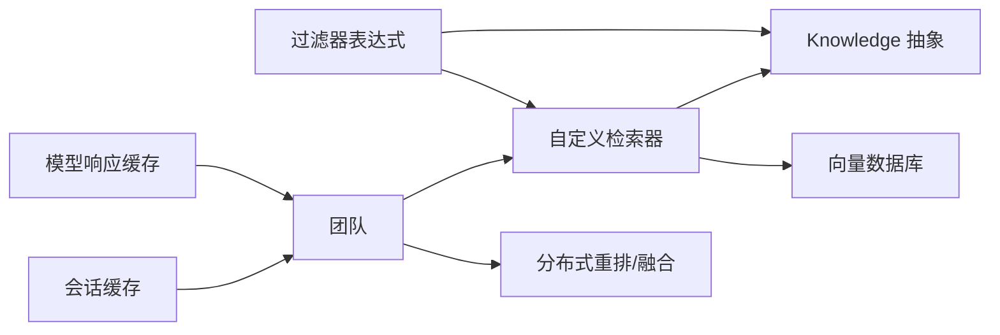

# 团队自定义检索器

<cite>
**本文引用的文件**
- [custom-retriever.mdx](file://knowledge/concepts/search-and-retrieval/custom-retriever.mdx)
- [async-custom-retriever.mdx](file://knowledge/concepts/search-and-retrieval/async-custom-retriever.mdx)
- [custom-retriever.mdx（示例：代理）](file://examples/agents/knowledge/custom-retriever.mdx)
- [custom-retriever.mdx（示例：团队）](file://examples/teams/knowledge/team-with-custom-retriever.mdx)
- [async-custom-retriever.mdx（示例：异步）](file://knowledge/concepts/search-and-retrieval/async-custom-retriever.mdx)
- [filters/overview.mdx](file://knowledge/concepts/filters/overview.mdx)
- [filters/advanced-filtering.mdx](file://knowledge/concepts/filters/advanced-filtering.mdx)
- [team-with-knowledge-filters.mdx](file://examples/teams/knowledge/team-with-knowledge-filters.mdx)
- [team-with-agentic-knowledge-filters.mdx](file://examples/teams/knowledge/team-with-agentic-knowledge-filters.mdx)
- [distributed-infinity-search.mdx](file://examples/teams/search-coordination/distributed-infinity-search.mdx)
- [coordinated-agentic-rag.mdx](file://examples/teams/search-coordination/coordinated-agentic-rag.mdx)
- [cache-response.mdx](file://models/cache-response.mdx)
- [session-management.mdx](file://sessions/session-management.mdx)
- [vector-db.mdx](file://knowledge/concepts/vector-db.mdx)
- [vector-search.mdx](file://knowledge/concepts/search-and-retrieval/vector-search.mdx)
- [keyword-search.mdx](file://knowledge/concepts/search-and-retrieval/keyword-search.mdx)
- [knowledge-tools.mdx](file://tools/reasoning_tools/knowledge-tools.mdx)
</cite>

## 目录
1. [简介](#简介)
2. [项目结构](#项目结构)
3. [核心组件](#核心组件)
4. [架构总览](#架构总览)
5. [详细组件分析](#详细组件分析)
6. [依赖关系分析](#依赖关系分析)
7. [性能考量](#性能考量)
8. [故障排查指南](#故障排查指南)
9. [结论](#结论)
10. [附录](#附录)

## 简介
本指南面向团队环境，系统讲解如何实现与配置“自定义检索器”。内容覆盖：
- 自定义检索器接口与函数签名
- 检索算法定制（查询扩展、多源合并、外部服务集成）
- 结果排序与去重机制
- 并发处理与缓存策略
- 高级检索场景（分布式检索、协同 RAG、智能过滤）
- 调试技巧与最佳实践

## 项目结构
围绕“自定义检索器”的相关文档与示例主要分布在以下路径：
- 概念与用法：knowledge/concepts/search-and-retrieval/custom-retriever.mdx、async-custom-retriever.mdx
- 示例：examples/agents/knowledge/custom-retriever.mdx、examples/teams/knowledge/team-with-custom-retriever.mdx
- 过滤与元数据：knowledge/concepts/filters/overview.mdx、filters/advanced-filtering.mdx
- 协同检索与分布式：examples/teams/search-coordination/*
- 向量数据库与检索类型：knowledge/concepts/vector-db.mdx、vector-search.mdx、keyword-search.mdx
- 缓存与会话：models/cache-response.mdx、sessions/session-management.mdx
- 知识工具链：tools/reasoning_tools/knowledge-tools.mdx

**图表来源**
- [custom-retriever.mdx:1-167](file://knowledge/concepts/search-and-retrieval/custom-retriever.mdx#L1-L167)
- [async-custom-retriever.mdx:1-130](file://knowledge/concepts/search-and-retrieval/async-custom-retriever.mdx#L1-L130)
- [vector-db.mdx:34-117](file://knowledge/concepts/vector-db.mdx#L34-L117)
- [vector-search.mdx:1-30](file://knowledge/concepts/search-and-retrieval/vector-search.mdx#L1-L30)
- [keyword-search.mdx:1-37](file://knowledge/concepts/search-and-retrieval/keyword-search.mdx#L1-L37)
- [examples/agents/knowledge/custom-retriever.mdx:1-90](file://examples/agents/knowledge/custom-retriever.mdx#L1-L90)
- [examples/teams/knowledge/team-with-custom-retriever.mdx:1-149](file://examples/teams/knowledge/team-with-custom-retriever.mdx#L1-L149)
- [distributed-infinity-search.mdx:140-190](file://examples/teams/search-coordination/distributed-infinity-search.mdx#L140-L190)
- [coordinated-agentic-rag.mdx:67-96](file://examples/teams/search-coordination/coordinated-agentic-rag.mdx#L67-L96)
- [filters/overview.mdx:1-161](file://knowledge/concepts/filters/overview.mdx#L1-L161)
- [filters/advanced-filtering.mdx:37-358](file://knowledge/concepts/filters/advanced-filtering.mdx#L37-L358)
- [cache-response.mdx:20-53](file://models/cache-response.mdx#L20-L53)
- [session-management.mdx:166-188](file://sessions/session-management.mdx#L166-L188)

**章节来源**
- [custom-retriever.mdx:1-167](file://knowledge/concepts/search-and-retrieval/custom-retriever.mdx#L1-L167)
- [async-custom-retriever.mdx:1-130](file://knowledge/concepts/search-and-retrieval/async-custom-retriever.mdx#L1-L130)
- [vector-db.mdx:34-117](file://knowledge/concepts/vector-db.mdx#L34-L117)

## 核心组件
- 自定义检索器函数：接收查询、可选上下文参数与返回数量，返回文档字典列表；支持同步与异步两种形态。
- 知识库与向量数据库：内置 Knowledge 抽象与多种向量数据库适配，支持向量/关键词检索与异步操作。
- 过滤器体系：基于元数据的过滤表达式（EQ、IN、GT、AND、OR、NOT），支持手动与“智能”过滤。
- 协作检索：团队成员分工协作（搜索-分析-综合），结合分布式检索与重排。
- 缓存与会话：模型响应缓存与会话内存缓存，提升开发效率与运行时性能。

**章节来源**
- [custom-retriever.mdx:36-60](file://knowledge/concepts/search-and-retrieval/custom-retriever.mdx#L36-L60)
- [async-custom-retriever.mdx:35-94](file://knowledge/concepts/search-and-retrieval/async-custom-retriever.mdx#L35-L94)
- [filters/overview.mdx:33-76](file://knowledge/concepts/filters/overview.mdx#L33-L76)
- [distributed-infinity-search.mdx:140-190](file://examples/teams/search-coordination/distributed-infinity-search.mdx#L140-L190)
- [cache-response.mdx:20-53](file://models/cache-response.mdx#L20-L53)
- [session-management.mdx:166-188](file://sessions/session-management.mdx#L166-L188)

## 架构总览
下图展示了“自定义检索器”在团队中的典型调用链与协作流程：

**图表来源**
- [custom-retriever.mdx:27-60](file://knowledge/concepts/search-and-retrieval/custom-retriever.mdx#L27-L60)
- [async-custom-retriever.mdx:35-94](file://knowledge/concepts/search-and-retrieval/async-custom-retriever.mdx#L35-L94)
- [distributed-infinity-search.mdx:140-190](file://examples/teams/search-coordination/distributed-infinity-search.mdx#L140-L190)

## 详细组件分析

### 组件A：自定义检索器接口与实现
- 函数签名与参数
  - 同步：knowledge_retriever(query, agent=None, num_documents=5, **kwargs) -> Optional[list[dict]]
  - 异步：knowledge_retriever(query, agent=None, num_documents=5, **kwargs) -> Optional[list[dict]]
- 典型实现模式
  - 直接数据库/向量库查询（跳过 Knowledge 抽象以获得更高性能）
  - 查询扩展（同义词、领域术语）
  - 多源检索（Policy + FAQ，再合并去重）
  - 外部 API 集成（如 Elasticsearch/Algolia）
- 返回格式
  - 文档字典列表，包含 content、id、元数据等字段；失败返回 None 或空列表

**图表来源**
- [custom-retriever.mdx:36-60](file://knowledge/concepts/search-and-retrieval/custom-retriever.mdx#L36-L60)
- [custom-retriever.mdx（示例：代理）:42-55](file://examples/agents/knowledge/custom-retriever.mdx#L42-L55)
- [custom-retriever.mdx（示例：团队）:40-78](file://examples/teams/knowledge/team-with-custom-retriever.mdx#L40-L78)

**章节来源**
- [custom-retriever.mdx:36-60](file://knowledge/concepts/search-and-retrieval/custom-retriever.mdx#L36-L60)
- [custom-retriever.mdx（示例：代理）:42-55](file://examples/agents/knowledge/custom-retriever.mdx#L42-L55)
- [custom-retriever.mdx（示例：团队）:40-78](file://examples/teams/knowledge/team-with-custom-retriever.mdx#L40-L78)

### 组件B：检索算法定制与结果排序/去重
- 排序策略
  - 向量相似度（余弦/内积）
  - 时间/热度/权重因子
  - 人工评分或 LLM 判定
- 去重策略
  - 基于文档 id
  - 基于内容指纹（哈希）
  - 基于元数据组合键
- 多源合并
  - 优先级合并（不同来源权重）
  - 交叉采样（交替取样）
  - 统一去重后再截断

**图表来源**
- [custom-retriever.mdx:123-142](file://knowledge/concepts/search-and-retrieval/custom-retriever.mdx#L123-L142)

**章节来源**
- [custom-retriever.mdx:123-142](file://knowledge/concepts/search-and-retrieval/custom-retriever.mdx#L123-L142)

### 组件C：并发处理与异步检索
- 异步检索器
  - 使用异步客户端直连向量库（如 AsyncQdrantClient）
  - 在异步主程序中调用 agent.aprint_response
- 并发要点
  - 多查询并发执行（注意限流与资源占用）
  - 结果聚合与统一去重
  - 错误隔离与超时控制

**图表来源**
- [async-custom-retriever.mdx:35-94](file://knowledge/concepts/search-and-retrieval/async-custom-retriever.mdx#L35-L94)

**章节来源**
- [async-custom-retriever.mdx:35-94](file://knowledge/concepts/search-and-retrieval/async-custom-retriever.mdx#L35-L94)

### 组件D：过滤与元数据
- 手动过滤
  - 在 Agent/Team/Knowledge 层传入 filters 字典
  - 支持 EQ、IN、GT、AND、OR、NOT 组合
- 智能过滤
  - 开启 enable_agentic_knowledge_filters，由系统消息引导 Agent 从查询中提取过滤条件
- 元数据设计建议
  - 一致性、可枚举值、时间维度、访问级别

**图表来源**
- [filters/overview.mdx:60-76](file://knowledge/concepts/filters/overview.mdx#L60-L76)
- [filters/advanced-filtering.mdx:37-105](file://knowledge/concepts/filters/advanced-filtering.mdx#L37-L105)

**章节来源**
- [filters/overview.mdx:33-76](file://knowledge/concepts/filters/overview.mdx#L33-L76)
- [filters/advanced-filtering.mdx:37-105](file://knowledge/concepts/filters/advanced-filtering.mdx#L37-L105)

### 组件E：高级检索场景与团队协作
- 分布式检索与重排
  - 多知识库/多来源并行检索，使用分布式重排服务（如 Infinity）进行融合
- 协同 RAG
  - 搜索-分析-综合三阶段分工，确保准确性与完整性
- 团队示例
  - 团队成员共享知识库，检索器可访问运行时依赖（如项目ID、角色、上下文）

**图表来源**
- [distributed-infinity-search.mdx:140-190](file://examples/teams/search-coordination/distributed-infinity-search.mdx#L140-L190)
- [coordinated-agentic-rag.mdx:67-96](file://examples/teams/search-coordination/coordinated-agentic-rag.mdx#L67-L96)
- [team-with-custom-retriever.mdx:40-78](file://examples/teams/knowledge/team-with-custom-retriever.mdx#L40-L78)

**章节来源**
- [distributed-infinity-search.mdx:140-190](file://examples/teams/search-coordination/distributed-infinity-search.mdx#L140-L190)
- [coordinated-agentic-rag.mdx:67-96](file://examples/teams/search-coordination/coordinated-agentic-rag.mdx#L67-L96)
- [team-with-custom-retriever.mdx:40-78](file://examples/teams/knowledge/team-with-custom-retriever.mdx#L40-L78)

### 组件F：缓存策略与性能优化
- 模型响应缓存
  - cache_response=True，首次命中真实 API，后续命中缓存，适合开发与测试
- 会话缓存
  - session_id + cache_session=True，对同一会话做内存缓存，降低数据库往返
- 向量数据库异步支持
  - 使用异步插入/搜索（ainsert/asearch）提升吞吐

**图表来源**
- [cache-response.mdx:20-53](file://models/cache-response.mdx#L20-L53)
- [session-management.mdx:166-188](file://sessions/session-management.mdx#L166-L188)
- [vector-db.mdx:108-117](file://knowledge/concepts/vector-db.mdx#L108-L117)

**章节来源**
- [cache-response.mdx:20-53](file://models/cache-response.mdx#L20-L53)
- [session-management.mdx:166-188](file://sessions/session-management.mdx#L166-L188)
- [vector-db.mdx:108-117](file://knowledge/concepts/vector-db.mdx#L108-L117)

## 依赖关系分析
- 检索器与知识库
  - 自定义检索器可直接对接向量数据库（如 Qdrant、PgVector），也可通过 Knowledge 抽象间接访问
- 过滤器与检索器
  - 过滤器表达式在检索前生效，减少无效检索
- 协作与重排
  - 多成员/多来源检索后，统一进入重排/融合阶段
- 缓存与并发
  - 模型响应缓存与会话缓存降低延迟；异步检索提升吞吐

**图表来源**
- [custom-retriever.mdx:27-60](file://knowledge/concepts/search-and-retrieval/custom-retriever.mdx#L27-L60)
- [filters/overview.mdx:33-76](file://knowledge/concepts/filters/overview.mdx#L33-L76)
- [distributed-infinity-search.mdx:140-190](file://examples/teams/search-coordination/distributed-infinity-search.mdx#L140-L190)
- [cache-response.mdx:20-53](file://models/cache-response.mdx#L20-L53)
- [session-management.mdx:166-188](file://sessions/session-management.mdx#L166-L188)

**章节来源**
- [custom-retriever.mdx:27-60](file://knowledge/concepts/search-and-retrieval/custom-retriever.mdx#L27-L60)
- [filters/overview.mdx:33-76](file://knowledge/concepts/filters/overview.mdx#L33-L76)
- [distributed-infinity-search.mdx:140-190](file://examples/teams/search-coordination/distributed-infinity-search.mdx#L140-L190)
- [cache-response.mdx:20-53](file://models/cache-response.mdx#L20-L53)
- [session-management.mdx:166-188](file://sessions/session-management.mdx#L166-L188)

## 性能考量
- 检索路径选择
  - 高频/低延迟场景：直连向量库，避免 Knowledge 抽象开销
  - 功能丰富/可扩展场景：通过 Knowledge 抽象，便于切换后端与启用过滤
- 异步化
  - 使用异步客户端与异步 API，提高并发能力
- 结果质量与数量
  - 合理设置 num_documents，避免过多无效候选
  - 采用去重与排序策略，保证 top-N 的质量
- 缓存
  - 开发/测试阶段开启模型响应缓存与会话缓存，显著降低等待时间
- 过滤与索引
  - 设计合理的元数据键，配合数据库索引提升过滤性能

[本节为通用指导，不直接分析具体文件]

## 故障排查指南
- 检索器无结果或报错
  - 检查检索器返回值是否为 None 或空列表，并记录异常日志
  - 确认向量库连接、集合/表存在且有数据
- 过滤不生效
  - 确认元数据键存在且拼写一致
  - 打印过滤表达式结构，验证 AND/OR/NOT 组合
- 分布式检索/重排异常
  - 确认外部重排服务可用（如 Infinity），检查网络与端口
- 并发与限流
  - 控制并发度，避免触发第三方服务限流
  - 对慢查询增加超时与重试策略

**章节来源**
- [custom-retriever.mdx:90-94](file://knowledge/concepts/search-and-retrieval/custom-retriever.mdx#L90-L94)
- [filters/advanced-filtering.mdx:322-358](file://knowledge/concepts/filters/advanced-filtering.mdx#L322-L358)
- [distributed-infinity-search.mdx:170-177](file://examples/teams/search-coordination/distributed-infinity-search.mdx#L170-L177)

## 结论
通过自定义检索器，团队可以在以下方面获得更强的控制力与扩展性：
- 定制检索算法，满足业务域需求
- 实现查询扩展、多源融合与外部服务集成
- 在团队协作中实现搜索-分析-综合的流水线
- 通过异步与缓存策略提升性能与开发体验
建议从简单直连向量库开始，逐步引入过滤、重排与智能过滤，最终形成可维护、高性能的团队检索体系。

[本节为总结，不直接分析具体文件]

## 附录
- 快速参考
  - 自定义检索器函数签名与返回格式见“核心组件”
  - 异步检索器示例见“组件C”
  - 过滤器表达式语法见“组件D”
  - 分布式检索与协同 RAG 见“组件E”
  - 缓存与会话见“组件F”

[本节为补充说明，不直接分析具体文件]