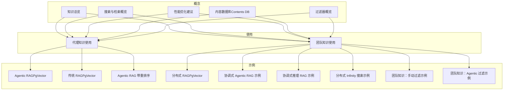
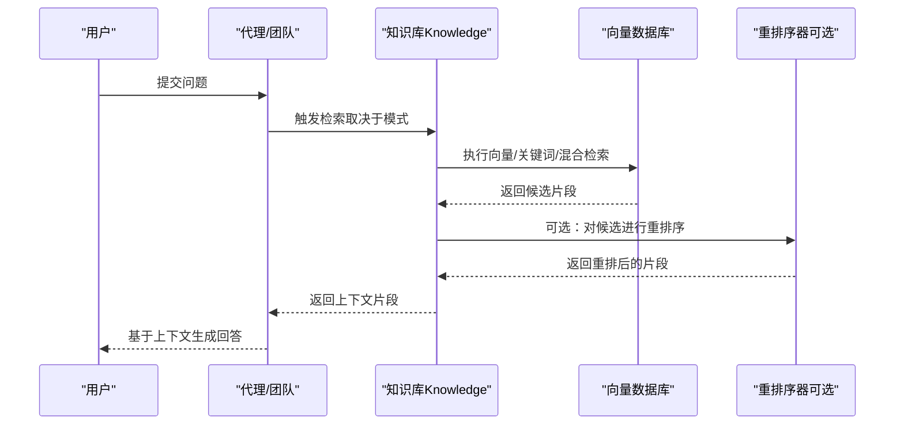
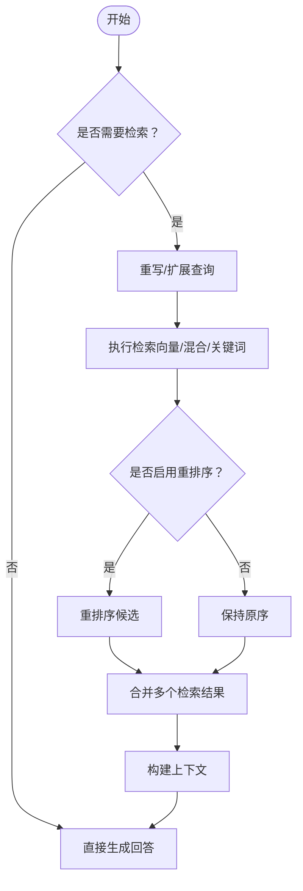
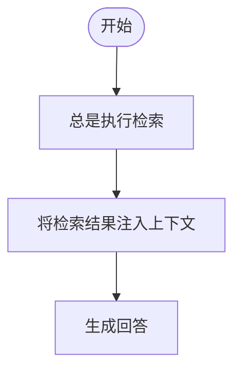
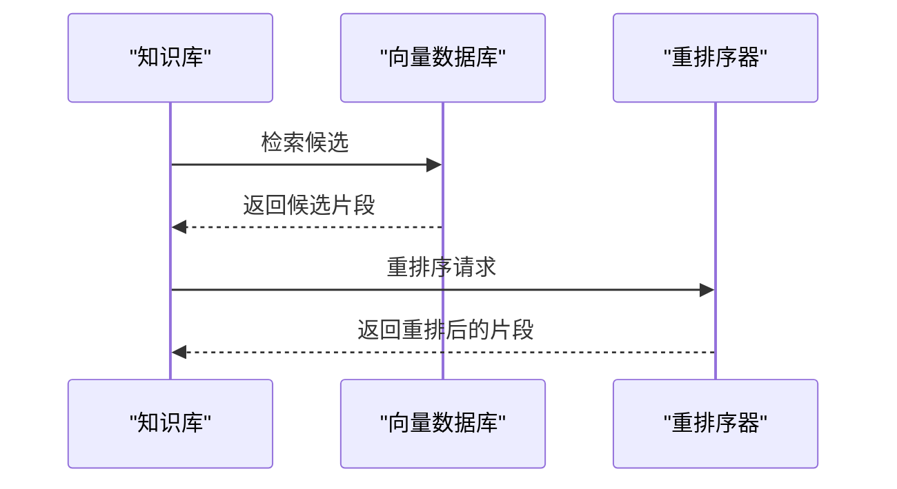
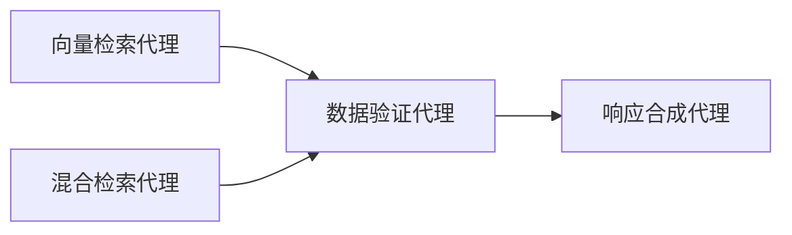
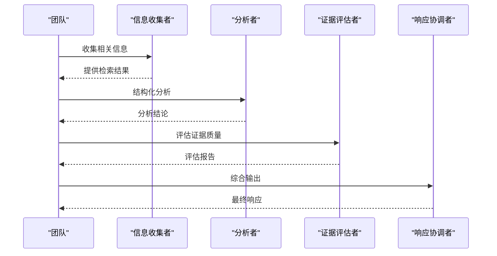
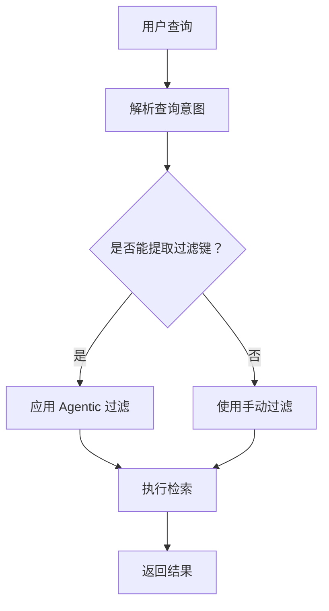
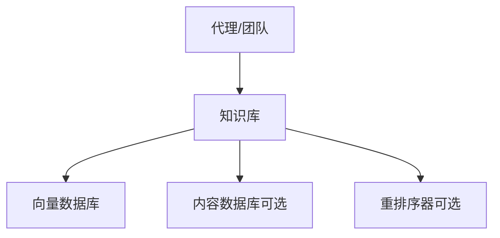

# 知识使用模式

<cite>
**本文引用的文件**
- [知识总览](file://knowledge/overview.mdx)
- [搜索与检索概览](file://knowledge/concepts/search-and-retrieval/overview.mdx)
- [性能优化建议](file://knowledge/concepts/performance-tips.mdx)
- [内容数据库（Contents DB）](file://knowledge/concepts/contents-db.mdx)
- [过滤器概览](file://knowledge/concepts/filters/overview.mdx)
- [团队知识总览](file://knowledge/teams/overview.mdx)
- [Agentic RAG 示例（PgVector）](file://knowledge/agents/agentic-rag-pgvector.mdx)
- [传统 RAG 示例（PgVector）](file://knowledge/agents/traditional-rag-pgvector.mdx)
- [Agentic RAG 带重排序示例](file://knowledge/agents/agentic-rag-with-reranking.mdx)
- [分布式 RAG（PgVector）](file://knowledge/teams/distributed-rag-pgvector.mdx)
- [协调式 Agentic RAG 示例](file://examples/teams/search-coordination/coordinated-agentic-rag.mdx)
- [协调式推理 RAG 示例](file://examples/teams/search-coordination/coordinated-reasoning-rag.mdx)
- [分布式 Infinity 搜索示例](file://examples/teams/search-coordination/distributed-infinity-search.mdx)
- [团队知识：手动过滤示例](file://examples/teams/knowledge/team-with-knowledge-filters.mdx)
- [团队知识：Agentic 过滤示例](file://examples/teams/knowledge/team-with-agentic-knowledge-filters.mdx)
- [会话指标概览](file://sessions/metrics/overview.mdx)
- [指标接口定义（获取）](file://reference-api/schema/metrics/get-agentos-metrics.mdx)
- [指标接口定义（刷新）](file://reference-api/schema/metrics/refresh-metrics.mdx)
</cite>

## 目录
1. [简介](#简介)
2. [项目结构](#项目结构)
3. [核心组件](#核心组件)
4. [架构总览](#架构总览)
5. [详细组件分析](#详细组件分析)
6. [依赖关系分析](#依赖关系分析)
7. [性能考虑](#性能考虑)
8. [故障排查指南](#故障排查指南)
9. [结论](#结论)
10. [附录](#附录)

## 简介
本指南面向代理与团队在实际业务中高效使用知识系统，覆盖以下使用模式与最佳实践：
- Agentic RAG：由代理自主决定何时检索、如何重写查询、是否进行多次检索与合并结果
- 传统 RAG：始终注入上下文，适合固定提示模板与可控输出的场景
- 重新排序（Reranking）：通过重排序模型提升检索结果的排序质量
- 分布式检索：多代理/多知识库协同，实现高吞吐、可扩展的知识检索与合成

同时，文档提供配置要点、性能特征、适用场景、集成示例、优化技巧、缓存策略与性能调优方法，并解释如何监控知识使用的效率与效果。

## 项目结构
围绕“知识”主题，仓库提供了从概念到示例、从单体代理到团队协作的完整路径：
- 概念层：知识工作流、向量数据库、内容数据库、检索与过滤、性能优化
- 使用层：代理与团队如何接入知识系统、如何选择检索模式
- 示例层：Agentic RAG、传统 RAG、带重排序的 Agentic RAG、分布式检索、协调式检索与推理

图表来源
- [知识总览](file://knowledge/overview.mdx)
- [搜索与检索概览](file://knowledge/concepts/search-and-retrieval/overview.mdx)
- [性能优化建议](file://knowledge/concepts/performance-tips.mdx)
- [内容数据库（Contents DB）](file://knowledge/concepts/contents-db.mdx)
- [过滤器概览](file://knowledge/concepts/filters/overview.mdx)
- [团队知识总览](file://knowledge/teams/overview.mdx)
- [Agentic RAG 示例（PgVector）](file://knowledge/agents/agentic-rag-pgvector.mdx)
- [传统 RAG 示例（PgVector）](file://knowledge/agents/traditional-rag-pgvector.mdx)
- [Agentic RAG 带重排序示例](file://knowledge/agents/agentic-rag-with-reranking.mdx)
- [分布式 RAG（PgVector）](file://knowledge/teams/distributed-rag-pgvector.mdx)
- [协调式 Agentic RAG 示例](file://examples/teams/search-coordination/coordinated-agentic-rag.mdx)
- [协调式推理 RAG 示例](file://examples/teams/search-coordination/coordinated-reasoning-rag.mdx)
- [分布式 Infinity 搜索示例](file://examples/teams/search-coordination/distributed-infinity-search.mdx)
- [团队知识：手动过滤示例](file://examples/teams/knowledge/team-with-knowledge-filters.mdx)
- [团队知识：Agentic 过滤示例](file://examples/teams/knowledge/team-with-agentic-knowledge-filters.mdx)

章节来源
- [知识总览](file://knowledge/overview.mdx)
- [团队知识总览](file://knowledge/teams/overview.mdx)

## 核心组件
- 知识库（Knowledge）
  - 内容摄取：支持多种 Reader（PDF、DOCX、CSV、Markdown 等），统一解析为可检索文本
  - 分块与嵌入：按策略分块后生成向量嵌入，存储于向量数据库
  - 检索与召回：支持向量、关键词、混合检索；可选重排序器优化排序
- 向量数据库（Vector DB）
  - 支持本地（LanceDB、ChromaDB）与托管服务（PgVector、Pinecone、Weaviate 等）
- 内容数据库（Contents DB）
  - 记录内容元数据、处理状态、访问计数等，支撑过滤、更新、删除与 UI 管理
- 代理与团队
  - 代理：默认启用 Agentic RAG，可按需切换为传统 RAG 或自定义检索器
  - 团队：多角色协同，共享知识库或隔离检索，支持分布式与协调式检索

章节来源
- [知识总览](file://knowledge/overview.mdx)
- [搜索与检索概览](file://knowledge/concepts/search-and-retrieval/overview.mdx)
- [内容数据库（Contents DB）](file://knowledge/concepts/contents-db.mdx)

## 架构总览
下图展示了从用户查询到最终响应的关键流程，以及不同检索模式的差异：

图表来源
- [搜索与检索概览](file://knowledge/concepts/search-and-retrieval/overview.mdx)
- [Agentic RAG 示例（PgVector）](file://knowledge/agents/agentic-rag-pgvector.mdx)
- [Agentic RAG 带重排序示例](file://knowledge/agents/agentic-rag-with-reranking.mdx)
- [分布式 RAG（PgVector）](file://knowledge/teams/distributed-rag-pgvector.mdx)

## 详细组件分析

### 模式一：Agentic RAG（代理自主检索）
- 特点
  - 代理根据上下文判断是否需要检索、是否需要重写查询、是否需要多次检索
  - 更贴近真实对话与复杂任务，减少不必要的上下文注入
- 配置要点
  - 默认启用：提供 knowledge 即启用 Agentic RAG
  - 可选：自定义检索器函数以控制检索行为
- 适用场景
  - 多轮对话、复杂任务分解、需要动态上下文的问答
- 示例参考
  - [Agentic RAG 示例（PgVector）](file://knowledge/agents/agentic-rag-pgvector.mdx)
  - [Agentic RAG 带重排序示例](file://knowledge/agents/agentic-rag-with-reranking.mdx)

图表来源
- [搜索与检索概览](file://knowledge/concepts/search-and-retrieval/overview.mdx)
- [Agentic RAG 示例（PgVector）](file://knowledge/agents/agentic-rag-pgvector.mdx)

章节来源
- [Agentic RAG 示例（PgVector）](file://knowledge/agents/agentic-rag-pgvector.mdx)
- [Agentic RAG 带重排序示例](file://knowledge/agents/agentic-rag-with-reranking.mdx)

### 模式二：传统 RAG（始终注入上下文）
- 特点
  - 不论是否需要，总是将检索到的内容注入到提示词中
  - 适合固定模板、可控输出与简单问答
- 配置要点
  - 关闭自动检索：search_knowledge=False
  - 开启上下文注入：add_knowledge_to_context=True
- 适用场景
  - 严格提示工程、合规性要求强、输出格式固定的场景
- 示例参考
  - [传统 RAG 示例（PgVector）](file://knowledge/agents/traditional-rag-pgvector.mdx)

图表来源
- [传统 RAG 示例（PgVector）](file://knowledge/agents/traditional-rag-pgvector.mdx)

章节来源
- [传统 RAG 示例（PgVector）](file://knowledge/agents/traditional-rag-pgvector.mdx)

### 模式三：重新排序（Reranking）
- 特点
  - 在检索后对候选结果进行细粒度重排，提升排序质量
  - 常与混合检索配合使用
- 配置要点
  - 选择合适的重排序器（如 Cohere、Infinity）
  - 调整 top_n 与模型参数
- 适用场景
  - 对排序质量敏感的应用（如法律、医疗、技术文档）
- 示例参考
  - [Agentic RAG 带重排序示例](file://knowledge/agents/agentic-rag-with-reranking.mdx)
  - [分布式 Infinity 搜索示例](file://examples/teams/search-coordination/distributed-infinity-search.mdx)

图表来源
- [Agentic RAG 带重排序示例](file://knowledge/agents/agentic-rag-with-reranking.mdx)
- [分布式 Infinity 搜索示例](file://examples/teams/search-coordination/distributed-infinity-search.mdx)

章节来源
- [Agentic RAG 带重排序示例](file://knowledge/agents/agentic-rag-with-reranking.mdx)
- [分布式 Infinity 搜索示例](file://examples/teams/search-coordination/distributed-infinity-search.mdx)

### 模式四：分布式检索（多代理/多知识库）
- 特点
  - 多个专门化代理并行检索，再由验证与合成代理统一输出
  - 可结合不同向量数据库与检索策略（向量、混合）
- 配置要点
  - 为每个代理配置独立的知识库实例
  - 明确各角色职责（检索、验证、合成）
- 适用场景
  - 大规模知识库、高并发检索、企业级生产环境
- 示例参考
  - [分布式 RAG（PgVector）](file://knowledge/teams/distributed-rag-pgvector.mdx)

图表来源
- [分布式 RAG（PgVector）](file://knowledge/teams/distributed-rag-pgvector.mdx)

章节来源
- [分布式 RAG（PgVector）](file://knowledge/teams/distributed-rag-pgvector.mdx)

### 模式五：协调式检索与推理（团队）
- 特点
  - 团队成员分工明确：信息收集、逻辑分析、证据评估、响应协调
  - 可结合推理工具，展示推理链路
- 配置要点
  - 为每个角色设计清晰指令
  - 可开启显示完整推理过程
- 适用场景
  - 需要透明推理过程与高质量合成输出的任务
- 示例参考
  - [协调式 Agentic RAG 示例](file://examples/teams/search-coordination/coordinated-agentic-rag.mdx)
  - [协调式推理 RAG 示例](file://examples/teams/search-coordination/coordinated-reasoning-rag.mdx)

图表来源
- [协调式 Agentic RAG 示例](file://examples/teams/search-coordination/coordinated-agentic-rag.mdx)
- [协调式推理 RAG 示例](file://examples/teams/search-coordination/coordinated-reasoning-rag.mdx)

章节来源
- [协调式 Agentic RAG 示例](file://examples/teams/search-coordination/coordinated-agentic-rag.mdx)
- [协调式推理 RAG 示例](file://examples/teams/search-coordination/coordinated-reasoning-rag.mdx)

### 过滤与个性化
- 手动过滤
  - 在创建代理或查询时显式传入 filters
  - 多个条件默认 AND 组合
- Agentic 过滤
  - 由代理从用户查询中自动提取过滤键值
  - 需要 Contents DB 支持可用过滤键枚举
- 适用场景
  - 用户/租户隔离、权限控制、个性化检索
- 示例参考
  - [团队知识：手动过滤示例](file://examples/teams/knowledge/team-with-knowledge-filters.mdx)
  - [团队知识：Agentic 过滤示例](file://examples/teams/knowledge/team-with-agentic-knowledge-filters.mdx)
  - [过滤器概览](file://knowledge/concepts/filters/overview.mdx)

图表来源
- [过滤器概览](file://knowledge/concepts/filters/overview.mdx)
- [团队知识：Agentic 过滤示例](file://examples/teams/knowledge/team-with-agentic-knowledge-filters.mdx)

章节来源
- [过滤器概览](file://knowledge/concepts/filters/overview.mdx)
- [团队知识：手动过滤示例](file://examples/teams/knowledge/team-with-knowledge-filters.mdx)
- [团队知识：Agentic 过滤示例](file://examples/teams/knowledge/team-with-agentic-knowledge-filters.mdx)

## 依赖关系分析
- 组件耦合
  - 代理/团队依赖知识库；知识库依赖向量数据库与可选的内容数据库
  - 重排序器作为知识库的可插拔组件
- 外部依赖
  - 向量数据库：LanceDB、PgVector、Pinecone、Weaviate 等
  - 重排序器：Cohere、Infinity 等
  - 内容数据库：PostgreSQL、SQLite、MongoDB 等

图表来源
- [知识总览](file://knowledge/overview.mdx)
- [内容数据库（Contents DB）](file://knowledge/concepts/contents-db.mdx)
- [搜索与检索概览](file://knowledge/concepts/search-and-retrieval/overview.mdx)

章节来源
- [知识总览](file://knowledge/overview.mdx)
- [内容数据库（Contents DB）](file://knowledge/concepts/contents-db.mdx)
- [搜索与检索概览](file://knowledge/concepts/search-and-retrieval/overview.mdx)

## 性能考虑
- 检索类型选择
  - 向量检索：语义理解强，适合概念性问题
  - 关键词检索：精确匹配，适合术语、编号类问题
  - 混合检索：兼顾语义与精确，推荐生产使用
- 重排序
  - 在混合检索基础上引入重排序器，显著提升排序质量
- 向量数据库选择
  - 开发/测试：LanceDB、ChromaDB
  - 生产：PgVector、Pinecone 等
- 内容加载与批处理
  - 使用异步批量插入、跳过已存在文件、按模式 include/exclude 控制
- 缓存策略
  - 检索结果缓存（基于查询与过滤键）、嵌入缓存（相同文本）
  - 结果重用与去重（同一查询多次命中）
- 监控与度量
  - 使用运行与会话指标统计 token 使用、耗时、错误率等
  - 定期刷新指标接口，便于持续观测

章节来源
- [性能优化建议](file://knowledge/concepts/performance-tips.mdx)
- [会话指标概览](file://sessions/metrics/overview.mdx)
- [指标接口定义（获取）](file://reference-api/schema/metrics/get-agentos-metrics.mdx)
- [指标接口定义（刷新）](file://reference-api/schema/metrics/refresh-metrics.mdx)

## 故障排查指南
- 检索质量差
  - 检查分块大小与策略（固定/语义/递归）
  - 增大 max_results、添加过滤器、尝试语义分块
- 加载慢/内存占用高
  - 使用 skip_if_exists、include/exclude、异步批处理
  - 减小批大小、降低嵌入维度
- 结果不相关
  - 切换检索类型（向量/关键词/混合）
  - 引入重排序器
- 过滤无效
  - 确认内容数据库已启用并正确维护元数据
  - 使用 get_filters() 校验可用过滤键
- 分布式/协调式团队异常
  - 确保各代理知识库连接正常
  - 明确角色职责与指令，必要时开启推理链展示

章节来源
- [性能优化建议](file://knowledge/concepts/performance-tips.mdx)
- [内容数据库（Contents DB）](file://knowledge/concepts/contents-db.mdx)
- [过滤器概览](file://knowledge/concepts/filters/overview.mdx)
- [分布式 RAG（PgVector）](file://knowledge/teams/distributed-rag-pgvector.mdx)
- [协调式推理 RAG 示例](file://examples/teams/search-coordination/coordinated-reasoning-rag.mdx)

## 结论
- 优先采用 Agentic RAG，结合混合检索与重排序，满足大多数业务需求
- 对需要固定输出与合规性的场景，使用传统 RAG 并严格控制上下文注入
- 在大规模与高并发场景，采用分布式检索与团队协调模式
- 通过内容数据库与过滤能力实现个性化与权限控制
- 借助指标体系持续监控与优化知识使用效率与效果

## 附录
- 快速对照表
  - 模式选择：Agentic RAG（默认）、传统 RAG（固定注入）、分布式/协调式（高并发/复杂任务）
  - 检索类型：向量/关键词/混合，混合+重排序为生产首选
  - 过滤方式：手动过滤（显式 filters）、Agentic 过滤（自动提取）
  - 监控指标：token 使用、耗时、错误率、会话度量