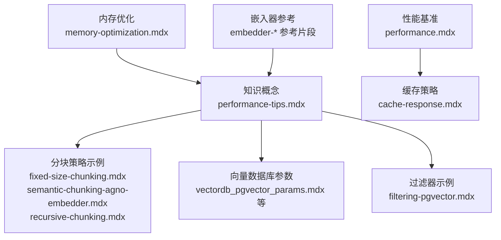
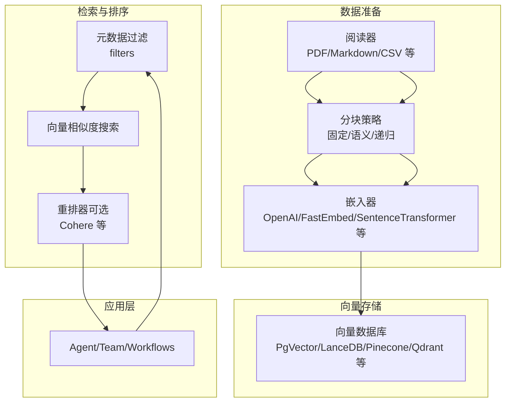
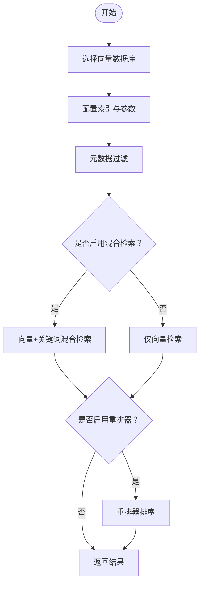
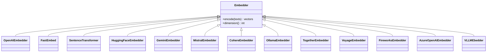
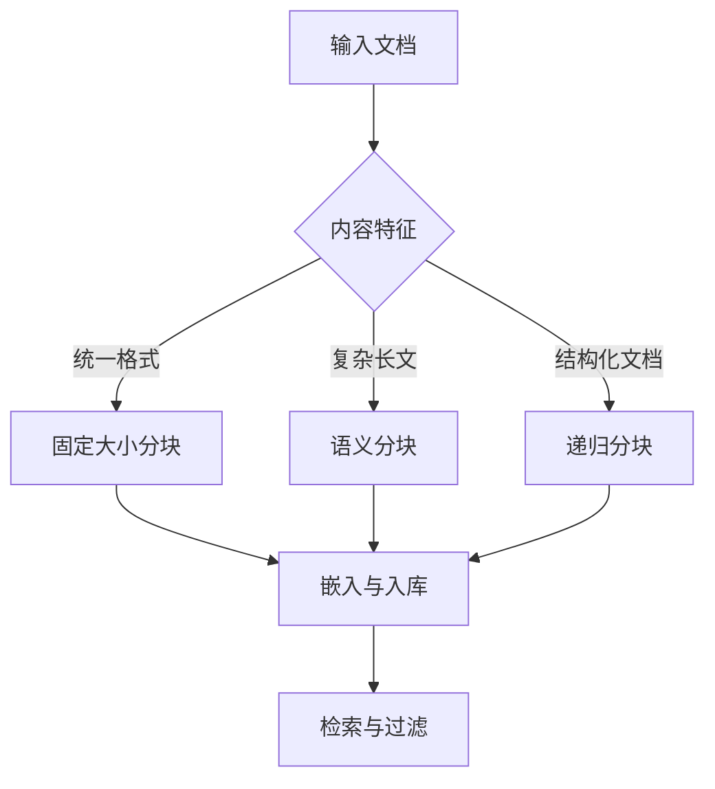
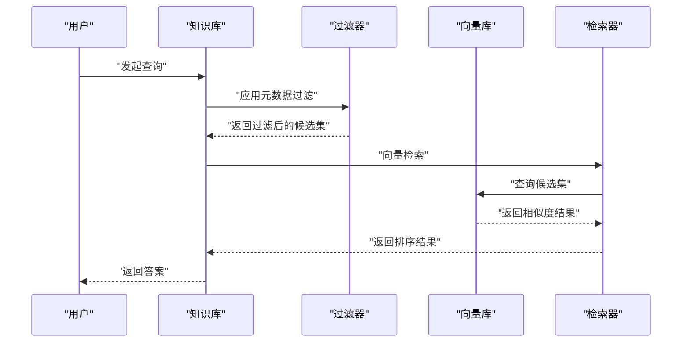
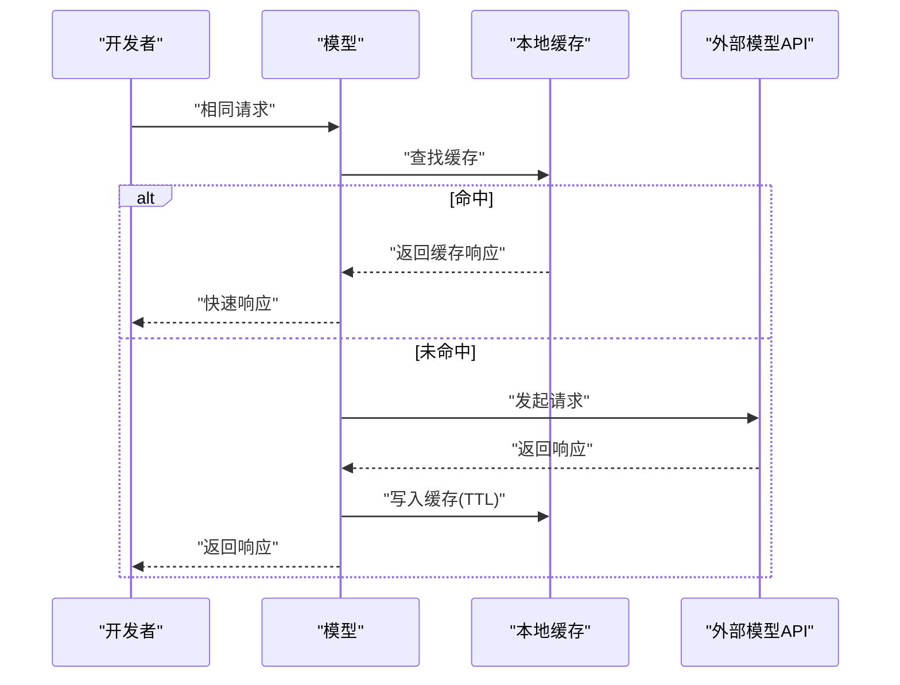
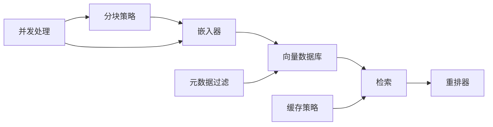

# 知识性能优化

<cite>
**本文引用的文件**
- [performance.mdx](file://performance.mdx)
- [performance-tips.mdx](file://knowledge/concepts/performance-tips.mdx)
- [memory-optimization.mdx](file://memory/working-with-memories/memory-optimization.mdx)
- [cache-response.mdx](file://models/cache-response.mdx)
- [fixed-size-chunking.mdx](file://examples/knowledge/chunking/fixed-size-chunking.mdx)
- [semantic-chunking-agno-embedder.mdx](file://examples/knowledge/chunking/semantic-chunking-agno-embedder.mdx)
- [recursive-chunking.mdx](file://examples/knowledge/chunking/recursive-chunking.mdx)
- [filtering-pgvector.mdx](file://examples/knowledge/filters/vector-dbs/filtering-pgvector.mdx)
- [embedder-openai-reference.mdx](file://_snippets/embedder-openai-reference.mdx)
- [embedder-fastembed-reference.mdx](file://_snippets/embedder-fastembed-reference.mdx)
- [embedder-sentence-transformer-reference.mdx](file://_snippets/embedder-sentence-transformer-reference.mdx)
- [vectordb_pgvector_params.mdx](file://_snippets/vectordb_pgvector_params.mdx)
- [vectordb_cassandra_params.mdx](file://_snippets/vectordb_cassandra_params.mdx)
- [vectordb_chromadb_params.mdx](file://_snippets/vectordb_chromadb_params.mdx)
- [vectordb_clickhouse_params.mdx](file://_snippets/vectordb_clickhouse_params.mdx)
- [vectordb_couchbase_params.mdx](file://_snippets/vectordb_couchbase_params.mdx)
- [vectordb_lancedb_params.mdx](file://_snippets/vectordb_lancedb_params.mdx)
- [vectordb_milvus_params.mdx](file://_snippets/vectordb_milvus_params.mdx)
- [vectordb_mongodb_params.mdx](file://_snippets/vectordb_mongodb_params.mdx)
- [vectordb_pineconedb_params.mdx](file://_snippets/vectordb_pineconedb_params.mdx)
- [vectordb_qdrant_params.mdx](file://_snippets/vectordb_qdrant_params.mdx)
- [vectordb_redis_params.mdx](file://_snippets/vectordb_redis_params.mdx)
- [vectordb_singlestore_params.mdx](file://_snippets/vectordb_singlestore_params.mdx)
- [vectordb_surrealdb_params.mdx](file://_snippets/vectordb_surrealdb_params.mdx)
- [vectordb_weaviate_params.mdx](file://_snippets/vectordb_weaviate_params.mdx)
- [run-pgvector-docker.mdx](file://_snippets/run-pgvector-docker.mdx)
- [run-pgvector-step.mdx](file://_snippets/run-pgvector-step.mdx)
- [session_metrics_params.mdx](file://_snippets/session_metrics_params.mdx)
- [storage-yaml-params.mdx](file://_snippets/storage-yaml-params.mdx)
- [workflow-storage-postgres-params.mdx](file://_snippets/workflow-storage-postgres-params.mdx)
- [memory-postgres-reference.mdx](file://_snippets/memory-postgres-reference.mdx)
- [memory-redis-reference.mdx](file://_snippets/memory-redis-reference.mdx)
- [memory-sqlite-reference.mdx](file://_snippets/memory-sqlite-reference.mdx)
- [memory-mongo-reference.mdx](file://_snippets/memory-mongo-reference.mdx)
- [embedder-vllm-reference.mdx](file://_snippets/embedder-vllm-reference.mdx)
- [embedder-huggingface-reference.mdx](file://_snippets/embedder-huggingface-reference.mdx)
- [embedder-mistral-reference.mdx](file://_snippets/embedder-mistral-reference.mdx)
- [embedder-gemini-reference.mdx](file://_snippets/embedder-gemini-reference.mdx)
- [embedder-cohere-reference.mdx](file://_snippets/embedder-cohere-reference.mdx)
- [embedder-ollama-reference.mdx](file://_snippets/embedder-ollama-reference.mdx)
- [embedder-together-reference.mdx](file://_snippets/embedder-together-reference.mdx)
- [embedder-voyageai-reference.mdx](file://_snippets/embedder-voyageai-reference.mdx)
- [embedder-fireworks-reference.mdx](file://_snippets/embedder-fireworks-reference.mdx)
- [embedder-azure-openai-reference.mdx](file://_snippets/embedder-azure-openai-reference.mdx)
- [chunking-fixed-size.mdx](file://_snippets/chunking-fixed-size.mdx)
- [chunking-semantic.mdx](file://_snippets/chunking-semantic.mdx)
- [chunking-recursive.mdx](file://_snippets/chunking-recursive.mdx)
- [chunking-agentic.mdx](file://_snippets/chunking-agentic.mdx)
- [chunking-code.mdx](file://_snippets/chunking-code.mdx)
- [chunking-csv-row.mdx](file://_snippets/chunking-csv-row.mdx)
- [chunking-custom.mdx](file://_snippets/chunking-custom.mdx)
- [chunking-document.mdx](file://_snippets/chunking-document.mdx)
- [chunking-markdown.mdx](file://_snippets/chunking-markdown.mdx)
</cite>

## 目录
1. [简介](#简介)
2. [项目结构](#项目结构)
3. [核心组件](#核心组件)
4. [架构总览](#架构总览)
5. [详细组件分析](#详细组件分析)
6. [依赖关系分析](#依赖关系分析)
7. [性能考量](#性能考量)
8. [故障排查指南](#故障排查指南)
9. [结论](#结论)
10. [附录](#附录)

## 简介
本技术指南聚焦于知识管理系统的性能优化，围绕向量数据库查询优化、嵌入器性能提升、分块策略调优与过滤器效率改进展开，配套提供性能监控指标、基准测试方法、容量规划建议，以及缓存策略、索引优化与并发处理的最佳实践，并结合大规模知识库的部署与运维经验，帮助读者在不同规模与场景下实现稳定、高效的知识检索与问答。

## 项目结构
本仓库以“知识”为核心主题，涵盖概念文档、示例与参考片段，形成从原理到实操的完整知识体系。与性能优化直接相关的模块包括：
- 知识概念：性能提示、分块策略、向量数据库、过滤器等
- 示例：固定大小分块、语义分块、递归分块等
- 参考：各嵌入器与向量数据库参数与配置说明
- 缓存与内存：模型响应缓存、记忆优化

图表来源
- [performance-tips.mdx](file://knowledge/concepts/performance-tips.mdx)
- [fixed-size-chunking.mdx](file://examples/knowledge/chunking/fixed-size-chunking.mdx)
- [semantic-chunking-agno-embedder.mdx](file://examples/knowledge/chunking/semantic-chunking-agno-embedder.mdx)
- [recursive-chunking.mdx](file://examples/knowledge/chunking/recursive-chunking.mdx)
- [filtering-pgvector.mdx](file://examples/knowledge/filters/vector-dbs/filtering-pgvector.mdx)
- [performance.mdx](file://performance.mdx)
- [cache-response.mdx](file://models/cache-response.mdx)
- [memory-optimization.mdx](file://memory/working-with-memories/memory-optimization.mdx)
- [embedder-openai-reference.mdx](file://_snippets/embedder-openai-reference.mdx)
- [embedder-fastembed-reference.mdx](file://_snippets/embedder-fastembed-reference.mdx)
- [embedder-sentence-transformer-reference.mdx](file://_snippets/embedder-sentence-transformer-reference.mdx)
- [vectordb_pgvector_params.mdx](file://_snippets/vectordb_pgvector_params.mdx)

章节来源
- [performance-tips.mdx](file://knowledge/concepts/performance-tips.mdx)
- [performance.mdx](file://performance.mdx)

## 核心组件
- 向量数据库与索引
  - 支持多种向量数据库（如 PgVector、LanceDB、ChromaDB、Pinecone、Qdrant、Milvus、MongoDB Atlas、Cassandra、ClickHouse、Redis、SingleStore、SurrealDB、Weaviate 等），通过参数化配置实现快速切换与扩展。
  - 建议在生产环境优先考虑具备良好扩展性与生态支持的方案（如 PgVector）。
- 分块策略
  - 固定大小分块：吞吐高、一致性好，适合统一内容类型。
  - 语义分块：上下文质量更佳，但计算成本更高。
  - 递归分块：兼顾结构化文档与速度。
- 过滤器与元数据
  - 在入库与检索阶段使用元数据过滤，缩小搜索空间，显著降低查询延迟。
- 嵌入器
  - 提供多厂商与开源嵌入器参考（OpenAI、FastEmbed、SentenceTransformer、HuggingFace、Gemini、Mistral、Cohere、Ollama、Together、Voyage、Fireworks、Azure OpenAI、VLLM 等），可按性能与成本权衡选择。
- 缓存与并发
  - 模型响应缓存用于开发与测试阶段减少重复调用；异步批量操作提升吞吐。
- 内存与会话
  - 记忆优化与会话存储策略有助于控制上下文长度与检索开销。

章节来源
- [performance-tips.mdx](file://knowledge/concepts/performance-tips.mdx)
- [cache-response.mdx](file://models/cache-response.mdx)
- [memory-optimization.mdx](file://memory/working-with-memories/memory-optimization.mdx)
- [embedder-openai-reference.mdx](file://_snippets/embedder-openai-reference.mdx)
- [embedder-fastembed-reference.mdx](file://_snippets/embedder-fastembed-reference.mdx)
- [embedder-sentence-transformer-reference.mdx](file://_snippets/embedder-sentence-transformer-reference.mdx)
- [vectordb_pgvector_params.mdx](file://_snippets/vectordb_pgvector_params.mdx)

## 架构总览
下图展示知识检索的关键路径：内容加载与分块 → 嵌入生成 → 向量入库 → 元数据过滤 → 向量检索 → 结果重排（可选）→ 返回结果。

图表来源
- [performance-tips.mdx](file://knowledge/concepts/performance-tips.mdx)
- [fixed-size-chunking.mdx](file://examples/knowledge/chunking/fixed-size-chunking.mdx)
- [semantic-chunking-agno-embedder.mdx](file://examples/knowledge/chunking/semantic-chunking-agno-embedder.mdx)
- [recursive-chunking.mdx](file://examples/knowledge/chunking/recursive-chunking.mdx)
- [filtering-pgvector.mdx](file://examples/knowledge/filters/vector-dbs/filtering-pgvector.mdx)
- [embedder-openai-reference.mdx](file://_snippets/embedder-openai-reference.mdx)
- [embedder-fastembed-reference.mdx](file://_snippets/embedder-fastembed-reference.mdx)
- [embedder-sentence-transformer-reference.mdx](file://_snippets/embedder-sentence-transformer-reference.mdx)
- [vectordb_pgvector_params.mdx](file://_snippets/vectordb_pgvector_params.mdx)

## 详细组件分析

### 向量数据库查询优化
- 选择合适的数据库
  - 开发/测试：零配置的 LanceDB/ChromaDB
  - 生产：PgVector（支持 SQL、扩展性好）
  - 托管服务：Pinecone（自动伸缩）
- 参数与索引
  - 使用参数化配置文件进行部署与迁移（如 PgVector、Cassandra、Qdrant、Milvus、MongoDB、ClickHouse、Redis、SingleStore、SurrealDB、Weaviate 等）
  - 针对检索维度设置合适索引策略（如 HNSW、IVF、Flat 等），并结合向量维度与数据规模调整
- 检索策略
  - 关键路径：先过滤后检索，缩小候选集
  - 可选混合检索（向量+关键词）与重排器提升排序质量

图表来源
- [performance-tips.mdx](file://knowledge/concepts/performance-tips.mdx)
- [filtering-pgvector.mdx](file://examples/knowledge/filters/vector-dbs/filtering-pgvector.mdx)
- [vectordb_pgvector_params.mdx](file://_snippets/vectordb_pgvector_params.mdx)
- [vectordb_cassandra_params.mdx](file://_snippets/vectordb_cassandra_params.mdx)
- [vectordb_qdrant_params.mdx](file://_snippets/vectordb_qdrant_params.mdx)
- [vectordb_milvus_params.mdx](file://_snippets/vectordb_milvus_params.mdx)
- [vectordb_mongodb_params.mdx](file://_snippets/vectordb_mongodb_params.mdx)
- [vectordb_clickhouse_params.mdx](file://_snippets/vectordb_clickhouse_params.mdx)
- [vectordb_redis_params.mdx](file://_snippets/vectordb_redis_params.mdx)
- [vectordb_singlestore_params.mdx](file://_snippets/vectordb_singlestore_params.mdx)
- [vectordb_surrealdb_params.mdx](file://_snippets/vectordb_surrealdb_params.mdx)
- [vectordb_weaviate_params.mdx](file://_snippets/vectordb_weaviate_params.mdx)

章节来源
- [performance-tips.mdx](file://knowledge/concepts/performance-tips.mdx)
- [filtering-pgvector.mdx](file://examples/knowledge/filters/vector-dbs/filtering-pgvector.mdx)

### 嵌入器性能提升
- 厂商与开源嵌入器对比
  - OpenAI、FastEmbed、SentenceTransformer、HuggingFace、Gemini、Mistral、Cohere、Ollama、Together、Voyage、Fireworks、Azure OpenAI、VLLM 等
- 维度与成本权衡
  - 适当降低嵌入维度可在保证质量的同时提升检索速度
- 异步批处理
  - 对大批量文本进行异步嵌入，提高吞吐

图表来源
- [embedder-openai-reference.mdx](file://_snippets/embedder-openai-reference.mdx)
- [embedder-fastembed-reference.mdx](file://_snippets/embedder-fastembed-reference.mdx)
- [embedder-sentence-transformer-reference.mdx](file://_snippets/embedder-sentence-transformer-reference.mdx)
- [embedder-huggingface-reference.mdx](file://_snippets/embedder-huggingface-reference.mdx)
- [embedder-gemini-reference.mdx](file://_snippets/embedder-gemini-reference.mdx)
- [embedder-mistral-reference.mdx](file://_snippets/embedder-mistral-reference.mdx)
- [embedder-cohere-reference.mdx](file://_snippets/embedder-cohere-reference.mdx)
- [embedder-ollama-reference.mdx](file://_snippets/embedder-ollama-reference.mdx)
- [embedder-together-reference.mdx](file://_snippets/embedder-together-reference.mdx)
- [embedder-voyageai-reference.mdx](file://_snippets/embedder-voyageai-reference.mdx)
- [embedder-fireworks-reference.mdx](file://_snippets/embedder-fireworks-reference.mdx)
- [embedder-azure-openai-reference.mdx](file://_snippets/embedder-azure-openai-reference.mdx)
- [embedder-vllm-reference.mdx](file://_snippets/embedder-vllm-reference.mdx)

章节来源
- [embedder-openai-reference.mdx](file://_snippets/embedder-openai-reference.mdx)
- [embedder-fastembed-reference.mdx](file://_snippets/embedder-fastembed-reference.mdx)
- [embedder-sentence-transformer-reference.mdx](file://_snippets/embedder-sentence-transformer-reference.mdx)
- [performance-tips.mdx](file://knowledge/concepts/performance-tips.mdx)

### 分块策略调优
- 固定大小分块
  - 速度快、易实现，适合统一格式文档
- 语义分块
  - 更贴合上下文，适合复杂长文档
- 递归分块
  - 面向结构化文档，兼顾速度与质量
- 实践要点
  - 控制 chunk_size 与 overlap，避免过大导致检索冗余或过小导致上下文不完整
  - 在入库前使用 include/exclude 与 skip_if_exists 减少重复处理

图表来源
- [fixed-size-chunking.mdx](file://examples/knowledge/chunking/fixed-size-chunking.mdx)
- [semantic-chunking-agno-embedder.mdx](file://examples/knowledge/chunking/semantic-chunking-agno-embedder.mdx)
- [recursive-chunking.mdx](file://examples/knowledge/chunking/recursive-chunking.mdx)
- [chunking-fixed-size.mdx](file://_snippets/chunking-fixed-size.mdx)
- [chunking-semantic.mdx](file://_snippets/chunking-semantic.mdx)
- [chunking-recursive.mdx](file://_snippets/chunking-recursive.mdx)
- [chunking-agentic.mdx](file://_snippets/chunking-agentic.mdx)
- [chunking-code.mdx](file://_snippets/chunking-code.mdx)
- [chunking-csv-row.mdx](file://_snippets/chunking-csv-row.mdx)
- [chunking-custom.mdx](file://_snippets/chunking-custom.mdx)
- [chunking-document.mdx](file://_snippets/chunking-document.mdx)
- [chunking-markdown.mdx](file://_snippets/chunking-markdown.mdx)

章节来源
- [fixed-size-chunking.mdx](file://examples/knowledge/chunking/fixed-size-chunking.mdx)
- [semantic-chunking-agno-embedder.mdx](file://examples/knowledge/chunking/semantic-chunking-agno-embedder.mdx)
- [recursive-chunking.mdx](file://examples/knowledge/chunking/recursive-chunking.mdx)
- [chunking-fixed-size.mdx](file://_snippets/chunking-fixed-size.mdx)
- [chunking-semantic.mdx](file://_snippets/chunking-semantic.mdx)
- [chunking-recursive.mdx](file://_snippets/chunking-recursive.mdx)

### 过滤器效率改进
- 元数据过滤先行
  - 在检索前根据部门、类型、时间范围等元数据缩小候选集，显著降低向量检索压力
- 过滤验证
  - 使用 validate_filters 检测无效键，避免误匹配与额外开销
- 并发加载
  - 使用异步批量插入（如 ainsert）提升入库吞吐

图表来源
- [performance-tips.mdx](file://knowledge/concepts/performance-tips.mdx)
- [filtering-pgvector.mdx](file://examples/knowledge/filters/vector-dbs/filtering-pgvector.mdx)

章节来源
- [performance-tips.mdx](file://knowledge/concepts/performance-tips.mdx)
- [filtering-pgvector.mdx](file://examples/knowledge/filters/vector-dbs/filtering-pgvector.mdx)

### 缓存策略与并发处理
- 模型响应缓存
  - 适用于开发与测试，避免重复 API 调用，节省成本与等待时间
  - 支持 TTL 与自定义缓存目录，注意生产环境慎用
- 并发与批处理
  - 使用 asyncio.gather 并行执行多个 insert/ainsert，提升吞吐
- 内存优化
  - 对历史记忆进行总结与压缩，降低上下文长度与检索成本

图表来源
- [cache-response.mdx](file://models/cache-response.mdx)

章节来源
- [cache-response.mdx](file://models/cache-response.mdx)
- [memory-optimization.mdx](file://memory/working-with-memories/memory-optimization.mdx)

## 依赖关系分析
- 组件耦合
  - 知识检索链路中，分块策略与嵌入器直接影响向量库大小与检索质量；过滤器与索引配置决定查询延迟；缓存与并发策略影响端到端吞吐。
- 外部依赖
  - 向量数据库与嵌入器供应商的稳定性与扩展性是关键；参数化配置文件便于迁移与复用。
- 循环依赖
  - 文档与示例之间为单向依赖，无循环风险。

图表来源
- [performance-tips.mdx](file://knowledge/concepts/performance-tips.mdx)
- [cache-response.mdx](file://models/cache-response.mdx)
- [memory-optimization.mdx](file://memory/working-with-memories/memory-optimization.mdx)

章节来源
- [performance-tips.mdx](file://knowledge/concepts/performance-tips.mdx)
- [cache-response.mdx](file://models/cache-response.mdx)
- [memory-optimization.mdx](file://memory/working-with-memories/memory-optimization.mdx)

## 性能考量
- 监控指标
  - 搜索耗时、失败内容统计、内存占用、吞吐量（请求/秒）、缓存命中率
- 基准测试
  - 使用官方基准脚本与视频演示，对比不同框架的实例化时间与内存占用，关注最小化开销与并行化工具调用
- 容量规划
  - 依据数据规模与查询峰值，评估向量维度、索引类型、并发连接数与存储容量；生产优先 PgVector 或托管向量服务
- 最佳实践
  - 先过滤后检索、异步批处理、适度降低嵌入维度、定期清理与重排、缓存仅用于开发测试

章节来源
- [performance.mdx](file://performance.mdx)
- [performance-tips.mdx](file://knowledge/concepts/performance-tips.mdx)

## 故障排查指南
- 慢搜索
  - 检查是否缺少元数据过滤、分块策略是否匹配内容类型、是否启用混合检索与重排器
- 内存问题
  - 减小 chunk_size、限制并发、清理旧内容、使用记忆优化
- 过滤无效
  - 使用 validate_filters 检测无效键，修正元数据字段
- 嵌入成本过高
  - 降低嵌入维度、选择更高效的嵌入器、缓存开发期响应

章节来源
- [performance-tips.mdx](file://knowledge/concepts/performance-tips.mdx)
- [memory-optimization.mdx](file://memory/working-with-memories/memory-optimization.mdx)
- [cache-response.mdx](file://models/cache-response.mdx)

## 结论
通过合理的分块策略、嵌入器选择与向量数据库配置，配合元数据过滤、索引优化与并发处理，可以在不同规模的知识库上获得稳定且高效的检索性能。同时，借助缓存策略与内存优化，能够在开发与生产环境中平衡成本与体验。建议以 PgVector 作为生产首选，并结合实际业务场景持续迭代参数与策略。

## 附录
- 部署与运行
  - 可参考 PgVector 的 Docker 启动步骤与参数配置，确保本地与 CI 环境一致
- 存储与会话
  - 会话与持久化存储可通过 YAML 参数与 Postgres/Redis/SQLite/MongoDB 等配置，按需选择

章节来源
- [run-pgvector-docker.mdx](file://_snippets/run-pgvector-docker.mdx)
- [run-pgvector-step.mdx](file://_snippets/run-pgvector-step.mdx)
- [session_metrics_params.mdx](file://_snippets/session_metrics_params.mdx)
- [storage-yaml-params.mdx](file://_snippets/storage-yaml-params.mdx)
- [workflow-storage-postgres-params.mdx](file://_snippets/workflow-storage-postgres-params.mdx)
- [memory-postgres-reference.mdx](file://_snippets/memory-postgres-reference.mdx)
- [memory-redis-reference.mdx](file://_snippets/memory-redis-reference.mdx)
- [memory-sqlite-reference.mdx](file://_snippets/memory-sqlite-reference.mdx)
- [memory-mongo-reference.mdx](file://_snippets/memory-mongo-reference.mdx)