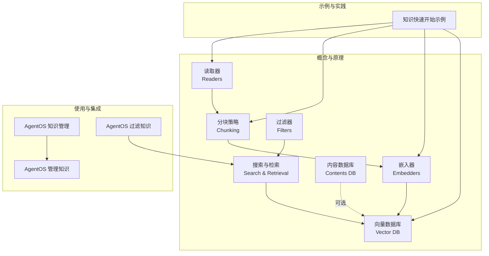
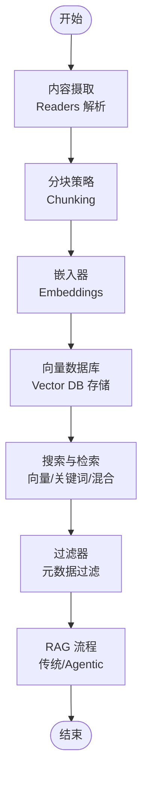
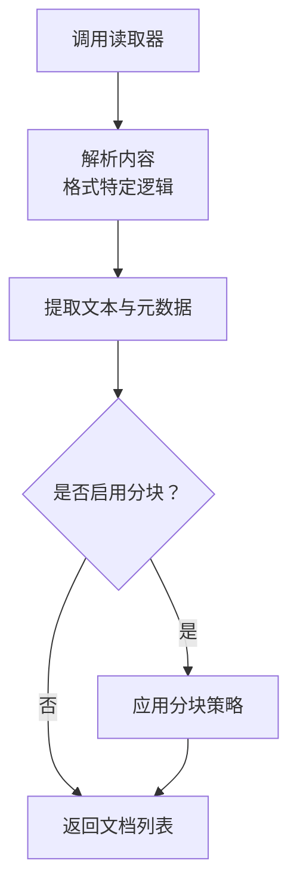
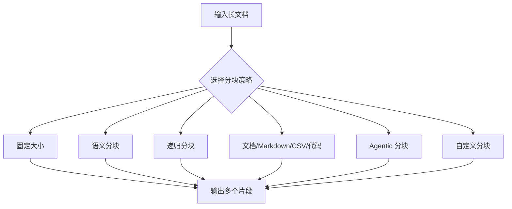
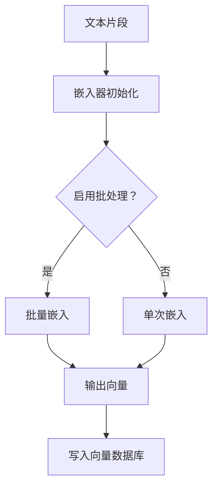
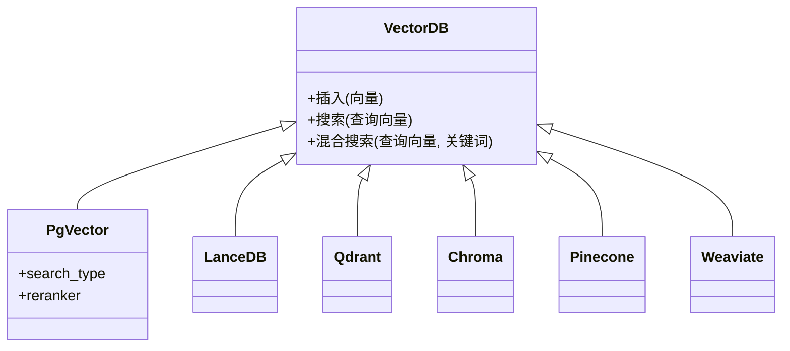
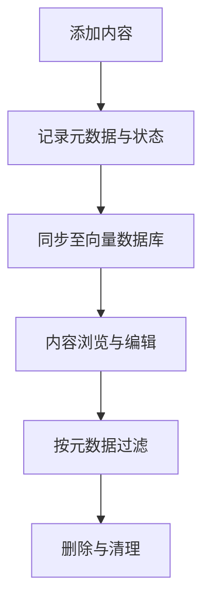
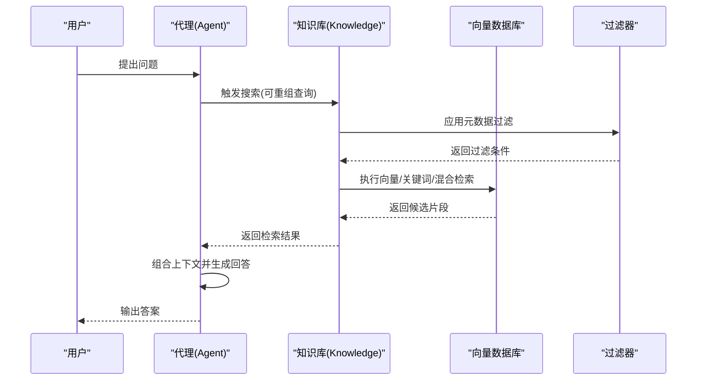
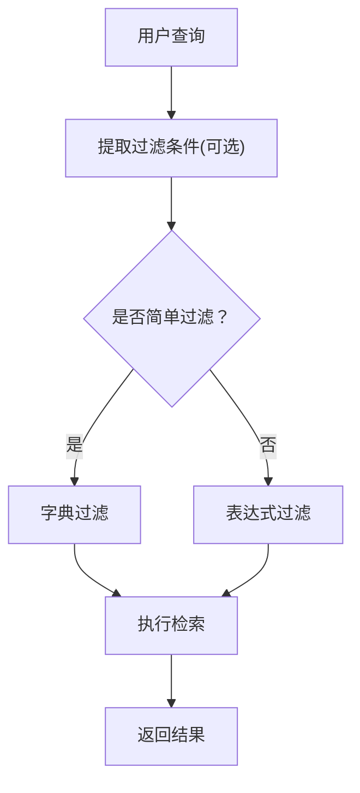
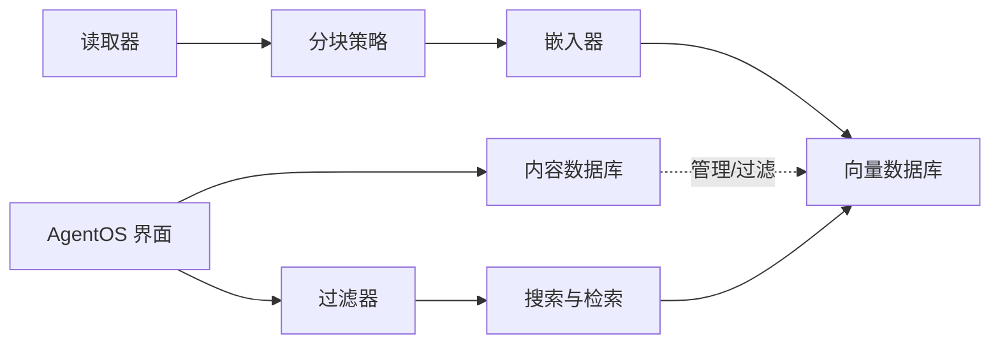

# 知识管理基础概念

<cite>
**本文引用的文件**
- [知识总览](file://knowledge/overview.mdx)
- [向量数据库](file://knowledge/concepts/vector-db.mdx)
- [内容数据库](file://knowledge/concepts/contents-db.mdx)
- [搜索与检索概览](file://knowledge/concepts/search-and-retrieval/overview.mdx)
- [读取器概览](file://knowledge/concepts/readers/overview.mdx)
- [分块策略概览](file://knowledge/concepts/chunking/overview.mdx)
- [嵌入器概览](file://knowledge/concepts/embedder/overview.mdx)
- [过滤器概览](file://knowledge/concepts/filters/overview.mdx)
- [AgentOS 知识管理](file://agent-os/features/knowledge-management.mdx)
- [AgentOS 管理知识](file://agent-os/knowledge/manage-knowledge.mdx)
- [AgentOS 过滤知识](file://agent-os/knowledge/filter-knowledge.mdx)
- [知识术语](file://knowledge/terminology.mdx)
- [知识快速开始示例](file://examples/knowledge/quickstart.mdx)
</cite>

## 目录
1. [引言](#引言)
2. [项目结构](#项目结构)
3. [核心组件](#核心组件)
4. [架构总览](#架构总览)
5. [详细组件分析](#详细组件分析)
6. [依赖关系分析](#依赖关系分析)
7. [性能考量](#性能考量)
8. [故障排查指南](#故障排查指南)
9. [结论](#结论)
10. [附录](#附录)

## 引言
本技术文档围绕知识管理的基础概念展开，系统阐述向量数据库、内容数据库、搜索与检索、读取器、分块策略、嵌入器与过滤器等关键组件的职责、交互方式与最佳实践，并对比传统 RAG 与 Agentic RAG 的差异及适用场景。文档同时给出内容摄取、分块与嵌入、搜索与检索的工作流程图与代码示例路径，帮助开发者快速理解并落地知识管理的整体架构。

## 项目结构
知识管理相关文档分布在以下主题域：
- 概念与原理：向量数据库、内容数据库、搜索与检索、读取器、分块策略、嵌入器、过滤器
- 使用与集成：AgentOS 知识管理界面、AgentOS 管理知识、AgentOS 过滤知识
- 快速上手与示例：知识快速开始示例
- 术语与关系：知识术语中总结了组件间的关系与典型流水线

**章节来源**
- [知识总览:29-37](file://knowledge/overview.mdx#L29-L37)
- [AgentOS 知识管理:1-78](file://agent-os/features/knowledge-management.mdx#L1-L78)
- [AgentOS 管理知识:1-129](file://agent-os/knowledge/manage-knowledge.mdx#L1-L129)
- [AgentOS 过滤知识:1-310](file://agent-os/knowledge/filter-knowledge.mdx#L1-L310)
- [知识术语:69-71](file://knowledge/terminology.mdx#L69-L71)

## 核心组件
- 读取器（Readers）：负责从文件、URL、文本等来源解析并抽取可搜索的文档对象，支持多种格式与自定义配置。
- 分块策略（Chunking）：将长文档按语义或规则切分为更小的片段，提升检索精度与上下文匹配能力。
- 嵌入器（Embedders）：将文本转换为向量，使语义相似的内容在向量空间中靠近，支撑向量检索。
- 向量数据库（Vector DB）：存储向量与元数据，提供向量相似度检索、关键词检索与混合检索。
- 内容数据库（Contents DB）：可选地跟踪已添加内容的元数据、状态与处理进度，支持删除、更新与基于元数据的过滤。
- 搜索与检索（Search & Retrieval）：根据查询执行向量/关键词/混合检索，返回最相关的片段集合。
- 过滤器（Filters）：通过元数据对检索结果进行精确筛选，支持简单字典过滤与复杂表达式过滤。

**章节来源**
- [读取器概览:1-180](file://knowledge/concepts/readers/overview.mdx#L1-L180)
- [分块策略概览:1-143](file://knowledge/concepts/chunking/overview.mdx#L1-L143)
- [嵌入器概览:1-140](file://knowledge/concepts/embedder/overview.mdx#L1-L140)
- [向量数据库:1-117](file://knowledge/concepts/vector-db.mdx#L1-L117)
- [内容数据库:1-206](file://knowledge/concepts/contents-db.mdx#L1-L206)
- [搜索与检索概览:1-255](file://knowledge/concepts/search-and-retrieval/overview.mdx#L1-L255)
- [过滤器概览:1-161](file://knowledge/concepts/filters/overview.mdx#L1-L161)

## 架构总览
下图展示了知识管理的端到端流水线：内容摄取 → 文档解析 → 分块 → 嵌入 → 存储 → 检索 → 结果过滤 → 响应生成。

**图示来源**
- [知识总览:29-37](file://knowledge/overview.mdx#L29-L37)
- [搜索与检索概览:27-42](file://knowledge/concepts/search-and-retrieval/overview.mdx#L27-L42)
- [向量数据库:9-21](file://knowledge/concepts/vector-db.mdx#L9-L21)

## 详细组件分析

### 读取器（Readers）
- 职责：将不同格式的原始内容解析为可检索的文档对象，包含内容文本、唯一标识与元数据。
- 支持格式：PDF、文本、Markdown、CSV、JSON、PPTX、ArXiv、Wikipedia、YouTube、Website、WebSearch、Firecrawl 等。
- 自动选择：根据扩展名或 URL 自动选择合适的读取器；也可手动指定以覆盖默认行为。
- 配置：可启用/禁用分块、设置分块大小、格式特定参数（如 PDF 密码、OCR、按页拆分）、运行时覆盖名称等。
- 异步：所有读取器均支持异步读取，适合批量与高 I/O 场景。
- 与分块策略协作：可在读取阶段直接应用分块策略，或由知识库统一处理。

**图示来源**
- [读取器概览:16-31](file://knowledge/concepts/readers/overview.mdx#L16-L31)

**章节来源**
- [读取器概览:1-180](file://knowledge/concepts/readers/overview.mdx#L1-L180)

### 分块策略（Chunking）
- 职责：将长文档切分为更小、更易检索的片段，兼顾语义完整性与上下文连贯性。
- 常见策略：固定大小、语义分块、递归分块、按文档/Markdown/CSV/代码边界分块、Agentic 分块、自定义分块。
- 选择建议：通用文本推荐语义分块；结构化文档保留段落/页面；Markdown 依据标题层级；CSV 按行；代码按函数/类边界；需要一致性时采用固定大小。
- 配置要点：固定大小可设置重叠长度；语义分块可设置相似度阈值；递归分块可自定义分隔符序列。

**图示来源**
- [分块策略概览:30-60](file://knowledge/concepts/chunking/overview.mdx#L30-L60)

**章节来源**
- [分块策略概览:1-143](file://knowledge/concepts/chunking/overview.mdx#L1-L143)

### 嵌入器（Embedders）
- 职责：将文本转换为向量，使语义相近的内容在向量空间中彼此接近。
- 默认与可选：默认使用 OpenAI 嵌入器，亦支持 Gemini、Cohere、Voyage AI、Mistral、Ollama、FastEmbed、HuggingFace、AWS Bedrock、Azure OpenAI、Fireworks、Together、Jina、Nebius 等。
- 批处理：支持批量嵌入以降低请求次数与成本。
- 维度与兼容：确保嵌入维度与向量数据库期望一致；更换模型需重新嵌入。

**图示来源**
- [嵌入器概览:24-30](file://knowledge/concepts/embedder/overview.mdx#L24-L30)

**章节来源**
- [嵌入器概览:1-140](file://knowledge/concepts/embedder/overview.mdx#L1-L140)

### 向量数据库（Vector DB）
- 职责：存储向量与元数据，提供向量相似度检索、关键词检索与混合检索。
- 混合检索：结合向量相似与关键词匹配，使用排序融合提升召回质量。
- 支持类型：Azure Cosmos DB、Cassandra、Chroma、ClickHouse、Couchbase、LanceDB、Milvus、MongoDB、PgVector、Pinecone、Qdrant、Redis、SingleStore、SurrealDB、Upstash、Weaviate 等。
- 异步支持：部分向量数据库支持异步插入与搜索，适合高并发与低延迟场景。

**图示来源**
- [向量数据库:32-89](file://knowledge/concepts/vector-db.mdx#L32-L89)

**章节来源**
- [向量数据库:1-117](file://knowledge/concepts/vector-db.mdx#L1-L117)

### 内容数据库（Contents DB）
- 职责：可选地跟踪内容元数据、状态与处理进度，支持增删改查、基于元数据的过滤与 AgentOS 界面管理。
- 功能：列出内容、按 ID 获取、删除内容、批量清理、过滤键查询、与向量数据库保持一致性。
- 数据库后端：PostgreSQL、SQLite、MongoDB、In-Memory 等；亦支持其他数据库提供者。
- 与过滤器配合：启用 Contents DB 后可使用元数据进行过滤，是 AgentOS 知识界面的关键依赖。

**图示来源**
- [内容数据库:78-140](file://knowledge/concepts/contents-db.mdx#L78-L140)

**章节来源**
- [内容数据库:1-206](file://knowledge/concepts/contents-db.mdx#L1-L206)

### 搜索与检索（Search & Retrieval）
- 工作流：查询分析 → 搜索执行（向量/关键词/混合）→ 检索 → 响应生成。
- 搜索类型：向量搜索（语义理解）、关键词搜索（精确匹配）、混合搜索（向量+关键词，常配重排器）。
- Agentic RAG 对比：传统 RAG 总是注入检索结果；Agentic RAG 让代理自主决定何时搜索、如何重组查询、是否多次搜索并合并结果。
- 结果过滤：通过元数据过滤缩小范围；复杂过滤可用表达式（AND/OR/NOT/比较）实现。
- 自定义检索：可替换默认检索器，实现查询扩展、多轮检索与结果整合。

**图示来源**
- [搜索与检索概览:27-42](file://knowledge/concepts/search-and-retrieval/overview.mdx#L27-L42)
- [搜索与检索概览:95-130](file://knowledge/concepts/search-and-retrieval/overview.mdx#L95-L130)

**章节来源**
- [搜索与检索概览:1-255](file://knowledge/concepts/search-and-retrieval/overview.mdx#L1-L255)

### 过滤器（Filters）
- 用途：基于元数据精准筛选检索结果，支持个性化、访问控制与降噪。
- 方法：字典过滤（简单相等匹配）与表达式过滤（AND/OR/NOT/范围比较），后者适合复杂业务规则。
- 元数据设计：字段命名一致、包含时间与权限信息、便于过滤与排序。
- 与 AgentOS 集成：可通过 API 在运行时传入过滤条件，无需修改代理代码；支持多表达式数组形式。

**图示来源**
- [过滤器概览:137-147](file://knowledge/concepts/filters/overview.mdx#L137-L147)
- [AgentOS 过滤知识:17-40](file://agent-os/knowledge/filter-knowledge.mdx#L17-L40)

**章节来源**
- [过滤器概览:1-161](file://knowledge/concepts/filters/overview.mdx#L1-L161)
- [AgentOS 过滤知识:1-310](file://agent-os/knowledge/filter-knowledge.mdx#L1-L310)

## 依赖关系分析
- 组件耦合：读取器 → 分块策略 → 嵌入器 → 向量数据库；内容数据库可选但强烈建议用于管理与过滤；搜索与检索依赖向量数据库与过滤器；AgentOS 界面依赖内容数据库与过滤能力。
- 外部依赖：向量数据库与嵌入器提供商多样，需注意维度兼容与成本；过滤器在不同向量数据库上的支持程度不同。
- 循环依赖：未发现循环依赖迹象，各模块职责清晰。

**图示来源**
- [知识术语:69-71](file://knowledge/terminology.mdx#L69-L71)
- [内容数据库:30-33](file://knowledge/concepts/contents-db.mdx#L30-L33)
- [过滤器概览:137-147](file://knowledge/concepts/filters/overview.mdx#L137-L147)

**章节来源**
- [知识术语:69-71](file://knowledge/terminology.mdx#L69-L71)
- [内容数据库:30-33](file://knowledge/concepts/contents-db.mdx#L30-L33)
- [AgentOS 管理知识:104-111](file://agent-os/knowledge/manage-knowledge.mdx#L104-L111)

## 性能考量
- 分块尺寸：较小分块更精准但可能丢失上下文；较大分块提供更多上下文但目标性降低。根据任务选择（固定大小、语义分块、Agentic 分块）。
- 混合检索：向量+关键词+重排器通常效果最佳，但会增加计算开销。
- 批量嵌入：减少外部 API 调用次数，提高吞吐。
- 异步操作：在高并发场景使用异步插入与搜索，提升响应速度。
- 数据库选择：本地开发可选 LanceDB/Chroma；生产优先 PgVector；托管服务可选 Pinecone/Weaviate/Qdrant/Milvus 等。

**章节来源**
- [搜索与检索概览:175-238](file://knowledge/concepts/search-and-retrieval/overview.mdx#L175-L238)
- [向量数据库:108-117](file://knowledge/concepts/vector-db.mdx#L108-L117)
- [嵌入器概览:61-74](file://knowledge/concepts/embedder/overview.mdx#L61-L74)

## 故障排查指南
- 知识库未出现在界面：确认已将知识库加入 AgentOS 实例并配置内容数据库。
- 数据库连接错误：检查连接字符串与数据库可达性。
- 搜索不到内容：确认内容已正确嵌入，检查向量表是否存在对应条目。
- 过滤无效：检查过滤 JSON 结构、运算符合法性与字段存在性；必要时开启客户端校验。
- 代理无法自动过滤：确保启用内容数据库与代理级过滤开关。

**章节来源**
- [AgentOS 管理知识:113-128](file://agent-os/knowledge/manage-knowledge.mdx#L113-L128)
- [AgentOS 过滤知识:223-268](file://agent-os/knowledge/filter-knowledge.mdx#L223-L268)

## 结论
知识管理以“读取器 → 分块 → 嵌入 → 存储 → 检索 → 过滤”的流水线为核心，结合向量数据库与内容数据库，既能满足传统 RAG 的一次性注入模式，也能支持代理自主决策的 Agentic RAG。通过合理的分块策略、嵌入器与向量数据库组合、以及基于元数据的过滤，可以显著提升检索精度与用户体验。在生产环境中，建议采用混合检索与异步操作，并根据业务需求选择合适的数据库与嵌入器。

## 附录

### 传统 RAG 与 Agentic RAG 的区别与适用场景
- 传统 RAG：始终以用户查询直接检索并将结果注入提示，适合确定性、标准化问答。
- Agentic RAG：代理可自主判断何时搜索、是否重组查询、是否进行多轮检索并整合结果，适合复杂推理与动态检索场景。

**章节来源**
- [搜索与检索概览:95-130](file://knowledge/concepts/search-and-retrieval/overview.mdx#L95-L130)

### 内容摄取、分块与嵌入、搜索与检索的工作流程
- 内容摄取：读取器解析文件/URL/文本，产出文档对象。
- 分块与嵌入：按策略切分并生成向量，写入向量数据库。
- 搜索与检索：代理触发检索，按过滤条件筛选，返回相关片段并生成回答。

**章节来源**
- [知识总览:29-37](file://knowledge/overview.mdx#L29-L37)
- [搜索与检索概览:27-42](file://knowledge/concepts/search-and-retrieval/overview.mdx#L27-L42)

### 实际代码示例路径
- 知识快速开始示例：创建知识库、加载内容、创建代理并发起查询
  - 示例路径：[知识快速开始示例:5-36](file://examples/knowledge/quickstart.mdx#L5-L36)
- AgentOS 管理知识示例：配置多个知识库、分别填充不同来源内容
  - 示例路径：[AgentOS 管理知识:22-96](file://agent-os/knowledge/manage-knowledge.mdx#L22-L96)
- AgentOS 过滤知识示例：通过 API 传递过滤条件，支持字典与表达式过滤
  - 示例路径：[AgentOS 过滤知识:83-182](file://agent-os/knowledge/filter-knowledge.mdx#L83-L182)