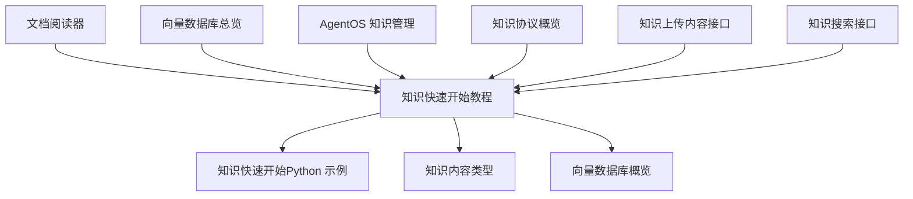
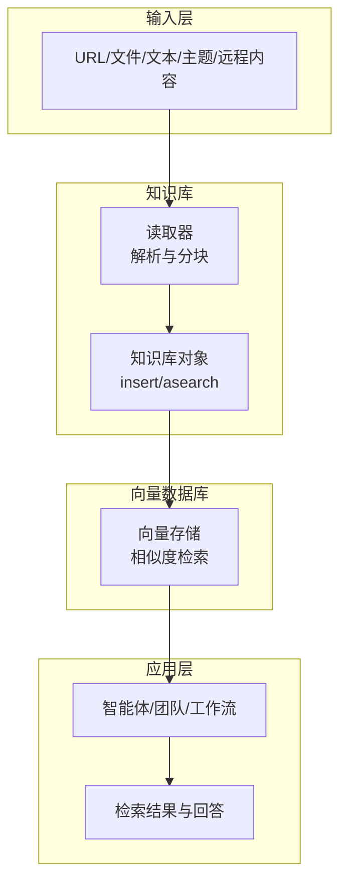
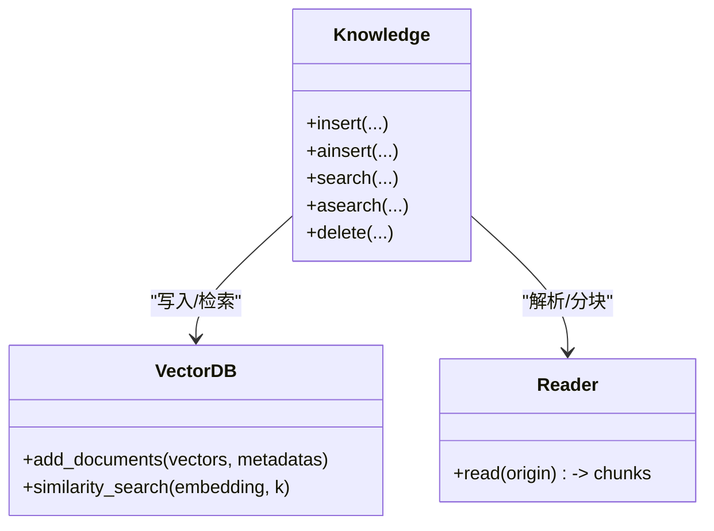
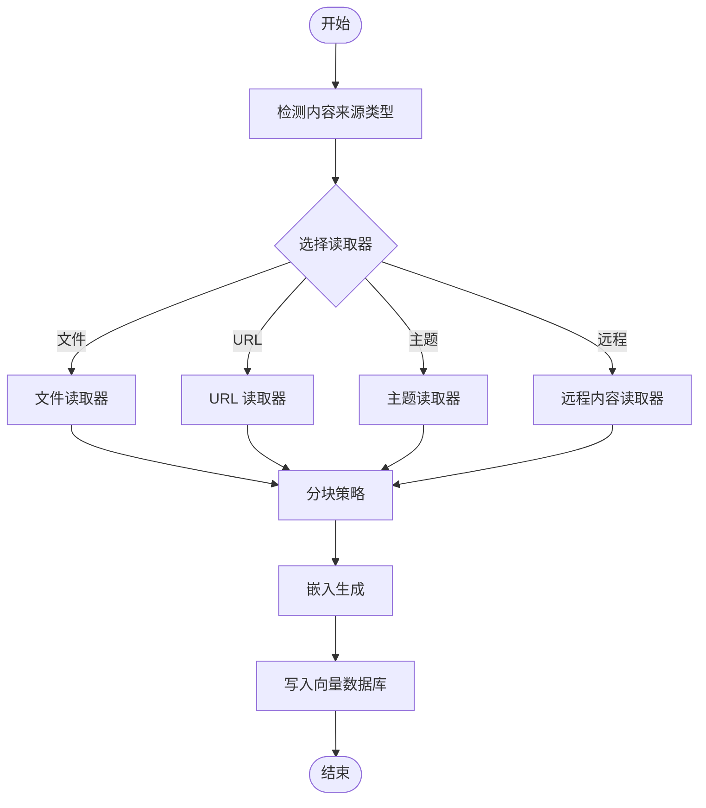
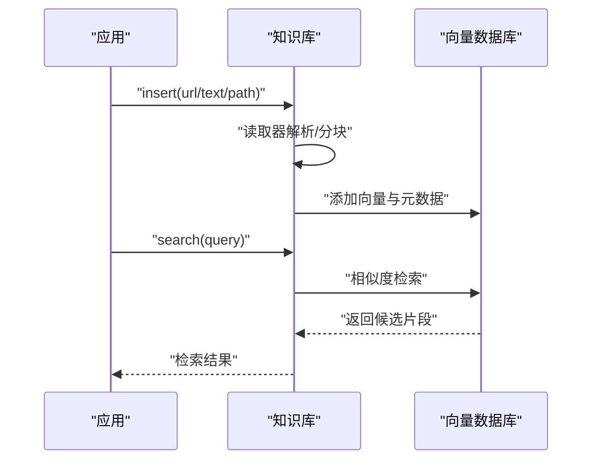
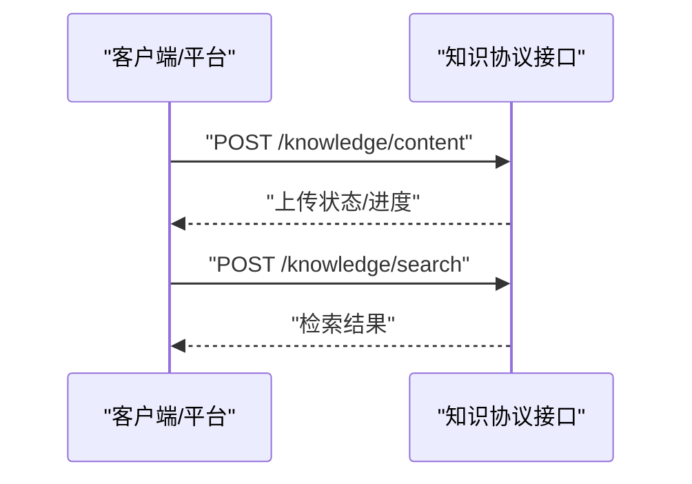
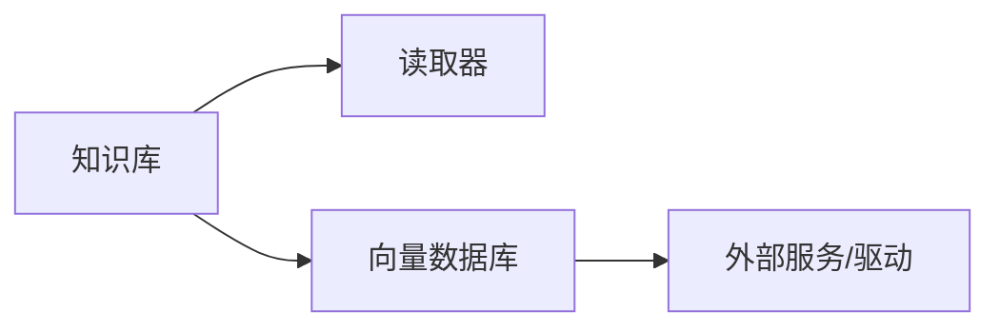

# 知识管理快速开始

<cite>
**本文引用的文件**
- [知识快速开始（Python 示例）](file://examples/knowledge/quickstart.mdx)
- [知识快速开始（教程）](file://knowledge/quickstart.mdx)
- [知识内容类型](file://knowledge/concepts/content-types.mdx)
- [向量数据库概览](file://knowledge/concepts/vector-db.mdx)
- [文档阅读器](file://cookbook/knowledge/readers.mdx)
- [向量数据库总览](file://cookbook/knowledge/vector-databases.mdx)
- [AgentOS 知识管理](file://agent-os/features/knowledge-management.mdx)
- [知识协议概览](file://knowledge/concepts/protocol/overview.mdx)
- [知识上传内容接口](file://reference-api/schema/knowledge/upload-content.mdx)
- [知识搜索接口](file://reference-api/schema/knowledge/search-knowledge.mdx)
</cite>

## 目录
1. [简介](#简介)
2. [项目结构](#项目结构)
3. [核心组件](#核心组件)
4. [架构总览](#架构总览)
5. [详细组件分析](#详细组件分析)
6. [依赖关系分析](#依赖关系分析)
7. [性能考虑](#性能考虑)
8. [故障排查指南](#故障排查指南)
9. [结论](#结论)
10. [附录](#附录)

## 简介
本指南面向从零开始构建“知识库”的用户，目标是在约 5 分钟内完成环境准备、依赖安装、向量数据库配置与基础使用，并覆盖文件、URL、原始文本等多源内容的处理方式。同时解释知识库协议的基本概念与使用方法，提供常见问题的解决方案与最佳实践建议。

## 项目结构
围绕知识管理的文档主要分布在以下区域：
- 快速开始：提供最小可运行示例与分步操作
- 概念与原理：内容来源、读取器、分块策略、向量数据库与检索
- 实战示例：不同向量数据库与阅读器的使用范式
- 平台集成：AgentOS 的知识管理界面与工作流
- 接口规范：知识上传与搜索的 API 规范

图表来源
- [知识快速开始（教程）:1-129](file://knowledge/quickstart.mdx#L1-L129)
- [知识快速开始（Python 示例）:1-50](file://examples/knowledge/quickstart.mdx#L1-L50)
- [知识内容类型:1-61](file://knowledge/concepts/content-types.mdx#L1-L61)
- [向量数据库概览:1-117](file://knowledge/concepts/vector-db.mdx#L1-L117)
- [文档阅读器:1-219](file://cookbook/knowledge/readers.mdx#L1-L219)
- [向量数据库总览:1-227](file://cookbook/knowledge/vector-databases.mdx#L1-L227)
- [AgentOS 知识管理:1-78](file://agent-os/features/knowledge-management.mdx#L1-L78)
- [知识协议概览:1-5](file://knowledge/concepts/protocol/overview.mdx#L1-L5)
- [知识上传内容接口:1-3](file://reference-api/schema/knowledge/upload-content.mdx#L1-L3)
- [知识搜索接口:1-3](file://reference-api/schema/knowledge/search-knowledge.mdx#L1-L3)

章节来源
- [知识快速开始（教程）:1-129](file://knowledge/quickstart.mdx#L1-L129)
- [知识快速开始（Python 示例）:1-50](file://examples/knowledge/quickstart.mdx#L1-L50)

## 核心组件
- 知识库（Knowledge）
  - 负责内容插入、查询与删除；内部协调读取器、分块策略与向量数据库
- 读取器（Reader）
  - 针对不同内容源（文件、URL、主题、远程内容）进行解析与分块
- 向量数据库（VectorDB）
  - 存储嵌入并支持相似度检索；支持向量、关键词与混合检索
- 搜索类型（SearchType）
  - 控制检索模式（向量/关键词/混合），影响召回质量与速度
- 协议与接口
  - 提供统一的知识上传与搜索能力，便于平台集成与扩展

章节来源
- [知识快速开始（教程）:11-42](file://knowledge/quickstart.mdx#L11-L42)
- [知识内容类型:9-19](file://knowledge/concepts/content-types.mdx#L9-L19)
- [向量数据库概览:23-31](file://knowledge/concepts/vector-db.mdx#L23-L31)
- [知识协议概览:1-5](file://knowledge/concepts/protocol/overview.mdx#L1-L5)

## 架构总览
下图展示从“内容输入”到“检索回答”的端到端流程，涵盖读取器、分块、嵌入、存储与检索等关键环节。

图表来源
- [知识快速开始（教程）:106-112](file://knowledge/quickstart.mdx#L106-L112)
- [知识内容类型:17-19](file://knowledge/concepts/content-types.mdx#L17-L19)
- [向量数据库概览:9-21](file://knowledge/concepts/vector-db.mdx#L9-L21)

## 详细组件分析

### 组件一：知识库（Knowledge）
- 职责
  - 插入内容（insert/ainsert）：自动选择读取器、分块、嵌入并写入向量数据库
  - 查询内容（search/asearch）：根据查询生成嵌入，执行相似度检索
  - 删除内容（delete/remove）：移除指定条目
- 关键点
  - 支持异步插入与查询，适合高并发场景
  - 可通过参数控制是否跳过已存在内容、是否持久化等

图表来源
- [知识快速开始（教程）:19-28](file://knowledge/quickstart.mdx#L19-L28)
- [向量数据库概览:108-117](file://knowledge/concepts/vector-db.mdx#L108-L117)

章节来源
- [知识快速开始（教程）:11-42](file://knowledge/quickstart.mdx#L11-L42)
- [向量数据库概览:108-117](file://knowledge/concepts/vector-db.mdx#L108-L117)

### 组件二：读取器（Reader）
- 功能
  - 自动识别内容来源类型（路径、URL、主题、远程内容）
  - 将内容解析为文本并按策略分块，供嵌入与存储
- 支持格式
  - PDF、CSV、JSON、Markdown、PowerPoint、Word、HTML、Arxiv、YouTube、Firecrawl、Tavily 等
- 使用建议
  - 对于 PDF/加密 PDF、CSV 字段标签、Markdown 目录等场景，可通过参数优化分块与上下文

图表来源
- [知识内容类型:17-19](file://knowledge/concepts/content-types.mdx#L17-L19)
- [文档阅读器:23-38](file://cookbook/knowledge/readers.mdx#L23-L38)

章节来源
- [知识内容类型:9-43](file://knowledge/concepts/content-types.mdx#L9-L43)
- [文档阅读器:23-219](file://cookbook/knowledge/readers.mdx#L23-L219)

### 组件三：向量数据库（VectorDB）
- 能力
  - 存储向量与元数据，支持向量相似度检索
  - 多数支持混合检索（向量 + 关键词），提升召回质量
- 选择建议
  - 本地开发：ChromaDB、LanceDB
  - 生产部署：PgVector（若已有 PostgreSQL）、Pinecone、Weaviate、Qdrant、Milvus
- 异步支持
  - 提供 ainsert/asearch 方法，适合异步/高并发场景

图表来源
- [向量数据库概览:9-21](file://knowledge/concepts/vector-db.mdx#L9-L21)
- [向量数据库总览:37-141](file://cookbook/knowledge/vector-databases.mdx#L37-L141)

章节来源
- [向量数据库概览:32-106](file://knowledge/concepts/vector-db.mdx#L32-L106)
- [向量数据库总览:17-36](file://cookbook/knowledge/vector-databases.mdx#L17-L36)

### 组件四：知识协议与接口
- 协议要点
  - 知识协议定义了内容上传、检索与管理的统一语义，便于跨平台与工具链协作
- 接口规范
  - 上传内容：POST /knowledge/content
  - 搜索知识：POST /knowledge/search
- 使用建议
  - 在平台或客户端中优先使用协议接口，确保与知识库生态兼容

图表来源
- [知识协议概览:1-5](file://knowledge/concepts/protocol/overview.mdx#L1-L5)
- [知识上传内容接口:1-3](file://reference-api/schema/knowledge/upload-content.mdx#L1-L3)
- [知识搜索接口:1-3](file://reference-api/schema/knowledge/search-knowledge.mdx#L1-L3)

章节来源
- [知识协议概览:1-5](file://knowledge/concepts/protocol/overview.mdx#L1-L5)
- [知识上传内容接口:1-3](file://reference-api/schema/knowledge/upload-content.mdx#L1-L3)
- [知识搜索接口:1-3](file://reference-api/schema/knowledge/search-knowledge.mdx#L1-L3)

## 依赖关系分析
- 组件耦合
  - 知识库与读取器、向量数据库之间为松耦合设计，通过统一接口交互
  - 检索类型（SearchType）在向量数据库层实现，知识库仅负责调用
- 外部依赖
  - 不同向量数据库需要相应驱动或服务（如 PostgreSQL、Pinecone、Qdrant 等）
  - 读取器依赖对应解析库（如 PDF 解析、网页抓取等）

图表来源
- [向量数据库总览:19-36](file://cookbook/knowledge/vector-databases.mdx#L19-L36)
- [文档阅读器:23-38](file://cookbook/knowledge/readers.mdx#L23-L38)

章节来源
- [向量数据库总览:1-227](file://cookbook/knowledge/vector-databases.mdx#L1-L227)
- [文档阅读器:1-219](file://cookbook/knowledge/readers.mdx#L1-L219)

## 性能考虑
- 检索模式
  - 混合检索通常兼顾语义与精确匹配，适合复杂查询；纯向量检索更快但可能丢失关键词信息
- 分块策略
  - 合理的分块大小与重叠有助于提升召回精度；过大导致检索开销增加，过小会增加向量数量
- 异步操作
  - 在高并发场景使用 ainsert/asearch，避免阻塞主线程
- 数据库选择
  - 本地开发优先选择零依赖或轻量级数据库；生产优先考虑稳定性与扩展性

章节来源
- [向量数据库概览:23-31](file://knowledge/concepts/vector-db.mdx#L23-L31)
- [向量数据库总览:61-73](file://cookbook/knowledge/vector-databases.mdx#L61-L73)

## 故障排查指南
- 连接向量数据库失败
  - 检查连接地址、凭据与网络连通性；确认数据库版本与驱动兼容
- 内容未被检索到
  - 确认已成功插入且向量已写入；检查分块大小与检索模式；尝试扩大 k 值或调整检索策略
- 读取器解析异常
  - 检查文件格式与密码保护（如 PDF）；确认对应读取器可用；必要时手动指定读取器参数
- AgentOS 知识管理不可用
  - 确认 AgentOS 已连接且处于活跃状态；刷新知识库状态后重试

章节来源
- [AgentOS 知识管理:11-15](file://agent-os/features/knowledge-management.mdx#L11-L15)
- [知识快速开始（教程）:83-102](file://knowledge/quickstart.mdx#L83-L102)

## 结论
通过本指南，您可以在 5 分钟内完成知识库的搭建与验证：创建虚拟环境、安装依赖、选择向量数据库、加载内容并让智能体基于知识回答问题。随后可根据业务需求扩展内容类型、优化分块与检索策略，并在生产环境中选择合适的向量数据库与部署方案。

## 附录

### 5 分钟快速开始步骤
- 创建虚拟环境并激活
- 安装依赖（如 agno、chromadb、google-genai 等）
- 导出模型 API 密钥
- 运行示例脚本，观察智能体如何检索知识并回答问题
- 尝试不同内容来源（文件、URL、文本）以验证处理流程

章节来源
- [知识快速开始（教程）:44-79](file://knowledge/quickstart.mdx#L44-L79)

### 不同内容类型的处理方法
- 文件：支持 PDF、CSV、JSON、Markdown、PPTX、DOCX 等
- URL：支持网页与直链文件
- 文本：直接粘贴或传入原始文本
- 主题：如 Arxiv 论文、Wikipedia 条目
- 远程内容：来自 S3、GCS 等远端存储

章节来源
- [知识内容类型:9-19](file://knowledge/concepts/content-types.mdx#L9-L19)
- [文档阅读器:23-38](file://cookbook/knowledge/readers.mdx#L23-L38)

### 向量数据库选型参考
- 本地开发：ChromaDB、LanceDB
- 生产：PgVector、Pinecone、Weaviate、Qdrant、Milvus
- 其他：MongoDB、Redis、Cassandra、ClickHouse、SingleStore、Upstash、Couchbase、SurrealDB

章节来源
- [向量数据库概览:32-106](file://knowledge/concepts/vector-db.mdx#L32-L106)
- [向量数据库总览:17-36](file://cookbook/knowledge/vector-databases.mdx#L17-L36)

### 知识协议与接口
- 协议目标：统一知识上传与检索语义，便于平台与工具链协作
- 接口：POST /knowledge/content（上传）、POST /knowledge/search（检索）

章节来源
- [知识协议概览:1-5](file://knowledge/concepts/protocol/overview.mdx#L1-L5)
- [知识上传内容接口:1-3](file://reference-api/schema/knowledge/upload-content.mdx#L1-L3)
- [知识搜索接口:1-3](file://reference-api/schema/knowledge/search-knowledge.mdx#L1-L3)