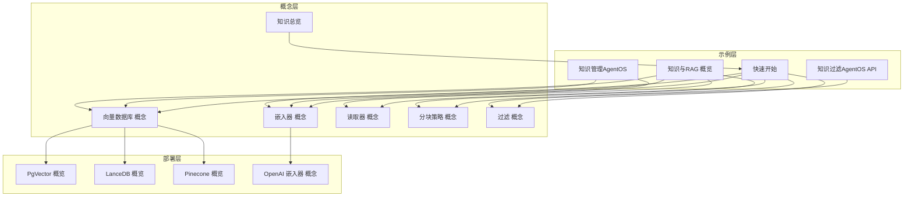
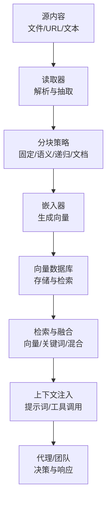
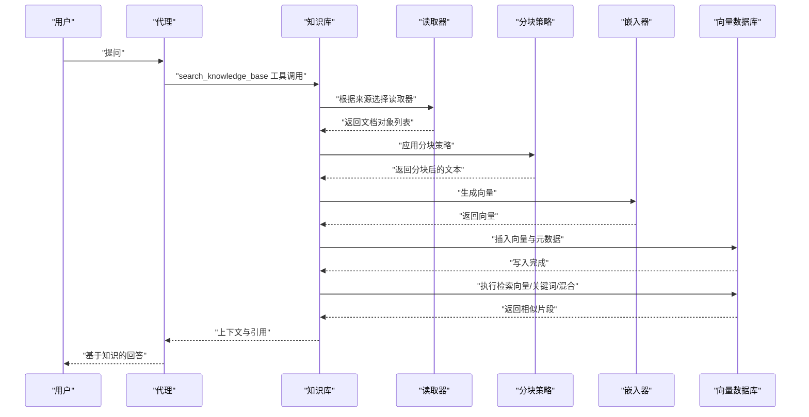
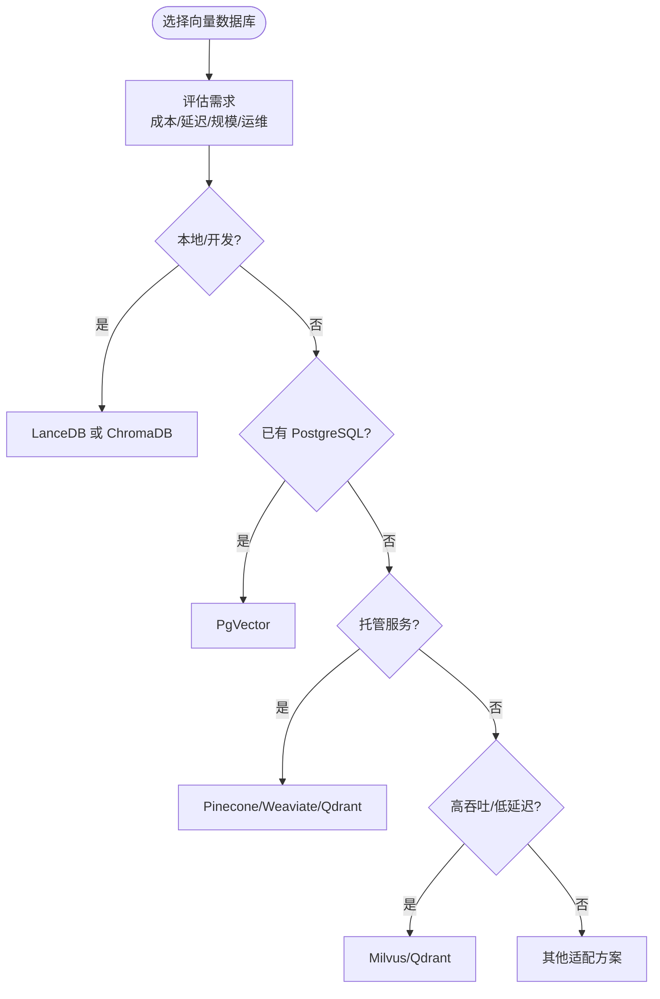
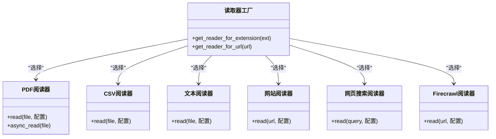
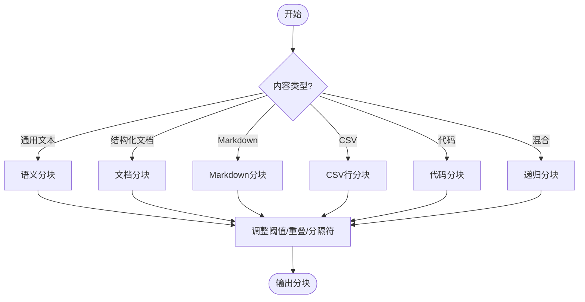
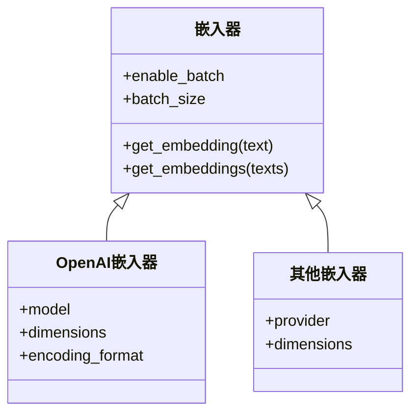
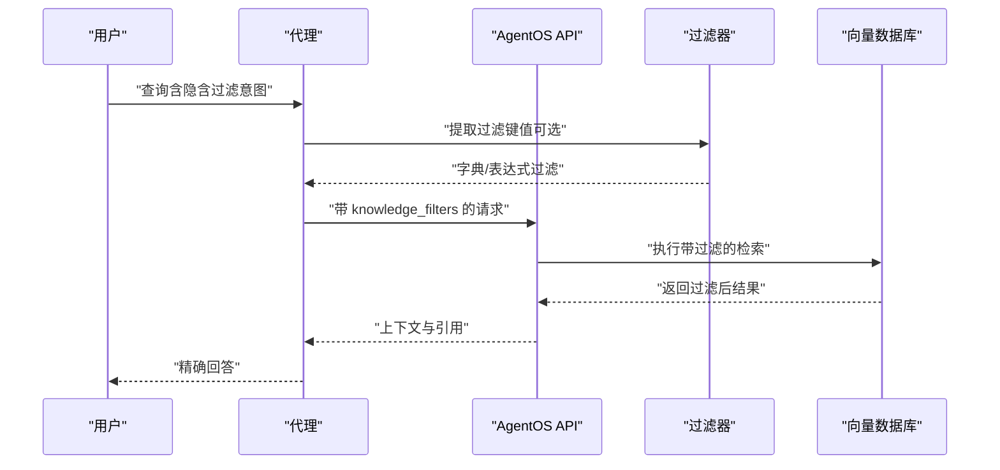
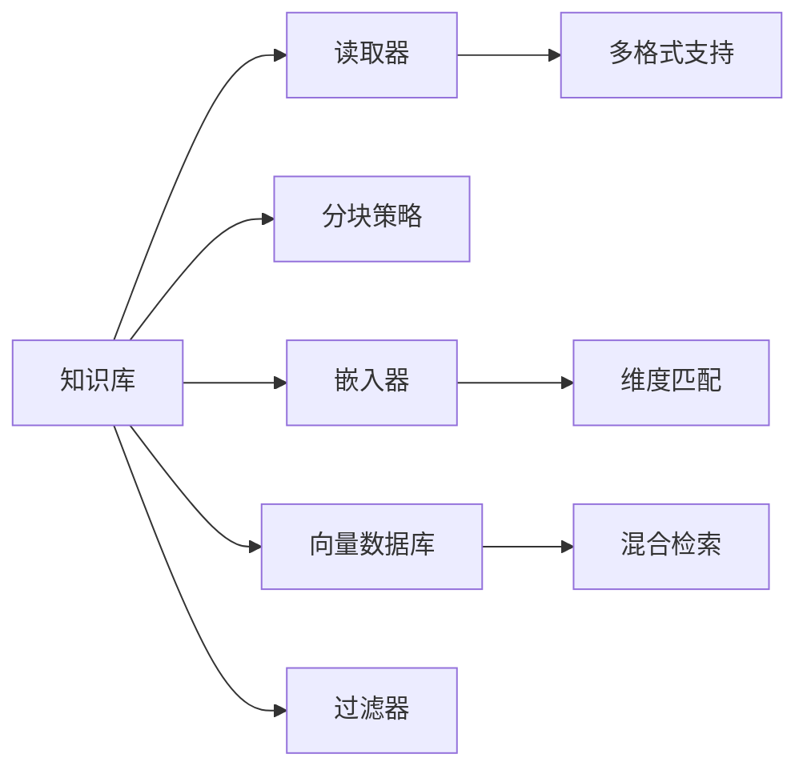

# 知识管理系统

<cite>
**本文引用的文件**
- [知识总览](file://knowledge/overview.mdx)
- [快速开始](file://knowledge/quickstart.mdx)
- [知识管理（AgentOS）](file://agent-os/knowledge/manage-knowledge.mdx)
- [知识过滤（AgentOS API）](file://agent-os/knowledge/filter-knowledge.mdx)
- [知识与RAG 概览](file://cookbook/knowledge/overview.mdx)
- [向量数据库 概念](file://knowledge/concepts/vector-db.mdx)
- [嵌入器 概念](file://knowledge/concepts/embedder/overview.mdx)
- [读取器 概念](file://knowledge/concepts/readers/overview.mdx)
- [分块策略 概念](file://knowledge/concepts/chunking/overview.mdx)
- [过滤 概念](file://knowledge/concepts/filters/overview.mdx)
- [PgVector 概览](file://knowledge/vector-stores/pgvector/overview.mdx)
- [LanceDB 概览](file://knowledge/vector-stores/lancedb/overview.mdx)
- [Pinecone 概览](file://knowledge/vector-stores/pinecone/overview.mdx)
- [OpenAI 嵌入器 概念](file://knowledge/concepts/embedder/openai/overview.mdx)
</cite>

## 目录
1. [简介](#简介)
2. [项目结构](#项目结构)
3. [核心组件](#核心组件)
4. [架构总览](#架构总览)
5. [详细组件分析](#详细组件分析)
6. [依赖分析](#依赖分析)
7. [性能考虑](#性能考虑)
8. [故障排查指南](#故障排查指南)
9. [结论](#结论)
10. [附录](#附录)

## 简介
本技术文档面向知识管理系统，系统性阐述“向量数据库、嵌入器、读取器、过滤器”的核心概念与相互关系，并提供从数据准备到检索配置的快速开始流程。文档还覆盖多种向量数据库（PgVector、LanceDB、Pinecone 等）的特性与选型建议，说明如何使用不同内容类型的读取器（PDF、网页、CSV 等），介绍固定大小、递归、语义等分块策略，以及 OpenAI、Sentence Transformers 等嵌入器的配置与选择。最后给出在代理与团队中使用知识系统的实践示例。

## 项目结构
该仓库以“知识”为中心，围绕“概念—示例—部署”三层组织内容：概念层提供向量数据库、嵌入器、读取器、分块策略、过滤等基础定义；示例层提供快速开始、AgentOS 管理与过滤、知识与 RAG 的综合示例；部署层覆盖不同向量数据库的参数与运行方式。

**图表来源**
- [知识总览:1-110](file://knowledge/overview.mdx#L1-L110)
- [快速开始:1-129](file://knowledge/quickstart.mdx#L1-L129)
- [知识管理（AgentOS）:1-129](file://agent-os/knowledge/manage-knowledge.mdx#L1-L129)
- [知识过滤（AgentOS API）:1-310](file://agent-os/knowledge/filter-knowledge.mdx#L1-L310)
- [知识与RAG 概览:1-129](file://cookbook/knowledge/overview.mdx#L1-L129)
- [向量数据库 概念:1-117](file://knowledge/concepts/vector-db.mdx#L1-L117)
- [嵌入器 概念:1-140](file://knowledge/concepts/embedder/overview.mdx#L1-L140)
- [读取器 概念:1-180](file://knowledge/concepts/readers/overview.mdx#L1-L180)
- [分块策略 概念:1-143](file://knowledge/concepts/chunking/overview.mdx#L1-L143)
- [过滤 概念:1-161](file://knowledge/concepts/filters/overview.mdx#L1-L161)
- [PgVector 概览:1-93](file://knowledge/vector-stores/pgvector/overview.mdx#L1-L93)
- [LanceDB 概览:1-103](file://knowledge/vector-stores/lancedb/overview.mdx#L1-L103)
- [Pinecone 概览:1-127](file://knowledge/vector-stores/pinecone/overview.mdx#L1-L127)
- [OpenAI 嵌入器 概念:1-52](file://knowledge/concepts/embedder/openai/overview.mdx#L1-L52)

**章节来源**
- [知识总览:1-110](file://knowledge/overview.mdx#L1-L110)
- [快速开始:1-129](file://knowledge/quickstart.mdx#L1-L129)
- [知识与RAG 概览:1-129](file://cookbook/knowledge/overview.mdx#L1-L129)

## 核心组件
- 读取器（Reader）：负责从文件、URL、云存储或原始文本中提取可搜索的内容与元数据，输出标准化的文档对象。
- 分块策略（Chunking）：将长文档按固定大小、语义边界、递归分隔符等方式切分为更小的片段，提升检索精度与上下文匹配。
- 嵌入器（Embedder）：将文本转换为向量，使语义相似的内容在向量空间中靠近，支撑相似度检索。
- 向量数据库（VectorDB）：持久化存储向量与元数据，支持向量相似检索、关键词检索与混合检索。
- 过滤器（Filter）：基于元数据与内容进行结果筛选，支持简单字典过滤与复杂表达式过滤，适用于代理与团队场景。

**章节来源**
- [读取器 概念:1-180](file://knowledge/concepts/readers/overview.mdx#L1-L180)
- [分块策略 概念:1-143](file://knowledge/concepts/chunking/overview.mdx#L1-L143)
- [嵌入器 概念:1-140](file://knowledge/concepts/embedder/overview.mdx#L1-L140)
- [向量数据库 概念:1-117](file://knowledge/concepts/vector-db.mdx#L1-L117)
- [过滤 概念:1-161](file://knowledge/concepts/filters/overview.mdx#L1-L161)

## 架构总览
下图展示了从内容入库到代理检索的端到端流程，强调读取器、分块、嵌入与向量数据库之间的协作关系。

**图表来源**
- [知识总览:29-40](file://knowledge/overview.mdx#L29-L40)
- [读取器 概念:16-31](file://knowledge/concepts/readers/overview.mdx#L16-L31)
- [分块策略 概念:7-28](file://knowledge/concepts/chunking/overview.mdx#L7-L28)
- [嵌入器 概念:8-28](file://knowledge/concepts/embedder/overview.mdx#L8-L28)
- [向量数据库 概念:9-21](file://knowledge/concepts/vector-db.mdx#L9-L21)

## 详细组件分析

### 快速开始：从零构建知识驱动的代理
- 数据准备：支持文件夹、单文件、URL、纯文本等多种来源，系统自动识别格式并选择对应读取器。
- 向量化处理：内容被分块、嵌入并写入向量数据库；默认采用代理式 RAG（Agentic RAG），由代理决定是否检索。
- 检索配置：可选择关键词、向量或混合检索类型，结合嵌入器维度与模型能力优化召回质量。

**图表来源**
- [快速开始:106-112](file://knowledge/quickstart.mdx#L106-L112)
- [知识总览:29-40](file://knowledge/overview.mdx#L29-L40)

**章节来源**
- [快速开始:1-129](file://knowledge/quickstart.mdx#L1-L129)
- [知识总览:1-110](file://knowledge/overview.mdx#L1-L110)

### 向量数据库的选择与使用
- PgVector：PostgreSQL 扩展，支持混合检索，适合已有 PostgreSQL 基础设施的生产环境；提供异步插入与查询接口。
- LanceDB：本地、无服务器、混合检索，适合开发与边缘场景；同样支持异步操作。
- Pinecone：托管向量数据库，支持关键词与向量混合检索；注意版本兼容性与参数配置。

**图表来源**
- [向量数据库 概念:91-106](file://knowledge/concepts/vector-db.mdx#L91-L106)
- [PgVector 概览:1-93](file://knowledge/vector-stores/pgvector/overview.mdx#L1-L93)
- [LanceDB 概览:1-103](file://knowledge/vector-stores/lancedb/overview.mdx#L1-L103)
- [Pinecone 概览:1-127](file://knowledge/vector-stores/pinecone/overview.mdx#L1-L127)

**章节来源**
- [向量数据库 概念:1-117](file://knowledge/concepts/vector-db.mdx#L1-L117)
- [PgVector 概览:1-93](file://knowledge/vector-stores/pgvector/overview.mdx#L1-L93)
- [LanceDB 概览:1-103](file://knowledge/vector-stores/lancedb/overview.mdx#L1-L103)
- [Pinecone 概览:1-127](file://knowledge/vector-stores/pinecone/overview.mdx#L1-L127)

### 读取器：多源内容的统一入口
- 自动选择：根据扩展名或 URL 自动选择合适的读取器（PDF、CSV、Markdown、JSON、PPTX、YouTube、Website、WebSearch、Firecrawl 等）。
- 可配置：支持分块大小、页面拆分、加密 PDF 的密码、OCR 图像识别、编码设置等。
- 异步处理：批量读取与异步接口提升 I/O 密集场景的吞吐。

**图表来源**
- [读取器 概念:66-82](file://knowledge/concepts/readers/overview.mdx#L66-L82)
- [读取器 概念:33-50](file://knowledge/concepts/readers/overview.mdx#L33-L50)

**章节来源**
- [读取器 概念:1-180](file://knowledge/concepts/readers/overview.mdx#L1-L180)

### 分块策略：控制文档切分与检索精度
- 固定大小：按字符数均匀切分，便于预测但可能破坏语义边界。
- 语义分块：基于语义相似度断句，保持完整语义单元。
- 递归分块：按层级分隔符（段落、句子、单词）递归切分，兼顾结构与语义。
- 文档/Markdown/CSV/代码/聚合：针对不同结构化内容提供专用策略。
- 配置要点：重叠长度、阈值、分隔符、块大小等参数影响召回与上下文完整性。

**图表来源**
- [分块策略 概念:82-94](file://knowledge/concepts/chunking/overview.mdx#L82-L94)
- [分块策略 概念:118-126](file://knowledge/concepts/chunking/overview.mdx#L118-L126)

**章节来源**
- [分块策略 概念:1-143](file://knowledge/concepts/chunking/overview.mdx#L1-L143)

### 嵌入器：语义向量的生成与维度匹配
- 默认与可选：系统默认使用 OpenAI 嵌入器，也可选用 Gemini、Cohere、Voyage AI、Mistral、Ollama、FastEmbed、HuggingFace、AWS Bedrock、Azure OpenAI、Fireworks、Together、Jina、Nebius 等。
- 批量嵌入：通过批量请求减少 API 调用次数与限流风险。
- 维度与兼容性：确保嵌入器输出维度与向量数据库期望一致；更换模型需重新嵌入。

**图表来源**
- [嵌入器 概念:32-74](file://knowledge/concepts/embedder/overview.mdx#L32-L74)
- [OpenAI 嵌入器 概念:33-49](file://knowledge/concepts/embedder/openai/overview.mdx#L33-L49)

**章节来源**
- [嵌入器 概念:1-140](file://knowledge/concepts/embedder/overview.mdx#L1-L140)
- [OpenAI 嵌入器 概念:1-52](file://knowledge/concepts/embedder/openai/overview.mdx#L1-L52)

### 过滤器：基于元数据与内容的精准检索
- 字典过滤：简单相等匹配，适合类别、状态、年份等字段。
- 表达式过滤：支持 AND/OR/NOT、范围比较（大于/小于/包含），满足复杂业务规则。
- 代理式过滤：代理从用户问题中抽取过滤条件，无需硬编码。
- 支持数据库：ChromaDB、LanceDB、Milvus、MongoDB、PgVector、Pinecone、Qdrant、Weaviate 等。

**图表来源**
- [知识过滤（AgentOS API）:83-128](file://agent-os/knowledge/filter-knowledge.mdx#L83-L128)
- [过滤 概念:60-73](file://knowledge/concepts/filters/overview.mdx#L60-L73)

**章节来源**
- [知识过滤（AgentOS API）:1-310](file://agent-os/knowledge/filter-knowledge.mdx#L1-L310)
- [过滤 概念:1-161](file://knowledge/concepts/filters/overview.mdx#L1-L161)

### 代理与团队中的知识系统实践
- 代理使用：启用 search_knowledge，让代理在需要时主动检索知识库；也可将知识直接注入上下文（传统 RAG）。
- 团队协同：多代理共享同一知识库，通过过滤器限定访问范围；分布式检索与协调式 RAG 提升跨模块问答效果。
- AgentOS 管理：在控制平面集中管理多个知识库，支持增删改查与内容同步，便于运维与治理。

**章节来源**
- [知识管理（AgentOS）:1-129](file://agent-os/knowledge/manage-knowledge.mdx#L1-L129)
- [知识与RAG 概览:1-129](file://cookbook/knowledge/overview.mdx#L1-L129)

## 依赖分析
- 组件耦合：知识库对读取器、分块策略、嵌入器与向量数据库存在强依赖；过滤器依赖于向量数据库的过滤能力与内容数据库的元数据索引。
- 外部依赖：向量数据库（PgVector、LanceDB、Pinecone 等）、嵌入器提供商（OpenAI、Gemini、Cohere 等）、读取器生态（PDF、CSV、网站抓取等）。
- 异步与并发：向量数据库与读取器普遍支持异步接口，适合高并发与低延迟场景。

**图表来源**
- [知识总览:29-40](file://knowledge/overview.mdx#L29-L40)
- [向量数据库 概念:23-31](file://knowledge/concepts/vector-db.mdx#L23-L31)
- [嵌入器 概念:24-28](file://knowledge/concepts/embedder/overview.mdx#L24-L28)
- [读取器 概念:16-21](file://knowledge/concepts/readers/overview.mdx#L16-L21)

**章节来源**
- [知识总览:1-110](file://knowledge/overview.mdx#L1-L110)
- [向量数据库 概念:1-117](file://knowledge/concepts/vector-db.mdx#L1-L117)
- [嵌入器 概念:1-140](file://knowledge/concepts/embedder/overview.mdx#L1-L140)
- [读取器 概念:1-180](file://knowledge/concepts/readers/overview.mdx#L1-L180)

## 性能考虑
- 分块策略：较小块利于精确检索，较大块利于上下文理解；应依据查询粒度与内容类型权衡。
- 嵌入器批次：开启批量嵌入可显著降低 API 调用次数与限流风险。
- 检索类型：混合检索结合语义与关键词，通常在召回与定位之间取得平衡。
- 异步操作：在高并发场景使用异步插入与查询，提升吞吐与响应时间。
- 数据库选型：本地开发优先 LanceDB/ChromaDB；生产优先 PgVector；托管服务优先 Pinecone/Weaviate/Qdrant/Milvus。

[本节为通用指导，不直接分析具体文件]

## 故障排查指南
- 内容未被检索到：检查嵌入是否成功写入向量表，确认维度与模型一致。
- 过滤无效：确认过滤表达式语法正确，或回退为字典过滤；检查向量数据库是否支持相应过滤。
- 读取失败：查看日志，确认文件路径、权限、编码与密码设置；必要时手动指定读取器。
- 异步异常：确保使用正确的异步方法与事件循环；避免阻塞操作。

**章节来源**
- [知识过滤（AgentOS API）:223-245](file://agent-os/knowledge/filter-knowledge.mdx#L223-L245)
- [读取器 概念:155-163](file://knowledge/concepts/readers/overview.mdx#L155-L163)

## 结论
知识管理系统通过“读取器—分块—嵌入—向量数据库—过滤器”的流水线，将非结构化内容转化为可检索的语义向量，并在代理与团队场景中实现智能问答与决策支持。选择合适的向量数据库、嵌入器与分块策略，配合灵活的过滤机制，可在准确性、性能与可维护性之间取得最佳平衡。

[本节为总结性内容，不直接分析具体文件]

## 附录
- 快速开始步骤概览
  - 安装依赖与导出密钥
  - 创建知识库并选择向量数据库与嵌入器
  - 插入内容（文件/目录/URL/文本）
  - 创建代理并启用知识检索
- 向量数据库参数参考
  - PgVector：表名、数据库连接、混合检索、嵌入器等
  - LanceDB：表名、URI、检索类型、异步支持
  - Pinecone：索引名、维度、指标、规格、混合检索参数
- 嵌入器参数参考
  - OpenAI：模型、维度、编码格式、批次开关与大小等

**章节来源**
- [快速开始:44-79](file://knowledge/quickstart.mdx#L44-L79)
- [PgVector 概览:91-93](file://knowledge/vector-stores/pgvector/overview.mdx#L91-L93)
- [LanceDB 概览:101-103](file://knowledge/vector-stores/lancedb/overview.mdx#L101-L103)
- [Pinecone 概览:125-127](file://knowledge/vector-stores/pinecone/overview.mdx#L125-L127)
- [OpenAI 嵌入器 概念:33-49](file://knowledge/concepts/embedder/openai/overview.mdx#L33-L49)