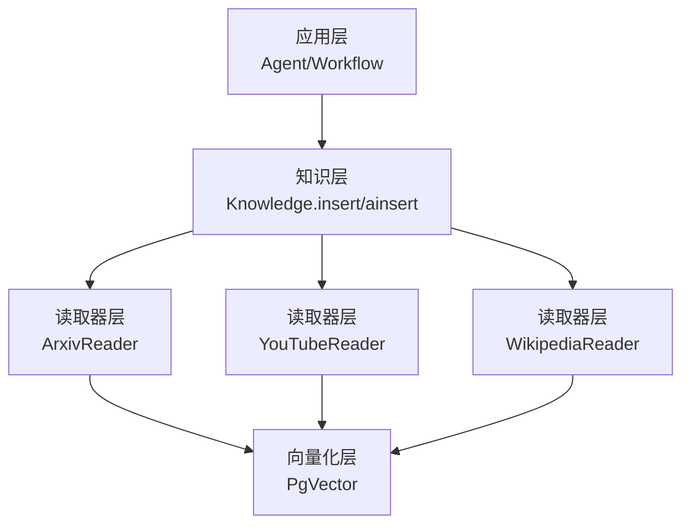
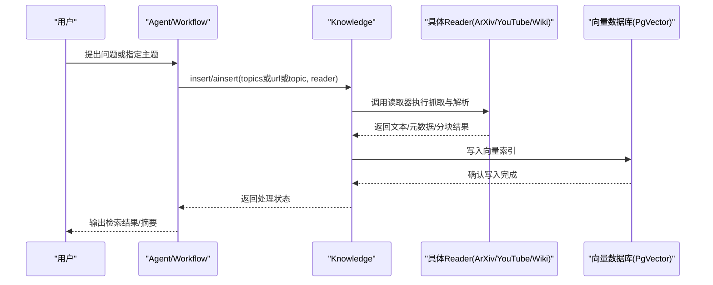
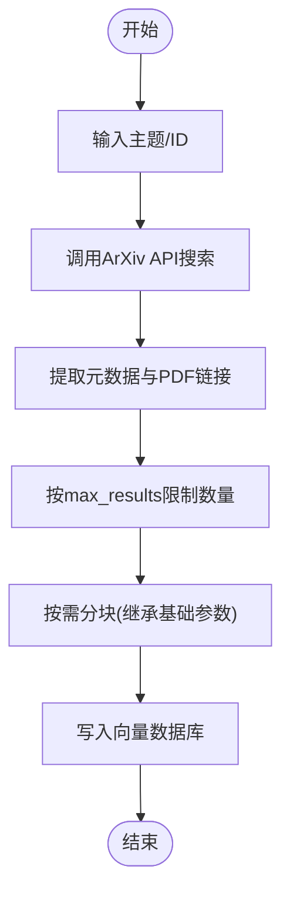
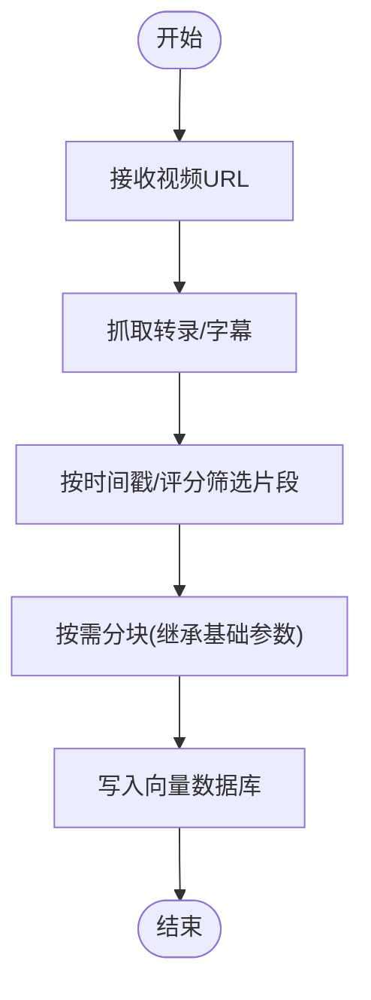
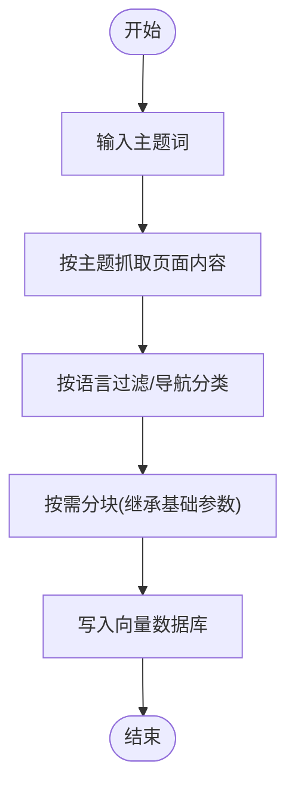
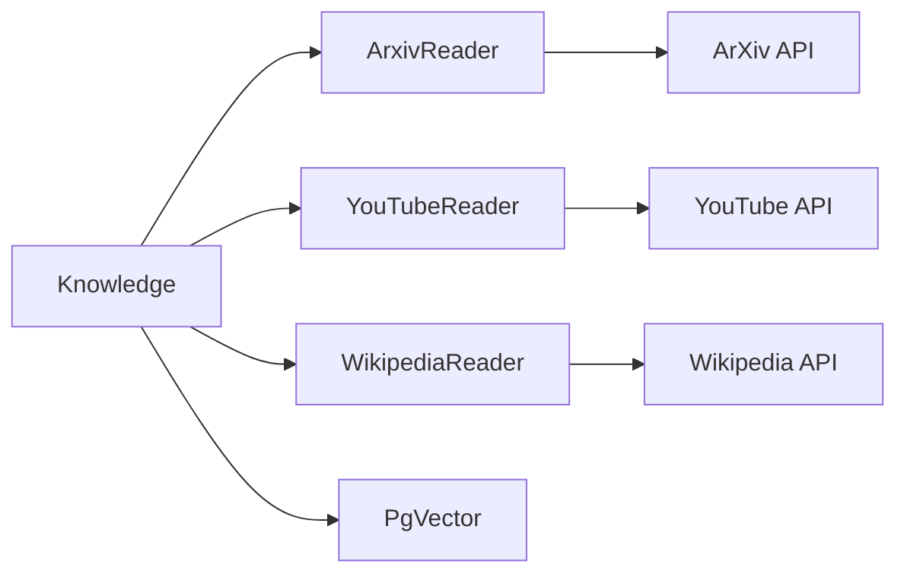

# 学术媒体读取器

<cite>
**本文档引用的文件**
- [_snippets/arxiv-reader-reference.mdx](file://_snippets/arxiv-reader-reference.mdx)
- [_snippets/youtube-reader-reference.mdx](file://_snippets/youtube-reader-reference.mdx)
- [_snippets/wikipedia-reader-reference.mdx](file://_snippets/wikipedia-reader-reference.mdx)
- [_snippets/base-reader-reference.mdx](file://_snippets/base-reader-reference.mdx)
- [examples/knowledge/readers/arxiv-reader.mdx](file://examples/knowledge/readers/arxiv-reader.mdx)
- [examples/knowledge/readers/arxiv-reader-async.mdx](file://examples/knowledge/readers/arxiv-reader-async.mdx)
- [reference/knowledge/reader/youtube.mdx](file://reference/knowledge/reader/youtube.mdx)
- [reference/knowledge/reader/wikipedia.mdx](file://reference/knowledge/reader/wikipedia.mdx)
- [cookbook/knowledge/readers.mdx](file://cookbook/knowledge/readers.mdx)
</cite>

## 目录
1. [简介](#简介)
2. [项目结构](#项目结构)
3. [核心组件](#核心组件)
4. [架构总览](#架构总览)
5. [详细组件分析](#详细组件分析)
6. [依赖关系分析](#依赖关系分析)
7. [性能考虑](#性能考虑)
8. [故障排查指南](#故障排查指南)
9. [结论](#结论)
10. [附录](#附录)

## 简介
本文件面向“学术媒体读取器”的使用者与维护者，系统化介绍如何在知识库体系中配置与使用 ArXiv、YouTube 与 Wikipedia 等专业内容源的读取器。重点覆盖：
- ArXivReader：论文搜索、元数据提取、批量下载与入库
- YouTubeReader：视频转录获取、字幕处理与内容筛选
- WikipediaReader：文章爬取、分类导航与多语言支持
并提供学术引用格式处理、多媒体内容解析与版权合规的实践建议，以及 API 限流与数据质量保障策略。

## 项目结构
围绕“学术媒体读取器”，知识读取流程通常包括以下层次：
- 应用层：Agent/Workflow 调用 Knowledge 接口发起读取任务
- 知识层：Knowledge 统一调度不同 Reader（ArXiv、YouTube、Wikipedia）
- 读取器层：各 Reader 实现具体抓取与解析逻辑
- 向量化层：PgVector 等向量数据库存储与检索

图示来源
- [cookbook/knowledge/readers.mdx:153-170](file://cookbook/knowledge/readers.mdx#L153-L170)
- [examples/knowledge/readers/arxiv-reader.mdx:14-31](file://examples/knowledge/readers/arxiv-reader.mdx#L14-L31)

章节来源
- [cookbook/knowledge/readers.mdx:153-170](file://cookbook/knowledge/readers.mdx#L153-L170)
- [examples/knowledge/readers/arxiv-reader.mdx:14-31](file://examples/knowledge/readers/arxiv-reader.mdx#L14-L31)

## 核心组件
- 基础读取器参数（通用能力）
  - 分块策略：是否分块、分块大小、分隔符、分块策略类
  - 元信息：名称、描述
  - 结果上限：最大返回条数
- ArXivReader 参数
  - 搜索结果数量上限
  - 排序准则（按相关度等）
- YouTubeReader 参数
  - 视频链接（必填）
- WikipediaReader 参数
  - 主题词（可选）

章节来源
- [_snippets/base-reader-reference.mdx:1-10](file://_snippets/base-reader-reference.mdx#L1-L10)
- [_snippets/arxiv-reader-reference.mdx:1-5](file://_snippets/arxiv-reader-reference.mdx#L1-L5)
- [_snippets/youtube-reader-reference.mdx:1-4](file://_snippets/youtube-reader-reference.mdx#L1-L4)
- [_snippets/wikipedia-reader-reference.mdx:1-4](file://_snippets/wikipedia-reader-reference.mdx#L1-L4)

## 架构总览
下图展示从调用到入库的整体时序，涵盖异步与同步两种模式：

图示来源
- [examples/knowledge/readers/arxiv-reader.mdx:22-34](file://examples/knowledge/readers/arxiv-reader.mdx#L22-L34)
- [examples/knowledge/readers/arxiv-reader-async.mdx:32-44](file://examples/knowledge/readers/arxiv-reader-async.mdx#L32-L44)

## 详细组件分析

### ArXivReader：论文搜索、元数据提取与批量下载
- 功能要点
  - 支持通过 ArXiv ID 或关键词进行论文检索
  - 自动抓取元数据（标题、作者、摘要、分类、时间等）
  - 可配置返回条数与排序准则
  - 支持同步与异步批量入库（ainsert）
- 使用路径
  - 基础示例：[examples/knowledge/readers/arxiv-reader.mdx](file://examples/knowledge/readers/arxiv-reader.mdx)
  - 异步示例：[examples/knowledge/readers/arxiv-reader-async.mdx](file://examples/knowledge/readers/arxiv-reader-async.mdx)
  - 读者参考：[cookbook/knowledge/readers.mdx](file://cookbook/knowledge/readers.mdx)
- 关键参数
  - max_results：返回论文数量上限
  - sort_by：排序准则（如相关度）
- 数据流与处理逻辑

图示来源
- [cookbook/knowledge/readers.mdx:153-170](file://cookbook/knowledge/readers.mdx#L153-L170)
- [_snippets/arxiv-reader-reference.mdx:1-5](file://_snippets/arxiv-reader-reference.mdx#L1-L5)

章节来源
- [cookbook/knowledge/readers.mdx:153-170](file://cookbook/knowledge/readers.mdx#L153-L170)
- [examples/knowledge/readers/arxiv-reader.mdx:14-31](file://examples/knowledge/readers/arxiv-reader.mdx#L14-L31)
- [examples/knowledge/readers/arxiv-reader-async.mdx:32-44](file://examples/knowledge/readers/arxiv-reader-async.mdx#L32-L44)
- [_snippets/arxiv-reader-reference.mdx:1-5](file://_snippets/arxiv-reader-reference.mdx#L1-L5)

### YouTubeReader：视频转录获取、字幕处理与内容筛选
- 功能要点
  - 以视频链接为输入，抓取并解析转录文本
  - 可结合字幕进行更精细的内容筛选
  - 支持与分块策略配合，便于后续检索
- 使用路径
  - 读者参考：[reference/knowledge/reader/youtube.mdx](file://reference/knowledge/reader/youtube.mdx)
  - 参数参考：[_snippets/youtube-reader-reference.mdx](file://_snippets/youtube-reader-reference.mdx)
- 数据流与处理逻辑

图示来源
- [reference/knowledge/reader/youtube.mdx:1-9](file://reference/knowledge/reader/youtube.mdx#L1-L9)
- [_snippets/youtube-reader-reference.mdx:1-4](file://_snippets/youtube-reader-reference.mdx#L1-L4)

章节来源
- [reference/knowledge/reader/youtube.mdx:1-9](file://reference/knowledge/reader/youtube.mdx#L1-L9)
- [_snippets/youtube-reader-reference.mdx:1-4](file://_snippets/youtube-reader-reference.mdx#L1-L4)

### WikipediaReader：文章爬取、分类导航与多语言支持
- 功能要点
  - 以主题词为入口，抓取维基百科文章
  - 支持多语言站点（根据目标语言选择对应维基）
  - 可结合分类导航提升检索准确性
- 使用路径
  - 读者参考：[reference/knowledge/reader/wikipedia.mdx](file://reference/knowledge/reader/wikipedia.mdx)
  - 参数参考：[_snippets/wikipedia-reader-reference.mdx](file://_snippets/wikipedia-reader-reference.mdx)
- 数据流与处理逻辑

图示来源
- [reference/knowledge/reader/wikipedia.mdx:1-9](file://reference/knowledge/reader/wikipedia.mdx#L1-L9)
- [_snippets/wikipedia-reader-reference.mdx:1-4](file://_snippets/wikipedia-reader-reference.mdx#L1-L4)

章节来源
- [reference/knowledge/reader/wikipedia.mdx:1-9](file://reference/knowledge/reader/wikipedia.mdx#L1-L9)
- [_snippets/wikipedia-reader-reference.mdx:1-4](file://_snippets/wikipedia-reader-reference.mdx#L1-L4)

### 基础读取器参数与分块策略
- 通用参数
  - 是否分块、分块大小、分隔符列表、分块策略类
  - 名称、描述、最大返回条数
- 分块策略参考
  - 固定大小、递归、语义、文档级、代码、Markdown、CSV 行等
- 作用
  - 将长文本切分为适合嵌入与检索的小段，提升召回质量与上下文匹配度

章节来源
- [_snippets/base-reader-reference.mdx:1-10](file://_snippets/base-reader-reference.mdx#L1-L10)

## 依赖关系分析
- 组件耦合
  - Knowledge 作为统一入口，解耦上层调用与底层实现细节
  - 各 Reader 仅关注自身数据源的抓取与解析
  - 向量数据库对上层透明，便于替换与扩展
- 外部依赖
  - ArXiv API、YouTube API、Wikipedia API
  - 向量数据库（PgVector）用于持久化与检索

图示来源
- [cookbook/knowledge/readers.mdx:153-170](file://cookbook/knowledge/readers.mdx#L153-L170)

章节来源
- [cookbook/knowledge/readers.mdx:153-170](file://cookbook/knowledge/readers.mdx#L153-L170)

## 性能考虑
- 并发与限流
  - 对外部 API（ArXiv、YouTube、Wikipedia）实施请求节流与重试
  - 使用异步接口（ainsert）提升吞吐
- 分块与索引
  - 合理设置分块大小与分隔符，避免跨句截断
  - 在向量数据库中建立合适索引，优化检索速度
- 缓存与去重
  - 对重复主题/URL 做去重处理，避免重复抓取
  - 对热门查询结果做短期缓存

## 故障排查指南
- 常见问题
  - API 速率限制：出现 429/429 Too Many Requests 时降低并发或增加等待
  - 网络不稳定：启用指数退避重试与超时控制
  - 文本编码异常：确保统一编码（UTF-8），对异常字符做清洗
  - 向量写入失败：检查表结构、字段长度与索引状态
- 定位手段
  - 开启日志记录，捕获请求参数与响应状态码
  - 对单个主题/URL 进行最小化复现，逐步缩小范围
- 建议
  - 在生产环境配置熔断与降级策略
  - 对异常数据做隔离与人工复核

## 结论
通过统一的 Knowledge 接口与模块化的 Reader 设计，学术媒体读取器能够稳定地从 ArXiv、YouTube 与 Wikipedia 等来源抽取高质量文本，并以分块与向量化的方式融入检索系统。遵循本文提供的参数配置、限流策略与质量保障方法，可在保证合规与性能的前提下，持续扩展与优化学术知识库的构建与使用体验。

## 附录
- 快速参考
  - ArXivReader：支持按 ID 与关键词检索，可配置返回数量与排序
  - YouTubeReader：以视频 URL 为输入，抓取转录与字幕
  - WikipediaReader：以主题词为输入，支持多语言与分类导航
  - 分块策略：固定大小、递归、语义、文档级、代码、Markdown、CSV 行等

章节来源
- [_snippets/arxiv-reader-reference.mdx:1-5](file://_snippets/arxiv-reader-reference.mdx#L1-L5)
- [_snippets/youtube-reader-reference.mdx:1-4](file://_snippets/youtube-reader-reference.mdx#L1-L4)
- [_snippets/wikipedia-reader-reference.mdx:1-4](file://_snippets/wikipedia-reader-reference.mdx#L1-L4)
- [_snippets/base-reader-reference.mdx:1-10](file://_snippets/base-reader-reference.mdx#L1-L10)
- [cookbook/knowledge/readers.mdx:153-170](file://cookbook/knowledge/readers.mdx#L153-L170)