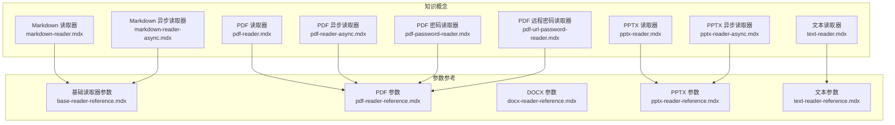
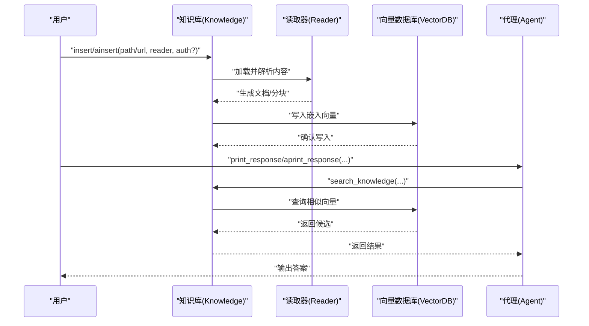
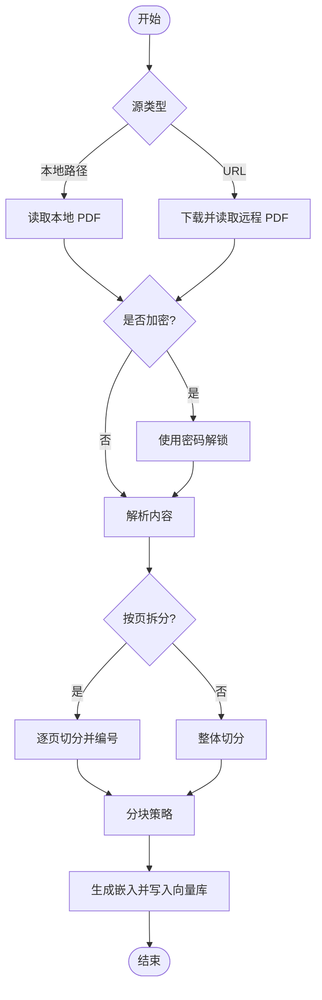
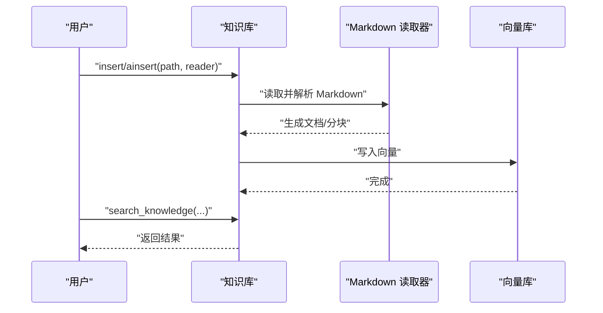
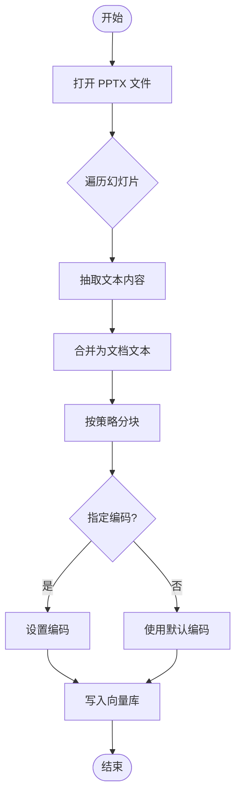
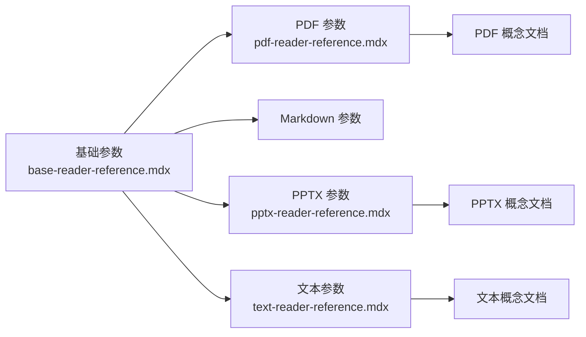

# 文本类读取器

<cite>
**本文引用的文件**
- [pdf-reader-reference.mdx](file://_snippets/pdf-reader-reference.mdx)
- [docx-reader-reference.mdx](file://_snippets/docx-reader-reference.mdx)
- [pptx-reader-reference.mdx](file://_snippets/pptx-reader-reference.mdx)
- [text-reader-reference.mdx](file://_snippets/text-reader-reference.mdx)
- [base-reader-reference.mdx](file://_snippets/base-reader-reference.mdx)
- [pdf-reader.mdx](file://knowledge/concepts/readers/pdf-reader.mdx)
- [pdf-reader-async.mdx](file://knowledge/concepts/readers/pdf-reader-async.mdx)
- [pdf-password-reader.mdx](file://knowledge/concepts/readers/pdf-password-reader.mdx)
- [pdf-url-password-reader.mdx](file://knowledge/concepts/readers/pdf-url-password-reader.mdx)
- [markdown-reader.mdx](file://knowledge/concepts/readers/markdown-reader.mdx)
- [markdown-reader-async.mdx](file://knowledge/concepts/readers/markdown-reader-async.mdx)
- [pptx-reader.mdx](file://knowledge/concepts/readers/pptx-reader.mdx)
- [pptx-reader-async.mdx](file://knowledge/concepts/readers/pptx-reader-async.mdx)
- [text-reader.mdx](file://knowledge/concepts/readers/text-reader.mdx)
- [csv-reader-reference.mdx](file://_snippets/csv-reader-reference.mdx)
- [json-reader-reference.mdx](file://_snippets/json-reader-reference.mdx)
- [arxiv-reader-reference.mdx](file://_snippets/arxiv-reader-reference.mdx)
- [firecrawl-reader-reference.mdx](file://_snippets/firecrawl-reader-reference.mdx)
- [website-reader-reference.mdx](file://_snippets/website-reader-reference.mdx)
- [wikipedia-reader-reference.mdx](file://_snippets/wikipedia-reader-reference.mdx)
- [youtube-reader-reference.mdx](file://_snippets/youtube-reader-reference.mdx)
- [web-search-reader-reference.mdx](file://_snippets/web-search-reader-reference.mdx)
- [csv-url-reader-reference.mdx](file://_snippets/csv-url-reader-reference.mdx)
- [field-labeled-csv-reader-reference.mdx](file://_snippets/field-labeled-csv-reader-reference.mdx)
</cite>

## 目录
1. [简介](#简介)
2. [项目结构](#项目结构)
3. [核心组件](#核心组件)
4. [架构总览](#架构总览)
5. [详细组件分析](#详细组件分析)
6. [依赖关系分析](#依赖关系分析)
7. [性能考量](#性能考量)
8. [故障排查指南](#故障排查指南)
9. [结论](#结论)
10. [附录](#附录)

## 简介
本文件面向“文本类读取器”的使用者与维护者，系统性梳理并讲解以下常见文档格式的读取器配置与使用方法：PDF（含密码保护与异步）、纯文本、Markdown（含异步）、DOCX、PPTX。文档重点说明各读取器的特有参数（如 PDF 的密码处理、分页拆分；DOCX 的输入对象类型；PPTX 的分块策略与编码等），并提供批量处理、异步读取与错误处理的最佳实践路径与图示。

## 项目结构
围绕文本类读取器，知识体系中的概念文档与参考片段分布如下：
- 概念文档：位于 knowledge/concepts/readers 下，覆盖 PDF、Markdown、PPTX、文本等读取器的使用示例与步骤说明。
- 参考片段：位于 _snippets 下，以表格形式列出各读取器的参数定义与默认值，便于快速查阅。

**图表来源**
- [pdf-reader.mdx:1-78](file://knowledge/concepts/readers/pdf-reader.mdx#L1-L78)
- [pdf-reader-async.mdx:1-81](file://knowledge/concepts/readers/pdf-reader-async.mdx#L1-L81)
- [pdf-password-reader.mdx:1-78](file://knowledge/concepts/readers/pdf-password-reader.mdx#L1-L78)
- [pdf-url-password-reader.mdx:1-73](file://knowledge/concepts/readers/pdf-url-password-reader.mdx#L1-L73)
- [markdown-reader.mdx:1-75](file://knowledge/concepts/readers/markdown-reader.mdx#L1-L75)
- [markdown-reader-async.mdx:1-78](file://knowledge/concepts/readers/markdown-reader-async.mdx#L1-L78)
- [pptx-reader.mdx:1-69](file://knowledge/concepts/readers/pptx-reader.mdx#L1-L69)
- [pptx-reader-async.mdx:1-81](file://knowledge/concepts/readers/pptx-reader-async.mdx#L1-L81)
- [text-reader.mdx](file://knowledge/concepts/readers/text-reader.mdx)
- [base-reader-reference.mdx:1-10](file://_snippets/base-reader-reference.mdx#L1-L10)
- [pdf-reader-reference.mdx:1-7](file://_snippets/pdf-reader-reference.mdx#L1-L7)
- [docx-reader-reference.mdx:1-4](file://_snippets/docx-reader-reference.mdx#L1-L4)
- [pptx-reader-reference.mdx:1-9](file://_snippets/pptx-reader-reference.mdx#L1-L9)
- [text-reader-reference.mdx:1-4](file://_snippets/text-reader-reference.mdx#L1-L4)

**章节来源**
- [pdf-reader.mdx:1-78](file://knowledge/concepts/readers/pdf-reader.mdx#L1-L78)
- [markdown-reader.mdx:1-75](file://knowledge/concepts/readers/markdown-reader.mdx#L1-L75)
- [pptx-reader.mdx:1-69](file://knowledge/concepts/readers/pptx-reader.mdx#L1-L69)
- [text-reader.mdx](file://knowledge/concepts/readers/text-reader.mdx)
- [base-reader-reference.mdx:1-10](file://_snippets/base-reader-reference.mdx#L1-L10)
- [pdf-reader-reference.mdx:1-7](file://_snippets/pdf-reader-reference.mdx#L1-L7)
- [docx-reader-reference.mdx:1-4](file://_snippets/docx-reader-reference.mdx#L1-L4)
- [pptx-reader-reference.mdx:1-9](file://_snippets/pptx-reader-reference.mdx#L1-L9)
- [text-reader-reference.mdx:1-4](file://_snippets/text-reader-reference.mdx#L1-L4)

## 核心组件
- 基础读取器参数（适用于多数文本类读取器）
  - 分块开关、分块大小、分隔符列表、分块策略、名称、描述、最大返回结果数
- PDF 读取器
  - 路径或 URL、按页拆分、页码编号格式、密码
- DOCX 读取器
  - 文件路径或字节流对象
- PPTX 读取器
  - 文件路径或字节流对象、文档名、是否分块、分块大小、分块策略、文本编码
- 文本读取器
  - 文件路径或字节流对象

以上参数定义与默认值可参考对应参考片段。

**章节来源**
- [base-reader-reference.mdx:1-10](file://_snippets/base-reader-reference.mdx#L1-L10)
- [pdf-reader-reference.mdx:1-7](file://_snippets/pdf-reader-reference.mdx#L1-L7)
- [docx-reader-reference.mdx:1-4](file://_snippets/docx-reader-reference.mdx#L1-L4)
- [pptx-reader-reference.mdx:1-9](file://_snippets/pptx-reader-reference.mdx#L1-L9)
- [text-reader-reference.mdx:1-4](file://_snippets/text-reader-reference.mdx#L1-L4)

## 架构总览
下图展示了从“知识库插入”到“代理检索”的典型流程，涵盖同步与异步两种执行模式，并标注了 PDF 密码与远程 URL 的特殊处理点。

**图表来源**
- [pdf-reader.mdx:1-78](file://knowledge/concepts/readers/pdf-reader.mdx#L1-L78)
- [pdf-reader-async.mdx:1-81](file://knowledge/concepts/readers/pdf-reader-async.mdx#L1-L81)
- [markdown-reader.mdx:1-75](file://knowledge/concepts/readers/markdown-reader.mdx#L1-L75)
- [markdown-reader-async.mdx:1-78](file://knowledge/concepts/readers/markdown-reader-async.mdx#L1-L78)
- [pptx-reader.mdx:1-69](file://knowledge/concepts/readers/pptx-reader.mdx#L1-L69)
- [pptx-reader-async.mdx:1-81](file://knowledge/concepts/readers/pptx-reader-async.mdx#L1-L81)

## 详细组件分析

### PDF 读取器
- 特有参数
  - 路径或 URL（支持远程链接）
  - 是否按页拆分
  - 页码编号格式（起始/结束）
  - 密码（用于解锁受保护的 PDF）
- 使用要点
  - 同步与异步两种模式均可使用
  - 远程受保护 PDF 可通过 ContentAuth 提供密码
- 最佳实践
  - 大文件建议开启按页拆分，便于后续检索定位
  - 批量处理时优先异步，提升吞吐
  - 对于加密 PDF，尽量在本地解密后再入库，避免网络传输风险

**图表来源**
- [pdf-reader.mdx:1-78](file://knowledge/concepts/readers/pdf-reader.mdx#L1-L78)
- [pdf-reader-async.mdx:1-81](file://knowledge/concepts/readers/pdf-reader-async.mdx#L1-L81)
- [pdf-password-reader.mdx:1-78](file://knowledge/concepts/readers/pdf-password-reader.mdx#L1-L78)
- [pdf-url-password-reader.mdx:1-73](file://knowledge/concepts/readers/pdf-url-password-reader.mdx#L1-L73)

**章节来源**
- [pdf-reader.mdx:1-78](file://knowledge/concepts/readers/pdf-reader.mdx#L1-L78)
- [pdf-reader-async.mdx:1-81](file://knowledge/concepts/readers/pdf-reader-async.mdx#L1-L81)
- [pdf-password-reader.mdx:1-78](file://knowledge/concepts/readers/pdf-password-reader.mdx#L1-L78)
- [pdf-url-password-reader.mdx:1-73](file://knowledge/concepts/readers/pdf-url-password-reader.mdx#L1-L73)
- [pdf-reader-reference.mdx:1-7](file://_snippets/pdf-reader-reference.mdx#L1-L7)

### Markdown 读取器
- 特有参数
  - 继承基础读取器的分块与检索相关参数
- 使用要点
  - 支持同步与异步两种模式
  - 适合文档型内容，天然具备层级结构，利于检索
- 最佳实践
  - 配合合适的分块策略与分隔符，提升检索命中率
  - 异步批量导入，缩短等待时间

**图表来源**
- [markdown-reader.mdx:1-75](file://knowledge/concepts/readers/markdown-reader.mdx#L1-L75)
- [markdown-reader-async.mdx:1-78](file://knowledge/concepts/readers/markdown-reader-async.mdx#L1-L78)

**章节来源**
- [markdown-reader.mdx:1-75](file://knowledge/concepts/readers/markdown-reader.mdx#L1-L75)
- [markdown-reader-async.mdx:1-78](file://knowledge/concepts/readers/markdown-reader-async.mdx#L1-L78)
- [base-reader-reference.mdx:1-10](file://_snippets/base-reader-reference.mdx#L1-L10)

### DOCX 读取器
- 特有参数
  - 接受路径或字节流对象作为输入
- 使用要点
  - 输入对象类型灵活，便于内存中直接处理
- 最佳实践
  - 对于大体量文档，建议先评估样式保留需求再决定是否入库
  - 若需保留复杂排版，可结合其他预处理工具

**章节来源**
- [docx-reader-reference.mdx:1-4](file://_snippets/docx-reader-reference.mdx#L1-L4)

### PPTX 读取器
- 特有参数
  - 文件路径或字节流对象
  - 文档名（可选）
  - 是否分块、分块大小、分块策略
  - 文本编码（可选）
- 使用要点
  - 幻灯片内容通常包含大量文本与布局信息，合理分块有助于检索
- 最佳实践
  - 对长演示文稿启用分块与合适的分块大小
  - 异步批量导入，提高吞吐

**图表来源**
- [pptx-reader.mdx:1-69](file://knowledge/concepts/readers/pptx-reader.mdx#L1-L69)
- [pptx-reader-async.mdx:1-81](file://knowledge/concepts/readers/pptx-reader-async.mdx#L1-L81)
- [pptx-reader-reference.mdx:1-9](file://_snippets/pptx-reader-reference.mdx#L1-L9)

**章节来源**
- [pptx-reader.mdx:1-69](file://knowledge/concepts/readers/pptx-reader.mdx#L1-L69)
- [pptx-reader-async.mdx:1-81](file://knowledge/concepts/readers/pptx-reader-async.mdx#L1-L81)
- [pptx-reader-reference.mdx:1-9](file://_snippets/pptx-reader-reference.mdx#L1-L9)

### 纯文本读取器
- 特有参数
  - 接受路径或字节流对象作为输入
- 使用要点
  - 适合无结构或简单结构的纯文本
- 最佳实践
  - 结合基础读取器的分块策略，提升检索质量

**章节来源**
- [text-reader-reference.mdx:1-4](file://_snippets/text-reader-reference.mdx#L1-L4)
- [base-reader-reference.mdx:1-10](file://_snippets/base-reader-reference.mdx#L1-L10)

## 依赖关系分析
- 公共依赖
  - 基础读取器参数（分块、分隔符、策略、最大返回数）被多数读取器继承
- PDF 专属依赖
  - 支持本地路径、URL、密码解锁、按页拆分
- PPTX 专属依赖
  - 需要处理幻灯片文本与布局，对分块策略敏感
- 文本类通用依赖
  - 路径或字节流输入，便于内存与磁盘双场景使用

**图表来源**
- [base-reader-reference.mdx:1-10](file://_snippets/base-reader-reference.mdx#L1-L10)
- [pdf-reader-reference.mdx:1-7](file://_snippets/pdf-reader-reference.mdx#L1-L7)
- [pptx-reader-reference.mdx:1-9](file://_snippets/pptx-reader-reference.mdx#L1-L9)
- [text-reader-reference.mdx:1-4](file://_snippets/text-reader-reference.mdx#L1-L4)
- [pdf-reader.mdx:1-78](file://knowledge/concepts/readers/pdf-reader.mdx#L1-L78)
- [pptx-reader.mdx:1-69](file://knowledge/concepts/readers/pptx-reader.mdx#L1-L69)
- [text-reader.mdx](file://knowledge/concepts/readers/text-reader.mdx)

**章节来源**
- [base-reader-reference.mdx:1-10](file://_snippets/base-reader-reference.mdx#L1-L10)
- [pdf-reader-reference.mdx:1-7](file://_snippets/pdf-reader-reference.mdx#L1-L7)
- [pptx-reader-reference.mdx:1-9](file://_snippets/pptx-reader-reference.mdx#L1-L9)
- [text-reader-reference.mdx:1-4](file://_snippets/text-reader-reference.mdx#L1-L4)

## 性能考量
- 异步优先：对大批量 PDF、PPTX、Markdown 文档，优先使用异步插入（ainsert）以提升吞吐
- 分块策略：根据内容长度与检索目标选择合适的分块大小与分隔符，避免过小导致向量库膨胀，过大影响检索精度
- 编码与解码：PPTX 可指定编码，确保非 ASCII 内容正确解析
- 密码处理：尽量在本地解密后入库，减少网络传输与安全风险

## 故障排查指南
- PDF 解锁失败
  - 确认密码正确且未被二次加密
  - 如为远程受保护 PDF，优先本地下载后处理
- 文档为空或检索无结果
  - 检查分块大小与分隔符是否合理
  - 确认向量库已成功写入
- PPTX 中文乱码
  - 指定正确的文本编码
- 大文件导入缓慢
  - 启用异步插入与按页拆分（PDF）

## 结论
文本类读取器围绕“统一的分块与检索能力”与“特定格式的解析策略”展开。通过合理配置参数（尤其是 PDF 的密码与分页、PPTX 的分块与编码、以及通用的基础分块策略），可在保证检索质量的同时显著提升批量处理效率。异步模式与本地化处理是大规模部署的关键。

## 附录
- 其他相关读取器参考（便于横向对比）
  - CSV/CSV-URL/字段标签 CSV
  - JSON
  - ArXiv、FireCrawl、网站、维基百科、YouTube、网页搜索
  - 以上均提供参数参考片段，便于按需扩展

**章节来源**
- [csv-reader-reference.mdx](file://_snippets/csv-reader-reference.mdx)
- [csv-url-reader-reference.mdx](file://_snippets/csv-url-reader-reference.mdx)
- [field-labeled-csv-reader-reference.mdx](file://_snippets/field-labeled-csv-reader-reference.mdx)
- [json-reader-reference.mdx](file://_snippets/json-reader-reference.mdx)
- [arxiv-reader-reference.mdx](file://_snippets/arxiv-reader-reference.mdx)
- [firecrawl-reader-reference.mdx](file://_snippets/firecrawl-reader-reference.mdx)
- [website-reader-reference.mdx](file://_snippets/website-reader-reference.mdx)
- [wikipedia-reader-reference.mdx](file://_snippets/wikipedia-reader-reference.mdx)
- [youtube-reader-reference.mdx](file://_snippets/youtube-reader-reference.mdx)
- [web-search-reader-reference.mdx](file://_snippets/web-search-reader-reference.mdx)