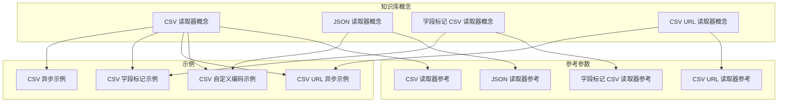
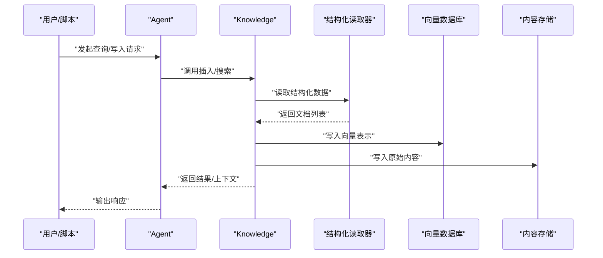
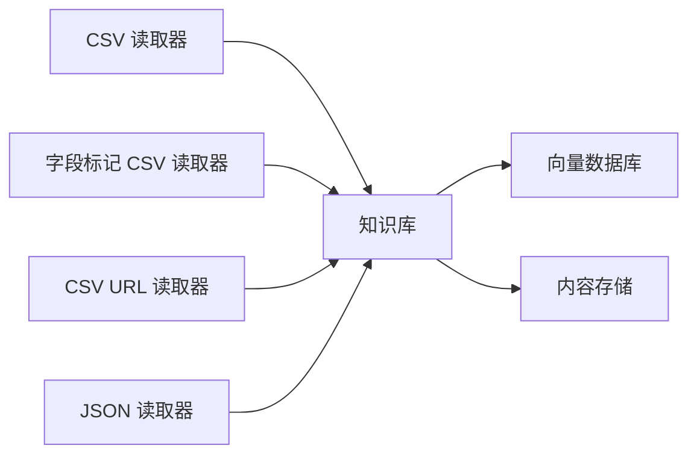

# 结构化数据读取器

<cite>
**本文引用的文件**
- [CSV 读取器参考](file://_snippets/csv-reader-reference.mdx)
- [JSON 读取器参考](file://_snippets/json-reader-reference.mdx)
- [字段标记 CSV 读取器参考](file://_snippets/field-labeled-csv-reader-reference.mdx)
- [CSV URL 读取器参考](file://_snippets/csv-url-reader-reference.mdx)
- [CSV 读取器（概念）](file://knowledge/concepts/readers/csv-reader.mdx)
- [JSON 读取器（概念）](file://knowledge/concepts/readers/json-reader.mdx)
- [字段标记 CSV 读取器（概念）](file://knowledge/concepts/readers/field-labeled-csv-reader.mdx)
- [CSV URL 读取器（概念）](file://knowledge/concepts/readers/csv-url-reader.mdx)
- [CSV 自定义编码示例](file://examples/knowledge/readers/csv-reader-custom-encodings.mdx)
- [CSV URL 异步示例](file://examples/knowledge/readers/csv-reader-url-async.mdx)
- [CSV 字段标记示例](file://examples/knowledge/readers/csv-field-labeled-reader.mdx)
- [CSV 异步示例](file://examples/knowledge/readers/csv-reader-async.mdx)
</cite>

## 目录
1. [简介](#简介)
2. [项目结构](#项目结构)
3. [核心组件](#核心组件)
4. [架构总览](#架构总览)
5. [详细组件分析](#详细组件分析)
6. [依赖关系分析](#依赖关系分析)
7. [性能考虑](#性能考虑)
8. [故障排查指南](#故障排查指南)
9. [结论](#结论)
10. [附录](#附录)

## 简介
本文件面向“结构化数据读取器”的使用者与维护者，系统性介绍 CSV 与 JSON 两类读取器的配置项、行为特性与典型用法。重点覆盖：
- CSV 读取器：编码处理、字段标签化、行转文档、URL 直读、异步写入等能力
- JSON 读取器：对象遍历、嵌套结构处理、分块输出等特性
- 实战示例：大数据集分批处理、错误数据跳过策略、性能优化技巧
- 编码与转义：多编码支持、特殊字符处理建议

## 项目结构
围绕“结构化数据读取器”，知识库文档中提供了三类核心内容：
- 参考参数表：明确各读取器的关键参数与默认值
- 概念与用法：通过示例展示读取器在知识库中的集成方式
- 示例工程：涵盖自定义编码、URL 直读、字段标记、异步写入等场景

图表来源
- [CSV 读取器（概念）:1-63](file://knowledge/concepts/readers/csv-reader.mdx#L1-L63)
- [JSON 读取器（概念）:1-73](file://knowledge/concepts/readers/json-reader.mdx#L1-L73)
- [字段标记 CSV 读取器（概念）:1-100](file://knowledge/concepts/readers/field-labeled-csv-reader.mdx#L1-L100)
- [CSV URL 读取器（概念）:1-77](file://knowledge/concepts/readers/csv-url-reader.mdx#L1-L77)

章节来源
- [CSV 读取器（概念）:1-63](file://knowledge/concepts/readers/csv-reader.mdx#L1-L63)
- [JSON 读取器（概念）:1-73](file://knowledge/concepts/readers/json-reader.mdx#L1-L73)
- [字段标记 CSV 读取器（概念）:1-100](file://knowledge/concepts/readers/field-labeled-csv-reader.mdx#L1-L100)
- [CSV URL 读取器（概念）:1-77](file://knowledge/concepts/readers/csv-url-reader.mdx#L1-L77)

## 核心组件
- CSV 读取器：从本地或远程 CSV 源读取数据，生成文档供知识库使用
- 字段标记 CSV 读取器：将每行转换为带字段标题的可读文本，便于检索与问答
- CSV URL 读取器：直接从 URL 下载并解析 CSV，适合远程数据源
- JSON 读取器：解析 JSON 文件，支持对象遍历与嵌套结构处理，可按需分块输出

章节来源
- [CSV 读取器参考:1-6](file://_snippets/csv-reader-reference.mdx#L1-L6)
- [JSON 读取器参考:1-5](file://_snippets/json-reader-reference.mdx#L1-L5)
- [字段标记 CSV 读取器参考:1-10](file://_snippets/field-labeled-csv-reader-reference.mdx#L1-L10)
- [CSV URL 读取器参考:1-4](file://_snippets/csv-url-reader-reference.mdx#L1-L4)

## 架构总览
下图展示了“结构化数据读取器”在知识库中的典型工作流：Agent 通过 Knowledge 调用读取器，读取器将结构化数据转换为文档，再写入向量数据库与内容存储。

图表来源
- [CSV URL 异步示例:1-59](file://examples/knowledge/readers/csv-reader-url-async.mdx#L1-L59)
- [CSV 自定义编码示例:1-60](file://examples/knowledge/readers/csv-reader-custom-encodings.mdx#L1-L60)
- [CSV 字段标记示例:1-105](file://examples/knowledge/readers/csv-field-labeled-reader.mdx#L1-L105)

## 详细组件分析

### CSV 读取器
- 功能要点
  - 支持本地文件路径与文件类对象输入
  - 可配置分隔符与引号字符
  - 默认编码为 UTF-8，可通过参数覆盖
  - 适用于批量写入知识库，支持异步插入
- 典型用法
  - 本地 CSV 文件读取与写入知识库
  - 远程 CSV URL 的直接读取与写入
  - 大数据集分批处理与错误跳过策略
- 参数概览
  - file：本地路径或文件类对象（必填）
  - delimiter：字段分隔符，默认逗号
  - quotechar：字段引号字符，默认双引号
  - encoding：文件编码，默认 UTF-8（可覆盖）

章节来源
- [CSV 读取器参考:1-6](file://_snippets/csv-reader-reference.mdx#L1-L6)
- [CSV 读取器（概念）:1-63](file://knowledge/concepts/readers/csv-reader.mdx#L1-L63)
- [CSV 异步示例:1-53](file://examples/knowledge/readers/csv-reader-async.mdx#L1-L53)
- [CSV URL 异步示例:1-59](file://examples/knowledge/readers/csv-reader-url-async.mdx#L1-L59)

### 字段标记 CSV 读取器
- 功能要点
  - 将每行转换为“字段标题 + 值”的可读文本
  - 支持自定义字段标题列表
  - 可格式化列头（如空格替换、标题大小写）
  - 可跳过空字段，减少噪声
  - 支持为每个条目添加统一标题
- 典型用法
  - 电影元数据等结构化表格的“人类可读”表示
  - 提升检索与问答系统的准确性
- 参数概览
  - file：本地路径或文件类对象（必填）
  - chunk_title：每个条目的标题（可为字符串或轮换列表）
  - field_names：自定义字段名列表（为空则使用列头）
  - format_headers：是否格式化列头
  - skip_empty_fields：是否跳过空字段
  - delimiter/quotechar/encoding：同 CSV 读取器

章节来源
- [字段标记 CSV 读取器参考:1-10](file://_snippets/field-labeled-csv-reader-reference.mdx#L1-L10)
- [字段标记 CSV 读取器（概念）:1-100](file://knowledge/concepts/readers/field-labeled-csv-reader.mdx#L1-L100)
- [CSV 字段标记示例:1-105](file://examples/knowledge/readers/csv-field-labeled-reader.mdx#L1-L105)

### CSV URL 读取器
- 功能要点
  - 直接从 URL 下载并解析 CSV
  - 适合远程数据源的快速知识库构建
- 典型用法
  - 从公开数据源导入 CSV 并写入知识库
- 参数概览
  - url：目标 CSV 文件的 URL（必填）

章节来源
- [CSV URL 读取器参考:1-4](file://_snippets/csv-url-reader-reference.mdx#L1-L4)
- [CSV URL 读取器（概念）:1-77](file://knowledge/concepts/readers/csv-url-reader.mdx#L1-L77)
- [CSV URL 异步示例:1-59](file://examples/knowledge/readers/csv-reader-url-async.mdx#L1-L59)

### JSON 读取器
- 功能要点
  - 解析 JSON 文件并转换为文档
  - 支持对象遍历与嵌套结构处理
  - 可开启分块输出以适配大文档
- 典型用法
  - 配置文件、日志、API 返回体等 JSON 数据的知识化
- 参数概览
  - path：JSON 文件路径（必填）
  - chunk：是否对文档进行分块（覆盖基类默认行为）

章节来源
- [JSON 读取器参考:1-5](file://_snippets/json-reader-reference.mdx#L1-L5)
- [JSON 读取器（概念）:1-73](file://knowledge/concepts/readers/json-reader.mdx#L1-L73)
- [JSON 读取器示例:1-73](file://examples/knowledge/readers/json-reader.mdx#L1-L73)

## 依赖关系分析
- 组件耦合
  - 读取器与知识库：读取器负责将结构化数据转换为文档，知识库负责持久化与检索
  - 向量数据库与内容存储：知识库将文档写入向量库与内容存储，支撑检索与溯源
- 外部依赖
  - CSV 场景常依赖 pandas、requests 等库用于解析与下载
  - JSON 场景依赖标准库或第三方 JSON 解析工具
- 潜在循环依赖
  - 读取器与知识库之间为单向依赖，无循环风险

图表来源
- [CSV URL 异步示例:1-59](file://examples/knowledge/readers/csv-reader-url-async.mdx#L1-L59)
- [CSV 字段标记示例:1-105](file://examples/knowledge/readers/csv-field-labeled-reader.mdx#L1-L105)
- [JSON 读取器（概念）:1-73](file://knowledge/concepts/readers/json-reader.mdx#L1-L73)

## 性能考虑
- 分批处理
  - 对于大型 CSV/JSON 文件，优先采用分块读取与分批写入，降低内存峰值
  - 在知识库层面对写入操作进行批量提交，减少事务开销
- 编码与解码
  - 明确指定文件编码，避免自动推断带来的性能损耗与错误
  - 对于非 UTF-8 文件，建议在读取阶段完成编码转换，减少后续处理成本
- 网络与并发
  - 远程 CSV/JSON 的下载应结合异步机制，提高吞吐
  - 控制并发度，避免对远端服务造成压力
- 文档质量
  - 使用字段标记 CSV 读取器提升检索质量，减少无效字段带来的噪声
  - 对空字段进行跳过，缩短向量化时间

## 故障排查指南
- 编码问题
  - 症状：中文乱码、解析异常
  - 处理：在读取器参数中显式设置 encoding；参考自定义编码示例
- 特殊字符与转义
  - 症状：字段截断、解析失败
  - 处理：检查分隔符与引号字符配置；必要时预处理数据或调整 quotechar/delimiter
- 错误数据跳过
  - 症状：部分行无法解析导致整体失败
  - 处理：启用字段标记 CSV 读取器的空字段跳过功能；或在上游清洗数据
- 远程访问失败
  - 症状：URL 读取超时或返回非 CSV 内容
  - 处理：确认 URL 可达性与内容类型；必要时增加重试与超时配置

章节来源
- [CSV 自定义编码示例:1-60](file://examples/knowledge/readers/csv-reader-custom-encodings.mdx#L1-L60)
- [字段标记 CSV 读取器参考:1-10](file://_snippets/field-labeled-csv-reader-reference.mdx#L1-L10)

## 结论
结构化数据读取器为知识库提供了从 CSV/JSON 到可检索文档的桥梁。通过合理配置编码、分隔符、字段标题与分块策略，可在保证性能的同时提升检索质量。对于大规模数据，建议采用分批处理与异步写入，并结合错误跳过与预清洗策略，确保稳定性与一致性。

## 附录
- 快速参数对照
  - CSV 读取器：file、delimiter、quotechar、encoding
  - 字段标记 CSV 读取器：file、chunk_title、field_names、format_headers、skip_empty_fields、delimiter、quotechar、encoding
  - CSV URL 读取器：url
  - JSON 读取器：path、chunk