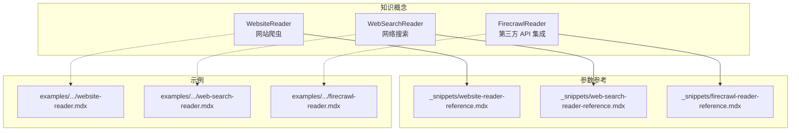
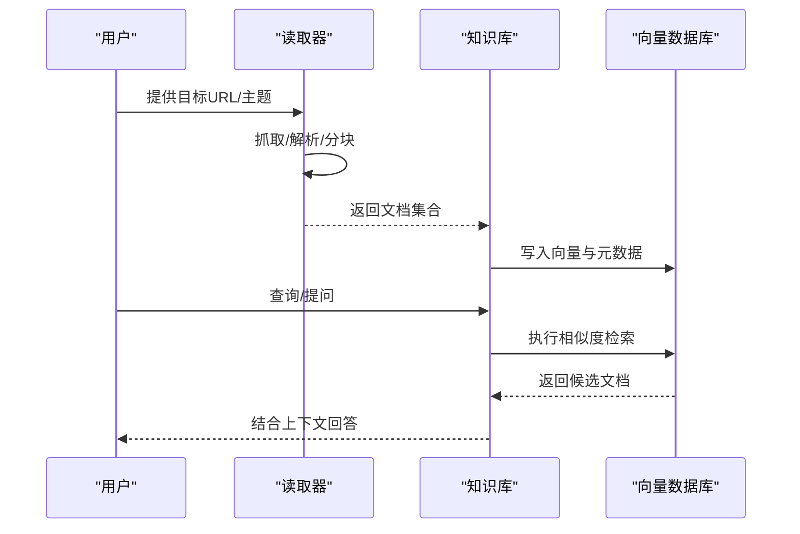
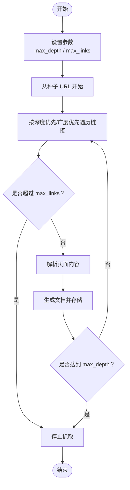
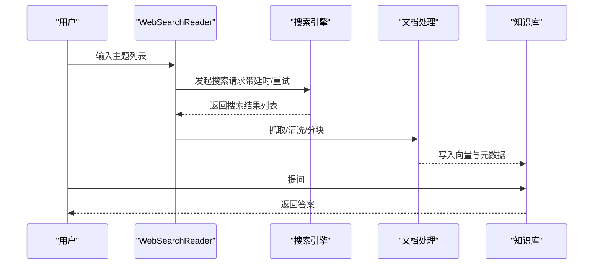
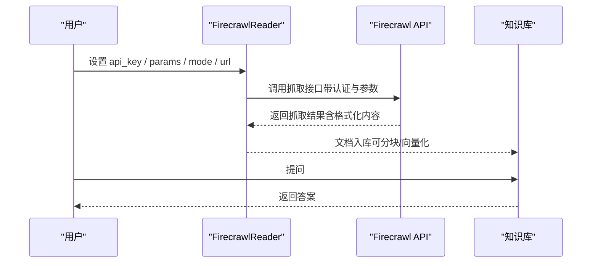
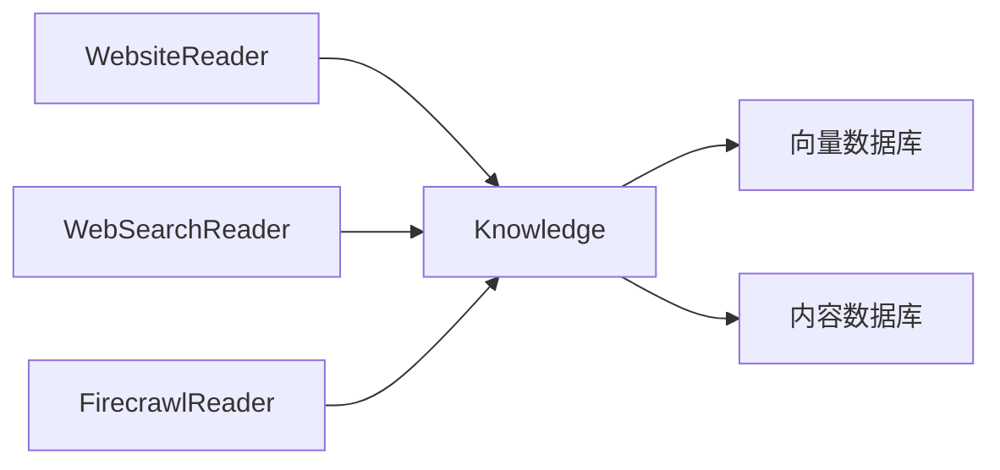

# 网页内容读取器

<cite>
**本文档引用的文件**
- [website-reader.mdx](file://knowledge/concepts/readers/website-reader.mdx)
- [web-search-reader.mdx](file://knowledge/concepts/readers/web-search-reader.mdx)
- [firecrawl-reader.mdx](file://knowledge/concepts/readers/firecrawl-reader.mdx)
- [_snippets/website-reader-reference.mdx](file://_snippets/website-reader-reference.mdx)
- [_snippets/web-search-reader-reference.mdx](file://_snippets/web-search-reader-reference.mdx)
- [_snippets/firecrawl-reader-reference.mdx](file://_snippets/firecrawl-reader-reference.mdx)
- [examples/knowledge/readers/website-reader.mdx](file://examples/knowledge/readers/website-reader.mdx)
- [examples/knowledge/readers/web-search-reader.mdx](file://examples/knowledge/readers/web-search-reader.mdx)
- [examples/knowledge/readers/firecrawl-reader.mdx](file://examples/knowledge/readers/firecrawl-reader.mdx)
</cite>

## 目录
1. [简介](#简介)
2. [项目结构](#项目结构)
3. [核心组件](#核心组件)
4. [架构总览](#架构总览)
5. [详细组件分析](#详细组件分析)
6. [依赖关系分析](#依赖关系分析)
7. [性能考量](#性能考量)
8. [故障排查指南](#故障排查指南)
9. [结论](#结论)
10. [附录](#附录)

## 简介
本文件面向需要从网页抓取与检索知识内容的用户，系统性介绍三类“网页内容读取器”的使用方法与最佳实践：WebsiteReader（网站爬虫）、WebSearchReader（网络搜索）、以及 FirecrawlReader（第三方 API 集成）。文档覆盖以下关键主题：
- WebsiteReader 的递归爬取配置、链接过滤规则与深度控制
- WebSearchReader 的搜索参数定制与结果处理流程
- FirecrawlReader 的 API 集成与高级抓取选项
- 网络安全与反爬虫应对策略、速率限制处理
- 异步处理与批量抓取的性能优化方案

## 项目结构
围绕网页读取能力，知识概念文档与示例组织如下：
- 概念与用法：website-reader.mdx、web-search-reader.mdx、firecrawl-reader.mdx
- 参数参考：_snippets 下对应 reference 文件
- 示例工程：examples/knowledge/readers 下的 .mdx 示例文件

图表来源
- [website-reader.mdx:1-64](file://knowledge/concepts/readers/website-reader.mdx#L1-L64)
- [web-search-reader.mdx:1-90](file://knowledge/concepts/readers/web-search-reader.mdx#L1-L90)
- [firecrawl-reader.mdx:1-81](file://knowledge/concepts/readers/firecrawl-reader.mdx#L1-L81)
- [_snippets/website-reader-reference.mdx:1-6](file://_snippets/website-reader-reference.mdx#L1-L6)
- [_snippets/web-search-reader-reference.mdx:1-14](file://_snippets/web-search-reader-reference.mdx#L1-L14)
- [_snippets/firecrawl-reader-reference.mdx:1-7](file://_snippets/firecrawl-reader-reference.mdx#L1-L7)

章节来源
- [website-reader.mdx:1-64](file://knowledge/concepts/readers/website-reader.mdx#L1-L64)
- [web-search-reader.mdx:1-90](file://knowledge/concepts/readers/web-search-reader.mdx#L1-L90)
- [firecrawl-reader.mdx:1-81](file://knowledge/concepts/readers/firecrawl-reader.mdx#L1-L81)

## 核心组件
本节概述三类读取器的功能定位与适用场景：
- WebsiteReader：对单个网站进行递归爬取，适合构建完整的站点知识库
- WebSearchReader：基于搜索结果抓取网页内容，适合快速获取外部信息
- FirecrawlReader：通过 Firecrawl API 进行网页抓取或爬取，适合需要稳定服务端抓取能力的场景

章节来源
- [website-reader.mdx:5-6](file://knowledge/concepts/readers/website-reader.mdx#L5-L6)
- [web-search-reader.mdx:5-6](file://knowledge/concepts/readers/web-search-reader.mdx#L5-L6)
- [firecrawl-reader.mdx:5-6](file://knowledge/concepts/readers/firecrawl-reader.mdx#L5-L6)

## 架构总览
下图展示三类读取器在知识库中的典型工作流：输入目标（URL 或主题）→ 读取器抓取 → 文档标准化 → 向量化入库 → 检索问答。

## 详细组件分析

### WebsiteReader（网站爬虫）
WebsiteReader 支持对指定网站进行递归爬取，生成可用于知识库的文档集合。其核心参数包括：
- url：必填，要爬取的网站地址
- max_depth：最大递归深度，默认值见参数表
- max_links：最大链接抓取数量，默认值见参数表

参数参考
- [website-reader-reference.mdx:1-6](file://_snippets/website-reader-reference.mdx#L1-L6)

使用示例
- 基础用法与安装、运行步骤参见：[website-reader.mdx:31-64](file://knowledge/concepts/readers/website-reader.mdx#L31-L64)
- 示例工程：[examples/knowledge/readers/website-reader.mdx:1-56](file://examples/knowledge/readers/website-reader.mdx#L1-L56)

递归爬取与深度控制
- 通过 max_depth 控制爬取层级，避免无限递归
- 通过 max_links 控制总抓取链接数，平衡覆盖率与资源消耗

链接过滤规则
- 可结合业务需求在调用前对目标域名或路径进行白名单/黑名单预处理
- 若需更细粒度过滤，可在读取器外部对返回的文档列表进行二次筛选

图表来源
- [_snippets/website-reader-reference.mdx:3-6](file://_snippets/website-reader-reference.mdx#L3-L6)

章节来源
- [website-reader.mdx:31-64](file://knowledge/concepts/readers/website-reader.mdx#L31-L64)
- [_snippets/website-reader-reference.mdx:1-6](file://_snippets/website-reader-reference.mdx#L1-L6)
- [examples/knowledge/readers/website-reader.mdx:1-56](file://examples/knowledge/readers/website-reader.mdx#L1-L56)

### WebSearchReader（网络搜索）
WebSearchReader 将搜索主题转换为网页结果，并将其转化为可嵌入的知识文档。关键参数包括：
- search_timeout：搜索操作超时（秒）
- request_timeout：HTTP 请求超时（秒）
- delay_between_requests：请求间隔（秒）
- max_retries：失败重试次数
- user_agent：HTTP 请求头中的 User-Agent
- search_engine：可选搜索引擎（duckduckgo/google）
- search_delay：搜索请求间隔（秒）
- max_search_retries：搜索失败重试次数
- rate_limit_delay：触发限速后的等待时间（秒）
- exponential_backoff：是否启用指数退避重试
- chunking_strategy：内容分块策略（默认语义分块）

参数参考
- [web-search-reader-reference.mdx:1-14](file://_snippets/web-search-reader-reference.mdx#L1-L14)

使用示例
- 基础用法与安装、运行步骤参见：[web-search-reader.mdx:56-90](file://knowledge/concepts/readers/web-search-reader.mdx#L56-L90)
- 示例工程：[examples/knowledge/readers/web-search-reader.mdx:1-68](file://examples/knowledge/readers/web-search-reader.mdx#L1-L68)

搜索参数定制与结果处理
- 主题到结果：topics → 搜索引擎 → 结果列表
- 结果处理：逐条抓取、清洗、分块、向量化、写入知识库
- 检索问答：开启 search_knowledge，结合模型回答

图表来源
- [web-search-reader.mdx:32-54](file://knowledge/concepts/readers/web-search-reader.mdx#L32-L54)
- [_snippets/web-search-reader-reference.mdx:1-14](file://_snippets/web-search-reader-reference.mdx#L1-L14)

章节来源
- [web-search-reader.mdx:56-90](file://knowledge/concepts/readers/web-search-reader.mdx#L56-L90)
- [_snippets/web-search-reader-reference.mdx:1-14](file://_snippets/web-search-reader-reference.mdx#L1-L14)
- [examples/knowledge/readers/web-search-reader.mdx:1-68](file://examples/knowledge/readers/web-search-reader.mdx#L1-L68)

### FirecrawlReader（第三方 API 集成）
FirecrawlReader 通过 Firecrawl API 实现网页抓取或爬取，支持多种输出格式与高级参数。关键参数包括：
- api_key：Firecrawl API 密钥（认证）
- params：传递给 Firecrawl API 的额外参数
- mode：抓取模式（scrape 单页、crawl 多页）
- url：目标网站地址（必填）

参数参考
- [firecrawl-reader-reference.mdx:1-7](file://_snippets/firecrawl-reader-reference.mdx#L1-L7)

使用示例
- 基础用法与安装、运行步骤参见：[firecrawl-reader.mdx:47-81](file://knowledge/concepts/readers/firecrawl-reader.mdx#L47-L81)
- 示例工程：[examples/knowledge/readers/firecrawl-reader.mdx:1-58](file://examples/knowledge/readers/firecrawl-reader.mdx#L1-L58)

高级抓取选项
- 输出格式：如 markdown 等
- 爬取范围：限制数量、选择抓取选项
- 错误处理：结合重试与退避策略

图表来源
- [firecrawl-reader.mdx:16-45](file://knowledge/concepts/readers/firecrawl-reader.mdx#L16-L45)
- [_snippets/firecrawl-reader-reference.mdx:1-7](file://_snippets/firecrawl-reader-reference.mdx#L1-L7)

章节来源
- [firecrawl-reader.mdx:47-81](file://knowledge/concepts/readers/firecrawl-reader.mdx#L47-L81)
- [_snippets/firecrawl-reader-reference.mdx:1-7](file://_snippets/firecrawl-reader-reference.mdx#L1-L7)
- [examples/knowledge/readers/firecrawl-reader.mdx:1-58](file://examples/knowledge/readers/firecrawl-reader.mdx#L1-L58)

## 依赖关系分析
三类读取器均作为知识库的“数据源”，其共同依赖知识库的存储与向量化能力。下图给出高层依赖关系：

图表来源
- [website-reader.mdx:16-39](file://knowledge/concepts/readers/website-reader.mdx#L16-L39)
- [web-search-reader.mdx:25-48](file://knowledge/concepts/readers/web-search-reader.mdx#L25-L48)
- [firecrawl-reader.mdx:12-45](file://knowledge/concepts/readers/firecrawl-reader.mdx#L12-L45)

章节来源
- [website-reader.mdx:16-39](file://knowledge/concepts/readers/website-reader.mdx#L16-L39)
- [web-search-reader.mdx:25-48](file://knowledge/concepts/readers/web-search-reader.mdx#L25-L48)
- [firecrawl-reader.mdx:12-45](file://knowledge/concepts/readers/firecrawl-reader.mdx#L12-L45)

## 性能考量
- 异步与并发
  - 对于 WebSearchReader 与 FirecrawlReader，建议在批量任务中采用异步/并发策略，以减少等待时间
  - 注意合理设置 delay_between_requests 与 search_delay，避免触发限速
- 分块与向量化
  - 使用合理的 chunking_strategy，平衡召回质量与计算成本
  - 对大文档进行分块后向量化，提升检索效率
- 缓存与重试
  - 启用指数退避（exponential_backoff），在失败与限速时自动退避
  - 对重复请求进行缓存，降低重复抓取开销
- 资源配额
  - FirecrawlReader 需关注 API 调用配额与速率限制，必要时升级订阅计划

## 故障排查指南
- 网络与权限
  - 确认代理/防火墙未阻断请求
  - 检查 user_agent 是否被目标站点识别为机器人
- 速率限制
  - 提高 rate_limit_delay 与 delay_between_requests
  - 启用指数退避（exponential_backoff）以自适应限速
- 搜索稳定性
  - 调整 search_engine 与 search_delay，避开高峰时段
  - 适当提高 max_search_retries 与 max_retries
- API 认证
  - FirecrawlReader：确认 api_key 正确且未过期
  - WebSearchReader：确保环境变量与网络可达性正常
- 结果质量
  - 通过 params 调整抓取选项（如输出格式），提升内容可用性
  - 在入库前对文档进行清洗与过滤，剔除低质量内容

章节来源
- [_snippets/web-search-reader-reference.mdx:1-14](file://_snippets/web-search-reader-reference.mdx#L1-L14)
- [_snippets/firecrawl-reader-reference.mdx:1-7](file://_snippets/firecrawl-reader-reference.mdx#L1-L7)

## 结论
- WebsiteReader 适合构建完整站点的知识库，应谨慎设置 max_depth 与 max_links，避免过度抓取
- WebSearchReader 适合快速获取外部信息，需合理配置延时、重试与限速策略
- FirecrawlReader 提供稳定的第三方抓取能力，需重视 API 认证与配额管理
- 统一采用分块与向量化策略，结合检索增强生成（RAG）获得最佳问答效果

## 附录
- 快速对照表（参数与用途）
  - WebsiteReader：url、max_depth、max_links
  - WebSearchReader：search_timeout、request_timeout、delay_between_requests、max_retries、user_agent、search_engine、search_delay、max_search_retries、rate_limit_delay、exponential_backoff、chunking_strategy
  - FirecrawlReader：api_key、params、mode、url

章节来源
- [_snippets/website-reader-reference.mdx:1-6](file://_snippets/website-reader-reference.mdx#L1-L6)
- [_snippets/web-search-reader-reference.mdx:1-14](file://_snippets/web-search-reader-reference.mdx#L1-L14)
- [_snippets/firecrawl-reader-reference.mdx:1-7](file://_snippets/firecrawl-reader-reference.mdx#L1-L7)