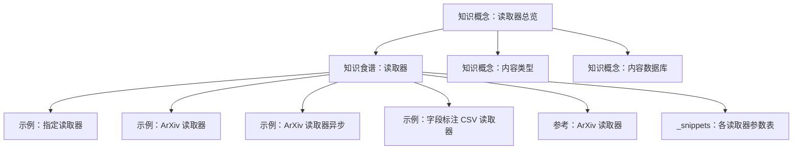
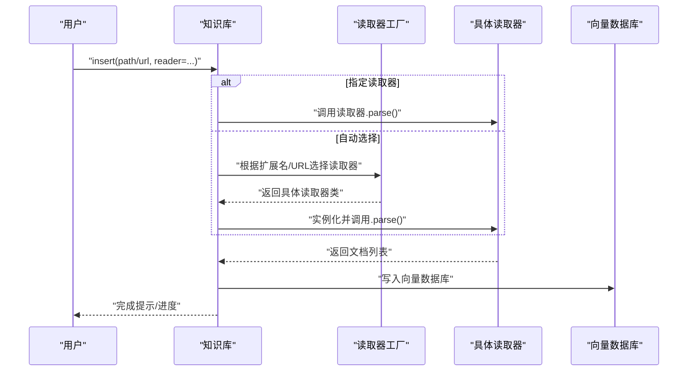
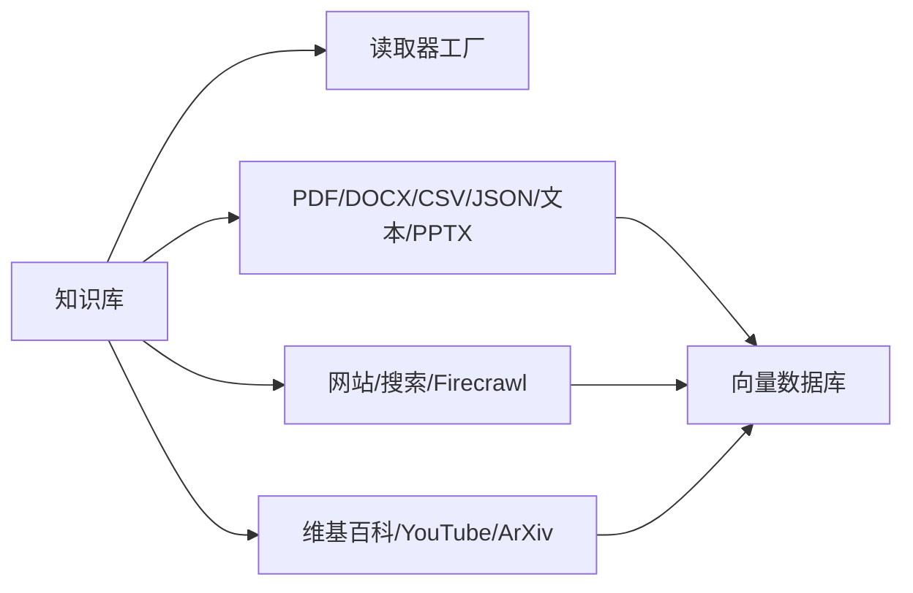

# 读取器系统

<cite>
**本文引用的文件**
- [知识概念：读取器总览](file://knowledge/concepts/readers/overview.mdx)
- [知识概念：内容类型](file://knowledge/concepts/content-types.mdx)
- [知识概念：内容数据库](file://knowledge/concepts/contents-db.mdx)
- [知识食谱：读取器](file://cookbook/knowledge/readers.mdx)
- [示例：指定读取器](file://examples/knowledge/quickstart/specify-reader.mdx)
- [示例：ArXiv 读取器](file://examples/knowledge/readers/arxiv-reader.mdx)
- [示例：ArXiv 读取器（异步）](file://examples/knowledge/readers/arxiv-reader-async.mdx)
- [示例：字段标注 CSV 读取器](file://examples/knowledge/readers/csv-field-labeled-reader.mdx)
- [参考：ArXiv 读取器](file://reference/knowledge/reader/arxiv.mdx)
- [_snippets：PDF 读取器参考](file://_snippets/pdf-reader-reference.mdx)
- [_snippets：DOCX 读取器参考](file://_snippets/docx-reader-reference.mdx)
- [_snippets：CSV 读取器参考](file://_snippets/csv-reader-reference.mdx)
- [_snippets：JSON 读取器参考](file://_snippets/json-reader-reference.mdx)
- [_snippets：文本读取器参考](file://_snippets/text-reader-reference.mdx)
- [_snippets：PPTX 读取器参考](file://_snippets/pptx-reader-reference.mdx)
- [_snippets：维基百科读取器参考](file://_snippets/wikipedia-reader-reference.mdx)
- [_snippets：YouTube 读取器参考](file://_snippets/youtube-reader-reference.mdx)
- [_snippets：网站读取器参考](file://_snippets/website-reader-reference.mdx)
- [_snippets：Firecrawl 读取器参考](file://_snippets/firecrawl-reader-reference.mdx)
- [_snippets：网络搜索读取器参考](file://_snippets/web-search-reader-reference.mdx)
</cite>

## 目录
1. [简介](#简介)
2. [项目结构](#项目结构)
3. [核心组件](#核心组件)
4. [架构概览](#架构概览)
5. [详细组件分析](#详细组件分析)
6. [依赖分析](#依赖分析)
7. [性能考虑](#性能考虑)
8. [故障排除指南](#故障排除指南)
9. [结论](#结论)
10. [附录](#附录)

## 简介
本文件面向“读取器系统”的使用者与维护者，系统性介绍 Agno 支持的各类内容读取器，覆盖 PDF、DOCX、CSV、JSON、Markdown、网页、YouTube、Wikipedia、ArXiv 等常见格式；并提供配置项、参数说明、使用示例、批量与增量策略、错误处理最佳实践，以及自定义读取器的开发与扩展方法。

## 项目结构
围绕读取器的文档分布在以下区域：
- 知识概念：介绍支持的读取器类型、自动选择机制与在知识库中的使用方式
- 知识食谱：按格式给出典型用法与示例
- 示例：快速上手与特定场景（如 ArXiv、字段标注 CSV）
- 参考：各读取器的官方参考页
- _snippets：各读取器参数表与简要说明

图表来源
- [知识概念：读取器总览:33-75](file://knowledge/concepts/readers/overview.mdx#L33-L75)
- [知识食谱：读取器:1-163](file://cookbook/knowledge/readers.mdx#L1-L163)
- [示例：指定读取器](file://examples/knowledge/quickstart/specify-reader.mdx)
- [示例：ArXiv 读取器](file://examples/knowledge/readers/arxiv-reader.mdx)
- [示例：ArXiv 读取器（异步）](file://examples/knowledge/readers/arxiv-reader-async.mdx)
- [示例：字段标注 CSV 读取器](file://examples/knowledge/readers/csv-field-labeled-reader.mdx)
- [参考：ArXiv 读取器:1-8](file://reference/knowledge/reader/arxiv.mdx#L1-L8)
- [_snippets：各读取器参数表:1-7](file://_snippets/pdf-reader-reference.mdx#L1-L7)

章节来源
- [知识概念：读取器总览:33-75](file://knowledge/concepts/readers/overview.mdx#L33-L75)
- [知识食谱：读取器:1-163](file://cookbook/knowledge/readers.mdx#L1-L163)

## 核心组件
- 自动选择机制：根据文件扩展名或 URL 自动匹配合适的读取器
- 显式指定读取器：通过构造具体读取器实例传入知识库插入流程
- 批量与目录扫描：对目录进行递归或按规则扫描，自动识别并读取多种格式
- 增量更新：基于内容指纹或时间戳等策略实现重复内容跳过与增量导入
- 错误处理：统一的异常捕获、重试与降级策略，保障大规模读取的稳定性

章节来源
- [知识概念：读取器总览:66-75](file://knowledge/concepts/readers/overview.mdx#L66-L75)
- [知识食谱：读取器:9-21](file://cookbook/knowledge/readers.mdx#L9-L21)

## 架构概览
下图展示从输入到知识库的典型流程：用户指定路径/URL 或显式传入读取器 → 自动检测或强制使用某读取器 → 读取器解析内容 → 分块与嵌入 → 写入向量数据库。

图表来源
- [知识概念：读取器总览:51-75](file://knowledge/concepts/readers/overview.mdx#L51-L75)
- [知识食谱：读取器:9-21](file://cookbook/knowledge/readers.mdx#L9-L21)

## 详细组件分析

### PDF 读取器
- 用途：从 PDF 文件中提取文本，支持按页切分与密码解锁
- 关键参数
  - 路径/URL：必填
  - 是否按页切分：布尔值，默认开启
  - 页面编号格式：起始/结束页编号格式化模板
  - 密码：可选，用于解锁受保护的 PDF
- 使用建议
  - 大文档建议开启按页切分，便于后续分块与检索
  - 对加密 PDF，优先在外部解密后再交给读取器
- 示例参考
  - [知识食谱：读取器:41-99](file://cookbook/knowledge/readers.mdx#L41-L99)
  - [示例：指定读取器](file://examples/knowledge/quickstart/specify-reader.mdx)

章节来源
- [_snippets：PDF 读取器参考:1-7](file://_snippets/pdf-reader-reference.mdx#L1-L7)
- [知识食谱：读取器:41-99](file://cookbook/knowledge/readers.mdx#L41-L99)

### DOCX 读取器
- 用途：从 Microsoft Word 文档中提取文本
- 关键参数
  - 文件路径或字节流对象：必填
- 使用建议
  - 对于含复杂表格/图片的文档，建议结合分块策略与嵌入模型的多模态能力
- 示例参考
  - [知识食谱：读取器:135-147](file://cookbook/knowledge/readers.mdx#L135-L147)

章节来源
- [_snippets：DOCX 读取器参考:1-4](file://_snippets/docx-reader-reference.mdx#L1-L4)
- [知识食谱：读取器:135-147](file://cookbook/knowledge/readers.mdx#L135-L147)

### CSV 读取器
- 用途：从逗号分隔数据中抽取行作为文档
- 关键参数
  - 文件路径或文件对象：必填
  - 分隔符：默认逗号
  - 引号字符：默认双引号
- 字段标注 CSV（增强版）
  - 支持将列头作为字段标签，生成结构化文本
  - 典型参数：是否包含字段标签、行模板
- 使用建议
  - 针对超大 CSV，建议分批读取与分块入库
  - 合理设置分隔符与引号字符以避免解析错误
- 示例参考
  - [知识食谱：读取器:99-104](file://cookbook/knowledge/readers.mdx#L99-L104)
  - [示例：字段标注 CSV 读取器](file://examples/knowledge/readers/csv-field-labeled-reader.mdx)

章节来源
- [_snippets：CSV 读取器参考:1-6](file://_snippets/csv-reader-reference.mdx#L1-L6)
- [_snippets：字段标注 CSV 读取器参考](file://_snippets/field-labeled-csv-reader-reference.mdx)
- [知识食谱：读取器:99-104](file://cookbook/knowledge/readers.mdx#L99-L104)
- [示例：字段标注 CSV 读取器](file://examples/knowledge/readers/csv-field-labeled-reader.mdx)

### JSON 读取器
- 用途：从 JSON 文件中抽取结构化数据
- 关键参数
  - 路径：必填
  - 是否分块：布尔值，默认关闭（可覆盖基类默认）
- 使用建议
  - 对大型 JSON，建议先预处理为多条记录再分块入库
- 示例参考
  - [知识食谱：读取器:106-118](file://cookbook/knowledge/readers.mdx#L106-L118)

章节来源
- [_snippets：JSON 读取器参考:1-5](file://_snippets/json-reader-reference.mdx#L1-L5)
- [知识食谱：读取器:106-118](file://cookbook/knowledge/readers.mdx#L106-L118)

### 文本读取器
- 用途：读取纯文本文件
- 关键参数
  - 文件路径或文件对象：必填
- 使用建议
  - 与分块策略配合，确保语义连贯性
- 示例参考
  - [知识食谱：读取器:120-133](file://cookbook/knowledge/readers.mdx#L120-L133)

章节来源
- [_snippets：文本读取器参考:1-4](file://_snippets/text-reader-reference.mdx#L1-L4)
- [知识食谱：读取器:120-133](file://cookbook/knowledge/readers.mdx#L120-L133)

### PPTX 读取器
- 用途：从 PowerPoint 演示文稿中提取文本
- 关键参数
  - 文件路径或文件对象：必填
  - 文档名称：可选
  - 是否分块：布尔值，默认开启
  - 分块大小：整数，默认值
  - 分块策略：可选
  - 编码：可选
- 使用建议
  - 对含大量图表/备注的幻灯片，建议开启分块并结合语义分块策略
- 示例参考
  - [知识食谱：读取器:135-147](file://cookbook/knowledge/readers.mdx#L135-L147)

章节来源
- [_snippets：PPTX 读取器参考:1-9](file://_snippets/pptx-reader-reference.mdx#L1-L9)
- [知识食谱：读取器:135-147](file://cookbook/knowledge/readers.mdx#L135-L147)

### 维基百科读取器
- 用途：从维基百科抓取主题页面内容
- 关键参数
  - 主题：必填
- 使用建议
  - 注意网络请求频率与速率限制，必要时增加延时与重试
- 示例参考
  - [知识食谱：读取器:149-163](file://cookbook/knowledge/readers.mdx#L149-L163)

章节来源
- [_snippets：维基百科读取器参考:1-4](file://_snippets/wikipedia-reader-reference.mdx#L1-L4)
- [知识食谱：读取器:149-163](file://cookbook/knowledge/readers.mdx#L149-L163)

### YouTube 读取器
- 用途：从 YouTube 视频提取转录文本
- 关键参数
  - 视频 URL：必填
- 使用建议
  - 转录质量取决于平台提供的字幕/转录源，建议在知识库中保留原始链接以便溯源
- 示例参考
  - [知识食谱：读取器:149-163](file://cookbook/knowledge/readers.mdx#L149-L163)

章节来源
- [_snippets：YouTube 读取器参考:1-4](file://_snippets/youtube-reader-reference.mdx#L1-L4)
- [知识食谱：读取器:149-163](file://cookbook/knowledge/readers.mdx#L149-L163)

### 网站读取器
- 用途：递归爬取网站内容
- 关键参数
  - URL：必填
  - 最大深度：默认值
  - 最大链接数：默认值
- 使用建议
  - 合理设置深度与链接上限，避免对目标站点造成压力
- 示例参考
  - [知识食谱：读取器:149-163](file://cookbook/knowledge/readers.mdx#L149-L163)

章节来源
- [_snippets：网站读取器参考:1-6](file://_snippets/website-reader-reference.mdx#L1-L6)
- [知识食谱：读取器:149-163](file://cookbook/knowledge/readers.mdx#L149-L163)

### Firecrawl 读取器
- 用途：通过 Firecrawl API 进行单页抓取或整站爬取
- 关键参数
  - API Key：可选（认证）
  - 参数：可选（传递给 API 的额外参数）
  - 模式：单页抓取或整站爬取
  - URL：必填
- 使用建议
  - 在高并发场景下注意配额与速率限制，合理设置重试与退避
- 示例参考
  - [知识食谱：读取器:149-163](file://cookbook/knowledge/readers.mdx#L149-L163)

章节来源
- [_snippets：Firecrawl 读取器参考:1-7](file://_snippets/firecrawl-reader-reference.mdx#L1-L7)
- [知识食谱：读取器:149-163](file://cookbook/knowledge/readers.mdx#L149-L163)

### 网络搜索读取器
- 用途：从搜索引擎抓取结果摘要
- 关键参数
  - 搜索超时、HTTP 请求超时、请求间延时、最大重试次数
  - 用户代理、搜索引擎选择（如 DuckDuckGo、Google）
  - 搜索请求延时、最大搜索重试、限速退避
  - 分块策略（如语义分块）
- 使用建议
  - 合理设置延时与指数退避，避免触发反爬策略
- 示例参考
  - [知识食谱：读取器:149-163](file://cookbook/knowledge/readers.mdx#L149-L163)

章节来源
- [_snippets：网络搜索读取器参考:1-14](file://_snippets/web-search-reader-reference.mdx#L1-L14)
- [知识食谱：读取器:149-163](file://cookbook/knowledge/readers.mdx#L149-L163)

### ArXiv 读取器
- 用途：从 ArXiv API 获取学术论文
- 使用建议
  - 可结合异步模式提升吞吐；注意 API 限速与重试
- 示例参考
  - [参考：ArXiv 读取器:1-8](file://reference/knowledge/reader/arxiv.mdx#L1-L8)
  - [示例：ArXiv 读取器](file://examples/knowledge/readers/arxiv-reader.mdx)
  - [示例：ArXiv 读取器（异步）](file://examples/knowledge/readers/arxiv-reader-async.mdx)

章节来源
- [参考：ArXiv 读取器:1-8](file://reference/knowledge/reader/arxiv.mdx#L1-L8)
- [示例：ArXiv 读取器](file://examples/knowledge/readers/arxiv-reader.mdx)
- [示例：ArXiv 读取器（异步）](file://examples/knowledge/readers/arxiv-reader-async.mdx)

## 依赖分析
- 读取器与知识库的耦合
  - 知识库通过读取器工厂或显式传入的读取器实例对接具体解析逻辑
  - 读取器仅负责“内容提取”，不直接关心向量化与持久化细节
- 读取器之间的依赖
  - 多数读取器彼此独立，部分高级读取器（如网站/搜索/Firecrawl）对外部服务有依赖
- 与向量数据库的交互
  - 读取器输出标准化为文档集合，随后由知识库写入向量数据库

图表来源
- [知识概念：读取器总览:33-75](file://knowledge/concepts/readers/overview.mdx#L33-L75)
- [知识食谱：读取器:23-37](file://cookbook/knowledge/readers.mdx#L23-L37)

章节来源
- [知识概念：读取器总览:33-75](file://knowledge/concepts/readers/overview.mdx#L33-L75)
- [知识食谱：读取器:23-37](file://cookbook/knowledge/readers.mdx#L23-L37)

## 性能考虑
- 批量读取
  - 使用目录扫描与自动扩展名识别，减少手工配置
  - 对大文件启用按页/按段切分，降低单次处理压力
- 并发与限速
  - 对外部 API（如 Firecrawl、ArXiv、搜索引擎）设置合理的并发度与退避策略
- 存储与索引
  - 合理设置分块大小与策略，兼顾检索精度与性能
- 增量更新
  - 基于内容指纹或修改时间进行去重与增量导入，避免重复写入

## 故障排除指南
- 常见问题
  - PDF 解锁失败：确认密码正确且未被二次加密
  - 网络请求超时/限流：增大超时、请求间隔与重试次数，必要时启用指数退避
  - 网站爬取受限：降低深度与链接数，遵守 robots 协议
  - 搜索引擎返回为空：检查用户代理、地区限制与网络环境
- 排错步骤
  - 逐个读取器最小复现，定位问题来源
  - 查看日志与异常栈，区分网络/解析/权限三类错误
  - 对外部服务增加熔断与降级策略，保证系统可用性

## 结论
Agno 的读取器体系以“自动选择 + 显式指定”为核心，覆盖多格式与多来源内容；通过参数化配置、分块策略与外部服务集成，满足从本地文件到云端资源的广泛需求。建议在生产环境中结合限速、重试与增量策略，确保稳定与高效。

## 附录

### 读取器参数速查（摘要）
- PDF：路径/URL、按页切分、页面编号格式、密码
- DOCX：文件路径或字节流
- CSV：文件路径或对象、分隔符、引号字符
- JSON：路径、是否分块
- 文本：文件路径或对象
- PPTX：文件路径或对象、名称、是否分块、分块大小、策略、编码
- 维基百科：主题
- YouTube：视频 URL
- 网站：URL、最大深度、最大链接数
- Firecrawl：API Key、参数、模式、URL
- 网络搜索：超时、请求超时、延时、重试、用户代理、搜索引擎、搜索延时、限速退避、分块策略

章节来源
- [_snippets：PDF 读取器参考:1-7](file://_snippets/pdf-reader-reference.mdx#L1-L7)
- [_snippets：DOCX 读取器参考:1-4](file://_snippets/docx-reader-reference.mdx#L1-L4)
- [_snippets：CSV 读取器参考:1-6](file://_snippets/csv-reader-reference.mdx#L1-L6)
- [_snippets：JSON 读取器参考:1-5](file://_snippets/json-reader-reference.mdx#L1-L5)
- [_snippets：文本读取器参考:1-4](file://_snippets/text-reader-reference.mdx#L1-L4)
- [_snippets：PPTX 读取器参考:1-9](file://_snippets/pptx-reader-reference.mdx#L1-L9)
- [_snippets：维基百科读取器参考:1-4](file://_snippets/wikipedia-reader-reference.mdx#L1-L4)
- [_snippets：YouTube 读取器参考:1-4](file://_snippets/youtube-reader-reference.mdx#L1-L4)
- [_snippets：网站读取器参考:1-6](file://_snippets/website-reader-reference.mdx#L1-L6)
- [_snippets：Firecrawl 读取器参考:1-7](file://_snippets/firecrawl-reader-reference.mdx#L1-L7)
- [_snippets：网络搜索读取器参考:1-14](file://_snippets/web-search-reader-reference.mdx#L1-L14)