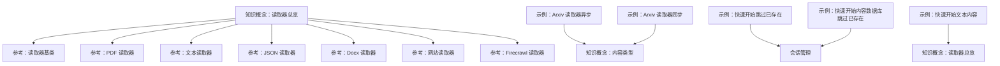
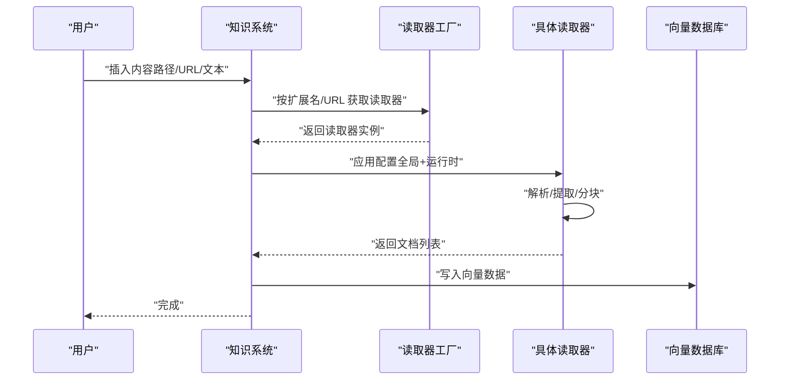
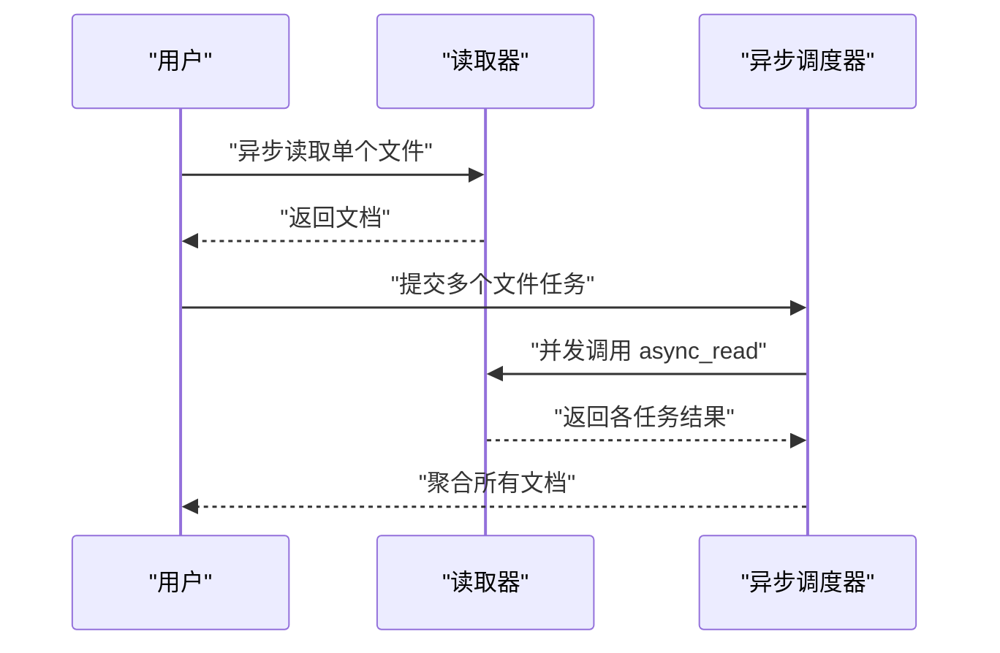
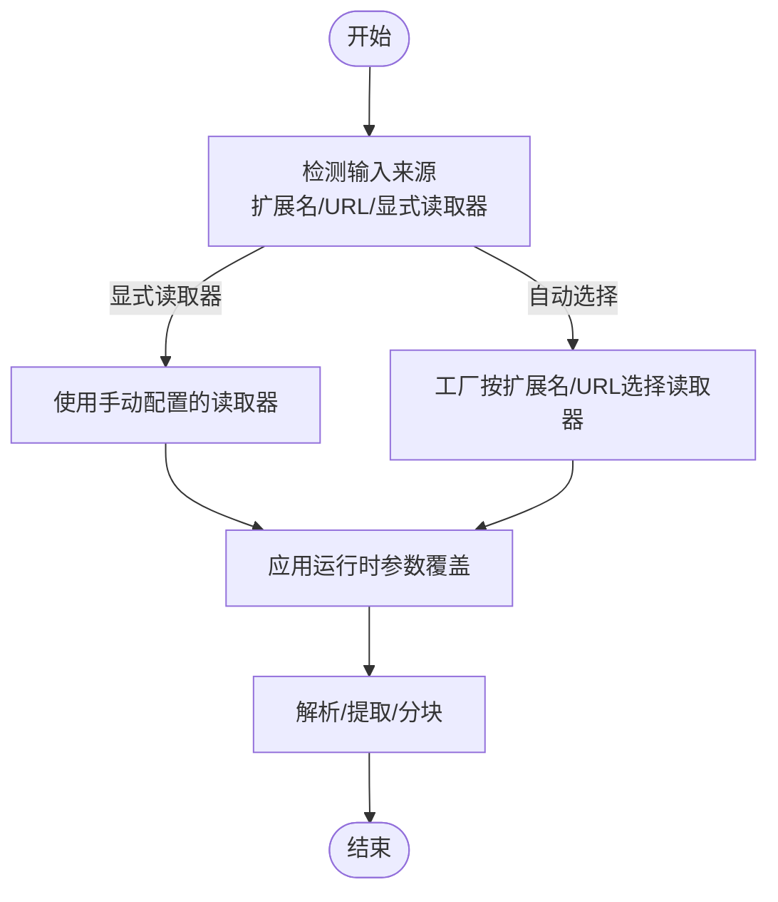
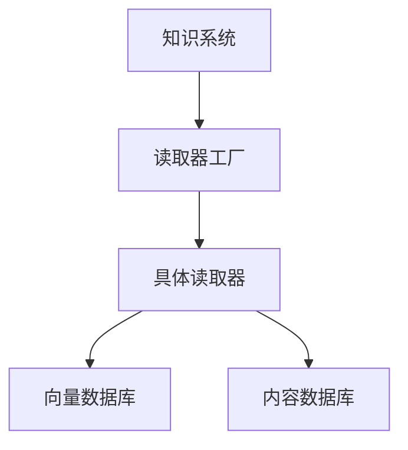

# 读取器配置与最佳实践

<cite>
**本文引用的文件**
- [知识概念：读取器总览](file://knowledge/concepts/readers/overview.mdx)
- [知识概念：内容类型](file://knowledge/concepts/content-types.mdx)
- [示例：Arxiv 读取器（异步）](file://examples/knowledge/readers/arxiv-reader-async.mdx)
- [示例：Arxiv 读取器（同步）](file://examples/knowledge/readers/arxiv-reader.mdx)
- [参考：读取器基类](file://reference/knowledge/reader/base.mdx)
- [参考：PDF 读取器](file://reference/knowledge/reader/pdf.mdx)
- [参考：文本读取器](file://reference/knowledge/reader/text.mdx)
- [参考：JSON 读取器](file://reference/knowledge/reader/json.mdx)
- [参考：Docx 读取器](file://reference/knowledge/reader/docx.mdx)
- [参考：网站读取器](file://reference/knowledge/reader/website.mdx)
- [参考：Firecrawl 读取器](file://reference/knowledge/reader/firecrawl.mdx)
- [参考：会话管理](file://sessions/session-management.mdx)
- [示例：快速开始（跳过已存在）](file://examples/knowledge/quickstart/skip-if-exists.mdx)
- [示例：快速开始（内容数据库跳过已存在）](file://examples/knowledge/quickstart/skip-if-exists-contentsdb.mdx)
- [示例：快速开始（文本内容）](file://examples/knowledge/quickstart/text-content.mdx)
</cite>

## 目录
1. [简介](#简介)
2. [项目结构](#项目结构)
3. [核心组件](#核心组件)
4. [架构概览](#架构概览)
5. [详细组件分析](#详细组件分析)
6. [依赖关系分析](#依赖关系分析)
7. [性能考虑](#性能考虑)
8. [故障排除指南](#故障排除指南)
9. [结论](#结论)
10. [附录](#附录)

## 简介
本文件面向知识系统中的“读取器”使用与配置，提供从通用配置、异步处理到性能优化的完整实践指南。内容覆盖以下主题：
- 通用配置项与格式特定参数
- 异步处理模式与批量处理策略
- 密码保护文件处理、自定义编码设置与错误处理
- 增量更新与跳过重复的策略
- 缓存策略与向量数据库集成建议
- 读取器工厂的自动选择机制与手动配置优先级
- 不同场景下的配置模板与故障排除方法

## 项目结构
围绕“读取器”的相关文档分布在以下区域：
- 知识概念：读取器总览、内容类型
- 参考：各类读取器（PDF、文本、JSON、Docx、网站、Firecrawl）
- 示例：Arxiv 读取器（同步/异步）、快速开始（跳过已存在、文本内容）
- 会话管理：缓存与性能相关实践

**图表来源**
- [知识概念：读取器总览:1-180](file://knowledge/concepts/readers/overview.mdx#L1-L180)
- [知识概念：内容类型:1-50](file://knowledge/concepts/content-types.mdx#L1-L50)
- [示例：Arxiv 读取器（异步）:1-66](file://examples/knowledge/readers/arxiv-reader-async.mdx#L1-L66)
- [示例：Arxiv 读取器（同步）:1-52](file://examples/knowledge/readers/arxiv-reader.mdx#L1-L52)
- [参考：读取器基类:1-10](file://reference/knowledge/reader/base.mdx#L1-L10)
- [参考：PDF 读取器:1-8](file://reference/knowledge/reader/pdf.mdx#L1-L8)
- [参考：文本读取器:1-4](file://reference/knowledge/reader/text.mdx#L1-L4)
- [参考：JSON 读取器:1-5](file://reference/knowledge/reader/json.mdx#L1-L5)
- [参考：Docx 读取器:1-4](file://reference/knowledge/reader/docx.mdx#L1-L4)
- [参考：网站读取器:1-8](file://reference/knowledge/reader/website.mdx#L1-L8)
- [参考：Firecrawl 读取器:1-8](file://reference/knowledge/reader/firecrawl.mdx#L1-L8)
- [示例：快速开始（跳过已存在）:1-93](file://examples/knowledge/quickstart/skip-if-exists.mdx#L1-L93)
- [示例：快速开始（内容数据库跳过已存在）:1-106](file://examples/knowledge/quickstart/skip-if-exists-contentsdb.mdx#L1-L106)
- [参考：会话管理:160-190](file://sessions/session-management.mdx#L160-L190)

**章节来源**
- [知识概念：读取器总览:1-180](file://knowledge/concepts/readers/overview.mdx#L1-L180)
- [知识概念：内容类型:1-50](file://knowledge/concepts/content-types.mdx#L1-L50)

## 核心组件
- 读取器基类与通用配置
  - 支持分块开关、分块大小、分隔符、分块策略、名称、描述、最大返回数等通用参数
  - 分块策略可替换为自定义实现（如语义分块）
- 格式特定读取器
  - PDF：支持按页拆分、页面编号格式、密码解锁
  - 文本：输入为文本文件或类文件对象
  - JSON：默认关闭分块（可覆盖基类默认）
  - Docx：输入为 DOCX 文件或类文件对象
  - 网站/Firecrawl：用于网站抓取与索引
- 自动选择与手动配置
  - 基于扩展名或 URL 的自动选择
  - 手动传入自定义读取器实例以覆盖默认行为

**章节来源**
- [参考：读取器基类:1-10](file://reference/knowledge/reader/base.mdx#L1-L10)
- [参考：PDF 读取器:1-8](file://reference/knowledge/reader/pdf.mdx#L1-L8)
- [参考：文本读取器:1-4](file://reference/knowledge/reader/text.mdx#L1-L4)
- [参考：JSON 读取器:1-5](file://reference/knowledge/reader/json.mdx#L1-L5)
- [参考：Docx 读取器:1-4](file://reference/knowledge/reader/docx.mdx#L1-L4)
- [参考：网站读取器:1-8](file://reference/knowledge/reader/website.mdx#L1-L8)
- [参考：Firecrawl 读取器:1-8](file://reference/knowledge/reader/firecrawl.mdx#L1-L8)
- [知识概念：读取器总览:66-82](file://knowledge/concepts/readers/overview.mdx#L66-L82)

## 架构概览
读取器在知识系统中的工作流如下：
- 输入来源：本地文件、URL、文本内容
- 自动选择：根据扩展名或 URL 由工厂选择合适读取器
- 配置阶段：全局配置 + 运行时参数覆盖
- 处理阶段：解析、提取、分块、返回文档对象
- 存储阶段：写入向量数据库与内容数据库（可选）

**图表来源**
- [知识概念：读取器总览:66-82](file://knowledge/concepts/readers/overview.mdx#L66-L82)
- [知识概念：内容类型:1-50](file://knowledge/concepts/content-types.mdx#L1-L50)

## 详细组件分析

### 通用配置与格式特定参数
- 通用配置
  - 分块控制：是否启用分块、分块大小、分隔符、分块策略
  - 名称与描述：便于识别与调试
  - 最大返回数：限制结果数量
- 格式特定参数
  - PDF：按页拆分、页面编号格式、密码解锁
  - CSV：分隔符、引号字符
  - 文本：自定义编码（如 latin-1、utf-8）
  - JSON：默认关闭分块（可覆盖）
  - Docx：输入为文件或类文件对象

**章节来源**
- [参考：读取器基类:1-10](file://reference/knowledge/reader/base.mdx#L1-L10)
- [参考：PDF 读取器:1-8](file://reference/knowledge/reader/pdf.mdx#L1-L8)
- [参考：文本读取器:1-4](file://reference/knowledge/reader/text.mdx#L1-L4)
- [参考：JSON 读取器:1-5](file://reference/knowledge/reader/json.mdx#L1-L5)
- [参考：Docx 读取器:1-4](file://reference/knowledge/reader/docx.mdx#L1-L4)
- [知识概念：读取器总览:83-123](file://knowledge/concepts/readers/overview.mdx#L83-L123)

### 异步处理与批量策略
- 异步接口
  - 所有读取器支持异步读取，适合 I/O 密集型场景
  - 单文件异步读取与批量任务并发执行
- 批量处理
  - 使用任务列表与并发聚合，提升吞吐
  - 结合知识系统的异步插入接口进行批量入库

**图表来源**
- [知识概念：读取器总览:125-138](file://knowledge/concepts/readers/overview.mdx#L125-L138)
- [示例：Arxiv 读取器（异步）:1-66](file://examples/knowledge/readers/arxiv-reader-async.mdx#L1-L66)

**章节来源**
- [知识概念：读取器总览:125-138](file://knowledge/concepts/readers/overview.mdx#L125-L138)
- [示例：Arxiv 读取器（异步）:1-66](file://examples/knowledge/readers/arxiv-reader-async.mdx#L1-L66)
- [示例：Arxiv 读取器（同步）:1-52](file://examples/knowledge/readers/arxiv-reader.mdx#L1-L52)

### 密码保护文件与自定义编码
- 密码保护文件
  - PDF 支持通过配置或运行时参数提供密码
  - 建议在配置中集中管理敏感参数，并在运行时按需覆盖
- 自定义编码
  - 文本与 CSV 支持指定编码（如 latin-1），避免乱码
  - 建议结合文件实际编码与目标系统字符集统一设置

**章节来源**
- [知识概念：读取器总览:93-123](file://knowledge/concepts/readers/overview.mdx#L93-L123)
- [参考：PDF 读取器:1-8](file://reference/knowledge/reader/pdf.mdx#L1-L8)
- [参考：文本读取器:1-4](file://reference/knowledge/reader/text.mdx#L1-L4)
- [参考：CSV 读取器:1-6](file://reference/knowledge/reader/csv.mdx#L1-L6)

### 错误处理机制
- 默认行为
  - 读取失败时返回空列表，便于上层统一处理
- 建议策略
  - 在调用端检查返回结果并记录日志
  - 对异常文件进行隔离与重试队列管理

**章节来源**
- [知识概念：读取器总览:155-163](file://knowledge/concepts/readers/overview.mdx#L155-L163)

### 增量更新与跳过重复
- 跳过已存在
  - 支持在插入时跳过已存在的内容，避免重复入库
  - 可同时结合内容数据库进行一致性校验
- 实践要点
  - 合理设置元数据与去重键，确保幂等性
  - 在批量导入前先做预检，减少重复写入

**章节来源**
- [示例：快速开始（跳过已存在）:1-93](file://examples/knowledge/quickstart/skip-if-exists.mdx#L1-L93)
- [示例：快速开始（内容数据库跳过已存在）:1-106](file://examples/knowledge/quickstart/skip-if-exists-contentsdb.mdx#L1-L106)

### 缓存策略与性能优化
- 会话缓存
  - 会话级别内存缓存可显著降低重复请求开销
  - 适用于多轮对话与长会话场景
- 向量数据库批处理
  - 向量嵌入与写入可开启批处理以提升吞吐
- 文档分块优化
  - 合理设置分块大小与分隔符，平衡检索精度与存储成本
  - 使用语义分块等高级策略提升检索质量

**章节来源**
- [参考：会话管理:160-190](file://sessions/session-management.mdx#L160-L190)
- [知识概念：读取器总览:140-153](file://knowledge/concepts/readers/overview.mdx#L140-L153)

### 读取器工厂的自动选择与手动配置优先级
- 自动选择
  - 基于文件扩展名或 URL 动态选择读取器
- 手动配置
  - 显式传入自定义读取器实例可覆盖默认选择
- 优先级规则
  - 手动传入的读取器优先于自动选择
  - 运行时参数可覆盖读取器配置（如密码、命名）

**图表来源**
- [知识概念：读取器总览:66-82](file://knowledge/concepts/readers/overview.mdx#L66-L82)
- [知识概念：内容类型:1-50](file://knowledge/concepts/content-types.mdx#L1-L50)

**章节来源**
- [知识概念：读取器总览:66-82](file://knowledge/concepts/readers/overview.mdx#L66-L82)
- [知识概念：内容类型:1-50](file://knowledge/concepts/content-types.mdx#L1-L50)

## 依赖关系分析
- 组件耦合
  - 知识系统依赖读取器工厂进行格式识别
  - 读取器依赖向量数据库与内容数据库进行持久化
- 外部依赖
  - 第三方服务（如网站抓取、Arxiv API）对网络与速率限制敏感
- 潜在循环依赖
  - 读取器与数据库之间为单向依赖，无循环风险

**图表来源**
- [知识概念：读取器总览:51-82](file://knowledge/concepts/readers/overview.mdx#L51-L82)
- [知识概念：内容类型:1-50](file://knowledge/concepts/content-types.mdx#L1-L50)

**章节来源**
- [知识概念：读取器总览:51-82](file://knowledge/concepts/readers/overview.mdx#L51-L82)
- [知识概念：内容类型:1-50](file://knowledge/concepts/content-types.mdx#L1-L50)

## 性能考虑
- I/O 密集场景优先使用异步读取与并发任务
- 批量写入向量数据库，减少往返次数
- 文档分块大小与分隔符应结合检索需求与存储成本权衡
- 使用语义分块等策略提升检索质量，降低无效分块带来的检索开销

## 故障排除指南
- 常见问题
  - 无法读取加密 PDF：确认密码参数正确，必要时在运行时覆盖
  - 中文乱码：检查文本/CSV 编码设置，统一为 utf-8 或目标系统编码
  - 返回空列表：检查日志，定位具体文件与原因；对异常文件单独处理
- 建议流程
  - 先小批量验证配置与参数
  - 对异常文件建立重试队列与隔离目录
  - 使用“跳过已存在”策略避免重复入库

**章节来源**
- [知识概念：读取器总览:155-163](file://knowledge/concepts/readers/overview.mdx#L155-L163)
- [知识概念：读取器总览:93-123](file://knowledge/concepts/readers/overview.mdx#L93-L123)

## 结论
通过合理配置通用参数与格式特定参数、采用异步与批量策略、结合缓存与去重机制，可在保证质量的前提下显著提升读取与入库效率。读取器工厂提供了灵活的自动选择能力，而手动配置则提供了更强的可控性与可维护性。

## 附录

### 场景化配置模板
- PDF 加密与 OCR
  - 按页拆分、启用图片识别、提供密码
- CSV 自定义编码
  - 指定编码（如 latin-1），调整分隔符与引号字符
- 文本自定义编码
  - 指定编码（如 utf-8），确保跨平台一致性
- 语义分块策略
  - 替换默认分块策略为语义分块，提升检索质量

**章节来源**
- [知识概念：读取器总览:83-153](file://knowledge/concepts/readers/overview.mdx#L83-L153)
- [参考：PDF 读取器:1-8](file://reference/knowledge/reader/pdf.mdx#L1-L8)
- [参考：文本读取器:1-4](file://reference/knowledge/reader/text.mdx#L1-L4)
- [参考：JSON 读取器:1-5](file://reference/knowledge/reader/json.mdx#L1-L5)
- [参考：Docx 读取器:1-4](file://reference/knowledge/reader/docx.mdx#L1-L4)