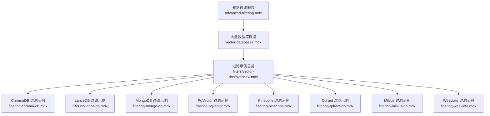
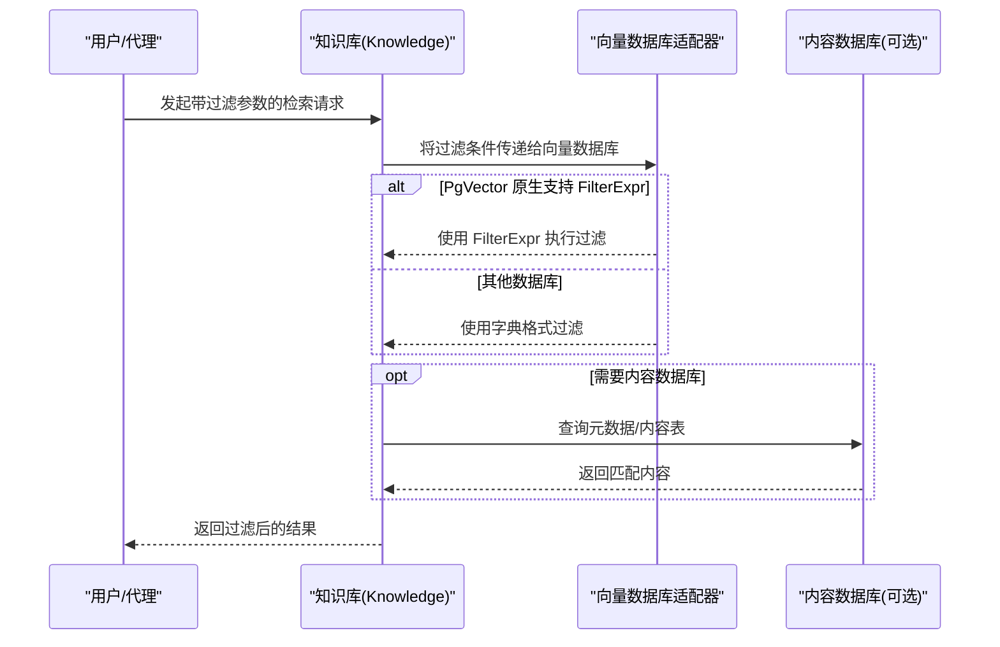
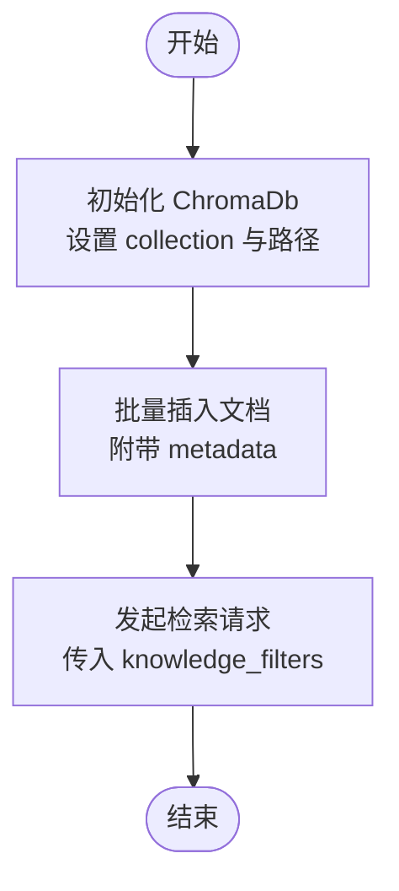
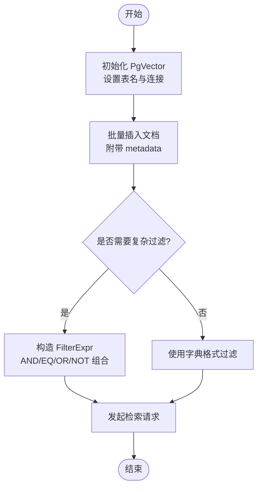
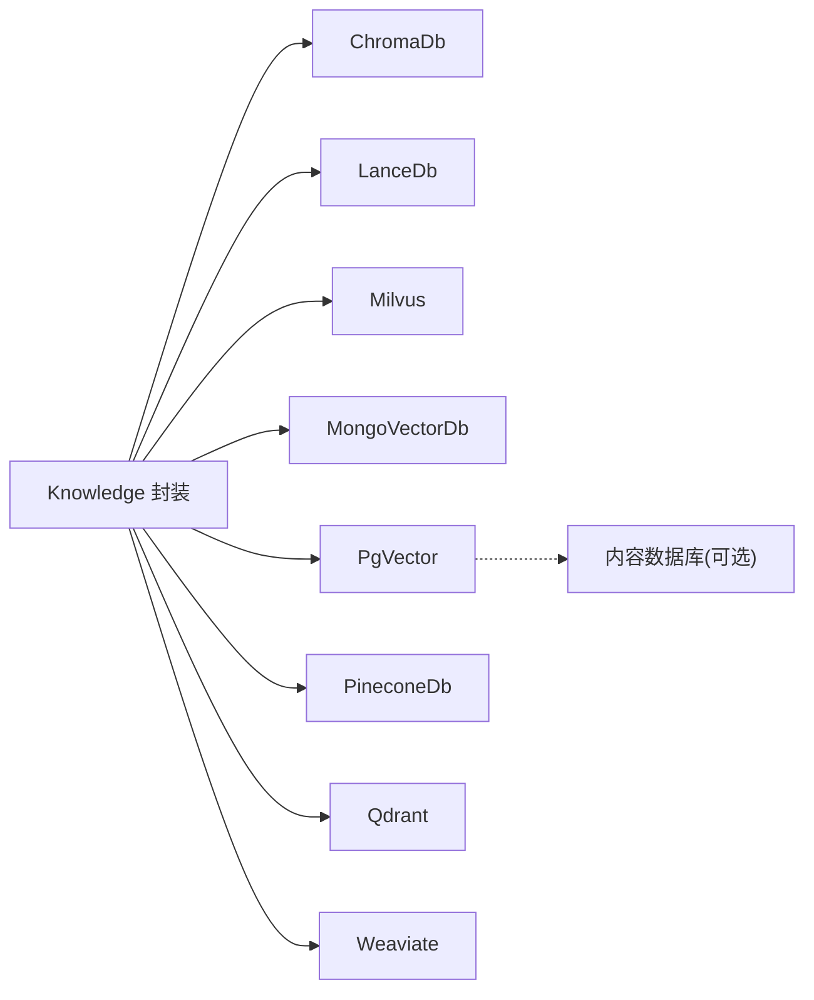

# 向量数据库过滤

<cite>
**本文引用的文件**
- [向量数据库过滤总览](file://examples/knowledge/filters/vector-dbs/overview.mdx)
- [高级过滤](file://knowledge/concepts/filters/advanced-filtering.mdx)
- [向量数据库概览](file://cookbook/knowledge/vector-databases.mdx)
- [ChromaDB 过滤示例](file://knowledge/concepts/filters/filtering-chroma-db.mdx)
- [LanceDB 过滤示例](file://knowledge/concepts/filters/filtering-lance-db.mdx)
- [MongoDB 过滤示例](file://knowledge/concepts/filters/filtering-mongo-db.mdx)
- [PgVector 过滤示例](file://knowledge/concepts/filters/filtering-pgvector.mdx)
- [Pinecone 过滤示例](file://knowledge/concepts/filters/filtering-pinecone.mdx)
- [Qdrant 过滤示例](file://knowledge/concepts/filters/filtering-qdrant-db.mdx)
- [Milvus 过滤示例](file://knowledge/concepts/filters/filtering-milvus-db.mdx)
- [Weaviate 过滤示例](file://knowledge/concepts/filters/filtering-weaviate.mdx)
</cite>

## 目录
1. [简介](#简介)
2. [项目结构](#项目结构)
3. [核心组件](#核心组件)
4. [架构总览](#架构总览)
5. [详细组件分析](#详细组件分析)
6. [依赖关系分析](#依赖关系分析)
7. [性能与索引策略](#性能与索引策略)
8. [故障排查指南](#故障排查指南)
9. [结论](#结论)
10. [附录：兼容性矩阵与迁移指南](#附录兼容性矩阵与迁移指南)

## 简介
本技术文档聚焦于向量数据库的“过滤”能力，系统梳理 ChromaDB、LanceDB、Milvus、MongoDB、PgVector、Pinecone、Qdrant、Weaviate 等主流向量数据库在过滤语法、支持能力、性能表现与限制条件方面的差异，并提供针对不同数据库的过滤配置方法、优化建议与迁移指南。同时，结合仓库中提供的示例与概念文档，给出可操作的实践路径与最佳实践。

## 项目结构
围绕“向量数据库过滤”的知识与示例主要分布在以下位置：
- 概念与进阶过滤：knowledge/concepts/filters
- 数据库概览与示例入口：cookbook/knowledge/vector-databases.mdx
- 各数据库过滤示例入口：examples/knowledge/filters/vector-dbs/overview.mdx
- 各数据库独立过滤示例：filtering-<db>.mdx 文件



**图示来源**
- [向量数据库过滤总览:1-17](file://examples/knowledge/filters/vector-dbs/overview.mdx#L1-L17)
- [高级过滤:1-519](file://knowledge/concepts/filters/advanced-filtering.mdx#L1-L519)
- [向量数据库概览:1-227](file://cookbook/knowledge/vector-databases.mdx#L1-L227)

**章节来源**
- [向量数据库过滤总览:1-17](file://examples/knowledge/filters/vector-dbs/overview.mdx#L1-L17)
- [向量数据库概览:1-227](file://cookbook/knowledge/vector-databases.mdx#L1-L227)

## 核心组件
- 过滤表达式体系（FilterExpr）
  - 支持比较运算符（EQ、IN、GT、LT）、逻辑运算符（AND、OR、NOT），以及复杂组合。
  - 仅在 PgVector 中原生支持 FilterExpr；其他数据库使用字典格式过滤。
- 字典格式过滤
  - 所有数据库均支持以键值对形式传入过滤条件，适合动态拼装与代理场景。
- 内容数据库（Contents DB）
  - 需要配合内容数据库（如 Postgres）才能进行“智能过滤”与“代理动态过滤”。

**章节来源**
- [高级过滤:16-106](file://knowledge/concepts/filters/advanced-filtering.mdx#L16-L106)
- [高级过滤:405-447](file://knowledge/concepts/filters/advanced-filtering.mdx#L405-L447)

## 架构总览
下图展示了“过滤请求”在不同数据库中的处理流程与差异点：



**图示来源**
- [高级过滤:405-447](file://knowledge/concepts/filters/advanced-filtering.mdx#L405-L447)
- [PgVector 过滤示例:1-128](file://knowledge/concepts/filters/filtering-pgvector.mdx#L1-L128)

## 详细组件分析

### ChromaDB 过滤
- 语法与能力
  - 支持字典格式过滤，形如 {"user_id": "..."}。
  - 示例展示通过知识库插入多条带元数据的文档，并按 user_id 进行过滤查询。
- 性能与限制
  - 作为嵌入式/本地开发型数据库，适合原型与小规模场景；过滤能力以字典为主。
- 配置与优化
  - 在初始化 ChromaDb 时指定 collection 与持久化路径；插入文档时附带 metadata。
  - 查询时通过 knowledge_filters 传入字典过滤条件。



**图示来源**
- [ChromaDB 过滤示例:1-124](file://knowledge/concepts/filters/filtering-chroma-db.mdx#L1-L124)

**章节来源**
- [ChromaDB 过滤示例:1-124](file://knowledge/concepts/filters/filtering-chroma-db.mdx#L1-L124)

### LanceDB 过滤
- 语法与能力
  - 支持字典格式过滤；默认存储路径可自定义。
  - 示例展示通过 LanceDb 表名与 URI 初始化，插入文档后按 user_id 过滤。
- 性绩与限制
  - 轻量、嵌入式，适合边缘或单机场景；过滤以字典为主。
- 配置与优化
  - 设置表名与 URI；插入时附 metadata；查询时传入过滤字典。

**章节来源**
- [LanceDB 过滤示例:1-128](file://knowledge/concepts/filters/filtering-lance-db.mdx#L1-L128)

### Milvus 过滤
- 语法与能力
  - 支持字典格式过滤；示例展示通过集合名与 URI 初始化 Milvus。
  - 插入文档并按 user_id 过滤。
- 性能与限制
  - 分布式、可扩展，适合大规模场景；过滤以字典为主。
- 配置与优化
  - 初始化集合与连接地址；插入文档附 metadata；查询时传入过滤字典。

**章节来源**
- [Milvus 过滤示例:1-135](file://knowledge/concepts/filters/filtering-milvus-db.mdx#L1-L135)

### MongoDB（Atlas 向量搜索）
- 语法与能力
  - 支持字典格式过滤；示例展示通过 MongoVectorDb 初始化，指定集合与索引名称。
  - 插入文档并按 user_id 过滤。
- 性能与限制
  - 与文档存储结合，适合已有 MongoDB 生态的用户；过滤以字典为主。
- 配置与优化
  - 提供连接字符串与索引名称；插入时附 metadata；查询时传入过滤字典。

**章节来源**
- [MongoDB 过滤示例:1-138](file://knowledge/concepts/filters/filtering-mongo-db.mdx#L1-L138)

### PgVector（PostgreSQL 扩展）
- 语法与能力
  - 原生支持 FilterExpr（EQ、AND、OR、NOT 等），可构建复杂逻辑。
  - 示例展示通过 PgVector 初始化，插入文档后按 user_id 过滤。
- 性能与限制
  - 与 PostgreSQL 结合，具备成熟的 SQL 能力与索引生态；FilterExpr 可显著提升过滤灵活性。
- 配置与优化
  - 初始化时指定表名与数据库连接；插入文档附 metadata；查询时可传入 FilterExpr 或字典格式。



**图示来源**
- [PgVector 过滤示例:1-128](file://knowledge/concepts/filters/filtering-pgvector.mdx#L1-L128)
- [高级过滤:405-447](file://knowledge/concepts/filters/advanced-filtering.mdx#L405-L447)

**章节来源**
- [PgVector 过滤示例:1-128](file://knowledge/concepts/filters/filtering-pgvector.mdx#L1-L128)
- [高级过滤:405-447](file://knowledge/concepts/filters/advanced-filtering.mdx#L405-L447)

### Pinecone（托管向量数据库）
- 语法与能力
  - 支持字典格式过滤；示例展示通过 PineconeDb 初始化，指定索引名、维度与规格。
  - 插入文档并按 user_id 过滤。
- 性能与限制
  - 托管服务，弹性伸缩；过滤以字典为主。
- 配置与优化
  - 提供 API Key 与索引规格；插入时附 metadata；查询时传入过滤字典。

**章节来源**
- [Pinecone 过滤示例:1-132](file://knowledge/concepts/filters/filtering-pinecone.mdx#L1-L132)

### Qdrant（高性能向量数据库）
- 语法与能力
  - 支持字典格式过滤；示例展示通过 Qdrant 初始化，指定集合与服务地址。
  - 插入文档并按 user_id 过滤。
- 性能与限制
  - 高性能、丰富过滤能力；过滤以字典为主。
- 配置与优化
  - 指定集合名与服务地址；插入时附 metadata；查询时传入过滤字典。

**章节来源**
- [Qdrant 过滤示例:1-130](file://knowledge/concepts/filters/filtering-qdrant-db.mdx#L1-L130)

### Weaviate（混合检索与 GraphQL）
- 语法与能力
  - 支持字典格式过滤；示例展示通过 Weaviate 初始化，指定集合与索引类型。
  - 插入文档并按 user_id 过滤。
- 性能与限制
  - 混合检索与 GraphQL 能力；过滤以字典为主。
- 配置与优化
  - 指定集合与本地/云部署模式；插入时附 metadata；查询时传入过滤字典。

**章节来源**
- [Weaviate 过滤示例:1-151](file://knowledge/concepts/filters/filtering-weaviate.mdx#L1-L151)

## 依赖关系分析
- 统一接口
  - 所有数据库示例均通过 Knowledge 类封装，调用方式一致，便于切换。
- 过滤能力差异
  - PgVector 原生支持 FilterExpr，其他数据库以字典格式为主。
- 内容数据库耦合
  - 高级过滤（FilterExpr）需配合内容数据库（如 Postgres）使用。



**图示来源**
- [向量数据库概览:1-227](file://cookbook/knowledge/vector-databases.mdx#L1-L227)
- [高级过滤:405-447](file://knowledge/concepts/filters/advanced-filtering.mdx#L405-L447)

**章节来源**
- [向量数据库概览:1-227](file://cookbook/knowledge/vector-databases.mdx#L1-L227)
- [高级过滤:405-447](file://knowledge/concepts/filters/advanced-filtering.mdx#L405-L447)

## 性能与索引策略
- 过滤表达式（FilterExpr）在 PgVector 中可直接利用数据库索引与 SQL 引擎，通常具备更优的复杂过滤性能。
- 字典格式过滤在大多数数据库中简单高效，适合常见业务场景。
- 对于大规模数据与高并发场景，建议：
  - 在目标数据库中建立合适的元数据索引（如 PostgreSQL 的 GIN/GIST、Qdrant 的过滤索引等）。
  - 控制过滤条件粒度，避免过于宽泛导致扫描过多。
  - 对热点字段进行分片或分区（如按时间/区域）以降低扫描范围。

[本节为通用性能讨论，不直接分析具体文件]

## 故障排查指南
- FilterExpr 不生效
  - 现象：在不支持 FilterExpr 的数据库上使用 FilterExpr，会收到“过滤表达式暂不支持”的警告，且搜索无过滤效果。
  - 处理：改用字典格式过滤；或在 PgVector 上使用 FilterExpr。
- 动态过滤（代理场景）不可用
  - 现象：FilterExpr 与“代理动态过滤”不兼容。
  - 处理：使用字典格式，由代理在运行时动态拼接过滤条件。
- 过滤结构问题
  - 排查：打印 FilterExpr 的字典结构，确认序列化/反序列化正确。
  - 建议：将复杂表达式拆分为多个简单条件逐一验证，再合并。

**章节来源**
- [高级过滤:322-447](file://knowledge/concepts/filters/advanced-filtering.mdx#L322-L447)

## 结论
- 若需要复杂的布尔/比较过滤逻辑，优先选择 PgVector；若追求通用性与易用性，其他数据库以字典格式即可满足多数场景。
- 在生产环境中，应结合各自数据库的索引与查询优化能力，配合内容数据库与合理的元数据设计，获得更佳的过滤性能与稳定性。

[本节为总结性内容，不直接分析具体文件]

## 附录：兼容性矩阵与迁移指南

### 兼容性矩阵（基于当前仓库文档）
- FilterExpr（复杂表达式）
  - 仅 PgVector 支持
- 字典格式过滤
  - ChromaDB、LanceDB、Milvus、MongoDB、PgVector、Pinecone、Qdrant、Weaviate 均支持
- 代理动态过滤（运行时拼接）
  - 仅字典格式可用

```mermaid
table
head
row
th "数据库"
th "FilterExpr"
th "字典格式"
th "代理动态过滤"
body
row
th "ChromaDB"
td "否"
td "是"
td "是"
row
th "LanceDB"
td "否"
td "是"
td "是"
row
th "Milvus"
td "否"
td "是"
td "是"
row
th "MongoDB"
td "否"
td "是"
td "是"
row
th "PgVector"
td "是"
td "是"
td "否"
row
th "Pinecone"
td "否"
td "是"
td "是"
row
th "Qdrant"
td "否"
td "是"
td "是"
row
th "Weaviate"
td "否"
td "是"
td "是"
```

**图示来源**
- [高级过滤:405-447](file://knowledge/concepts/filters/advanced-filtering.mdx#L405-L447)
- [向量数据库概览:19-36](file://cookbook/knowledge/vector-databases.mdx#L19-L36)

### 迁移指南
- 从字典格式迁移到 FilterExpr
  - 步骤：将现有字典过滤转换为 EQ/AND/OR/NOT 组合；在 PgVector 上启用 FilterExpr；测试复杂条件组合。
  - 注意：确保内容数据库已就绪，以便支持高级过滤。
- 从 FilterExpr 回退到字典格式
  - 步骤：将 FilterExpr 序列化为字典；在其他数据库上直接使用；保持代理动态过滤能力。
- 跨数据库切换
  - 步骤：统一通过 Knowledge 封装；替换向量数据库初始化参数；保持过滤调用方式不变；针对不支持 FilterExpr 的数据库使用字典格式。

**章节来源**
- [高级过滤:405-447](file://knowledge/concepts/filters/advanced-filtering.mdx#L405-L447)
- [向量数据库概览:1-227](file://cookbook/knowledge/vector-databases.mdx#L1-L227)