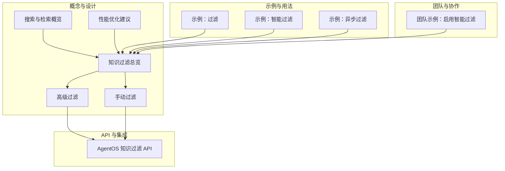
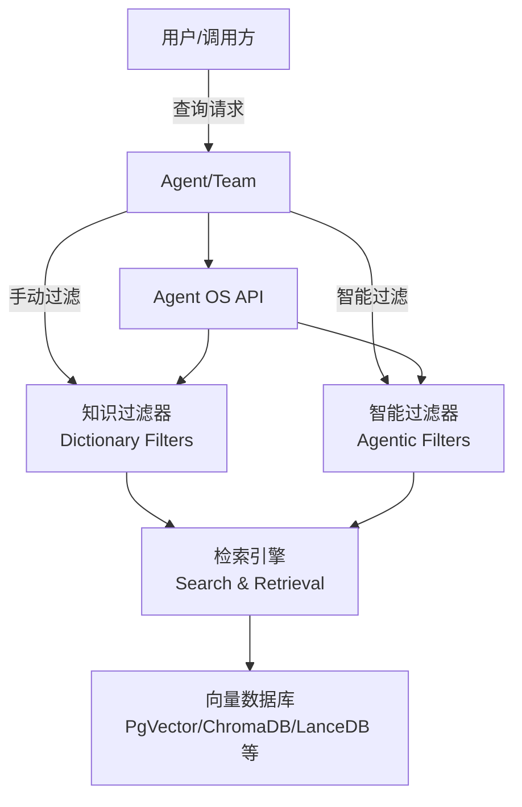
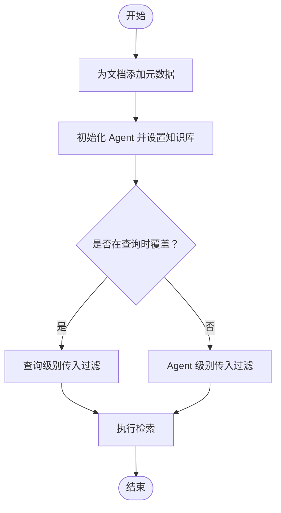
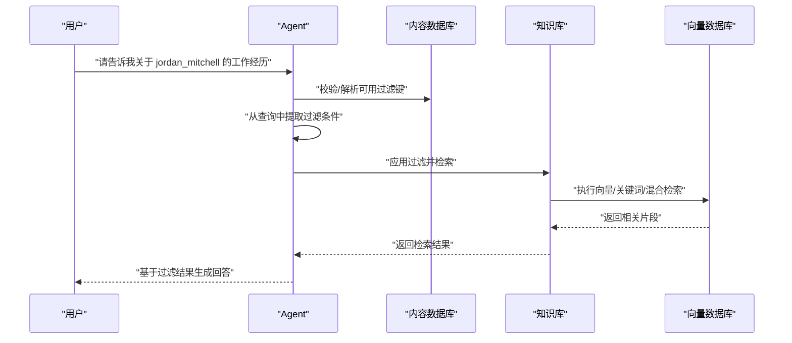
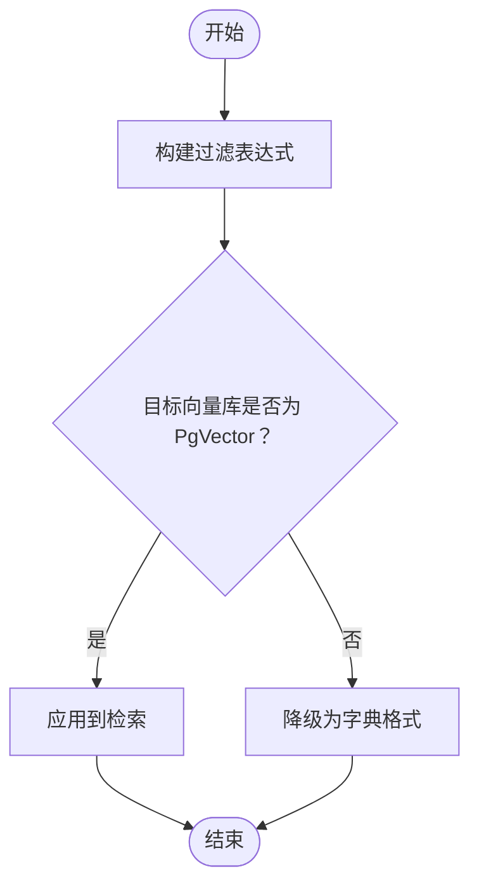
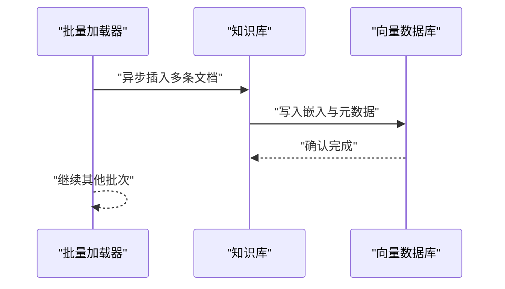
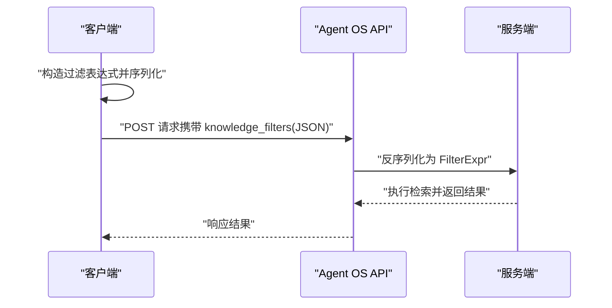
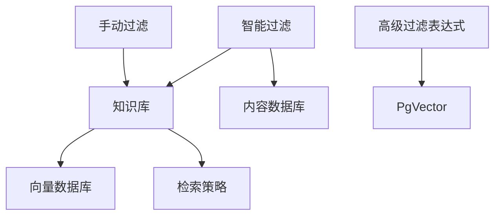

# 手动过滤 vs 智能过滤

<cite>
**本文引用的文件**   
- [知识过滤总览](file://knowledge/concepts/filters/overview.mdx)
- [高级过滤](file://knowledge/concepts/filters/advanced-filtering.mdx)
- [手动过滤](file://knowledge/concepts/filters/manual-filters.mdx)
- [示例：过滤](file://examples/knowledge/filters/filtering.mdx)
- [示例：智能过滤](file://examples/knowledge/filters/agentic-filtering.mdx)
- [示例：异步过滤](file://examples/knowledge/filters/async-filtering.mdx)
- [AgentOS 知识过滤 API](file://agent-os/knowledge/filter-knowledge.mdx)
- [搜索与检索概览](file://knowledge/concepts/search-and-retrieval/overview.mdx)
- [性能优化建议](file://knowledge/concepts/performance-tips.mdx)
- [团队示例：启用智能过滤](file://knowledge/teams/team-with-agentic-knowledge-filters.mdx)
</cite>

## 目录
1. [简介](#简介)
2. [项目结构](#项目结构)
3. [核心组件](#核心组件)
4. [架构总览](#架构总览)
5. [详细组件分析](#详细组件分析)
6. [依赖关系分析](#依赖关系分析)
7. [性能考量](#性能考量)
8. [故障排查指南](#故障排查指南)
9. [结论](#结论)
10. [附录](#附录)

## 简介
本技术文档围绕“手动过滤”与“智能过滤”的对比展开，系统阐述两者在实现方式、适用场景、性能特征与最佳实践上的差异，并提供决策矩阵与混合使用策略，帮助开发者在自动化后端与面向用户的自然语言交互场景中做出合适选择。

## 项目结构
本仓库提供了从概念到示例、再到 API 使用与性能优化的完整知识过滤体系，重点涉及以下路径：
- 概念与设计：知识过滤、高级过滤、手动过滤、搜索与检索、性能优化
- 示例与用法：过滤、智能过滤、异步过滤
- API 与集成：AgentOS 知识过滤接口
- 团队与协作：团队启用智能过滤的示例

**图表来源**
- [知识过滤总览:1-161](file://knowledge/concepts/filters/overview.mdx#L1-L161)
- [高级过滤:1-519](file://knowledge/concepts/filters/advanced-filtering.mdx#L1-L519)
- [手动过滤:1-122](file://knowledge/concepts/filters/manual-filters.mdx#L1-L122)
- [示例：过滤:1-112](file://examples/knowledge/filters/filtering.mdx#L1-L112)
- [示例：智能过滤:1-127](file://examples/knowledge/filters/agentic-filtering.mdx#L1-L127)
- [示例：异步过滤:1-147](file://examples/knowledge/filters/async-filtering.mdx#L1-L147)
- [AgentOS 知识过滤 API:1-46](file://agent-os/knowledge/filter-knowledge.mdx#L1-L46)
- [搜索与检索概览:1-255](file://knowledge/concepts/search-and-retrieval/overview.mdx#L1-L255)
- [性能优化建议:1-226](file://knowledge/concepts/performance-tips.mdx#L1-L226)
- [团队示例：启用智能过滤:1-142](file://knowledge/teams/team-with-agentic-knowledge-filters.mdx#L1-L142)

**章节来源**
- [知识过滤总览:1-161](file://knowledge/concepts/filters/overview.mdx#L1-L161)
- [高级过滤:1-519](file://knowledge/concepts/filters/advanced-filtering.mdx#L1-L519)
- [手动过滤:1-122](file://knowledge/concepts/filters/manual-filters.mdx#L1-L122)
- [示例：过滤:1-112](file://examples/knowledge/filters/filtering.mdx#L1-L112)
- [示例：智能过滤:1-127](file://examples/knowledge/filters/agentic-filtering.mdx#L1-L127)
- [示例：异步过滤:1-147](file://examples/knowledge/filters/async-filtering.mdx#L1-L147)
- [AgentOS 知识过滤 API:1-46](file://agent-os/knowledge/filter-knowledge.mdx#L1-L46)
- [搜索与检索概览:1-255](file://knowledge/concepts/search-and-retrieval/overview.mdx#L1-L255)
- [性能优化建议:1-226](file://knowledge/concepts/performance-tips.mdx#L1-L226)
- [团队示例：启用智能过滤:1-142](file://knowledge/teams/team-with-agentic-knowledge-filters.mdx#L1-L142)

## 核心组件
- 手动过滤（Dictionary Filters）
  - 通过键值对直接指定过滤条件，适合自动化、可预测的过滤场景，具备完全控制能力。
  - 支持在 Agent 初始化时或单次查询时传入，后者优先级更高。
- 智能过滤（Agentic Filters）
  - 由 Agent 基于用户查询自动推断并应用过滤条件，适用于面向用户的自然语言交互。
  - 需要内容数据库以跟踪可用过滤键，提升可靠性与提示性。
- 高级过滤表达式（Filter Expressions）
  - 提供 EQ、IN、GT、LT、AND、OR、NOT 等操作符，支持复杂逻辑组合。
  - 当前仅 PgVector 完整支持；其他向量库需使用字典格式或降级处理。
- 异步过滤与批量操作
  - 支持异步插入与查询，提升大规模数据加载与检索效率。
- API 过滤
  - 过滤表达式可序列化为 JSON 并通过 Agent OS API 传递，服务端自动重建。

**章节来源**
- [知识过滤总览:33-110](file://knowledge/concepts/filters/overview.mdx#L33-L110)
- [高级过滤:16-190](file://knowledge/concepts/filters/advanced-filtering.mdx#L16-L190)
- [AgentOS 知识过滤 API:10-46](file://agent-os/knowledge/filter-knowledge.mdx#L10-L46)
- [示例：异步过滤:1-147](file://examples/knowledge/filters/async-filtering.mdx#L1-L147)

## 架构总览
下图展示了手动过滤与智能过滤在系统中的位置与交互关系，以及与检索、向量数据库和 API 的衔接。

**图表来源**
- [AgentOS 知识过滤 API:10-46](file://agent-os/knowledge/filter-knowledge.mdx#L10-L46)
- [知识过滤总览:1-161](file://knowledge/concepts/filters/overview.mdx#L1-L161)
- [高级过滤:1-519](file://knowledge/concepts/filters/advanced-filtering.mdx#L1-L519)
- [搜索与检索概览:1-255](file://knowledge/concepts/search-and-retrieval/overview.mdx#L1-L255)

## 详细组件分析

### 决策矩阵：何时选择手动过滤 vs 智能过滤
- 手动过滤（Manual Filters）
  - 优点：简单、可控、可预测、易于调试与测试
  - 缺点：需要预先定义过滤规则，不适合自然语言查询
  - 适用场景：自动化流程、固定权限/范围、批量任务、严格合规
- 智能过滤（Agentic Filters）
  - 优点：面向用户、自然语言理解、动态适配
  - 缺点：依赖内容数据库与模型能力，复杂度较高
  - 适用场景：客服问答、自然语言检索、多轮对话、个性化推荐

| 维度 | 手动过滤 | 智能过滤 |
|---|---|---|
| 实现难度 | 低 | 中高 |
| 可控性 | 高 | 中等 |
| 自然语言支持 | 否 | 是 |
| 性能稳定性 | 高 | 受模型影响 |
| 维护成本 | 低 | 中等 |
| 合规与审计 | 易 | 需日志与回放 |

**章节来源**
- [知识过滤总览:77-83](file://knowledge/concepts/filters/overview.mdx#L77-L83)

### 手动过滤：实现与用法
- 元数据设计与注入
  - 在初始化知识库或逐条加载时附加元数据，确保后续可按字段过滤。
- 过滤传入方式
  - 在 Agent 初始化时设置全局过滤；在单次查询时覆盖当前过滤。
- 多字段组合
  - 多个过滤条件默认以 AND 逻辑组合，便于精确限定范围。

**图表来源**
- [手动过滤:58-110](file://knowledge/concepts/filters/manual-filters.mdx#L58-L110)
- [示例：过滤:83-95](file://examples/knowledge/filters/filtering.mdx#L83-L95)

**章节来源**
- [手动过滤:1-122](file://knowledge/concepts/filters/manual-filters.mdx#L1-L122)
- [示例：过滤:1-112](file://examples/knowledge/filters/filtering.mdx#L1-L112)

### 智能过滤：实现与用法
- Agent 配置
  - 开启智能过滤开关，使 Agent 能够从用户查询中提取过滤条件。
- 内容数据库（可选但推荐）
  - 提供可用过滤键的校验与提示，提高可靠性与可维护性。
- 示例流程
  - 用户输入自然语言查询，Agent 推断并应用过滤，随后检索与生成回答。

**图表来源**
- [示例：智能过滤:98-110](file://examples/knowledge/filters/agentic-filtering.mdx#L98-L110)
- [知识过滤总览:60-76](file://knowledge/concepts/filters/overview.mdx#L60-L76)

**章节来源**
- [示例：智能过滤:1-127](file://examples/knowledge/filters/agentic-filtering.mdx#L1-L127)
- [知识过滤总览:60-76](file://knowledge/concepts/filters/overview.mdx#L60-L76)

### 高级过滤表达式：复杂逻辑与限制
- 操作符与组合
  - EQ、IN、GT、LT、AND、OR、NOT，支持复杂布尔逻辑与数值比较。
- 使用场景
  - 需要全控、跨区域/多类型、时间范围、排除草稿等场景。
- 限制与兼容性
  - 当前仅 PgVector 完整支持；其他向量库需使用字典格式或降级处理。
  - 智能过滤不兼容高级过滤表达式，应使用字典格式。

**图表来源**
- [高级过滤:405-441](file://knowledge/concepts/filters/advanced-filtering.mdx#L405-L441)

**章节来源**
- [高级过滤:16-190](file://knowledge/concepts/filters/advanced-filtering.mdx#L16-L190)
- [高级过滤:405-441](file://knowledge/concepts/filters/advanced-filtering.mdx#L405-L441)

### 异步过滤与批量操作
- 异步插入与查询
  - 支持异步批量加载与并发检索，显著提升大规模数据处理效率。
- 示例要点
  - 使用异步数据库连接与知识库方法，结合 IN 等表达式进行高效过滤。

**图表来源**
- [示例：异步过滤:54-99](file://examples/knowledge/filters/async-filtering.mdx#L54-L99)

**章节来源**
- [示例：异步过滤:1-147](file://examples/knowledge/filters/async-filtering.mdx#L1-L147)

### API 过滤：远程调用与序列化
- 过滤表达式 JSON 化
  - 将 FilterExpr 序列化为 JSON，通过 Agent OS API 传递，服务端自动重建。
- 字典格式兼容
  - 不含 op 键的字典过滤保持向后兼容，适合所有向量库。

**图表来源**
- [AgentOS 知识过滤 API:25-46](file://agent-os/knowledge/filter-knowledge.mdx#L25-L46)
- [高级过滤:449-478](file://knowledge/concepts/filters/advanced-filtering.mdx#L449-L478)

**章节来源**
- [AgentOS 知识过滤 API:10-46](file://agent-os/knowledge/filter-knowledge.mdx#L10-L46)
- [高级过滤:449-478](file://knowledge/concepts/filters/advanced-filtering.mdx#L449-L478)

### 团队与协作：智能过滤在团队中的应用
- 团队成员共享知识库与过滤策略
  - 通过开启智能过滤，团队可在多轮对话中动态确定过滤范围，提升检索准确性。
- 示例要点
  - 团队领导者或成员均可触发检索，结合智能过滤实现上下文感知的文档筛选。

**章节来源**
- [团队示例：启用智能过滤:1-142](file://knowledge/teams/team-with-agentic-knowledge-filters.mdx#L1-L142)

## 依赖关系分析
- 手动过滤与智能过滤共同依赖：
  - 知识库（Knowledge）与向量数据库（PgVector/ChromaDB/LanceDB 等）
  - 检索策略（向量/关键词/混合），受搜索与检索配置影响
- 高级过滤表达式依赖：
  - PgVector 的完整支持；其他库需降级为字典格式
- 智能过滤依赖：
  - 内容数据库（Contents DB）用于键校验与提示
- 异步过滤依赖：
  - 异步数据库驱动与知识库异步方法

**图表来源**
- [高级过滤:405-441](file://knowledge/concepts/filters/advanced-filtering.mdx#L405-L441)
- [知识过滤总览:1-161](file://knowledge/concepts/filters/overview.mdx#L1-L161)
- [搜索与检索概览:1-255](file://knowledge/concepts/search-and-retrieval/overview.mdx#L1-L255)

**章节来源**
- [高级过滤:405-441](file://knowledge/concepts/filters/advanced-filtering.mdx#L405-L441)
- [知识过滤总览:1-161](file://knowledge/concepts/filters/overview.mdx#L1-L161)
- [搜索与检索概览:1-255](file://knowledge/concepts/search-and-retrieval/overview.mdx#L1-L255)

## 性能考量
- 数据库选择与检索类型
  - 生产环境优先考虑 PgVector；开发/测试可用 LanceDB/ChromaDB。
  - 混合检索通常在生产环境中效果最佳。
- 加载与过滤优化
  - 使用跳过已存在文件、批量加载、异步操作减少重复与等待。
  - 在检索前先应用元数据过滤，缩小搜索空间。
- 搜索质量与参数
  - 合理设置块大小、嵌入维度、重排序器与最大返回数。
- 监控与诊断
  - 记录检索耗时、失败内容状态，定位性能瓶颈。

**章节来源**
- [性能优化建议:11-226](file://knowledge/concepts/performance-tips.mdx#L11-L226)
- [搜索与检索概览:44-255](file://knowledge/concepts/search-and-retrieval/overview.mdx#L44-L255)

## 故障排查指南
- 高级过滤表达式不生效
  - 检查目标向量库是否为 PgVector；否则将降级为无过滤并发出警告。
  - 使用字典格式作为临时替代方案。
- 智能过滤无效或不准确
  - 确认内容数据库已配置并包含可用过滤键。
  - 检查查询是否包含足够上下文以提取过滤条件。
- 复杂过滤组合问题
  - 分步验证每个条件，逐步合并，确保嵌套逻辑清晰。
  - 打印过滤结构以检查序列化/反序列化正确性。
- 结果过多或过少
  - 使用渐进式过滤：先宽后窄，根据结果数量动态增加约束。

**章节来源**
- [高级过滤:405-441](file://knowledge/concepts/filters/advanced-filtering.mdx#L405-L441)
- [高级过滤:322-403](file://knowledge/concepts/filters/advanced-filtering.mdx#L322-L403)
- [搜索与检索概览:131-155](file://knowledge/concepts/search-and-retrieval/overview.mdx#L131-L155)

## 结论
- 手动过滤适合自动化、可预测、强控制的场景；智能过滤适合面向用户、自然语言交互与动态上下文的场景。
- 高级过滤表达式提供强大的逻辑组合能力，但受限于向量库支持；智能过滤不兼容高级表达式，应使用字典格式。
- 异步与批量操作、合理的检索策略与元数据设计是提升性能与质量的关键。
- 建议在实际项目中结合业务需求与技术栈，采用“先宽后窄”的渐进式过滤策略，并在必要时混合使用两种方式。

## 附录

### 使用场景与代码示例路径
- 手动过滤
  - 元数据注入与查询过滤：[手动过滤:58-110](file://knowledge/concepts/filters/manual-filters.mdx#L58-L110)
  - 示例：[示例：过滤:83-95](file://examples/knowledge/filters/filtering.mdx#L83-L95)
- 智能过滤
  - Agent 配置与内容数据库：[示例：智能过滤:98-110](file://examples/knowledge/filters/agentic-filtering.mdx#L98-L110)
  - 团队示例：[团队示例：启用智能过滤:99-116](file://knowledge/teams/team-with-agentic-knowledge-filters.mdx#L99-L116)
- 高级过滤表达式
  - 操作符与组合：[高级过滤:16-190](file://knowledge/concepts/filters/advanced-filtering.mdx#L16-L190)
  - 向量库兼容性与降级：[高级过滤:405-441](file://knowledge/concepts/filters/advanced-filtering.mdx#L405-L441)
- 异步过滤
  - 批量与并发：[示例：异步过滤:54-129](file://examples/knowledge/filters/async-filtering.mdx#L54-L129)
- API 过滤
  - JSON 序列化与远程调用：[AgentOS 知识过滤 API:25-46](file://agent-os/knowledge/filter-knowledge.mdx#L25-L46)