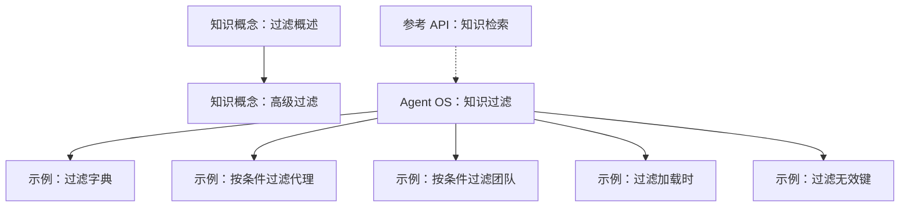
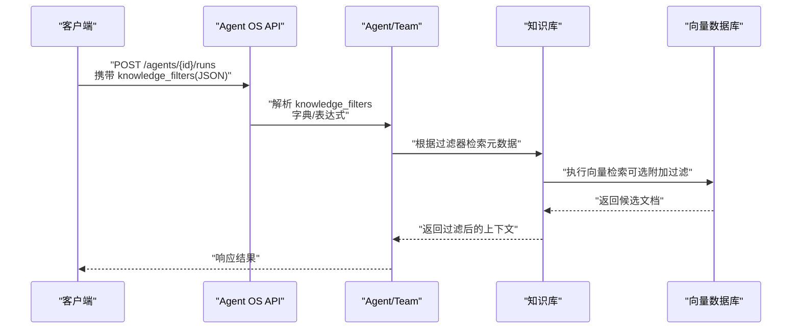
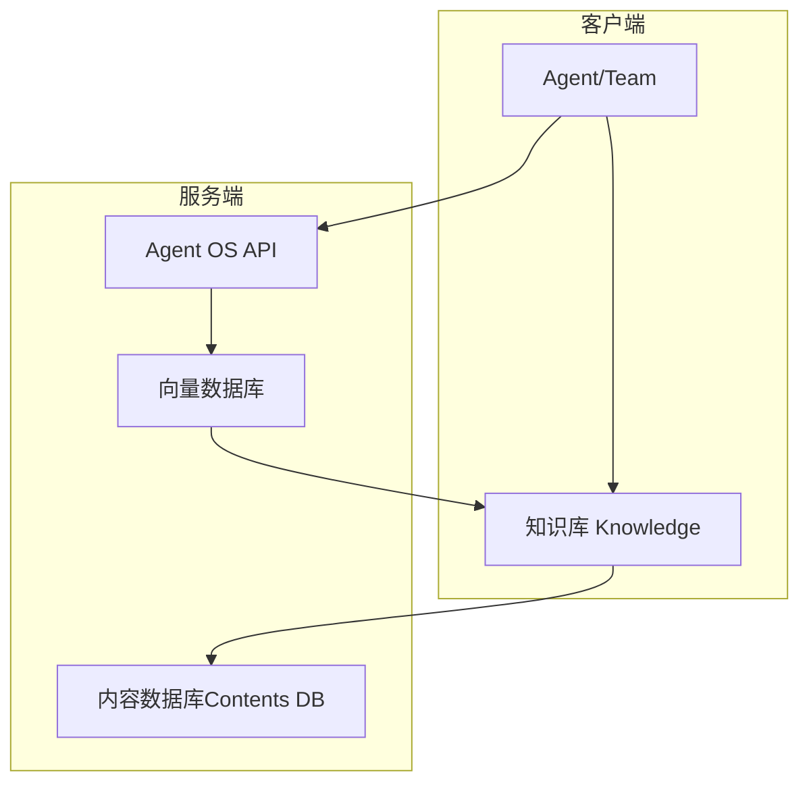

# 手动过滤

<cite>
**本文引用的文件**
- [知识概念：过滤（概述）](file://knowledge/concepts/filters/overview.mdx)
- [知识概念：高级过滤](file://knowledge/concepts/filters/advanced-filtering.mdx)
- [Agent OS：知识过滤](file://agent-os/knowledge/filter-knowledge.mdx)
- [示例：过滤（字典）](file://examples/knowledge/filters/filtering.mdx)
- [示例：按条件过滤（代理）](file://examples/knowledge/filters/filtering-with-conditions-on-agent.mdx)
- [示例：按条件过滤（团队）](file://examples/knowledge/filters/filtering-with-conditions-on-team.mdx)
- [示例：过滤（加载时）](file://examples/knowledge/filters/filtering-on-load.mdx)
- [示例：过滤（无效键）](file://examples/knowledge/filters/filtering-with-invalid-keys.mdx)
- [参考 API：知识检索](file://reference-api/schema/knowledge/search-knowledge.mdx)
</cite>

## 目录
1. [简介](#简介)
2. [项目结构](#项目结构)
3. [核心组件](#核心组件)
4. [架构总览](#架构总览)
5. [详细组件分析](#详细组件分析)
6. [依赖关系分析](#依赖关系分析)
7. [性能考量](#性能考量)
8. [故障排查指南](#故障排查指南)
9. [结论](#结论)
10. [附录](#附录)

## 简介
本篇文档聚焦“手动过滤”能力，系统讲解如何在代理创建、运行时查询以及直接搜索时显式传递过滤器参数，覆盖以下关键点：
- 过滤器语法与操作符（等于、不等于、大于、小于、包含任一）
- 逻辑组合（AND、OR、NOT）
- 在不同场景下的最佳实践（加载时过滤、查询时过滤、直接搜索过滤）
- 无效键值与错误处理策略
- 具体示例路径（以源码片段路径代替代码内容）

## 项目结构
围绕“手动过滤”的知识与示例分布在如下位置：
- 概念与用法：知识概念中的“过滤（概述）”与“高级过滤”
- API 使用：Agent OS 的“知识过滤”指南
- 示例：多种过滤场景的可运行示例
- 参考：API 模式定义（知识检索）

**图表来源**
- [知识概念：过滤（概述）:1-161](file://knowledge/concepts/filters/overview.mdx#L1-L161)
- [知识概念：高级过滤:1-519](file://knowledge/concepts/filters/advanced-filtering.mdx#L1-L519)
- [Agent OS：知识过滤:1-310](file://agent-os/knowledge/filter-knowledge.mdx#L1-L310)
- [示例：过滤（字典）:1-112](file://examples/knowledge/filters/filtering.mdx#L1-L112)
- [示例：按条件过滤（代理）:1-134](file://examples/knowledge/filters/filtering-with-conditions-on-agent.mdx#L1-L134)
- [示例：按条件过滤（团队）:1-161](file://examples/knowledge/filters/filtering-with-conditions-on-team.mdx#L1-L161)
- [示例：过滤（加载时）:1-109](file://examples/knowledge/filters/filtering-on-load.mdx#L1-L109)
- [示例：过滤（无效键）:1-104](file://examples/knowledge/filters/filtering-with-invalid-keys.mdx#L1-L104)
- [参考 API：知识检索:1-3](file://reference-api/schema/knowledge/search-knowledge.mdx#L1-L3)

**章节来源**
- [知识概念：过滤（概述）:1-161](file://knowledge/concepts/filters/overview.mdx#L1-L161)
- [Agent OS：知识过滤:1-310](file://agent-os/knowledge/filter-knowledge.mdx#L1-L310)

## 核心组件
- 字典过滤（简单）：通过 JSON 对象传入键值对，多字段默认以 AND 组合。
- 过滤表达式（高级）：通过 EQ、IN、GT、LT、AND、OR、NOT 等构建复杂逻辑；支持数组形式传入多个表达式。
- API 通道：通过 Agent OS API 的 runs 接口，使用 knowledge_filters 字段传递过滤器；表达式以带 op 键的字典序列化传输。

要点摘要：
- 字典过滤适合“相等匹配 + 多字段 AND”的场景。
- 过滤表达式适合需要 OR/NOT/范围比较的复杂组合。
- 通过 API 传递时，表达式需序列化为 JSON；服务端会自动反序列化为 FilterExpr 对象。

**章节来源**
- [Agent OS：知识过滤:17-81](file://agent-os/knowledge/filter-knowledge.mdx#L17-L81)
- [知识概念：高级过滤:16-106](file://knowledge/concepts/filters/advanced-filtering.mdx#L16-L106)

## 架构总览
下图展示了从客户端到服务端的知识检索与过滤链路，强调“手动过滤”的输入方式与处理流程。

**图表来源**
- [Agent OS：知识过滤:83-221](file://agent-os/knowledge/filter-knowledge.mdx#L83-L221)
- [知识概念：高级过滤:449-477](file://knowledge/concepts/filters/advanced-filtering.mdx#L449-L477)

## 详细组件分析

### 1) 字典过滤（简单）
- 适用场景：单字段相等匹配、多字段 AND 组合。
- 传递方式：在 Agent 初始化、运行时查询或直接搜索时，将字典作为 knowledge_filters 提交。
- 注意：多字段默认 AND 组合；若字段不存在，不会报错，但可能无结果。

示例路径（不含代码内容）：
- [示例：过滤（字典）:90-94](file://examples/knowledge/filters/filtering.mdx#L90-L94)
- [示例：过滤（加载时）:83-91](file://examples/knowledge/filters/filtering-on-load.mdx#L83-L91)
- [示例：过滤（无效键）:84-89](file://examples/knowledge/filters/filtering-with-invalid-keys.mdx#L84-L89)

**章节来源**
- [Agent OS：知识过滤:87-141](file://agent-os/knowledge/filter-knowledge.mdx#L87-L141)
- [知识概念：过滤（概述）:33-58](file://knowledge/concepts/filters/overview.mdx#L33-L58)

### 2) 过滤表达式（高级）
- 支持的操作符：
  - 比较：EQ（等于）、IN（包含任一）、GT（大于）、LT（小于）
  - 逻辑：AND（全部满足）、OR（至少一个满足）、NOT（取反）
- 传递方式：将表达式对象序列化为 JSON（带 op 键），通过 knowledge_filters 传给 API。
- 限制与兼容性：
  - 高级表达式目前仅在 PGVector 中完整支持；其他数据库会记录警告并忽略过滤。
  - 与“代理动态提取过滤”不兼容，后者需使用字典格式。

示例路径（不含代码内容）：
- [示例：按条件过滤（代理）:92-116](file://examples/knowledge/filters/filtering-with-conditions-on-agent.mdx#L92-L116)
- [示例：按条件过滤（团队）:111-143](file://examples/knowledge/filters/filtering-with-conditions-on-team.mdx#L111-L143)
- [知识概念：高级过滤:16-106](file://knowledge/concepts/filters/advanced-filtering.mdx#L16-L106)

**章节来源**
- [Agent OS：知识过滤:42-81](file://agent-os/knowledge/filter-knowledge.mdx#L42-L81)
- [知识概念：高级过滤:405-447](file://knowledge/concepts/filters/advanced-filtering.mdx#L405-L447)

### 3) 三种典型场景的实现路径
- 加载时过滤（初始化 Agent 时设置）：在 Agent 构造函数中传入 knowledge_filters。
  - 示例路径：[示例：过滤（加载时）:83-91](file://examples/knowledge/filters/filtering-on-load.mdx#L83-L91)
- 查询时过滤（调用 print_response/异步检索时）：在方法调用处传入 knowledge_filters。
  - 示例路径：[示例：按条件过滤（代理）:94-116](file://examples/knowledge/filters/filtering-with-conditions-on-agent.mdx#L94-L116)
  - 示例路径：[示例：按条件过滤（团队）:113-143](file://examples/knowledge/filters/filtering-with-conditions-on-team.mdx#L113-L143)
- 直接搜索过滤（直接对知识库 search）：在 knowledge.search 中传入 filters。
  - 示例路径：[知识概念：过滤（概述）:51-55](file://knowledge/concepts/filters/overview.mdx#L51-L55)

**章节来源**
- [知识概念：过滤（概述）:33-58](file://knowledge/concepts/filters/overview.mdx#L33-L58)
- [示例：按条件过滤（代理）:87-116](file://examples/knowledge/filters/filtering-with-conditions-on-agent.mdx#L87-L116)
- [示例：按条件过滤（团队）:97-143](file://examples/knowledge/filters/filtering-with-conditions-on-team.mdx#L97-L143)

### 4) 语法与逻辑组合
- 操作符一览：
  - EQ(key, value)：字段等于某值
  - IN(key, [values])：字段属于值列表
  - GT(key, value) / LT(key, value)：数值比较
  - AND(...)/OR(...)/NOT(...)：逻辑组合
- 组合规则：
  - 多个表达式以数组形式提交时，整体由 AND/OR/NOT 等逻辑连接。
  - 字典过滤多字段默认 AND。

示例路径（不含代码内容）：
- [Agent OS：知识过滤:42-58](file://agent-os/knowledge/filter-knowledge.mdx#L42-L58)
- [知识概念：高级过滤:70-105](file://knowledge/concepts/filters/advanced-filtering.mdx#L70-L105)

**章节来源**
- [Agent OS：知识过滤:42-58](file://agent-os/knowledge/filter-knowledge.mdx#L42-L58)
- [知识概念：高级过滤:70-105](file://knowledge/concepts/filters/advanced-filtering.mdx#L70-L105)

### 5) 无效键值与错误处理策略
- 无效键值：
  - 若过滤字段在知识库中不存在，通常不会报错，但可能无结果。
  - 建议先验证可用元数据键，再进行过滤。
- 解析失败：
  - 当 JSON 结构不合法、缺少必要字段或未知操作符时，过滤会被忽略并记录警告。
  - API 不抛异常，而是以“未应用过滤”的方式继续执行。
- 客户端校验建议：
  - 发送前先序列化并验证 JSON 合法性，避免无效请求。

示例路径（不含代码内容）：
- [示例：过滤（无效键）:84-89](file://examples/knowledge/filters/filtering-with-invalid-keys.mdx#L84-L89)
- [Agent OS：知识过滤:223-268](file://agent-os/knowledge/filter-knowledge.mdx#L223-L268)

**章节来源**
- [Agent OS：知识过滤:223-268](file://agent-os/knowledge/filter-knowledge.mdx#L223-L268)
- [知识概念：高级过滤:322-403](file://knowledge/concepts/filters/advanced-filtering.mdx#L322-L403)

### 6) 最佳实践
- 设计阶段：
  - 明确元数据键集合与取值域，保持一致性。
  - 将时间、访问级别、类型等常用维度纳入元数据。
- 运行阶段：
  - 优先使用字典过滤进行简单 AND 组合；复杂逻辑使用过滤表达式。
  - 在 API 场景中，确保 knowledge_filters 的 JSON 结构正确且包含 op 键。
  - 对于非 PGVector 的数据库，如需复杂过滤，考虑改用字典过滤或在服务端预过滤。
- 调试阶段：
  - 逐步拆分复杂表达式，先单独测试每个子条件，再组合。
  - 使用日志与警告信息定位问题。

示例路径（不含代码内容）：
- [知识概念：过滤（概述）:114-136](file://knowledge/concepts/filters/overview.mdx#L114-L136)
- [知识概念：高级过滤:313-321](file://knowledge/concepts/filters/advanced-filtering.mdx#L313-L321)

**章节来源**
- [知识概念：过滤（概述）:114-136](file://knowledge/concepts/filters/overview.mdx#L114-L136)
- [知识概念：高级过滤:313-321](file://knowledge/concepts/filters/advanced-filtering.mdx#L313-L321)

## 依赖关系分析
- Agent/Team 依赖 Knowledge；Knowledge 再依赖向量数据库与内容数据库。
- 过滤器通过 API 传入后，服务端解析为 FilterExpr 或字典，再驱动检索。
- 数据库支持差异导致表达式能力受限（PGVector 支持更丰富表达式）。

**图表来源**
- [知识概念：高级过滤:137-147](file://knowledge/concepts/filters/advanced-filtering.mdx#L137-L147)
- [Agent OS：知识过滤:83-221](file://agent-os/knowledge/filter-knowledge.mdx#L83-L221)

**章节来源**
- [知识概念：高级过滤:137-147](file://knowledge/concepts/filters/advanced-filtering.mdx#L137-L147)
- [Agent OS：知识过滤:83-221](file://agent-os/knowledge/filter-knowledge.mdx#L83-L221)

## 性能考量
- 表达式复杂度：复杂的 AND/OR/NOT 组合可能增加检索成本，建议逐步拆分与测试。
- 数据库支持：PGVector 支持更丰富的表达式；其他数据库可能无法应用复杂过滤，需降级为字典过滤。
- 结果数量控制：在检索接口中合理设置返回条数，避免过多结果影响性能与成本。

[本节为通用指导，无需特定文件引用]

## 故障排查指南
- 症状：过滤未生效
  - 检查字段名是否拼写正确、是否存在于元数据中。
  - 检查 JSON 结构是否合法，是否包含 op 键。
  - 若使用表达式，请确认数据库是否支持该能力。
- 症状：出现警告但无结果
  - 查看服务端日志，确认是否因无效键或未知操作符被忽略。
- 建议步骤：
  - 先用简单字典过滤验证通路。
  - 再逐步引入表达式，并逐个子条件验证。
  - 对复杂表达式进行清晰分层，避免歧义。

**章节来源**
- [Agent OS：知识过滤:223-268](file://agent-os/knowledge/filter-knowledge.mdx#L223-L268)
- [知识概念：高级过滤:322-403](file://knowledge/concepts/filters/advanced-filtering.mdx#L322-L403)

## 结论
- 手动过滤提供了两种路径：字典过滤（简单 AND）与过滤表达式（复杂逻辑与比较）。
- 在不同场景（加载时、查询时、直接搜索）均可显式传递 knowledge_filters。
- 面对无效键值与错误，系统采用“忽略并警告”的策略，需在客户端做好校验与调试。
- 选择合适的数据库与过滤方式，是获得高性能与高准确性的关键。

[本节为总结，无需特定文件引用]

## 附录
- API 参考：知识检索接口（OpenAPI 片段）
  - [参考 API：知识检索:1-3](file://reference-api/schema/knowledge/search-knowledge.mdx#L1-L3)
- 示例清单（不含代码内容）：
  - 字典过滤：[示例：过滤（字典）:90-94](file://examples/knowledge/filters/filtering.mdx#L90-L94)
  - 加载时过滤：[示例：过滤（加载时）:83-91](file://examples/knowledge/filters/filtering-on-load.mdx#L83-L91)
  - 代理查询时过滤：[示例：按条件过滤（代理）:94-116](file://examples/knowledge/filters/filtering-with-conditions-on-agent.mdx#L94-L116)
  - 团队查询时过滤：[示例：按条件过滤（团队）:113-143](file://examples/knowledge/filters/filtering-with-conditions-on-team.mdx#L113-L143)
  - 无效键值示例：[示例：过滤（无效键）:84-89](file://examples/knowledge/filters/filtering-with-invalid-keys.mdx#L84-L89)

**章节来源**
- [参考 API：知识检索:1-3](file://reference-api/schema/knowledge/search-knowledge.mdx#L1-L3)
- [示例：过滤（字典）:90-94](file://examples/knowledge/filters/filtering.mdx#L90-L94)
- [示例：过滤（加载时）:83-91](file://examples/knowledge/filters/filtering-on-load.mdx#L83-L91)
- [示例：按条件过滤（代理）:94-116](file://examples/knowledge/filters/filtering-with-conditions-on-agent.mdx#L94-L116)
- [示例：按条件过滤（团队）:113-143](file://examples/knowledge/filters/filtering-with-conditions-on-team.mdx#L113-L143)
- [示例：过滤（无效键）:84-89](file://examples/knowledge/filters/filtering-with-invalid-keys.mdx#L84-L89)