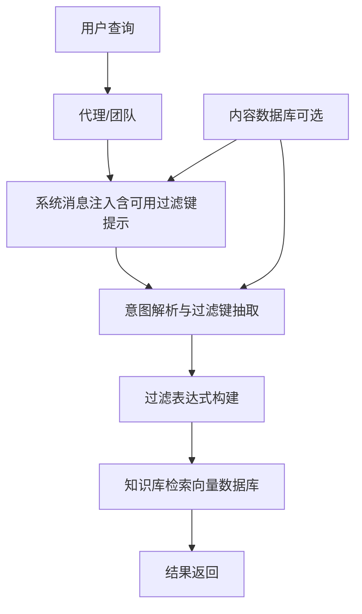
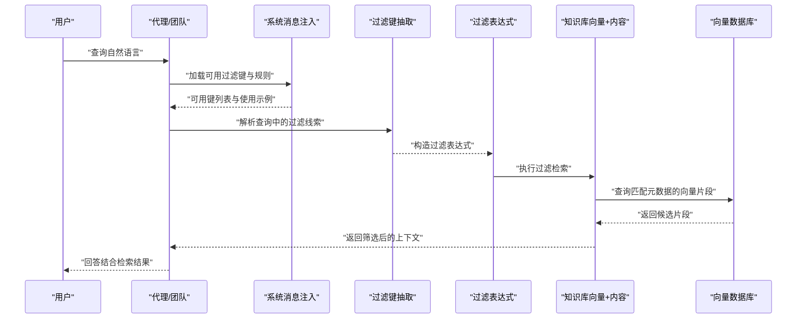
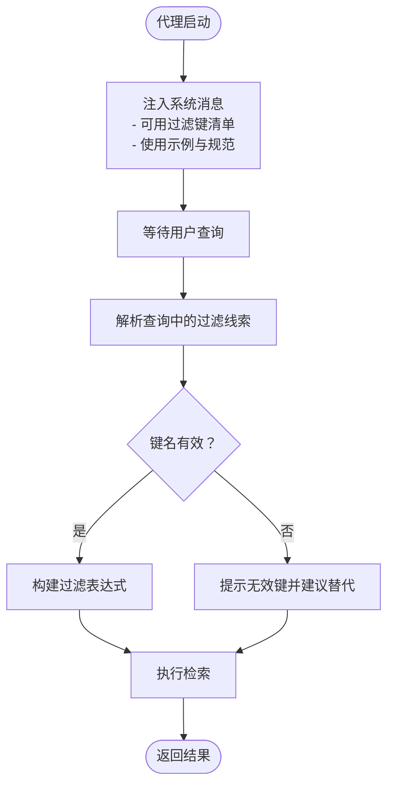
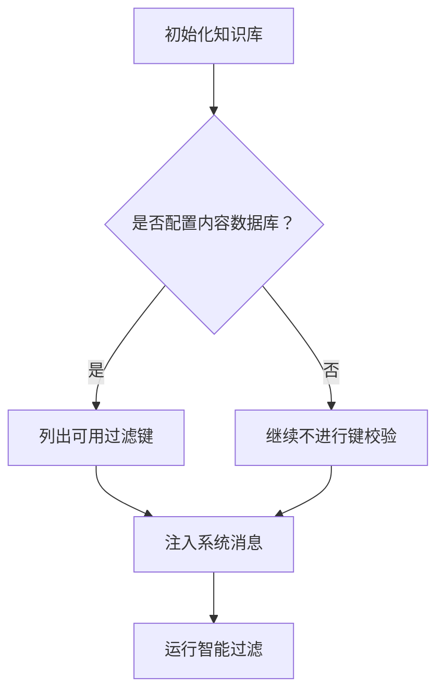
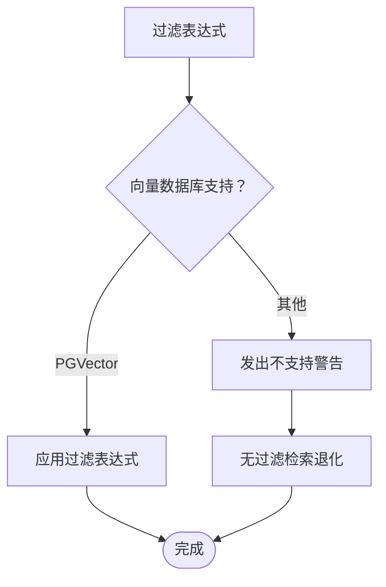
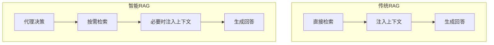
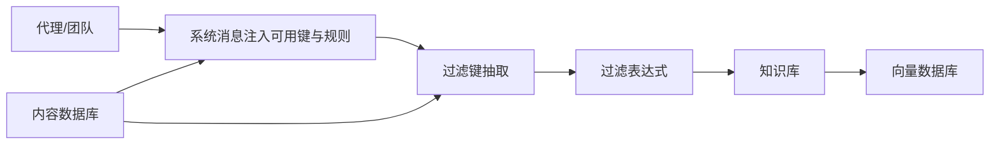

# 智能过滤

<cite>
**本文引用的文件**
- [知识概念：过滤（概述）](file://knowledge/concepts/filters/overview.mdx)
- [知识概念：高级过滤](file://knowledge/concepts/filters/advanced-filtering.mdx)
- [知识概念：内容数据库](file://knowledge/concepts/contents-db.mdx)
- [示例：智能过滤](file://examples/knowledge/filters/agentic-filtering.mdx)
- [示例：带条件的过滤（在代理上）](file://examples/knowledge/filters/filtering-with-conditions-on-agent.mdx)
- [知识概念：检索与检索](file://knowledge/concepts/search-and-retrieval/overview.mdx)
- [上下文：代理总览](file://context/agent/overview.mdx)
- [上下文：团队总览](file://context/team/overview.mdx)
- [知识术语](file://knowledge/terminology.mdx)
- [知识总览](file://knowledge/overview.mdx)
</cite>

## 目录
1. [简介](#简介)
2. [项目结构](#项目结构)
3. [核心组件](#核心组件)
4. [架构总览](#架构总览)
5. [详细组件分析](#详细组件分析)
6. [依赖关系分析](#依赖关系分析)
7. [性能考量](#性能考量)
8. [故障排查指南](#故障排查指南)
9. [结论](#结论)
10. [附录](#附录)

## 简介
本技术文档聚焦“智能过滤”能力，解释如何通过代理自动从用户查询中抽取过滤条件，从而实现更自然、更贴近用户语言习惯的检索体验。文档涵盖以下关键点：
- 智能过滤的工作原理与触发机制
- 内容数据库（Contents DB）在过滤键自动发现中的作用
- 传统RAG与智能RAG在过滤上的差异与适用场景
- 配置启用智能过滤的方法与最佳实践
- 具体代码示例路径（以文件与行号定位）
- 对用户体验与系统性能的影响分析

## 项目结构
围绕“智能过滤”的知识体系由以下几类文档构成：
- 过滤基础与高级用法：定义过滤器语法、组合逻辑、与向量数据库的兼容性
- 内容数据库：提供元数据存储与可用过滤键的发现能力
- 示例：演示如何启用智能过滤、如何在代理上应用过滤
- 上下文：说明智能过滤在代理与团队中的系统消息注入与行为约束
- RAG与检索：对比传统RAG与智能RAG在过滤与检索策略上的差异

图示来源
- [知识概念：过滤（概述）:60-75](file://knowledge/concepts/filters/overview.mdx#L60-L75)
- [上下文：代理总览:240-258](file://context/agent/overview.mdx#L240-L258)
- [上下文：团队总览:394-412](file://context/team/overview.mdx#L394-L412)

章节来源
- [知识概念：过滤（概述）:1-161](file://knowledge/concepts/filters/overview.mdx#L1-L161)
- [知识概念：高级过滤:1-519](file://knowledge/concepts/filters/advanced-filtering.mdx#L1-L519)
- [知识概念：内容数据库:1-206](file://knowledge/concepts/contents-db.mdx#L1-L206)
- [示例：智能过滤:1-127](file://examples/knowledge/filters/agentic-filtering.mdx#L1-L127)
- [上下文：代理总览:240-258](file://context/agent/overview.mdx#L240-L258)
- [上下文：团队总览:394-412](file://context/team/overview.mdx#L394-L412)

## 核心组件
- 智能过滤开关与系统消息注入
  - 在代理或团队上启用智能过滤时，系统会注入包含“可用过滤键列表”的系统消息，并给出基于查询的过滤使用示例与规范。
  - 参考：[上下文：代理总览:240-258](file://context/agent/overview.mdx#L240-L258)、[上下文：团队总览:394-412](file://context/team/overview.mdx#L394-L412)
- 内容数据库（Contents DB）
  - 提供元数据与处理状态的跟踪，支持列出可用过滤键、按ID管理内容、以及与向量数据库的联动删除等。
  - 启用智能过滤需要内容数据库以进行过滤键验证与提示。
  - 参考：[知识概念：内容数据库:20-33](file://knowledge/concepts/contents-db.mdx#L20-L33)
- 过滤表达式与组合逻辑
  - 支持 EQ、IN、GT、LT、AND、OR、NOT 等操作符；复杂表达式仅在特定向量数据库（如PGVector）上受支持。
  - 参考：[知识概念：高级过滤:16-105](file://knowledge/concepts/filters/advanced-filtering.mdx#L16-L105)
- 传统RAG与智能RAG
  - 传统RAG：始终将上下文注入提示；智能RAG：由代理决定何时搜索、是否注入上下文。
  - 参考：[知识概念：检索与检索:99-152](file://knowledge/concepts/search-and-retrieval/overview.mdx#L99-L152)、[知识术语:14-15](file://knowledge/terminology.mdx#L14-L15)

章节来源
- [上下文：代理总览:240-258](file://context/agent/overview.mdx#L240-L258)
- [上下文：团队总览:394-412](file://context/team/overview.mdx#L394-L412)
- [知识概念：内容数据库:20-33](file://knowledge/concepts/contents-db.mdx#L20-L33)
- [知识概念：高级过滤:16-105](file://knowledge/concepts/filters/advanced-filtering.mdx#L16-L105)
- [知识概念：检索与检索:99-152](file://knowledge/concepts/search-and-retrieval/overview.mdx#L99-L152)
- [知识术语:14-15](file://knowledge/terminology.mdx#L14-L15)

## 架构总览
智能过滤的端到端流程如下：

图示来源
- [上下文：代理总览:240-258](file://context/agent/overview.mdx#L240-L258)
- [知识概念：内容数据库:130-140](file://knowledge/concepts/contents-db.mdx#L130-L140)
- [知识概念：高级过滤:108-162](file://knowledge/concepts/filters/advanced-filtering.mdx#L108-L162)

章节来源
- [上下文：代理总览:240-258](file://context/agent/overview.mdx#L240-L258)
- [知识概念：内容数据库:130-140](file://knowledge/concepts/contents-db.mdx#L130-L140)
- [知识概念：高级过滤:108-162](file://knowledge/concepts/filters/advanced-filtering.mdx#L108-L162)

## 详细组件分析

### 组件A：智能过滤的系统消息与规则注入
- 注入内容包括：
  - 可用过滤键清单
  - 基于查询的过滤使用示例
  - 使用规范：优先使用最具体过滤键、多键组合时遵循 AND 逻辑、确保键名有效
- 该机制使代理在对话过程中具备“自我约束”的检索策略，避免无关内容进入上下文。

图示来源
- [上下文：代理总览:240-258](file://context/agent/overview.mdx#L240-L258)
- [上下文：团队总览:394-412](file://context/team/overview.mdx#L394-L412)

章节来源
- [上下文：代理总览:240-258](file://context/agent/overview.mdx#L240-L258)
- [上下文：团队总览:394-412](file://context/team/overview.mdx#L394-L412)

### 组件B：内容数据库（Contents DB）与过滤键自动发现
- 能力要点：
  - 列出可用过滤键：用于生成系统消息中的“可用键清单”
  - 内容管理：增删改查、批量操作、状态监控
  - 与向量数据库联动：删除内容时同步清理向量
- 无内容数据库时仍可过滤，但无法进行键有效性校验与提示优化。

图示来源
- [知识概念：内容数据库:130-140](file://knowledge/concepts/contents-db.mdx#L130-L140)
- [示例：智能过滤:29-50](file://examples/knowledge/filters/agentic-filtering.mdx#L29-L50)

章节来源
- [知识概念：内容数据库:130-140](file://knowledge/concepts/contents-db.mdx#L130-L140)
- [示例：智能过滤:29-50](file://examples/knowledge/filters/agentic-filtering.mdx#L29-L50)

### 组件C：过滤表达式与向量数据库兼容性
- 表达式支持：EQ、IN、GT、LT、AND、OR、NOT
- 兼容性限制：复杂表达式（FilterExpr）当前仅在 PGVector 支持
- 不支持时的行为：发出警告并忽略过滤表达式，退化为无过滤检索

图示来源
- [知识概念：高级过滤:405-425](file://knowledge/concepts/filters/advanced-filtering.mdx#L405-L425)

章节来源
- [知识概念：高级过滤:405-425](file://knowledge/concepts/filters/advanced-filtering.mdx#L405-L425)

### 组件D：传统RAG vs 智能RAG 的过滤差异
- 传统RAG：始终将检索到的内容注入提示，适合稳定、可控的问答场景
- 智能RAG：由代理决定何时搜索、是否注入上下文，更适合复杂、多轮、需要动态检索的场景
- 过滤在两种模式下均可使用，但智能RAG更强调“按需检索”与“自然语言驱动的过滤”

图示来源
- [知识概念：检索与检索:99-152](file://knowledge/concepts/search-and-retrieval/overview.mdx#L99-L152)
- [知识术语:14-15](file://knowledge/terminology.mdx#L14-L15)

章节来源
- [知识概念：检索与检索:99-152](file://knowledge/concepts/search-and-retrieval/overview.mdx#L99-L152)
- [知识术语:14-15](file://knowledge/terminology.mdx#L14-L15)

## 依赖关系分析
- 智能过滤依赖内容数据库以提供“可用过滤键清单”，并在键无效时给出提示
- 过滤表达式依赖向量数据库的原生过滤能力；PGVector 支持复杂表达式，其他数据库仅支持字典格式
- 代理/团队在运行时根据系统消息注入的规则，对用户查询进行过滤键抽取与表达式构建

图示来源
- [上下文：代理总览:240-258](file://context/agent/overview.mdx#L240-L258)
- [知识概念：高级过滤:405-425](file://knowledge/concepts/filters/advanced-filtering.mdx#L405-L425)
- [知识概念：内容数据库:130-140](file://knowledge/concepts/contents-db.mdx#L130-L140)

章节来源
- [上下文：代理总览:240-258](file://context/agent/overview.mdx#L240-L258)
- [知识概念：高级过滤:405-425](file://knowledge/concepts/filters/advanced-filtering.mdx#L405-L425)
- [知识概念：内容数据库:130-140](file://knowledge/concepts/contents-db.mdx#L130-L140)

## 性能考量
- 过滤键数量与组合复杂度会影响检索性能。建议：
  - 优先使用具体键值，减少候选集规模
  - 复杂表达式尽量在 PGVector 上使用，其他数据库采用字典格式
  - 对高基数字段（如 user_id）建立索引或分桶策略（视向量数据库支持而定）
- 用户体验方面：
  - 智能过滤降低用户理解门槛，提升自然交互体验
  - 若过滤不当导致检索过窄或过宽，可通过系统消息中的示例引导用户调整表述

## 故障排查指南
- 过滤未生效
  - 检查元数据键是否存在：先添加内容并确认键存在，再进行过滤
  - 打印过滤表达式结构，验证嵌套逻辑与运算符顺序
- 复杂过滤失败
  - 将复合条件拆分为简单条件逐一测试
  - 明确嵌套逻辑，避免歧义
- 向量数据库不支持复杂表达式
  - 收到“不支持”警告时，回退为字典格式过滤
- 智能过滤未触发
  - 确认已启用智能过滤开关
  - 确保内容数据库已配置，以便提供可用键清单与校验

章节来源
- [知识概念：高级过滤:322-402](file://knowledge/concepts/filters/advanced-filtering.mdx#L322-L402)
- [知识概念：高级过滤:405-425](file://knowledge/concepts/filters/advanced-filtering.mdx#L405-L425)

## 结论
智能过滤通过“系统消息注入 + 内容数据库 + 过滤表达式”三者协同，实现了从自然语言到精确检索的自动化过渡。它在保持传统RAG可控性的基础上，增强了智能RAG的灵活性与易用性。实践中应结合内容数据库与向量数据库能力，合理设计元数据与过滤策略，以获得更好的用户体验与系统性能。

## 附录

### 配置启用智能过滤（步骤与示例路径）
- 在代理上启用智能过滤
  - 设置参数以开启智能过滤，并确保知识库已配置内容数据库
  - 示例路径：[示例：智能过滤:98-109](file://examples/knowledge/filters/agentic-filtering.mdx#L98-L109)
- 在团队上启用智能过滤
  - 团队同样支持智能过滤，系统消息注入规则一致
  - 示例路径：[上下文：团队总览:394-412](file://context/team/overview.mdx#L394-L412)
- 使用过滤表达式（PGVector）
  - 复杂表达式（EQ、AND、OR、NOT 等）仅在 PGVector 支持
  - 示例路径：[知识概念：高级过滤:108-162](file://knowledge/concepts/filters/advanced-filtering.mdx#L108-L162)
- 使用字典格式过滤（通用）
  - 适用于所有向量数据库，作为复杂表达式的回退方案
  - 示例路径：[示例：带条件的过滤（在代理上）:92-116](file://examples/knowledge/filters/filtering-with-conditions-on-agent.mdx#L92-L116)

章节来源
- [示例：智能过滤:98-109](file://examples/knowledge/filters/agentic-filtering.mdx#L98-L109)
- [上下文：团队总览:394-412](file://context/team/overview.mdx#L394-L412)
- [知识概念：高级过滤:108-162](file://knowledge/concepts/filters/advanced-filtering.mdx#L108-L162)
- [示例：带条件的过滤（在代理上）:92-116](file://examples/knowledge/filters/filtering-with-conditions-on-agent.mdx#L92-L116)