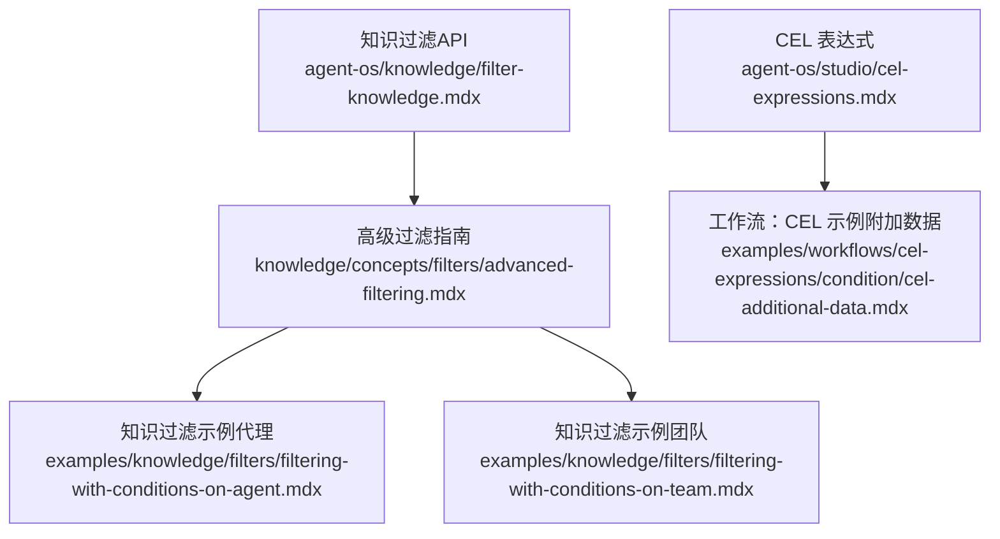
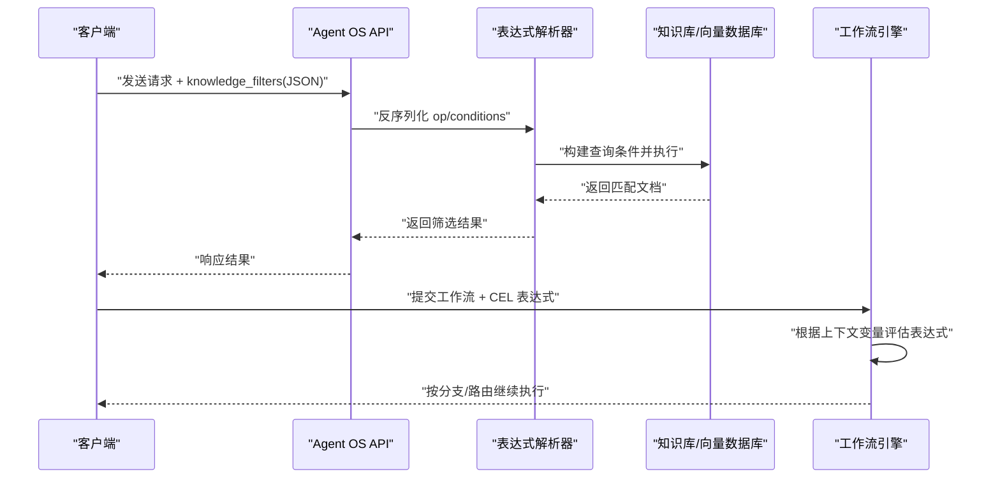
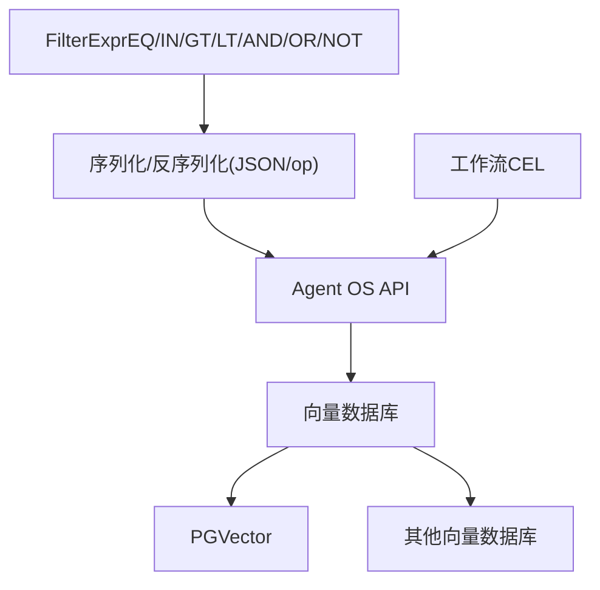

# 表达式过滤

<cite>
**本文引用的文件**
- [知识过滤（API）](file://agent-os/knowledge/filter-knowledge.mdx)
- [高级过滤指南](file://knowledge/concepts/filters/advanced-filtering.mdx)
- [CEL 表达式](file://agent-os/studio/cel-expressions.mdx)
- [工作流：CEL 表达式示例（附加数据）](file://examples/workflows/cel-expressions/condition/cel-additional-data.mdx)
- [知识过滤示例（代理）](file://examples/knowledge/filters/filtering-with-conditions-on-agent.mdx)
- [知识过滤示例（团队）](file://examples/knowledge/filters/filtering-with-conditions-on-team.mdx)
</cite>

## 目录
1. [简介](#简介)
2. [项目结构](#项目结构)
3. [核心组件](#核心组件)
4. [架构总览](#架构总览)
5. [详细组件分析](#详细组件分析)
6. [依赖关系分析](#依赖关系分析)
7. [性能考量](#性能考量)
8. [故障排查指南](#故障排查指南)
9. [结论](#结论)
10. [附录](#附录)

## 简介
本技术文档围绕“表达式过滤”能力，系统阐述如何通过复杂过滤表达式实现精确内容筛选。内容覆盖：
- 支持的表达式语法与操作符组合（AND、OR、NOT）
- 比较运算（EQ、IN、GT、LT）
- 时间范围、数值范围与复合条件过滤的实现方法
- 表达式解析机制与错误处理
- 性能优化策略与最佳实践
- 实际应用场景与代码示例路径（以文件路径代替具体代码）

表达式过滤既可用于知识检索的前置筛选，也可用于工作流中的条件判断与路由控制。与简单过滤相比，表达式过滤在逻辑组合、范围查询与可序列化方面具备显著优势。

## 项目结构
以下图示展示与表达式过滤相关的关键文档与示例文件：

图表来源
- [知识过滤（API）](file://agent-os/knowledge/filter-knowledge.mdx)
- [高级过滤指南](file://knowledge/concepts/filters/advanced-filtering.mdx)
- [CEL 表达式](file://agent-os/studio/cel-expressions.mdx)
- [工作流：CEL 示例（附加数据）](file://examples/workflows/cel-expressions/condition/cel-additional-data.mdx)
- [知识过滤示例（代理）](file://examples/knowledge/filters/filtering-with-conditions-on-agent.mdx)
- [知识过滤示例（团队）](file://examples/knowledge/filters/filtering-with-conditions-on-team.mdx)

章节来源
- [知识过滤（API）](file://agent-os/knowledge/filter-knowledge.mdx)
- [高级过滤指南](file://knowledge/concepts/filters/advanced-filtering.mdx)
- [CEL 表达式](file://agent-os/studio/cel-expressions.mdx)
- [工作流：CEL 示例（附加数据）](file://examples/workflows/cel-expressions/condition/cel-additional-data.mdx)
- [知识过滤示例（代理）](file://examples/knowledge/filters/filtering-with-conditions-on-agent.mdx)
- [知识过滤示例（团队）](file://examples/knowledge/filters/filtering-with-conditions-on-team.mdx)

## 核心组件
- 过滤表达式对象模型
  - 比较运算：EQ、IN、GT、LT
  - 逻辑运算：AND、OR、NOT
  - 序列化格式：以字典形式携带 op 字段，服务端据此反序列化为表达式对象
- 知识检索过滤
  - 支持字典过滤（简单等值匹配）与表达式过滤（复杂逻辑与范围）
  - 可通过 API 的 knowledge_filters 字段传入，支持数组形式传入多个表达式
- 工作流表达式
  - 条件（Condition）、循环（Loop）、路由器（Router）三类步骤支持 CEL 表达式作为评估器、结束条件或选择器
  - 提供上下文变量（如 input、previous_step_content、additional_data、session_state 等）供表达式使用

章节来源
- [知识过滤（API）](file://agent-os/knowledge/filter-knowledge.mdx)
- [高级过滤指南](file://knowledge/concepts/filters/advanced-filtering.mdx)
- [CEL 表达式](file://agent-os/studio/cel-expressions.mdx)

## 架构总览
下图展示“表达式过滤”的端到端流程：客户端构造表达式 → 序列化为 JSON → 通过 API 或工作流传递 → 服务端解析与执行 → 返回筛选结果。

图表来源
- [知识过滤（API）](file://agent-os/knowledge/filter-knowledge.mdx)
- [CEL 表达式](file://agent-os/studio/cel-expressions.mdx)

## 详细组件分析

### 组件一：过滤表达式语法与操作符
- 比较运算
  - EQ(key, value)：字段等于某值
  - IN(key, [values])：字段属于某个集合
  - GT(key, value)、LT(key, value)：数值范围比较
- 逻辑运算
  - AND(*filters)：全部满足
  - OR(*filters)：任一满足
  - NOT(filter)：排除某条件
- 序列化格式
  - 带 op 字段的对象表示表达式；无 op 字段则视为字典过滤
  - 多个表达式可用数组传入，实现多条件组合

章节来源
- [知识过滤（API）](file://agent-os/knowledge/filter-knowledge.mdx)
- [高级过滤指南](file://knowledge/concepts/filters/advanced-filtering.mdx)

### 组件二：时间范围与数值范围过滤
- 数值范围
  - 使用 GT/LT 对年份、分数、计数等字段进行区间筛选
- 时间范围
  - 将日期/时间字段作为字符串或数值参与比较
  - 可结合 NOT 排除归档/过期内容
- 复合条件
  - 结合 AND/OR/NOT 组合多字段、多范围条件，形成复杂筛选

章节来源
- [高级过滤指南](file://knowledge/concepts/filters/advanced-filtering.mdx)

### 组件三：表达式解析机制与错误处理
- 解析机制
  - 服务端依据 JSON 中的 op 字段识别表达式类型，并重建表达式树
  - 字典过滤（无 op）保持向后兼容
- 错误处理
  - 非法结构、未知操作符、无效 JSON 等会被忽略并记录警告
  - 不抛出异常，搜索将以未过滤状态继续，便于调试定位

章节来源
- [知识过滤（API）](file://agent-os/knowledge/filter-knowledge.mdx)

### 组件四：工作流中的 CEL 表达式
- 支持场景
  - Condition：基于布尔表达式分支
  - Loop：基于输出或状态退出循环
  - Router：基于字符串选择器路由到不同步骤
- 上下文变量
  - input、previous_step_content、previous_step_outputs、additional_data、session_state 等
- 示例路径
  - [工作流：CEL 示例（附加数据）](file://examples/workflows/cel-expressions/condition/cel-additional-data.mdx)

章节来源
- [CEL 表达式](file://agent-os/studio/cel-expressions.mdx)
- [工作流：CEL 示例（附加数据）](file://examples/workflows/cel-expressions/condition/cel-additional-data.mdx)

### 组件五：知识检索中的表达式过滤
- 适用范围
  - 通过 Agent/Team 的知识搜索接口传入 knowledge_filters
  - 支持单个或多个表达式数组
- 向量数据库支持
  - 高级表达式（FilterExpr）当前仅 PGVector 支持
  - 其他向量数据库请使用字典格式替代
- 示例路径
  - [知识过滤示例（代理）](file://examples/knowledge/filters/filtering-with-conditions-on-agent.mdx)
  - [知识过滤示例（团队）](file://examples/knowledge/filters/filtering-with-conditions-on-team.mdx)

章节来源
- [高级过滤指南](file://knowledge/concepts/filters/advanced-filtering.mdx)
- [知识过滤示例（代理）](file://examples/knowledge/filters/filtering-with-conditions-on-agent.mdx)
- [知识过滤示例（团队）](file://examples/knowledge/filters/filtering-with-conditions-on-team.mdx)

### 组件六：表达式过滤 vs 简单过滤
- 简单过滤（字典）
  - 适合等值匹配与 AND 组合
  - 无需逻辑运算符，结构简单
- 表达式过滤
  - 支持 OR/NOT/范围比较，逻辑更灵活
  - 可序列化，便于在 Studio 编辑与持久化
  - 在 PGVector 下支持更丰富的 FilterExpr 能力
- 选择建议
  - 仅需等值匹配：优先字典过滤
  - 需要复杂逻辑、范围查询或排除条件：使用表达式过滤

章节来源
- [知识过滤（API）](file://agent-os/knowledge/filter-knowledge.mdx)
- [高级过滤指南](file://knowledge/concepts/filters/advanced-filtering.mdx)

## 依赖关系分析
- 组件耦合
  - 表达式对象与序列化格式解耦于具体向量数据库
  - 工作流 CEL 与表达式对象相互独立但均可用于条件控制
- 外部依赖
  - PGVector：支持 FilterExpr 的完整能力
  - 其他向量数据库：需回退到字典过滤
- 潜在风险
  - 表达式结构错误不会中断流程，但可能导致未按预期过滤
  - 未在目标数据库上启用 FilterExpr 时会忽略过滤

图表来源
- [高级过滤指南](file://knowledge/concepts/filters/advanced-filtering.mdx)
- [知识过滤（API）](file://agent-os/knowledge/filter-knowledge.mdx)
- [CEL 表达式](file://agent-os/studio/cel-expressions.mdx)

章节来源
- [高级过滤指南](file://knowledge/concepts/filters/advanced-filtering.mdx)
- [知识过滤（API）](file://agent-os/knowledge/filter-knowledge.mdx)
- [CEL 表达式](file://agent-os/studio/cel-expressions.mdx)

## 性能考量
- 过滤表达式复杂度
  - 多层嵌套 AND/OR 可能增加查询成本，建议拆分或简化
- 向量数据库差异
  - PGVector 支持 FilterExpr，其他数据库可能无法应用复杂过滤
- 建议
  - 优先使用高选择性条件（如 EQ/IN）减少候选集
  - 对时间/数值范围尽量靠近输入端设置，避免全表扫描
  - 使用“渐进式过滤”策略：先宽后窄，按结果数量动态收紧

章节来源
- [高级过滤指南](file://knowledge/concepts/filters/advanced-filtering.mdx)

## 故障排查指南
- 常见问题
  - 过滤未生效：检查 JSON 结构是否有效、op 字段是否存在、键名是否存在于元数据中
  - 数据库不支持 FilterExpr：确认使用的是 PGVector；否则改用字典过滤
  - 表达式报错但流程未中断：查看服务端日志，确认被忽略的警告信息
- 定位步骤
  - 打印/校验 to_dict() 输出，确保可被 JSON 解析
  - 分步测试子条件，逐步合并验证
  - 明确操作符优先级，必要时拆分子表达式提升可读性

章节来源
- [知识过滤（API）](file://agent-os/knowledge/filter-knowledge.mdx)
- [高级过滤指南](file://knowledge/concepts/filters/advanced-filtering.mdx)

## 结论
表达式过滤通过统一的表达式语法与序列化机制，为知识检索与工作流控制提供了强大的逻辑表达能力。在 PGVector 环境下，FilterExpr 能力进一步增强了范围查询与复杂组合的灵活性。实践中应结合场景选择合适方式：简单场景用字典过滤，复杂场景用表达式过滤，并遵循性能与可维护性最佳实践。

## 附录
- 实际示例路径（以文件路径代替代码片段）
  - 知识过滤（API）基础与高级用法：[知识过滤（API）](file://agent-os/knowledge/filter-knowledge.mdx)
  - 高级过滤操作符与模式：[高级过滤指南](file://knowledge/concepts/filters/advanced-filtering.mdx)
  - 工作流 CEL 表达式（条件/循环/路由）：[CEL 表达式](file://agent-os/studio/cel-expressions.mdx)
  - 工作流 CEL 示例（附加数据）：[工作流：CEL 示例（附加数据）](file://examples/workflows/cel-expressions/condition/cel-additional-data.mdx)
  - 知识过滤示例（代理）：[知识过滤示例（代理）](file://examples/knowledge/filters/filtering-with-conditions-on-agent.mdx)
  - 知识过滤示例（团队）：[知识过滤示例（团队）](file://examples/knowledge/filters/filtering-with-conditions-on-team.mdx)