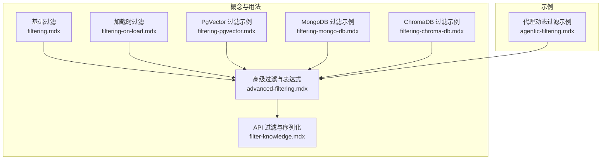
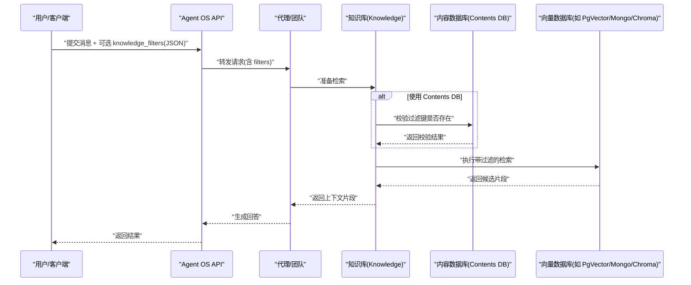
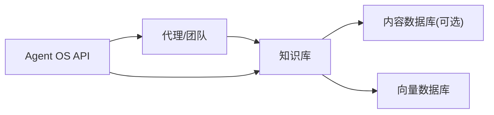

# 过滤系统

<cite>
**本文引用的文件**
- [advanced-filtering.mdx](file://knowledge/concepts/filters/advanced-filtering.mdx)
- [filter-knowledge.mdx](file://agent-os/knowledge/filter-knowledge.mdx)
- [filtering.mdx](file://knowledge/concepts/filters/filtering.mdx)
- [filtering-on-load.mdx](file://knowledge/concepts/filters/filtering-on-load.mdx)
- [filtering-pgvector.mdx](file://knowledge/concepts/filters/filtering-pgvector.mdx)
- [filtering-mongo-db.mdx](file://knowledge/concepts/filters/filtering-mongo-db.mdx)
- [filtering-chroma-db.mdx](file://knowledge/concepts/filters/filtering-chroma-db.mdx)
- [agentic-filtering.mdx](file://examples/knowledge/filters/agentic-filtering.mdx)
</cite>

## 目录
1. [简介](#简介)
2. [项目结构](#项目结构)
3. [核心组件](#核心组件)
4. [架构总览](#架构总览)
5. [详细组件分析](#详细组件分析)
6. [依赖分析](#依赖分析)
7. [性能考虑](#性能考虑)
8. [故障排查指南](#故障排查指南)
9. [结论](#结论)
10. [附录](#附录)

## 简介
本技术文档围绕知识检索中的过滤机制展开，系统性介绍基于元数据的过滤、内容过滤、表达式过滤与高级过滤策略，并覆盖过滤器的配置方法、语法与性能优化。文档同时解释在“加载知识”、“检索时”与“结果后处理”三个阶段如何应用过滤；并对比不同向量数据库（如 PgVector、MongoDB、ChromaDB）的过滤实现差异与最佳实践。最后提供调试方法、性能监控技巧以及过滤器与检索算法的协同工作机制。

## 项目结构
本仓库中与过滤系统直接相关的知识与示例主要分布在以下路径：
- 概念与用法：knowledge/concepts/filters/*.mdx
- API 与序列化：agent-os/knowledge/filter-knowledge.mdx
- 示例与实战：examples/knowledge/filters/*.mdx
- 向量数据库适配：examples/knowledge/filters/vector-dbs/*.mdx（概念页亦有对应文件）

下图给出与过滤系统相关的文档与示例的组织关系概览：

图表来源
- [filtering.mdx:1-117](file://knowledge/concepts/filters/filtering.mdx#L1-L117)
- [filtering-on-load.mdx:1-121](file://knowledge/concepts/filters/filtering-on-load.mdx#L1-L121)
- [advanced-filtering.mdx:1-519](file://knowledge/concepts/filters/advanced-filtering.mdx#L1-L519)
- [filter-knowledge.mdx:1-310](file://agent-os/knowledge/filter-knowledge.mdx#L1-L310)
- [filtering-pgvector.mdx:1-128](file://knowledge/concepts/filters/filtering-pgvector.mdx#L1-L128)
- [filtering-mongo-db.mdx:1-138](file://knowledge/concepts/filters/filtering-mongo-db.mdx#L1-L138)
- [filtering-chroma-db.mdx:1-124](file://knowledge/concepts/filters/filtering-chroma-db.mdx#L1-L124)
- [agentic-filtering.mdx:1-127](file://examples/knowledge/filters/agentic-filtering.mdx#L1-L127)

章节来源
- [filtering.mdx:1-117](file://knowledge/concepts/filters/filtering.mdx#L1-L117)
- [filtering-on-load.mdx:1-121](file://knowledge/concepts/filters/filtering-on-load.mdx#L1-L121)
- [advanced-filtering.mdx:1-519](file://knowledge/concepts/filters/advanced-filtering.mdx#L1-L519)
- [filter-knowledge.mdx:1-310](file://agent-os/knowledge/filter-knowledge.mdx#L1-L310)
- [filtering-pgvector.mdx:1-128](file://knowledge/concepts/filters/filtering-pgvector.mdx#L1-L128)
- [filtering-mongo-db.mdx:1-138](file://knowledge/concepts/filters/filtering-mongo-db.mdx#L1-L138)
- [filtering-chroma-db.mdx:1-124](file://knowledge/concepts/filters/filtering-chroma-db.mdx#L1-L124)
- [agentic-filtering.mdx:1-127](file://examples/knowledge/filters/agentic-filtering.mdx#L1-L127)

## 核心组件
- 基础过滤（字典格式）
  - 面向简单等值匹配，通过键值对组合实现 AND 逻辑。
  - 典型场景：按状态、分类、年份等字段过滤。
- 表达式过滤（FilterExpr）
  - 支持比较运算符（EQ、IN、GT、LT）与逻辑运算符（AND、OR、NOT），可构建复杂条件组合。
  - 适用于需要范围查询、排除条件或多条件组合的场景。
- API 过滤与序列化
  - FilterExpr 对象以字典形式序列化为 JSON，服务端自动反序列化为 FilterExpr，支持 REST 接口调用。
- 内容数据库（Contents DB）
  - 可选配置，用于在运行时验证过滤键是否存在于知识库元数据中，提升可靠性与可维护性。
- 向量数据库适配
  - 不同向量数据库对过滤的支持存在差异，需根据所选存储选择合适的过滤方式与参数。

章节来源
- [advanced-filtering.mdx:16-106](file://knowledge/concepts/filters/advanced-filtering.mdx#L16-L106)
- [filter-knowledge.mdx:10-58](file://agent-os/knowledge/filter-knowledge.mdx#L10-L58)
- [agentic-filtering.mdx:27-50](file://examples/knowledge/filters/agentic-filtering.mdx#L27-L50)

## 架构总览
下图展示从“用户/代理发起请求”到“向量数据库执行过滤检索”的整体流程，以及不同过滤方式在各阶段的应用点。

图表来源
- [filter-knowledge.mdx:83-221](file://agent-os/knowledge/filter-knowledge.mdx#L83-L221)
- [advanced-filtering.mdx:108-227](file://knowledge/concepts/filters/advanced-filtering.mdx#L108-L227)
- [agentic-filtering.mdx:98-109](file://examples/knowledge/filters/agentic-filtering.mdx#L98-L109)

## 详细组件分析

### 基础过滤（字典格式）
- 适用场景
  - 简单等值匹配，如按状态、类型、年份等字段过滤。
  - 多字段组合默认采用 AND 逻辑。
- 配置要点
  - 将过滤条件以键值对形式传入，无需额外封装列表。
  - 适合静态、预定义的过滤规则。
- 示例入口
  - [基础过滤示例:7-92](file://knowledge/concepts/filters/filtering.mdx#L7-L92)
  - [加载时过滤示例:84-94](file://knowledge/concepts/filters/filtering-on-load.mdx#L84-L94)

章节来源
- [filtering.mdx:1-117](file://knowledge/concepts/filters/filtering.mdx#L1-L117)
- [filtering-on-load.mdx:1-121](file://knowledge/concepts/filters/filtering-on-load.mdx#L1-L121)

### 表达式过滤（FilterExpr）
- 运算符体系
  - 比较：EQ、IN、GT、LT
  - 逻辑：AND、OR、NOT
- 使用方式
  - 在代码中构造 FilterExpr，再通过 API 序列化为 JSON 发送。
  - 支持在代理、团队、API 中使用。
- 限制与兼容性
  - 当前仅部分向量数据库（如 PgVector）原生支持 FilterExpr。
  - 不支持的数据库会记录警告并忽略过滤，仍返回未过滤结果。
- 示例入口
  - [表达式过滤与示例:16-190](file://knowledge/concepts/filters/advanced-filtering.mdx#L16-L190)
  - [API 过滤与序列化:42-182](file://agent-os/knowledge/filter-knowledge.mdx#L42-L182)

章节来源
- [advanced-filtering.mdx:16-106](file://knowledge/concepts/filters/advanced-filtering.mdx#L16-L106)
- [filter-knowledge.mdx:42-81](file://agent-os/knowledge/filter-knowledge.mdx#L42-L81)

### API 过滤与序列化
- JSON 结构
  - FilterExpr 以字典形式序列化，包含操作符与参数；普通字典无 op 字段。
- 错误处理
  - 解析失败时过滤被忽略，搜索在无过滤状态下继续执行。
- 客户端校验建议
  - 发送前先序列化并校验 JSON 合法性，避免无效请求。
- 示例入口
  - [API 过滤与错误处理:184-268](file://agent-os/knowledge/filter-knowledge.mdx#L184-L268)

章节来源
- [filter-knowledge.mdx:184-268](file://agent-os/knowledge/filter-knowledge.mdx#L184-L268)

### 代理动态过滤（Agentic Filtering）
- 特点
  - 由代理在对话过程中动态决定过滤条件，适合上下文驱动的检索。
  - 与 FilterExpr 的静态组合不兼容，应使用字典格式。
- Contents DB 的作用
  - 可选配置，启用后可在运行时校验过滤键，提高稳定性与可维护性。
- 示例入口
  - [代理动态过滤示例:98-109](file://examples/knowledge/filters/agentic-filtering.mdx#L98-L109)

章节来源
- [agentic-filtering.mdx:27-50](file://examples/knowledge/filters/agentic-filtering.mdx#L27-L50)
- [agentic-filtering.mdx:98-109](file://examples/knowledge/filters/agentic-filtering.mdx#L98-L109)

### 向量数据库过滤差异与最佳实践
- PgVector
  - 支持 FilterExpr 的原生过滤，适合复杂逻辑与高性能检索。
  - 示例入口：[PgVector 过滤示例:86-96](file://knowledge/concepts/filters/filtering-pgvector.mdx#L86-L96)
- MongoDB
  - 通过 MongoVectorDb 提供向量与过滤能力，适合云原生与灵活 schema 场景。
  - 示例入口：[MongoDB 过滤示例:88-98](file://knowledge/concepts/filters/filtering-mongo-db.mdx#L88-L98)
- ChromaDB
  - 本地/轻量部署友好，适合开发与演示场景。
  - 示例入口：[ChromaDB 过滤示例:84-94](file://knowledge/concepts/filters/filtering-chroma-db.mdx#L84-L94)
- 最佳实践
  - 明确过滤键与取值集合，尽量使用索引字段。
  - 对高基数字段谨慎使用 OR/NOT，优先使用 EQ/IN/GT/LT 组合。
  - 在 Contents DB 中维护元数据模式，便于运行时校验。

章节来源
- [filtering-pgvector.mdx:1-128](file://knowledge/concepts/filters/filtering-pgvector.mdx#L1-L128)
- [filtering-mongo-db.mdx:1-138](file://knowledge/concepts/filters/filtering-mongo-db.mdx#L1-L138)
- [filtering-chroma-db.mdx:1-124](file://knowledge/concepts/filters/filtering-chroma-db.mdx#L1-L124)

### 过滤器在三阶段的应用
- 加载知识阶段
  - 在 insert/insert_many 时附加元数据，确保后续检索可用。
  - 示例入口：[加载时过滤示例:33-82](file://knowledge/concepts/filters/filtering-on-load.mdx#L33-L82)
- 检索阶段
  - 在代理/团队/API 调用时传入 filters，执行带过滤的检索。
  - 示例入口：[基础过滤示例:81-90](file://knowledge/concepts/filters/filtering.mdx#L81-L90)
- 结果后处理
  - 可在返回片段后进一步筛选（如去重、排序、评分裁剪），但需注意与检索阶段过滤的协同。
  - 建议：优先在检索阶段完成强过滤，后处理阶段做轻量优化。

章节来源
- [filtering-on-load.mdx:33-94](file://knowledge/concepts/filters/filtering-on-load.mdx#L33-L94)
- [filtering.mdx:81-90](file://knowledge/concepts/filters/filtering.mdx#L81-L90)

## 依赖分析
- 组件耦合
  - Knowledge 依赖 Vector DB 与 Contents DB（可选）。
  - 代理/团队通过 Knowledge 发起检索，可传入 filters。
  - API 层负责接收 filters 并将其序列化/反序列化。
- 外部依赖
  - 向量数据库驱动（如 PgVector、Mongo、Chroma）。
  - 内容数据库（如 Postgres）用于模式校验与元数据管理。
- 潜在循环依赖
  - 文档层示例与概念相互引用，属于文档层面的交叉引用，不构成代码循环依赖。

图表来源
- [advanced-filtering.mdx:108-227](file://knowledge/concepts/filters/advanced-filtering.mdx#L108-L227)
- [filter-knowledge.mdx:83-182](file://agent-os/knowledge/filter-knowledge.mdx#L83-L182)
- [agentic-filtering.mdx:98-109](file://examples/knowledge/filters/agentic-filtering.mdx#L98-L109)

章节来源
- [advanced-filtering.mdx:108-227](file://knowledge/concepts/filters/advanced-filtering.mdx#L108-L227)
- [filter-knowledge.mdx:83-182](file://agent-os/knowledge/filter-knowledge.mdx#L83-L182)
- [agentic-filtering.mdx:98-109](file://examples/knowledge/filters/agentic-filtering.mdx#L98-L109)

## 性能考虑
- 过滤器设计
  - 优先使用高选择性的字段（如状态、类型）与 EQ/IN，减少候选集规模。
  - 避免在高基数字段上使用 OR/NOT，必要时拆分为多个子查询。
- 索引与存储
  - 为常用过滤键建立索引，提升检索效率。
  - 合理设置分页与返回数量，避免一次性返回过多片段。
- 检索策略协同
  - 将过滤与嵌入检索结合，先用过滤缩小候选，再用语义相似度排序。
  - 对于大体量知识库，建议在 Contents DB 中维护元数据模式，降低无效检索概率。
- 数据库差异
  - PgVector 对 FilterExpr 支持更完善，适合复杂逻辑；其他数据库可能需要降级为字典过滤。

## 故障排查指南
- 常见问题与定位
  - 过滤无效：检查过滤键是否存在于元数据中；确认 filters 是否正确序列化为 JSON。
  - 数据库不支持 FilterExpr：查看日志警告，改用字典格式。
  - API 解析失败：过滤被忽略且无异常，检查 JSON 结构与必填字段。
- 调试步骤
  - 打印 FilterExpr 的字典表示，验证结构与字段。
  - 分步测试：先单独测试每个条件，再组合验证。
  - 在 Contents DB 中核对元数据键，确保键名一致。
- 相关入口
  - [表达式过滤故障排查:322-403](file://knowledge/concepts/filters/advanced-filtering.mdx#L322-L403)
  - [API 过滤错误处理:223-268](file://agent-os/knowledge/filter-knowledge.mdx#L223-L268)

章节来源
- [advanced-filtering.mdx:322-403](file://knowledge/concepts/filters/advanced-filtering.mdx#L322-L403)
- [filter-knowledge.mdx:223-268](file://agent-os/knowledge/filter-knowledge.mdx#L223-L268)

## 结论
过滤系统通过“基础字典过滤 + 表达式过滤 + API 序列化 + 代理动态过滤”的组合，覆盖了从简单到复杂的多种检索需求。在不同向量数据库上，应依据其支持能力选择合适方案；在生产环境中，建议配合 Contents DB 进行元数据校验，并结合检索策略与索引优化，持续监控与迭代过滤效果。

## 附录
- 快速参考
  - 基础过滤：字典键值对，多键默认 AND。
  - 表达式过滤：EQ/IN/GT/LT + AND/OR/NOT，支持 API 序列化。
  - API 过滤：JSON 结构，带 op 字段识别为 FilterExpr。
  - 动态过滤：代理在对话中动态构造字典格式 filters。
- 相关示例入口
  - [基础过滤示例:7-92](file://knowledge/concepts/filters/filtering.mdx#L7-L92)
  - [加载时过滤示例:84-94](file://knowledge/concepts/filters/filtering-on-load.mdx#L84-L94)
  - [PgVector 过滤示例:86-96](file://knowledge/concepts/filters/filtering-pgvector.mdx#L86-L96)
  - [MongoDB 过滤示例:88-98](file://knowledge/concepts/filters/filtering-mongo-db.mdx#L88-L98)
  - [ChromaDB 过滤示例:84-94](file://knowledge/concepts/filters/filtering-chroma-db.mdx#L84-L94)
  - [代理动态过滤示例:98-109](file://examples/knowledge/filters/agentic-filtering.mdx#L98-L109)