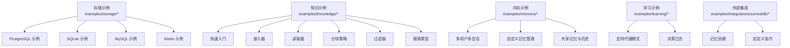
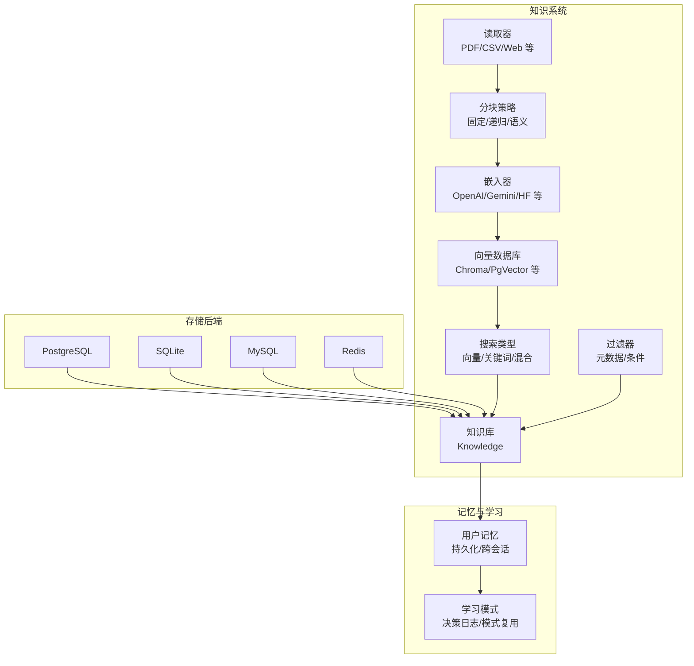
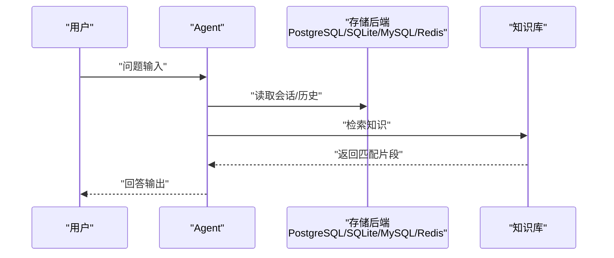
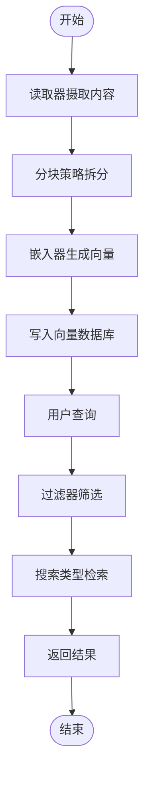
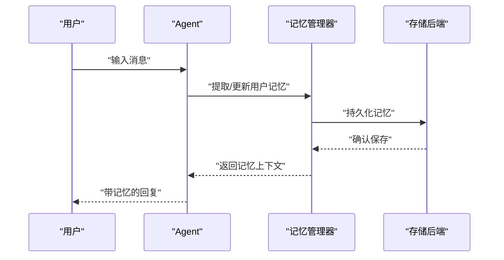
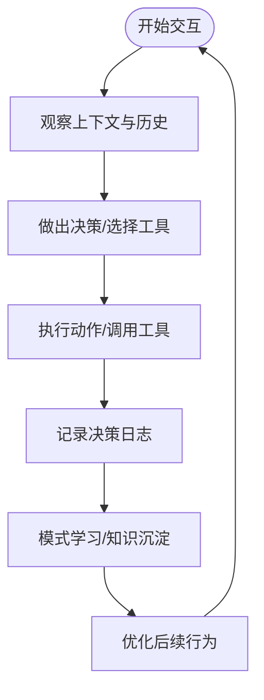
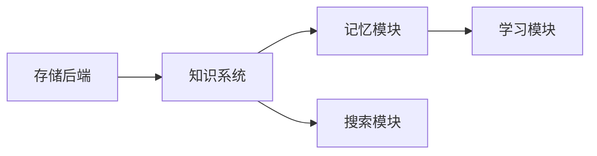

# 上下文示例

<cite>
**本文引用的文件**
- [examples/storage/postgres/overview.mdx](file://examples/storage/postgres/overview.mdx)
- [examples/storage/postgres/postgres-for-agent.mdx](file://examples/storage/postgres/postgres-for-agent.mdx)
- [examples/storage/sqlite/overview.mdx](file://examples/storage/sqlite/overview.mdx)
- [examples/storage/sqlite/sqlite-for-agent.mdx](file://examples/storage/sqlite/sqlite-for-agent.mdx)
- [examples/storage/mysql/overview.mdx](file://examples/storage/mysql/overview.mdx)
- [examples/storage/mysql/mysql-for-agent.mdx](file://examples/storage/mysql/mysql-for-agent.mdx)
- [examples/storage/redis/overview.mdx](file://examples/storage/redis/overview.mdx)
- [examples/storage/redis/redis-for-agent.mdx](file://examples/storage/redis/redis-for-agent.mdx)
- [examples/knowledge/quickstart.mdx](file://examples/knowledge/quickstart.mdx)
- [examples/knowledge/embedders/overview.mdx](file://examples/knowledge/embedders/overview.mdx)
- [examples/knowledge/readers/overview.mdx](file://examples/knowledge/readers/overview.mdx)
- [examples/knowledge/chunking/overview.mdx](file://examples/knowledge/chunking/overview.mdx)
- [examples/knowledge/filters/overview.mdx](file://examples/knowledge/filters/overview.mdx)
- [examples/knowledge/search-type/overview.mdx](file://examples/knowledge/search-type/overview.mdx)
- [examples/memory/overview.mdx](file://examples/memory/overview.mdx)
- [examples/memory/multi-user-multi-session-chat.mdx](file://examples/memory/multi-user-multi-session-chat.mdx)
- [examples/integrations/surrealdb/memory-creation.mdx](file://examples/integrations/surrealdb/memory-creation.mdx)
- [examples/integrations/surrealdb/custom-memory-instructions.mdx](file://examples/integrations/surrealdb/custom-memory-instructions.mdx)
- [examples/memory/memory-manager/custom-memory-instructions.mdx](file://examples/memory/memory-manager/custom-memory-instructions.mdx)
- [examples/learning/patterns/support-agent.mdx](file://examples/learning/patterns/support-agent.mdx)
- [examples/learning/decision-logs/basic-decision-log.mdx](file://examples/learning/decision-logs/basic-decision-log.mdx)
- [reference/storage/redis.mdx](file://reference/storage/redis.mdx)
- [knowledge/terminology.mdx](file://knowledge/terminology.mdx)
- [reference/clients/agentos-client.mdx](file://reference/clients/agentos-client.mdx)
</cite>

## 目录
1. [简介](#简介)
2. [项目结构](#项目结构)
3. [核心组件](#核心组件)
4. [架构总览](#架构总览)
5. [详细组件分析](#详细组件分析)
6. [依赖关系分析](#依赖关系分析)
7. [性能考虑](#性能考虑)
8. [故障排查指南](#故障排查指南)
9. [结论](#结论)
10. [附录](#附录)

## 简介
本章节聚焦“上下文示例”，系统化地文档化以下主题：
- 存储示例：覆盖 PostgreSQL、MongoDB、SQLite、MySQL、Redis 等数据库后端的配置与使用路径，并给出可直接参考的示例文件位置。
- 知识示例：涵盖向量数据库、嵌入器、读取器、分块策略、过滤器与搜索类型的实战用法与最佳实践。
- 内存示例：展示用户记忆持久化、跨运行与会话的记忆管理机制及多用户并发场景。
- 学习示例：演示代理如何从交互中学习、记录决策并进行模式化改进。

本节不直接粘贴代码，所有实现细节均以“示例文件路径”形式呈现，便于读者在仓库中定位具体实现。

## 项目结构
围绕“上下文示例”的相关目录与文件组织如下：
- 存储示例：examples/storage 下按数据库类型划分（postgres、sqlite、mysql、redis），每个类型包含概览与具体示例。
- 知识示例：examples/knowledge 下包含快速入门、嵌入器、读取器、分块、过滤器、搜索类型等子目录。
- 内存示例：examples/memory 提供多用户多会话、共享记忆、自定义记忆管理等示例；examples/integrations/surrealdb 展示与外部数据库的集成。
- 学习示例：examples/learning 下包含支持代理模式与决策日志等示例。

**章节来源**
- [examples/storage/postgres/overview.mdx:1-12](file://examples/storage/postgres/overview.mdx#L1-L12)
- [examples/storage/sqlite/overview.mdx:1-12](file://examples/storage/sqlite/overview.mdx#L1-L12)
- [examples/storage/mysql/overview.mdx:1-11](file://examples/storage/mysql/overview.mdx#L1-L11)
- [examples/storage/redis/overview.mdx:1-11](file://examples/storage/redis/overview.mdx#L1-L11)
- [examples/knowledge/quickstart.mdx:1-50](file://examples/knowledge/quickstart.mdx#L1-L50)
- [examples/knowledge/embedders/overview.mdx:1-27](file://examples/knowledge/embedders/overview.mdx#L1-L27)
- [examples/knowledge/readers/overview.mdx:1-33](file://examples/knowledge/readers/overview.mdx#L1-L33)
- [examples/knowledge/chunking/overview.mdx:1-20](file://examples/knowledge/chunking/overview.mdx#L1-L20)
- [examples/knowledge/filters/overview.mdx:1-18](file://examples/knowledge/filters/overview.mdx#L1-L18)
- [examples/knowledge/search-type/overview.mdx:1-11](file://examples/knowledge/search-type/overview.mdx#L1-L11)
- [examples/memory/overview.mdx:1-17](file://examples/memory/overview.mdx#L1-L17)
- [examples/integrations/surrealdb/memory-creation.mdx:37-75](file://examples/integrations/surrealdb/memory-creation.mdx#L37-L75)
- [examples/integrations/surrealdb/custom-memory-instructions.mdx:46-108](file://examples/integrations/surrealdb/custom-memory-instructions.mdx#L46-L108)
- [examples/memory/multi-user-multi-session-chat.mdx:91-124](file://examples/memory/multi-user-multi-session-chat.mdx#L91-L124)
- [examples/memory/memory-manager/custom-memory-instructions.mdx:40-64](file://examples/memory/memory-manager/custom-memory-instructions.mdx#L40-L64)
- [examples/learning/patterns/support-agent.mdx:128-145](file://examples/learning/patterns/support-agent.mdx#L128-L145)
- [examples/learning/decision-logs/basic-decision-log.mdx:71-89](file://examples/learning/decision-logs/basic-decision-log.mdx#L71-L89)

## 核心组件
- 存储后端
  - PostgreSQL：通过 PostgresDb 集成，适用于需要强一致与复杂查询的场景。
  - SQLite：轻量嵌入式存储，适合本地开发与小规模部署。
  - MySQL：通用关系型数据库，适合团队与工作流会话存储。
  - Redis：高性能键值存储，适合会话缓存与高并发访问。
- 知识体系
  - 向量数据库：Chroma、PgVector 等，支撑语义检索。
  - 嵌入器：OpenAI、Gemini、HuggingFace 等，生成向量表示。
  - 读取器：PDF、CSV、网页、ArXiv 等，统一内容摄取。
  - 分块策略：固定大小、递归、语义、文档级等，提升检索质量。
  - 过滤器：基于元数据与条件的筛选，提高检索精度。
  - 搜索类型：向量、关键词、混合搜索，满足不同召回需求。
- 内存与学习
  - 用户记忆持久化：跨运行与会话保持个性化偏好与上下文。
  - 多用户并发：支持多用户、多会话并行处理与状态隔离。
  - 学习模式：记录决策日志，形成可复用的知识与模式。

**章节来源**
- [examples/storage/postgres/postgres-for-agent.mdx:19-29](file://examples/storage/postgres/postgres-for-agent.mdx#L19-L29)
- [examples/storage/sqlite/sqlite-for-agent.mdx:20-30](file://examples/storage/sqlite/sqlite-for-agent.mdx#L20-L30)
- [examples/storage/mysql/mysql-for-agent.mdx:18-27](file://examples/storage/mysql/mysql-for-agent.mdx#L18-L27)
- [examples/storage/redis/redis-for-agent.mdx:30-39](file://examples/storage/redis/redis-for-agent.mdx#L30-L39)
- [examples/knowledge/quickstart.mdx:13-35](file://examples/knowledge/quickstart.mdx#L13-L35)
- [examples/knowledge/embedders/overview.mdx:1-27](file://examples/knowledge/embedders/overview.mdx#L1-L27)
- [examples/knowledge/readers/overview.mdx:1-33](file://examples/knowledge/readers/overview.mdx#L1-L33)
- [examples/knowledge/chunking/overview.mdx:1-20](file://examples/knowledge/chunking/overview.mdx#L1-L20)
- [examples/knowledge/filters/overview.mdx:1-18](file://examples/knowledge/filters/overview.mdx#L1-L18)
- [examples/knowledge/search-type/overview.mdx:1-11](file://examples/knowledge/search-type/overview.mdx#L1-L11)
- [examples/memory/multi-user-multi-session-chat.mdx:91-124](file://examples/memory/multi-user-multi-session-chat.mdx#L91-L124)
- [examples/integrations/surrealdb/memory-creation.mdx:42-55](file://examples/integrations/surrealdb/memory-creation.mdx#L42-L55)
- [examples/integrations/surrealdb/custom-memory-instructions.mdx:57-104](file://examples/integrations/surrealdb/custom-memory-instructions.mdx#L57-L104)
- [examples/learning/patterns/support-agent.mdx:128-145](file://examples/learning/patterns/support-agent.mdx#L128-L145)
- [examples/learning/decision-logs/basic-decision-log.mdx:71-89](file://examples/learning/decision-logs/basic-decision-log.mdx#L71-L89)

## 架构总览
下图展示了“上下文示例”的整体架构：从存储后端到知识构建，再到记忆与学习模块的协同工作。

**图表来源**
- [examples/storage/postgres/postgres-for-agent.mdx:19-29](file://examples/storage/postgres/postgres-for-agent.mdx#L19-L29)
- [examples/storage/sqlite/sqlite-for-agent.mdx:20-30](file://examples/storage/sqlite/sqlite-for-agent.mdx#L20-L30)
- [examples/storage/mysql/mysql-for-agent.mdx:18-27](file://examples/storage/mysql/mysql-for-agent.mdx#L18-L27)
- [examples/storage/redis/redis-for-agent.mdx:30-39](file://examples/storage/redis/redis-for-agent.mdx#L30-L39)
- [examples/knowledge/quickstart.mdx:13-35](file://examples/knowledge/quickstart.mdx#L13-L35)
- [examples/knowledge/embedders/overview.mdx:1-27](file://examples/knowledge/embedders/overview.mdx#L1-L27)
- [examples/knowledge/readers/overview.mdx:1-33](file://examples/knowledge/readers/overview.mdx#L1-L33)
- [examples/knowledge/chunking/overview.mdx:1-20](file://examples/knowledge/chunking/overview.mdx#L1-L20)
- [examples/knowledge/filters/overview.mdx:1-18](file://examples/knowledge/filters/overview.mdx#L1-L18)
- [examples/knowledge/search-type/overview.mdx:1-11](file://examples/knowledge/search-type/overview.mdx#L1-L11)
- [examples/memory/multi-user-multi-session-chat.mdx:91-124](file://examples/memory/multi-user-multi-session-chat.mdx#L91-L124)
- [examples/integrations/surrealdb/memory-creation.mdx:42-55](file://examples/integrations/surrealdb/memory-creation.mdx#L42-L55)
- [examples/integrations/surrealdb/custom-memory-instructions.mdx:57-104](file://examples/integrations/surrealdb/custom-memory-instructions.mdx#L57-L104)
- [examples/learning/patterns/support-agent.mdx:128-145](file://examples/learning/patterns/support-agent.mdx#L128-L145)
- [examples/learning/decision-logs/basic-decision-log.mdx:71-89](file://examples/learning/decision-logs/basic-decision-log.mdx#L71-L89)

## 详细组件分析

### 存储示例：PostgreSQL、SQLite、MySQL、Redis
- PostgreSQL
  - 使用 PostgresDb 作为 Agent 的会话存储后端，适合需要关系型能力与事务保证的场景。
  - 示例文件：[postgres-for-agent.mdx:1-51](file://examples/storage/postgres/postgres-for-agent.mdx#L1-L51)
- SQLite
  - 使用 SqliteDb 作为本地嵌入式存储，适合开发与小规模部署。
  - 示例文件：[sqlite-for-agent.mdx:1-54](file://examples/storage/sqlite/sqlite-for-agent.mdx#L1-L54)
- MySQL
  - 使用 MySQLDb 作为会话存储后端，适合团队与工作流场景。
  - 示例文件：[mysql-for-agent.mdx:1-49](file://examples/storage/mysql/mysql-for-agent.mdx#L1-L49)
- Redis
  - 使用 RedisDb 作为会话缓存与高并发存储后端，适合实时性要求高的场景。
  - 参考：[redis.mdx:1-8](file://reference/storage/redis.mdx#L1-L8)
  - 示例文件：[redis-for-agent.mdx:1-66](file://examples/storage/redis/redis-for-agent.mdx#L1-L66)

**图表来源**
- [examples/storage/postgres/postgres-for-agent.mdx:19-29](file://examples/storage/postgres/postgres-for-agent.mdx#L19-L29)
- [examples/storage/sqlite/sqlite-for-agent.mdx:20-30](file://examples/storage/sqlite/sqlite-for-agent.mdx#L20-L30)
- [examples/storage/mysql/mysql-for-agent.mdx:18-27](file://examples/storage/mysql/mysql-for-agent.mdx#L18-L27)
- [examples/storage/redis/redis-for-agent.mdx:30-39](file://examples/storage/redis/redis-for-agent.mdx#L30-L39)
- [examples/knowledge/quickstart.mdx:13-35](file://examples/knowledge/quickstart.mdx#L13-L35)

**章节来源**
- [examples/storage/postgres/overview.mdx:1-12](file://examples/storage/postgres/overview.mdx#L1-L12)
- [examples/storage/postgres/postgres-for-agent.mdx:19-29](file://examples/storage/postgres/postgres-for-agent.mdx#L19-L29)
- [examples/storage/sqlite/overview.mdx:1-12](file://examples/storage/sqlite/overview.mdx#L1-L12)
- [examples/storage/sqlite/sqlite-for-agent.mdx:20-30](file://examples/storage/sqlite/sqlite-for-agent.mdx#L20-L30)
- [examples/storage/mysql/overview.mdx:1-11](file://examples/storage/mysql/overview.mdx#L1-L11)
- [examples/storage/mysql/mysql-for-agent.mdx:18-27](file://examples/storage/mysql/mysql-for-agent.mdx#L18-L27)
- [examples/storage/redis/overview.mdx:1-11](file://examples/storage/redis/overview.mdx#L1-L11)
- [examples/storage/redis/redis-for-agent.mdx:30-39](file://examples/storage/redis/redis-for-agent.mdx#L30-L39)
- [reference/storage/redis.mdx:1-8](file://reference/storage/redis.mdx#L1-L8)

### 知识示例：向量数据库、嵌入器、读取器、分块策略、过滤器与搜索
- 快速入门
  - 使用 ChromaDb 作为向量数据库，结合嵌入器与检索策略，快速完成知识入库与检索。
  - 示例文件：[quickstart.mdx:1-50](file://examples/knowledge/quickstart.mdx#L1-L50)
- 嵌入器
  - 支持 OpenAI、Gemini、HuggingFace、SentenceTransformer、vLLM 等多种嵌入器。
  - 示例文件：[embedders/overview.mdx:1-27](file://examples/knowledge/embedders/overview.mdx#L1-L27)
- 读取器
  - 支持 PDF、CSV、Markdown、网页、ArXiv、Tavily、Firecrawl 等多源读取。
  - 示例文件：[readers/overview.mdx:1-33](file://examples/knowledge/readers/overview.mdx#L1-L33)
- 分块策略
  - 固定大小、递归、语义、文档级、代码等分块方式，提升检索质量。
  - 示例文件：[chunking/overview.mdx:1-20](file://examples/knowledge/chunking/overview.mdx#L1-L20)
- 过滤器
  - 基于元数据与条件的筛选，支持异步与代理式过滤。
  - 示例文件：[filters/overview.mdx:1-18](file://examples/knowledge/filters/overview.mdx#L1-L18)
- 搜索类型
  - 向量、关键词、混合搜索，满足不同召回需求。
  - 示例文件：[search-type/overview.mdx:1-11](file://examples/knowledge/search-type/overview.mdx#L1-L11)

**图表来源**
- [examples/knowledge/quickstart.mdx:13-35](file://examples/knowledge/quickstart.mdx#L13-L35)
- [examples/knowledge/embedders/overview.mdx:1-27](file://examples/knowledge/embedders/overview.mdx#L1-L27)
- [examples/knowledge/readers/overview.mdx:1-33](file://examples/knowledge/readers/overview.mdx#L1-L33)
- [examples/knowledge/chunking/overview.mdx:1-20](file://examples/knowledge/chunking/overview.mdx#L1-L20)
- [examples/knowledge/filters/overview.mdx:1-18](file://examples/knowledge/filters/overview.mdx#L1-L18)
- [examples/knowledge/search-type/overview.mdx:1-11](file://examples/knowledge/search-type/overview.mdx#L1-L11)

**章节来源**
- [examples/knowledge/quickstart.mdx:13-35](file://examples/knowledge/quickstart.mdx#L13-L35)
- [examples/knowledge/embedders/overview.mdx:1-27](file://examples/knowledge/embedders/overview.mdx#L1-L27)
- [examples/knowledge/readers/overview.mdx:1-33](file://examples/knowledge/readers/overview.mdx#L1-L33)
- [examples/knowledge/chunking/overview.mdx:1-20](file://examples/knowledge/chunking/overview.mdx#L1-L20)
- [examples/knowledge/filters/overview.mdx:1-18](file://examples/knowledge/filters/overview.mdx#L1-L18)
- [examples/knowledge/search-type/overview.mdx:1-11](file://examples/knowledge/search-type/overview.mdx#L1-L11)
- [knowledge/terminology.mdx:55-99](file://knowledge/terminology.mdx#L55-L99)

### 内存示例：用户记忆持久化与跨会话管理
- 多用户多会话
  - 支持并发多用户对话，确保记忆与会话隔离与持久化。
  - 示例文件：[multi-user-multi-session-chat.mdx:91-124](file://examples/memory/multi-user-multi-session-chat.mdx#L91-L124)
- 记忆创建与管理
  - 通过自定义记忆管理器或直接调用接口创建与获取用户记忆。
  - 示例文件：[memory-creation.mdx:42-55](file://examples/integrations/surrealdb/memory-creation.mdx#L42-L55)
  - 示例文件：[custom-memory-instructions.mdx:57-104](file://examples/integrations/surrealdb/custom-memory-instructions.mdx#L57-L104)
  - 示例文件：[custom-memory-instructions.mdx:45-63](file://examples/memory/memory-manager/custom-memory-instructions.mdx#L45-L63)
- 客户端操作
  - 提供用户记忆的增删改查与分页列表等接口，便于上层应用集成。
  - 参考：[agentos-client.mdx:361-427](file://reference/clients/agentos-client.mdx#L361-L427)

**图表来源**
- [examples/integrations/surrealdb/memory-creation.mdx:42-55](file://examples/integrations/surrealdb/memory-creation.mdx#L42-L55)
- [examples/integrations/surrealdb/custom-memory-instructions.mdx:57-104](file://examples/integrations/surrealdb/custom-memory-instructions.mdx#L57-L104)
- [examples/memory/memory-manager/custom-memory-instructions.mdx:45-63](file://examples/memory/memory-manager/custom-memory-instructions.mdx#L45-L63)
- [reference/clients/agentos-client.mdx:361-427](file://reference/clients/agentos-client.mdx#L361-L427)

**章节来源**
- [examples/memory/overview.mdx:1-17](file://examples/memory/overview.mdx#L1-L17)
- [examples/memory/multi-user-multi-session-chat.mdx:91-124](file://examples/memory/multi-user-multi-session-chat.mdx#L91-L124)
- [examples/integrations/surrealdb/memory-creation.mdx:42-55](file://examples/integrations/surrealdb/memory-creation.mdx#L42-L55)
- [examples/integrations/surrealdb/custom-memory-instructions.mdx:57-104](file://examples/integrations/surrealdb/custom-memory-instructions.mdx#L57-L104)
- [examples/memory/memory-manager/custom-memory-instructions.mdx:45-63](file://examples/memory/memory-manager/custom-memory-instructions.mdx#L45-L63)
- [reference/clients/agentos-client.mdx:361-427](file://reference/clients/agentos-client.mdx#L361-L427)

### 学习示例：代理从交互中学习与改进
- 支持代理模式
  - 通过模式化学习，使代理能够复用先前解决方案，提升一致性与效率。
  - 示例文件：[support-agent.mdx:128-145](file://examples/learning/patterns/support-agent.mdx#L128-L145)
- 决策日志
  - 记录关键决策过程，便于回溯、评估与优化。
  - 示例文件：[basic-decision-log.mdx:71-89](file://examples/learning/decision-logs/basic-decision-log.mdx#L71-L89)

**图表来源**
- [examples/learning/patterns/support-agent.mdx:128-145](file://examples/learning/patterns/support-agent.mdx#L128-L145)
- [examples/learning/decision-logs/basic-decision-log.mdx:71-89](file://examples/learning/decision-logs/basic-decision-log.mdx#L71-L89)

**章节来源**
- [examples/learning/patterns/support-agent.mdx:128-145](file://examples/learning/patterns/support-agent.mdx#L128-L145)
- [examples/learning/decision-logs/basic-decision-log.mdx:71-89](file://examples/learning/decision-logs/basic-decision-log.mdx#L71-L89)

## 依赖关系分析
- 组件耦合
  - 存储后端与知识系统解耦，知识系统通过统一接口对接不同向量数据库与嵌入器。
  - 内存模块与存储后端解耦，通过客户端接口实现跨组件调用。
  - 学习模块独立于存储与知识，通过日志与模式抽象实现复用。
- 外部依赖
  - 向量数据库：Chroma、PgVector 等。
  - 嵌入器：OpenAI、Gemini、HuggingFace、SentenceTransformer、vLLM 等。
  - 读取器：PDF、CSV、Markdown、ArXiv、Tavily、Firecrawl 等。
  - 存储：PostgreSQL、SQLite、MySQL、Redis 等。

**图表来源**
- [examples/knowledge/quickstart.mdx:13-35](file://examples/knowledge/quickstart.mdx#L13-L35)
- [examples/storage/postgres/postgres-for-agent.mdx:19-29](file://examples/storage/postgres/postgres-for-agent.mdx#L19-L29)
- [examples/storage/redis/redis-for-agent.mdx:30-39](file://examples/storage/redis/redis-for-agent.mdx#L30-L39)
- [examples/integrations/surrealdb/memory-creation.mdx:42-55](file://examples/integrations/surrealdb/memory-creation.mdx#L42-L55)
- [examples/learning/patterns/support-agent.mdx:128-145](file://examples/learning/patterns/support-agent.mdx#L128-L145)

**章节来源**
- [examples/knowledge/quickstart.mdx:13-35](file://examples/knowledge/quickstart.mdx#L13-L35)
- [examples/knowledge/embedders/overview.mdx:1-27](file://examples/knowledge/embedders/overview.mdx#L1-L27)
- [examples/knowledge/readers/overview.mdx:1-33](file://examples/knowledge/readers/overview.mdx#L1-L33)
- [examples/storage/postgres/postgres-for-agent.mdx:19-29](file://examples/storage/postgres/postgres-for-agent.mdx#L19-L29)
- [examples/storage/redis/redis-for-agent.mdx:30-39](file://examples/storage/redis/redis-for-agent.mdx#L30-L39)
- [examples/integrations/surrealdb/memory-creation.mdx:42-55](file://examples/integrations/surrealdb/memory-creation.mdx#L42-L55)
- [examples/learning/patterns/support-agent.mdx:128-145](file://examples/learning/patterns/support-agent.mdx#L128-L145)

## 性能考虑
- 存储后端
  - PostgreSQL/MySQL：适合复杂查询与事务一致性，注意索引与连接池配置。
  - SQLite：轻量但并发受限，适合本地开发与小规模部署。
  - Redis：高吞吐低延迟，适合会话缓存与热点数据。
- 知识系统
  - 向量数据库：合理设置维度、索引与批量插入，避免频繁重建索引。
  - 嵌入器：批量化请求与缓存重复向量，减少往返开销。
  - 读取器：对大文件启用异步加载与流式处理。
  - 分块策略：根据内容特征选择合适分块，平衡召回与性能。
  - 过滤器：尽量在入库阶段完成元数据规范化，检索时减少计算。
  - 搜索类型：混合搜索兼顾召回与精度，向量搜索优先匹配语义。
- 内存与学习
  - 记忆持久化：采用增量更新与版本控制，避免全量重写。
  - 多用户并发：使用会话隔离与锁策略，防止竞态。
  - 学习模式：定期归档决策日志，清理过期数据。

[本节为通用指导，无需特定文件来源]

## 故障排查指南
- 存储连接失败
  - 检查数据库连接字符串与凭据，确认网络可达与端口开放。
  - 参考示例中的初始化方式与环境变量配置。
- 向量数据库异常
  - 确认集合/表存在且权限正确；检查嵌入维度与索引配置。
  - 对大批量导入使用分批写入与错误重试。
- 读取器报错
  - 检查文件路径、URL 有效性与权限；对加密文件提供密码参数。
- 过滤器无效
  - 确认元数据键名与类型一致；在入库阶段进行预处理。
- 决策日志缺失
  - 确认学习模块已启用并正确记录；检查日志存储后端可用性。

**章节来源**
- [examples/storage/postgres/postgres-for-agent.mdx:19-29](file://examples/storage/postgres/postgres-for-agent.mdx#L19-L29)
- [examples/storage/redis/redis-for-agent.mdx:30-39](file://examples/storage/redis/redis-for-agent.mdx#L30-L39)
- [examples/knowledge/quickstart.mdx:13-35](file://examples/knowledge/quickstart.mdx#L13-L35)
- [examples/learning/decision-logs/basic-decision-log.mdx:71-89](file://examples/learning/decision-logs/basic-decision-log.mdx#L71-L89)

## 结论
“上下文示例”提供了从存储后端到知识系统、再到记忆与学习的完整链路实践。通过示例文件路径，读者可以快速定位实现细节并按需扩展。建议在生产环境中结合性能与可靠性需求，选择合适的存储与知识组件，并建立完善的监控与运维流程。

[本节为总结性内容，无需特定文件来源]

## 附录
- 快速开始
  - 使用 ChromaDb 与嵌入器快速构建知识库与检索流程。
  - 示例文件：[quickstart.mdx:1-50](file://examples/knowledge/quickstart.mdx#L1-L50)
- 常用术语
  - 包含分块策略与向量数据库等术语说明，便于理解知识系统组件关系。
  - 参考：[terminology.mdx:55-99](file://knowledge/terminology.mdx#L55-L99)

**章节来源**
- [examples/knowledge/quickstart.mdx:1-50](file://examples/knowledge/quickstart.mdx#L1-L50)
- [knowledge/terminology.mdx:55-99](file://knowledge/terminology.mdx#L55-L99)