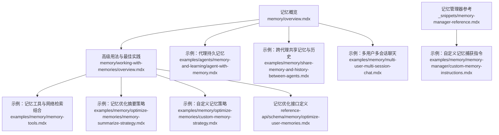
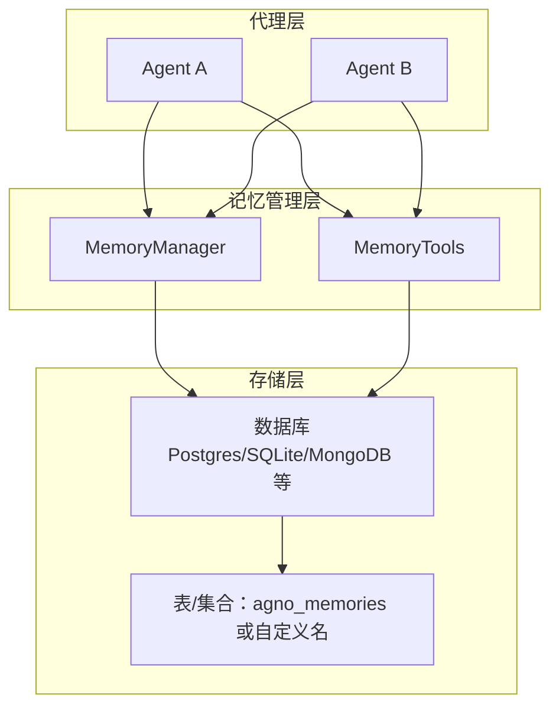
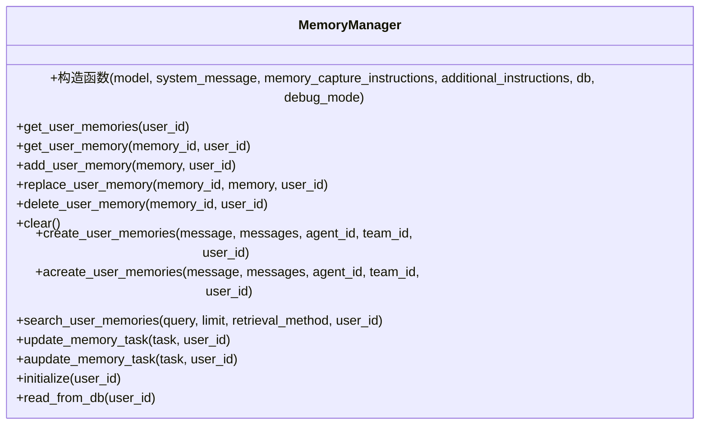
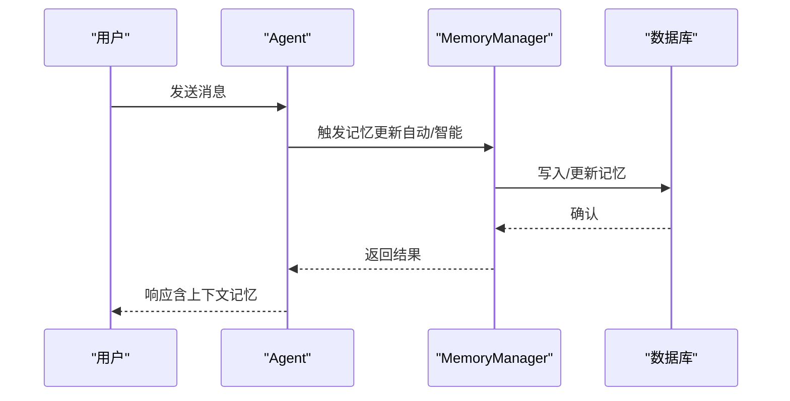
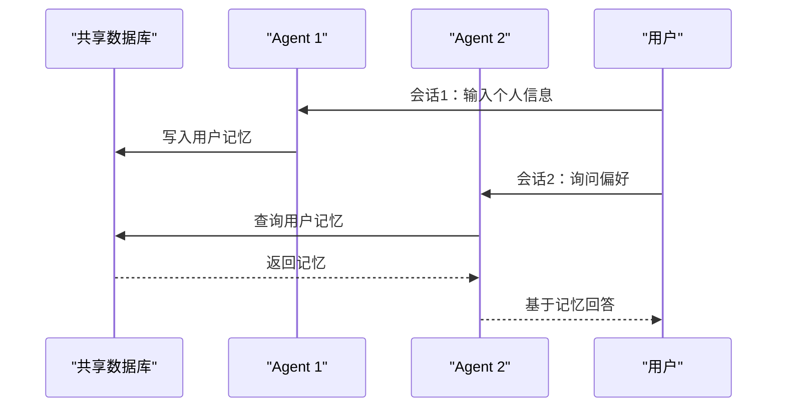
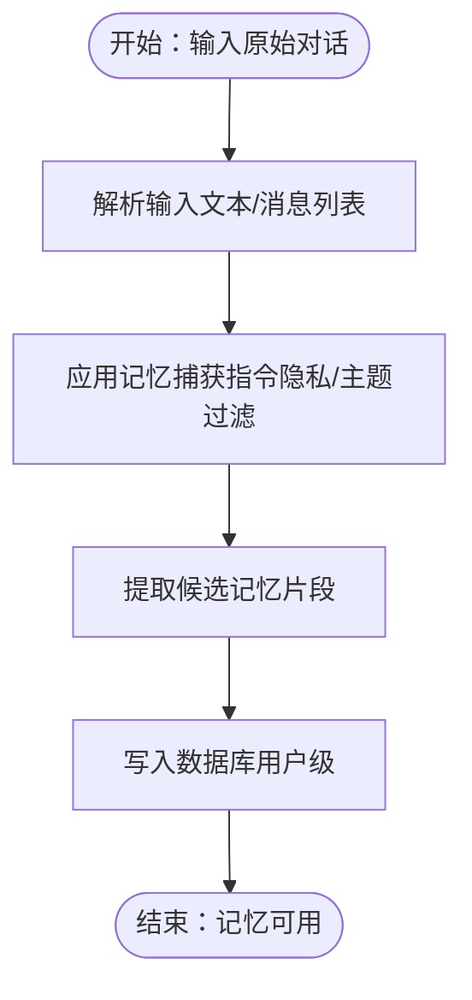
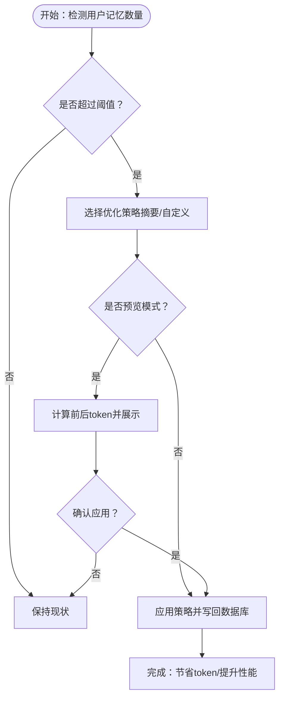
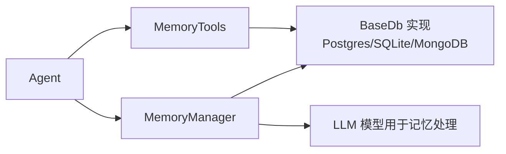

# 内存示例

<cite>
**本文引用的文件**   
- [memory.mdx](file://reference/memory/memory.mdx)
- [_snippets/memory-manager-reference.mdx](file://_snippets/memory-manager-reference.mdx)
- [memory-manager/custom-memory-instructions.mdx](file://examples/memory/memory-manager/custom-memory-instructions.mdx)
- [agent-with-memory.mdx](file://examples/agents/memory-and-learning/agent-with-memory.mdx)
- [share-memory-and-history-between-agents.mdx](file://examples/memory/share-memory-and-history-between-agents.mdx)
- [multi-user-multi-session-chat.mdx](file://examples/memory/multi-user-multi-session-chat.mdx)
- [memory/overview.mdx](file://memory/overview.mdx)
- [working-with-memories/overview.mdx](file://memory/working-with-memories/overview.mdx)
- [best-practices.mdx](file://memory/best-practices.mdx)
- [memory-tools.mdx](file://examples/memory/memory-tools.mdx)
- [memory-optimization.mdx](file://memory/working-with-memories/memory-optimization.mdx)
- [optimize-memories/memory-summarize-strategy.mdx](file://examples/memory/optimize-memories/memory-summarize-strategy.mdx)
- [optimize-memories/custom-memory-strategy.mdx](file://examples/memory/optimize-memories/custom-memory-strategy.mdx)
- [optimize-user-memories.mdx](file://reference-api/schema/memory/optimize-user-memories.mdx)
</cite>

## 目录
1. [简介](#简介)
2. [项目结构](#项目结构)
3. [核心组件](#核心组件)
4. [架构总览](#架构总览)
5. [详细组件分析](#详细组件分析)
6. [依赖关系分析](#依赖关系分析)
7. [性能考量](#性能考量)
8. [故障排除指南](#故障排除指南)
9. [结论](#结论)
10. [附录](#附录)

## 简介
本章节聚焦“内存示例”，系统性讲解代理记忆系统的实现与应用，涵盖用户记忆、实体记忆、会话上下文记忆与学习记忆的配置与使用；详解内存管理器的工作原理（创建、搜索、更新、删除）、自定义记忆指令、跨代理与跨会话共享记忆、记忆工具与优化策略，并提供可直接定位到示例路径的参考，帮助读者快速落地个性化体验与团队知识共享。

## 项目结构
围绕“内存示例”的内容主要分布在以下区域：
- 参考与概述：记忆管理器参考、记忆概览、高级用法与最佳实践
- 示例：自动/手动记忆、跨代理共享、多用户多会话、记忆工具、记忆优化
- API：记忆优化接口定义

**图示来源**
- [memory/overview.mdx:1-202](file://memory/overview.mdx#L1-L202)
- [memory/working-with-memories/overview.mdx:1-166](file://memory/working-with-memories/overview.mdx#L1-L166)
- [examples/agents/memory-and-learning/agent-with-memory.mdx:1-89](file://examples/agents/memory-and-learning/agent-with-memory.mdx#L1-L89)
- [examples/memory/share-memory-and-history-between-agents.mdx:1-86](file://examples/memory/share-memory-and-history-between-agents.mdx#L1-L86)
- [examples/memory/multi-user-multi-session-chat.mdx:1-125](file://examples/memory/multi-user-multi-session-chat.mdx#L1-L125)
- [examples/memory/memory-tools.mdx:1-82](file://examples/memory/memory-tools.mdx#L1-L82)
- [examples/memory/optimize-memories/memory-summarize-strategy.mdx:1-125](file://examples/memory/optimize-memories/memory-summarize-strategy.mdx#L1-L125)
- [examples/memory/optimize-memories/custom-memory-strategy.mdx:1-166](file://examples/memory/optimize-memories/custom-memory-strategy.mdx#L1-L166)
- [reference-api/schema/memory/optimize-user-memories.mdx:1-3](file://reference-api/schema/memory/optimize-user-memories.mdx#L1-L3)
- [_snippets/memory-manager-reference.mdx:1-58](file://_snippets/memory-manager-reference.mdx#L1-L58)
- [examples/memory/memory-manager/custom-memory-instructions.mdx:1-111](file://examples/memory/memory-manager/custom-memory-instructions.mdx#L1-L111)

**章节来源**
- [memory/overview.mdx:1-202](file://memory/overview.mdx#L1-L202)
- [memory/working-with-memories/overview.mdx:1-166](file://memory/working-with-memories/overview.mdx#L1-L166)

## 核心组件
- 记忆管理器（MemoryManager）
  - 职责：创建、检索、更新、删除用户记忆；支持按最后N条、最早N条、语义相似（agentic）检索；支持任务驱动的记忆更新；支持初始化与从数据库读取
  - 关键方法：get_user_memories、get_user_memory、add_user_memory、replace_user_memory、delete_user_memory、clear、create_user_memories/acreate_user_memories、search_user_memories、update_memory_task/aupdate_memory_task、initialize、read_from_db
  - 检索方式：last_n、first_n、agentic
- 代理与记忆集成
  - 自动记忆：update_memory_on_run=True，对话结束后自动抽取并存储记忆
  - 智能记忆：enable_agentic_memory=True，由代理在对话中自主决定何时创建/更新/删除记忆
  - 手动记忆工具：MemoryTools，显式控制记忆的增删改查
- 存储层
  - 支持多种数据库（Postgres、SQLite、MongoDB等），默认表名为 agno_memories；可通过参数指定自定义表名
- 记忆优化
  - 针对长尾记忆进行合并/摘要，降低上下文开销与成本
  - 提供内置策略（如摘要策略）与自定义策略扩展点

**章节来源**
- [_snippets/memory-manager-reference.mdx:1-58](file://_snippets/memory-manager-reference.mdx#L1-L58)
- [memory/overview.mdx:38-92](file://memory/overview.mdx#L38-L92)
- [memory/working-with-memories/overview.mdx:67-94](file://memory/working-with-memories/overview.mdx#L67-L94)

## 架构总览
下图展示了“代理-记忆管理器-数据库”的交互关系，以及跨代理共享记忆的关键点（相同数据库、相同 user_id、必要时共享 session_id）。

**图示来源**
- [memory/overview.mdx:94-122](file://memory/overview.mdx#L94-L122)
- [memory/working-with-memories/overview.mdx:136-158](file://memory/working-with-memories/overview.mdx#L136-L158)
- [_snippets/memory-manager-reference.mdx:16-58](file://_snippets/memory-manager-reference.mdx#L16-L58)

## 详细组件分析

### 组件A：记忆管理器（MemoryManager）
- 设计要点
  - 以模型为中心的记忆生成与过滤：可通过 model、memory_capture_instructions、additional_instructions 控制记忆提取质量与隐私规则
  - 多种检索策略：last_n（最近）、first_n（最早）、agentic（语义相似）
  - 异步与同步接口并存，便于在异步场景中使用
- 方法族
  - 用户记忆：get_user_memories/get_user_memory/add_user_memory/replace_user_memory/delete_user_memory/clear
  - 创建与搜索：create_user_memories/acreate_user_memories/search_user_memories
  - 任务驱动更新：update_memory_task/aupdate_memory_task
  - 初始化与读取：initialize/read_from_db

**图示来源**
- [_snippets/memory-manager-reference.mdx:16-58](file://_snippets/memory-manager-reference.mdx#L16-L58)

**章节来源**
- [_snippets/memory-manager-reference.mdx:1-58](file://_snippets/memory-manager-reference.mdx#L1-L58)

### 组件B：代理与记忆（自动/智能/手动）
- 自动记忆（update_memory_on_run=True）
  - 在每次对话结束时自动抽取并写入记忆，适合大多数场景
  - 示例：代理持久记忆
- 智能记忆（enable_agentic_memory=True）
  - 代理具备工具，可在对话中自主决策何时创建/更新/删除记忆
  - 注意：每次记忆操作可能触发额外 LLM 调用，需谨慎使用廉价模型或限制工具调用次数
- 手动记忆工具（MemoryTools）
  - 显式控制记忆的增删改查，适用于需要精细控制或分析场景

**图示来源**
- [memory/overview.mdx:38-92](file://memory/overview.mdx#L38-L92)
- [memory/working-with-memories/overview.mdx:90-134](file://memory/working-with-memories/overview.mdx#L90-L134)

**章节来源**
- [memory/overview.mdx:18-92](file://memory/overview.mdx#L18-L92)
- [memory/working-with-memories/overview.mdx:90-134](file://memory/working-with-memories/overview.mdx#L90-L134)

### 组件C：跨代理与跨会话共享记忆
- 共享机制
  - 使用同一数据库实例与相同的 user_id 即可实现跨代理共享
  - 若需跨会话共享上下文，可同时传入相同的 session_id
- 示例覆盖
  - 两个代理共享历史与记忆
  - 多用户、多会话下用户记忆跨会话保留

**图示来源**
- [share-memory-and-history-between-agents.mdx:44-85](file://examples/memory/share-memory-and-history-between-agents.mdx#L44-L85)
- [multi-user-multi-session-chat.mdx:48-124](file://examples/memory/multi-user-multi-session-chat.mdx#L48-L124)

**章节来源**
- [share-memory-and-history-between-agents.mdx:1-86](file://examples/memory/share-memory-and-history-between-agents.mdx#L1-L86)
- [multi-user-multi-session-chat.mdx:1-125](file://examples/memory/multi-user-multi-session-chat.mdx#L1-L125)

### 组件D：记忆工具与自定义指令
- 自定义记忆捕获指令
  - 通过 memory_capture_instructions 精准控制记忆提取范围（如仅学术兴趣）
  - 示例对比默认与定制指令的结果差异
- 记忆工具与外部能力组合
  - 将 MemoryTools 与 WebSearchTools 结合，实现“基于记忆+检索”的旅行规划

**图示来源**
- [memory-manager/custom-memory-instructions.mdx:22-96](file://examples/memory/memory-manager/custom-memory-instructions.mdx#L22-L96)
- [memory-tools.mdx:22-81](file://examples/memory/memory-tools.mdx#L22-L81)

**章节来源**
- [memory-manager/custom-memory-instructions.mdx:1-111](file://examples/memory/memory-manager/custom-memory-instructions.mdx#L1-L111)
- [memory-tools.mdx:1-82](file://examples/memory/memory-tools.mdx#L1-L82)

### 组件E：记忆优化与性能调优
- 何时优化
  - 用户记忆超过一定阈值（如 50+）
  - 高成本操作前
  - 长期运行应用的周期性维护
- 策略类型
  - 内置摘要策略：将多条记忆合并为一条摘要
  - 自定义策略：按时间排序、保留最新 N 条等
- 接口与实践
  - 通过 MemoryManager.optimize_memories 应用策略
  - 可先预览再应用，避免误操作
  - API 定义：POST /optimize-memories

**图示来源**
- [memory-optimization.mdx:58-98](file://memory/working-with-memories/memory-optimization.mdx#L58-L98)
- [optimize-memories/memory-summarize-strategy.mdx:76-125](file://examples/memory/optimize-memories/memory-summarize-strategy.mdx#L76-L125)
- [optimize-memories/custom-memory-strategy.mdx:47-166](file://examples/memory/optimize-memories/custom-memory-strategy.mdx#L47-L166)
- [optimize-user-memories.mdx:1-3](file://reference-api/schema/memory/optimize-user-memories.mdx#L1-L3)

**章节来源**
- [memory/working-with-memories/overview.mdx:67-94](file://memory/working-with-memories/overview.mdx#L67-L94)
- [memory-optimization.mdx:58-98](file://memory/working-with-memories/memory-optimization.mdx#L58-L98)
- [optimize-memories/memory-summarize-strategy.mdx:1-125](file://examples/memory/optimize-memories/memory-summarize-strategy.mdx#L1-L125)
- [optimize-memories/custom-memory-strategy.mdx:1-166](file://examples/memory/optimize-memories/custom-memory-strategy.mdx#L1-L166)
- [optimize-user-memories.mdx:1-3](file://reference-api/schema/memory/optimize-user-memories.mdx#L1-L3)

## 依赖关系分析
- 组件耦合
  - Agent 与 MemoryManager 解耦，既可通过自动模式集成，也可通过 MemoryTools 显式控制
  - MemoryManager 依赖数据库抽象（BaseDb），具体实现可替换
- 外部依赖
  - 数据库：Postgres、SQLite、MongoDB 等
  - 模型：OpenAI、Anthropic 等（用于记忆生成与检索）

**图示来源**
- [_snippets/memory-manager-reference.mdx:9-14](file://_snippets/memory-manager-reference.mdx#L9-L14)
- [memory/overview.mdx:94-122](file://memory/overview.mdx#L94-L122)

**章节来源**
- [_snippets/memory-manager-reference.mdx:9-14](file://_snippets/memory-manager-reference.mdx#L9-L14)
- [memory/overview.mdx:94-122](file://memory/overview.mdx#L94-L122)

## 性能考量
- 自动记忆优先：默认启用 update_memory_on_run，显著降低嵌套 LLM 调用频次
- 低成本模型：若必须使用智能记忆，建议为 MemoryManager 指定便宜模型，主对话仍用高性能模型
- 工具调用限制：通过 tool_call_limit 控制单轮对话中的记忆操作次数
- 记忆修剪：定期清理过期或低价值记忆，防止上下文膨胀
- 监控与告警：统计用户记忆数量与上下文 token，异常增长及时干预

**章节来源**
- [best-practices.mdx:21-94](file://memory/best-practices.mdx#L21-L94)
- [best-practices.mdx:112-142](file://memory/best-practices.mdx#L112-L142)
- [best-practices.mdx:180-196](file://memory/best-practices.mdx#L180-L196)

## 故障排除指南
- 用户隔离问题
  - 症状：不同用户的记忆混在一起
  - 原因：未设置 user_id 或错误复用默认 user_id
  - 解决：确保每个请求都传入正确的 user_id
- 双重启用问题
  - 症状：开启 enable_agentic_memory 后 update_memory_on_run 无效
  - 原因：两者互斥，智能模式优先
  - 解决：二选一，或明确区分使用场景
- 记忆过多导致成本飙升
  - 症状：上下文暴涨、token 成本异常
  - 解决：启用优化策略、限制工具调用次数、定期修剪
- 记忆未生效
  - 症状：查询不到记忆
  - 检查：数据库连接、表名、user_id 是否一致；是否启用了 add_memories_to_context

**章节来源**
- [best-practices.mdx:144-178](file://memory/best-practices.mdx#L144-L178)
- [memory/working-with-memories/overview.mdx:46-66](file://memory/working-with-memories/overview.mdx#L46-L66)

## 结论
通过“记忆管理器 + 代理 + 存储层”的协同，Agno 提供了从自动抽取到智能决策再到跨代理共享的完整记忆体系。配合记忆优化与最佳实践，可在保证个性化体验的同时，有效控制成本与风险。示例路径覆盖了从基础到进阶的典型场景，便于快速落地。

## 附录
- 快速上手
  - 自动记忆：启用 update_memory_on_run，对话后自动写入记忆
  - 智能记忆：启用 enable_agentic_memory 并配置 MemoryManager 的 cheap 模型
  - 手动记忆：注入 MemoryTools，显式控制记忆生命周期
- 示例定位
  - 代理持久记忆：[examples/agents/memory-and-learning/agent-with-memory.mdx:1-89](file://examples/agents/memory-and-learning/agent-with-memory.mdx#L1-L89)
  - 跨代理共享：[examples/memory/share-memory-and-history-between-agents.mdx:1-86](file://examples/memory/share-memory-and-history-between-agents.mdx#L1-L86)
  - 多用户多会话：[examples/memory/multi-user-multi-session-chat.mdx:1-125](file://examples/memory/multi-user-multi-session-chat.mdx#L1-L125)
  - 自定义记忆指令：[examples/memory/memory-manager/custom-memory-instructions.mdx:1-111](file://examples/memory/memory-manager/custom-memory-instructions.mdx#L1-L111)
  - 记忆工具与网络检索：[examples/memory/memory-tools.mdx:1-82](file://examples/memory/memory-tools.mdx#L1-L82)
  - 记忆优化（摘要策略）：[examples/memory/optimize-memories/memory-summarize-strategy.mdx:1-125](file://examples/memory/optimize-memories/memory-summarize-strategy.mdx#L1-L125)
  - 自定义记忆策略：[examples/memory/optimize-memories/custom-memory-strategy.mdx:1-166](file://examples/memory/optimize-memories/custom-memory-strategy.mdx#L1-L166)
  - 记忆优化接口：[reference-api/schema/memory/optimize-user-memories.mdx:1-3](file://reference-api/schema/memory/optimize-user-memories.mdx#L1-L3)