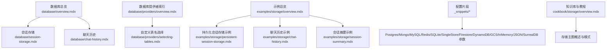
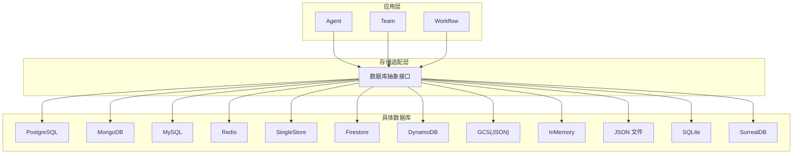
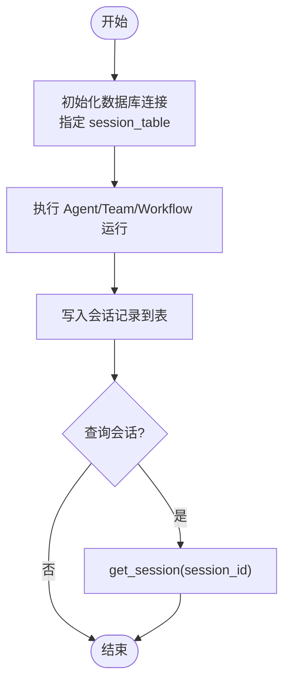
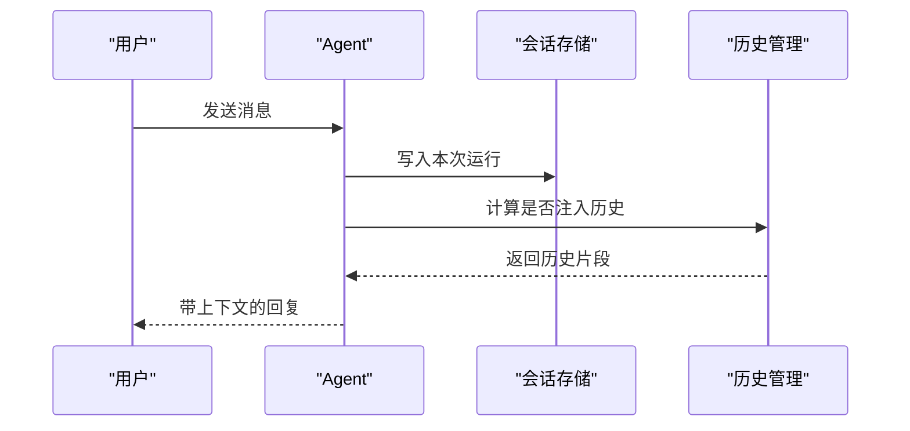
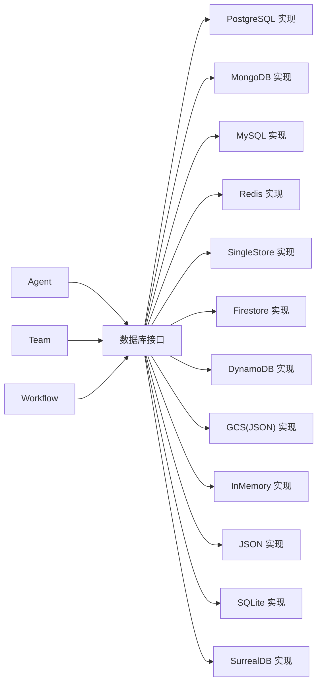

# 存储示例

<cite>
**本文引用的文件**
- [database/overview.mdx](file://database/overview.mdx)
- [database/session-storage.mdx](file://database/session-storage.mdx)
- [database/chat-history.mdx](file://database/chat-history.mdx)
- [database/providers/overview.mdx](file://database/providers/overview.mdx)
- [database/providers/selecting-tables.mdx](file://database/providers/selecting-tables.mdx)
- [examples/storage/overview.mdx](file://examples/storage/overview.mdx)
- [examples/storage/persistent-session-storage.mdx](file://examples/storage/persistent-session-storage.mdx)
- [examples/storage/chat-history.mdx](file://examples/storage/chat-history.mdx)
- [examples/storage/session-summary.mdx](file://examples/storage/session-summary.mdx)
- [_snippets/db-postgres-params.mdx](file://_snippets/db-postgres-params.mdx)
- [_snippets/db-mysql-params.mdx](file://_snippets/db-mysql-params.mdx)
- [_snippets/db-mongo-params.mdx](file://_snippets/db-mongo-params.mdx)
- [_snippets/db-redis-params.mdx](file://_snippets/db-redis-params.mdx)
- [_snippets/db-sqlite-params.mdx](file://_snippets/db-sqlite-params.mdx)
- [_snippets/db-singlestore-params.mdx](file://_snippets/db-singlestore-params.mdx)
- [_snippets/db-firestore-params.mdx](file://_snippets/db-firestore-params.mdx)
- [_snippets/db-dynamodb-params.mdx](file://_snippets/db-dynamodb-params.mdx)
- [_snippets/db-gcs-params.mdx](file://_snippets/db-gcs-params.mdx)
- [_snippets/db-in-memory-params.mdx](file://_snippets/db-in-memory-params.mdx)
- [_snippets/db-json-params.mdx](file://_snippets/db-json-params.mdx)
- [_snippets/db-surrealdb-params.mdx](file://_snippets/db-surrealdb-params.mdx)
- [_snippets/workflow-storage-postgres-params.mdx](file://_snippets/workflow-storage-postgres-params.mdx)
- [_snippets/workflow-storage-mongodb-params.mdx](file://_snippets/workflow-storage-mongodb-params.mdx)
- [_snippets/workflow-storage-sqlite-params.mdx](file://_snippets/workflow-storage-sqlite-params.mdx)
- [_snippets/memory-postgres-reference.mdx](file://_snippets/memory-postgres-reference.mdx)
- [_snippets/memory-mongo-reference.mdx](file://_snippets/memory-mongo-reference.mdx)
- [_snippets/memory-redis-reference.mdx](file://_snippets/memory-redis-reference.mdx)
- [_snippets/memory-sqlite-reference.mdx](file://_snippets/memory-sqlite-reference.mdx)
- [cookbook/storage/overview.mdx](file://cookbook/storage/overview.mdx)
</cite>

## 目录
1. [简介](#简介)
2. [项目结构](#项目结构)
3. [核心组件](#核心组件)
4. [架构总览](#架构总览)
5. [详细组件分析](#详细组件分析)
6. [依赖关系分析](#依赖关系分析)
7. [性能考量](#性能考量)
8. [故障排除指南](#故障排除指南)
9. [结论](#结论)
10. [附录](#附录)

## 简介
本文件面向希望在代理（Agent）、团队（Team）与工作流（Workflow）中集成多种数据库后端以实现会话持久化、聊天历史管理与状态共享的开发者。内容覆盖 PostgreSQL、MongoDB、MySQL、Redis、SingleStore、Firestore、DynamoDB、Google Cloud Storage（GCS）、内存存储（InMemory）、JSON 文件存储（JSON）、SQLite、SurrealDB 等数据库的配置要点、连接参数、表结构设计、最佳实践，并通过示例路径展示如何在代理中使用数据库进行状态持久化、在团队中共享数据、在工作流中传递数据。同时提供迁移思路、性能优化建议与常见问题排查。

## 项目结构
围绕“存储示例”的知识分布在以下区域：
- 数据库概览与通用能力：数据库总览、会话存储、聊天历史
- 数据库提供者索引与自定义表名选择
- 示例目录：Postgres、Mongo、MySQL、Redis、SingleStore、Firestore、DynamoDB、GCS、InMemory、JSON、SQLite、SurrealDB 的使用示例
- 配置片段：各数据库的连接参数模板
- 知识库与教程：存储主题概述与实践模式

**图表来源**
- [database/overview.mdx:1-130](file://database/overview.mdx#L1-L130)
- [database/session-storage.mdx:1-119](file://database/session-storage.mdx#L1-L119)
- [database/chat-history.mdx:1-159](file://database/chat-history.mdx#L1-L159)
- [database/providers/overview.mdx:1-175](file://database/providers/overview.mdx#L1-L175)
- [database/providers/selecting-tables.mdx:1-37](file://database/providers/selecting-tables.mdx#L1-L37)
- [examples/storage/overview.mdx:1-24](file://examples/storage/overview.mdx#L1-L24)
- [examples/storage/persistent-session-storage.mdx:1-54](file://examples/storage/persistent-session-storage.mdx#L1-L54)
- [examples/storage/chat-history.mdx:1-57](file://examples/storage/chat-history.mdx#L1-L57)
- [examples/storage/session-summary.mdx:1-69](file://examples/storage/session-summary.mdx#L1-L69)
- [cookbook/storage/overview.mdx](file://cookbook/storage/overview.mdx)

**章节来源**
- [database/overview.mdx:1-130](file://database/overview.mdx#L1-L130)
- [database/providers/overview.mdx:1-175](file://database/providers/overview.mdx#L1-L175)
- [examples/storage/overview.mdx:1-24](file://examples/storage/overview.mdx#L1-L24)

## 核心组件
- 数据库适配层：为 Agent/Team/Workflow 提供统一的会话、历史与状态持久化接口
- 会话存储：按 session_id 组织运行记录，支持自定义表名
- 聊天历史：可自动注入上下文或按需检索，支持跨会话检索
- 会话摘要：对长对话进行压缩，降低上下文开销
- 异步支持：针对异步应用提供对应的异步数据库类

**章节来源**
- [database/overview.mdx:91-130](file://database/overview.mdx#L91-L130)
- [database/session-storage.mdx:30-71](file://database/session-storage.mdx#L30-L71)
- [database/chat-history.mdx:96-159](file://database/chat-history.mdx#L96-L159)

## 架构总览
下图展示了在不同数据库后端上，Agent/Team/Workflow 如何共享同一套存储能力：

**图表来源**
- [database/overview.mdx:91-104](file://database/overview.mdx#L91-L104)
- [database/providers/overview.mdx:10-175](file://database/providers/overview.mdx#L10-L175)

## 详细组件分析

### 会话存储（Session Storage）
- 默认表：agno_sessions（若不存在则自动创建）
- 自定义表名：通过 session_table 指定
- 存储字段：会话标识、类型、关联对象（agent/team/workflow）、用户、会话数据、元数据、运行列表、摘要等
- 获取会话：get_session(session_id)；支持 Agent/Team/Workflow 三端一致

**图表来源**
- [database/session-storage.mdx:9-28](file://database/session-storage.mdx#L9-L28)
- [database/session-storage.mdx:52-92](file://database/session-storage.mdx#L52-L92)

**章节来源**
- [database/session-storage.mdx:9-92](file://database/session-storage.mdx#L9-L92)
- [database/providers/selecting-tables.mdx:8-37](file://database/providers/selecting-tables.mdx#L8-L37)

### 聊天历史（Chat History）
- 启用方式：add_history_to_context=True，控制历史轮数与消息上限
- 按需检索：read_chat_history=True，获得 get_chat_history 工具
- 跨会话检索：search_session_history=True，限制会话数量
- 团队与工作流：团队成员共享历史；工作流向步骤传递前序输出

**图表来源**
- [database/chat-history.mdx:9-46](file://database/chat-history.mdx#L9-L46)
- [database/chat-history.mdx:112-142](file://database/chat-history.mdx#L112-L142)

**章节来源**
- [database/chat-history.mdx:9-159](file://database/chat-history.mdx#L9-L159)

### 会话摘要（Session Summary）
- 两种启用方式：enable_session_summaries 或 session_summary_manager
- 适合长对话，降低 token 使用并保持上下文有效性

**章节来源**
- [examples/storage/session-summary.mdx:1-69](file://examples/storage/session-summary.mdx#L1-L69)

### 示例：持久化会话存储（Team + Postgres）
- 使用 PostgresDb 持久化团队会话，开启 add_history_to_context
- 示例路径：examples/storage/persistent-session-storage.mdx

**章节来源**
- [examples/storage/persistent-session-storage.mdx:1-54](file://examples/storage/persistent-session-storage.mdx#L1-L54)

### 示例：聊天历史（Agent + Postgres）
- 使用 PostgresDb 存储 Agent 会话，打印历史
- 示例路径：examples/storage/chat-history.mdx

**章节来源**
- [examples/storage/chat-history.mdx:1-57](file://examples/storage/chat-history.mdx#L1-L57)

## 依赖关系分析
- 组件耦合：Agent/Team/Workflow 仅依赖数据库抽象接口，具体实现由数据库提供者决定
- 外部依赖：各数据库驱动（如 psycopg、motor、aioredis 等），以及 SQLAlchemy 异步引擎（异步数据库）
- 表结构：统一的会话表结构，便于跨数据库迁移与复用

**图表来源**
- [database/providers/overview.mdx:10-175](file://database/providers/overview.mdx#L10-L175)

**章节来源**
- [database/providers/overview.mdx:10-175](file://database/providers/overview.mdx#L10-L175)

## 性能考量
- 历史窗口控制：合理设置 num_history_runs 与 num_history_messages，避免上下文过长
- 会话摘要：对长对话启用摘要，显著降低 token 成本
- 索引与分区：在关系型数据库中为 session_id、created_at 等常用查询字段建立索引
- 连接池与并发：生产环境使用连接池与异步数据库类提升吞吐
- 定期归档：将历史会话迁移到冷存储，保留近期活跃会话于热存储

[本节为通用指导，无需特定文件引用]

## 故障排除指南
- 缺少 Greenlet 异常：同步引擎搭配异步数据库类时出现，需使用 SQLAlchemy 异步引擎工厂
- 异步上下文未启动异常：异步引擎搭配同步数据库类时出现，需使用同步引擎工厂
- 表不存在：首次运行时自动创建默认表；若自定义表名，请确保权限与命名规范

**章节来源**
- [database/overview.mdx:122-130](file://database/overview.mdx#L122-L130)

## 结论
通过统一的数据库抽象接口，Agno 支持在代理、团队与工作流中无缝集成多种数据库后端，实现会话持久化、聊天历史管理与状态共享。结合自定义表名、历史窗口控制与会话摘要策略，可在开发与生产环境中平衡功能、性能与成本。

[本节为总结性内容，无需特定文件引用]

## 附录

### 各数据库配置与最佳实践（概览）
- PostgreSQL
  - 连接参数参考：_snippets/db-postgres-params.mdx
  - 工作流存储参数参考：_snippets/workflow-storage-postgres-params.mdx
  - 内存/知识管理参考：_snippets/memory-postgres-reference.mdx
- MySQL
  - 连接参数参考：_snippets/db-mysql-params.mdx
- MongoDB
  - 连接参数参考：_snippets/db-mongo-params.mdx
  - 工作流存储参数参考：_snippets/workflow-storage-mongodb-params.mdx
  - 内存/知识管理参考：_snippets/memory-mongo-reference.mdx
- Redis
  - 连接参数参考：_snippets/db-redis-params.mdx
  - 内存/知识管理参考：_snippets/memory-redis-reference.mdx
- SQLite
  - 连接参数参考：_snippets/db-sqlite-params.mdx
  - 工作流存储参数参考：_snippets/workflow-storage-sqlite-params.mdx
  - 内存/知识管理参考：_snippets/memory-sqlite-reference.mdx
- SingleStore
  - 连接参数参考：_snippets/db-singlestore-params.mdx
- Firestore
  - 连接参数参考：_snippets/db-firestore-params.mdx
- DynamoDB
  - 连接参数参考：_snippets/db-dynamodb-params.mdx
- GCS（JSON）
  - 连接参数参考：_snippets/db-gcs-params.mdx
- InMemory
  - 连接参数参考：_snippets/db-in-memory-params.mdx
- JSON
  - 连接参数参考：_snippets/db-json-params.mdx
- SurrealDB
  - 连接参数参考：_snippets/db-surrealdb-params.mdx

**章节来源**
- [_snippets/db-postgres-params.mdx](file://_snippets/db-postgres-params.mdx)
- [_snippets/db-mysql-params.mdx](file://_snippets/db-mysql-params.mdx)
- [_snippets/db-mongo-params.mdx](file://_snippets/db-mongo-params.mdx)
- [_snippets/db-redis-params.mdx](file://_snippets/db-redis-params.mdx)
- [_snippets/db-sqlite-params.mdx](file://_snippets/db-sqlite-params.mdx)
- [_snippets/db-singlestore-params.mdx](file://_snippets/db-singlestore-params.mdx)
- [_snippets/db-firestore-params.mdx](file://_snippets/db-firestore-params.mdx)
- [_snippets/db-dynamodb-params.mdx](file://_snippets/db-dynamodb-params.mdx)
- [_snippets/db-gcs-params.mdx](file://_snippets/db-gcs-params.mdx)
- [_snippets/db-in-memory-params.mdx](file://_snippets/db-in-memory-params.mdx)
- [_snippets/db-json-params.mdx](file://_snippets/db-json-params.mdx)
- [_snippets/db-surrealdb-params.mdx](file://_snippets/db-surrealdb-params.mdx)
- [_snippets/workflow-storage-postgres-params.mdx](file://_snippets/workflow-storage-postgres-params.mdx)
- [_snippets/workflow-storage-mongodb-params.mdx](file://_snippets/workflow-storage-mongodb-params.mdx)
- [_snippets/workflow-storage-sqlite-params.mdx](file://_snippets/workflow-storage-sqlite-params.mdx)
- [_snippets/memory-postgres-reference.mdx](file://_snippets/memory-postgres-reference.mdx)
- [_snippets/memory-mongo-reference.mdx](file://_snippets/memory-mongo-reference.mdx)
- [_snippets/memory-redis-reference.mdx](file://_snippets/memory-redis-reference.mdx)
- [_snippets/memory-sqlite-reference.mdx](file://_snippets/memory-sqlite-reference.mdx)

### 示例清单与路径
- 示例总览：examples/storage/overview.mdx
- 持久化会话存储（Team + Postgres）：examples/storage/persistent-session-storage.mdx
- 聊天历史（Agent + Postgres）：examples/storage/chat-history.mdx
- 会话摘要（Agent + Postgres）：examples/storage/session-summary.mdx

**章节来源**
- [examples/storage/overview.mdx:1-24](file://examples/storage/overview.mdx#L1-L24)
- [examples/storage/persistent-session-storage.mdx:1-54](file://examples/storage/persistent-session-storage.mdx#L1-L54)
- [examples/storage/chat-history.mdx:1-57](file://examples/storage/chat-history.mdx#L1-L57)
- [examples/storage/session-summary.mdx:1-69](file://examples/storage/session-summary.mdx#L1-L69)

### 知识库与教程
- 存储主题概述：cookbook/storage/overview.mdx

**章节来源**
- [cookbook/storage/overview.mdx](file://cookbook/storage/overview.mdx)