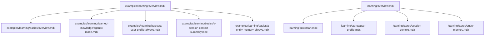
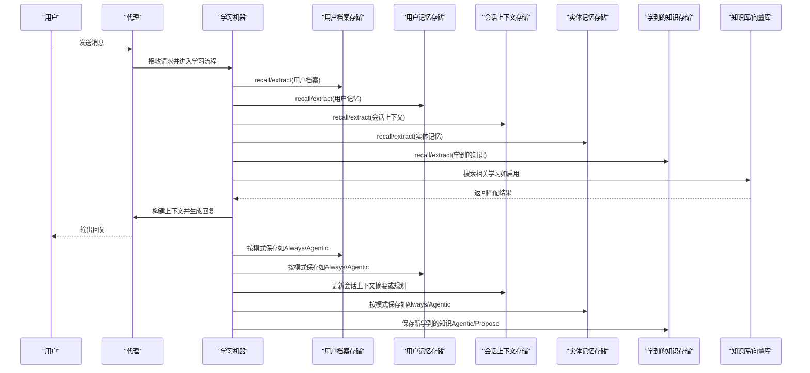
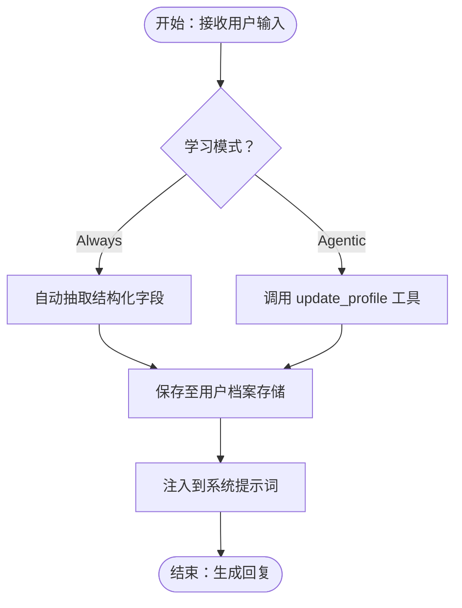
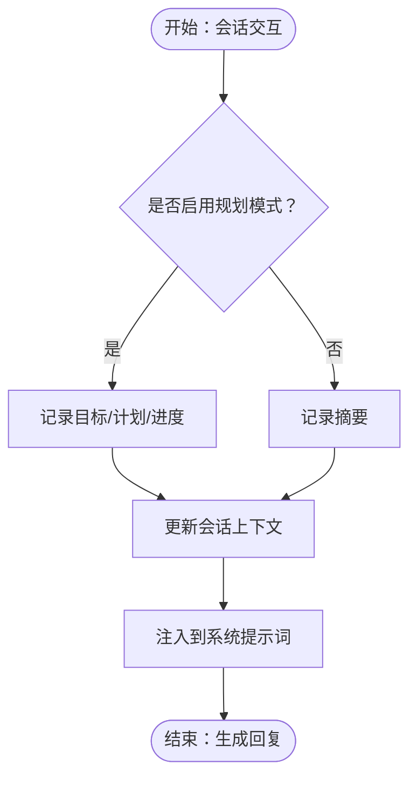
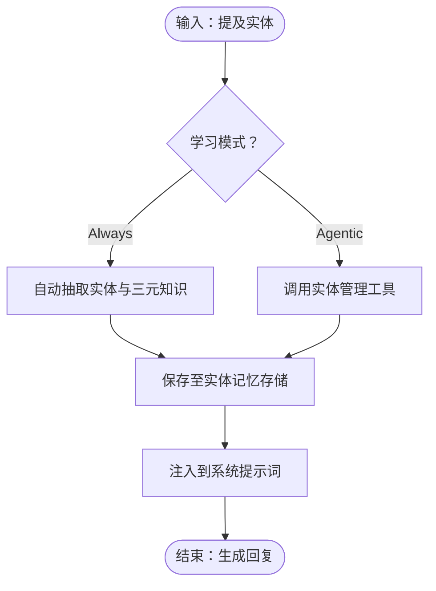
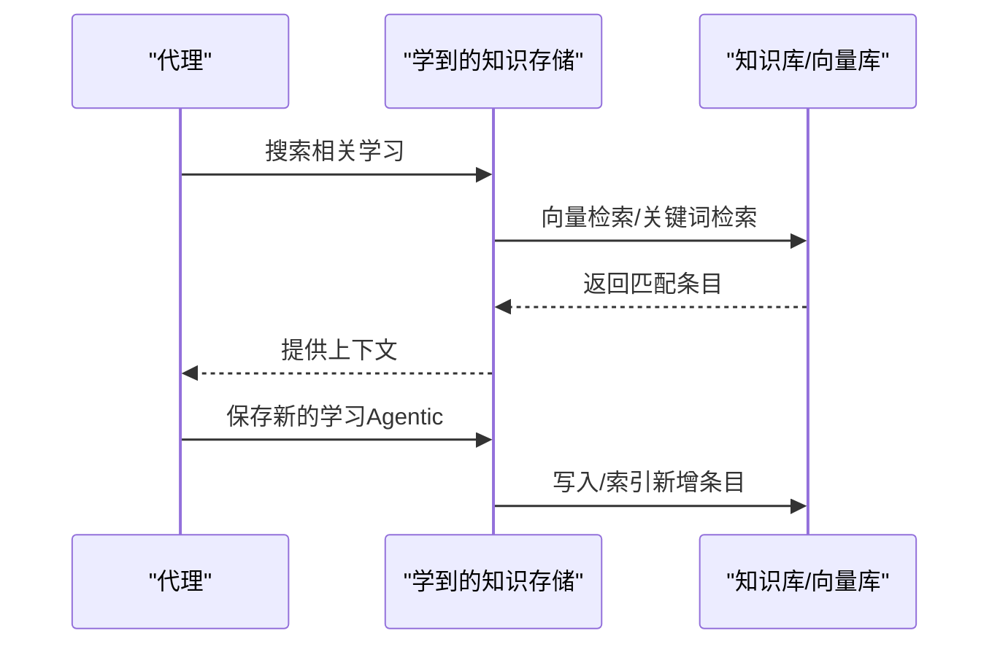
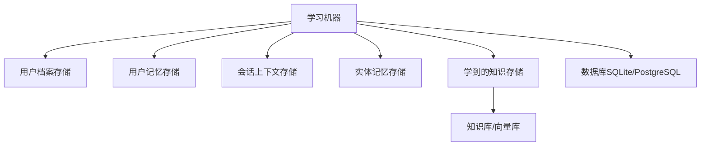

# 学习示例

<cite>
**本文引用的文件**
- [examples/learning/overview.mdx](file://examples/learning/overview.mdx)
- [learning/overview.mdx](file://learning/overview.mdx)
- [learning/quickstart.mdx](file://learning/quickstart.mdx)
- [learning/stores/user-profile.mdx](file://learning/stores/user-profile.mdx)
- [learning/stores/session-context.mdx](file://learning/stores/session-context.mdx)
- [learning/stores/entity-memory.mdx](file://learning/stores/entity-memory.mdx)
- [examples/learning/basics/overview.mdx](file://examples/learning/basics/overview.mdx)
- [examples/learning/basics/a-user-profile-always.mdx](file://examples/learning/basics/a-user-profile-always.mdx)
- [examples/learning/basics/a-session-context-summary.mdx](file://examples/learning/basics/a-session-context-summary.mdx)
- [examples/learning/basics/a-entity-memory-always.mdx](file://examples/learning/basics/a-entity-memory-always.mdx)
- [examples/learning/learned-knowledge/agentic-mode.mdx](file://examples/learning/learned-knowledge/agentic-mode.mdx)
</cite>

## 目录
1. [简介](#简介)
2. [项目结构](#项目结构)
3. [核心组件](#核心组件)
4. [架构总览](#架构总览)
5. [详细组件分析](#详细组件分析)
6. [依赖关系分析](#依赖关系分析)
7. [性能考量](#性能考量)
8. [故障排查指南](#故障排查指南)
9. [结论](#结论)
10. [附录](#附录)

## 简介
本技术文档面向“学习示例”主题，系统化讲解代理学习系统的实现与应用，覆盖以下关键内容：
- 四种学习存储类型（用户档案、用户记忆、会话上下文、实体记忆、学到的知识、决策日志）的配置与使用
- 学习模式（Always、Agentic、Propose）的选择与配置
- 自定义学习模式与 Schema 扩展
- 基础使用示例：代理如何从交互中提取知识、建立用户画像、记录决策过程、优化行为表现
- 性能优化、数据隐私保护与长期记忆管理策略
- 完整代码示例路径：展示个性化学习、知识传承与智能适应，并提供学习效果监控与评估方法

## 项目结构
学习示例相关文档主要分布在 examples/learning 与 learning 两个目录：
- examples/learning：提供可运行示例与分步演示，涵盖基础用法、自定义存储与端到端模式
- learning：提供概念性概述、快速入门、学习模式说明与存储介绍

图表来源
- [examples/learning/overview.mdx:1-18](file://examples/learning/overview.mdx#L1-L18)
- [examples/learning/basics/overview.mdx:1-17](file://examples/learning/basics/overview.mdx#L1-L17)
- [examples/learning/learned-knowledge/agentic-mode.mdx:1-126](file://examples/learning/learned-knowledge/agentic-mode.mdx#L1-L126)
- [examples/learning/basics/a-user-profile-always.mdx:1-93](file://examples/learning/basics/a-user-profile-always.mdx#L1-L93)
- [examples/learning/basics/a-session-context-summary.mdx:1-102](file://examples/learning/basics/a-session-context-summary.mdx#L1-L102)
- [examples/learning/basics/a-entity-memory-always.mdx:1-103](file://examples/learning/basics/a-entity-memory-always.mdx#L1-L103)
- [learning/overview.mdx:1-112](file://learning/overview.mdx#L1-L112)
- [learning/quickstart.mdx:1-129](file://learning/quickstart.mdx#L1-L129)
- [learning/stores/user-profile.mdx:1-168](file://learning/stores/user-profile.mdx#L1-L168)
- [learning/stores/session-context.mdx:1-164](file://learning/stores/session-context.mdx#L1-L164)
- [learning/stores/entity-memory.mdx:1-184](file://learning/stores/entity-memory.mdx#L1-L184)

章节来源
- [examples/learning/overview.mdx:1-18](file://examples/learning/overview.mdx#L1-L18)
- [examples/learning/basics/overview.mdx:1-17](file://examples/learning/basics/overview.mdx#L1-L17)
- [learning/overview.mdx:1-112](file://learning/overview.mdx#L1-L112)

## 核心组件
- 学习机器（Learning Machine）
  - 统一入口，组合多种学习存储与模式控制
  - 支持按存储粒度启用/禁用与模式配置
- 学习存储（Learning Stores）
  - 用户档案（User Profile）：结构化事实（姓名、昵称、自定义字段），按用户维度持久化
  - 用户记忆（User Memory）：对话中的非结构化观察，随时间累积
  - 会话上下文（Session Context）：当前会话的目标、计划与进度快照，生命周期随会话更新
  - 实体记忆（Entity Memory）：外部实体（公司、人、项目）的事实、事件、关系，支持命名空间共享
  - 学到的知识（Learned Knowledge）：跨用户的可复用洞察，需结合知识库与向量数据库
  - 决策日志（Decision Log）：带推理的决策记录，用于审计与学习
- 学习模式（Learning Modes）
  - Always：每次响应后自动抽取
  - Agentic：赋予工具由代理自主决定保存
  - Propose：代理提出学习建议，经人工审批后保存

章节来源
- [learning/overview.mdx:24-48](file://learning/overview.mdx#L24-L48)
- [learning/quickstart.mdx:45-93](file://learning/quickstart.mdx#L45-L93)

## 架构总览
下图展示了代理在一次交互中如何通过学习机器调用不同存储，并在必要时触发知识库检索与保存。

图表来源
- [learning/overview.mdx:37-48](file://learning/overview.mdx#L37-L48)
- [examples/learning/basics/a-user-profile-always.mdx:36-45](file://examples/learning/basics/a-user-profile-always.mdx#L36-L45)
- [examples/learning/basics/a-session-context-summary.mdx:34-40](file://examples/learning/basics/a-session-context-summary.mdx#L34-L40)
- [examples/learning/basics/a-entity-memory-always.mdx:35-45](file://examples/learning/basics/a-entity-memory-always.mdx#L35-L45)
- [examples/learning/learned-knowledge/agentic-mode.mdx:45-60](file://examples/learning/learned-knowledge/agentic-mode.mdx#L45-L60)

## 详细组件分析

### 用户档案（User Profile）
- 能力与范围
  - 结构化事实（姓名、昵称、自定义字段），按用户维度持久化
  - 默认 Always 模式，自动抽取；也支持 Agentic 模式由代理显式更新
- 数据模型要点
  - 字段：名称、首选名称等默认字段
  - 可扩展：通过自定义 Schema（继承基础模型）添加业务字段
- 上下文注入
  - 自动注入到系统提示词中，无需手动构建
- 使用建议
  - 适合明确、稳定的用户属性；与用户记忆互补，前者精确、后者灵活

图表来源
- [learning/stores/user-profile.mdx:45-82](file://learning/stores/user-profile.mdx#L45-L82)
- [examples/learning/basics/a-user-profile-always.mdx:33-45](file://examples/learning/basics/a-user-profile-always.mdx#L33-L45)

章节来源
- [learning/stores/user-profile.mdx:8-168](file://learning/stores/user-profile.mdx#L8-L168)
- [examples/learning/basics/a-user-profile-always.mdx:1-93](file://examples/learning/basics/a-user-profile-always.mdx#L1-L93)

### 会话上下文（Session Context）
- 能力与范围
  - 记录当前会话的讨论摘要、目标、计划与进度，生命周期随会话更新
  - 默认 Always 模式；支持摘要模式与规划模式
- 数据模型要点
  - 字段：会话标识、用户标识、摘要、目标、计划、进度、创建/更新时间
- 上下文注入
  - 自动注入到系统提示词，便于长对话与多轮任务保持一致性
- 使用建议
  - 长对话、复杂多步骤任务、会话恢复与交接场景尤为适用

图表来源
- [learning/stores/session-context.mdx:47-90](file://learning/stores/session-context.mdx#L47-L90)
- [examples/learning/basics/a-session-context-summary.mdx:32-40](file://examples/learning/basics/a-session-context-summary.mdx#L32-L40)

章节来源
- [learning/stores/session-context.mdx:1-164](file://learning/stores/session-context.mdx#L1-L164)
- [examples/learning/basics/a-session-context-summary.mdx:1-102](file://examples/learning/basics/a-session-context-summary.mdx#L1-L102)

### 实体记忆（Entity Memory）
- 能力与范围
  - 外部实体（公司、人、项目）的事实、事件、关系，支持命名空间（全局/用户/自定义）
  - 默认 Always 模式；也支持 Agentic 模式，提供实体搜索、创建、更新、增删改查等工具
- 数据模型要点
  - 字段：实体标识、类型、名称、描述、属性、事实、事件、关系
- 上下文注入
  - 将相关实体信息注入系统提示词，提升跨话题的一致性与专业性
- 使用建议
  - 销售、咨询、研发协作等需要持续积累外部知识的场景

图表来源
- [learning/stores/entity-memory.mdx:60-97](file://learning/stores/entity-memory.mdx#L60-L97)
- [examples/learning/basics/a-entity-memory-always.mdx:33-45](file://examples/learning/basics/a-entity-memory-always.mdx#L33-L45)

章节来源
- [learning/stores/entity-memory.mdx:1-184](file://learning/stores/entity-memory.mdx#L1-L184)
- [examples/learning/basics/a-entity-memory-always.mdx:1-103](file://examples/learning/basics/a-entity-memory-always.mdx#L1-L103)

### 学到的知识（Learned Knowledge）
- 能力与范围
  - 跨用户的可复用洞察，需结合知识库与向量数据库实现检索与保存
  - 支持 Agentic 模式：代理决定何时保存与检索
- 使用建议
  - 适用于最佳实践、经验总结、跨案例迁移的学习场景

图表来源
- [examples/learning/learned-knowledge/agentic-mode.mdx:45-60](file://examples/learning/learned-knowledge/agentic-mode.mdx#L45-L60)
- [examples/learning/learned-knowledge/agentic-mode.mdx:66-109](file://examples/learning/learned-knowledge/agentic-mode.mdx#L66-L109)

章节来源
- [examples/learning/learned-knowledge/agentic-mode.mdx:1-126](file://examples/learning/learned-knowledge/agentic-mode.mdx#L1-L126)

### 决策日志（Decision Log）
- 能力与范围
  - 记录代理的决策及其推理过程，便于审计、回放与学习
- 使用建议
  - 高合规要求场景（金融、医疗、监管）与团队协作交接

章节来源
- [learning/overview.mdx:35-35](file://learning/overview.mdx#L35-L35)

## 依赖关系分析
- 组件耦合
  - 学习机器统一编排各存储与模式，降低代理对具体存储实现的感知
  - 知识库与向量库作为学到的知识的底层依赖，影响检索质量与性能
- 外部依赖
  - 数据库：SQLite（本地）、PostgreSQL（生产）
  - 向量数据库：PgVector（示例中使用）
  - 嵌入模型：OpenAI Embedding（示例中使用）

图表来源
- [learning/quickstart.mdx:95-108](file://learning/quickstart.mdx#L95-L108)
- [examples/learning/learned-knowledge/agentic-mode.mdx:36-43](file://examples/learning/learned-knowledge/agentic-mode.mdx#L36-L43)

章节来源
- [learning/quickstart.mdx:95-108](file://learning/quickstart.mdx#L95-L108)
- [examples/learning/learned-knowledge/agentic-mode.mdx:36-43](file://examples/learning/learned-knowledge/agentic-mode.mdx#L36-L43)

## 性能考量
- 学习开销控制
  - Always 模式会在每次响应后进行抽取，带来额外 LLM 调用成本；Agentic 模式允许代理自主选择时机，平衡成本与收益
- 向量检索优化
  - 合理设置嵌入维度、索引策略与混合检索参数，减少查询延迟
- 数据库与缓存
  - 生产环境优先使用 PostgreSQL；对高频读取的用户档案与会话上下文可引入缓存层
- 清理与去重
  - 定期修剪过期记忆、去重重复条目，维持存储健康

章节来源
- [learning/overview.mdx:61-70](file://learning/overview.mdx#L61-L70)
- [learning/stores/user-profile.mdx:60-60](file://learning/stores/user-profile.mdx#L60-L60)
- [learning/stores/entity-memory.mdx:75-75](file://learning/stores/entity-memory.mdx#L75-L75)

## 故障排查指南
- 问题：会话上下文未生效
  - 检查是否启用 session_context 并确认会话 ID 一致
  - 确认是否使用了规划模式以获得目标/计划/进度字段
- 问题：实体记忆未被抽取
  - 确认实体记忆处于 Always 模式或代理已正确调用实体管理工具
  - 检查命名空间设置是否导致访问受限
- 问题：学到的知识无法检索
  - 确认知识库与向量库初始化成功且索引存在
  - 检查嵌入模型与向量维度配置是否一致
- 问题：性能下降
  - 评估是否启用了 Always 模式导致频繁抽取
  - 对用户档案与会话上下文增加缓存层，定期清理过期数据

章节来源
- [learning/stores/session-context.mdx:105-117](file://learning/stores/session-context.mdx#L105-L117)
- [learning/stores/entity-memory.mdx:112-128](file://learning/stores/entity-memory.mdx#L112-L128)
- [examples/learning/learned-knowledge/agentic-mode.mdx:66-109](file://examples/learning/learned-knowledge/agentic-mode.mdx#L66-L109)

## 结论
通过将代理与学习存储结合，系统实现了“边交互边学习”的能力。用户档案、会话上下文、实体记忆与学到的知识共同构成多维长期记忆体系；配合学习模式与知识库，代理可在不同场景下实现个性化学习、知识传承与智能适应。生产落地建议优先采用 PostgreSQL 与向量数据库，结合缓存与定期维护策略，确保性能与稳定性。

## 附录
- 快速开始
  - 启用学习：设置 learning=True 或显式配置 LearningMachine
  - 测试记忆：在新会话中验证用户档案与会话上下文的召回
- 示例路径
  - 用户档案（Always 模式）：[示例路径:1-93](file://examples/learning/basics/a-user-profile-always.mdx#L1-L93)
  - 会话上下文（摘要模式）：[示例路径:1-102](file://examples/learning/basics/a-session-context-summary.mdx#L1-L102)
  - 实体记忆（Always 模式）：[示例路径:1-103](file://examples/learning/basics/a-entity-memory-always.mdx#L1-L103)
  - 学到的知识（Agentic 模式）：[示例路径:1-126](file://examples/learning/learned-knowledge/agentic-mode.mdx#L1-L126)
- 进一步阅读
  - 学习概览与商店介绍：[概览:1-112](file://learning/overview.mdx#L1-L112)
  - 快速入门与模式选择：[快速入门:1-129](file://learning/quickstart.mdx#L1-L129)
  - 用户档案与自定义 Schema：[用户档案:1-168](file://learning/stores/user-profile.mdx#L1-L168)
  - 会话上下文与规划模式：[会话上下文:1-164](file://learning/stores/session-context.mdx#L1-L164)
  - 实体记忆与命名空间：[实体记忆:1-184](file://learning/stores/entity-memory.mdx#L1-L184)