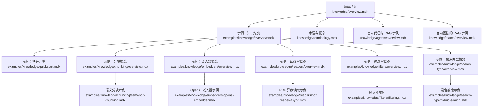
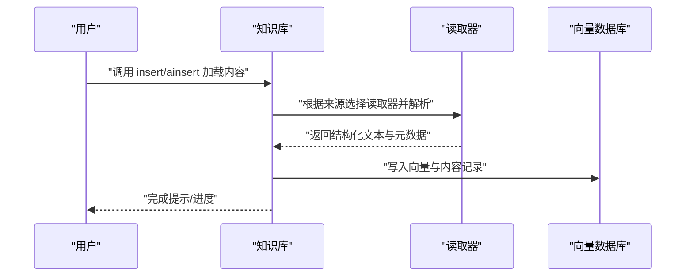
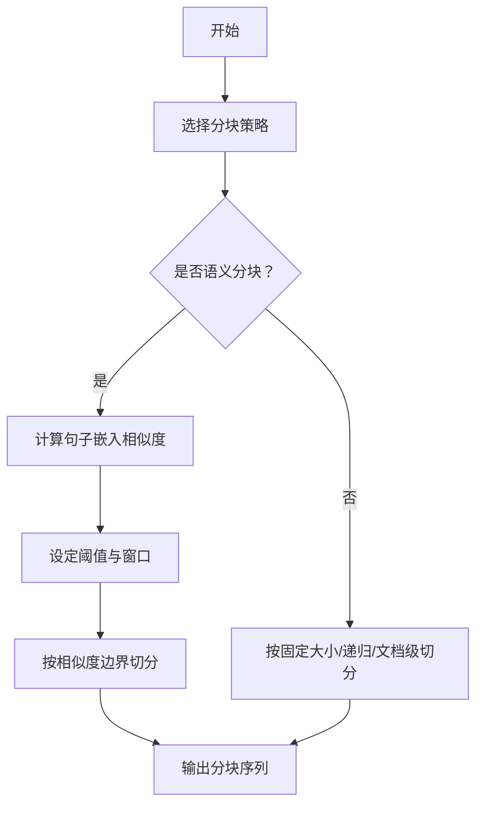
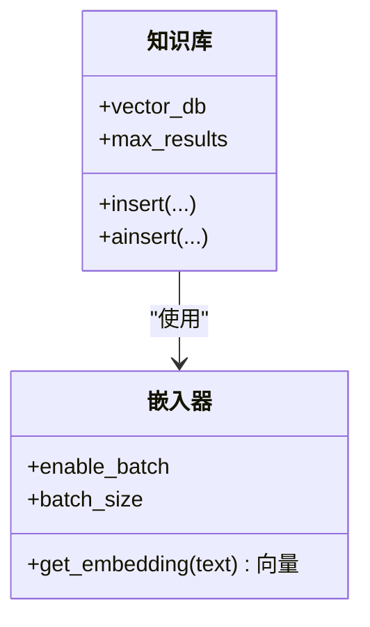
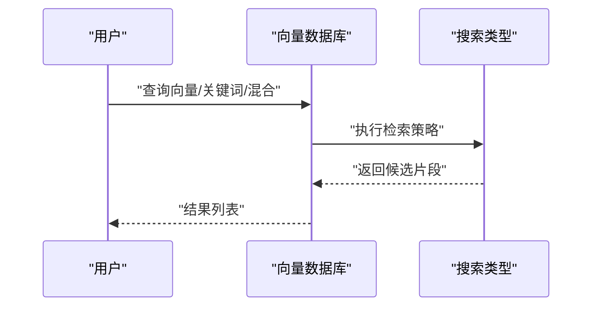
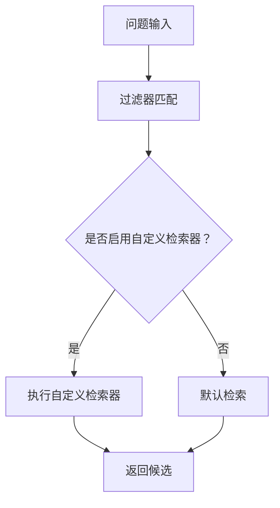
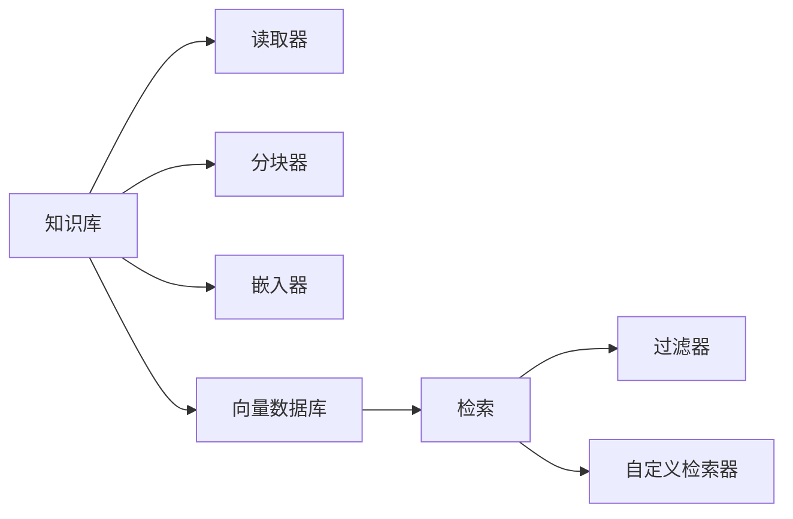

# 知识示例

<cite>
**本文引用的文件**
- [知识总览](file://knowledge/overview.mdx)
- [术语与概念](file://knowledge/terminology.mdx)
- [示例：知识总览](file://examples/knowledge/overview.mdx)
- [示例：快速开始](file://examples/knowledge/quickstart.mdx)
- [示例：分块概览](file://examples/knowledge/chunking/overview.mdx)
- [示例：语义分块](file://examples/knowledge/chunking/semantic-chunking.mdx)
- [示例：嵌入器概览](file://examples/knowledge/embedders/overview.mdx)
- [示例：OpenAI 嵌入器](file://examples/knowledge/embedders/openai-embedder.mdx)
- [示例：读取器概览](file://examples/knowledge/readers/overview.mdx)
- [示例：PDF 异步读取](file://examples/knowledge/readers/pdf-reader-async.mdx)
- [示例：过滤器概览](file://examples/knowledge/filters/overview.mdx)
- [示例：过滤器](file://examples/knowledge/filters/filtering.mdx)
- [示例：搜索类型概览](file://examples/knowledge/search-type/overview.mdx)
- [示例：混合搜索](file://examples/knowledge/search-type/hybrid-search.mdx)
- [知识：面向代理的 RAG 示例](file://knowledge/agents/overview.mdx)
- [知识：面向团队的 RAG 示例](file://knowledge/teams/overview.mdx)
</cite>

## 目录
1. [简介](#简介)
2. [项目结构](#项目结构)
3. [核心组件](#核心组件)
4. [架构总览](#架构总览)
5. [详细组件分析](#详细组件分析)
6. [依赖关系分析](#依赖关系分析)
7. [性能考量](#性能考量)
8. [故障排除指南](#故障排除指南)
9. [结论](#结论)
10. [附录](#附录)

## 简介
本技术文档聚焦“知识示例”主题，系统讲解如何在本仓库中构建与管理知识库，覆盖内容导入、分块策略、嵌入器配置、向量数据库集成与智能检索。文档同时给出多种读取器（PDF、CSV、JSON、网页等）的使用范式，分块算法的选择与优化建议，以及向量检索的实现路径。最后提供从内容收集到向量索引的完整知识库构建流程，并解释知识过滤器、自定义检索器与混合搜索策略；面向代理与团队的 RAG 使用方式、性能优化与故障排除最佳实践亦在文中详述。

## 项目结构
围绕知识库与 RAG 的示例分布在以下目录：
- 知识总览与概念：用于理解知识库工作原理、组件关系与术语
- 示例：知识总览、快速开始、分块、嵌入器、读取器、过滤器、搜索类型
- 面向代理与团队的知识应用示例：展示如何在代理与团队场景中使用知识库进行 RAG



图表来源
- [知识总览](file://knowledge/overview.mdx)
- [示例：知识总览](file://examples/knowledge/overview.mdx)
- [示例：快速开始](file://examples/knowledge/quickstart.mdx)
- [示例：分块概览](file://examples/knowledge/chunking/overview.mdx)
- [示例：语义分块](file://examples/knowledge/chunking/semantic-chunking.mdx)
- [示例：嵌入器概览](file://examples/knowledge/embedders/overview.mdx)
- [示例：OpenAI 嵌入器](file://examples/knowledge/embedders/openai-embedder.mdx)
- [示例：读取器概览](file://examples/knowledge/readers/overview.mdx)
- [示例：PDF 异步读取](file://examples/knowledge/readers/pdf-reader-async.mdx)
- [示例：过滤器概览](file://examples/knowledge/filters/overview.mdx)
- [示例：过滤器](file://examples/knowledge/filters/filtering.mdx)
- [示例：搜索类型概览](file://examples/knowledge/search-type/overview.mdx)
- [示例：混合搜索](file://examples/knowledge/search-type/hybrid-search.mdx)
- [术语与概念](file://knowledge/terminology.mdx)
- [知识：面向代理的 RAG 示例](file://knowledge/agents/overview.mdx)
- [知识：面向团队的 RAG 示例](file://knowledge/teams/overview.mdx)

章节来源
- [知识总览](file://knowledge/overview.mdx)
- [示例：知识总览](file://examples/knowledge/overview.mdx)

## 核心组件
- 内容读取器（Readers）
  - 支持从本地文件、URL、云存储、网页、数据库等多种来源读取内容，如 PDF、CSV、JSON、Markdown、网页等
  - 提供同步与异步两种加载方式，异步可提升大规模数据处理效率
- 分块策略（Chunking）
  - 固定大小、递归、文档级、语义分块等策略，结合嵌入器与相似度阈值控制分块质量
- 嵌入器（Embedders）
  - 多种提供商与本地部署选项，支持批量嵌入以提升吞吐
- 向量数据库（Vector Databases）
  - 支持多种实现（如 PgVector、Chroma、LanceDB、Pinecone、Qdrant 等），并提供不同检索模式（向量、关键词、混合）
- 智能检索（Retrieval）
  - 结合过滤器、重排序、搜索类型与自定义检索器，实现精准与可控的信息召回

章节来源
- [知识总览](file://knowledge/overview.mdx)
- [术语与概念](file://knowledge/terminology.mdx)

## 架构总览
下图展示了知识库从内容收集到向量检索的端到端流程，以及代理/团队如何基于知识库进行 RAG：

```mermaid
graph TB
subgraph "内容收集"
R["读取器<br/>PDF/CSV/JSON/网页等"]
AIO["异步加载<br/>async insert"]
end
subgraph "预处理"
CK["分块策略<br/>固定/递归/语义/文档级"]
EB["嵌入器<br/>OpenAI/Gemini/Cohere 等"]
end
subgraph "向量存储"
VD["向量数据库<br/>PgVector/Chroma/LanceDB 等"]
CT["内容元数据表<br/>contents_db"]
end
subgraph "检索与应用"
SR["搜索类型<br/>向量/关键词/混合"]
FL["过滤器<br/>按元数据/内容规则筛选"]
CR["自定义检索器<br/>业务规则/权限控制"]
AG["代理/团队<br/>RAG 应用"]
end
R --> CK --> EB --> VD
AIO --> CK
CT <- --> VD
VD --> SR --> FL --> CR --> AG
```

图表来源
- [知识总览](file://knowledge/overview.mdx)
- [示例：快速开始](file://examples/knowledge/quickstart.mdx)
- [示例：语义分块](file://examples/knowledge/chunking/semantic-chunking.mdx)
- [示例：OpenAI 嵌入器](file://examples/knowledge/embedders/openai-embedder.mdx)
- [示例：混合搜索](file://examples/knowledge/search-type/hybrid-search.mdx)
- [示例：过滤器](file://examples/knowledge/filters/filtering.mdx)

## 详细组件分析

### 组件一：内容读取器（Readers）
- 典型用法
  - 从 URL 或本地路径加载内容，支持 PDF、CSV、JSON、Markdown、网页等
  - 异步读取适合大批量或远程资源，显著降低等待时间
- 关键点
  - 可指定编码、密码、分页等参数
  - 异步接口返回协程，便于并发调度
- 示例参考
  - [PDF 异步读取示例](file://examples/knowledge/readers/pdf-reader-async.mdx)



图表来源
- [示例：PDF 异步读取](file://examples/knowledge/readers/pdf-reader-async.mdx)

章节来源
- [示例：读取器概览](file://examples/knowledge/readers/overview.mdx)
- [示例：PDF 异步读取](file://examples/knowledge/readers/pdf-reader-async.mdx)

### 组件二：分块策略（Chunking）
- 策略类型
  - 固定大小、递归、文档级、语义分块等
  - 语义分块通过嵌入器与相似度阈值，更好地保留语义边界
- 参数要点
  - chunk_size、相似度阈值、窗口大小、分隔符、最小句长/字符等
- 示例参考
  - [语义分块示例](file://examples/knowledge/chunking/semantic-chunking.mdx)



图表来源
- [示例：语义分块](file://examples/knowledge/chunking/semantic-chunking.mdx)

章节来源
- [示例：分块概览](file://examples/knowledge/chunking/overview.mdx)
- [示例：语义分块](file://examples/knowledge/chunking/semantic-chunking.mdx)

### 组件三：嵌入器（Embedders）
- 供应商与本地部署
  - OpenAI、Gemini、Cohere、HuggingFace、Mistral、Ollama、vLLM 等
  - 批量嵌入可显著提升吞吐，适用于大规模内容入库
- 示例参考
  - [OpenAI 嵌入器示例](file://examples/knowledge/embedders/openai-embedder.mdx)



图表来源
- [示例：OpenAI 嵌入器](file://examples/knowledge/embedders/openai-embedder.mdx)
- [示例：快速开始](file://examples/knowledge/quickstart.mdx)

章节来源
- [示例：嵌入器概览](file://examples/knowledge/embedders/overview.mdx)
- [示例：OpenAI 嵌入器](file://examples/knowledge/embedders/openai-embedder.mdx)

### 组件四：向量数据库（Vector Databases）
- 实现与特性
  - PgVector、Chroma、LanceDB、Pinecone、Qdrant 等
  - 支持向量、关键词与混合搜索，可配置相似度阈值与返回条数
- 示例参考
  - [混合搜索示例](file://examples/knowledge/search-type/hybrid-search.mdx)



图表来源
- [示例：混合搜索](file://examples/knowledge/search-type/hybrid-search.mdx)

章节来源
- [示例：搜索类型概览](file://examples/knowledge/search-type/overview.mdx)
- [示例：混合搜索](file://examples/knowledge/search-type/hybrid-search.mdx)

### 组件五：智能检索（Retrieval）
- 过滤器
  - 基于元数据与内容规则进行筛选，支持在加载时与查询时使用
- 自定义检索器
  - 完全掌控检索逻辑，可加入权限、业务规则与上下文裁剪
- 示例参考
  - [过滤器示例](file://examples/knowledge/filters/filtering.mdx)



图表来源
- [示例：过滤器](file://examples/knowledge/filters/filtering.mdx)
- [术语与概念](file://knowledge/terminology.mdx)

章节来源
- [示例：过滤器概览](file://examples/knowledge/filters/overview.mdx)
- [示例：过滤器](file://examples/knowledge/filters/filtering.mdx)
- [术语与概念](file://knowledge/terminology.mdx)

### 组件六：代理与团队中的 RAG 应用
- 代理
  - 通过设置知识库与检索开关，使代理在对话中自动检索相关片段并生成回答
- 团队
  - 多代理协作时，可共享知识库并协调检索策略，实现分布式 RAG
- 示例参考
  - [知识：面向代理的 RAG 示例](file://knowledge/agents/overview.mdx)
  - [知识：面向团队的 RAG 示例](file://knowledge/teams/overview.mdx)

章节来源
- [知识：面向代理的 RAG 示例](file://knowledge/agents/overview.mdx)
- [知识：面向团队的 RAG 示例](file://knowledge/teams/overview.mdx)

## 依赖关系分析
- 组件耦合
  - 知识库对读取器、分块器、嵌入器与向量数据库存在直接依赖
  - 过滤器与自定义检索器作为横切关注点，贯穿检索阶段
- 外部依赖
  - 向量数据库与嵌入器服务通常为外部系统，需正确配置连接参数与认证
- 循环依赖
  - 示例代码未见循环依赖迹象，各模块职责清晰



图表来源
- [示例：快速开始](file://examples/knowledge/quickstart.mdx)
- [示例：OpenAI 嵌入器](file://examples/knowledge/embedders/openai-embedder.mdx)
- [示例：混合搜索](file://examples/knowledge/search-type/hybrid-search.mdx)
- [示例：过滤器](file://examples/knowledge/filters/filtering.mdx)

章节来源
- [示例：快速开始](file://examples/knowledge/quickstart.mdx)
- [示例：OpenAI 嵌入器](file://examples/knowledge/embedders/openai-embedder.mdx)
- [示例：混合搜索](file://examples/knowledge/search-type/hybrid-search.mdx)
- [示例：过滤器](file://examples/knowledge/filters/filtering.mdx)

## 性能考量
- 异步加载
  - 对大量文件或远程资源，优先使用异步插入与异步响应，减少阻塞
- 批量嵌入
  - 在嵌入器中启用批量模式，提高吞吐并降低 API 调用开销
- 分块策略
  - 语义分块可提升检索质量，但会增加嵌入成本；固定大小分块更高效但可能割裂语义
- 搜索类型
  - 混合搜索兼顾语义与关键词，但计算复杂度更高；仅向量或关键词搜索更轻量
- 缓存与索引
  - 合理设置向量数据库的索引参数与缓存策略，避免重复检索

## 故障排除指南
- 常见问题
  - 无法连接向量数据库：检查连接字符串、网络与认证配置
  - 嵌入维度不匹配：确认嵌入器与向量数据库的维度一致
  - 检索结果为空：调整相似度阈值、扩大搜索范围或启用混合搜索
  - 权限与过滤冲突：核对过滤器条件与元数据键名
- 排查步骤
  - 逐段验证：先读取器，再分块与嵌入，最后入库与检索
  - 小样本测试：用少量文档验证端到端流程
  - 日志与指标：记录耗时、返回条数与错误码，定位瓶颈
- 参考示例
  - [PDF 异步读取示例](file://examples/knowledge/readers/pdf-reader-async.mdx)
  - [OpenAI 嵌入器示例](file://examples/knowledge/embedders/openai-embedder.mdx)
  - [混合搜索示例](file://examples/knowledge/search-type/hybrid-search.mdx)
  - [过滤器示例](file://examples/knowledge/filters/filtering.mdx)

章节来源
- [示例：PDF 异步读取](file://examples/knowledge/readers/pdf-reader-async.mdx)
- [示例：OpenAI 嵌入器](file://examples/knowledge/embedders/openai-embedder.mdx)
- [示例：混合搜索](file://examples/knowledge/search-type/hybrid-search.mdx)
- [示例：过滤器](file://examples/knowledge/filters/filtering.mdx)

## 结论
本仓库提供了从内容读取、分块、嵌入到向量存储与检索的完整知识库构建路径。通过异步加载、批量嵌入、灵活的分块策略与多样的检索模式，可在代理与团队场景中高效实现 RAG。配合过滤器与自定义检索器，可进一步满足权限控制与业务规则需求。建议在生产环境中结合性能与成本进行策略权衡，并通过小样本测试与日志监控持续优化。

## 附录
- 快速开始流程
  - 创建知识库与向量数据库实例
  - 选择合适的读取器与分块策略
  - 配置嵌入器并批量生成向量
  - 将内容写入向量数据库与内容元数据表
  - 在代理/团队中启用知识检索并运行问答
- 参考示例
  - [示例：快速开始](file://examples/knowledge/quickstart.mdx)
  - [示例：知识总览](file://examples/knowledge/overview.mdx)

章节来源
- [示例：快速开始](file://examples/knowledge/quickstart.mdx)
- [示例：知识总览](file://examples/knowledge/overview.mdx)