# 代理示例

<cite>
**本文引用的文件**
- [examples/agents/basics/basic-agent.mdx](file://examples/agents/basics/basic-agent.mdx)
- [examples/agents/basics/agent-with-instructions.mdx](file://examples/agents/basics/agent-with-instructions.mdx)
- [examples/agents/basics/agent-with-tools.mdx](file://examples/agents/basics/agent-with-tools.mdx)
- [examples/agents/basics/overview.mdx](file://examples/agents/basics/overview.mdx)
- [examples/agents/input-output/streaming.mdx](file://examples/agents/input-output/streaming.mdx)
- [examples/agents/input-output/input-formats.mdx](file://examples/agents/input-output/input-formats.mdx)
- [context/agent/overview.mdx](file://context/agent/overview.mdx)
- [examples/agents/tools/callable-tools.mdx](file://examples/agents/tools/callable-tools.mdx)
- [tools/tool-call-limit.mdx](file://tools/tool-call-limit.mdx)
- [examples/agents/state-and-session/overview.mdx](file://examples/agents/state-and-session/overview.mdx)
- [examples/agents/memory-and-learning/overview.mdx](file://examples/agents/memory-and-learning/overview.mdx)
- [examples/agents/knowledge/overview.mdx](file://examples/agents/knowledge/overview.mdx)
- [examples/agents/guardrails/overview.mdx](file://examples/agents/guardrails/overview.mdx)
- [examples/agents/hooks/overview.mdx](file://examples/agents/hooks/overview.mdx)
- [examples/agents/human-in-the-loop/overview.mdx](file://examples/agents/human-in-the-loop/overview.mdx)
- [examples/agents/skills/overview.mdx](file://examples/agents/skills/overview.mdx)
- [examples/agent-os/basic.mdx](file://examples/agent-os/basic.mdx)
- [_snippets/input-format-usage.mdx](file://_snippets/input-format-usage.mdx)
</cite>

## 目录
1. [简介](#简介)
2. [项目结构](#项目结构)
3. [核心组件](#核心组件)
4. [架构总览](#架构总览)
5. [详细组件分析](#详细组件分析)
6. [依赖关系分析](#依赖关系分析)
7. [性能考虑](#性能考虑)
8. [故障排查指南](#故障排查指南)
9. [结论](#结论)
10. [附录](#附录)

## 简介
本技术文档围绕“代理示例”主题，系统梳理基础代理创建与运行、代理指令、工具使用、输入输出处理、上下文管理、工具选择与限制、状态与会话管理、记忆与学习、知识管理、保护机制、钩子系统、人机交互、高级功能（缓存、压缩、并发、事件、重试、调试、文化与序列化）、依赖管理以及技能开发等关键能力。文档以仓库中的示例与概念性资料为依据，提供循序渐进的学习路径与可视化图示，帮助读者快速掌握从零到一构建智能体系统的实践方法。

## 项目结构
本仓库将“代理示例”相关内容分布在多个目录中：
- agents 示例：覆盖基础代理、输入输出、工具、上下文、状态与会话、记忆与学习、知识、保护机制、钩子、人机交互、技能等主题。
- agent-os 示例：展示如何在 AgentOS 中组织代理、团队与工作流，并通过 serve 启动应用。
- context、knowledge、guardrails、hooks、hitl、state、memory、skills 等子模块：提供概念性与实操性示例，支撑代理在真实场景中的工程化落地。

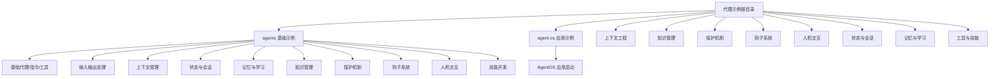

**章节来源**
- [examples/agents/basics/overview.mdx:1-12](file://examples/agents/basics/overview.mdx#L1-L12)
- [examples/agent-os/basic.mdx:57-92](file://examples/agent-os/basic.mdx#L57-L92)

## 核心组件
- 基础代理：最小可用代理的创建与运行，包含模型配置与简单问答。
- 指令与上下文：通过系统消息、指令、期望输出、介绍消息与历史过滤等塑造上下文。
- 工具与可调用工厂：内置工具与动态工具工厂，支持按用户/会话定制工具集。
- 输入输出：多模态输入、结构化输出、流式响应与解析模型。
- 状态与会话：会话状态维护、聊天历史、持久化与事件钩子。
- 记忆与学习：持久化记忆、记忆管理器与学习行为。
- 知识管理：检索增强生成（RAG）、知识过滤与自定义检索器。
- 保护机制：输入输出安全检查与策略执行。
- 钩子系统：预钩子、后钩子、工具钩子与流生命周期钩子。
- 人机交互：确认流程、用户输入提示与外部工具处理。
- 技能开发：代理技能与辅助脚本的定义与使用。
- 高级功能：缓存、压缩、并发、事件、重试、调试、文化与序列化。
- 依赖管理：运行时依赖注入与动态运行时输入。

**章节来源**
- [examples/agents/basics/basic-agent.mdx:1-40](file://examples/agents/basics/basic-agent.mdx#L1-L40)
- [examples/agents/basics/agent-with-instructions.mdx:1-47](file://examples/agents/basics/agent-with-instructions.mdx#L1-L47)
- [examples/agents/basics/agent-with-tools.mdx:1-43](file://examples/agents/basics/agent-with-tools.mdx#L1-L43)
- [examples/agents/input-output/streaming.mdx:1-47](file://examples/agents/input-output/streaming.mdx#L1-L47)
- [examples/agents/input-output/input-formats.mdx:1-56](file://examples/agents/input-output/input-formats.mdx#L1-L56)
- [context/agent/overview.mdx:1-174](file://context/agent/overview.mdx#L1-L174)
- [examples/agents/tools/callable-tools.mdx:1-43](file://examples/agents/tools/callable-tools.mdx#L1-L43)
- [tools/tool-call-limit.mdx:1-35](file://tools/tool-call-limit.mdx#L1-L35)
- [examples/agents/state-and-session/overview.mdx:1-20](file://examples/agents/state-and-session/overview.mdx#L1-L20)
- [examples/agents/memory-and-learning/overview.mdx:1-10](file://examples/agents/memory-and-learning/overview.mdx#L1-L10)
- [examples/agents/knowledge/overview.mdx:1-16](file://examples/agents/knowledge/overview.mdx#L1-L16)
- [examples/agents/guardrails/overview.mdx:1-13](file://examples/agents/guardrails/overview.mdx#L1-L13)
- [examples/agents/hooks/overview.mdx:1-19](file://examples/agents/hooks/overview.mdx#L1-L19)
- [examples/agents/human-in-the-loop/overview.mdx:1-26](file://examples/agents/human-in-the-loop/overview.mdx#L1-L26)
- [examples/agents/skills/overview.mdx:1-10](file://examples/agents/skills/overview.mdx#L1-L10)
- [examples/agent-os/basic.mdx:57-92](file://examples/agent-os/basic.mdx#L57-L92)
- [_snippets/input-format-usage.mdx:1-4](file://_snippets/input-format-usage.mdx#L1-L4)

## 架构总览
下图展示了从“请求输入”到“响应输出”的典型代理运行链路，贯穿上下文塑造、工具调用、状态与会话、记忆与学习、知识检索、保护机制、钩子与人机交互等环节。

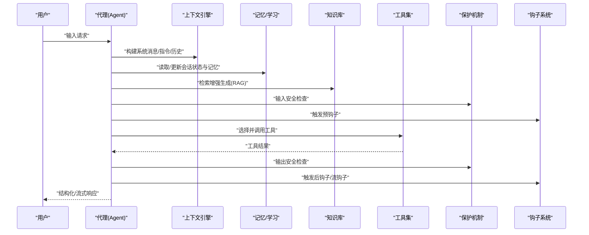

**图表来源**
- [context/agent/overview.mdx:17-174](file://context/agent/overview.mdx#L17-L174)
- [examples/agents/knowledge/overview.mdx:1-16](file://examples/agents/knowledge/overview.mdx#L1-L16)
- [examples/agents/guardrails/overview.mdx:1-13](file://examples/agents/guardrails/overview.mdx#L1-L13)
- [examples/agents/hooks/overview.mdx:1-19](file://examples/agents/hooks/overview.mdx#L1-L19)
- [examples/agents/human-in-the-loop/overview.mdx:1-26](file://examples/agents/human-in-the-loop/overview.mdx#L1-L26)

## 详细组件分析

### 基础代理与运行示例
- 基本代理：创建最小可用代理，配置模型，打印响应。
- 指令代理：通过 instructions 参数注入任务特定指令，控制输出风格。
- 工具代理：集成内置工具，使代理具备查询能力。

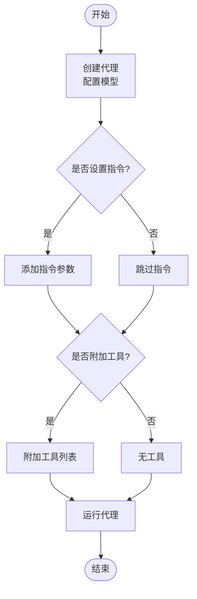

**图表来源**
- [examples/agents/basics/basic-agent.mdx:14-25](file://examples/agents/basics/basic-agent.mdx#L14-L25)
- [examples/agents/basics/agent-with-instructions.mdx:22-26](file://examples/agents/basics/agent-with-instructions.mdx#L22-L26)
- [examples/agents/basics/agent-with-tools.mdx:16-20](file://examples/agents/basics/agent-with-tools.mdx#L16-L20)

**章节来源**
- [examples/agents/basics/basic-agent.mdx:1-40](file://examples/agents/basics/basic-agent.mdx#L1-L40)
- [examples/agents/basics/agent-with-instructions.mdx:1-47](file://examples/agents/basics/agent-with-instructions.mdx#L1-L47)
- [examples/agents/basics/agent-with-tools.mdx:1-43](file://examples/agents/basics/agent-with-tools.mdx#L1-L43)

### 输入输出处理示例
- 输入格式：支持文本与多模态输入（如图像），满足不同来源的数据形态。
- 验证模式：通过 input_schema 对外部输入进行校验。
- 流式处理：逐 token 输出，提升交互体验。
- 结构化输出：使用输出模型与解析模型，稳定地提取结构化结果。

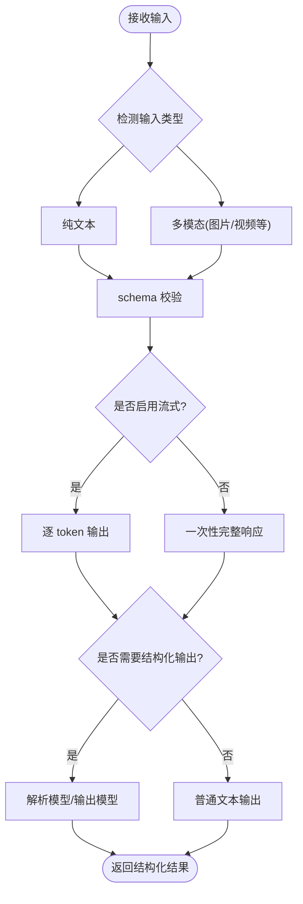

**图表来源**
- [examples/agents/input-output/input-formats.mdx:25-41](file://examples/agents/input-output/input-formats.mdx#L25-L41)
- [examples/agents/input-output/streaming.mdx:27-32](file://examples/agents/input-output/streaming.mdx#L27-L32)
- [_snippets/input-format-usage.mdx:1-4](file://_snippets/input-format-usage.mdx#L1-L4)

**章节来源**
- [examples/agents/input-output/input-formats.mdx:1-56](file://examples/agents/input-output/input-formats.mdx#L1-L56)
- [examples/agents/input-output/streaming.mdx:1-47](file://examples/agents/input-output/streaming.mdx#L1-L47)
- [_snippets/input-format-usage.mdx:1-4](file://_snippets/input-format-usage.mdx#L1-L4)

### 上下文管理示例
- 指令设置：通过 instructions 参数注入任务指令。
- 系统消息：描述、指令、期望输出共同构成系统消息。
- 介绍消息：使用 introduction 参数设置初始问候。
- 上下文塑造：结合历史过滤、工具调用过滤、动态指令函数等，实现精细的上下文控制。

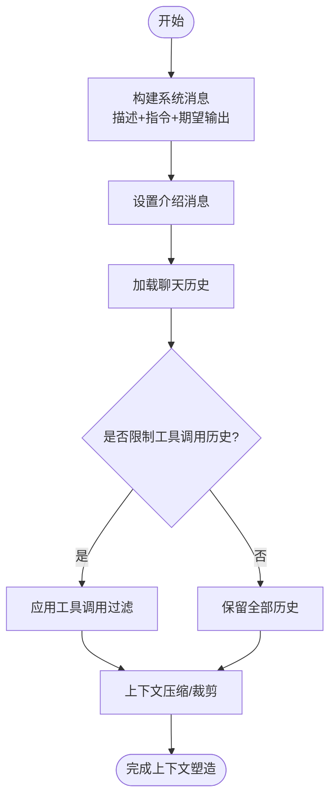

**图表来源**
- [context/agent/overview.mdx:17-174](file://context/agent/overview.mdx#L17-L174)
- [examples/agents/hooks/overview.mdx:13-18](file://examples/agents/hooks/overview.mdx#L13-L18)

**章节来源**
- [context/agent/overview.mdx:1-174](file://context/agent/overview.mdx#L1-L174)
- [examples/agents/hooks/overview.mdx:1-19](file://examples/agents/hooks/overview.mdx#L1-L19)

### 工具使用示例
- 可调用工具工厂：传入函数作为 tools，按用户/会话动态生成工具集；默认按 user_id 或 session_id 缓存结果。
- 工具选择：根据当前上下文与需求自动选择合适工具。
- 工具调用限制：通过 tool_call_limit 控制单次运行内的工具调用次数，避免循环与成本失控。

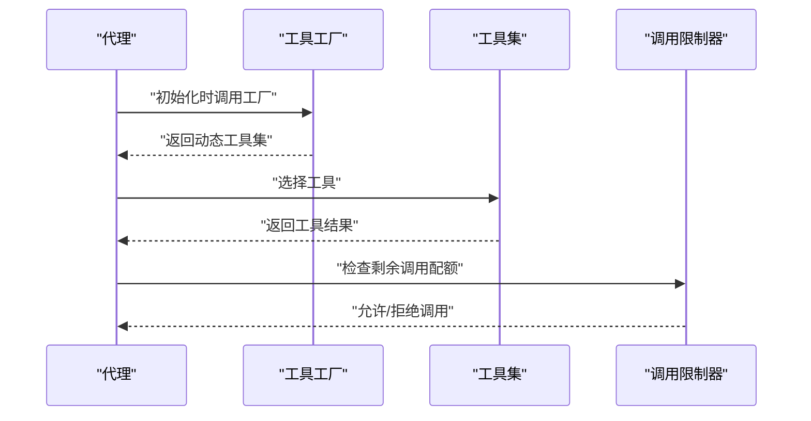

**图表来源**
- [examples/agents/tools/callable-tools.mdx:1-43](file://examples/agents/tools/callable-tools.mdx#L1-L43)
- [tools/tool-call-limit.mdx:10-27](file://tools/tool-call-limit.mdx#L10-L27)

**章节来源**
- [examples/agents/tools/callable-tools.mdx:1-43](file://examples/agents/tools/callable-tools.mdx#L1-L43)
- [tools/tool-call-limit.mdx:1-35](file://tools/tool-call-limit.mdx#L1-L35)

### 状态与会话管理示例
- 会话状态管理：在代理运行期间维护 session_state，支持手动更新与事件驱动更新。
- 聊天历史：记录与回放历史消息，支持 Last N 与持久化存储。
- 会话持久化：将会话摘要与历史写入持久化存储，实现跨会话连续性。

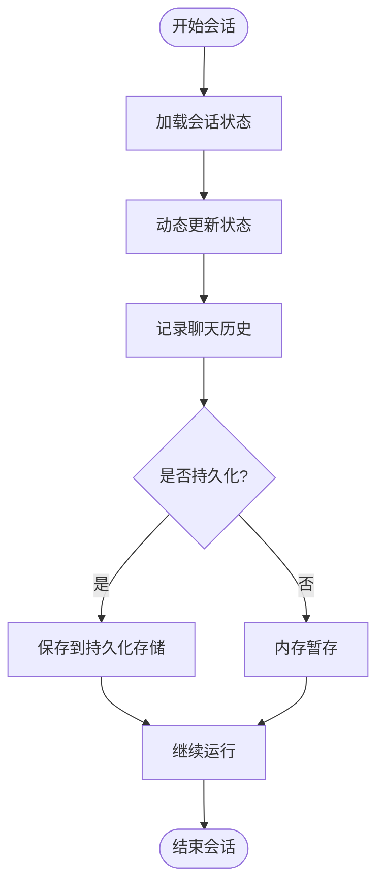

**图表来源**
- [examples/agents/state-and-session/overview.mdx:1-20](file://examples/agents/state-and-session/overview.mdx#L1-L20)

**章节来源**
- [examples/agents/state-and-session/overview.mdx:1-20](file://examples/agents/state-and-session/overview.mdx#L1-L20)

### 记忆与学习示例
- 持久化记忆：通过 MemoryManager 提供跨会话的记忆能力。
- 学习行为：基于交互日志与决策记录，形成可复用的知识与偏好。

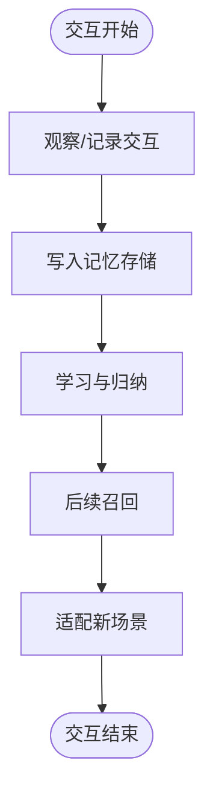

**图表来源**
- [examples/agents/memory-and-learning/overview.mdx:1-10](file://examples/agents/memory-and-learning/overview.mdx#L1-L10)

**章节来源**
- [examples/agents/memory-and-learning/overview.mdx:1-10](file://examples/agents/memory-and-learning/overview.mdx#L1-L10)

### 知识管理示例
- 检索增强生成（RAG）：传统 RAG 与智能体 RAG，支持重排序与推理工具。
- 知识过滤：静态过滤与智能体过滤器，提升检索质量。
- 自定义检索器：通过 knowledge_retriever 注入自定义检索逻辑。

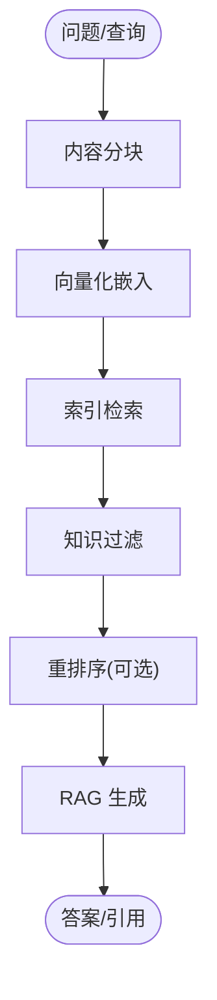

**图表来源**
- [examples/agents/knowledge/overview.mdx:1-16](file://examples/agents/knowledge/overview.mdx#L1-L16)

**章节来源**
- [examples/agents/knowledge/overview.mdx:1-16](file://examples/agents/knowledge/overview.mdx#L1-L16)

### 保护机制示例
- 输入输出安全检查：对输入进行合规性校验，对输出进行策略约束。
- 策略执行：结合 Guardrails 实现 PII 检测、提示注入防护与自定义策略。

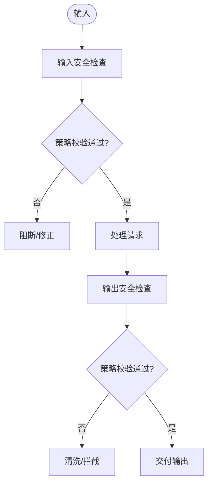

**图表来源**
- [examples/agents/guardrails/overview.mdx:1-13](file://examples/agents/guardrails/overview.mdx#L1-L13)

**章节来源**
- [examples/agents/guardrails/overview.mdx:1-13](file://examples/agents/guardrails/overview.mdx#L1-L13)

### 钩子系统示例
- 预钩子：在请求进入前进行输入验证与状态更新。
- 后钩子：在响应生成后进行输出验证与评估。
- 工具钩子：为每个工具调用增加中间件包装。
- 流生命周期钩子：在流式输出过程中插入通知或统计逻辑。

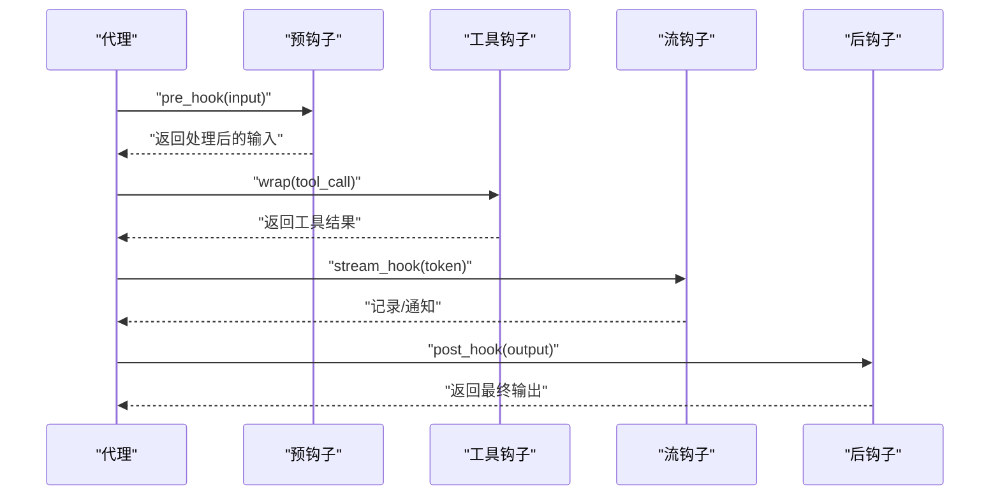

**图表来源**
- [examples/agents/hooks/overview.mdx:1-19](file://examples/agents/hooks/overview.mdx#L1-L19)

**章节来源**
- [examples/agents/hooks/overview.mdx:1-19](file://examples/agents/hooks/overview.mdx#L1-L19)

### 人机交互示例
- 确认流程：对工具调用进行用户确认，支持异步与流式确认。
- 用户输入提示：在关键节点提示用户提供额外输入。
- 外部工具处理：将工具调用交由外部系统执行，再回填结果。

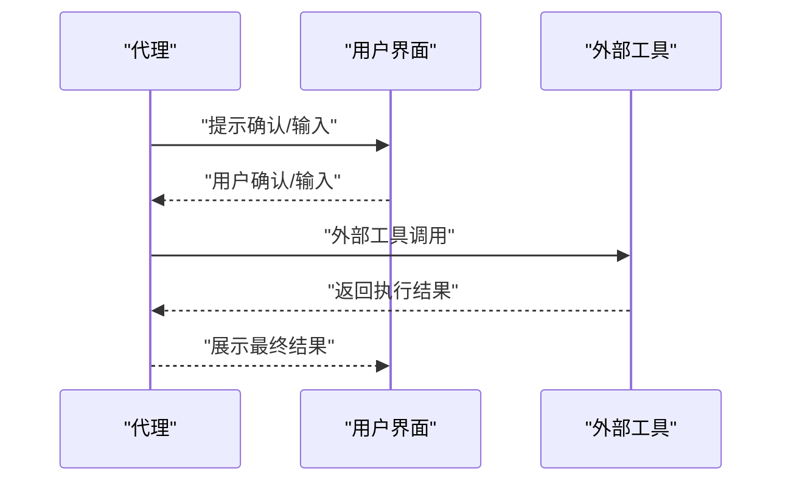

**图表来源**
- [examples/agents/human-in-the-loop/overview.mdx:1-26](file://examples/agents/human-in-the-loop/overview.mdx#L1-L26)

**章节来源**
- [examples/agents/human-in-the-loop/overview.mdx:1-26](file://examples/agents/human-in-the-loop/overview.mdx#L1-L26)

### 技能开发示例
- 代理技能：封装常用行为为可复用技能，简化代理配置。
- 辅助脚本：通过脚本扩展代理能力，实现复杂业务逻辑。

**章节来源**
- [examples/agents/skills/overview.mdx:1-10](file://examples/agents/skills/overview.mdx#L1-L10)

### 高级功能示例
- 缓存：工具与响应缓存，降低重复计算与延迟。
- 压缩：上下文压缩与历史裁剪，提升长对话稳定性。
- 并发：多会话并发与异步工具执行。
- 事件：运行事件与会话事件，便于可观测性与审计。
- 重试：工具调用失败重试与指数退避。
- 调试：日志、追踪与调试工具链。
- 文化与序列化：多语言与多格式序列化策略。
- 依赖管理：运行时依赖注入与动态输入解析。

（本节为通用能力综述，不直接分析具体文件）

### 依赖管理示例
- 运行时依赖注入：在代理初始化时注入外部依赖，实现环境解耦。
- 动态运行时输入：根据用户/会话动态解析输入参数，提高灵活性。

（本节为通用能力综述，不直接分析具体文件）

## 依赖关系分析
下图展示代理示例中各主题之间的依赖关系与耦合度，强调“输入输出”“上下文”“工具”“状态/会话”“记忆/学习”“知识”“保护机制”“钩子”“人机交互”“技能”等模块的协作方式。

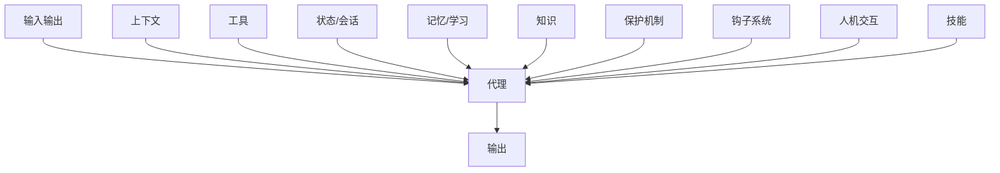

**图表来源**
- [examples/agents/basics/overview.mdx:1-12](file://examples/agents/basics/overview.mdx#L1-L12)
- [examples/agents/hooks/overview.mdx:1-19](file://examples/agents/hooks/overview.mdx#L1-L19)
- [examples/agents/guardrails/overview.mdx:1-13](file://examples/agents/guardrails/overview.mdx#L1-L13)
- [examples/agents/knowledge/overview.mdx:1-16](file://examples/agents/knowledge/overview.mdx#L1-L16)
- [examples/agents/memory-and-learning/overview.mdx:1-10](file://examples/agents/memory-and-learning/overview.mdx#L1-L10)
- [examples/agents/state-and-session/overview.mdx:1-20](file://examples/agents/state-and-session/overview.mdx#L1-L20)
- [examples/agents/human-in-the-loop/overview.mdx:1-26](file://examples/agents/human-in-the-loop/overview.mdx#L1-L26)
- [examples/agents/skills/overview.mdx:1-10](file://examples/agents/skills/overview.mdx#L1-L10)

**章节来源**
- [examples/agents/basics/overview.mdx:1-12](file://examples/agents/basics/overview.mdx#L1-L12)
- [examples/agents/hooks/overview.mdx:1-19](file://examples/agents/hooks/overview.mdx#L1-L19)
- [examples/agents/guardrails/overview.mdx:1-13](file://examples/agents/guardrails/overview.mdx#L1-L13)
- [examples/agents/knowledge/overview.mdx:1-16](file://examples/agents/knowledge/overview.mdx#L1-L16)
- [examples/agents/memory-and-learning/overview.mdx:1-10](file://examples/agents/memory-and-learning/overview.mdx#L1-L10)
- [examples/agents/state-and-session/overview.mdx:1-20](file://examples/agents/state-and-session/overview.mdx#L1-L20)
- [examples/agents/human-in-the-loop/overview.mdx:1-26](file://examples/agents/human-in-the-loop/overview.mdx#L1-L26)
- [examples/agents/skills/overview.mdx:1-10](file://examples/agents/skills/overview.mdx#L1-L10)

## 性能考虑
- 流式输出：减少首字节延迟，改善用户体验。
- 上下文压缩：控制历史长度与上下文大小，避免超出模型上下文窗口。
- 工具调用限制：防止无限循环与高成本调用。
- 缓存策略：对工具与响应进行缓存，降低重复计算。
- 并发与重试：合理并发与指数退避，提升吞吐与稳定性。
- 观测与追踪：通过事件与钩子记录关键指标，便于性能优化。

（本节提供通用指导，不直接分析具体文件）

## 故障排查指南
- 输入格式错误：检查 input_schema 与输入数据结构，确保与模型期望一致。
- 工具调用失败：查看工具钩子输出与异常日志，确认权限与网络连通性。
- 输出不符合预期：启用后钩子与输出模型，逐步定位偏差来源。
- 会话状态异常：核对 session_state 更新逻辑与持久化存储一致性。
- 保护机制误判：调整策略阈值或规则，结合日志进行白名单放行与回归测试。

（本节提供通用指导，不直接分析具体文件）

## 结论
本技术文档从基础代理到高级工程实践，系统呈现了代理示例的关键能力与最佳实践。通过输入输出、上下文、工具、状态/会话、记忆/学习、知识、保护机制、钩子、人机交互与技能等模块的协同，可以构建出既可扩展又可维护的智能体系统。建议在实际项目中优先从基础示例入手，逐步引入上下文工程、工具工厂、状态持久化与保护机制，最终实现可运维、可观测、可演进的代理平台。

## 附录
- AgentOS 应用示例：通过 AgentOS 组织代理、团队与工作流，并使用 serve 启动本地服务，便于调试与演示。

**章节来源**
- [examples/agent-os/basic.mdx:57-92](file://examples/agent-os/basic.mdx#L57-L92)