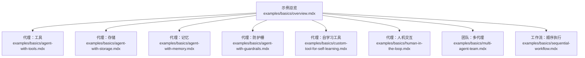
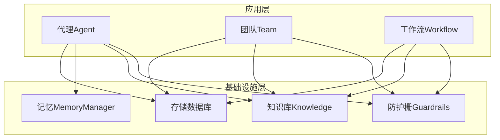
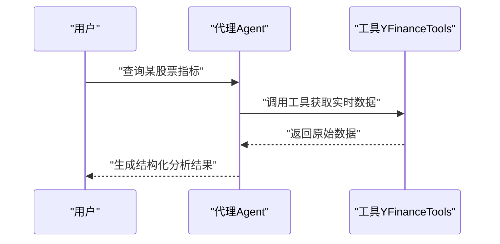
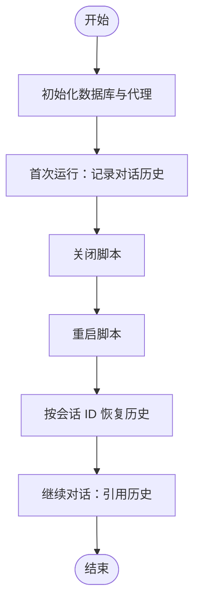
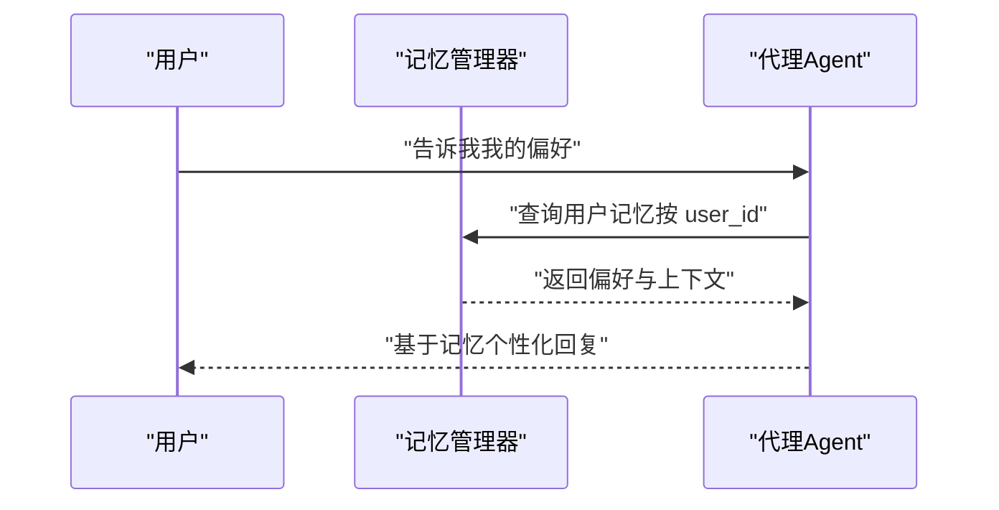
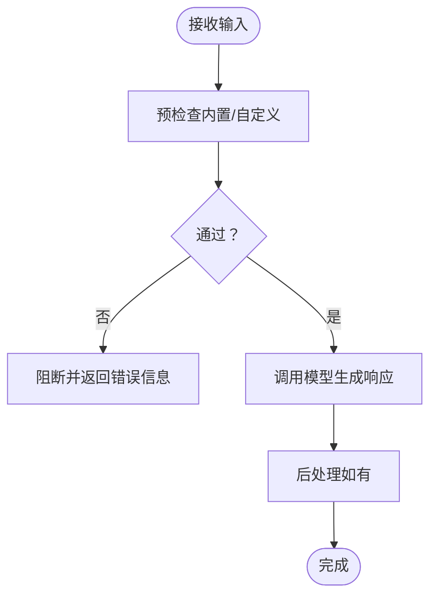
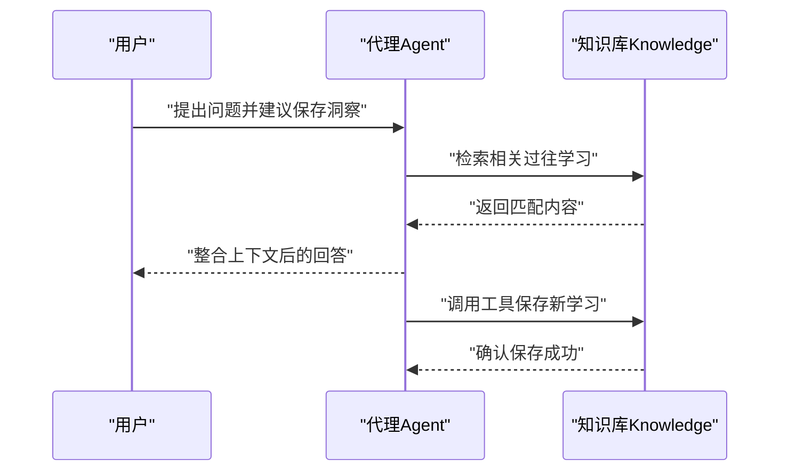
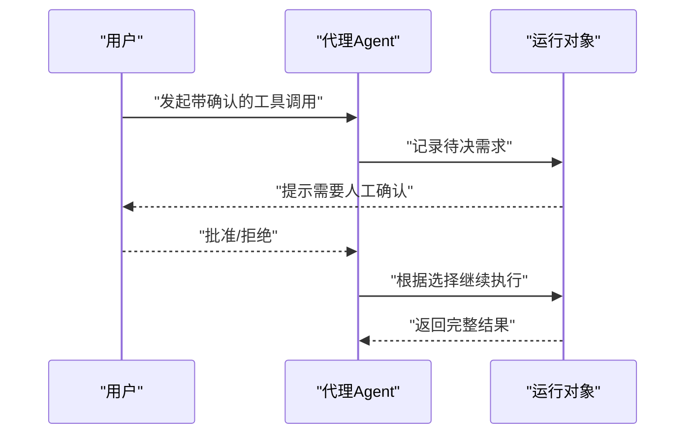
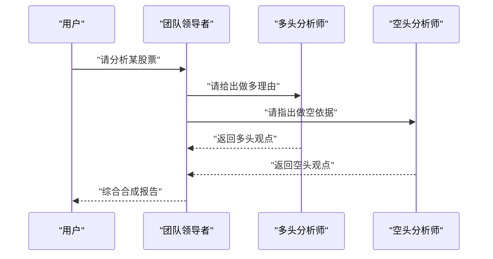
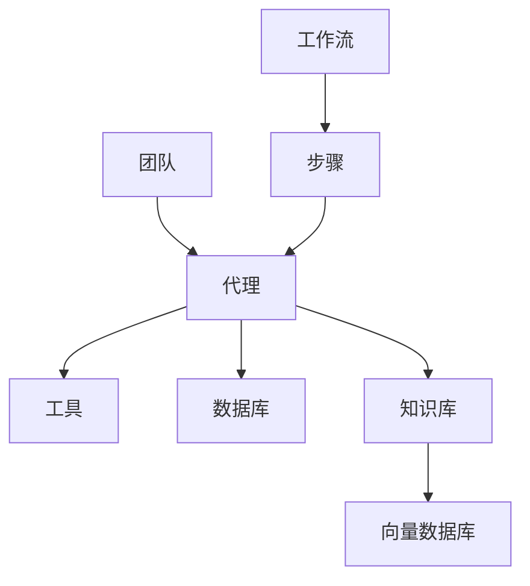

# 原语示例

<cite>
**本文引用的文件**
- [示例总览](file://examples/basics/overview.mdx)
- [代理：工具](file://examples/basics/agent-with-tools.mdx)
- [代理：存储](file://examples/basics/agent-with-storage.mdx)
- [代理：记忆](file://examples/basics/agent-with-memory.mdx)
- [代理：防护栅](file://examples/basics/agent-with-guardrails.mdx)
- [代理：自学习工具](file://examples/basics/custom-tool-for-self-learning.mdx)
- [代理：人机交互](file://examples/basics/human-in-the-loop.mdx)
- [团队：多代理](file://examples/basics/multi-agent-team.mdx)
- [工作流：顺序执行](file://examples/basics/sequential-workflow.mdx)
</cite>

## 目录
1. [简介](#简介)
2. [项目结构](#项目结构)
3. [核心组件](#核心组件)
4. [架构总览](#架构总览)
5. [详细组件分析](#详细组件分析)
6. [依赖关系分析](#依赖关系分析)
7. [性能考量](#性能考量)
8. [故障排查指南](#故障排查指南)
9. [结论](#结论)
10. [附录](#附录)

## 简介
本章节面向“原语示例”主题，系统化梳理三类原语的实现模式与最佳实践：代理（Agent）、团队（Team）与工作流（Workflow）。内容覆盖基础代理创建、工具使用、存储集成、记忆管理、知识使用、学习机制、防护栅、多模态支持、人机交互、钩子系统与技能开发等；同时包含团队示例中的多代理协调、模式管理、结构化输入输出、人机交互、知识管理、防护栅、依赖管理与分布式检索；以及工作流示例中的步骤编排、条件分支、并行执行、迭代循环、路由选择与 CEL 表达式等编排模式。文档以循序渐进的方式组织，配合图示与路径引用，帮助读者快速上手并深入理解。

## 项目结构
示例位于 examples/basics 目录下，围绕“从零到一”的学习曲线，逐步引入工具、存储、记忆、防护栅、自学习工具、人机交互、多代理团队与顺序工作流等主题。每个示例均提供可运行脚本与说明，便于本地复现与扩展。

**图表来源**
- [示例总览:1-24](file://examples/basics/overview.mdx#L1-L24)
- [代理：工具:1-118](file://examples/basics/agent-with-tools.mdx#L1-L118)
- [代理：存储:1-148](file://examples/basics/agent-with-storage.mdx#L1-L148)
- [代理：记忆:1-180](file://examples/basics/agent-with-memory.mdx#L1-L180)
- [代理：防护栅:1-196](file://examples/basics/agent-with-guardrails.mdx#L1-L196)
- [代理：自学习工具:1-237](file://examples/basics/custom-tool-for-self-learning.mdx#L1-L237)
- [代理：人机交互:1-262](file://examples/basics/human-in-the-loop.mdx#L1-L262)
- [团队：多代理:1-189](file://examples/basics/multi-agent-team.mdx#L1-L189)
- [工作流：顺序执行:1-193](file://examples/basics/sequential-workflow.mdx#L1-L193)

**章节来源**
- [示例总览:1-24](file://examples/basics/overview.mdx#L1-L24)

## 核心组件
- 代理（Agent）
  - 工具调用：通过工具列表注入外部能力（如金融数据查询），结合指令驱动任务完成。
  - 存储集成：基于数据库持久化会话历史，支持跨运行连续对话。
  - 记忆管理：通过记忆管理器提取并保存用户偏好与上下文，实现个性化服务。
  - 防护栅：在请求进入模型前进行输入校验，阻断敏感信息或注入风险。
  - 自学习工具：自定义函数作为工具，支持将新洞察写入知识库，形成可复用的知识资产。
  - 人机交互：对高风险或不可逆操作要求人工确认，提升可控性与安全性。
- 团队（Team）
  - 多代理协调：由领导者代理统一调度成员，形成对抗式或多角色协同分析。
  - 模式管理：明确各成员角色与职责，确保输出结构化与一致性。
  - 结构化输入输出：通过指令与上下文控制，保证团队产出格式规范。
  - 知识管理与防护栅：沿用代理侧知识与安全策略，保障协作过程安全。
  - 依赖管理与分布式检索：团队可共享存储与知识库，实现跨成员的知识复用与检索。
- 工作流（Workflow）
  - 步骤编排：以显式顺序串联多个步骤，每步由专门代理负责特定任务。
  - 条件分支与路由：根据前置结果动态选择后续步骤，提升灵活性。
  - 并行执行：在安全前提下并发处理独立步骤，缩短端到端时延。
  - 迭代循环：当未达到目标状态时重复执行指定步骤，直至满足条件。
  - CEL 表达式：以表达式语言控制流程走向，实现声明式的业务规则。

**章节来源**
- [代理：工具:24-73](file://examples/basics/agent-with-tools.mdx#L24-L73)
- [代理：存储:79-89](file://examples/basics/agent-with-storage.mdx#L79-L89)
- [代理：记忆:96-108](file://examples/basics/agent-with-memory.mdx#L96-L108)
- [代理：防护栅:98-110](file://examples/basics/agent-with-guardrails.mdx#L98-L110)
- [代理：自学习工具:152-167](file://examples/basics/custom-tool-for-self-learning.mdx#L152-L167)
- [代理：人机交互:149-164](file://examples/basics/human-in-the-loop.mdx#L149-L164)
- [团队：多代理:95-125](file://examples/basics/multi-agent-team.mdx#L95-L125)
- [工作流：顺序执行:134-142](file://examples/basics/sequential-workflow.mdx#L134-L142)

## 架构总览
下图展示从“基础代理”到“团队/工作流”的演进路径，以及与存储、记忆、知识库、防护栅等基础设施的交互关系。

**图表来源**
- [代理：工具:24-73](file://examples/basics/agent-with-tools.mdx#L24-L73)
- [代理：存储:38-89](file://examples/basics/agent-with-storage.mdx#L38-L89)
- [代理：记忆:45-108](file://examples/basics/agent-with-memory.mdx#L45-L108)
- [代理：防护栅:98-110](file://examples/basics/agent-with-guardrails.mdx#L98-L110)
- [代理：自学习工具:50-63](file://examples/basics/custom-tool-for-self-learning.mdx#L50-L63)
- [代理：人机交互:60-72](file://examples/basics/human-in-the-loop.mdx#L60-L72)
- [团队：多代理:95-125](file://examples/basics/multi-agent-team.mdx#L95-L125)
- [工作流：顺序执行:134-142](file://examples/basics/sequential-workflow.mdx#L134-L142)

## 详细组件分析

### 代理：工具使用
- 实现要点
  - 定义清晰的指令，约束代理行为与输出格式。
  - 注入工具列表，使代理具备访问外部数据源的能力。
  - 启用时间戳与上下文增强，提升响应准确性与时效性。
- 关键路径
  - 代理创建与运行：[代理：工具:66-81](file://examples/basics/agent-with-tools.mdx#L66-L81)
  - 指令与工具装配：[代理：工具:31-73](file://examples/basics/agent-with-tools.mdx#L31-L73)

**图表来源**
- [代理：工具:66-81](file://examples/basics/agent-with-tools.mdx#L66-L81)

**章节来源**
- [代理：工具:24-82](file://examples/basics/agent-with-tools.mdx#L24-L82)

### 代理：存储集成
- 实现要点
  - 使用数据库持久化会话历史，支持跨运行恢复对话。
  - 通过会话 ID 维持连续性，避免重复上下文加载。
  - 控制历史轮次数量，平衡成本与效果。
- 关键路径
  - 数据库配置与代理装配：[代理：存储:38-89](file://examples/basics/agent-with-storage.mdx#L38-L89)
  - 会话 ID 与历史注入：[代理：存储:95-118](file://examples/basics/agent-with-storage.mdx#L95-L118)

**图表来源**
- [代理：存储:79-118](file://examples/basics/agent-with-storage.mdx#L79-L118)

**章节来源**
- [代理：存储:38-133](file://examples/basics/agent-with-storage.mdx#L38-L133)

### 代理：记忆管理
- 实现要点
  - 通过记忆管理器抽取并存储用户偏好与上下文，实现跨会话记忆。
  - 支持两种模式：按需触发（更高效）与每次响应后更新（更稳妥）。
  - 用户 ID 映射具体记忆实体，便于多用户隔离。
- 关键路径
  - 记忆管理器与代理装配：[代理：记忆:45-108](file://examples/basics/agent-with-memory.mdx#L45-L108)
  - 记忆查询与展示：[代理：记忆:129-133](file://examples/basics/agent-with-memory.mdx#L129-L133)

**图表来源**
- [代理：记忆:96-108](file://examples/basics/agent-with-memory.mdx#L96-L108)

**章节来源**
- [代理：记忆:45-165](file://examples/basics/agent-with-memory.mdx#L45-L165)

### 代理：防护栅
- 实现要点
  - 在请求进入模型前执行预检查，支持内置与自定义防护栅。
  - 内置防护栅包括 PII 检测与提示注入检测；自定义防护栅通过继承基类实现。
  - 可通过异常类型区分阻断原因，便于日志与审计。
- 关键路径
  - 防护栅注册与运行：[代理：防护栅:98-110](file://examples/basics/agent-with-guardrails.mdx#L98-L110)
  - 自定义防护栅实现：[代理：防护栅:47-82](file://examples/basics/agent-with-guardrails.mdx#L47-L82)

**图表来源**
- [代理：防护栅:98-110](file://examples/basics/agent-with-guardrails.mdx#L98-L110)

**章节来源**
- [代理：防护栅:47-181](file://examples/basics/agent-with-guardrails.mdx#L47-L181)

### 代理：自学习工具
- 实现要点
  - 将任意 Python 函数注册为工具，供代理在需要时调用。
  - 工具的文档字符串用于向代理描述用途、参数与返回值，决定何时调用。
  - 将学习内容写入知识库，形成可检索的知识资产，支持后续召回。
- 关键路径
  - 自定义工具定义与注册：[代理：自学习工具:69-101](file://examples/basics/custom-tool-for-self-learning.mdx#L69-L101)
  - 知识库构建与检索：[代理：自学习工具:50-63](file://examples/basics/custom-tool-for-self-learning.mdx#L50-L63)

**图表来源**
- [代理：自学习工具:152-167](file://examples/basics/custom-tool-for-self-learning.mdx#L152-L167)

**章节来源**
- [代理：自学习工具:50-222](file://examples/basics/custom-tool-for-self-learning.mdx#L50-L222)

### 代理：人机交互
- 实现要点
  - 对高风险或不可逆操作标记“需要人工确认”，在工具执行前暂停。
  - 通过运行对象中的待决需求列表判断是否需要确认，并支持批准/拒绝。
  - 在用户决策后继续执行，确保最终输出可控。
- 关键路径
  - 工具标注与代理装配：[代理：人机交互:78-164](file://examples/basics/human-in-the-loop.mdx#L78-L164)
  - 确认流程与继续执行：[代理：人机交互:173-215](file://examples/basics/human-in-the-loop.mdx#L173-L215)

**图表来源**
- [代理：人机交互:149-164](file://examples/basics/human-in-the-loop.mdx#L149-L164)

**章节来源**
- [代理：人机交互:78-247](file://examples/basics/human-in-the-loop.mdx#L78-L247)

### 团队：多代理协调
- 实现要点
  - 由领导者代理统一协调成员，形成对抗式或多角色协同分析。
  - 明确成员角色与职责，确保输出结构化与一致性。
  - 支持显示成员独立响应，便于审阅与溯源。
- 关键路径
  - 成员代理与团队装配：[团队：多代理:47-125](file://examples/basics/multi-agent-team.mdx#L47-L125)

**图表来源**
- [团队：多代理:95-125](file://examples/basics/multi-agent-team.mdx#L95-L125)

**章节来源**
- [团队：多代理:47-174](file://examples/basics/multi-agent-team.mdx#L47-L174)

### 工作流：顺序执行
- 实现要点
  - 显式顺序串联多个步骤，每步由专门代理负责特定任务。
  - 输出作为输入传递给下一步，形成清晰的数据流。
  - 可扩展为并行、条件、循环与路由等高级编排模式。
- 关键路径
  - 步骤与工作流装配：[工作流：顺序执行:65-142](file://examples/basics/sequential-workflow.mdx#L65-L142)

**图表来源**
- [工作流：顺序执行:134-142](file://examples/basics/sequential-workflow.mdx#L134-L142)

**章节来源**
- [工作流：顺序执行:65-178](file://examples/basics/sequential-workflow.mdx#L65-L178)

## 依赖关系分析
- 组件耦合
  - 代理与工具：通过工具列表解耦外部能力，便于替换与扩展。
  - 代理与存储/记忆：通过数据库抽象实现历史与偏好持久化。
  - 代理与知识库：通过嵌入与检索接口实现上下文增强与学习沉淀。
  - 团队与代理：团队作为编排器聚合多个代理，降低单体复杂度。
  - 工作流与步骤：工作流作为编排器串联步骤，明确执行顺序与数据流。
- 外部依赖
  - 模型提供方：示例中使用通用模型封装，便于切换不同供应商。
  - 向量数据库：用于知识库的嵌入与检索，支撑学习与检索能力。
  - 数据库：用于会话历史与用户记忆的持久化。

**图表来源**
- [代理：工具:24-73](file://examples/basics/agent-with-tools.mdx#L24-L73)
- [代理：存储:38-89](file://examples/basics/agent-with-storage.mdx#L38-L89)
- [代理：记忆:45-108](file://examples/basics/agent-with-memory.mdx#L45-L108)
- [代理：自学习工具:50-63](file://examples/basics/custom-tool-for-self-learning.mdx#L50-L63)
- [团队：多代理:95-125](file://examples/basics/multi-agent-team.mdx#L95-L125)
- [工作流：顺序执行:134-142](file://examples/basics/sequential-workflow.mdx#L134-L142)

**章节来源**
- [代理：工具:24-73](file://examples/basics/agent-with-tools.mdx#L24-L73)
- [代理：存储:38-89](file://examples/basics/agent-with-storage.mdx#L38-L89)
- [代理：记忆:45-108](file://examples/basics/agent-with-memory.mdx#L45-L108)
- [代理：自学习工具:50-63](file://examples/basics/custom-tool-for-self-learning.mdx#L50-L63)
- [团队：多代理:95-125](file://examples/basics/multi-agent-team.mdx#L95-L125)
- [工作流：顺序执行:134-142](file://examples/basics/sequential-workflow.mdx#L134-L142)

## 性能考量
- 工具调用与上下文长度
  - 合理裁剪历史轮次与上下文，避免超出模型上下文窗口导致的性能下降。
- 存储与检索
  - 使用索引与分页策略优化数据库查询；向量检索设置合理 top-k 与过滤条件。
- 记忆与学习
  - 记忆抽取与写入应避免高频触发；学习内容需去噪与标准化，减少无效写入。
- 并行与条件编排
  - 在工作流中谨慎启用并行，确保资源与依赖关系可控；条件与路由表达式应简洁高效。
- 防护栅
  - 预检查逻辑应尽量轻量化，避免成为瓶颈；自定义防护栅需考虑异步与缓存。

## 故障排查指南
- 输入被阻断
  - 检查防护栅配置与触发原因，必要时调整阈值或禁用掩码模式。
  - 参考：[代理：防护栅:115-139](file://examples/basics/agent-with-guardrails.mdx#L115-L139)
- 工具调用失败
  - 确认工具签名与参数类型，检查工具内部异常与返回值格式。
  - 参考：[代理：工具:66-81](file://examples/basics/agent-with-tools.mdx#L66-L81)
- 会话历史丢失
  - 核对会话 ID 是否一致，数据库连接与权限是否正确。
  - 参考：[代理：存储:95-118](file://examples/basics/agent-with-storage.mdx#L95-L118)
- 记忆未生效
  - 确认记忆管理器初始化与启用标志，核对用户 ID 映射。
  - 参考：[代理：记忆:96-108](file://examples/basics/agent-with-memory.mdx#L96-L108)
- 人机交互未触发
  - 检查工具是否标注“需要确认”，运行对象中是否存在待决需求。
  - 参考：[代理：人机交互:173-215](file://examples/basics/human-in-the-loop.mdx#L173-L215)
- 团队输出不一致
  - 明确成员角色与指令，确保领导者具备综合与汇总能力。
  - 参考：[团队：多代理:95-125](file://examples/basics/multi-agent-team.mdx#L95-L125)
- 工作流卡滞
  - 检查步骤间数据传递与依赖关系，必要时增加条件判断或路由。
  - 参考：[工作流：顺序执行:134-142](file://examples/basics/sequential-workflow.mdx#L134-L142)

**章节来源**
- [代理：防护栅:115-139](file://examples/basics/agent-with-guardrails.mdx#L115-L139)
- [代理：工具:66-81](file://examples/basics/agent-with-tools.mdx#L66-L81)
- [代理：存储:95-118](file://examples/basics/agent-with-storage.mdx#L95-L118)
- [代理：记忆:96-108](file://examples/basics/agent-with-memory.mdx#L96-L108)
- [代理：人机交互:173-215](file://examples/basics/human-in-the-loop.mdx#L173-L215)
- [团队：多代理:95-125](file://examples/basics/multi-agent-team.mdx#L95-L125)
- [工作流：顺序执行:134-142](file://examples/basics/sequential-workflow.mdx#L134-L142)

## 结论
本文件系统化梳理了代理、团队与工作流三大原语的实现模式与最佳实践，覆盖工具、存储、记忆、知识、学习、防护栅、人机交互、钩子与技能开发等关键能力。通过示例路径与图示，读者可以快速搭建从单一代理到多代理团队与复杂工作流的智能系统，并在此基础上扩展并行、条件、循环与路由等高级编排能力，实现更灵活、可控与可维护的自动化流程。

## 附录
- 运行指导
  - 所有示例均提供本地运行脚本与环境准备说明，建议按示例目录逐步执行，先从基础代理开始，再逐步引入存储、记忆、防护栅与自学习工具，最后进入团队与工作流场景。
- 扩展建议
  - 多模态：在代理与工具层面引入图像/音频输入输出，结合视觉与语音模型。
  - 钩子系统：利用预/后处理钩子实现统一的日志、监控与审计。
  - 技能开发：将常用工具与流程封装为可复用技能，提升团队协作效率。
  - 分布式检索：在团队与工作流中引入分布式知识库与检索策略，提升大规模场景下的响应质量与速度。