# 团队示例

<cite>
**本文引用的文件**
- [examples/teams/basics/basic-coordination.mdx](file://examples/teams/basics/basic-coordination.mdx)
- [examples/teams/basics/broadcast-mode.mdx](file://examples/teams/basics/broadcast-mode.mdx)
- [examples/teams/basics/concurrent-member-agents.mdx](file://examples/teams/basics/concurrent-member-agents.mdx)
- [examples/teams/basics/delegate-to-all-members.mdx](file://examples/teams/basics/delegate-to-all-members.mdx)
- [context/team/overview.mdx](file://context/team/overview.mdx)
- [context/team/filter-tool-calls-from-history.mdx](file://context/team/filter-tool-calls-from-history.mdx)
- [dependencies/team/access-dependencies-in-tool.mdx](file://dependencies/team/access-dependencies-in-tool.mdx)
- [dependencies/team/add-dependencies-run.mdx](file://dependencies/team/add-dependencies-run.mdx)
- [dependencies/team/add-dependencies-to-context.mdx](file://dependencies/team/add-dependencies-to-context.mdx)
- [examples/teams/state/agentic-session-state.mdx](file://examples/teams/state/agentic-session-state.mdx)
- [examples/teams/state/change-state-on-run.mdx](file://examples/teams/state/change-state-on-run.mdx)
- [examples/teams/state/nested-shared-state.mdx](file://examples/teams/state/nested-shared-state.mdx)
- [examples/teams/streaming/team-events.mdx](file://examples/teams/streaming/team-events.mdx)
- [examples/teams/streaming/team-streaming.mdx](file://examples/teams/streaming/team-streaming.mdx)
- [examples/teams/structured-input-output/input-formats.mdx](file://examples/teams/structured-input-output/input-formats.mdx)
- [examples/teams/structured-input-output/input-schema.mdx](file://examples/teams/structured-input-output/input-schema.mdx)
- [examples/teams/structured-input-output/json-schema-output.mdx](file://examples/teams/structured-input-output/json-schema-output.mdx)
- [examples/teams/structured-input-output/output-model.mdx](file://examples/teams/structured-input-output/output-model.mdx)
- [examples/teams/structured-input-output/output-schema-override.mdx](file://examples/teams/structured-input-output/output-schema-override.mdx)
- [examples/teams/structured-input-output/parser-model.mdx](file://examples/teams/structured-input-output/parser-model.mdx)
- [examples/teams/structured-input-output/pydantic-input.mdx](file://examples/teams/structured-input-output/pydantic-input.mdx)
- [examples/teams/structured-input-output/pydantic-output.mdx](file://examples/teams/structured-input-output/pydantic-output.mdx)
- [examples/teams/structured-input-output/response-as-variable.mdx](file://examples/teams/structured-input-output/response-as-variable.mdx)
- [examples/teams/structured-input-output/structured-output-streaming.mdx](file://examples/teams/structured-input-output/structured-output-streaming.mdx)
- [examples/teams/task-mode/async-task-mode.mdx](file://examples/teams/task-mode/async-task-mode.mdx)
- [examples/teams/task-mode/basic-task-mode.mdx](file://examples/teams/task-mode/basic-task-mode.mdx)
- [examples/teams/task-mode/custom-tools.mdx](file://examples/teams/task-mode/custom-tools.mdx)
- [examples/teams/task-mode/dependency-chain.mdx](file://examples/teams/task-mode/dependency-chain.mdx)
- [examples/teams/task-mode/parallel-tasks.mdx](file://examples/teams/task-mode/parallel-tasks.mdx)
- [examples/teams/task-mode/task-mode-with-tools.mdx](file://examples/teams/task-mode/task-mode-with-tools.mdx)
- [examples/teams/tools/async-tools.mdx](file://examples/teams/tools/async-tools.mdx)
- [examples/teams/tools/custom-tools.mdx](file://examples/teams/tools/custom-tools.mdx)
- [examples/teams/tools/member-tool-hooks.mdx](file://examples/teams/tools/member-tool-hooks.mdx)
- [examples/teams/knowledge/team-with-knowledge.mdx](file://examples/teams/knowledge/team-with-knowledge.mdx)
- [examples/teams/knowledge/team-with-custom-retriever.mdx](file://examples/teams/knowledge/team-with-custom-retriever.mdx)
- [examples/teams/knowledge/team-with-agentic-knowledge-filters.mdx](file://examples/teams/knowledge/team-with-agentic-knowledge-filters.mdx)
- [examples/teams/memory/team-with-memory-manager.mdx](file://examples/teams/memory/team-with-memory-manager.mdx)
- [examples/teams/memory/learning-machine.mdx](file://examples/teams/memory/learning-machine.mdx)
- [examples/teams/learning/team-configured-learning.mdx](file://examples/teams/learning/team-configured-learning.mdx)
- [examples/teams/learning/team-decision-log.mdx](file://examples/teams/learning/team-decision-log.mdx)
- [examples/teams/learning/team-entity-memory.mdx](file://examples/teams/learning/team-entity-memory.mdx)
- [examples/teams/learning/team-learned-knowledge.mdx](file://examples/teams/learning/team-learned-knowledge.mdx)
- [examples/teams/learning/team-session-planning.mdx](file://examples/teams/learning/team-session-planning.mdx)
- [examples/teams/guardrails/pii-detection.mdx](file://examples/teams/guardrails/pii-detection.mdx)
- [examples/teams/hooks/pre-hook-input.mdx](file://examples/teams/hooks/pre-hook-input.mdx)
- [examples/teams/hooks/post-hook-output.mdx](file://examples/teams/hooks/post-hook-output.mdx)
- [examples/teams/hooks/stream-hook.mdx](file://examples/teams/hooks/stream-hook.mdx)
- [examples/teams/human-in-the-loop/confirmation-required.mdx](file://examples/teams/human-in-the-loop/confirmation-required.mdx)
- [examples/teams/human-in-the-loop/external-tool-execution.mdx](file://examples/teams/human-in-the-loop/external-tool-execution.mdx)
- [examples/teams/multimodal/audio-sentiment-analysis.mdx](file://examples/teams/multimodal/audio-sentiment-analysis.mdx)
- [examples/teams/multimodal/audio-to-text.mdx](file://examples/teams/multimodal/audio-to-text.mdx)
- [examples/teams/multimodal/generate-image-with-team.mdx](file://examples/teams/multimodal/generate-image-with-team.mdx)
- [examples/teams/multimodal/image-to-image-transformation.mdx](file://examples/teams/multimodal/image-to-image-transformation.mdx)
- [examples/teams/multimodal/image-to-text.mdx](file://examples/teams/multimodal/image-to-text.mdx)
- [examples/teams/multimodal/video-caption-generation.mdx](file://examples/teams/multimodal/video-caption-generation.mdx)
- [examples/teams/reasoning/reasoning-multi-purpose-team.mdx](file://examples/teams/reasoning/reasoning-multi-purpose-team.mdx)
- [examples/teams/run-control/cancel-run.mdx](file://examples/teams/run-control/cancel-run.mdx)
- [examples/teams/run-control/model-inheritance.mdx](file://examples/teams/run-control/model-inheritance.mdx)
- [examples/teams/run-control/retries.mdx](file://examples/teams/run-control/retries.mdx)
- [examples/teams/search-coordination/distributed-infinity-search.mdx](file://examples/teams/search-coordination/distributed-infinity-search.mdx)
- [examples/teams/search-coordination/coordinated-agentic-rag.mdx](file://examples/teams/search-coordination/coordinated-agentic-rag.mdx)
- [examples/teams/search-coordination/coordinated-reasoning-rag.mdx](file://examples/teams/search-coordination/coordinated-reasoning-rag.mdx)
</cite>

## 目录
1. [简介](#简介)
2. [项目结构](#项目结构)
3. [核心组件](#核心组件)
4. [架构总览](#架构总览)
5. [详细组件分析](#详细组件分析)
6. [依赖关系分析](#依赖关系分析)
7. [性能考量](#性能考量)
8. [故障排查指南](#故障排查指南)
9. [结论](#结论)
10. [附录](#附录)

## 简介
本技术文档围绕“团队示例”主题，系统梳理并讲解团队的基础创建与运行示例，包括基础协调、广播模式、并发成员代理、委托给所有成员等核心能力；上下文管理示例（少样本学习、从历史中过滤工具调用）；依赖管理示例（在上下文中依赖、在工具中依赖、传递给成员的依赖）；团队模式示例（广播、协调、路由、任务模式）；状态管理示例（代理会话状态、在运行时更改状态、共享状态、嵌套共享状态）；流式处理示例（团队事件与团队流式传输）；结构化输入输出示例（输入格式、输入模式、JSON 模式输出、输出模型、输出模式覆盖、解析器模式、结构化输出流式传输）；任务模式示例（异步任务模式、基础任务模式、自定义工具、依赖链与并行任务）；工具使用示例（异步工具、自定义工具与成员工具钩子）；知识管理示例（团队知识使用与自定义检索器）；记忆管理示例（团队记忆与学习机器）；学习示例（团队学习配置、团队决策日志、团队实体记忆、团队学到的知识与团队会话规划）；保护机制示例（团队保护与 PII 检测）；钩子系统示例（团队钩子与工具钩子）；人机交互示例（团队确认与外部工具执行）；多模态示例（音频情感分析、音频转文本、图像生成、图像变换与视频字幕生成）；推理示例（多用途团队推理）；运行控制示例（取消运行、模型继承与重试）；以及搜索协调示例（分布式无限搜索与分布式 RAG）。文档以循序渐进的方式呈现，既适合初学者快速上手，也为高级用户提供深入参考。

## 项目结构
本仓库将团队示例按功能域组织在 examples/teams 下，涵盖基础用法、上下文工程、依赖注入、状态管理、流式传输、结构化输入输出、任务模式、工具使用、知识与记忆、学习、保护、钩子、人机交互、多模态、推理、运行控制与搜索协调等模块。每个示例均提供可运行的代码片段与步骤说明，便于直接复制到本地运行。

```mermaid
graph TB
A["团队示例根目录<br/>examples/teams"] --> B["基础用法<br/>basics/*"]
A --> C["上下文工程<br/>context-management/*"]
A --> D["依赖管理<br/>dependencies/*"]
A --> E["状态管理<br/>state/*"]
A --> F["流式处理<br/>streaming/*"]
A --> G["结构化输入输出<br/>structured-input-output/*"]
A --> H["任务模式<br/>task-mode/*"]
A --> I["工具使用<br/>tools/*"]
A --> J["知识管理<br/>knowledge/*"]
A --> K["记忆管理<br/>memory/*"]
A --> L["学习示例<br/>learning/*"]
A --> M["保护机制<br/>guardrails/*"]
A --> N["钩子系统<br/>hooks/*"]
A --> O["人机交互<br/>human-in-the-loop/*"]
A --> P["多模态<br/>multimodal/*"]
A --> Q["推理示例<br/>reasoning/*"]
A --> R["运行控制<br/>run-control/*"]
A --> S["搜索协调<br/>search-coordination/*"]
```

**章节来源**
- [examples/teams/basics/basic-coordination.mdx:1-140](file://examples/teams/basics/basic-coordination.mdx#L1-L140)
- [examples/teams/basics/broadcast-mode.mdx:1-77](file://examples/teams/basics/broadcast-mode.mdx#L1-L77)
- [examples/teams/basics/concurrent-member-agents.mdx:1-114](file://examples/teams/basics/concurrent-member-agents.mdx#L1-L114)
- [examples/teams/basics/delegate-to-all-members.mdx:1-104](file://examples/teams/basics/delegate-to-all-members.mdx#L1-L104)

## 核心组件
- 团队（Team）：负责编排成员、协调工作流、控制模式（广播/协调/路由/任务）、注入上下文与依赖、管理状态与历史、支持流式事件与输出。
- 成员（Agent）：具备角色、指令、工具与模型，作为团队中的独立智能体参与协作。
- 工具（Tools）：可被成员或团队调用，用于执行具体任务（如搜索、阅读、生成、分析等），支持同步与异步。
- 上下文（Context）：包含系统消息、用户消息、聊天历史、附加输入、依赖、知识、记忆、会话状态等。
- 会话（Session）：持久化存储与跨轮次共享的状态、历史与摘要。
- 流式（Streaming）：支持团队事件流与结构化输出流式传输，便于实时反馈与可观测性。

**章节来源**
- [context/team/overview.mdx:13-164](file://context/team/overview.mdx#L13-L164)
- [examples/teams/basics/basic-coordination.mdx:36-106](file://examples/teams/basics/basic-coordination.mdx#L36-L106)

## 架构总览
下图展示了团队示例的整体架构：团队作为编排中心，连接成员、工具、上下文与会话存储，并通过模式（广播/协调/路由/任务）实现不同协作策略；同时支持流式事件与结构化输出，贯穿学习、记忆、保护与钩子等横切关注点。

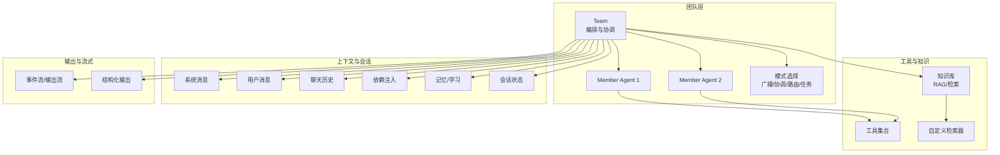

**图表来源**
- [examples/teams/basics/basic-coordination.mdx:74-106](file://examples/teams/basics/basic-coordination.mdx#L74-L106)
- [context/team/overview.mdx:134-164](file://context/team/overview.mdx#L134-L164)

## 详细组件分析

### 基础协调与运行
- 同步与异步协调：通过 Team 的同步与异步接口演示协调流程，包含成员工具调用、响应汇总与最终输出。
- 指令与输出模式：通过输出模式（如 Pydantic 模型）约束最终结果结构。
- 成员工具可见性与响应展示：控制是否将成员工具暴露于上下文，以及是否展示成员响应。

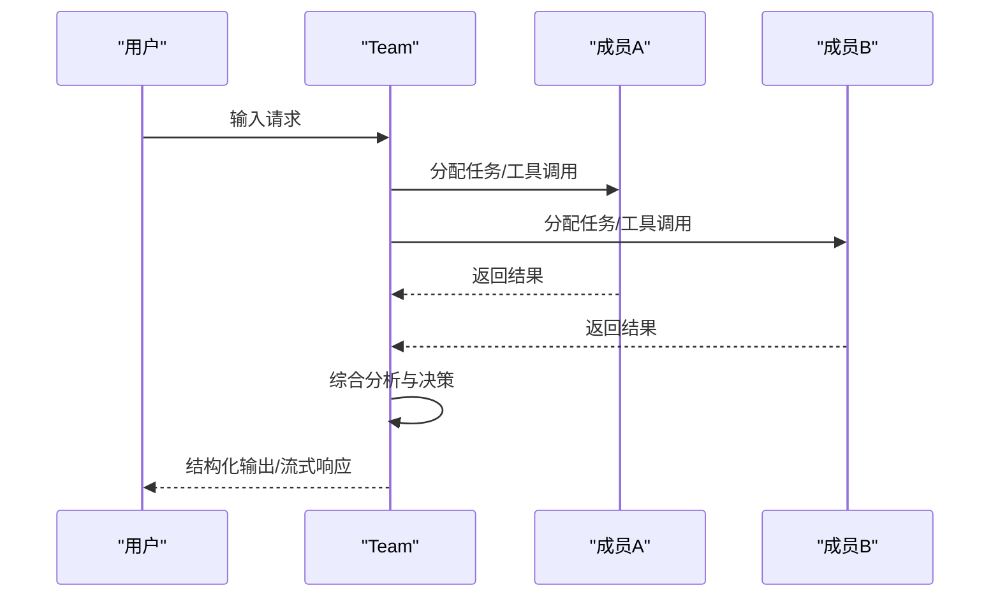

**图表来源**
- [examples/teams/basics/basic-coordination.mdx:74-106](file://examples/teams/basics/basic-coordination.mdx#L74-L106)

**章节来源**
- [examples/teams/basics/basic-coordination.mdx:36-126](file://examples/teams/basics/basic-coordination.mdx#L36-L126)

### 广播模式
- 全员委托：使用 TeamMode.broadcast 将同一任务同时委托给所有成员，收集各自独立评估后由团队汇总。
- 适用场景：评审、对比分析、风险评估等需要多方视角的场景。

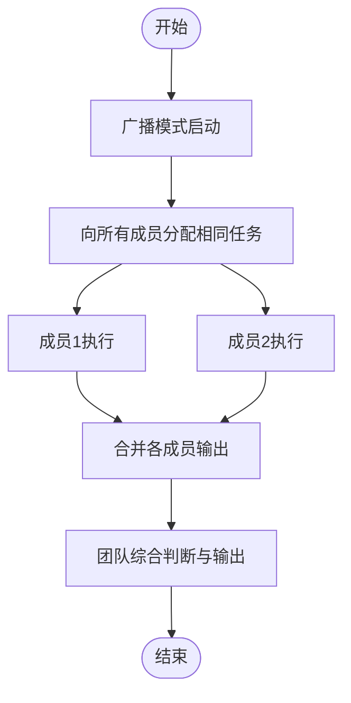

**图表来源**
- [examples/teams/basics/broadcast-mode.mdx:41-53](file://examples/teams/basics/broadcast-mode.mdx#L41-L53)

**章节来源**
- [examples/teams/basics/broadcast-mode.mdx:20-62](file://examples/teams/basics/broadcast-mode.mdx#L20-L62)

### 并发成员代理
- 并发委托：团队同时向多个成员分派任务，提升整体吞吐与响应速度。
- 事件流：支持成员事件流（如工具调用开始/完成、运行开始）以便观测与调试。

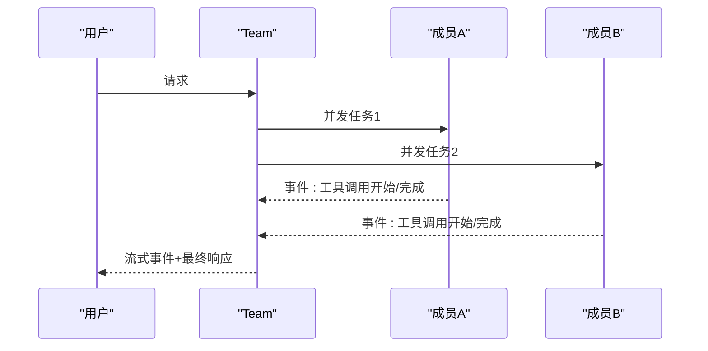

**图表来源**
- [examples/teams/basics/concurrent-member-agents.mdx:52-99](file://examples/teams/basics/concurrent-member-agents.mdx#L52-L99)

**章节来源**
- [examples/teams/basics/concurrent-member-agents.mdx:25-99](file://examples/teams/basics/concurrent-member-agents.mdx#L25-L99)

### 委托给所有成员
- 协作式执行：开启 delegate_to_all_members 后，团队在收到请求时同时向所有成员发起讨论或研究，直至达成共识。
- 适用场景：需要多方协同达成一致的对话式研究或决策。

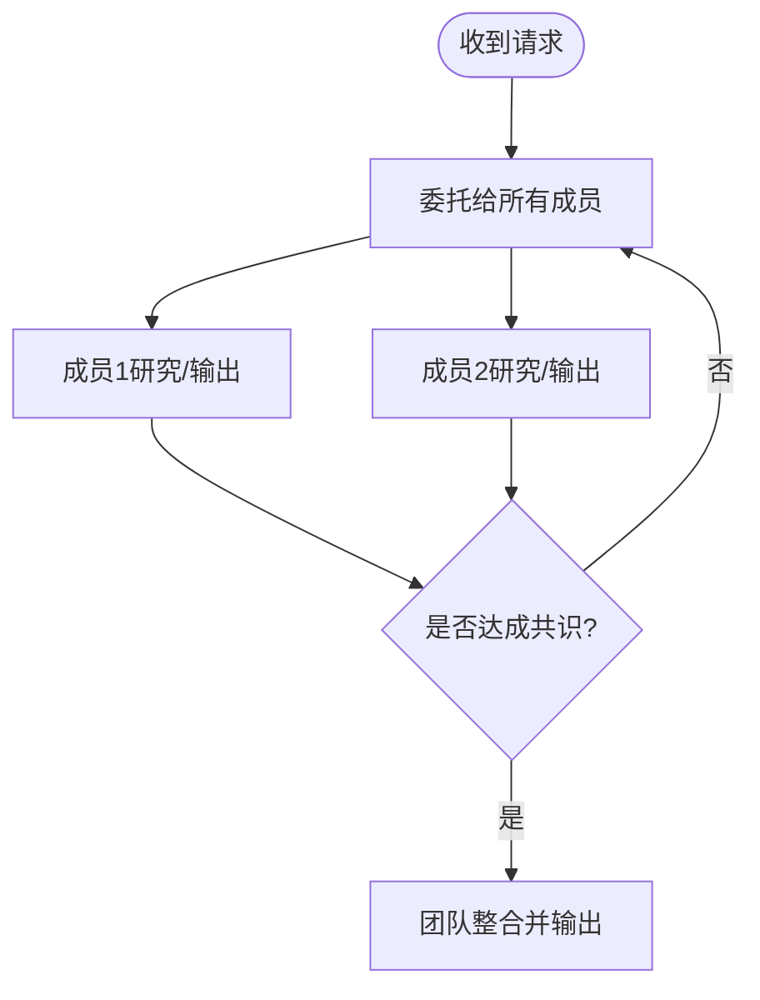

**图表来源**
- [examples/teams/basics/delegate-to-all-members.mdx:54-68](file://examples/teams/basics/delegate-to-all-members.mdx#L54-L68)

**章节来源**
- [examples/teams/basics/delegate-to-all-members.mdx:25-90](file://examples/teams/basics/delegate-to-all-members.mdx#L25-L90)

### 上下文管理示例
- 少样本学习：通过 additional_input 注入示例消息，引导模型遵循特定风格与结构。
- 从历史中过滤工具调用：使用 max_tool_calls_from_history 控制历史工具调用数量，降低上下文长度与成本。
- 系统消息参数：描述、指令、期望输出、Markdown、时间/地点/名称注入、成员工具可见性、会话摘要/记忆/依赖/状态、知识接入、代理知识过滤、自定义系统消息等。

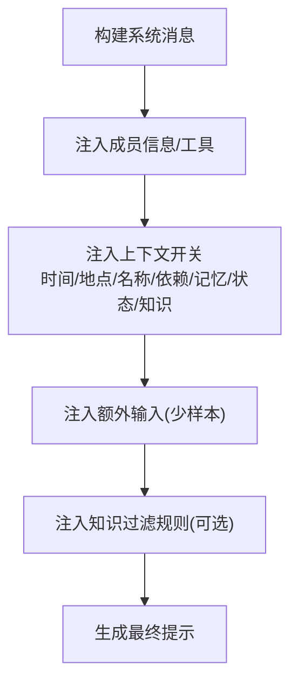

**图表来源**
- [context/team/overview.mdx:134-164](file://context/team/overview.mdx#L134-L164)
- [context/team/filter-tool-calls-from-history.mdx:42-74](file://context/team/filter-tool-calls-from-history.mdx#L42-L74)

**章节来源**
- [context/team/overview.mdx:19-164](file://context/team/overview.mdx#L19-L164)
- [context/team/filter-tool-calls-from-history.mdx:19-74](file://context/team/filter-tool-calls-from-history.mdx#L19-L74)

### 依赖管理示例
- 在上下文中依赖：通过 add_dependencies_to_context 将依赖函数默认注入团队上下文，供后续所有运行使用。
- 在工具中依赖：团队工具可通过 RunContext 访问依赖，实现动态上下文（如当前时间、指标数据）驱动的分析。
- 传递给成员的依赖：在单次运行中通过 dependencies 参数传入，结合 add_dependencies_to_context 实现一次性注入。

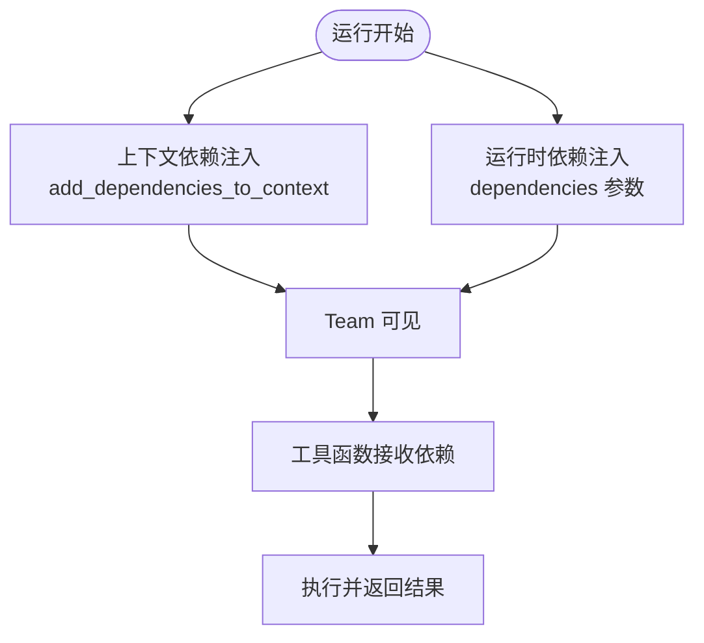

**图表来源**
- [dependencies/team/add-dependencies-to-context.mdx:59-70](file://dependencies/team/add-dependencies-to-context.mdx#L59-L70)
- [dependencies/team/add-dependencies-run.mdx:66-73](file://dependencies/team/add-dependencies-run.mdx#L66-L73)
- [dependencies/team/access-dependencies-in-tool.mdx:95-109](file://dependencies/team/access-dependencies-in-tool.mdx#L95-L109)

**章节来源**
- [dependencies/team/add-dependencies-to-context.mdx:19-70](file://dependencies/team/add-dependencies-to-context.mdx#L19-L70)
- [dependencies/team/add-dependencies-run.mdx:20-73](file://dependencies/team/add-dependencies-run.mdx#L20-L73)
- [dependencies/team/access-dependencies-in-tool.mdx:29-70](file://dependencies/team/access-dependencies-in-tool.mdx#L29-L70)

### 团队模式示例
- 广播：TeamMode.broadcast，全员并行评估。
- 协调：默认模式，由团队领导者进行任务分派与结果汇总。
- 路由：根据任务类型/专家角色将请求路由至合适成员。
- 任务：将复杂任务拆分为子任务，按依赖顺序或并行方式执行。

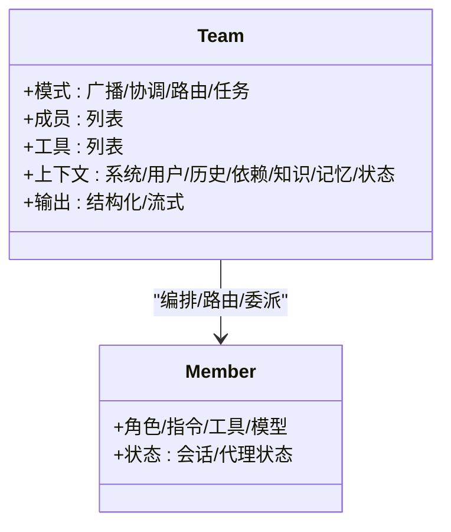

**图表来源**
- [examples/teams/basics/broadcast-mode.mdx:41-53](file://examples/teams/basics/broadcast-mode.mdx#L41-L53)
- [examples/teams/basics/concurrent-member-agents.mdx:52-64](file://examples/teams/basics/concurrent-member-agents.mdx#L52-L64)

**章节来源**
- [examples/teams/basics/broadcast-mode.mdx:41-53](file://examples/teams/basics/broadcast-mode.mdx#L41-L53)
- [examples/teams/basics/concurrent-member-agents.mdx:52-64](file://examples/teams/basics/concurrent-member-agents.mdx#L52-L64)

### 状态管理示例
- 代理会话状态：启用 enable_agentic_state 后，成员可更新会话状态并在上下文中可见。
- 运行时更改状态：通过 session_state 参数在每次运行时覆盖或初始化状态。
- 共享状态：团队级 session_state 在成员间共享，实现跨成员协作。
- 嵌套共享状态：层级团队共享同一会话状态，通过工具函数对共享状态进行增删改查。

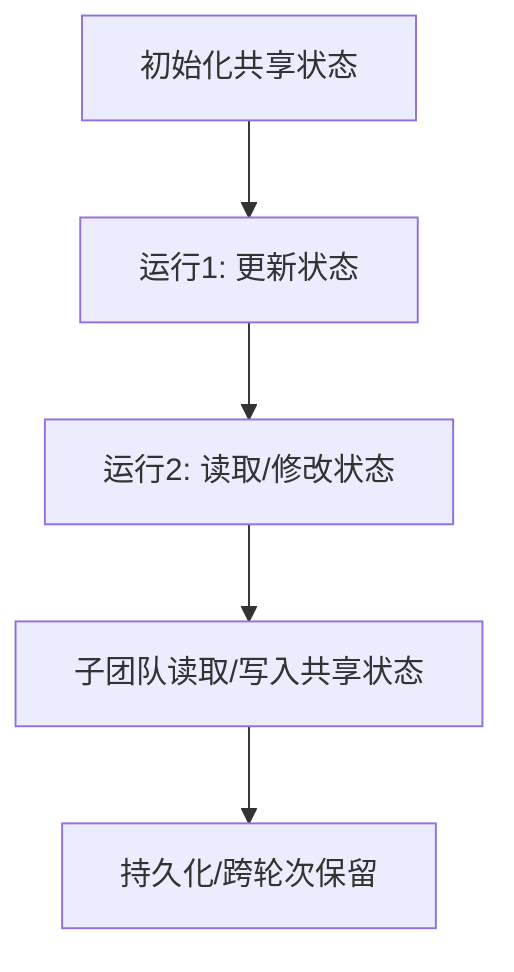

**图表来源**
- [examples/teams/state/agentic-session-state.mdx:38-46](file://examples/teams/state/agentic-session-state.mdx#L38-L46)
- [examples/teams/state/change-state-on-run.mdx:20-25](file://examples/teams/state/change-state-on-run.mdx#L20-L25)
- [examples/teams/state/nested-shared-state.mdx:174-195](file://examples/teams/state/nested-shared-state.mdx#L174-L195)

**章节来源**
- [examples/teams/state/agentic-session-state.mdx:26-55](file://examples/teams/state/agentic-session-state.mdx#L26-L55)
- [examples/teams/state/change-state-on-run.mdx:31-55](file://examples/teams/state/change-state-on-run.mdx#L31-L55)
- [examples/teams/state/nested-shared-state.mdx:25-195](file://examples/teams/state/nested-shared-state.mdx#L25-L195)

### 流式处理示例
- 团队事件：支持成员工具调用事件、运行开始事件等，便于实时观测与调试。
- 团队流式传输：输出内容以流式方式逐步返回，提升用户体验与可观测性。

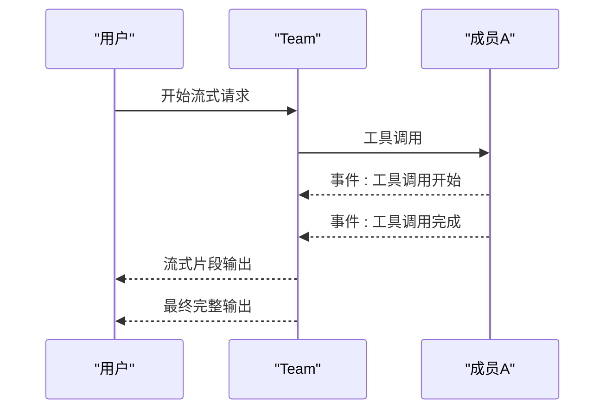

**图表来源**
- [examples/teams/streaming/team-events.mdx](file://examples/teams/streaming/team-events.mdx)
- [examples/teams/streaming/team-streaming.mdx](file://examples/teams/streaming/team-streaming.mdx)

**章节来源**
- [examples/teams/streaming/team-events.mdx](file://examples/teams/streaming/team-events.mdx)
- [examples/teams/streaming/team-streaming.mdx](file://examples/teams/streaming/team-streaming.mdx)

### 结构化输入输出示例
- 输入格式与模式：支持多种输入格式与模式（如 JSON 模式、Pydantic 模型）。
- 输出模型与模式覆盖：通过输出模式约束最终结构，必要时可覆盖默认模式。
- 解析器模式与结构化输出流式传输：结合解析器与流式输出，实现高可靠的结果交付。

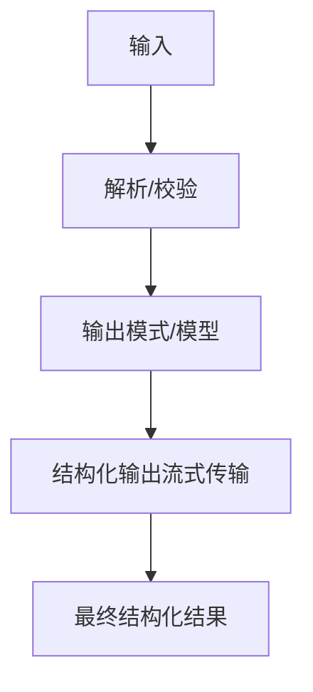

**图表来源**
- [examples/teams/structured-input-output/input-formats.mdx](file://examples/teams/structured-input-output/input-formats.mdx)
- [examples/teams/structured-input-output/input-schema.mdx](file://examples/teams/structured-input-output/input-schema.mdx)
- [examples/teams/structured-input-output/json-schema-output.mdx](file://examples/teams/structured-input-output/json-schema-output.mdx)
- [examples/teams/structured-input-output/output-model.mdx](file://examples/teams/structured-input-output/output-model.mdx)
- [examples/teams/structured-input-output/output-schema-override.mdx](file://examples/teams/structured-input-output/output-schema-override.mdx)
- [examples/teams/structured-input-output/parser-model.mdx](file://examples/teams/structured-input-output/parser-model.mdx)
- [examples/teams/structured-input-output/pydantic-input.mdx](file://examples/teams/structured-input-output/pydantic-input.mdx)
- [examples/teams/structured-input-output/pydantic-output.mdx](file://examples/teams/structured-input-output/pydantic-output.mdx)
- [examples/teams/structured-input-output/response-as-variable.mdx](file://examples/teams/structured-input-output/response-as-variable.mdx)
- [examples/teams/structured-input-output/structured-output-streaming.mdx](file://examples/teams/structured-input-output/structured-output-streaming.mdx)

**章节来源**
- [examples/teams/structured-input-output/input-formats.mdx](file://examples/teams/structured-input-output/input-formats.mdx)
- [examples/teams/structured-input-output/input-schema.mdx](file://examples/teams/structured-input-output/input-schema.mdx)
- [examples/teams/structured-input-output/json-schema-output.mdx](file://examples/teams/structured-input-output/json-schema-output.mdx)
- [examples/teams/structured-input-output/output-model.mdx](file://examples/teams/structured-input-output/output-model.mdx)
- [examples/teams/structured-input-output/output-schema-override.mdx](file://examples/teams/structured-input-output/output-schema-override.mdx)
- [examples/teams/structured-input-output/parser-model.mdx](file://examples/teams/structured-input-output/parser-model.mdx)
- [examples/teams/structured-input-output/pydantic-input.mdx](file://examples/teams/structured-input-output/pydantic-input.mdx)
- [examples/teams/structured-input-output/pydantic-output.mdx](file://examples/teams/structured-input-output/pydantic-output.mdx)
- [examples/teams/structured-input-output/response-as-variable.mdx](file://examples/teams/structured-input-output/response-as-variable.mdx)
- [examples/teams/structured-input-output/structured-output-streaming.mdx](file://examples/teams/structured-input-output/structured-output-streaming.mdx)

### 任务模式示例
- 异步任务模式：支持异步执行与并发调度，提升吞吐。
- 基础任务模式：顺序执行与简单委派。
- 自定义工具：结合自定义工具实现复杂业务逻辑。
- 依赖链：通过依赖关系保证任务执行顺序。
- 并行任务：多个子任务并行执行，缩短总耗时。

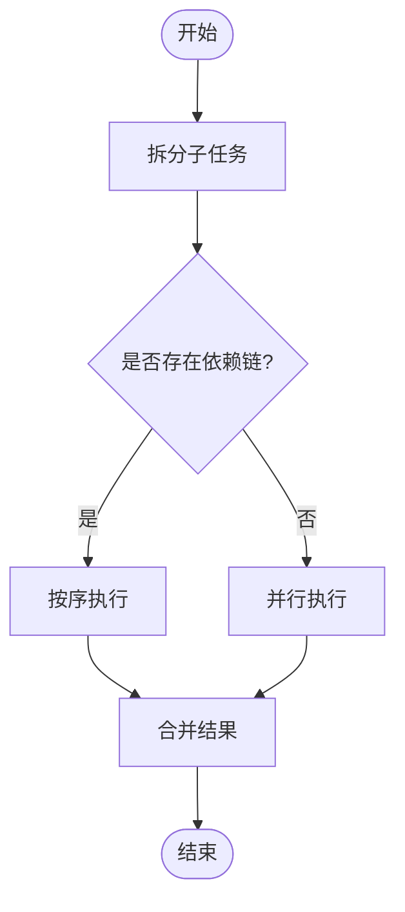

**图表来源**
- [examples/teams/task-mode/async-task-mode.mdx](file://examples/teams/task-mode/async-task-mode.mdx)
- [examples/teams/task-mode/basic-task-mode.mdx](file://examples/teams/task-mode/basic-task-mode.mdx)
- [examples/teams/task-mode/custom-tools.mdx](file://examples/teams/task-mode/custom-tools.mdx)
- [examples/teams/task-mode/dependency-chain.mdx](file://examples/teams/task-mode/dependency-chain.mdx)
- [examples/teams/task-mode/parallel-tasks.mdx](file://examples/teams/task-mode/parallel-tasks.mdx)
- [examples/teams/task-mode/task-mode-with-tools.mdx](file://examples/teams/task-mode/task-mode-with-tools.mdx)

**章节来源**
- [examples/teams/task-mode/async-task-mode.mdx](file://examples/teams/task-mode/async-task-mode.mdx)
- [examples/teams/task-mode/basic-task-mode.mdx](file://examples/teams/task-mode/basic-task-mode.mdx)
- [examples/teams/task-mode/custom-tools.mdx](file://examples/teams/task-mode/custom-tools.mdx)
- [examples/teams/task-mode/dependency-chain.mdx](file://examples/teams/task-mode/dependency-chain.mdx)
- [examples/teams/task-mode/parallel-tasks.mdx](file://examples/teams/task-mode/parallel-tasks.mdx)
- [examples/teams/task-mode/task-mode-with-tools.mdx](file://examples/teams/task-mode/task-mode-with-tools.mdx)

### 工具使用示例
- 异步工具：支持异步工具调用，提升 I/O 密集型任务效率。
- 自定义工具：通过函数注册为工具，供成员或团队直接调用。
- 成员工具钩子：在工具调用前后插入钩子，实现审计、缓存、限流等横切逻辑。

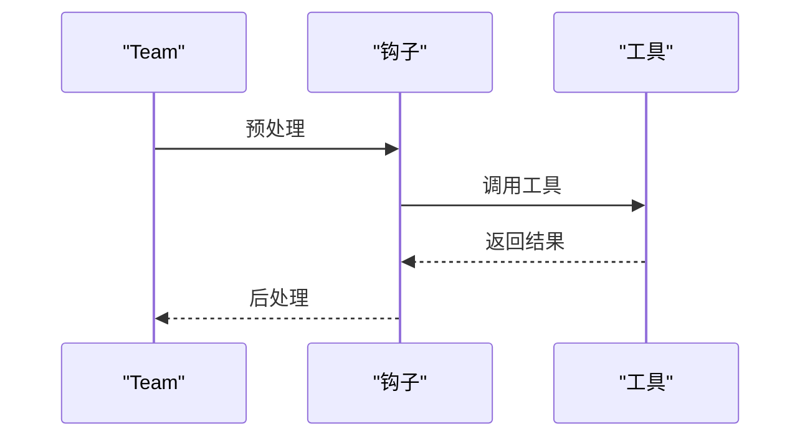

**图表来源**
- [examples/teams/tools/async-tools.mdx](file://examples/teams/tools/async-tools.mdx)
- [examples/teams/tools/custom-tools.mdx](file://examples/teams/tools/custom-tools.mdx)
- [examples/teams/tools/member-tool-hooks.mdx](file://examples/teams/tools/member-tool-hooks.mdx)

**章节来源**
- [examples/teams/tools/async-tools.mdx](file://examples/teams/tools/async-tools.mdx)
- [examples/teams/tools/custom-tools.mdx](file://examples/teams/tools/custom-tools.mdx)
- [examples/teams/tools/member-tool-hooks.mdx](file://examples/teams/tools/member-tool-hooks.mdx)

### 知识管理示例
- 团队知识使用：通过知识库与检索增强团队决策。
- 自定义检索器：基于业务需求定制检索策略与过滤条件。
- 代理知识过滤：允许团队在运行时选择合适的元数据过滤器。

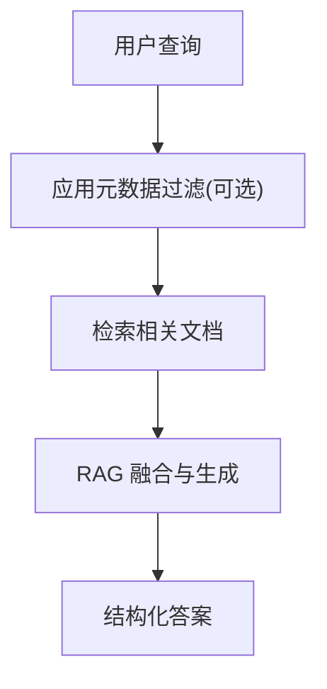

**图表来源**
- [examples/teams/knowledge/team-with-knowledge.mdx](file://examples/teams/knowledge/team-with-knowledge.mdx)
- [examples/teams/knowledge/team-with-custom-retriever.mdx](file://examples/teams/knowledge/team-with-custom-retriever.mdx)
- [examples/teams/knowledge/team-with-agentic-knowledge-filters.mdx](file://examples/teams/knowledge/team-with-agentic-knowledge-filters.mdx)

**章节来源**
- [examples/teams/knowledge/team-with-knowledge.mdx](file://examples/teams/knowledge/team-with-knowledge.mdx)
- [examples/teams/knowledge/team-with-custom-retriever.mdx](file://examples/teams/knowledge/team-with-custom-retriever.mdx)
- [examples/teams/knowledge/team-with-agentic-knowledge-filters.mdx](file://examples/teams/knowledge/team-with-agentic-knowledge-filters.mdx)

### 记忆管理示例
- 团队记忆：通过记忆管理器记录与复用历史交互信息。
- 学习机器：结合学习机制，使团队具备持续改进的能力。

**章节来源**
- [examples/teams/memory/team-with-memory-manager.mdx](file://examples/teams/memory/team-with-memory-manager.mdx)
- [examples/teams/memory/learning-machine.mdx](file://examples/teams/memory/learning-machine.mdx)

### 学习示例
- 团队学习配置：启用学习模式，设置学习策略与存储。
- 团队决策日志：记录决策过程，便于回溯与优化。
- 团队实体记忆：维护与实体相关的记忆片段。
- 团队学到的知识：将经验转化为可复用的知识。
- 团队会话规划：在会话层面进行规划与总结。

**章节来源**
- [examples/teams/learning/team-configured-learning.mdx](file://examples/teams/learning/team-configured-learning.mdx)
- [examples/teams/learning/team-decision-log.mdx](file://examples/teams/learning/team-decision-log.mdx)
- [examples/teams/learning/team-entity-memory.mdx](file://examples/teams/learning/team-entity-memory.mdx)
- [examples/teams/learning/team-learned-knowledge.mdx](file://examples/teams/learning/team-learned-knowledge.mdx)
- [examples/teams/learning/team-session-planning.mdx](file://examples/teams/learning/team-session-planning.mdx)

### 保护机制示例
- 团队保护：通过保护机制限制不当输入与输出。
- PII 检测：检测并屏蔽个人敏感信息。

**章节来源**
- [examples/teams/guardrails/pii-detection.mdx](file://examples/teams/guardrails/pii-detection.mdx)

### 钩子系统示例
- 团队钩子：在团队生命周期的关键节点插入钩子，实现审计、监控与扩展。
- 工具钩子：在工具调用前后执行钩子逻辑。

**章节来源**
- [examples/teams/hooks/pre-hook-input.mdx](file://examples/teams/hooks/pre-hook-input.mdx)
- [examples/teams/hooks/post-hook-output.mdx](file://examples/teams/hooks/post-hook-output.mdx)
- [examples/teams/hooks/stream-hook.mdx](file://examples/teams/hooks/stream-hook.mdx)

### 人机交互示例
- 团队确认：在关键操作前要求人工确认。
- 外部工具执行：允许外部工具在受控环境下执行。

**章节来源**
- [examples/teams/human-in-the-loop/confirmation-required.mdx](file://examples/teams/human-in-the-loop/confirmation-required.mdx)
- [examples/teams/human-in-the-loop/external-tool-execution.mdx](file://examples/teams/human-in-the-loop/external-tool-execution.mdx)

### 多模态示例
- 音频情感分析、音频转文本、图像生成、图像变换、视频字幕生成等多模态能力集成到团队中，实现跨模态协作。

**章节来源**
- [examples/teams/multimodal/audio-sentiment-analysis.mdx](file://examples/teams/multimodal/audio-sentiment-analysis.mdx)
- [examples/teams/multimodal/audio-to-text.mdx](file://examples/teams/multimodal/audio-to-text.mdx)
- [examples/teams/multimodal/generate-image-with-team.mdx](file://examples/teams/multimodal/generate-image-with-team.mdx)
- [examples/teams/multimodal/image-to-image-transformation.mdx](file://examples/teams/multimodal/image-to-image-transformation.mdx)
- [examples/teams/multimodal/image-to-text.mdx](file://examples/teams/multimodal/image-to-text.mdx)
- [examples/teams/multimodal/video-caption-generation.mdx](file://examples/teams/multimodal/video-caption-generation.mdx)

### 推理示例
- 多用途团队推理：团队在不同领域与任务中进行推理与决策。

**章节来源**
- [examples/teams/reasoning/reasoning-multi-purpose-team.mdx](file://examples/teams/reasoning/reasoning-multi-purpose-team.mdx)

### 运行控制示例
- 取消运行：支持在运行过程中取消当前执行。
- 模型继承：子团队/成员可继承父级模型配置。
- 重试：在失败时自动重试或回退策略。

**章节来源**
- [examples/teams/run-control/cancel-run.mdx](file://examples/teams/run-control/cancel-run.mdx)
- [examples/teams/run-control/model-inheritance.mdx](file://examples/teams/run-control/model-inheritance.mdx)
- [examples/teams/run-control/retries.mdx](file://examples/teams/run-control/retries.mdx)

### 搜索协调示例
- 分布式无限搜索：在多个数据源上进行分布式搜索与聚合。
- 分布式 RAG：在多个向量数据库上进行分布式检索增强生成。

**章节来源**
- [examples/teams/search-coordination/distributed-infinity-search.mdx](file://examples/teams/search-coordination/distributed-infinity-search.mdx)
- [examples/teams/search-coordination/coordinated-agentic-rag.mdx](file://examples/teams/search-coordination/coordinated-agentic-rag.mdx)
- [examples/teams/search-coordination/coordinated-reasoning-rag.mdx](file://examples/teams/search-coordination/coordinated-reasoning-rag.mdx)

## 依赖关系分析
团队示例在多个维度存在耦合与依赖：
- 组件内聚：Team 与 Agent、Tool、DB、Knowledge、Memory 等模块紧密协作。
- 外部依赖：模型提供商、数据库、知识库、向量数据库等。
- 横切关注：流式、钩子、保护、学习、记忆等模块横切贯穿核心路径。

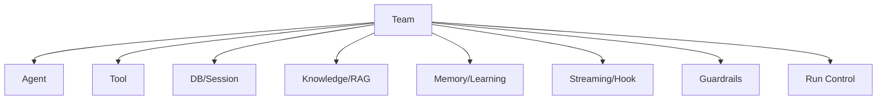

**图表来源**
- [examples/teams/basics/basic-coordination.mdx:74-106](file://examples/teams/basics/basic-coordination.mdx#L74-L106)
- [context/team/overview.mdx:134-164](file://context/team/overview.mdx#L134-L164)

**章节来源**
- [examples/teams/basics/basic-coordination.mdx:74-106](file://examples/teams/basics/basic-coordination.mdx#L74-L106)
- [context/team/overview.mdx:134-164](file://context/team/overview.mdx#L134-L164)

## 性能考量
- 上下文压缩：通过 max_tool_calls_from_history 与历史加载控制减少上下文长度。
- 缓存策略：利用模型侧 prompt 缓存与静态内容前缀化，降低重复 token。
- 并发与异步：并发成员与异步工具显著提升吞吐。
- 状态持久化：合理使用会话状态与数据库，避免重复计算与无谓开销。

[本节为通用指导，无需特定文件引用]

## 故障排查指南
- 依赖未生效：检查 add_dependencies_to_context 与 dependencies 参数是否正确设置。
- 工具调用异常：查看工具钩子与流式事件，定位调用阶段问题。
- 状态不一致：核对共享状态与嵌套团队的写入时机，确保幂等与一致性。
- 会话历史过多：启用 max_tool_calls_from_history 与 num_history_runs 控制历史规模。
- 保护触发：检查 PII 检测与防护规则，确保合规。

**章节来源**
- [dependencies/team/add-dependencies-to-context.mdx:63-70](file://dependencies/team/add-dependencies-to-context.mdx#L63-L70)
- [context/team/filter-tool-calls-from-history.mdx:62-74](file://context/team/filter-tool-calls-from-history.mdx#L62-L74)
- [examples/teams/guardrails/pii-detection.mdx](file://examples/teams/guardrails/pii-detection.mdx)

## 结论
团队示例覆盖了从基础协调到高级协作的全栈能力，包括上下文工程、依赖注入、状态管理、流式传输、结构化输出、任务编排、工具体系、知识与记忆、学习、保护、钩子、人机交互、多模态、推理、运行控制与搜索协调。通过这些示例，用户可以快速搭建可扩展、可观测、可演化的多智能体协作系统，并在生产环境中稳定落地。

[本节为总结性内容，无需特定文件引用]

## 附录
- 快速开始：克隆仓库、创建虚拟环境、安装依赖、导出 API Key、运行示例脚本。
- 示例清单：按功能域列出可直接运行的示例文件路径与用途，便于快速定位与复用。

[本节为概览性内容，无需特定文件引用]